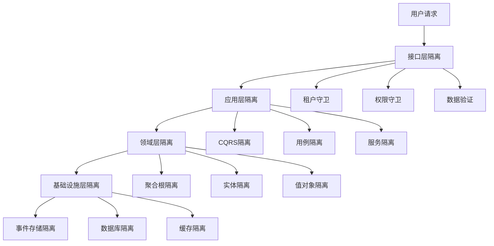

# Hybrid-Architecture 数据隔离机制设计文档

> **版本**: 1.0.0 | **创建日期**: 2025-01-27 | **用途**: 阐述混合架构中的数据隔离机制

---

## 📋 目录

- [1. 概述](#1-概述)
- [2. 数据隔离架构](#2-数据隔离架构)
- [3. 多租户隔离机制](#3-多租户隔离机制)
- [4. CQRS 数据隔离](#4-cqrs-数据隔离)
- [5. 事件溯源隔离](#5-事件溯源隔离)
- [6. 接口层隔离](#6-接口层隔离)
- [7. 实现细节](#7-实现细节)
- [8. 最佳实践](#8-最佳实践)

---

## 1. 概述

### 1.1 设计目标

HL8 SAAS 平台的混合架构（Clean Architecture + DDD + CQRS + ES + EDA）实现了全面的数据隔离机制，确保：

- **多租户数据隔离**：不同租户的数据完全隔离，互不干扰
- **用户权限隔离**：基于角色的访问控制，确保数据安全
- **业务边界隔离**：不同业务域之间的数据访问控制
- **操作审计隔离**：完整的数据访问和操作审计追踪

### 1.2 隔离层级



---

## 2. 数据隔离架构

### 2.1 架构分层隔离

混合架构的每一层都实现了相应的数据隔离机制：

#### **接口层（Interface Layer）**

- **租户守卫**：验证租户身份和权限
- **权限守卫**：验证用户权限和资源访问权限
- **数据验证**：验证请求数据的完整性和合法性

#### **应用层（Application Layer）**

- **CQRS隔离**：命令和查询的租户隔离
- **用例隔离**：业务用例的租户上下文管理
- **服务隔离**：应用服务的多租户支持

#### **领域层（Domain Layer）**

- **聚合根隔离**：聚合根级别的租户隔离
- **实体隔离**：实体的租户上下文绑定
- **值对象隔离**：值对象的租户验证

#### **基础设施层（Infrastructure Layer）**

- **事件存储隔离**：事件存储的租户隔离
- **数据库隔离**：数据库层面的租户隔离
- **缓存隔离**：缓存的租户隔离

### 2.2 隔离策略

系统支持多种数据隔离策略：

```typescript
// 数据隔离策略枚举
enum DataIsolationStrategy {
  // 行级隔离：所有数据在同一数据库中，通过租户ID字段隔离
  ROW_LEVEL = 'row_level',
  
  // 数据库级隔离：每个租户使用独立的数据库
  DATABASE_LEVEL = 'database_level',
  
  // 模式级隔离：每个租户使用独立的数据库模式
  SCHEMA_LEVEL = 'schema_level',
  
  // 应用级隔离：通过应用逻辑实现隔离
  APPLICATION_LEVEL = 'application_level'
}
```

---

## 3. 多租户隔离机制

### 3.1 租户上下文管理

#### **租户上下文信息**

```typescript
/**
 * 租户上下文信息
 *
 * @description 定义租户上下文的数据结构
 */
export class TenantContextInfo {
  constructor(
    public readonly tenantId: string,
    public readonly accessLevel: 'owner' | 'guest'
  ) {}
}
```

#### **租户上下文管理器**

```typescript
/**
 * 租户上下文管理器
 *
 * @description 管理租户上下文信息
 */
export class TenantContextManager {
  private static currentTenant: TenantContextInfo | null = null;

  /**
   * 设置当前租户
   */
  static setCurrentTenant(tenantContext: TenantContextInfo): void {
    this.currentTenant = tenantContext;
  }

  /**
   * 获取当前租户
   */
  static getCurrentTenant(): TenantContextInfo | null {
    return this.currentTenant;
  }

  /**
   * 清除租户上下文
   */
  static clearTenantContext(): void {
    this.currentTenant = null;
  }
}
```

### 3.2 租户守卫机制

#### **通用租户守卫**

```typescript
/**
 * 租户守卫
 *
 * @description 验证租户信息，确保多租户数据隔离
 */
@Injectable()
export class TenantGuard implements CanActivate {
  async canActivate(context: ExecutionContext): Promise<boolean> {
    const request = context.switchToHttp().getRequest<FastifyRequest>();
    const user = request['user'];

    // 1. 验证用户认证
    if (!user) {
      throw new BadRequestException('用户未认证');
    }

    // 2. 提取租户ID
    const tenantId = this.extractTenantId(request);
    if (!tenantId) {
      throw new BadRequestException('未提供租户ID');
    }

    // 3. 验证租户ID格式
    if (!this.isValidTenantId(tenantId)) {
      throw new BadRequestException('无效的租户ID格式');
    }

    // 4. 验证用户是否属于该租户
    if (!this.isUserInTenant(user, tenantId)) {
      throw new BadRequestException('用户不属于指定租户');
    }

    // 5. 设置租户上下文
    request['tenantId'] = tenantId;
    request['tenantContext'] = {
      tenantId,
      userId: user.id,
      userRoles: user.roles || [],
      userPermissions: user.permissions || [],
    };

    return true;
  }

  /**
   * 从请求中提取租户ID
   */
  private extractTenantId(request: FastifyRequest): string | null {
    // 1. 从请求头获取
    const headerTenantId = request.headers['x-tenant-id'] as string;
    if (headerTenantId) {
      return headerTenantId;
    }

    // 2. 从查询参数获取
    const queryTenantId = (request.query as { tenantId?: string })?.tenantId;
    if (queryTenantId) {
      return queryTenantId;
    }

    // 3. 从路径参数获取
    const pathTenantId = (request.params as { tenantId?: string })?.tenantId;
    if (pathTenantId) {
      return pathTenantId;
    }

    return null;
  }
}
```

#### **租户隔离守卫**

```typescript
/**
 * 租户隔离守卫
 *
 * @description 实现租户数据隔离
 */
@Injectable()
export class TenantIsolationGuard implements CanActivate {
  async canActivate(context: ExecutionContext): Promise<boolean> {
    const request = context.switchToHttp().getRequest();
    const user = request.user as IUserContext;

    // 1. 获取请求中的租户信息
    const requestTenantId = this.extractTenantId(request);

    // 2. 验证用户是否属于该租户
    if (requestTenantId && requestTenantId !== user.tenantId) {
      // 检查用户是否有跨租户权限
      const hasCrossTenantAccess = await this.tenantService.hasCrossTenantAccess(
        user.userId,
        requestTenantId
      );

      if (!hasCrossTenantAccess) {
        throw new ForbiddenException('无权限访问其他租户数据');
      }
    }

    // 3. 设置租户上下文
    const tenantContext = new TenantContextInfo(
      requestTenantId || user.tenantId,
      user.tenantId === requestTenantId ? 'owner' : 'guest'
    );

    request.tenantContext = tenantContext;
    TenantContextManager.setCurrentTenant(tenantContext);

    return true;
  }
}
```

### 3.3 租户ID提取策略

系统支持从多个位置提取租户ID，优先级如下：

1. **请求头** (`x-tenant-id`)
2. **查询参数** (`?tenantId=xxx`)
3. **路径参数** (`/tenants/{tenantId}/...`)
4. **请求体** (`body.tenantId`)

---

## 4. CQRS 数据隔离

### 4.1 命令隔离

#### **基础命令类**

```typescript
/**
 * 基础命令类
 *
 * @description 所有命令的基类，提供租户隔离支持
 */
export abstract class BaseCommand {
  constructor(
    public readonly tenantId: string,
    public readonly userId: string,
    public readonly commandVersion = 1,
    public readonly metadata: Record<string, unknown> = {}
  ) {}

  /**
   * 检查命令是否属于指定租户
   */
  belongsToTenant(tenantId: string): boolean {
    return this.tenantId === tenantId;
  }

  /**
   * 获取命令的租户上下文
   */
  getTenantContext(): TenantContextInfo {
    return new TenantContextInfo(this.tenantId, 'owner');
  }
}
```

#### **命令处理器隔离**

```typescript
/**
 * 基础命令处理器
 *
 * @description 提供命令处理的租户隔离
 */
export abstract class BaseCommandHandler<TCommand extends BaseCommand, TResult = void> {
  protected async executeCommand(command: TCommand): Promise<TResult> {
    // 1. 验证租户权限
    await this.validateTenantAccess(command);

    // 2. 设置租户上下文
    TenantContextManager.setCurrentTenant(command.getTenantContext());

    try {
      // 3. 执行命令处理
      return await this.handleCommand(command);
    } finally {
      // 4. 清理租户上下文
      TenantContextManager.clearTenantContext();
    }
  }

  protected abstract handleCommand(command: TCommand): Promise<TResult>;

  protected async validateTenantAccess(command: TCommand): Promise<void> {
    // 租户访问权限验证逻辑
  }
}
```

### 4.2 查询隔离

#### **基础查询类**

```typescript
/**
 * 基础查询类
 *
 * @description 所有查询的基类，提供租户隔离支持
 */
export abstract class BaseQuery {
  constructor(
    public readonly tenantId: string,
    public readonly userId: string,
    public readonly page = 1,
    public readonly pageSize = 10,
    public readonly requestId?: string
  ) {}
}
```

#### **查询处理器隔离**

```typescript
/**
 * 基础查询处理器
 *
 * @description 提供查询处理的租户隔离和缓存支持
 */
export abstract class BaseQueryHandler<TQuery extends BaseQuery, TResult> {
  protected async executeQuery(query: TQuery): Promise<TResult> {
    // 1. 验证租户权限
    await this.validateTenantAccess(query);

    // 2. 设置租户上下文
    const tenantContext = new TenantContextInfo(query.tenantId, 'owner');
    TenantContextManager.setCurrentTenant(tenantContext);

    try {
      // 3. 检查缓存
      const cacheKey = this.getCacheKey(query);
      const cachedResult = await this.getFromCache(cacheKey);
      if (cachedResult) {
        return cachedResult;
      }

      // 4. 执行查询
      const result = await this.handleQuery(query);

      // 5. 缓存结果
      await this.setCache(cacheKey, result);

      return result;
    } finally {
      // 6. 清理租户上下文
      TenantContextManager.clearTenantContext();
    }
  }

  /**
   * 生成缓存键，包含租户隔离
   */
  protected getCacheKey(query: TQuery): string {
    const baseKey = `${this.queryType}:${query.queryId}`;
    const tenantId = query.tenantId || 'global';
    return `${baseKey}:${tenantId}`;
  }

  protected abstract handleQuery(query: TQuery): Promise<TResult>;
}
```

---

## 5. 事件溯源隔离

### 5.1 事件存储隔离

#### **事件存储接口**

```typescript
/**
 * 事件存储接口
 *
 * @description 提供租户隔离的事件存储
 */
export interface IEventStore {
  /**
   * 按租户获取事件
   *
   * @description 获取指定租户的事件
   * @param tenantId - 租户ID
   * @param fromDate - 开始日期
   * @param toDate - 结束日期
   * @returns 事件列表
   */
  getEventsByTenant(
    tenantId: string,
    fromDate?: Date,
    toDate?: Date
  ): Promise<unknown[]>;

  /**
   * 保存事件（带租户隔离）
   */
  saveEvents(
    aggregateId: string,
    events: unknown[],
    expectedVersion: number,
    tenantId?: string
  ): Promise<void>;
}
```

#### **事件存储适配器**

```typescript
/**
 * 事件存储适配器
 *
 * @description 实现租户隔离的事件存储
 */
export class EventStoreAdapter implements IEventStore {
  async saveEvents(
    aggregateId: string,
    events: unknown[],
    expectedVersion: number,
    tenantId?: string
  ): Promise<void> {
    const eventMetadata = {
      aggregateId,
      expectedVersion,
      tenantId,
      timestamp: new Date().toISOString(),
    };

    // 保存事件，包含租户信息
    for (const event of events) {
      await this.eventRepository.save({
        ...event,
        metadata: {
          ...eventMetadata,
          tenantId: tenantId || 'global',
        },
      });
    }
  }

  async getEventsByTenant(
    tenantId: string,
    fromDate?: Date,
    toDate?: Date
  ): Promise<unknown[]> {
    const query: any = {
      'metadata.tenantId': tenantId,
    };

    if (fromDate || toDate) {
      query.timestamp = {};
      if (fromDate) {
        query.timestamp.$gte = fromDate;
      }
      if (toDate) {
        query.timestamp.$lte = toDate;
      }
    }

    return await this.eventRepository.find(query);
  }
}
```

### 5.2 聚合根隔离

#### **基础聚合根**

```typescript
/**
 * 基础聚合根类
 *
 * @description 提供租户隔离的聚合根
 */
export abstract class BaseAggregateRoot extends BaseEntity implements IAggregateRoot {
  private _domainEvents: BaseDomainEvent[] = [];
  private _uncommittedEvents: BaseDomainEvent[] = [];

  /**
   * 添加领域事件
   *
   * 自动绑定多租户上下文信息
   */
  public addDomainEvent(event: BaseDomainEvent): void {
    // 尝试绑定多租户上下文信息
    try {
      const tenantContext = this.getTenantContext?.() || {
        tenantId: 'default',
      };
      
      if (tenantContext) {
        // 如果事件支持租户上下文，则绑定相关信息
        if ('tenantId' in event && !event.tenantId) {
          (event as any).tenantId = tenantContext.tenantId;
        }
        if ('userId' in event && !event.userId && tenantContext.userId) {
          (event as any).userId = tenantContext.userId;
        }
        if ('requestId' in event && !event.requestId && tenantContext.requestId) {
          (event as any).requestId = tenantContext.requestId;
        }
      }
    } catch (error) {
      console.warn('Failed to bind tenant context to domain event:', error);
    }

    this._domainEvents.push(event);
    this._uncommittedEvents.push(event);
  }

  /**
   * 获取租户上下文
   */
  protected getTenantContext(): ITenantContext | null {
    return TenantContextManager.getCurrentTenant();
  }
}
```

---

## 6. 接口层隔离

### 6.1 权限守卫

```typescript
/**
 * 权限守卫
 *
 * @description 提供细粒度的权限控制和租户隔离
 */
@Injectable()
export class PermissionGuard implements CanActivate {
  constructor(
    private readonly permissionService: IPermissionService,
    private readonly tenantGuard: TenantGuard
  ) {}

  async canActivate(context: ExecutionContext): Promise<boolean> {
    // 1. 首先执行租户守卫
    const tenantValid = await this.tenantGuard.canActivate(context);
    if (!tenantValid) {
      return false;
    }

    const request = context.switchToHttp().getRequest();
    const user = request['user'];
    const tenantContext = request['tenantContext'];

    // 2. 验证权限
    const hasPermission = await this.permissionService.checkPermission(
      user.id,
      tenantContext.tenantId,
      this.getRequiredPermission(context)
    );

    if (!hasPermission) {
      throw new ForbiddenException('权限不足');
    }

    return true;
  }

  private getRequiredPermission(context: ExecutionContext): string {
    // 从装饰器或元数据中获取所需权限
    const handler = context.getHandler();
    const permission = Reflect.getMetadata('permission', handler);
    return permission;
  }
}
```

### 6.2 数据验证隔离

```typescript
/**
 * 数据验证管道
 *
 * @description 提供租户隔离的数据验证
 */
@Injectable()
export class ValidationPipe implements PipeTransform {
  constructor(private readonly validator: IValidator) {}

  async transform(value: any, metadata: ArgumentMetadata): Promise<any> {
    // 1. 基础数据验证
    const validationResult = await this.validator.validate(value, metadata);
    if (!validationResult.isValid) {
      throw new BadRequestException('数据验证失败');
    }

    // 2. 租户隔离验证
    await this.validateTenantIsolation(value);

    return value;
  }

  private async validateTenantIsolation(value: any): Promise<void> {
    const currentTenant = TenantContextManager.getCurrentTenant();
    if (!currentTenant) {
      throw new ForbiddenException('缺少租户上下文');
    }

    // 验证数据是否属于当前租户
    if (value.tenantId && value.tenantId !== currentTenant.tenantId) {
      throw new ForbiddenException('数据不属于当前租户');
    }
  }
}
```

---

## 7. 实现细节

### 7.1 缓存隔离

#### **缓存键生成策略**

```typescript
/**
 * 缓存键生成器
 *
 * @description 生成包含租户隔离的缓存键
 */
export class CacheKeyGenerator {
  /**
   * 生成租户隔离的缓存键
   */
  static generateTenantKey(baseKey: string, tenantId: string): string {
    return `${baseKey}:tenant:${tenantId}`;
  }

  /**
   * 生成用户隔离的缓存键
   */
  static generateUserKey(baseKey: string, tenantId: string, userId: string): string {
    return `${baseKey}:tenant:${tenantId}:user:${userId}`;
  }

  /**
   * 生成查询缓存键
   */
  static generateQueryKey(
    queryType: string,
    queryId: string,
    tenantId: string,
    params?: Record<string, unknown>
  ): string {
    let key = `${queryType}:${queryId}:tenant:${tenantId}`;
    
    if (params) {
      const sortedParams = Object.keys(params)
        .sort()
        .map(key => `${key}:${params[key]}`)
        .join(':');
      key += `:${sortedParams}`;
    }
    
    return key;
  }
}
```

### 7.2 数据库隔离

#### **数据库连接管理**

```typescript
/**
 * 数据库连接管理器
 *
 * @description 管理多租户数据库连接
 */
export class DatabaseConnectionManager {
  private connections: Map<string, Connection> = new Map();

  /**
   * 获取租户数据库连接
   */
  async getTenantConnection(tenantId: string): Promise<Connection> {
    if (!this.connections.has(tenantId)) {
      const connection = await this.createTenantConnection(tenantId);
      this.connections.set(tenantId, connection);
    }
    
    return this.connections.get(tenantId)!;
  }

  /**
   * 创建租户数据库连接
   */
  private async createTenantConnection(tenantId: string): Promise<Connection> {
    const config = await this.getTenantDatabaseConfig(tenantId);
    return await createConnection(config);
  }

  /**
   * 获取租户数据库配置
   */
  private async getTenantDatabaseConfig(tenantId: string): Promise<any> {
    // 根据租户ID获取数据库配置
    // 支持不同的隔离策略
    const isolationStrategy = await this.getTenantIsolationStrategy(tenantId);
    
    switch (isolationStrategy) {
      case DataIsolationStrategy.DATABASE_LEVEL:
        return {
          database: `tenant_${tenantId}`,
          // 其他数据库配置
        };
      
      case DataIsolationStrategy.SCHEMA_LEVEL:
        return {
          schema: `tenant_${tenantId}`,
          // 其他数据库配置
        };
      
      case DataIsolationStrategy.ROW_LEVEL:
      case DataIsolationStrategy.APPLICATION_LEVEL:
      default:
        return {
          // 默认数据库配置
        };
    }
  }
}
```

### 7.3 日志隔离

#### **审计日志隔离**

```typescript
/**
 * 审计日志服务
 *
 * @description 提供租户隔离的审计日志
 */
export class AuditLogService {
  /**
   * 记录操作日志
   */
  async logOperation(
    operation: string,
    details: Record<string, unknown>,
    tenantId?: string
  ): Promise<void> {
    const currentTenant = TenantContextManager.getCurrentTenant();
    const logTenantId = tenantId || currentTenant?.tenantId || 'global';

    const auditLog = {
      operation,
      details,
      tenantId: logTenantId,
      timestamp: new Date(),
      userId: details.userId,
      requestId: details.requestId,
    };

    await this.auditRepository.save(auditLog);
  }

  /**
   * 查询租户审计日志
   */
  async getTenantAuditLogs(
    tenantId: string,
    fromDate?: Date,
    toDate?: Date
  ): Promise<AuditLog[]> {
    const query: any = {
      tenantId,
    };

    if (fromDate || toDate) {
      query.timestamp = {};
      if (fromDate) {
        query.timestamp.$gte = fromDate;
      }
      if (toDate) {
        query.timestamp.$lte = toDate;
      }
    }

    return await this.auditRepository.find(query);
  }
}
```

---

## 8. 最佳实践

### 8.1 租户隔离最佳实践

#### **1. 始终验证租户上下文**

```typescript
// ✅ 正确：始终验证租户上下文
async createUser(userData: CreateUserData): Promise<User> {
  const tenantContext = TenantContextManager.getCurrentTenant();
  if (!tenantContext) {
    throw new ForbiddenException('缺少租户上下文');
  }

  const user = User.create({
    ...userData,
    tenantId: tenantContext.tenantId,
  });

  return await this.userRepository.save(user);
}

// ❌ 错误：未验证租户上下文
async createUser(userData: CreateUserData): Promise<User> {
  const user = User.create(userData);
  return await this.userRepository.save(user);
}
```

#### **2. 使用租户隔离的缓存键**

```typescript
// ✅ 正确：使用租户隔离的缓存键
async getUser(userId: string): Promise<User> {
  const tenantContext = TenantContextManager.getCurrentTenant();
  const cacheKey = CacheKeyGenerator.generateUserKey(
    'user',
    tenantContext.tenantId,
    userId
  );

  let user = await this.cacheService.get(cacheKey);
  if (!user) {
    user = await this.userRepository.findByIdAndTenant(userId, tenantContext.tenantId);
    await this.cacheService.set(cacheKey, user, 300);
  }

  return user;
}

// ❌ 错误：未使用租户隔离的缓存键
async getUser(userId: string): Promise<User> {
  const cacheKey = `user:${userId}`;
  // 可能返回其他租户的数据
}
```

#### **3. 事件发布包含租户信息**

```typescript
// ✅ 正确：事件包含租户信息
class UserAggregate extends BaseAggregateRoot {
  updateProfile(profile: UserProfile): void {
    this._profile = profile;
    
    const event = new UserProfileUpdatedEvent(
      this.id,
      this.version,
      this.tenantId, // 包含租户信息
      profile
    );
    
    this.addDomainEvent(event);
  }
}

// ❌ 错误：事件不包含租户信息
class UserAggregate extends BaseAggregateRoot {
  updateProfile(profile: UserProfile): void {
    this._profile = profile;
    
    const event = new UserProfileUpdatedEvent(
      this.id,
      this.version,
      // 缺少租户信息
      profile
    );
    
    this.addDomainEvent(event);
  }
}
```

### 8.2 性能优化最佳实践

#### **1. 批量操作优化**

```typescript
// ✅ 正确：批量操作使用租户隔离
async batchCreateUsers(usersData: CreateUserData[]): Promise<User[]> {
  const tenantContext = TenantContextManager.getCurrentTenant();
  
  const users = usersData.map(data => User.create({
    ...data,
    tenantId: tenantContext.tenantId,
  }));

  return await this.userRepository.batchSave(users);
}

// ❌ 错误：逐个创建用户
async batchCreateUsers(usersData: CreateUserData[]): Promise<User[]> {
  const users: User[] = [];
  for (const data of usersData) {
    const user = await this.createUser(data);
    users.push(user);
  }
  return users;
}
```

#### **2. 查询优化**

```typescript
// ✅ 正确：查询包含租户过滤
async getUsers(filters: UserFilters): Promise<User[]> {
  const tenantContext = TenantContextManager.getCurrentTenant();
  
  const query = {
    ...filters,
    tenantId: tenantContext.tenantId, // 强制租户过滤
  };

  return await this.userRepository.find(query);
}

// ❌ 错误：查询未包含租户过滤
async getUsers(filters: UserFilters): Promise<User[]> {
  // 可能返回其他租户的数据
  return await this.userRepository.find(filters);
}
```

### 8.3 安全最佳实践

#### **1. 输入验证**

```typescript
// ✅ 正确：验证租户ID格式
private isValidTenantId(tenantId: string): boolean {
  const uuidRegex = /^[0-9a-f]{8}-[0-9a-f]{4}-[1-5][0-9a-f]{3}-[89ab][0-9a-f]{3}-[0-9a-f]{12}$/i;
  return uuidRegex.test(tenantId);
}

// ❌ 错误：未验证租户ID格式
private isValidTenantId(tenantId: string): boolean {
  return tenantId && tenantId.length > 0; // 过于宽松的验证
}
```

#### **2. 权限检查**

```typescript
// ✅ 正确：细粒度权限检查
async updateUser(userId: string, userData: UpdateUserData): Promise<User> {
  const tenantContext = TenantContextManager.getCurrentTenant();
  
  // 检查用户是否属于当前租户
  const user = await this.userRepository.findByIdAndTenant(userId, tenantContext.tenantId);
  if (!user) {
    throw new NotFoundException('用户不存在');
  }

  // 检查操作权限
  const hasPermission = await this.permissionService.checkPermission(
    tenantContext.userId,
    tenantContext.tenantId,
    'UPDATE_USER'
  );
  
  if (!hasPermission) {
    throw new ForbiddenException('权限不足');
  }

  user.updateProfile(userData);
  return await this.userRepository.save(user);
}
```

---

## 9. 总结

HL8 SAAS 平台的混合架构实现了全面的数据隔离机制，通过以下关键组件确保多租户环境下的数据安全：

### 9.1 核心特性

- **多层隔离**：从接口层到基础设施层的全面隔离
- **自动绑定**：租户上下文自动绑定到命令、查询、事件
- **灵活策略**：支持多种数据隔离策略
- **性能优化**：缓存和数据库层面的隔离优化
- **安全审计**：完整的操作审计和日志记录

### 9.2 技术优势

- **类型安全**：基于 TypeScript 的类型安全隔离
- **框架集成**：与 NestJS、Fastify 等框架深度集成
- **可扩展性**：支持不同规模和复杂度的 SAAS 应用
- **可维护性**：清晰的分层架构和职责分离

### 9.3 应用场景

- **企业 SAAS**：支持大型企业的多租户需求
- **平台服务**：为第三方开发者提供隔离环境
- **数据合规**：满足 GDPR、SOX 等合规要求
- **安全审计**：提供完整的操作审计追踪

通过这套完整的数据隔离机制，HL8 SAAS 平台能够为不同租户提供安全、可靠、高性能的服务环境。

---

**文档维护**: HL8 开发团队  
**最后更新**: 2025-01-27  
**版本**: 1.0.0
