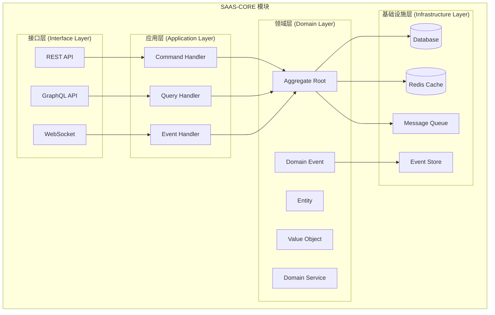
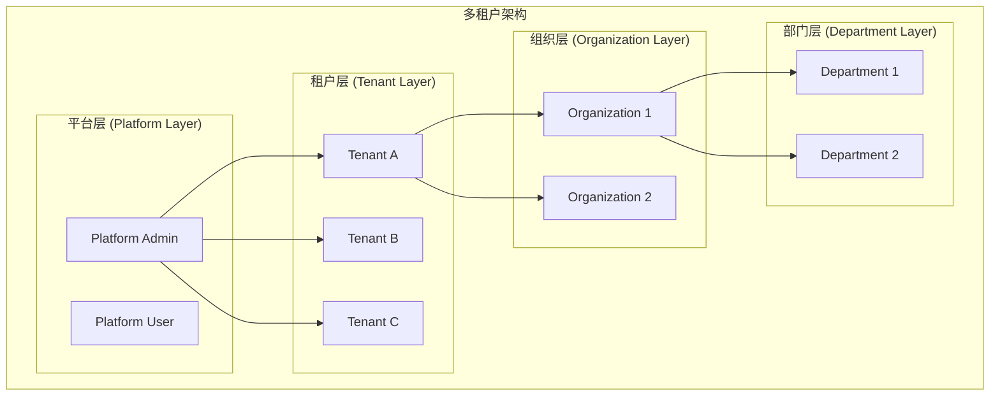

# SAAS-CORE 项目概述与架构设计

> **版本**: 1.0.0 | **创建日期**: 2025-01-27 | **模块**: packages/saas-core

---

## 📋 目录

- [1. 项目概述](#1-项目概述)
- [2. 架构设计](#2-架构设计)

---

## 1. 项目概述

### 1.1 项目背景

SAAS-CORE 是基于 `@hl8/hybrid-archi` 架构构建的 SAAS 平台核心业务领域模块。它将平台、租户、组织、部门、用户、认证等核心子领域整合为一个统一的业务模块，为整个 SAAS 平台提供基础业务能力。

### 1.2 核心特性

- **混合架构模式**: Clean Architecture + CQRS + 事件溯源 + 事件驱动架构
- **充血模型**: 业务逻辑集中在领域层
- **多租户支持**: 完整的多租户数据隔离和权限控制
- **事件驱动**: 基于领域事件的松耦合架构
- **类型安全**: 严格的 TypeScript 类型系统

### 1.3 业务价值

- **快速交付**: 提供完整的 SAAS 平台基础能力
- **高可扩展**: 支持未来业务模块的快速集成
- **高可维护**: 清晰的架构分层和职责分离
- **高可靠性**: 完整的测试覆盖和错误处理

---

## 2. 架构设计

### 2.1 整体架构



### 2.2 核心架构模式

#### 2.2.1 Clean Architecture

- **依赖倒置**: 外层依赖内层，内层不依赖外层
- **分层隔离**: 每层只与相邻层交互
- **业务逻辑集中**: 核心业务逻辑在领域层

#### 2.2.2 CQRS (Command Query Responsibility Segregation)

- **命令端**: 处理写操作，修改聚合状态
- **查询端**: 处理读操作，提供数据视图
- **读写分离**: 优化性能和可扩展性

#### 2.2.3 Event Sourcing (事件溯源)

- **状态存储**: 通过事件序列重建聚合状态
- **审计追踪**: 完整的历史记录和变更追踪
- **时间旅行**: 支持任意时间点的状态重建

#### 2.2.4 Event-Driven Architecture (事件驱动架构)

- **松耦合**: 组件间通过事件通信
- **异步处理**: 支持异步业务逻辑处理
- **可扩展**: 易于添加新的事件处理器

### 2.3 领域层设计原则

#### 2.3.1 充血模型原则

**✅ 正确做法**:

```typescript
// 实体包含业务逻辑
export class User extends BaseEntity {
  public activate(): void {
    if (this.status !== UserStatus.Pending) {
      throw new UserNotPendingException('只有待激活状态的用户才能激活');
    }
    
    this.status = UserStatus.Active;
    this.activatedAt = new Date();
    this.updateTimestamp();
  }
}
```

**❌ 错误做法**:

```typescript
// ❌ 贫血模型 - 只有getter/setter
export class User {
  private _status: UserStatus;
  
  setStatus(status: UserStatus): void {
    this._status = status;
  }
  
  getStatus(): UserStatus {
    return this._status;
  }
}
```

#### 2.3.2 实体与聚合根分离

**聚合根作为管理者**:

- 管理聚合一致性边界
- 协调内部实体操作
- 发布领域事件
- 验证业务规则

**内部实体作为被管理者**:

- 执行具体业务操作
- 维护自身状态
- 遵循聚合根指令
- 实现业务逻辑

#### 2.3.3 指令模式实现

**指令模式** 是实体与聚合根分离的核心实现机制：

```text
聚合根发出指令 → 实体执行指令 → 返回执行结果
```

**指令类型**:

- **方法调用指令**: 聚合根调用实体的业务方法
- **状态变更指令**: 聚合根指示实体变更状态
- **业务规则验证指令**: 聚合根要求实体验证业务规则

#### 2.3.4 业务规则集中管理

**规则定义**:

```typescript
export class TenantBusinessRules {
  // 约束规则
  static readonly TENANT_CODE_MUST_BE_UNIQUE = "租户代码必须全局唯一";
  static readonly STATUS_TRANSITION_PENDING_TO_ACTIVE = "租户只能从PENDING状态转换到ACTIVE状态";
  
  // 功能权限规则
  static readonly FREE_TENANT_FEATURES = "免费租户只能使用基础功能";
  static readonly ENTERPRISE_TENANT_FEATURES = "企业租户可以使用所有功能";
}
```

**规则验证器**:

```typescript
export class TenantRuleValidator {
  public static validateStatusTransition(currentStatus: TenantStatus, newStatus: TenantStatus): boolean {
    const validTransitions: Record<TenantStatus, TenantStatus[]> = {
      [TenantStatus.PENDING]: [TenantStatus.ACTIVE, TenantStatus.DISABLED],
      [TenantStatus.ACTIVE]: [TenantStatus.SUSPENDED, TenantStatus.DISABLED],
      // ...
    };
    
    return validTransitions[currentStatus]?.includes(newStatus) || false;
  }
}
```

### 2.4 多租户架构



---

## 📚 相关文档

- [技术栈选择与依赖管理](./02-tech-stack-and-dependencies.md)
- [项目结构与模块职责](./03-project-structure.md)
- [领域层开发指南](./04-domain-layer-development.md)
- [应用层开发指南](./05-application-layer-development.md)
- [基础设施层开发指南](./06-infrastructure-layer-development.md)
- [接口层开发指南](./07-interface-layer-development.md)
- [业务功能模块开发](./08-business-modules.md)
- [测试策略与部署运维](./09-testing-and-deployment.md)
- [最佳实践与常见问题](./10-best-practices-and-faq.md)
