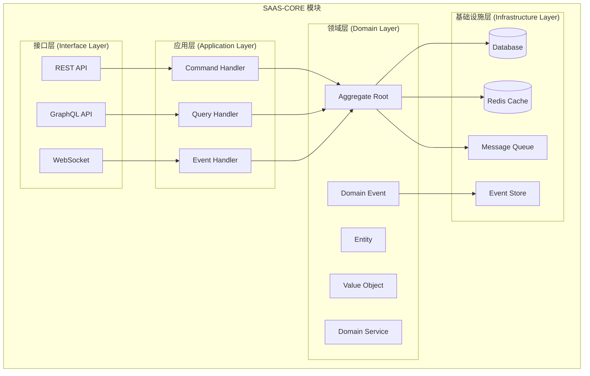

# SAAS-CORE 项目结构与模块职责

> **版本**: 1.0.0 | **创建日期**: 2025-01-27 | **模块**: packages/saas-core

---

## 📋 目录

- [1. 目录结构](#1-目录结构)
- [2. 模块职责](#2-模块职责)
- [3. 分层架构说明](#3-分层架构说明)

---

## 1. 目录结构

### 1.1 完整目录结构

```text
packages/saas-core/
├── src/
│   ├── domain/                    # 领域层
│   │   ├── events/               # 领域事件
│   │   ├── services/             # 领域服务
│   │   ├── rules/                # 业务规则
│   │   ├── value-objects/        # 值对象
│   │   ├── tenant/               # 租户子领域
│   │   │   ├── entities/         # 租户实体
│   │   │   └── aggregates/       # 租户聚合根
│   │   ├── user/                 # 用户子领域
│   │   │   ├── entities/         # 用户实体
│   │   │   └── aggregates/       # 用户聚合根
│   │   ├── organization/         # 组织子领域
│   │   └── department/           # 部门子领域
│   ├── application/              # 应用层
│   │   ├── commands/             # 命令
│   │   ├── queries/              # 查询
│   │   ├── handlers/             # 处理器
│   │   └── services/             # 应用服务
│   ├── infrastructure/           # 基础设施层
│   │   ├── repositories/         # 仓储实现
│   │   ├── events/               # 事件处理
│   │   └── persistence/          # 持久化
│   ├── interfaces/               # 接口层
│   │   ├── rest/                 # REST API
│   │   ├── graphql/              # GraphQL API
│   │   └── websocket/            # WebSocket
│   ├── config/                   # 配置
│   ├── constants/                # 常量
│   └── saas-core.module.ts       # 主模块
├── test/                         # 测试
├── docs/                         # 文档
├── package.json
├── tsconfig.json
└── README.md
```

### 1.2 核心文件说明

#### 1.2.1 配置文件

- `package.json`: 项目依赖和脚本配置
- `tsconfig.json`: TypeScript 编译配置
- `jest.config.js`: 测试框架配置

#### 1.2.2 主模块文件

- `saas-core.module.ts`: NestJS 主模块，集成所有子模块

#### 1.2.3 常量文件

- `constants/business.constants.ts`: 业务相关常量
- `constants/technical.constants.ts`: 技术相关常量

---

## 2. 模块职责

### 2.1 领域层 (Domain Layer)

#### 2.1.1 领域层组件结构

```text
领域层 (Domain Layer)
├── 实体 (Entities)
│   ├── 聚合根 (Aggregate Roots) - 管理者
│   └── 内部实体 (Internal Entities) - 被管理者
├── 值对象 (Value Objects)
├── 领域服务 (Domain Services)
├── 领域事件 (Domain Events)
└── 业务规则 (Business Rules)
```

#### 2.1.2 聚合根职责

- **管理聚合一致性边界**: 确保聚合内数据一致性
- **协调内部实体操作**: 通过指令模式协调实体
- **发布领域事件**: 管理事件的生命周期
- **验证业务规则**: 确保业务规则的正确执行

#### 2.1.3 实体职责

- **执行具体业务操作**: 实现具体的业务逻辑
- **维护自身状态**: 管理实体的状态变更
- **遵循聚合根指令**: 响应聚合根的指令
- **实现业务逻辑**: 包含核心业务规则

#### 2.1.4 值对象特点

- **不可变性**: 创建后不能修改
- **相等性**: 基于属性值比较相等性
- **验证逻辑**: 包含数据完整性验证

#### 2.1.5 领域服务用途

- **跨聚合业务逻辑**: 处理涉及多个聚合的复杂业务
- **外部服务集成**: 封装外部服务的调用
- **复杂计算**: 执行复杂的业务计算

#### 2.1.6 领域事件特点

- **事件定义**: 明确定义所有领域事件
- **事件数据**: 包含足够的数据用于重建状态
- **事件版本**: 支持事件版本演进
- **事件路由**: 支持事件的路由和分发

### 2.2 应用层 (Application Layer)

#### 2.2.1 应用层组件结构

```text
应用层 (Application Layer) - 用例为中心
├── 用例服务 (Use Case Services) - 核心组件
│   ├── 创建租户用例 (CreateTenantUseCase)
│   ├── 激活租户用例 (ActivateTenantUseCase)
│   ├── 查询租户用例 (GetTenantUseCase)
│   └── 租户列表用例 (GetTenantListUseCase)
├── 命令处理器 (Command Handlers) - 用例实现
├── 查询处理器 (Query Handlers) - 用例实现
└── 事件处理器 (Event Handlers) - 用例实现
```

#### 2.2.2 用例为中心的第一原则

应用层是 Hybrid Architecture 的协调层，负责协调领域对象完成特定的业务用例。应用层应该：

- **用例为中心**: 以业务用例为核心，每个用例对应一个应用服务
- **用例逻辑**: 应用层的关注点是用例的逻辑，即协调领域对象完成业务场景的流程
- **无业务逻辑**: 不包含具体的业务逻辑，只负责协调
- **用例驱动**: 每个应用服务对应一个或多个业务用例
- **事务边界**: 管理事务边界和一致性
- **依赖注入**: 通过依赖注入管理组件依赖

#### 2.2.3 用例设计承诺

**用例（Use-Case）是 Clean Architecture 的重要概念**：

**用例（Use-Case）不仅仅是命名偏好，更是一种设计承诺**：

1. **设计承诺**: 使用 `XxxUseCase` 命名是对单一职责原则的承诺
2. **业务场景专注**: 每个用例类只关注一个具体的业务场景
3. **代码清晰**: 用例命名直接反映业务意图，代码更加清晰
4. **可维护性**: 单一职责使得代码更容易维护和修改
5. **可测试性**: 每个用例可以独立测试，测试更加精确

#### 2.2.4 应用层职责

- **用例服务**: 实现具体的业务用例，协调领域对象
- **命令处理器**: 处理写操作请求，实现命令端用例
- **查询处理器**: 处理读操作请求，实现查询端用例
- **事件处理器**: 处理领域事件，实现事件驱动用例
- **应用服务**: 协调多个聚合的操作
- **事务管理**: 管理事务边界和一致性
- **依赖注入**: 通过依赖注入管理组件依赖

### 2.3 基础设施层 (Infrastructure Layer)

#### 2.3.1 基础设施层组件结构

```text
基础设施层 (Infrastructure Layer)
├── 适配器 (Adapters)
│   ├── 端口适配器 (Port Adapters)
│   ├── 仓储适配器 (Repository Adapters)
│   ├── 服务适配器 (Service Adapters)
│   └── 事件存储适配器 (Event Store Adapters)
├── 事件溯源 (Event Sourcing)
│   ├── 事件存储实现 (Event Store Implementation)
│   └── 快照存储实现 (Snapshot Store Implementation)
├── 事件驱动架构 (Event-Driven Architecture)
│   ├── 死信队列 (Dead Letter Queue)
│   └── 事件监控 (Event Monitor)
├── 工厂 (Factories)
│   ├── 基础设施工厂 (Infrastructure Factory)
│   └── 基础设施管理器 (Infrastructure Manager)
└── 映射器 (Mappers)
    ├── 领域映射器 (Domain Mappers)
    └── DTO映射器 (DTO Mappers)
```

#### 2.3.2 适配器模式实现

基础设施层是 Hybrid Architecture 的技术实现层，负责提供技术服务和外部系统集成。基础设施层应该：

- **技术实现集中**: 所有技术实现在基础设施层统一管理
- **外部依赖隔离**: 隔离外部系统依赖
- **适配器模式**: 使用适配器模式实现接口适配
- **可替换性**: 支持技术实现的替换和升级

#### 2.3.3 事件溯源支持

**事件存储实现**:

- **事件持久化**: 支持事件的持久化存储
- **事件检索**: 支持事件的查询和检索
- **快照管理**: 支持聚合状态的快照机制
- **并发控制**: 支持乐观并发控制

#### 2.3.4 事件驱动支持

**消息队列实现**:

- **事件发布**: 支持事件的异步发布
- **事件订阅**: 支持事件的订阅和处理
- **死信队列**: 支持失败事件的处理
- **事件监控**: 支持事件的监控和统计

#### 2.3.5 多租户支持

**租户隔离**:

- **数据隔离**: 确保租户数据的物理隔离
- **缓存隔离**: 支持租户级别的缓存隔离
- **消息隔离**: 支持租户级别的消息隔离
- **监控隔离**: 支持租户级别的监控隔离

#### 2.3.6 基础设施层职责

- **适配器实现**: 实现端口适配器、仓储适配器、服务适配器
- **事件存储**: 实现事件溯源的事件存储和快照机制
- **事件驱动**: 实现事件驱动的消息队列和死信队列
- **数据映射**: 实现领域对象与数据模型的映射
- **外部集成**: 集成外部服务和第三方API
- **技术实现**: 提供所有技术实现的具体实现

### 2.4 接口层 (Interface Layer)

#### 2.4.1 接口层组件结构

```text
接口层 (Interface Layer)
├── 控制器系统 (Controllers)
│   ├── REST控制器 (REST Controllers)
│   ├── GraphQL解析器 (GraphQL Resolvers)
│   ├── WebSocket处理器 (WebSocket Handlers)
│   └── CLI命令 (CLI Commands)
├── API接口系统 (API System)
│   ├── 版本控制 (Versioning)
│   ├── 文档生成 (Documentation)
│   ├── 监控统计 (Monitoring)
│   └── 测试支持 (Testing)
├── 验证器系统 (Validators)
│   ├── 业务验证器 (Business Validators)
│   ├── 数据验证器 (Data Validators)
│   ├── 格式验证器 (Format Validators)
│   └── 安全验证器 (Security Validators)
├── 转换器系统 (Transformers)
│   ├── 数据转换器 (Data Transformers)
│   ├── 格式转换器 (Format Transformers)
│   ├── 类型转换器 (Type Transformers)
│   └── 序列化转换器 (Serialization Transformers)
├── 中间件系统 (Middleware)
│   ├── 认证中间件 (Auth Middleware)
│   ├── 日志中间件 (Logging Middleware)
│   ├── 性能中间件 (Performance Middleware)
│   └── 安全中间件 (Security Middleware)
└── 装饰器系统 (Decorators)
    ├── 验证装饰器 (Validation Decorators)
    ├── 缓存装饰器 (Cache Decorators)
    ├── 权限装饰器 (Permission Decorators)
    └── 监控装饰器 (Monitoring Decorators)
```

#### 2.4.2 协议适配支持

接口层是 Hybrid Architecture 的用户交互层，负责处理外部请求和响应。接口层应该：

- **协议适配**: 适配不同的通信协议（HTTP、GraphQL、WebSocket等）
- **请求处理**: 处理用户请求并转换为应用层可理解的格式
- **响应格式化**: 将应用层结果格式化为用户可理解的响应
- **安全控制**: 提供认证、授权、输入验证等安全功能

#### 2.4.3 命令查询分离支持

**接口分离**:

- **命令接口**: 处理写操作，返回命令执行结果
- **查询接口**: 处理读操作，返回查询结果
- **事件接口**: 处理事件订阅和推送

#### 2.4.4 多协议支持

**协议适配**:

- **REST API**: 支持标准的RESTful接口
- **GraphQL**: 支持灵活的查询和变更
- **WebSocket**: 支持实时通信和事件推送
- **CLI**: 支持命令行工具和脚本

#### 2.4.5 多租户支持

**租户隔离**:

- **租户识别**: 从请求中识别租户信息
- **数据隔离**: 确保租户数据的安全隔离
- **权限控制**: 基于租户的权限验证

#### 2.4.6 接口层职责

- **控制器实现**: 实现REST、GraphQL、WebSocket等控制器
- **验证器实现**: 实现输入验证、业务验证、安全验证
- **转换器实现**: 实现数据转换、格式转换、类型转换
- **中间件实现**: 实现认证、日志、性能、安全中间件
- **装饰器实现**: 实现验证、缓存、权限、监控装饰器
- **API管理**: 版本控制、文档生成、监控统计

---

## 3. 分层架构说明

### 3.1 架构分层图



### 3.2 依赖方向

- **依赖倒置**: 外层依赖内层，内层不依赖外层
- **接口隔离**: 通过接口实现层间解耦
- **单一职责**: 每层只负责自己的职责
- **开闭原则**: 对扩展开放，对修改关闭

### 3.3 数据流向

1. **请求流向**: 接口层 → 应用层 → 领域层 → 基础设施层
2. **响应流向**: 基础设施层 → 领域层 → 应用层 → 接口层
3. **事件流向**: 领域层 → 基础设施层 → 应用层（事件处理）

---

## 📚 相关文档

- [项目概述与架构设计](./01-overview-and-architecture.md)
- [技术栈选择与依赖管理](./02-tech-stack-and-dependencies.md)
- [领域层开发指南](./04-domain-layer-development.md)
- [应用层开发指南](./05-application-layer-development.md)
- [基础设施层开发指南](./06-infrastructure-layer-development.md)
- [接口层开发指南](./07-interface-layer-development.md)
- [业务功能模块开发](./08-business-modules.md)
- [测试策略与部署运维](./09-testing-and-deployment.md)
- [最佳实践与常见问题](./10-best-practices-and-faq.md)
