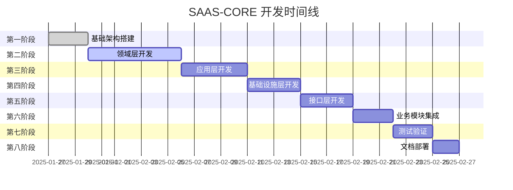

# SAAS-CORE 模块开发任务清单

> **版本**: 1.0.0 | **创建日期**: 2025-01-27 | **模块**: packages/saas-core

---

## 📋 目录

- [1. 项目概述](#1-项目概述)
- [2. 开发阶段规划](#2-开发阶段规划)
- [3. 详细任务清单](#3-详细任务清单)
- [4. 开发规范要求](#4-开发规范要求)
- [5. 质量检查清单](#5-质量检查清单)
- [6. 进度跟踪](#6-进度跟踪)

---

## 1. 项目概述

### 1.1 项目目标

SAAS-CORE 是基于 `@hl8/hybrid-archi` 架构构建的 SAAS 平台核心业务领域模块，采用混合架构模式（Clean Architecture + CQRS + 事件溯源 + 事件驱动架构），为整个 SAAS 平台提供基础业务能力。

### 1.2 核心特性

- **混合架构模式**: Clean Architecture + CQRS + 事件溯源 + 事件驱动架构
- **充血模型**: 业务逻辑集中在领域层
- **多租户支持**: 完整的多租户数据隔离和权限控制
- **事件驱动**: 基于领域事件的松耦合架构
- **类型安全**: 严格的 TypeScript 类型系统

### 1.3 技术栈

- **框架**: NestJS + Fastify
- **架构**: @hl8/hybrid-archi
- **数据库**: PostgreSQL + Redis
- **ORM**: MikroORM
- **权限**: CASL
- **测试**: Jest

---

## 2. 开发阶段规划

### 2.1 开发阶段概览

### 2.2 阶段依赖关系

1. **第一阶段** → **第二阶段**: 基础架构完成后开始领域层开发
2. **第二阶段** → **第三阶段**: 领域层完成后开始应用层开发
3. **第三阶段** → **第四阶段**: 应用层完成后开始基础设施层开发
4. **第四阶段** → **第五阶段**: 基础设施层完成后开始接口层开发
5. **第五阶段** → **第六阶段**: 接口层完成后开始业务模块集成
6. **第六阶段** → **第七阶段**: 业务模块完成后开始测试验证
7. **第七阶段** → **第八阶段**: 测试完成后开始文档部署

---

## 3. 详细任务清单

### 🏗️ 第一阶段：基础架构搭建

**目标**: 建立混合架构基础，完成项目结构和配置

#### 1.1 项目结构完善

- [ ] **完善 package.json 依赖配置**
  - [ ] 添加 @hl8/hybrid-archi 依赖
  - [ ] 添加 NestJS 相关依赖
  - [ ] 添加 Redis 和 CASL 依赖
  - [ ] 配置开发依赖
- [ ] **配置 TypeScript 编译选项**
  - [ ] 更新 tsconfig.json
  - [ ] 配置路径映射
  - [ ] 设置严格模式
- [ ] **设置 ESLint 和 Jest 配置**
  - [ ] 配置 ESLint 规则
  - [ ] 设置 Jest 测试配置
  - [ ] 配置代码格式化
- [ ] **创建常量管理文件**
  - [ ] 业务常量定义
  - [ ] 技术常量定义
  - [ ] DI Token 常量

#### 1.2 混合架构核心集成

- [ ] **集成 @hl8/hybrid-archi 基础设施模块**
  - [ ] 导入 InfrastructureModule
  - [ ] 配置缓存系统
  - [ ] 配置日志系统
  - [ ] 配置数据库连接
- [ ] **配置 NestJS 主模块**
  - [ ] 创建 SaasCoreModule
  - [ ] 配置模块依赖
  - [ ] 设置全局提供者
- [ ] **设置依赖注入容器**
  - [ ] 配置 DI Token
  - [ ] 设置服务提供者
  - [ ] 配置模块导出
- [ ] **配置多租户支持**
  - [ ] 集成多租户中间件
  - [ ] 配置租户上下文
  - [ ] 设置租户隔离

**预计完成时间**: 3天

---

### 🎯 第二阶段：领域层开发

**目标**: 实现充血模型，建立业务逻辑核心

#### 2.1 租户子领域

- [ ] **租户实体 (Tenant Entity)**
  - [ ] 实现租户基础属性
  - [ ] 添加状态管理方法
  - [ ] 实现激活/暂停业务逻辑
  - [ ] 添加资源限制检查
  - [ ] 实现配置更新逻辑
- [ ] **租户聚合根 (TenantAggregate)**
  - [ ] 实现聚合根管理职责
  - [ ] 协调内部实体操作
  - [ ] 发布领域事件
  - [ ] 验证业务规则
- [ ] **租户值对象**
  - [ ] `TenantConfig` - 租户配置值对象
  - [ ] `ResourceLimits` - 资源限制值对象
  - [ ] `ResourceUsage` - 资源使用量值对象
  - [ ] `TenantStatus` - 租户状态枚举

#### 2.2 用户子领域

- [ ] **用户实体 (User Entity)**
  - [ ] 实现用户基础属性
  - [ ] 添加认证逻辑
  - [ ] 实现状态管理方法
  - [ ] 添加密码更新逻辑
  - [ ] 实现租户分配逻辑
- [ ] **用户聚合根 (UserAggregate)**
  - [ ] 管理用户生命周期
  - [ ] 处理租户分配
  - [ ] 发布用户事件
  - [ ] 验证用户规则
- [ ] **用户值对象**
  - [ ] `UserProfile` - 用户档案值对象
  - [ ] `UserRole` - 用户角色枚举
  - [ ] `UserStatus` - 用户状态枚举
  - [ ] `UserPermission` - 用户权限值对象

#### 2.3 组织部门子领域

- [ ] **组织实体和聚合根**
  - [ ] `Organization` 实体
  - [ ] `OrganizationAggregate` 聚合根
  - [ ] 组织管理业务逻辑
- [ ] **部门实体和聚合根**
  - [ ] `Department` 实体
  - [ ] `DepartmentAggregate` 聚合根
  - [ ] 部门层级管理逻辑
- [ ] **组织架构值对象**
  - [ ] `OrganizationType` - 组织类型
  - [ ] `DepartmentLevel` - 部门层级
  - [ ] `OrganizationConfig` - 组织配置

#### 2.4 领域事件系统

- [ ] **租户相关事件**
  - [ ] `TenantCreatedEvent` - 租户创建事件
  - [ ] `TenantActivatedEvent` - 租户激活事件
  - [ ] `TenantSuspendedEvent` - 租户暂停事件
  - [ ] `TenantUpgradedEvent` - 租户升级事件
- [ ] **用户相关事件**
  - [ ] `UserRegisteredEvent` - 用户注册事件
  - [ ] `UserActivatedEvent` - 用户激活事件
  - [ ] `UserAuthenticatedEvent` - 用户认证事件
  - [ ] `UserAssignedToTenantEvent` - 用户分配事件
- [ ] **组织部门相关事件**
  - [ ] `OrganizationCreatedEvent` - 组织创建事件
  - [ ] `DepartmentCreatedEvent` - 部门创建事件

#### 2.5 业务规则引擎

- [ ] **租户业务规则验证器**
  - [ ] 租户代码唯一性验证
  - [ ] 租户状态转换验证
  - [ ] 资源限制验证
- [ ] **用户业务规则验证器**
  - [ ] 邮箱唯一性验证
  - [ ] 用户名唯一性验证
  - [ ] 密码强度验证
- [ ] **跨聚合业务规则**
  - [ ] 租户用户限制验证
  - [ ] 组织部门层级验证

**预计完成时间**: 7天

---

### ⚙️ 第三阶段：应用层开发

**目标**: 实现用例为中心的应用服务

#### 3.1 租户用例服务

- [ ] **CreateTenantUseCase** - 创建租户用例
  - [ ] 验证租户代码唯一性
  - [ ] 创建租户聚合根
  - [ ] 持久化租户数据
  - [ ] 发布创建事件
- [ ] **ActivateTenantUseCase** - 激活租户用例
  - [ ] 获取租户聚合根
  - [ ] 执行激活业务逻辑
  - [ ] 持久化状态变更
  - [ ] 发布激活事件
- [ ] **SuspendTenantUseCase** - 暂停租户用例
- [ ] **UpgradeTenantUseCase** - 升级租户用例
- [ ] **GetTenantUseCase** - 查询租户用例
- [ ] **GetTenantListUseCase** - 租户列表用例

#### 3.2 用户用例服务

- [ ] **RegisterUserUseCase** - 用户注册用例
  - [ ] 验证邮箱和用户名唯一性
  - [ ] 创建用户聚合根
  - [ ] 持久化用户数据
  - [ ] 发送注册确认邮件
- [ ] **AuthenticateUserUseCase** - 用户认证用例
- [ ] **ActivateUserUseCase** - 用户激活用例
- [ ] **AssignUserToTenantUseCase** - 用户分配用例
- [ ] **GetUserUseCase** - 查询用户用例
- [ ] **GetUserListUseCase** - 用户列表用例

#### 3.3 组织部门用例服务

- [ ] **CreateOrganizationUseCase** - 创建组织用例
- [ ] **CreateDepartmentUseCase** - 创建部门用例
- [ ] **GetOrganizationUseCase** - 查询组织用例
- [ ] **GetDepartmentUseCase** - 查询部门用例

#### 3.4 命令查询分离 (CQRS)

- [ ] **命令对象设计**
  - [ ] 租户相关命令
  - [ ] 用户相关命令
  - [ ] 组织部门相关命令
- [ ] **查询对象设计**
  - [ ] 租户相关查询
  - [ ] 用户相关查询
  - [ ] 组织部门相关查询
- [ ] **命令处理器实现**
- [ ] **查询处理器实现**

#### 3.5 事件处理器

- [ ] **租户事件处理器**
  - [ ] 租户创建事件处理
  - [ ] 租户激活事件处理
  - [ ] 租户暂停事件处理
- [ ] **用户事件处理器**
  - [ ] 用户注册事件处理
  - [ ] 用户认证事件处理
  - [ ] 用户分配事件处理

**预计完成时间**: 5天

---

### 🔧 第四阶段：基础设施层开发

**目标**: 实现技术适配器和外部系统集成

#### 4.1 仓储实现

- [ ] **租户仓储实现**
  - [ ] `TenantRepository` 接口实现
  - [ ] 租户数据映射
  - [ ] 查询优化
- [ ] **用户仓储实现**
  - [ ] `UserRepository` 接口实现
  - [ ] 用户数据映射
  - [ ] 认证查询优化
- [ ] **组织部门仓储实现**
  - [ ] `OrganizationRepository` 接口实现
  - [ ] `DepartmentRepository` 接口实现

#### 4.2 事件存储实现

- [ ] **事件存储适配器**
  - [ ] 事件持久化实现
  - [ ] 事件查询实现
  - [ ] 事件版本管理
- [ ] **快照存储实现**
  - [ ] 聚合快照机制
  - [ ] 快照恢复逻辑
  - [ ] 快照清理策略

#### 4.3 外部服务适配器

- [ ] **邮件服务适配器**
  - [ ] 邮件发送接口
  - [ ] 模板管理
  - [ ] 发送状态跟踪
- [ ] **通知服务适配器**
  - [ ] 通知发送接口
  - [ ] 通知渠道管理
- [ ] **分析服务适配器**
  - [ ] 数据收集接口
  - [ ] 指标计算
  - [ ] 报告生成

#### 4.4 数据映射器

- [ ] **领域对象映射器**
  - [ ] 实体到数据模型映射
  - [ ] 值对象序列化
  - [ ] 聚合根映射
- [ ] **DTO 映射器**
  - [ ] 请求对象映射
  - [ ] 响应对象映射
  - [ ] 查询结果映射

**预计完成时间**: 4天

---

### 🌐 第五阶段：接口层开发

**目标**: 实现多协议接口和用户交互

#### 5.1 REST API 控制器

- [ ] **租户 REST 控制器**
  - [ ] 租户 CRUD 接口
  - [ ] 租户状态管理接口
  - [ ] 租户配置管理接口
- [ ] **用户 REST 控制器**
  - [ ] 用户注册接口
  - [ ] 用户认证接口
  - [ ] 用户管理接口
- [ ] **组织部门 REST 控制器**
  - [ ] 组织管理接口
  - [ ] 部门管理接口

#### 5.2 GraphQL 解析器

- [ ] **租户 GraphQL 解析器**
  - [ ] 租户查询解析器
  - [ ] 租户变更解析器
- [ ] **用户 GraphQL 解析器**
  - [ ] 用户查询解析器
  - [ ] 用户变更解析器

#### 5.3 WebSocket 处理器

- [ ] **实时事件推送**
  - [ ] 租户状态变更推送
  - [ ] 用户活动推送
- [ ] **实时通知系统**
  - [ ] 系统通知推送
  - [ ] 业务事件推送

#### 5.4 验证器和中间件

- [ ] **输入验证器**
  - [ ] 请求数据验证
  - [ ] 业务规则验证
- [ ] **认证中间件**
  - [ ] JWT 认证
  - [ ] 权限验证
- [ ] **多租户中间件**
  - [ ] 租户上下文提取
  - [ ] 数据隔离验证

**预计完成时间**: 4天

---

### 🚀 第六阶段：业务模块集成

**目标**: 集成高级业务功能和系统能力

#### 6.1 权限管理系统

- [ ] **CASL 权限引擎**
  - [ ] 权限规则定义
  - [ ] 权限工厂实现
  - [ ] 权限缓存机制
- [ ] **权限装饰器和守卫**
  - [ ] 权限装饰器
  - [ ] 权限守卫
  - [ ] 权限中间件

#### 6.2 资源监控系统

- [ ] **资源使用量监控**
  - [ ] 实时资源统计
  - [ ] 资源使用告警
  - [ ] 资源限制检查
- [ ] **性能监控**
  - [ ] API 性能监控
  - [ ] 数据库性能监控
  - [ ] 缓存性能监控

#### 6.3 业务流程引擎

- [ ] **流程引擎核心**
  - [ ] 流程定义
  - [ ] 流程执行
  - [ ] 流程回滚
- [ ] **业务规则引擎**
  - [ ] 规则定义
  - [ ] 规则执行
  - [ ] 规则管理

#### 6.4 异常处理机制

- [ ] **业务异常处理器**
  - [ ] 异常分类
  - [ ] 异常处理策略
  - [ ] 异常重试机制
- [ ] **系统监控告警**
  - [ ] 系统健康检查
  - [ ] 异常告警
  - [ ] 性能告警

**预计完成时间**: 3天

---

### 🧪 第七阶段：测试验证

**目标**: 确保代码质量和系统稳定性

#### 7.1 单元测试

- [ ] **领域层测试**
  - [ ] 实体业务逻辑测试
  - [ ] 聚合根测试
  - [ ] 值对象测试
  - [ ] 领域事件测试
- [ ] **应用层测试**
  - [ ] 用例服务测试
  - [ ] 命令处理器测试
  - [ ] 查询处理器测试
  - [ ] 事件处理器测试

#### 7.2 集成测试

- [ ] **基础设施层测试**
  - [ ] 仓储集成测试
  - [ ] 事件存储测试
  - [ ] 外部服务测试
- [ ] **接口层测试**
  - [ ] REST API 测试
  - [ ] GraphQL 测试
  - [ ] WebSocket 测试

#### 7.3 端到端测试

- [ ] **业务流程测试**
  - [ ] 租户创建流程测试
  - [ ] 用户注册流程测试
  - [ ] 权限验证流程测试
- [ ] **多租户测试**
  - [ ] 租户隔离测试
  - [ ] 跨租户访问测试

#### 7.4 性能测试

- [ ] **API 性能测试**
  - [ ] 响应时间测试
  - [ ] 并发性能测试
  - [ ] 负载测试
- [ ] **数据库性能测试**
  - [ ] 查询性能测试
  - [ ] 事务性能测试

**预计完成时间**: 3天

---

### 📚 第八阶段：文档部署

**目标**: 完善文档和部署配置

#### 8.1 文档完善

- [ ] **API 文档**
  - [ ] REST API 文档
  - [ ] GraphQL Schema 文档
  - [ ] WebSocket 接口文档
- [ ] **开发文档**
  - [ ] 架构设计文档
  - [ ] 开发指南
  - [ ] 部署指南
- [ ] **用户文档**
  - [ ] 使用说明
  - [ ] 配置指南
  - [ ] 常见问题

#### 8.2 部署配置

- [ ] **Docker 配置**
  - [ ] Dockerfile 编写
  - [ ] Docker Compose 配置
  - [ ] 容器编排配置
- [ ] **环境配置**
  - [ ] 开发环境配置
  - [ ] 测试环境配置
  - [ ] 生产环境配置
- [ ] **CI/CD 配置**
  - [ ] 构建流水线
  - [ ] 测试流水线
  - [ ] 部署流水线

#### 8.3 监控配置

- [ ] **日志配置**
  - [ ] 日志格式配置
  - [ ] 日志级别配置
  - [ ] 日志收集配置
- [ ] **监控配置**
  - [ ] 健康检查配置
  - [ ] 指标收集配置
  - [ ] 告警规则配置

**预计完成时间**: 2天

---

## 4. 开发规范要求

### 4.1 代码规范

- [ ] **TSDoc 注释规范**
  - [ ] 所有公共 API 添加完整注释
  - [ ] 使用中文注释
  - [ ] 包含业务规则描述
  - [ ] 包含使用示例
- [ ] **命名规范**
  - [ ] 文件命名：kebab-case
  - [ ] 变量命名：camelCase
  - [ ] 常量命名：UPPER_SNAKE_CASE
  - [ ] 类命名：PascalCase
- [ ] **类型安全**
  - [ ] 启用 TypeScript 严格模式
  - [ ] 禁止使用 any 类型
  - [ ] 使用 as const 断言

### 4.2 架构规范

- [ ] **充血模型原则**
  - [ ] 业务逻辑在实体内
  - [ ] 实体与聚合根分离
  - [ ] 使用值对象封装验证
- [ ] **用例为中心**
  - [ ] 应用层以用例为核心
  - [ ] 每个用例单一职责
  - [ ] 用例命名体现设计承诺
- [ ] **依赖倒置**
  - [ ] 外层依赖内层
  - [ ] 通过接口解耦
  - [ ] 依赖注入管理

### 4.3 测试规范

- [ ] **测试覆盖率**
  - [ ] 单元测试覆盖率 >= 90%
  - [ ] 集成测试覆盖率 >= 80%
  - [ ] 关键业务流程 100% 覆盖
- [ ] **测试质量**
  - [ ] 测试用例清晰明确
  - [ ] 测试数据独立
  - [ ] 测试结果可重复

---

## 5. 质量检查清单

### 5.1 代码质量检查

- [ ] **静态代码分析**
  - [ ] ESLint 检查通过
  - [ ] TypeScript 编译无错误
  - [ ] 代码复杂度检查
- [ ] **代码审查**
  - [ ] 架构设计审查
  - [ ] 业务逻辑审查
  - [ ] 性能优化审查

### 5.2 功能质量检查

- [ ] **业务功能验证**
  - [ ] 租户管理功能完整
  - [ ] 用户管理功能完整
  - [ ] 权限控制功能完整
- [ ] **非功能需求验证**
  - [ ] 性能指标达标
  - [ ] 安全性要求满足
  - [ ] 可扩展性验证

### 5.3 部署质量检查

- [ ] **环境验证**
  - [ ] 开发环境部署成功
  - [ ] 测试环境部署成功
  - [ ] 生产环境准备就绪
- [ ] **监控验证**
  - [ ] 日志收集正常
  - [ ] 监控指标正常
  - [ ] 告警机制正常

---

## 6. 进度跟踪

### 6.1 进度状态

| 阶段 | 状态 | 开始时间 | 预计完成时间 | 实际完成时间 | 完成度 |
|------|------|----------|--------------|--------------|--------|
| 第一阶段：基础架构搭建 | 🟡 进行中 | 2025-01-27 | 2025-01-30 | - | 60% |
| 第二阶段：领域层开发 | ⏳ 待开始 | 2025-01-30 | 2025-02-06 | - | 0% |
| 第三阶段：应用层开发 | ⏳ 待开始 | 2025-02-06 | 2025-02-11 | - | 0% |
| 第四阶段：基础设施层开发 | ⏳ 待开始 | 2025-02-11 | 2025-02-15 | - | 0% |
| 第五阶段：接口层开发 | ⏳ 待开始 | 2025-02-15 | 2025-02-19 | - | 0% |
| 第六阶段：业务模块集成 | ⏳ 待开始 | 2025-02-19 | 2025-02-22 | - | 0% |
| 第七阶段：测试验证 | ⏳ 待开始 | 2025-02-22 | 2025-02-25 | - | 0% |
| 第八阶段：文档部署 | ⏳ 待开始 | 2025-02-25 | 2025-02-27 | - | 0% |

### 6.2 里程碑检查点

- [ ] **里程碑 1**: 基础架构搭建完成 (2025-01-30)
- [ ] **里程碑 2**: 领域层开发完成 (2025-02-06)
- [ ] **里程碑 3**: 应用层开发完成 (2025-02-11)
- [ ] **里程碑 4**: 基础设施层开发完成 (2025-02-15)
- [ ] **里程碑 5**: 接口层开发完成 (2025-02-19)
- [ ] **里程碑 6**: 业务模块集成完成 (2025-02-22)
- [ ] **里程碑 7**: 测试验证完成 (2025-02-25)
- [ ] **里程碑 8**: 文档部署完成 (2025-02-27)

### 6.3 风险管控

#### 6.3.1 技术风险

- **风险**: 混合架构复杂度高
- **应对**: 分阶段实施，逐步验证
- **负责人**: 架构师

#### 6.3.2 进度风险

- **风险**: 开发时间可能超期
- **应对**: 预留缓冲时间，优先核心功能
- **负责人**: 项目经理

#### 6.3.3 质量风险

- **风险**: 代码质量不达标
- **应对**: 持续代码审查，自动化测试
- **负责人**: 技术负责人

---

## 📞 联系信息

**项目负责人**: HL8 开发团队  
**技术负责人**: 架构师  
**项目经理**: 项目经理  

**最后更新**: 2025-01-27  
**文档版本**: 1.0.0
