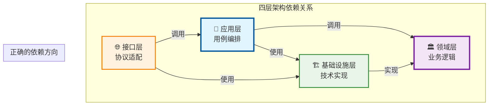
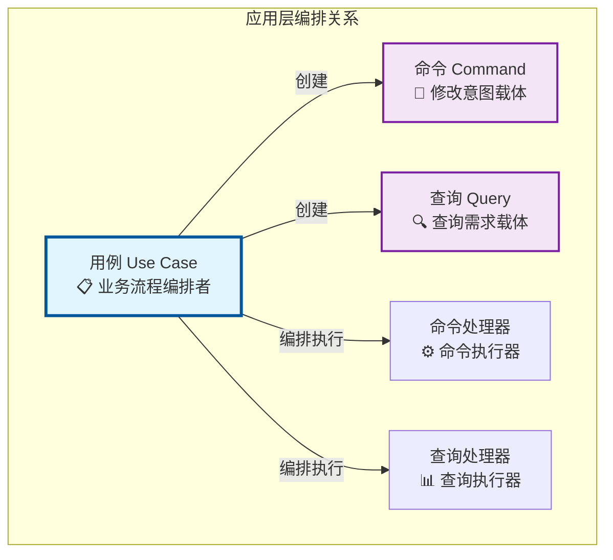
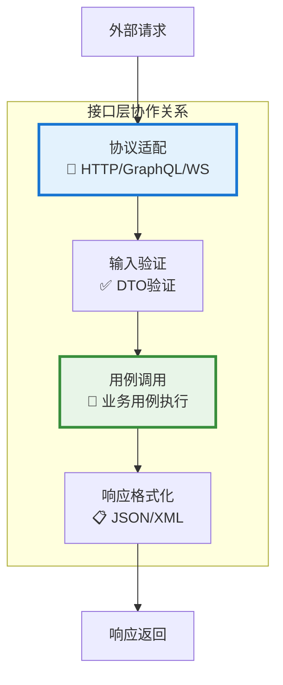

# 🚀 用户模块开发实战教程

## 基于 AIOFIX AI SAAS 平台基础架构的完整开发指南

### 📖 教程概述

本教程将以**用户模块（User Module）**开发为例，详细演示如何使用 AIOFIX AI SAAS 平台的基础架构进行实际业务模块开发。教程基于**混合架构（Clean Architecture + CQRS + ES + EDA）**的完整设计原则，通过完整的开发过程，您将学会如何正确使用现有的基础设施模块，并掌握企业级 SAAS 平台的开发模式。

### 🎯 学习目标

- 掌握**混合架构（Clean Architecture + CQRS + ES + EDA）**的实际应用
- 学会**四层架构**（领域层、应用层、基础设施层、接口层）的正确实现
- 理解**用例编排命令/查询**的核心架构原则
- 掌握**充血模型**的领域实体设计
- 学会**双数据库架构**（PostgreSQL + MongoDB）的使用
- 理解**多租户架构**在实际业务中的应用
- 掌握**事件驱动架构**的实际实现方法
- 学会企业级代码质量标准和最佳实践

### 📋 前置条件

- 已阅读 [快速入门指南](../training/quick-start-guide.md)
- 已学习完整的四层设计原则文档：
  - [领域层设计原则详解](./domain-layer-design-principles.md)
  - [应用层设计原则详解](./application-layer-design-principles.md)  
  - [基础设施层设计原则详解](./infrastructure-layer-design-principles.md)
  - [接口层设计原则详解](./interface-layer-design-principles.md)
- 熟悉 TypeScript、NestJS 基础知识
- 了解 DDD、CQRS、事件溯源基本概念
- 开发环境已配置完成

---

## 🏗️ 第一部分：项目结构搭建

### 1.1 创建用户模块项目

我们已经创建了用户管理模块的基础结构，让我们检查一下：

```bash
# 检查用户模块结构
ls -la packages/user-management/src/
```

基于四层设计原则文档，正确的目录结构应该是：

```text
packages/user-management/src/
├── 🏛️ domain/                           # 领域层（Domain Layer）
│   ├── entities/                        # 业务实体（充血模型）
│   │   ├── user.entity.ts              # 用户实体
│   │   └── base/                       # 基础实体
│   ├── value-objects/                   # 值对象
│   │   ├── user-id.vo.ts               # 用户ID值对象
│   │   ├── email.vo.ts                 # 邮箱值对象
│   │   ├── user-name.vo.ts             # 用户名值对象
│   │   └── user-status.vo.ts           # 用户状态值对象
│   ├── aggregates/                      # 聚合根（事件管理和协调）
│   │   ├── user.aggregate.ts           # 用户聚合根
│   │   └── base/                       # 基础聚合根
│   ├── events/                          # 领域事件
│   │   ├── user-registered.event.ts    # 用户注册事件
│   │   ├── user-activated.event.ts     # 用户激活事件
│   │   └── user-profile-updated.event.ts # 用户资料更新事件
│   ├── repositories/                    # 仓储接口（领域层定义）
│   │   ├── user.repository.ts          # 用户仓储接口
│   │   └── user-read.repository.ts     # 用户读模型仓储接口
│   ├── services/                        # 领域服务（跨聚合业务逻辑）
│   │   ├── user-registration.service.ts # 用户注册领域服务
│   │   └── user-validation.service.ts  # 用户验证领域服务
│   └── exceptions/                      # 领域异常
│       ├── user-business-rule.exception.ts
│       └── user-validation.exception.ts
├── 🔧 application/                      # 应用层（Application Layer）
│   ├── common/                          # 应用层公共组件
│   │   ├── exceptions/                  # 应用层异常
│   │   ├── interfaces/                  # 应用层接口
│   │   ├── decorators/                  # 应用层装饰器
│   │   └── middleware/                  # 应用层中间件
│   ├── use-cases/                       # 用例（Clean Architecture核心 - 编排者）
│   │   ├── register-user/               # 用户注册用例
│   │   │   ├── register-user.use-case.ts
│   │   │   ├── register-user.request.ts
│   │   │   └── register-user.response.ts
│   │   ├── get-user-profile/            # 获取用户资料用例
│   │   │   ├── get-user-profile.use-case.ts
│   │   │   ├── get-user-profile.request.ts
│   │   │   └── get-user-profile.response.ts
│   │   └── update-user-profile/         # 更新用户资料用例
│   ├── commands/                        # 命令端（CQRS写操作 - 数据载体）
│   │   ├── register-user/
│   │   │   ├── register-user.command.ts
│   │   │   ├── register-user.handler.ts
│   │   │   ├── register-user.result.ts
│   │   │   └── register-user.spec.ts
│   │   └── update-user-profile/
│   ├── queries/                         # 查询端（CQRS读操作 - 数据载体）
│   │   ├── get-user-profile/
│   │   │   ├── get-user-profile.query.ts
│   │   │   ├── get-user-profile.handler.ts
│   │   │   ├── get-user-profile.result.ts
│   │   │   └── get-user-profile.spec.ts
│   │   └── get-user-list/
│   ├── events/                          # 事件处理器（事件驱动架构 - EDA）
│   │   ├── projectors/                  # 投影器（更新读模型）
│   │   │   ├── user-registered.projector.ts
│   │   │   └── user-profile-updated.projector.ts
│   │   ├── subscribers/                 # 订阅器（处理副作用）
│   │   │   ├── user-notification.subscriber.ts
│   │   │   └── user-analytics.subscriber.ts
│   │   ├── sagas/                       # Saga（流程管理器）
│   │   │   └── user-onboarding.saga.ts
│   │   └── integration/                 # 集成事件处理器
│   │       └── user-crm-sync.handler.ts
│   ├── ports/                           # 输出端口（接口定义）
│   │   ├── commands/                    # 命令侧专用端口
│   │   ├── queries/                     # 查询侧专用端口
│   │   └── shared/                      # 共享端口
│   └── services/                        # 应用服务（应用级业务逻辑）
│       ├── user-management.service.ts   # 用户管理应用服务
│       └── user-bulk-operations.service.ts # 批量操作应用服务
├── 🏗️ infrastructure/                   # 基础设施层（Infrastructure Layer）
│   ├── persistence/                     # 持久化层
│   │   ├── postgresql/                  # PostgreSQL实现（写模型）
│   │   │   ├── entities/                # PostgreSQL实体
│   │   │   │   ├── user-db.entity.ts   # 用户数据库实体
│   │   │   │   └── user-profile-db.entity.ts
│   │   │   ├── repositories/            # PostgreSQL仓储实现
│   │   │   │   └── postgresql-user.repository.ts
│   │   │   └── migrations/              # 数据库迁移
│   │   │       └── 001_create_users_table.sql
│   │   ├── mongodb/                     # MongoDB实现（读模型）
│   │   │   ├── documents/               # MongoDB文档
│   │   │   │   ├── user-read-model.document.ts
│   │   │   │   └── user-analytics.document.ts
│   │   │   ├── repositories/            # MongoDB仓储实现
│   │   │   │   └── mongodb-user-read.repository.ts
│   │   │   └── setup/                   # MongoDB集合初始化
│   │   │       └── mongodb-setup.service.ts
│   │   └── event-store/                 # 事件存储
│   │       ├── user-event-store.service.ts
│   │       └── event-serializers/
│   ├── mappers/                         # 数据映射器
│   │   ├── user-aggregate.mapper.ts     # 聚合根映射器
│   │   ├── user-read-model.mapper.ts    # 读模型映射器
│   │   └── user-dto.mapper.ts           # DTO映射器
│   ├── adapters/                        # 外部适配器
│   │   ├── email/                       # 邮件服务适配器
│   │   ├── sms/                         # 短信服务适配器
│   │   └── crm/                         # CRM系统适配器
│   ├── cache/                           # 缓存实现
│   │   └── user-cache.service.ts        # 用户缓存服务
│   └── config/                          # 模块配置
│       └── user-module.config.ts        # 用户模块配置
└── 🌐 interfaces/                       # 接口层（Interface Layer）
    ├── rest/                            # REST API接口
    │   ├── controllers/                 # REST控制器
    │   │   └── user.controller.ts       # 用户REST控制器
    │   ├── middleware/                  # REST中间件
    │   ├── guards/                      # REST守卫
    │   └── pipes/                       # REST管道
    ├── graphql/                         # GraphQL接口
    │   ├── resolvers/                   # GraphQL解析器
    │   │   └── user.resolver.ts         # 用户GraphQL解析器
    │   ├── types/                       # GraphQL类型
    │   │   ├── user.type.ts             # 用户GraphQL类型
    │   │   └── user-input.type.ts       # 用户输入类型
    │   └── directives/                  # GraphQL指令
    ├── websocket/                       # WebSocket接口
    │   ├── gateways/                    # WebSocket网关
    │   │   └── user.gateway.ts          # 用户WebSocket网关
    │   └── handlers/                    # WebSocket处理器
    ├── cli/                             # CLI接口
    │   └── commands/                    # CLI命令
    │       ├── create-user.command.ts   # 创建用户CLI命令
    │       └── import-users.command.ts  # 批量导入用户CLI命令
    ├── dto/                             # 接口层DTO（协议适配）
    │   ├── requests/                    # 请求DTO
    │   │   ├── create-user.dto.ts       # 创建用户请求DTO
    │   │   ├── update-user.dto.ts       # 更新用户请求DTO
    │   │   └── user-query.dto.ts        # 用户查询DTO
    │   ├── responses/                   # 响应DTO
    │   │   ├── user-response.dto.ts     # 用户响应DTO
    │   │   ├── user-list-response.dto.ts # 用户列表响应DTO
    │   │   └── error-response.dto.ts    # 错误响应DTO
    │   └── common/                      # 公共DTO
    │       ├── pagination.dto.ts        # 分页DTO
    │       └── filter.dto.ts            # 过滤DTO
    └── validators/                      # 数据验证器
        ├── user-validation.pipe.ts      # 用户验证管道
        └── tenant-validation.pipe.ts    # 租户验证管道
```

### 1.2 目录结构设计原理

#### 1.2.1 目录结构体现的架构原则

**🏛️ 领域层（Domain Layer）**:

- **entities/**: 充血模型实体，包含业务逻辑和验证规则
- **aggregates/**: 聚合根，负责事件收集和聚合协调
- **value-objects/**: 值对象，提供数据封装和验证
- **services/**: 领域服务，处理跨聚合的业务逻辑
- **events/**: 领域事件，表达业务状态变更

**🔧 应用层（Application Layer）**:

- **use-cases/**: 用例（Clean Architecture核心），业务流程编排者
- **commands/**: 命令（CQRS写操作），修改意图的数据载体
- **queries/**: 查询（CQRS读操作），查询需求的数据载体
- **events/**: 事件处理器（EDA），包含投影器、订阅器、Saga等
- **services/**: 应用服务，处理应用级业务逻辑和外部集成

**🏗️ 基础设施层（Infrastructure Layer）**:

- **persistence/postgresql/**: PostgreSQL实现（写模型），关系型数据存储
- **persistence/mongodb/**: MongoDB实现（读模型），文档型数据存储
- **mappers/**: 数据映射器，处理领域对象与数据模型转换
- **adapters/**: 外部适配器，集成外部系统和服务
- **event-store/**: 事件存储，支持事件溯源

**🌐 接口层（Interface Layer）**:

- **rest/**: REST API接口，HTTP协议适配
- **graphql/**: GraphQL接口，灵活查询协议
- **websocket/**: WebSocket接口，实时通信协议
- **cli/**: CLI接口，命令行工具协议
- **dto/**: 接口DTO，协议适配的数据传输对象

#### 1.2.2 架构依赖关系



### 1.3 配置模块依赖

首先，让我们检查并配置用户模块的依赖：

```typescript
// packages/user-management/package.json（部分）
{
  "dependencies": {
    "@aiofix/core": "workspace:*",
    "@aiofix/config": "workspace:*",
    "@aiofix/database": "workspace:*",
    "@aiofix/logging": "workspace:*",
    "@nestjs/common": "^11.1.6",
    "@nestjs/core": "^11.1.6",
    "class-validator": "^0.14.1",
    "class-transformer": "^0.5.1"
  }
}
```

---

## 🏛️ 第二部分：领域层开发

### 2.1 领域层开发原则

在开始具体的代码实现之前，我们需要明确领域层各个组件的职责和设计原则。

> 💡 **详细的领域层设计原则请参考**: [领域层设计原则详解](./domain-layer-design-principles.md)
>
> 该文档包含了实体、聚合根、领域服务、领域事件的详细设计原则和最佳实践。
>
> 💡 **业务规则 vs 业务逻辑的概念澄清**: [业务规则与业务逻辑详解](./business-rules-vs-business-logic.md)
>
> 该文档详细解释了实体应该封装业务规则还是业务逻辑，以及两者的区别和关系。
>
> 💡 **聚合根事件管理机制详解**: [聚合根事件管理详解](./aggregate-root-event-management.md)
>
> 该文档详细解释了为什么聚合根可以在领域层承担事件职责，以及"事件发布"与"事件收集"的重要区别。

#### 2.1.1 领域层组件职责划分

**实体（Entity）** - 充血模型设计：

- 业务逻辑封装：包含与实体相关的所有业务规则和行为
- 状态管理：管理实体的内部状态和生命周期
- 业务验证：执行实体级别的业务规则验证
- 数据完整性：确保实体数据的一致性和有效性

**聚合根（Aggregate Root）** - 事件管理和协调：

- 聚合边界管理：作为聚合的唯一入口点
- 事件发布：发布所有的领域事件
- 事务边界：定义事务的一致性边界
- 外部协调：协调聚合内部实体的操作

**领域服务（Domain Service）** - 跨聚合业务逻辑：

- 跨聚合业务逻辑：处理涉及多个聚合的业务规则
- 复杂计算逻辑：执行复杂的业务计算和算法
- 外部依赖封装：封装对外部领域概念的依赖
- 业务策略实现：实现可变的业务策略和规则

**领域事件（Domain Event）** - 业务状态变更通知：

- 状态变更通知：通知系统中发生的重要业务状态变更
- 跨聚合通信：实现聚合间的松耦合通信
- 审计追踪：记录业务操作的历史轨迹
- 异步处理触发：触发异步的业务处理流程

**值对象（Value Object）** - 数据封装和验证：

- 数据封装：封装简单的数据概念和验证逻辑
- 不变性保证：确保值对象的不可变性
- 业务语义：为原始数据类型提供业务语义
- 验证规则：实现数据格式和业务规则验证

#### 2.1.2 领域层设计的关键原则

1. **职责分离原则**：每个组件只负责自己的核心职责
2. **依赖方向控制**：内层不依赖外层，外层依赖内层
3. **业务语义优先**：所有设计都应该反映业务概念
4. **扩展性考虑**：为未来的业务复杂化预留空间
5. **测试友好性**：设计应该便于单元测试

### 2.2 定义值对象

让我们从值对象开始，这些是领域的基础构建块：

```typescript
// packages/user-management/src/domain/value-objects/email.vo.ts
import { BaseValueObject } from '@aiofix/core';

/**
 * 邮箱值对象
 *
 * @description 封装邮箱地址的业务逻辑和验证规则
 *
 * ## 业务规则
 * - 邮箱格式必须符合标准RFC规范
 * - 邮箱长度不能超过320个字符
 * - 邮箱域名必须是有效的域名格式
 * - 不允许包含特殊字符和空格
 *
 * @example
 * ```typescript
 * const email = new Email('user@example.com');
 * console.log(email.getDomain()); // 'example.com'
 * console.log(email.getLocalPart()); // 'user'
 * ```
 */
export class Email extends BaseValueObject<string> {
  private static readonly EMAIL_REGEX = /^[^\s@]+@[^\s@]+\.[^\s@]+$/;
  private static readonly MAX_LENGTH = 320;

  constructor(value: string) {
    super(value);
    this.validate();
  }

  /**
   * 验证邮箱格式
   */
  private validate(): void {
    if (!this.value) {
      throw new Error('邮箱不能为空');
    }

    if (this.value.length > Email.MAX_LENGTH) {
      throw new Error(`邮箱长度不能超过 ${Email.MAX_LENGTH} 个字符`);
    }

    if (!Email.EMAIL_REGEX.test(this.value)) {
      throw new Error('邮箱格式不正确');
    }

    // 检查是否包含连续的点号
    if (this.value.includes('..')) {
      throw new Error('邮箱不能包含连续的点号');
    }
  }

  /**
   * 获取邮箱域名
   */
  getDomain(): string {
    return this.value.split('@')[1];
  }

  /**
   * 获取邮箱本地部分
   */
  getLocalPart(): string {
    return this.value.split('@')[0];
  }

  /**
   * 检查是否是企业邮箱
   */
  isCorporateEmail(): boolean {
    const domain = this.getDomain().toLowerCase();
    const publicDomains = ['gmail.com', 'yahoo.com', 'hotmail.com', 'outlook.com', '163.com', 'qq.com'];
    return !publicDomains.includes(domain);
  }

  /**
   * 获取邮箱的显示名称（隐藏部分字符）
   */
  getDisplayName(): string {
    const [local, domain] = this.value.split('@');
    if (local.length <= 3) {
      return `${local[0]}***@${domain}`;
    }
    return `${local.substring(0, 3)}***@${domain}`;
  }
}
```

```typescript
// packages/user-management/src/domain/value-objects/user-name.vo.ts
import { BaseValueObject } from '@aiofix/core';

/**
 * 用户名值对象
 *
 * @description 封装用户名的业务逻辑和验证规则
 *
 * ## 业务规则
 * - 用户名长度必须在2-50个字符之间
 * - 不能包含特殊字符，只允许中文、英文、数字和空格
 * - 不能以空格开头或结尾
 * - 不能包含连续的空格
 */
export class UserName extends BaseValueObject<string> {
  private static readonly MIN_LENGTH = 2;
  private static readonly MAX_LENGTH = 50;
  private static readonly VALID_CHARS_REGEX = /^[\u4e00-\u9fa5a-zA-Z0-9\s]+$/;

  constructor(value: string) {
    super(value.trim());
    this.validate();
  }

  private validate(): void {
    if (!this.value) {
      throw new Error('用户名不能为空');
    }

    if (this.value.length < UserName.MIN_LENGTH) {
      throw new Error(`用户名长度不能少于 ${UserName.MIN_LENGTH} 个字符`);
    }

    if (this.value.length > UserName.MAX_LENGTH) {
      throw new Error(`用户名长度不能超过 ${UserName.MAX_LENGTH} 个字符`);
    }

    if (!UserName.VALID_CHARS_REGEX.test(this.value)) {
      throw new Error('用户名只能包含中文、英文、数字和空格');
    }

    if (this.value.includes('  ')) {
      throw new Error('用户名不能包含连续的空格');
    }

    if (this.value.startsWith(' ') || this.value.endsWith(' ')) {
      throw new Error('用户名不能以空格开头或结尾');
    }
  }

  /**
   * 获取用户名的首字母（用于头像显示）
   */
  getInitials(): string {
    const words = this.value.split(' ').filter(word => word.length > 0);
    if (words.length === 1) {
      // 单个词，取前两个字符
      return words[0].substring(0, 2).toUpperCase();
    }
    // 多个词，取每个词的首字母
    return words.map(word => word[0]).join('').substring(0, 2).toUpperCase();
  }

  /**
   * 检查是否是中文名
   */
  isChineseName(): boolean {
    return /^[\u4e00-\u9fa5\s]+$/.test(this.value);
  }
}
```

```typescript
// packages/user-management/src/domain/value-objects/user-id.vo.ts
import { EntityId } from '@aiofix/core';

/**
 * 用户ID值对象
 *
 * @description 用户的唯一标识符
 */
export class UserId extends EntityId {
  /**
   * 创建新的用户ID
   */
  static generate(): UserId {
    return new UserId(EntityId.generate().getValue());
  }

  /**
   * 从字符串创建用户ID
   */
  static fromString(id: string): UserId {
    return new UserId(id);
  }
}
```

### 2.2 定义领域事件

```typescript
// packages/user-management/src/domain/events/user-registered.event.ts
import { BaseDomainEvent } from '@aiofix/core';

/**
 * 用户注册事件
 *
 * @description 当新用户成功注册时发布的领域事件
 */
export class UserRegisteredEvent extends BaseDomainEvent {
  constructor(
    public readonly userId: string,
    public readonly email: string,
    public readonly userName: string,
    public readonly tenantId: string,
    occurredOn: Date = new Date()
  ) {
    super(occurredOn);
  }

  getEventName(): string {
    return 'user.registered';
  }

  getEventVersion(): number {
    return 1;
  }
}
```

```typescript
// packages/user-management/src/domain/events/user-email-updated.event.ts
import { BaseDomainEvent } from '@aiofix/core';

/**
 * 用户邮箱更新事件
 */
export class UserEmailUpdatedEvent extends BaseDomainEvent {
  constructor(
    public readonly userId: string,
    public readonly oldEmail: string,
    public readonly newEmail: string,
    public readonly updatedBy: string,
    occurredOn: Date = new Date()
  ) {
    super(occurredOn);
  }

  getEventName(): string {
    return 'user.email.updated';
  }

  getEventVersion(): number {
    return 1;
  }
}
```

### 2.3 定义用户实体（充血模型）

```typescript
// packages/user-management/src/domain/entities/user.entity.ts
import { BaseEntity } from '@aiofix/core';
import { UserId } from '../value-objects/user-id.vo';
import { Email } from '../value-objects/email.vo';
import { UserName } from '../value-objects/user-name.vo';

/**
 * 用户状态枚举
 */
export enum UserStatus {
  PENDING = 'pending',      // 待激活
  ACTIVE = 'active',        // 活跃
  INACTIVE = 'inactive',    // 非活跃
  SUSPENDED = 'suspended',  // 已暂停
  DELETED = 'deleted'       // 已删除
}

/**
 * 用户实体（充血模型）
 *
 * @description 用户实体包含用户的核心业务逻辑和状态管理
 * 采用充血模型设计，实体本身包含丰富的业务行为
 *
 * ## 业务规则
 *
 * ### 用户状态管理规则
 * - 只有活跃用户可以登录系统
 * - 已删除用户不能恢复或执行任何操作
 * - 状态变更必须记录操作者和时间
 * - 状态变更需要遵循特定的状态转换规则
 *
 * ### 用户信息更新规则
 * - 邮箱更新需要重新验证
 * - 邮箱域名需要通过安全检查
 * - 用户名更新需要符合格式要求
 * - 敏感操作需要记录操作者
 *
 * ### 用户验证规则
 * - 邮箱验证状态影响登录权限
 * - 用户激活需要满足前置条件
 * - 登录检查需要综合多个状态
 *
 * @example
 * ```typescript
 * // 创建新用户实体
 * const user = UserEntity.create(
 *   UserId.generate(),
 *   new Email('user@example.com'),
 *   new UserName('张三')
 * );
 *
 * // 激活用户
 * user.activate('admin-001');
 *
 * // 更新邮箱
 * user.updateEmail(new Email('newemail@example.com'), 'admin-001');
 * ```
 */
export class UserEntity extends BaseEntity {
  private constructor(
    id: UserId,
    private _email: Email,
    private _name: UserName,
    private _status: UserStatus,
    private _emailVerified: boolean = false,
    private _lastLoginAt?: Date,
    private _createdBy?: string,
    private _updatedBy?: string,
    createdAt?: Date,
    updatedAt?: Date
  ) {
    super(id, createdAt, updatedAt);
  }

  /**
   * 创建新用户实体
   *
   * @description 创建处于待激活状态的新用户实体
   *
   * ## 业务规则
   * - 新用户默认状态为 PENDING
   * - 邮箱默认未验证状态
   * - 必须记录创建者信息
   */
  static create(
    id: UserId,
    email: Email,
    name: UserName,
    createdBy?: string
  ): UserEntity {
    const now = new Date();
    return new UserEntity(
      id,
      email,
      name,
      UserStatus.PENDING,
      false,
      undefined,
      createdBy,
      createdBy,
      now,
      now
    );
  }

  /**
   * 从持久化数据重建用户实体
   */
  static fromPersistence(
    id: UserId,
    email: Email,
    name: UserName,
    status: UserStatus,
    emailVerified: boolean,
    lastLoginAt?: Date,
    createdBy?: string,
    updatedBy?: string,
    createdAt?: Date,
    updatedAt?: Date
  ): UserEntity {
    return new UserEntity(
      id,
      email,
      name,
      status,
      emailVerified,
      lastLoginAt,
      createdBy,
      updatedBy,
      createdAt,
      updatedAt
    );
  }

  /**
   * 激活用户
   *
   * @description 将用户状态从待激活变更为活跃状态
   *
   * ## 业务规则
   * - 只有待激活或非活跃用户可以被激活
   * - 已删除用户不能激活
   * - 已激活用户重复激活无效果
   * - 必须记录激活操作者
   *
   * @param activatedBy 激活操作者ID
   * @throws {Error} 当用户状态不允许激活时
   */
  activate(activatedBy: string): void {
    // 业务规则验证
    this.validateActivation();

    if (this._status === UserStatus.ACTIVE) {
      return; // 幂等性：已激活用户重复激活无效果
    }

    // 状态变更
    this._status = UserStatus.ACTIVE;
    this._updatedBy = activatedBy;
    this.updateTimestamp();

    // 执行激活后的业务逻辑
    this.onActivated(activatedBy);
  }

  /**
   * 停用用户
   *
   * @description 将用户状态变更为非活跃状态
   *
   * ## 业务规则
   * - 活跃用户可以被停用
   * - 已删除用户不能停用
   * - 已停用用户重复停用无效果
   *
   * @param deactivatedBy 停用操作者ID
   * @param reason 停用原因
   */
  deactivate(deactivatedBy: string, reason?: string): void {
    this.validateDeactivation();

    if (this._status === UserStatus.INACTIVE) {
      return; // 幂等性
    }

    this._status = UserStatus.INACTIVE;
    this._updatedBy = deactivatedBy;
    this.updateTimestamp();

    this.onDeactivated(deactivatedBy, reason);
  }

  /**
   * 暂停用户
   *
   * @description 将用户状态变更为暂停状态
   *
   * ## 业务规则
   * - 除已删除用户外，其他状态用户都可以被暂停
   * - 暂停必须提供原因
   * - 暂停操作需要记录详细信息
   *
   * @param suspendedBy 暂停操作者ID
   * @param reason 暂停原因
   */
  suspend(suspendedBy: string, reason: string): void {
    this.validateSuspension(reason);

    this._status = UserStatus.SUSPENDED;
    this._updatedBy = suspendedBy;
    this.updateTimestamp();

    this.onSuspended(suspendedBy, reason);
  }

  /**
   * 更新邮箱
   *
   * @description 更新用户邮箱地址并重置验证状态
   *
   * ## 业务规则
   * - 新邮箱必须通过格式验证
   * - 新邮箱域名必须通过安全检查
   * - 更新后需要重新验证邮箱
   * - 相同邮箱更新无效果（幂等性）
   *
   * @param newEmail 新邮箱地址
   * @param updatedBy 更新操作者ID
   */
  updateEmail(newEmail: Email, updatedBy: string): void {
    if (this._email.equals(newEmail)) {
      return; // 幂等性：相同邮箱无需更新
    }

    // 业务规则验证
    this.validateEmailUpdate(newEmail);

    const oldEmail = this._email;
    this._email = newEmail;
    this._emailVerified = false; // 新邮箱需要重新验证
    this._updatedBy = updatedBy;
    this.updateTimestamp();

    this.onEmailUpdated(oldEmail, newEmail, updatedBy);
  }

  /**
   * 更新用户名
   *
   * @description 更新用户显示名称
   *
   * ## 业务规则
   * - 新用户名必须通过格式验证
   * - 用户名不能包含敏感词汇
   * - 相同用户名更新无效果（幂等性）
   *
   * @param newName 新用户名
   * @param updatedBy 更新操作者ID
   */
  updateName(newName: UserName, updatedBy: string): void {
    if (this._name.equals(newName)) {
      return; // 幂等性
    }

    this.validateNameUpdate(newName);

    this._name = newName;
    this._updatedBy = updatedBy;
    this.updateTimestamp();

    this.onNameUpdated(newName, updatedBy);
  }

  /**
   * 验证邮箱
   *
   * @description 标记用户邮箱为已验证状态
   *
   * ## 业务规则
   * - 只有未验证的邮箱才需要验证
   * - 验证后用户获得完整的系统访问权限
   *
   * @param verifiedBy 验证操作者ID
   */
  verifyEmail(verifiedBy: string): void {
    if (this._emailVerified) {
      return; // 幂等性
    }

    this._emailVerified = true;
    this._updatedBy = verifiedBy;
    this.updateTimestamp();

    this.onEmailVerified(verifiedBy);
  }

  /**
   * 记录登录时间
   *
   * @description 更新用户最后登录时间
   *
   * ## 业务规则
   * - 只有可登录用户才能记录登录时间
   * - 登录时间用于用户活跃度分析
   */
  recordLogin(): void {
    if (!this.canLogin()) {
      throw new Error('用户状态不允许登录');
    }

    this._lastLoginAt = new Date();
    this.updateTimestamp();

    this.onLoginRecorded();
  }

  // ========== 业务查询方法 ==========

  /**
   * 检查用户是否可以登录
   *
   * @description 综合检查用户状态和邮箱验证状态
   *
   * ## 业务规则
   * - 用户必须是活跃状态
   * - 用户邮箱必须已验证
   */
  canLogin(): boolean {
    return this._status === UserStatus.ACTIVE && this._emailVerified;
  }

  /**
   * 检查用户是否可以更新信息
   */
  canUpdate(): boolean {
    return this._status !== UserStatus.DELETED && this._status !== UserStatus.SUSPENDED;
  }

  /**
   * 检查用户是否处于活跃状态
   */
  isActive(): boolean {
    return this._status === UserStatus.ACTIVE;
  }

  /**
   * 检查用户是否已被删除
   */
  isDeleted(): boolean {
    return this._status === UserStatus.DELETED;
  }

  /**
   * 检查用户是否被暂停
   */
  isSuspended(): boolean {
    return this._status === UserStatus.SUSPENDED;
  }

  // ========== 业务规则验证方法（私有） ==========

  /**
   * 验证激活操作的前置条件
   */
  private validateActivation(): void {
    if (this._status === UserStatus.DELETED) {
      throw new Error('已删除的用户不能激活');
    }

    if (!this._email) {
      throw new Error('用户必须有邮箱才能激活');
    }

    // 可以扩展更多激活前置条件
    this.validateEmailDomainForActivation();
  }

  /**
   * 验证停用操作的前置条件
   */
  private validateDeactivation(): void {
    if (this._status === UserStatus.DELETED) {
      throw new Error('已删除的用户不能停用');
    }
  }

  /**
   * 验证暂停操作的前置条件
   */
  private validateSuspension(reason: string): void {
    if (this._status === UserStatus.DELETED) {
      throw new Error('已删除的用户不能暂停');
    }

    if (!reason || reason.trim().length === 0) {
      throw new Error('暂停用户必须提供原因');
    }

    if (reason.length > 500) {
      throw new Error('暂停原因不能超过500个字符');
    }
  }

  /**
   * 验证邮箱更新的业务规则
   */
  private validateEmailUpdate(newEmail: Email): void {
    if (!this.canUpdate()) {
      throw new Error('当前用户状态不允许更新邮箱');
    }

    // 检查邮箱域名安全性
    this.validateEmailDomainSecurity(newEmail);

    // 可以扩展更多邮箱更新规则
    // 例如：检查邮箱是否在黑名单中、是否符合企业邮箱策略等
  }

  /**
   * 验证用户名更新的业务规则
   */
  private validateNameUpdate(newName: UserName): void {
    if (!this.canUpdate()) {
      throw new Error('当前用户状态不允许更新用户名');
    }

    // 可以扩展更多用户名验证规则
    // 例如：敏感词检查、长度限制、特殊字符检查等
  }

  /**
   * 验证邮箱域名安全性
   */
  private validateEmailDomainSecurity(email: Email): void {
    const domain = email.getDomain().toLowerCase();
    const blockedDomains = ['blocked-domain.com', 'spam-domain.com'];
    
    if (blockedDomains.includes(domain)) {
      throw new Error(`不允许使用邮箱域名: ${domain}`);
    }
  }

  /**
   * 验证激活时的邮箱域名
   */
  private validateEmailDomainForActivation(): void {
    // 激活时可能有特殊的邮箱域名要求
    this.validateEmailDomainSecurity(this._email);
  }

  // ========== 业务事件回调方法（私有） ==========

  /**
   * 用户激活后的业务逻辑
   */
  private onActivated(activatedBy: string): void {
    // 可以在这里添加激活后的业务逻辑
    // 例如：记录激活日志、发送通知等
  }

  /**
   * 用户停用后的业务逻辑
   */
  private onDeactivated(deactivatedBy: string, reason?: string): void {
    // 停用后的业务逻辑
  }

  /**
   * 用户暂停后的业务逻辑
   */
  private onSuspended(suspendedBy: string, reason: string): void {
    // 暂停后的业务逻辑
  }

  /**
   * 邮箱更新后的业务逻辑
   */
  private onEmailUpdated(oldEmail: Email, newEmail: Email, updatedBy: string): void {
    // 邮箱更新后的业务逻辑
    // 例如：发送邮箱变更通知、记录安全日志等
  }

  /**
   * 用户名更新后的业务逻辑
   */
  private onNameUpdated(newName: UserName, updatedBy: string): void {
    // 用户名更新后的业务逻辑
  }

  /**
   * 邮箱验证后的业务逻辑
   */
  private onEmailVerified(verifiedBy: string): void {
    // 邮箱验证后的业务逻辑
  }

  /**
   * 登录记录后的业务逻辑
   */
  private onLoginRecorded(): void {
    // 登录记录后的业务逻辑
  }

  // ========== Getters ==========

  getEmail(): Email {
    return this._email;
  }

  getName(): UserName {
    return this._name;
  }

  getStatus(): UserStatus {
    return this._status;
  }

  isEmailVerified(): boolean {
    return this._emailVerified;
  }

  getLastLoginAt(): Date | undefined {
    return this._lastLoginAt;
  }

  getCreatedBy(): string | undefined {
    return this._createdBy;
  }

  getUpdatedBy(): string | undefined {
    return this._updatedBy;
  }

  /**
   * 获取用户的显示信息
   *
   * @description 返回用于前端显示的用户信息摘要
   */
  getDisplayInfo(): {
    id: string;
    name: string;
    email: string;
    status: string;
    emailVerified: boolean;
    initials: string;
  } {
    return {
      id: this.getId().getValue(),
      name: this._name.getValue(),
      email: this._email.getDisplayName(),
      status: this._status,
      emailVerified: this._emailVerified,
      initials: this._name.getInitials()
    };
  }
}
```

### 2.4 定义用户聚合根

```typescript
// packages/user-management/src/domain/aggregates/user.aggregate.ts
import { BaseAggregateRoot } from '@aiofix/core';
import { UserId } from '../value-objects/user-id.vo';
import { Email } from '../value-objects/email.vo';
import { UserName } from '../value-objects/user-name.vo';
import { UserEntity, UserStatus } from '../entities/user.entity';
import { UserRegisteredEvent } from '../events/user-registered.event';
import { UserEmailUpdatedEvent } from '../events/user-email-updated.event';

/**
 * 用户聚合根
 *
 * @description 用户聚合根负责管理用户实体的生命周期、事件发布和聚合一致性
 * 聚合根是外部访问用户聚合的唯一入口，负责协调内部实体和发布领域事件
 *
 * ## 设计原则
 *
 * ### 聚合边界原则
 * - 聚合根是聚合的唯一入口点
 * - 外部不能直接访问聚合内部的实体
 * - 聚合根负责维护聚合内部的业务不变性
 * - 聚合根负责发布所有的领域事件
 *
 * ### 事务边界原则
 * - 一个聚合对应一个事务边界
 * - 聚合内的所有变更必须在同一个事务中完成
 * - 跨聚合的操作通过领域事件实现最终一致性
 *
 * ### 职责分离原则
 * - 实体负责业务逻辑和状态管理
 * - 聚合根负责事件管理和外部协调
 * - 聚合根将业务操作委托给内部实体
 *
 * @example
 * ```typescript
 * // 创建用户聚合
 * const userAggregate = UserAggregate.create(
 *   UserId.generate(),
 *   new Email('user@example.com'),
 *   new UserName('张三'),
 *   'tenant-123',
 *   'admin-001'
 * );
 *
 * // 激活用户（聚合根协调实体操作和事件发布）
 * userAggregate.activate('admin-001');
 *
 * // 获取未提交的事件
 * const events = userAggregate.getUncommittedEvents();
 * ```
 */
export class UserAggregate extends BaseAggregateRoot {
  private constructor(
    private readonly user: UserEntity,
    private readonly tenantId: string
  ) {
    super(user.getId());
  }

  /**
   * 创建新用户聚合
   *
   * @description 创建包含新用户实体的聚合根，并发布用户注册事件
   *
   * ## 业务规则
   * - 新用户聚合必须关联到特定租户
   * - 创建时自动发布用户注册事件
   * - 用户实体默认处于待激活状态
   *
   * @param id 用户ID
   * @param email 用户邮箱
   * @param name 用户姓名
   * @param tenantId 租户ID
   * @param createdBy 创建者ID
   * @returns 新的用户聚合根实例
   */
  static create(
    id: UserId,
    email: Email,
    name: UserName,
    tenantId: string,
    createdBy?: string
  ): UserAggregate {
    // 创建用户实体
    const userEntity = UserEntity.create(id, email, name, createdBy);
    
    // 创建聚合根
    const aggregate = new UserAggregate(userEntity, tenantId);

    // 聚合根负责发布领域事件
    aggregate.addDomainEvent(new UserRegisteredEvent(
      id.getValue(),
      email.getValue(),
      name.getValue(),
      tenantId
    ));

    return aggregate;
  }

  /**
   * 从持久化数据重建用户聚合
   *
   * @description 从数据库数据重建用户聚合根和内部实体
   *
   * @param id 用户ID
   * @param email 用户邮箱
   * @param name 用户姓名
   * @param status 用户状态
   * @param tenantId 租户ID
   * @param emailVerified 邮箱验证状态
   * @param lastLoginAt 最后登录时间
   * @param createdBy 创建者
   * @param updatedBy 更新者
   * @param createdAt 创建时间
   * @param updatedAt 更新时间
   * @returns 重建的用户聚合根实例
   */
  static fromPersistence(
    id: UserId,
    email: Email,
    name: UserName,
    status: UserStatus,
    tenantId: string,
    emailVerified: boolean,
    lastLoginAt?: Date,
    createdBy?: string,
    updatedBy?: string,
    createdAt?: Date,
    updatedAt?: Date
  ): UserAggregate {
    const userEntity = UserEntity.fromPersistence(
      id,
      email,
      name,
      status,
      emailVerified,
      lastLoginAt,
      createdBy,
      updatedBy,
      createdAt,
      updatedAt
    );

    return new UserAggregate(userEntity, tenantId);
  }

  /**
   * 激活用户
   *
   * @description 激活用户并发布相应的领域事件
   * 聚合根将业务逻辑委托给用户实体，并负责事件发布
   *
   * @param activatedBy 激活操作者ID
   */
  activate(activatedBy: string): void {
    const oldStatus = this.user.getStatus();
    
    // 委托给实体处理业务逻辑
    this.user.activate(activatedBy);
    
    // 聚合根负责发布领域事件
    if (oldStatus !== this.user.getStatus()) {
      this.addDomainEvent(new UserActivatedEvent(
        this.user.getId().getValue(),
        activatedBy,
        new Date()
      ));
    }
  }

  /**
   * 停用用户
   *
   * @param deactivatedBy 停用操作者ID
   * @param reason 停用原因
   */
  deactivate(deactivatedBy: string, reason?: string): void {
    const oldStatus = this.user.getStatus();
    
    this.user.deactivate(deactivatedBy, reason);
    
    if (oldStatus !== this.user.getStatus()) {
      this.addDomainEvent(new UserDeactivatedEvent(
        this.user.getId().getValue(),
        deactivatedBy,
        reason,
        new Date()
      ));
    }
  }

  /**
   * 暂停用户
   *
   * @param suspendedBy 暂停操作者ID
   * @param reason 暂停原因
   */
  suspend(suspendedBy: string, reason: string): void {
    const oldStatus = this.user.getStatus();
    
    this.user.suspend(suspendedBy, reason);
    
    if (oldStatus !== this.user.getStatus()) {
      this.addDomainEvent(new UserSuspendedEvent(
        this.user.getId().getValue(),
        suspendedBy,
        reason,
        new Date()
      ));
    }
  }

  /**
   * 更新用户邮箱
   *
   * @description 更新用户邮箱并发布邮箱更新事件
   *
   * @param newEmail 新邮箱地址
   * @param updatedBy 更新操作者ID
   */
  updateEmail(newEmail: Email, updatedBy: string): void {
    const oldEmail = this.user.getEmail().getValue();
    
    // 委托给实体处理业务逻辑
    this.user.updateEmail(newEmail, updatedBy);
    
    // 聚合根负责发布领域事件
    if (oldEmail !== this.user.getEmail().getValue()) {
      this.addDomainEvent(new UserEmailUpdatedEvent(
        this.user.getId().getValue(),
        oldEmail,
        newEmail.getValue(),
        updatedBy
      ));
    }
  }

  /**
   * 更新用户名
   *
   * @param newName 新用户名
   * @param updatedBy 更新操作者ID
   */
  updateName(newName: UserName, updatedBy: string): void {
    const oldName = this.user.getName().getValue();
    
    this.user.updateName(newName, updatedBy);
    
    if (oldName !== this.user.getName().getValue()) {
      this.addDomainEvent(new UserNameUpdatedEvent(
        this.user.getId().getValue(),
        oldName,
        newName.getValue(),
        updatedBy,
        new Date()
      ));
    }
  }

  /**
   * 验证用户邮箱
   *
   * @param verifiedBy 验证操作者ID
   */
  verifyEmail(verifiedBy: string): void {
    const wasVerified = this.user.isEmailVerified();
    
    this.user.verifyEmail(verifiedBy);
    
    if (!wasVerified && this.user.isEmailVerified()) {
      this.addDomainEvent(new UserEmailVerifiedEvent(
        this.user.getId().getValue(),
        this.user.getEmail().getValue(),
        verifiedBy,
        new Date()
      ));
    }
  }

  /**
   * 记录用户登录
   */
  recordLogin(): void {
    this.user.recordLogin();
    
    this.addDomainEvent(new UserLoginRecordedEvent(
      this.user.getId().getValue(),
      this.user.getLastLoginAt()!,
      new Date()
    ));
  }

  // ========== 聚合查询方法（委托给实体） ==========

  /**
   * 检查用户是否可以登录
   */
  canLogin(): boolean {
    return this.user.canLogin();
  }

  /**
   * 检查用户是否可以更新信息
   */
  canUpdate(): boolean {
    return this.user.canUpdate();
  }

  /**
   * 检查用户是否处于活跃状态
   */
  isActive(): boolean {
    return this.user.isActive();
  }

  // ========== 聚合访问器 ==========

  /**
   * 获取用户实体（只读访问）
   *
   * @description 提供对内部用户实体的只读访问
   * 外部代码不应该直接修改返回的实体
   */
  getUser(): Readonly<UserEntity> {
    return this.user;
  }

  /**
   * 获取租户ID
   */
  getTenantId(): string {
    return this.tenantId;
  }

  /**
   * 获取用户ID
   */
  getId(): UserId {
    return this.user.getId();
  }

  /**
   * 获取用户邮箱
   */
  getEmail(): Email {
    return this.user.getEmail();
  }

  /**
   * 获取用户姓名
   */
  getName(): UserName {
    return this.user.getName();
  }

  /**
   * 获取用户状态
   */
  getStatus(): UserStatus {
    return this.user.getStatus();
  }

  /**
   * 获取邮箱验证状态
   */
  isEmailVerified(): boolean {
    return this.user.isEmailVerified();
  }

  /**
   * 获取最后登录时间
   */
  getLastLoginAt(): Date | undefined {
    return this.user.getLastLoginAt();
  }

  /**
   * 获取创建者
   */
  getCreatedBy(): string | undefined {
    return this.user.getCreatedBy();
  }

  /**
   * 获取更新者
   */
  getUpdatedBy(): string | undefined {
    return this.user.getUpdatedBy();
  }

  /**
   * 获取用户显示信息
   */
  getDisplayInfo(): {
    id: string;
    name: string;
    email: string;
    status: string;
    emailVerified: boolean;
    initials: string;
  } {
    return this.user.getDisplayInfo();
  }
}
```

### 2.5 定义仓储接口

```typescript
// packages/user-management/src/domain/repositories/user.repository.ts
import { UserAggregate } from '../aggregates/user.aggregate';
import { UserId } from '../value-objects/user-id.vo';
import { Email } from '../value-objects/email.vo';

/**
 * 用户仓储接口
 *
 * @description 定义用户聚合根的持久化操作契约
 * 仓储接口只处理聚合根，不直接处理内部实体
 *
 * ## 设计原则
 *
 * ### 聚合根持久化原则
 * - 仓储只处理聚合根，不处理内部实体
 * - 保存聚合根时同时保存所有内部实体
 * - 确保聚合的事务一致性
 * - 通过聚合根ID进行查找和操作
 *
 * ### 数据一致性原则
 * - 一个聚合对应一个事务边界
 * - 聚合内的所有变更必须原子性提交
 * - 跨聚合操作通过事件实现最终一致性
 *
 * @example
 * ```typescript
 * // 保存用户聚合
 * const userAggregate = UserAggregate.create(...);
 * await userRepository.save(userAggregate);
 *
 * // 查找用户聚合
 * const foundUser = await userRepository.findById(userId);
 * ```
 */
export interface IUserRepository {
  /**
   * 保存用户聚合根
   *
   * @description 保存完整的用户聚合，包括内部实体和事件
   *
   * ## 业务规则
   * - 保存聚合根及其所有内部实体
   * - 处理聚合根的领域事件
   * - 确保事务一致性
   * - 支持新增和更新操作
   *
   * @param userAggregate 用户聚合根
   */
  save(userAggregate: UserAggregate): Promise<void>;

  /**
   * 根据ID查找用户聚合根
   *
   * @description 通过用户ID查找完整的用户聚合
   *
   * @param id 用户ID
   * @returns 用户聚合根，如果不存在则返回null
   */
  findById(id: UserId): Promise<UserAggregate | null>;

  /**
   * 根据邮箱查找用户聚合根
   *
   * @description 通过邮箱地址查找用户聚合
   * 主要用于用户注册时的重复性检查
   *
   * @param email 邮箱地址
   * @returns 用户聚合根，如果不存在则返回null
   */
  findByEmail(email: Email): Promise<UserAggregate | null>;

  /**
   * 根据租户ID查找用户列表
   *
   * @description 获取指定租户下的用户聚合列表
   * 支持分页查询
   *
   * @param tenantId 租户ID
   * @param limit 查询限制数量
   * @param offset 查询偏移量
   * @returns 用户聚合根列表
   */
  findByTenantId(
    tenantId: string, 
    limit?: number, 
    offset?: number
  ): Promise<UserAggregate[]>;

  /**
   * 检查邮箱是否已存在
   *
   * @description 检查指定邮箱是否已被其他用户使用
   * 用于用户注册和邮箱更新时的唯一性验证
   *
   * @param email 邮箱地址
   * @returns 如果存在返回true，否则返回false
   */
  existsByEmail(email: Email): Promise<boolean>;

  /**
   * 删除用户聚合根
   *
   * @description 从存储中完全删除用户聚合及其所有相关数据
   * 注意：这是物理删除，建议使用软删除（更新状态为DELETED）
   *
   * @param id 用户ID
   */
  delete(id: UserId): Promise<void>;

  /**
   * 统计租户用户总数
   *
   * @description 获取指定租户下的用户总数
   * 用于分页计算和统计分析
   *
   * @param tenantId 租户ID
   * @returns 用户总数
   */
  countByTenantId(tenantId: string): Promise<number>;

  /**
   * 批量查找用户聚合根
   *
   * @description 通过用户ID列表批量查找用户聚合
   * 用于批量操作场景
   *
   * @param ids 用户ID列表
   * @returns 用户聚合根列表
   */
  findByIds(ids: UserId[]): Promise<UserAggregate[]>;

  /**
   * 查找活跃用户
   *
   * @description 查找指定租户下的活跃用户
   * 用于用户活跃度分析
   *
   * @param tenantId 租户ID
   * @param limit 查询限制数量
   * @param offset 查询偏移量
   * @returns 活跃用户聚合根列表
   */
  findActiveUsers(
    tenantId: string, 
    limit?: number, 
    offset?: number
  ): Promise<UserAggregate[]>;
}
```

---

## 💡 充血模型设计原理解析

### 为什么采用充血模型的实体与聚合根分离设计？

在本教程中，我们采用了充血模型的设计方式，将用户实体（UserEntity）和用户聚合根（UserAggregate）分离。这种设计具有以下重要优势：

#### 1. **业务逻辑的可持续演进**

```typescript
// 今天的简单业务逻辑
class UserEntity {
  activate(activatedBy: string): void {
    this._status = UserStatus.ACTIVE;
    this._updatedBy = activatedBy;
  }
}

// 明天可能的复杂业务逻辑
class UserEntity {
  activate(activatedBy: string): void {
    // 复杂的前置条件验证
    this.validateActivationEligibility();
    this.checkComplianceRequirements();
    this.verifyOperatorPermissions(activatedBy);
    
    // 状态变更
    this._status = UserStatus.ACTIVE;
    this._updatedBy = activatedBy;
    this._activatedAt = new Date();
    
    // 激活后的业务处理
    this.initializeUserDefaults();
    this.scheduleWelcomeSequence();
    this.updateSecurityProfile();
  }
}
```

#### 2. **职责分离的清晰性**

```typescript
// 用户实体：专注于业务逻辑
class UserEntity extends BaseEntity {
  // 纯粹的业务方法
  activate(activatedBy: string): void { /* 业务逻辑 */ }
  updateEmail(newEmail: Email): void { /* 业务逻辑 */ }
  canLogin(): boolean { /* 业务查询 */ }
}

// 用户聚合根：专注于事件管理和外部协调
class UserAggregate extends BaseAggregateRoot {
  activate(activatedBy: string): void {
    // 委托业务逻辑给实体
    this.user.activate(activatedBy);
    
    // 负责事件发布
    this.addDomainEvent(new UserActivatedEvent(...));
  }
}
```

#### 3. **测试的独立性和完整性**

```typescript
// 可以独立测试实体的业务逻辑
describe('UserEntity Business Logic', () => {
  it('should validate complex activation rules', () => {
    const user = UserEntity.create(id, email, name);
    
    // 测试纯粹的业务逻辑，不涉及事件
    expect(() => user.activate('invalid-operator')).toThrow();
    expect(user.getStatus()).toBe(UserStatus.PENDING);
  });
});

// 可以独立测试聚合根的事件发布
describe('UserAggregate Event Publishing', () => {
  it('should publish activation event', () => {
    const aggregate = new UserAggregate(userEntity, tenantId);
    
    aggregate.activate('admin-001');
    
    const events = aggregate.getUncommittedEvents();
    expect(events).toContainEqual(expect.any(UserActivatedEvent));
  });
});
```

#### 4. **扩展性的前瞻设计**

```typescript
// 未来可能的扩展：用户聚合包含多个实体
class UserAggregate extends BaseAggregateRoot {
  constructor(
    private user: UserEntity,
    private profile: UserProfileEntity,     // 将来可能添加
    private preferences: UserPreferencesEntity, // 将来可能添加
    private securitySettings: UserSecurityEntity, // 将来可能添加
    private readonly tenantId: string
  ) {
    super(user.getId());
  }
  
  updateProfile(profileData: UpdateProfileData): void {
    // 协调多个实体的更新
    this.user.validateProfileUpdate(profileData);
    this.profile.update(profileData);
    this.preferences.updateFromProfile(profileData);
    
    // 确保聚合一致性
    this.validateAggregateConsistency();
    
    // 发布事件
    this.addDomainEvent(new UserProfileUpdatedEvent(...));
  }
}
```

#### 5. **代码可读性和维护性**

```typescript
// 清晰的职责分工使代码更易理解
class UserEntity {
  // 这里只有用户的核心业务逻辑
  // 开发者一眼就能看出这是处理用户状态和行为的地方
}

class UserAggregate {
  // 这里只有事件管理和聚合协调
  // 开发者一眼就能看出这是处理事件和对外接口的地方
}
```

### 充血模型 vs 贫血模型对比

#### 贫血模型的问题

```typescript
// ❌ 贫血模型：实体只有数据，没有行为
class User {
  id: string;
  email: string;
  name: string;
  status: string;
  // 只有getter/setter，没有业务逻辑
}

// 业务逻辑散落在服务中
class UserService {
  activateUser(user: User, activatedBy: string): void {
    // 业务逻辑与数据分离，违反了封装原则
    if (user.status === 'deleted') {
      throw new Error('已删除的用户不能激活');
    }
    user.status = 'active';
    user.updatedBy = activatedBy;
  }
}
```

#### 充血模型的优势

```typescript
// ✅ 充血模型：实体包含丰富的业务行为
class UserEntity extends BaseEntity {
  activate(activatedBy: string): void {
    // 业务逻辑封装在实体内部
    this.validateActivation();
    this._status = UserStatus.ACTIVE;
    this._updatedBy = activatedBy;
    this.onActivated(activatedBy);
  }
  
  private validateActivation(): void {
    // 复杂的业务规则验证
    if (this._status === UserStatus.DELETED) {
      throw new Error('已删除的用户不能激活');
    }
    // 更多业务规则...
  }
}
```

### 设计决策的长远价值

1. **业务复杂度增长的应对**：当业务规则变复杂时，实体可以容纳更多逻辑
2. **团队协作的清晰性**：职责分离让不同开发者可以专注不同层面
3. **代码重构的安全性**：业务逻辑封装在实体内，重构时影响范围可控
4. **架构演进的灵活性**：可以独立演进业务逻辑和事件管理

---

## 🔧 第三部分：应用层开发

> 💡 **详细的应用层设计原则请参考**: [应用层设计原则详解](./application-layer-design-principles.md)
>
> 该文档包含了**用例编排命令/查询**的核心架构原则，以及命令处理器、查询处理器、事件处理器、应用服务的详细设计原则和最佳实践。
>
> 💡 **用例设计原则详解**: [用例设计原则详解](./use-case-design-principles.md)
>
> 该文档专门阐述用例在Clean Architecture中的核心地位，以及在混合架构中的正确实现方式。

### 3.1 应用层架构原则回顾

在开始实现应用层之前，让我们回顾核心的架构原则：

#### 3.1.1 用例编排命令/查询原则

**核心原则**: 在我们的混合架构中，**用例是编排者**，负责创建和编排命令/查询的执行，而不是被命令/查询编排。



#### 3.1.2 应用层组件职责

| 组件 | 主要职责 | 在用户模块中的体现 |
|------|---------|------------------|
| **用例（Use Case）** | 业务用例实现、流程编排 | `RegisterUserUseCase` - 编排用户注册流程 |
| **命令（Command）** | 表达修改意图、携带业务数据 | `RegisterUserCommand` - 携带注册数据 |
| **命令处理器** | 命令执行、事务管理 | `RegisterUserHandler` - 执行注册逻辑 |
| **查询（Query）** | 表达查询需求、携带查询条件 | `GetUserProfileQuery` - 携带查询条件 |
| **查询处理器** | 查询执行、数据组装 | `GetUserProfileHandler` - 执行查询逻辑 |
| **事件处理器** | 副作用处理、读模型更新 | `UserRegisteredHandler` - 处理注册后续操作 |

### 3.2 实现用例（业务流程编排者）

#### 3.2.1 用户注册用例

```typescript
// packages/user-management/src/application/use-cases/register-user/register-user.use-case.ts
import { Injectable } from '@nestjs/common';
import { ICommandBus, IQueryBus, IEventBus } from '@aiofix/core';
import { ILoggerService } from '@aiofix/logging';

import { RegisterUserCommand } from '../../commands/register-user/register-user.command';
import { CheckUserExistsQuery } from '../../queries/check-user-exists/check-user-exists.query';
import { ValidateTenantCapacityQuery } from '../../queries/validate-tenant-capacity/validate-tenant-capacity.query';

/**
 * 用户注册用例请求
 */
export class RegisterUserRequest {
  constructor(
    public readonly email: string,
    public readonly name: string,
    public readonly tenantId: string,
    public readonly createdBy?: string,
    public readonly requestId?: string,
    public readonly correlationId?: string
  ) {}
}

/**
 * 用户注册用例响应
 */
export class RegisterUserResponse {
  constructor(
    public readonly userId: string,
    public readonly email: string,
    public readonly name: string,
    public readonly status: string,
    public readonly createdAt: Date
  ) {}
}

/**
 * 用户注册用例
 *
 * @description 用例作为业务流程的编排者，负责协调整个用户注册流程
 * 遵循"用例编排命令/查询"的核心架构原则
 *
 * ## 用例职责
 * 
 * ### 业务流程编排
 * - 编排用户注册的完整业务流程
 * - 协调多个查询和命令的执行顺序
 * - 管理业务事务的边界和一致性
 * - 处理业务级别的异常和错误
 *
 * ### 权限和安全控制
 * - 验证用例级别的权限
 * - 检查租户上下文和数据隔离
 * - 确保业务操作的安全性
 *
 * ### 数据转换和适配
 * - 处理外部请求到内部命令的转换
 * - 处理内部结果到外部响应的转换
 * - 确保数据格式的正确性
 *
 * @example
 * ```typescript
 * const useCase = new RegisterUserUseCase(commandBus, queryBus, logger);
 * const request = new RegisterUserRequest('user@example.com', '张三', 'tenant-123');
 * const response = await useCase.execute(request);
 * ```
 */
@Injectable()
export class RegisterUserUseCase {
  constructor(
    private readonly commandBus: ICommandBus,
    private readonly queryBus: IQueryBus,
    private readonly eventBus: IEventBus,
    private readonly logger: ILoggerService
  ) {}

  /**
   * 执行用户注册用例
   *
   * @description 用例编排整个用户注册流程
   * 
   * ## 编排流程
   * 1. 业务前置验证（用例层）
   * 2. 查询编排：检查用户是否已存在
   * 3. 查询编排：验证租户容量限制  
   * 4. 命令编排：执行用户注册
   * 5. 业务后置处理（用例层）
   *
   * @param request 用例请求
   * @returns 用例响应
   */
  async execute(request: RegisterUserRequest): Promise<RegisterUserResponse> {
    this.logger.info('开始执行用户注册用例', {
      email: request.email,
      tenantId: request.tenantId,
      requestId: request.requestId
    });

    try {
      // ========== 步骤1：用例层业务验证 ==========
      await this.validateBusinessPreconditions(request);

      // ========== 步骤2：查询编排 - 检查用户是否已存在 ==========
      const checkUserQuery = new CheckUserExistsQuery(request.email, request.tenantId);
      const userExists = await this.queryBus.execute(checkUserQuery);
      
      if (userExists) {
        throw new Error(`邮箱 ${request.email} 已被注册`);
      }

      // ========== 步骤3：查询编排 - 验证租户容量 ==========
      const capacityQuery = new ValidateTenantCapacityQuery(request.tenantId);
      const hasCapacity = await this.queryBus.execute(capacityQuery);
      
      if (!hasCapacity) {
        throw new Error('租户用户数量已达上限');
      }

      // ========== 步骤4：命令编排 - 执行用户注册 ==========
      const registerCommand = new RegisterUserCommand(
        request.email,
        request.name,
        request.tenantId,
        request.createdBy
      );

      const commandResult = await this.commandBus.execute(registerCommand);

      // ========== 步骤5：用例层后置处理 ==========
      await this.handlePostRegistrationTasks(commandResult, request);

      this.logger.info('用户注册用例执行成功', {
        userId: commandResult.userId,
        email: request.email
      });

      // ========== 步骤6：构建用例响应 ==========
      return new RegisterUserResponse(
        commandResult.userId,
        commandResult.email,
        commandResult.name,
        commandResult.status,
        commandResult.createdAt
      );

    } catch (error) {
      this.logger.error('用户注册用例执行失败', {
        email: request.email,
        tenantId: request.tenantId,
        error: error instanceof Error ? error.message : String(error)
      });
      throw error;
    }
  }

  /**
   * 验证业务前置条件
   */
  private async validateBusinessPreconditions(request: RegisterUserRequest): Promise<void> {
    // 用例层的业务验证
    if (!request.email || !request.name || !request.tenantId) {
      throw new Error('用户注册信息不完整');
    }

    // 检查租户上下文
    const tenantContext = TenantContextManager.getCurrentTenant();
    if (!tenantContext || tenantContext.tenantId !== request.tenantId) {
      throw new Error('租户上下文验证失败');
    }

    // 检查权限（用例层权限控制）
    if (request.createdBy && !await this.hasRegistrationPermission(request.createdBy)) {
      throw new Error('无权限执行用户注册操作');
    }
  }

  /**
   * 处理注册后任务
   */
  private async handlePostRegistrationTasks(
    commandResult: any,
    request: RegisterUserRequest
  ): Promise<void> {
    // 用例层的后置处理
    // 例如：记录审计日志、发送通知等
    this.logger.info('处理用户注册后续任务', {
      userId: commandResult.userId,
      email: request.email
    });
  }

  private async hasRegistrationPermission(userId: string): Promise<boolean> {
    // 简化的权限检查
    return true;
  }
}
```

### 3.3 定义命令和命令处理器

```typescript
// packages/user-management/src/application/commands/register-user/register-user.command.ts
import { BaseCommand } from '@aiofix/core';

/**
 * 用户注册命令
 *
 * @description 用户注册的命令对象，表达修改意图并携带业务数据
 * 
 * ## 命令职责
 * - 表达用户注册的修改意图
 * - 携带执行注册所需的业务数据
 * - 提供基础的数据验证
 * - 管理命令元数据信息
 *
 * ## 设计原则
 * - 命令是不可变的数据结构
 * - 命令不包含业务逻辑，只携带数据
 * - 命令不执行任何操作，只描述意图
 */
export class RegisterUserCommand extends BaseCommand {
  constructor(
    public readonly email: string,
    public readonly name: string,
    public readonly tenantId: string,
    public readonly createdBy?: string
  ) {
    super();
    this.validate();
  }

  /**
   * 命令基础验证
   */
  private validate(): void {
    if (!this.email) throw new Error('邮箱不能为空');
    if (!this.name) throw new Error('用户名不能为空');
    if (!this.tenantId) throw new Error('租户ID不能为空');
  }

  /**
   * 获取命令意图描述
   */
  getCommandIntent(): string {
    return `在租户 ${this.tenantId} 中注册用户 ${this.email}`;
  }
}
```

```typescript
// packages/user-management/src/application/commands/register-user/register-user.result.ts
/**
 * 用户注册结果
 */
export class RegisterUserResult {
  constructor(
    public readonly userId: string,
    public readonly email: string,
    public readonly name: string,
    public readonly status: string,
    public readonly createdAt: Date
  ) {}
}
```

```typescript
// packages/user-management/src/application/commands/register-user/register-user.handler.ts
import { Injectable } from '@nestjs/common';
import { CommandHandler, ICommandHandler, TenantContextManager, IEventBus, ITransactionManager } from '@aiofix/core';
import { ILoggerService } from '@aiofix/logging';

import { RegisterUserCommand } from './register-user.command';
import { RegisterUserResult } from './register-user.result';
import { IUserRepository } from '../../../domain/repositories/user.repository';
import { UserAggregate } from '../../../domain/aggregates/user.aggregate';
import { UserId } from '../../../domain/value-objects/user-id.vo';
import { Email } from '../../../domain/value-objects/email.vo';
import { UserName } from '../../../domain/value-objects/user-name.vo';

/**
 * 用户注册命令处理器
 *
 * @description 处理用户注册命令，遵循应用层设计原则
 * 
 * ## 命令处理器职责
 * 
 * ### 主要职责
 * - 用例编排：协调领域对象完成用户注册用例
 * - 事务管理：定义和控制事务的边界和一致性
 * - 事件发布：在适当时机发布领域事件
 * - 业务验证：执行应用层级别的业务验证
 *
 * ### 设计原则
 * - 编排不实现：编排领域对象，不实现具体业务逻辑
 * - 委托领域层：将业务规则验证委托给领域服务和实体
 * - 事务边界明确：清晰定义事务的开始和结束
 * - 异常处理完整：处理所有可能的异常情况
 *
 * @example
 * ```typescript
 * const handler = new RegisterUserHandler(userRepository, eventBus, logger);
 * const command = new RegisterUserCommand('user@example.com', '张三', 'tenant-123');
 * const result = await handler.execute(command);
 * ```
 */
@Injectable()
@CommandHandler(RegisterUserCommand)
export class RegisterUserHandler implements ICommandHandler<RegisterUserCommand, RegisterUserResult> {
  constructor(
    private readonly userRepository: IUserRepository,
    private readonly eventBus: IEventBus,
    private readonly transactionManager: ITransactionManager,
    private readonly logger: ILoggerService
  ) {}

  /**
   * 执行用户注册命令
   *
   * @description 命令处理器编排用户注册的完整流程
   * 
   * ## 处理流程
   * 1. 应用层前置验证
   * 2. 加载相关聚合
   * 3. 执行跨聚合业务验证
   * 4. 在事务中执行核心业务逻辑
   * 5. 发布领域事件
   * 6. 返回处理结果
   *
   * @param command 用户注册命令
   * @returns 注册结果
   */
  async execute(command: RegisterUserCommand): Promise<RegisterUserResult> {
    this.logger.info('开始执行用户注册命令', {
      email: command.email,
      name: command.name,
      tenantId: command.tenantId
    });

    try {
      // ========== 步骤1：应用层前置验证 ==========
      await this.validateApplicationPreconditions(command);

      // ========== 步骤2：执行核心业务逻辑（在事务中） ==========
      return await this.transactionManager.execute(async () => {
        return await this.executeBusinessLogic(command);
      });

    } catch (error) {
      this.logger.error('用户注册命令执行失败', {
        email: command.email,
        tenantId: command.tenantId,
        error: error instanceof Error ? error.message : String(error)
      });
      throw error;
    }
  }

  /**
   * 验证应用层前置条件
   */
  private async validateApplicationPreconditions(command: RegisterUserCommand): Promise<void> {
    // 验证租户上下文
    const tenantContext = TenantContextManager.getCurrentTenant();
    if (!tenantContext || tenantContext.tenantId !== command.tenantId) {
      throw new Error('租户上下文验证失败');
    }

    // 验证操作权限
    if (command.createdBy && !await this.hasRegistrationPermission(command.createdBy)) {
      throw new Error('无权限执行用户注册操作');
    }

    // 验证请求频率限制
    if (await this.isRegistrationRateLimited(command.tenantId)) {
      throw new Error('注册请求过于频繁，请稍后重试');
    }
  }

  /**
   * 执行核心业务逻辑
   */
  private async executeBusinessLogic(command: RegisterUserCommand): Promise<RegisterUserResult> {
    // 1. 创建值对象并验证
    const email = new Email(command.email);
    const userName = new UserName(command.name);

    // 2. 检查邮箱是否已存在（委托给仓储）
    const existingUser = await this.userRepository.findByEmail(email);
    if (existingUser) {
      throw new Error(`邮箱 ${command.email} 已被注册`);
    }

    // 3. 创建用户聚合（委托给领域层）
    const userId = UserId.generate();
    const userAggregate = UserAggregate.create(
      userId,
      email,
      userName,
      command.tenantId,
      command.createdBy
    );

    // 4. 保存用户聚合
    await this.userRepository.save(userAggregate);

    // 5. 发布领域事件
    await this.publishDomainEvents(userAggregate);

    // 6. 构建并返回结果
    return this.buildResult(userAggregate);
  }

  /**
   * 发布领域事件
   */
  private async publishDomainEvents(aggregate: UserAggregate): Promise<void> {
    const events = aggregate.getUncommittedEvents();
    
    for (const event of events) {
      // 设置应用层的事件上下文
      event.setApplicationContext({
        requestId: this.getCurrentRequestId(),
        userId: this.getCurrentUserId(),
        timestamp: new Date()
      });
      
      // 发布事件
      await this.eventBus.publish(event);
      
      this.logger.info('领域事件已发布', {
        eventName: event.getEventName(),
        aggregateId: event.getAggregateId()
      });
    }
    
    // 标记事件已提交
    aggregate.markEventsAsCommitted();
  }

  /**
   * 构建处理结果
   */
  private buildResult(userAggregate: UserAggregate): RegisterUserResult {
    const user = userAggregate.getUser();
    
    return new RegisterUserResult(
      userAggregate.getId().getValue(),
      user.getEmail().getValue(),
      user.getName().getValue(),
      user.getStatus(),
      user.getCreatedAt()
    );
  }

  // ========== 辅助方法 ==========

  private async hasRegistrationPermission(userId: string): Promise<boolean> {
    // 简化的权限检查实现
    return true;
  }

  private async isRegistrationRateLimited(tenantId: string): Promise<boolean> {
    // 简化的频率限制检查
    return false;
  }

  private getCurrentRequestId(): string {
    // 获取当前请求ID的实现
    return 'request-id';
  }

  private getCurrentUserId(): string {
    // 获取当前用户ID的实现
    return 'current-user-id';
  }
}
```

### 3.4 定义查询和查询处理器

#### 3.4.1 查询对象设计

```typescript
// packages/user-management/src/application/queries/get-user-profile/get-user-profile.query.ts
import { BaseQuery } from '@aiofix/core';

/**
 * 获取用户资料查询
 *
 * @description 表达获取用户资料的查询需求
 * 
 * ## 查询职责
 * - 表达查询用户资料的需求
 * - 携带查询所需的条件参数
 * - 提供缓存键生成逻辑
 * - 执行基础的参数验证
 *
 * ## 设计原则
 * - 查询是不可变的数据结构
 * - 查询不执行实际的数据获取
 * - 查询不处理查询结果
 * - 查询专注于描述数据需求
 */
export class GetUserProfileQuery extends BaseQuery {
  constructor(
    public readonly userId: string,
    public readonly includeExtendedInfo: boolean = false
  ) {
    super();
    this.validate();
  }

  /**
   * 查询参数验证
   */
  private validate(): void {
    if (!this.userId) throw new Error('用户ID不能为空');
    if (!this.isValidUUID(this.userId)) throw new Error('用户ID格式不正确');
  }

  /**
   * 生成缓存键
   */
  getCacheKey(): string {
    return `user:profile:${this.userId}:ext:${this.includeExtendedInfo}`;
  }

  /**
   * 获取查询意图描述
   */
  getQueryIntent(): string {
    return `获取用户 ${this.userId} 的资料信息`;
  }

  private isValidUUID(uuid: string): boolean {
    const uuidRegex = /^[0-9a-f]{8}-[0-9a-f]{4}-[1-5][0-9a-f]{3}-[89ab][0-9a-f]{3}-[0-9a-f]{12}$/i;
    return uuidRegex.test(uuid);
  }
}
```

```typescript
// packages/user-management/src/application/queries/get-user-profile/get-user-profile.result.ts
/**
 * 用户资料查询结果
 *
 * @description 用户资料查询的响应数据结构
 */
export class GetUserProfileResult {
  constructor(
    public readonly id: string,
    public readonly email: string,
    public readonly name: string,
    public readonly status: string,
    public readonly emailVerified: boolean,
    public readonly initials: string,
    public readonly tenantId: string,
    public readonly lastLoginAt?: Date,
    public readonly createdAt?: Date,
    public readonly updatedAt?: Date
  ) {}
}
```

#### 3.4.2 查询处理器实现

```typescript
// packages/user-management/src/application/queries/get-user-profile/get-user-profile.handler.ts
import { Injectable } from '@nestjs/common';
import { QueryHandler, IQueryHandler, TenantContextManager, ICacheManager } from '@aiofix/core';
import { ILoggerService } from '@aiofix/logging';

import { GetUserProfileQuery } from './get-user-profile.query';
import { GetUserProfileResult } from './get-user-profile.result';
import { IUserRepository } from '../../../domain/repositories/user.repository';
import { IUserReadRepository } from '../../ports/user-read.repository';
import { UserId } from '../../../domain/value-objects/user-id.vo';

/**
 * 获取用户资料查询处理器
 *
 * @description 处理用户资料查询，遵循应用层设计原则
 * 
 * ## 查询处理器职责
 * 
 * ### 主要职责
 * - 查询编排：协调数据访问完成查询需求
 * - 数据组装：将多个数据源的数据组装成查询结果
 * - 缓存管理：实现查询结果的缓存策略
 * - 性能优化：优化查询性能和资源使用
 *
 * ### 设计原则
 * - 只读操作：查询处理器不修改任何状态
 * - 性能优先：优化查询性能，使用缓存和读模型
 * - 降级处理：当优化路径失败时提供降级方案
 * - 权限检查：确保查询操作的安全性
 *
 * @example
 * ```typescript
 * const handler = new GetUserProfileHandler(userRepository, cacheManager, logger);
 * const query = new GetUserProfileQuery('user-123');
 * const result = await handler.execute(query);
 * ```
 */
@Injectable()
@QueryHandler(GetUserProfileQuery)
export class GetUserProfileHandler implements IQueryHandler<GetUserProfileQuery, GetUserProfileResult> {
  constructor(
    private readonly userRepository: IUserRepository,
    private readonly userReadRepository: IUserReadRepository,
    private readonly cacheManager: ICacheManager,
    private readonly logger: ILoggerService
  ) {}

  /**
   * 执行用户资料查询
   *
   * @description 查询处理器编排查询执行流程
   * 
   * ## 查询流程
   * 1. 查询权限验证
   * 2. 尝试从缓存获取
   * 3. 尝试从读模型获取（性能优化）
   * 4. 从聚合根获取（降级方案）
   * 5. 更新缓存
   * 6. 返回查询结果
   *
   * @param query 用户资料查询
   * @returns 查询结果
   */
  async execute(query: GetUserProfileQuery): Promise<GetUserProfileResult> {
    this.logger.info('开始执行用户资料查询', { 
      userId: query.userId,
      includeExtended: query.includeExtendedInfo
    });

    try {
      // ========== 步骤1：查询权限验证 ==========
      await this.validateQueryPermissions(query);

      // ========== 步骤2：尝试从缓存获取 ==========
      const cachedResult = await this.tryGetFromCache(query);
      if (cachedResult) {
        this.logger.debug('从缓存获取用户资料', { userId: query.userId });
        return cachedResult;
      }

      // ========== 步骤3：尝试从读模型获取（性能优化） ==========
      const readModelResult = await this.tryGetFromReadModel(query);
      if (readModelResult) {
        await this.updateCache(query, readModelResult);
        return readModelResult;
      }

      // ========== 步骤4：从聚合根获取（降级方案） ==========
      const aggregateResult = await this.getFromAggregateRoot(query);
      await this.updateCache(query, aggregateResult);

      return aggregateResult;

    } catch (error) {
      this.logger.error('用户资料查询失败', {
        userId: query.userId,
        error: error instanceof Error ? error.message : String(error)
      });
      throw error;
    }
  }

  /**
   * 验证查询权限
   */
  private async validateQueryPermissions(query: GetUserProfileQuery): Promise<void> {
    const tenantContext = TenantContextManager.requireTenantContext();
    
    // 检查用户是否有查询权限
    if (!await this.hasQueryPermission(query.userId, tenantContext.userId)) {
      throw new Error('无权限查询该用户信息');
    }
  }

  /**
   * 尝试从缓存获取
   */
  private async tryGetFromCache(query: GetUserProfileQuery): Promise<GetUserProfileResult | null> {
    try {
      const cacheKey = query.getCacheKey();
      return await this.cacheManager.get<GetUserProfileResult>(cacheKey);
    } catch (error) {
      this.logger.warn('缓存获取失败', {
        userId: query.userId,
        error: error instanceof Error ? error.message : String(error)
      });
      return null;
    }
  }

  /**
   * 尝试从读模型获取
   */
  private async tryGetFromReadModel(query: GetUserProfileQuery): Promise<GetUserProfileResult | null> {
    try {
      // 优先使用读模型（MongoDB）
      const userProfile = await this.userReadRepository.findUserProfile(query.userId);
      
      if (userProfile) {
        return this.buildResultFromReadModel(userProfile);
      }
      
    } catch (error) {
      this.logger.warn('读模型查询失败，降级到聚合根查询', {
        userId: query.userId,
        error: error instanceof Error ? error.message : String(error)
      });
    }
    
    return null;
  }

  /**
   * 从聚合根获取（降级方案）
   */
  private async getFromAggregateRoot(query: GetUserProfileQuery): Promise<GetUserProfileResult> {
    // 从聚合根获取数据（PostgreSQL）
    const userId = UserId.fromString(query.userId);
    const userAggregate = await this.userRepository.findById(userId);

    if (!userAggregate) {
      throw new Error(`用户 ${query.userId} 不存在`);
    }

    // 验证租户权限
    await this.validateTenantAccess(userAggregate);

    return this.buildResultFromAggregate(userAggregate);
  }

  /**
   * 更新缓存
   */
  private async updateCache(query: GetUserProfileQuery, result: GetUserProfileResult): Promise<void> {
    try {
      const cacheKey = query.getCacheKey();
      await this.cacheManager.set(cacheKey, result, 1800); // 30分钟缓存
    } catch (error) {
      this.logger.warn('缓存更新失败', {
        userId: query.userId,
        error: error instanceof Error ? error.message : String(error)
      });
    }
  }

  /**
   * 从读模型构建结果
   */
  private buildResultFromReadModel(userProfile: any): GetUserProfileResult {
    return new GetUserProfileResult(
      userProfile.id,
      userProfile.email,
      userProfile.name,
      userProfile.status,
      userProfile.emailVerified,
      userProfile.initials,
      userProfile.tenantId,
      userProfile.lastLoginAt,
      userProfile.createdAt,
      userProfile.updatedAt
    );
  }

  /**
   * 从聚合根构建结果
   */
  private buildResultFromAggregate(userAggregate: UserAggregate): GetUserProfileResult {
    const displayInfo = userAggregate.getDisplayInfo();
    
    return new GetUserProfileResult(
      displayInfo.id,
      displayInfo.email,
      displayInfo.name,
      displayInfo.status,
      displayInfo.emailVerified,
      displayInfo.initials,
      userAggregate.getTenantId(),
      userAggregate.getLastLoginAt(),
      userAggregate.getUser().getCreatedAt(),
      userAggregate.getUser().getUpdatedAt()
    );
  }

  // ========== 辅助方法 ==========

  private async hasQueryPermission(targetUserId: string, currentUserId?: string): Promise<boolean> {
    // 用户可以查询自己的信息
    if (targetUserId === currentUserId) {
      return true;
    }
    
    // 检查是否有管理员权限
    return await this.permissionService.hasPermission(currentUserId, 'user:read');
  }

  private async validateTenantAccess(userAggregate: UserAggregate): Promise<void> {
    const tenantContext = TenantContextManager.requireTenantContext();
    
    if (userAggregate.getTenantId() !== tenantContext.tenantId) {
      throw new Error('无权限访问其他租户的用户信息');
    }
  }
}
```

### 3.3 定义事件处理器

```typescript
// packages/user-management/src/application/handlers/user-registered.handler.ts
import { Injectable } from '@nestjs/common';
import { EventHandler, IEventHandler } from '@aiofix/core';
import { ILoggerService } from '@aiofix/logging';

import { UserRegisteredEvent } from '../../domain/events/user-registered.event';

/**
 * 用户注册事件处理器
 *
 * @description 处理用户注册后的后续操作
 */
@Injectable()
@EventHandler(UserRegisteredEvent)
export class UserRegisteredHandler implements IEventHandler<UserRegisteredEvent> {
  constructor(
    private readonly logger: ILoggerService
  ) {}

  async handle(event: UserRegisteredEvent): Promise<void> {
    this.logger.info('处理用户注册事件', {
      userId: event.userId,
      email: event.email,
      tenantId: event.tenantId
    });

    try {
      // 1. 发送欢迎邮件（这里只是示例，实际需要邮件服务）
      await this.sendWelcomeEmail(event);

      // 2. 创建用户资料（如果需要的话）
      await this.createUserProfile(event);

      // 3. 记录用户注册统计
      await this.recordUserRegistrationStats(event);

      this.logger.info('用户注册事件处理完成', { userId: event.userId });

    } catch (error) {
      this.logger.error('用户注册事件处理失败', {
        userId: event.userId,
        error: error instanceof Error ? error.message : String(error)
      });
      
      // 这里可以选择重试或者记录到死信队列
      throw error;
    }
  }

  private async sendWelcomeEmail(event: UserRegisteredEvent): Promise<void> {
    // TODO: 实现邮件发送逻辑
    this.logger.info('发送欢迎邮件', {
      userId: event.userId,
      email: event.email
    });
  }

  private async createUserProfile(event: UserRegisteredEvent): Promise<void> {
    // TODO: 创建用户资料
    this.logger.info('创建用户资料', {
      userId: event.userId
    });
  }

  private async recordUserRegistrationStats(event: UserRegisteredEvent): Promise<void> {
    // TODO: 记录统计信息
    this.logger.info('记录用户注册统计', {
      tenantId: event.tenantId,
      registrationDate: event.occurredOn
    });
  }
}
```

---

## 🏗️ 第四部分：基础设施层开发

> 💡 **详细的基础设施层设计原则请参考**: [基础设施层设计原则详解](./infrastructure-layer-design-principles.md)
>
> 该文档包含了**双数据库架构**（PostgreSQL + MongoDB）、**MikroORM集成**、**多级缓存**、**外部服务集成**等基础设施层的详细设计原则和最佳实践。

### 4.1 基础设施层架构原则回顾

在开始实现基础设施层之前，让我们回顾核心的架构原则：

#### 4.1.1 双数据库架构策略

**PostgreSQL（写模型）**:

- 关系型数据存储：用户聚合根持久化
- 事务一致性保证：ACID事务支持
- 复杂查询能力：支持复杂的SQL查询
- 事件存储：事件溯源存储

**MongoDB（读模型）**:

- 文档型数据存储：用户读模型优化
- 灵活模式设计：支持嵌套文档结构
- 高性能查询：优化的查询和索引
- 聚合分析：强大的聚合管道

#### 4.1.2 基础设施层组件职责

| 组件 | 主要职责 | 在用户模块中的体现 |
|------|---------|------------------|
| **仓储实现** | 聚合根持久化、数据访问 | `PostgreSQLUserRepository` - 用户聚合根存储 |
| **映射器** | 领域对象与数据模型转换 | `UserAggregateMapper` - 聚合根映射 |
| **读模型仓储** | 优化的查询数据访问 | `MongoDBUserReadRepository` - 读模型查询 |
| **事件存储** | 事件持久化、事件重放 | `PostgreSQLEventStore` - 用户事件存储 |
| **缓存适配器** | 数据缓存、缓存失效 | `MultiLevelCacheManager` - 多级缓存 |

### 4.2 实现PostgreSQL用户仓储（写模型）

```typescript
// packages/user-management/src/infrastructure/repositories/postgresql-user.repository.ts
import { Injectable } from '@nestjs/common';
import { InjectRepository } from '@mikro-orm/nestjs';
import { EntityRepository } from '@mikro-orm/postgresql';
import { PostgreSQLEventStore, IEventStore } from '@aiofix/database';
import { ILoggerService } from '@aiofix/logging';

import { IUserRepository } from '../../domain/repositories/user.repository';
import { UserAggregate } from '../../domain/aggregates/user.aggregate';
import { UserEntity, UserStatus } from '../../domain/entities/user.entity';
import { UserId } from '../../domain/value-objects/user-id.vo';
import { Email } from '../../domain/value-objects/email.vo';
import { UserName } from '../../domain/value-objects/user-name.vo';

/**
 * PostgreSQL用户数据库实体
 */
@Entity({ tableName: 'users' })
export class UserDbEntity {
  @PrimaryKey({ type: 'uuid' })
  id: string;

  @Property({ type: 'varchar', length: 320, unique: true })
  email: string;

  @Property({ type: 'varchar', length: 100 })
  name: string;

  @Enum(() => UserStatus)
  status: UserStatus;

  @Property({ type: 'boolean', default: false })
  emailVerified: boolean;

  @Property({ type: 'varchar', length: 36 })
  tenantId: string;

  @Property({ type: 'varchar', length: 36, nullable: true })
  createdBy?: string;

  @Property({ type: 'varchar', length: 36, nullable: true })
  updatedBy?: string;

  @Property({ type: 'timestamptz', nullable: true })
  lastLoginAt?: Date;

  @Property({ type: 'int', default: 1 })
  version: number;

  @Property({ type: 'timestamptz' })
  createdAt: Date;

  @Property({ type: 'timestamptz', onUpdate: () => new Date() })
  updatedAt: Date;

  // PostgreSQL特有的索引优化
  @Index({ name: 'idx_user_email_tenant' })
  @Index({ name: 'idx_user_status_created' })
  @Index({ name: 'idx_user_tenant_status' })

  constructor(
    id: string,
    email: string,
    name: string,
    tenantId: string,
    createdBy?: string
  ) {
    this.id = id;
    this.email = email;
    this.name = name;
    this.status = UserStatus.PENDING;
    this.emailVerified = false;
    this.tenantId = tenantId;
    this.createdBy = createdBy;
    this.version = 1;
    this.createdAt = new Date();
    this.updatedAt = new Date();
  }
}

/**
 * PostgreSQL用户仓储实现
 *
 * @description 基于MikroORM和PostgreSQL的用户聚合根仓储实现
 * 遵循基础设施层设计原则，支持事件溯源和多租户隔离
 * 
 * ## 仓储职责
 * 
 * ### 主要职责
 * - 聚合根持久化：保存完整的用户聚合根到PostgreSQL
 * - 数据访问：提供高效的用户聚合根查询
 * - 事件集成：与事件存储集成，支持事件溯源
 * - 多租户隔离：确保数据的租户级别隔离
 *
 * ### 设计原则
 * - 只处理聚合根：不直接操作内部实体
 * - 事务一致性：确保聚合根保存的原子性
 * - 映射分离：使用专门的映射器处理对象转换
 * - 性能优化：利用PostgreSQL的查询优化能力
 *
 * @example
 * ```typescript
 * const repository = new PostgreSQLUserRepository(userRepo, mapper, eventStore, logger);
 * await repository.save(userAggregate);
 * const foundUser = await repository.findById(userId);
 * ```
 */
@Injectable()
export class PostgreSQLUserRepository implements IUserRepository {
  constructor(
    @InjectRepository(UserDbEntity)
    private readonly userRepository: EntityRepository<UserDbEntity>,
    private readonly userMapper: UserAggregateMapper,
    private readonly eventStore: PostgreSQLEventStore,
    private readonly logger: ILoggerService
  ) {}

  /**
   * 保存用户聚合根到PostgreSQL
   */
  async save(userAggregate: UserAggregate): Promise<void> {
    this.logger.debug('保存用户聚合根到PostgreSQL', {
      userId: userAggregate.getId().getValue(),
      version: userAggregate.getVersion()
    });

    try {
      // 1. 映射聚合根到数据库实体
      const userDbEntity = this.userMapper.toPersistence(userAggregate);
      
      // 2. 保存到PostgreSQL
      await this.userRepository.persistAndFlush(userDbEntity);
      
      // 3. 保存事件到事件存储
      const uncommittedEvents = userAggregate.getUncommittedEvents();
      if (uncommittedEvents.length > 0) {
        await this.eventStore.saveEvents(
          userAggregate.getId(),
          uncommittedEvents,
          userAggregate.getVersion() - uncommittedEvents.length
        );
      }

      this.logger.info('用户聚合根保存成功', {
        userId: userAggregate.getId().getValue(),
        eventCount: uncommittedEvents.length
      });

    } catch (error) {
      this.logger.error('用户聚合根保存失败', {
        userId: userAggregate.getId().getValue(),
        error: error instanceof Error ? error.message : String(error)
      });
      throw new RepositoryException('用户保存失败', error);
    }
  }

  async findById(id: UserId): Promise<UserAggregate | null> {
    this.logger.info('根据ID查找用户', { userId: id.getValue() });

    try {
      const query = `
        SELECT * FROM ${this.tableName} 
        WHERE id = $1 AND tenant_id = $2
      `;

      const result = await this.databaseService.query(query, [
        id.getValue(),
        this.databaseService.getCurrentTenantId()
      ]);

      if (result.rows.length === 0) {
        return null;
      }

      return this.toAggregate(result.rows[0]);

    } catch (error) {
      this.logger.error('查找用户失败', {
        userId: id.getValue(),
        error: error instanceof Error ? error.message : String(error)
      });
      throw error;
    }
  }

  async findByEmail(email: Email): Promise<UserAggregate | null> {
    this.logger.info('根据邮箱查找用户', { email: email.getDisplayName() });

    try {
      const query = `
        SELECT * FROM ${this.tableName} 
        WHERE email = $1 AND tenant_id = $2
      `;

      const result = await this.databaseService.query(query, [
        email.getValue(),
        this.databaseService.getCurrentTenantId()
      ]);

      if (result.rows.length === 0) {
        return null;
      }

      return this.toAggregate(result.rows[0]);

    } catch (error) {
      this.logger.error('根据邮箱查找用户失败', {
        email: email.getDisplayName(),
        error: error instanceof Error ? error.message : String(error)
      });
      throw error;
    }
  }

  async findByTenantId(tenantId: string, limit = 50, offset = 0): Promise<UserAggregate[]> {
    this.logger.info('根据租户ID查找用户列表', { tenantId, limit, offset });

    try {
      const query = `
        SELECT * FROM ${this.tableName} 
        WHERE tenant_id = $1
        ORDER BY created_at DESC
        LIMIT $2 OFFSET $3
      `;

      const result = await this.databaseService.query(query, [tenantId, limit, offset]);

      return result.rows.map(row => this.toAggregate(row));

    } catch (error) {
      this.logger.error('根据租户ID查找用户列表失败', {
        tenantId,
        error: error instanceof Error ? error.message : String(error)
      });
      throw error;
    }
  }

  async existsByEmail(email: Email): Promise<boolean> {
    try {
      const query = `
        SELECT COUNT(*) as count FROM ${this.tableName} 
        WHERE email = $1 AND tenant_id = $2
      `;

      const result = await this.databaseService.query(query, [
        email.getValue(),
        this.databaseService.getCurrentTenantId()
      ]);

      return parseInt(result.rows[0].count) > 0;

    } catch (error) {
      this.logger.error('检查邮箱是否存在失败', {
        email: email.getDisplayName(),
        error: error instanceof Error ? error.message : String(error)
      });
      throw error;
    }
  }

  async delete(id: UserId): Promise<void> {
    this.logger.info('删除用户', { userId: id.getValue() });

    try {
      const query = `
        DELETE FROM ${this.tableName} 
        WHERE id = $1 AND tenant_id = $2
      `;

      await this.databaseService.query(query, [
        id.getValue(),
        this.databaseService.getCurrentTenantId()
      ]);

      this.logger.info('用户删除成功', { userId: id.getValue() });

    } catch (error) {
      this.logger.error('用户删除失败', {
        userId: id.getValue(),
        error: error instanceof Error ? error.message : String(error)
      });
      throw error;
    }
  }

  async countByTenantId(tenantId: string): Promise<number> {
    try {
      const query = `
        SELECT COUNT(*) as count FROM ${this.tableName} 
        WHERE tenant_id = $1
      `;

      const result = await this.databaseService.query(query, [tenantId]);
      return parseInt(result.rows[0].count);

    } catch (error) {
      this.logger.error('统计租户用户数量失败', {
        tenantId,
        error: error instanceof Error ? error.message : String(error)
      });
      throw error;
    }
  }

  /**
   * 将用户聚合根转换为数据库实体
   *
   * @description 将领域层的用户聚合根映射为数据库存储格式
   *
   * @param userAggregate 用户聚合根
   * @returns 数据库实体
   */
  private toDbEntity(userAggregate: UserAggregate): UserDbEntity {
    const userEntity = userAggregate.getUser();
    return {
      id: userEntity.getId().getValue(),
      email: userEntity.getEmail().getValue(),
      name: userEntity.getName().getValue(),
      status: userEntity.getStatus(),
      tenant_id: userAggregate.getTenantId(),
      email_verified: userEntity.isEmailVerified(),
      last_login_at: userEntity.getLastLoginAt(),
      created_by: userEntity.getCreatedBy(),
      updated_by: userEntity.getUpdatedBy(),
      created_at: userEntity.getCreatedAt(),
      updated_at: userEntity.getUpdatedAt()
    };
  }

  /**
   * 将数据库实体转换为用户聚合根
   *
   * @description 从数据库记录重建完整的用户聚合根
   *
   * @param dbEntity 数据库实体
   * @returns 用户聚合根
   */
  private toAggregate(dbEntity: any): UserAggregate {
    return UserAggregate.fromPersistence(
      UserId.fromString(dbEntity.id),
      new Email(dbEntity.email),
      new UserName(dbEntity.name),
      dbEntity.status as UserStatus,
      dbEntity.tenant_id,
      dbEntity.email_verified,
      dbEntity.last_login_at,
      dbEntity.created_by,
      dbEntity.updated_by,
      dbEntity.created_at,
      dbEntity.updated_at
    );
  }
}
```

### 4.2 配置模块配置

```typescript
// packages/user-management/src/infrastructure/config/user-module.config.ts
import { Injectable } from '@nestjs/common';
import { IUnifiedConfig } from '@aiofix/config';

/**
 * 用户模块配置接口
 */
export interface IUserModuleConfig {
  /** 用户注册配置 */
  registration: {
    /** 是否允许自助注册 */
    allowSelfRegistration: boolean;
    /** 是否需要邮箱验证 */
    requireEmailVerification: boolean;
    /** 默认用户状态 */
    defaultUserStatus: string;
  };
  
  /** 用户验证配置 */
  validation: {
    /** 用户名最小长度 */
    usernameMinLength: number;
    /** 用户名最大长度 */
    usernameMaxLength: number;
    /** 是否允许重复邮箱 */
    allowDuplicateEmail: boolean;
  };

  /** 用户会话配置 */
  session: {
    /** 会话超时时间（秒） */
    timeoutSeconds: number;
    /** 是否记录登录历史 */
    trackLoginHistory: boolean;
  };
}

/**
 * 用户模块配置服务
 */
@Injectable()
export class UserModuleConfigService {
  constructor(private readonly config: IUnifiedConfig) {}

  /**
   * 获取用户模块配置
   */
  async getUserModuleConfig(): Promise<IUserModuleConfig> {
    return {
      registration: {
        allowSelfRegistration: await this.config.get('user.registration.allowSelfRegistration', true),
        requireEmailVerification: await this.config.get('user.registration.requireEmailVerification', true),
        defaultUserStatus: await this.config.get('user.registration.defaultUserStatus', 'pending')
      },
      validation: {
        usernameMinLength: await this.config.get('user.validation.usernameMinLength', 2),
        usernameMaxLength: await this.config.get('user.validation.usernameMaxLength', 50),
        allowDuplicateEmail: await this.config.get('user.validation.allowDuplicateEmail', false)
      },
      session: {
        timeoutSeconds: await this.config.get('user.session.timeoutSeconds', 3600),
        trackLoginHistory: await this.config.get('user.session.trackLoginHistory', true)
      }
    };
  }
}
```

---

## 🌐 第五部分：接口层开发

> 💡 **详细的接口层设计原则请参考**: [接口层设计原则详解](./interface-layer-design-principles.md)
>
> 该文档包含了**多协议接口**（REST、GraphQL、WebSocket、CLI）、**数据验证**、**异常处理**、**安全控制**等接口层的详细设计原则和最佳实践。

### 5.1 接口层架构原则回顾

#### 5.1.1 协议适配服务业务用例原则

**核心原则**: 接口层专注于**协议适配**，将外部协议转换为内部用例调用，不处理业务逻辑。



### 5.2 定义接口层 DTO（协议适配）

```typescript
// packages/user-management/src/interfaces/dto/create-user.dto.ts
import { IsEmail, IsNotEmpty, IsString, IsOptional, Length } from 'class-validator';
import { ApiProperty } from '@nestjs/swagger';

/**
 * 创建用户 DTO
 */
export class CreateUserDto {
  @ApiProperty({ description: '用户邮箱', example: 'user@example.com' })
  @IsEmail({}, { message: '邮箱格式不正确' })
  @IsNotEmpty({ message: '邮箱不能为空' })
  email: string;

  @ApiProperty({ description: '用户姓名', example: '张三' })
  @IsString({ message: '用户名必须是字符串' })
  @IsNotEmpty({ message: '用户名不能为空' })
  @Length(2, 50, { message: '用户名长度必须在2-50个字符之间' })
  name: string;

  @ApiProperty({ description: '租户ID', example: 'tenant-123', required: false })
  @IsString({ message: '租户ID必须是字符串' })
  @IsOptional()
  tenantId?: string;
}
```

```typescript
// packages/user-management/src/interfaces/dto/user-response.dto.ts
import { ApiProperty } from '@nestjs/swagger';

/**
 * 用户响应 DTO
 */
export class UserResponseDto {
  @ApiProperty({ description: '用户ID' })
  id: string;

  @ApiProperty({ description: '用户邮箱' })
  email: string;

  @ApiProperty({ description: '用户姓名' })
  name: string;

  @ApiProperty({ description: '用户状态' })
  status: string;

  @ApiProperty({ description: '邮箱是否已验证' })
  emailVerified: boolean;

  @ApiProperty({ description: '用户头像字母' })
  initials: string;

  @ApiProperty({ description: '租户ID' })
  tenantId: string;

  @ApiProperty({ description: '最后登录时间', required: false })
  lastLoginAt?: Date;

  @ApiProperty({ description: '创建时间' })
  createdAt: Date;

  @ApiProperty({ description: '更新时间' })
  updatedAt: Date;

  constructor(data: Partial<UserResponseDto>) {
    Object.assign(this, data);
  }
}
```

### 5.3 实现 REST 控制器（协议适配器）

```typescript
// packages/user-management/src/interfaces/rest/user.controller.ts
import {
  Controller,
  Post,
  Get,
  Put,
  Delete,
  Body,
  Param,
  Query,
  HttpStatus,
  UseGuards,
  UseInterceptors,
  UsePipes,
  ValidationPipe
} from '@nestjs/common';
import {
  ApiTags,
  ApiOperation,
  ApiResponse,
  ApiParam,
  ApiQuery,
  ApiBearerAuth
} from '@nestjs/swagger';
import { ICacheManager } from '@aiofix/cache';
import { ILoggerService } from '@aiofix/logging';
import { IMetricsService } from '@aiofix/core';

import { CreateUserDto } from '../dto/create-user.dto';
import { UserResponseDto } from '../dto/user-response.dto';
import { RegisterUserUseCase, RegisterUserRequest } from '../../application/use-cases/register-user/register-user.use-case';
import { GetUserProfileUseCase, GetUserProfileRequest } from '../../application/use-cases/get-user-profile/get-user-profile.use-case';

/**
 * 用户管理控制器
 *
 * @description 提供用户管理的 REST API 接口，遵循接口层设计原则
 * 
 * ## 控制器职责
 * 
 * ### 主要职责
 * - HTTP请求处理：处理来自客户端的HTTP请求
 * - 协议适配：将HTTP协议转换为用例调用
 * - 输入验证：执行请求参数的验证和清理
 * - 响应格式化：将用例结果格式化为HTTP响应
 * - 安全边界控制：执行认证、授权等安全检查
 *
 * ### 设计原则
 * - 协议无关：业务逻辑与HTTP协议解耦
 * - 用例调用：通过用例执行业务逻辑，不直接操作领域层
 * - 统一异常处理：让全局异常过滤器处理错误
 * - 缓存集成：使用基础设施层的缓存服务
 * - 监控集成：使用基础设施层的监控服务
 *
 * @example
 * ```typescript
 * const controller = new UserController(registerUseCase, getUserUseCase, logger);
 * const result = await controller.createUser(createUserDto);
 * ```
 */
@ApiTags('用户管理')
@Controller('api/v1/users')
@ApiBearerAuth()
@UseGuards(JwtAuthGuard, TenantIsolationGuard)
@UseInterceptors(LoggingInterceptor, PerformanceInterceptor)
export class UserController {
  constructor(
    // ✅ 正确：直接依赖应用层用例
    private readonly registerUserUseCase: RegisterUserUseCase,
    private readonly getUserProfileUseCase: GetUserProfileUseCase,
    // ✅ 正确：使用基础设施层服务
    private readonly cacheManager: ICacheManager,
    private readonly logger: ILoggerService,
    private readonly metricsService: IMetricsService
  ) {}

  /**
   * 创建用户接口
   *
   * @description REST API用户注册接口，遵循接口层设计原则
   * 
   * ## 接口流程
   * 1. 协议适配：HTTP请求 → DTO验证
   * 2. 数据转换：DTO → 用例请求
   * 3. 用例调用：执行业务用例
   * 4. 响应格式化：用例响应 → HTTP响应
   * 5. 缓存更新：更新相关缓存
   * 6. 监控记录：记录接口指标
   */
  @Post()
  @ApiOperation({ summary: '创建用户', description: '在当前租户下创建新用户' })
  @ApiResponse({ 
    status: HttpStatus.CREATED, 
    description: '用户创建成功', 
    type: UserResponseDto 
  })
  @ApiResponse({ status: HttpStatus.BAD_REQUEST, description: '请求参数错误' })
  @ApiResponse({ status: HttpStatus.CONFLICT, description: '邮箱已存在' })
  @UsePipes(new ValidationPipe({ transform: true, whitelist: true }))
  async createUser(
    @Body() createUserDto: CreateUserDto,
    @CurrentUser() currentUser: CurrentUserContext,
    @TenantContext() tenantContext: TenantContextInfo
  ): Promise<UserResponseDto> {
    this.logger.info('接收用户注册请求', {
      email: createUserDto.email,
      tenantId: tenantContext.tenantId,
      requestedBy: currentUser.userId
    });

    try {
      // ========== 步骤1：协议适配 - DTO转换为用例请求 ==========
      const useCaseRequest = createUserDto.toUseCaseRequest({
        tenantId: tenantContext.tenantId,
        userId: currentUser.userId,
        requestId: this.generateRequestId(),
        correlationId: this.getCorrelationId()
      });

      // ========== 步骤2：用例调用 - 执行业务逻辑 ==========
      const useCaseResponse = await this.registerUserUseCase.execute(useCaseRequest);

      // ========== 步骤3：响应格式化 - 用例响应转换为DTO ==========
      const responseDto = UserResponseDto.fromUseCaseResponse(useCaseResponse);

      // ========== 步骤4：缓存更新 ==========
      const cacheKey = `user:profile:${responseDto.id}`;
      await this.cacheManager.set(cacheKey, responseDto, 1800);

      // ========== 步骤5：监控记录 ==========
      this.metricsService.incrementCounter('user_created_total', {
        method: 'api',
        status: 'success',
        tenantId: tenantContext.tenantId
      });

      this.logger.info('用户注册成功', {
        userId: responseDto.id,
        email: responseDto.email
      });

      return responseDto;

    } catch (error) {
      // ✅ 正确：使用基础设施层的日志和监控服务
      this.logger.error('用户注册失败', {
        email: createUserDto.email,
        error: error instanceof Error ? error.message : String(error)
      });

      this.metricsService.incrementCounter('user_created_total', {
        method: 'api',
        status: 'error',
        tenantId: tenantContext.tenantId
      });

      throw error; // 让全局异常过滤器处理
    }
  }

  @Get(':id')
  @ApiOperation({ summary: '获取用户详情', description: '根据用户ID获取用户详细信息' })
  @ApiParam({ name: 'id', description: '用户ID' })
  @ApiResponse({ 
    status: HttpStatus.OK, 
    description: '获取成功', 
    type: UserResponseDto 
  })
  @ApiResponse({ status: HttpStatus.NOT_FOUND, description: '用户不存在' })
  @ApiResponse({ status: HttpStatus.FORBIDDEN, description: '无权访问' })
  async getUserById(@Param('id') userId: string): Promise<UserResponseDto> {
    this.logger.info('获取用户详情', { userId });

    try {
      const query = new GetUserProfileQuery(userId);
      const profile = await this.cqrsBus.executeQuery(query);

      return new UserResponseDto({
        id: profile.id,
        email: profile.email,
        name: profile.name,
        status: profile.status,
        emailVerified: profile.emailVerified,
        initials: profile.initials,
        tenantId: profile.tenantId,
        lastLoginAt: profile.lastLoginAt,
        createdAt: profile.createdAt,
        updatedAt: profile.updatedAt
      });

    } catch (error) {
      this.logger.error('获取用户详情失败', {
        userId,
        error: error instanceof Error ? error.message : String(error)
      });
      throw error;
    }
  }

  @Get()
  @ApiOperation({ summary: '获取用户列表', description: '获取当前租户下的用户列表' })
  @ApiQuery({ name: 'page', description: '页码', required: false, example: 1 })
  @ApiQuery({ name: 'pageSize', description: '每页数量', required: false, example: 20 })
  @ApiResponse({ 
    status: HttpStatus.OK, 
    description: '获取成功', 
    type: [UserResponseDto] 
  })
  async getUserList(
    @Query('page') page = 1,
    @Query('pageSize') pageSize = 20
  ): Promise<{
    users: UserResponseDto[];
    total: number;
    page: number;
    pageSize: number;
    totalPages: number;
  }> {
    this.logger.info('获取用户列表', { page, pageSize });

    try {
      // 这里需要实现分页查询，暂时返回示例结构
      const tenantContext = TenantContextManager.requireTenantContext();
      
      // TODO: 实现 GetUserListQuery
      // const query = new GetUserListQuery(tenantContext.tenantId, page, pageSize);
      // const result = await this.cqrsBus.executeQuery(query);

      return {
        users: [],
        total: 0,
        page,
        pageSize,
        totalPages: 0
      };

    } catch (error) {
      this.logger.error('获取用户列表失败', {
        page,
        pageSize,
        error: error instanceof Error ? error.message : String(error)
      });
      throw error;
    }
  }

  @Put(':id/activate')
  @ApiOperation({ summary: '激活用户', description: '激活指定用户' })
  @ApiParam({ name: 'id', description: '用户ID' })
  @ApiResponse({ status: HttpStatus.OK, description: '激活成功' })
  @ApiResponse({ status: HttpStatus.NOT_FOUND, description: '用户不存在' })
  async activateUser(@Param('id') userId: string): Promise<{ message: string }> {
    this.logger.info('激活用户', { userId });

    try {
      // TODO: 实现 ActivateUserCommand
      // const command = new ActivateUserCommand(userId);
      // await this.cqrsBus.executeCommand(command);

      return { message: '用户激活成功' };

    } catch (error) {
      this.logger.error('激活用户失败', {
        userId,
        error: error instanceof Error ? error.message : String(error)
      });
      throw error;
    }
  }

  @Delete(':id')
  @ApiOperation({ summary: '删除用户', description: '删除指定用户' })
  @ApiParam({ name: 'id', description: '用户ID' })
  @ApiResponse({ status: HttpStatus.OK, description: '删除成功' })
  @ApiResponse({ status: HttpStatus.NOT_FOUND, description: '用户不存在' })
  async deleteUser(@Param('id') userId: string): Promise<{ message: string }> {
    this.logger.info('删除用户', { userId });

    try {
      // TODO: 实现 DeleteUserCommand
      // const command = new DeleteUserCommand(userId);
      // await this.cqrsBus.executeCommand(command);

      return { message: '用户删除成功' };

    } catch (error) {
      this.logger.error('删除用户失败', {
        userId,
        error: error instanceof Error ? error.message : String(error)
      });
      throw error;
    }
  }
}
```

---

## 🔧 第六部分：NestJS 模块集成

### 6.1 创建用户管理模块

```typescript
// packages/user-management/src/user-management.module.ts
import { Module } from '@nestjs/common';
import { CqrsModule } from '@nestjs/cqrs';

// 基础设施模块
import { UnifiedConfigModule } from '@aiofix/config';
import { SimpleDatabaseModule } from '@aiofix/database';
import { LoggingModule } from '@aiofix/logging';

// 控制器
import { UserController } from './interfaces/rest/user.controller';

// 命令处理器
import { RegisterUserHandler } from './application/commands/register-user/register-user.handler';

// 查询处理器
import { GetUserProfileHandler } from './application/queries/get-user-profile/get-user-profile.handler';

// 事件处理器
import { UserRegisteredHandler } from './application/handlers/user-registered.handler';

// 仓储实现
import { UserRepositoryImpl } from './infrastructure/repositories/user.repository.impl';

// 配置服务
import { UserModuleConfigService } from './infrastructure/config/user-module.config';

/**
 * 用户管理模块
 *
 * @description 用户管理功能的完整模块，包含所有用户相关的业务逻辑
 */
@Module({
  imports: [
    // NestJS CQRS 模块
    CqrsModule,
    
    // 基础设施模块
    UnifiedConfigModule.forRoot({
      // 配置用户模块的默认配置
      defaultConfig: {
        user: {
          registration: {
            allowSelfRegistration: true,
            requireEmailVerification: true,
            defaultUserStatus: 'pending'
          },
          validation: {
            usernameMinLength: 2,
            usernameMaxLength: 50,
            allowDuplicateEmail: false
          },
          session: {
            timeoutSeconds: 3600,
            trackLoginHistory: true
          }
        }
      }
    }),
    
    SimpleDatabaseModule.forRoot({
      // 数据库配置
    }),
    
    LoggingModule.forRoot({
      // 日志配置
    })
  ],
  
  controllers: [
    UserController
  ],
  
  providers: [
    // 配置服务
    UserModuleConfigService,
    
    // 命令处理器
    RegisterUserHandler,
    
    // 查询处理器
    GetUserProfileHandler,
    
    // 事件处理器
    UserRegisteredHandler,
    
    // 仓储实现
    {
      provide: 'IUserRepository',
      useClass: UserRepositoryImpl
    },
    
    // 其他服务可以在这里添加
  ],
  
  exports: [
    // 导出仓储接口，供其他模块使用
    'IUserRepository',
    
    // 导出配置服务
    UserModuleConfigService
  ]
})
export class UserManagementModule {}
```

### 6.2 创建模块入口文件

```typescript
// packages/user-management/src/index.ts
/**
 * 用户管理模块
 *
 * @description 基于 AIOFIX AI SAAS 平台基础架构的用户管理模块
 * 提供完整的用户生命周期管理功能
 *
 * @example
 * ```typescript
 * import { UserManagementModule, IUserRepository } from '@aiofix/user-management';
 *
 * @Module({
 *   imports: [UserManagementModule],
 * })
 * export class AppModule {}
 * ```
 *
 * @since 1.0.0
 */

// 导出主模块
export { UserManagementModule } from './user-management.module';

// 导出领域层
export { UserEntity, UserStatus } from './domain/entities/user.entity';
export { UserAggregate } from './domain/aggregates/user.aggregate';
export { Email } from './domain/value-objects/email.vo';
export { UserName } from './domain/value-objects/user-name.vo';
export { UserId } from './domain/value-objects/user-id.vo';
export { UserRegisteredEvent } from './domain/events/user-registered.event';
export { UserEmailUpdatedEvent } from './domain/events/user-email-updated.event';
export { IUserRepository } from './domain/repositories/user.repository';

// 导出应用层
export { RegisterUserCommand } from './application/commands/register-user/register-user.command';
export { RegisterUserResult } from './application/commands/register-user/register-user.result';
export { GetUserProfileQuery } from './application/queries/get-user-profile/get-user-profile.query';
export { GetUserProfileResult } from './application/queries/get-user-profile/get-user-profile.result';

// 导出接口层
export { CreateUserDto } from './interfaces/dto/create-user.dto';
export { UserResponseDto } from './interfaces/dto/user-response.dto';
export { UserController } from './interfaces/rest/user.controller';

// 导出基础设施层
export { UserRepositoryImpl } from './infrastructure/repositories/user.repository.impl';
export { UserModuleConfigService, IUserModuleConfig } from './infrastructure/config/user-module.config';

// 模块元数据
export const USER_MODULE_VERSION = '1.0.0';
export const USER_MODULE_META = {
  name: '@aiofix/user-management',
  version: USER_MODULE_VERSION,
  description: '用户管理模块',
  features: [
    '用户注册和激活',
    '用户资料管理',
    '多租户用户隔离',
    '用户状态管理',
    '邮箱验证',
    'CQRS 架构支持',
    '事件驱动设计'
  ]
} as const;
```

---

## 🧪 第七部分：测试实现

### 7.1 单元测试示例

```typescript
// packages/user-management/src/domain/entities/user.entity.spec.ts
import { UserEntity, UserStatus } from './user.entity';
import { UserId } from '../value-objects/user-id.vo';
import { Email } from '../value-objects/email.vo';
import { UserName } from '../value-objects/user-name.vo';

describe('UserEntity (充血模型)', () => {
  let userId: UserId;
  let email: Email;
  let userName: UserName;
  let tenantId: string;

  beforeEach(() => {
    userId = UserId.generate();
    email = new Email('test@example.com');
    userName = new UserName('测试用户');
    tenantId = 'tenant-123';
  });

  describe('create', () => {
    it('应该成功创建新用户实体', () => {
      // Act
      const userEntity = UserEntity.create(userId, email, userName, 'admin-001');

      // Assert
      expect(userEntity.getId()).toBe(userId);
      expect(userEntity.getEmail()).toBe(email);
      expect(userEntity.getName()).toBe(userName);
      expect(userEntity.getStatus()).toBe(UserStatus.PENDING);
      expect(userEntity.isEmailVerified()).toBe(false);
      expect(userEntity.getCreatedBy()).toBe('admin-001');
    });
  });

  describe('activate', () => {
    it('应该成功激活待激活用户', () => {
      // Arrange
      const userEntity = UserEntity.create(userId, email, userName, 'admin-001');
      expect(userEntity.getStatus()).toBe(UserStatus.PENDING);

      // Act
      userEntity.activate('admin-001');

      // Assert
      expect(userEntity.getStatus()).toBe(UserStatus.ACTIVE);
      expect(userEntity.getUpdatedBy()).toBe('admin-001');
    });

    it('已激活用户再次激活应该无效果', () => {
      // Arrange
      const userEntity = UserEntity.create(userId, email, userName, 'admin-001');
      userEntity.activate('admin-001');
      const originalUpdatedAt = userEntity.getUpdatedAt();

      // Act
      userEntity.activate('admin-002');

      // Assert
      expect(userEntity.getStatus()).toBe(UserStatus.ACTIVE);
      expect(userEntity.getUpdatedAt()).toBe(originalUpdatedAt);
    });

    it('已删除用户不能激活', () => {
      // Arrange
      const userEntity = UserEntity.fromPersistence(
        userId, email, userName, UserStatus.DELETED, false
      );

      // Act & Assert
      expect(() => userEntity.activate('admin-001')).toThrow('已删除的用户不能激活');
    });
  });

  describe('updateEmail', () => {
    it('应该成功更新邮箱', () => {
      // Arrange
      const userEntity = UserEntity.create(userId, email, userName, 'admin-001');
      const newEmail = new Email('newemail@example.com');

      // Act
      userEntity.updateEmail(newEmail, 'admin-001');

      // Assert
      expect(userEntity.getEmail()).toBe(newEmail);
      expect(userEntity.isEmailVerified()).toBe(false); // 新邮箱需要重新验证
      expect(userEntity.getUpdatedBy()).toBe('admin-001');
    });

    it('相同邮箱更新应该无效果', () => {
      // Arrange
      const userEntity = UserEntity.create(userId, email, userName, 'admin-001');
      const originalUpdatedAt = userEntity.getUpdatedAt();

      // Act
      userEntity.updateEmail(email, 'admin-001');

      // Assert
      expect(userEntity.getUpdatedAt()).toBe(originalUpdatedAt);
    });

    it('被暂停用户不能更新邮箱', () => {
      // Arrange
      const userEntity = UserEntity.fromPersistence(
        userId, email, userName, UserStatus.SUSPENDED, false
      );

      // Act & Assert
      expect(() => userEntity.updateEmail(new Email('new@example.com'), 'admin-001'))
        .toThrow('当前用户状态不允许更新邮箱');
    });
  });

  describe('canLogin', () => {
    it('活跃且邮箱已验证的用户可以登录', () => {
      // Arrange
      const userEntity = UserEntity.create(userId, email, userName, 'admin-001');
      userEntity.activate('admin-001');
      userEntity.verifyEmail('admin-001');

      // Act & Assert
      expect(userEntity.canLogin()).toBe(true);
    });

    it('未激活用户不能登录', () => {
      // Arrange
      const userEntity = UserEntity.create(userId, email, userName, 'admin-001');
      userEntity.verifyEmail('admin-001');

      // Act & Assert
      expect(userEntity.canLogin()).toBe(false);
    });

    it('邮箱未验证用户不能登录', () => {
      // Arrange
      const userEntity = UserEntity.create(userId, email, userName, 'admin-001');
      userEntity.activate('admin-001');

      // Act & Assert
      expect(userEntity.canLogin()).toBe(false);
    });
  });

  describe('业务规则验证', () => {
    it('应该验证邮箱域名安全性', () => {
      // Arrange
      const userEntity = UserEntity.create(userId, email, userName, 'admin-001');
      const blockedEmail = new Email('user@blocked-domain.com');

      // Act & Assert
      expect(() => userEntity.updateEmail(blockedEmail, 'admin-001'))
        .toThrow('不允许使用邮箱域名: blocked-domain.com');
    });

    it('应该验证暂停原因的必需性', () => {
      // Arrange
      const userEntity = UserEntity.create(userId, email, userName, 'admin-001');

      // Act & Assert
      expect(() => userEntity.suspend('admin-001', ''))
        .toThrow('暂停用户必须提供原因');
    });
  });
});

// 用户聚合根测试
// packages/user-management/src/domain/aggregates/user.aggregate.spec.ts
import { UserAggregate } from './user.aggregate';
import { UserEntity, UserStatus } from '../entities/user.entity';
import { UserId } from '../value-objects/user-id.vo';
import { Email } from '../value-objects/email.vo';
import { UserName } from '../value-objects/user-name.vo';
import { UserRegisteredEvent } from '../events/user-registered.event';
import { UserEmailUpdatedEvent } from '../events/user-email-updated.event';

describe('UserAggregate (事件管理)', () => {
  let userId: UserId;
  let email: Email;
  let userName: UserName;
  let tenantId: string;

  beforeEach(() => {
    userId = UserId.generate();
    email = new Email('test@example.com');
    userName = new UserName('测试用户');
    tenantId = 'tenant-123';
  });

  describe('create', () => {
    it('应该创建用户聚合并发布注册事件', () => {
      // Act
      const userAggregate = UserAggregate.create(
        userId, email, userName, tenantId, 'admin-001'
      );

      // Assert
      expect(userAggregate.getId()).toBe(userId);
      expect(userAggregate.getTenantId()).toBe(tenantId);
      
      // 检查事件发布
      const events = userAggregate.getUncommittedEvents();
      expect(events).toHaveLength(1);
      expect(events[0]).toBeInstanceOf(UserRegisteredEvent);
      
      const event = events[0] as UserRegisteredEvent;
      expect(event.userId).toBe(userId.getValue());
      expect(event.email).toBe(email.getValue());
      expect(event.userName).toBe(userName.getValue());
      expect(event.tenantId).toBe(tenantId);
    });
  });

  describe('activate', () => {
    it('应该激活用户并发布激活事件', () => {
      // Arrange
      const userAggregate = UserAggregate.create(userId, email, userName, tenantId);
      expect(userAggregate.getStatus()).toBe(UserStatus.PENDING);

      // Act
      userAggregate.activate('admin-001');

      // Assert
      expect(userAggregate.getStatus()).toBe(UserStatus.ACTIVE);
      
      // 检查事件发布（注册事件 + 激活事件）
      const events = userAggregate.getUncommittedEvents();
      expect(events).toHaveLength(2);
      expect(events[1].getEventName()).toBe('user.activated');
    });

    it('已激活用户再次激活不应发布重复事件', () => {
      // Arrange
      const userAggregate = UserAggregate.create(userId, email, userName, tenantId);
      userAggregate.activate('admin-001');
      const eventCountBefore = userAggregate.getUncommittedEvents().length;

      // Act
      userAggregate.activate('admin-002');

      // Assert
      expect(userAggregate.getUncommittedEvents()).toHaveLength(eventCountBefore);
    });
  });

  describe('updateEmail', () => {
    it('应该更新邮箱并发布邮箱更新事件', () => {
      // Arrange
      const userAggregate = UserAggregate.create(userId, email, userName, tenantId);
      const newEmail = new Email('newemail@example.com');

      // Act
      userAggregate.updateEmail(newEmail, 'admin-001');

      // Assert
      expect(userAggregate.getEmail()).toEqual(newEmail);
      
      // 检查事件发布（注册事件 + 邮箱更新事件）
      const events = userAggregate.getUncommittedEvents();
      expect(events).toHaveLength(2);
      expect(events[1]).toBeInstanceOf(UserEmailUpdatedEvent);
      
      const emailEvent = events[1] as UserEmailUpdatedEvent;
      expect(emailEvent.newEmail).toBe(newEmail.getValue());
      expect(emailEvent.oldEmail).toBe(email.getValue());
    });
  });
});
```

### 7.2 集成测试示例

```typescript
// packages/user-management/src/application/commands/register-user/register-user.handler.spec.ts
import { Test, TestingModule } from '@nestjs/testing';
import { RegisterUserHandler } from './register-user.handler';
import { RegisterUserCommand } from './register-user.command';
import { IUserRepository } from '../../../domain/repositories/user.repository';
import { UserAggregate } from '../../../domain/aggregates/user.aggregate';
import { ILoggerService } from '@aiofix/logging';
import { TenantContextManager } from '@aiofix/core';

describe('RegisterUserHandler (充血模型集成测试)', () => {
  let handler: RegisterUserHandler;
  let mockUserRepository: jest.Mocked<IUserRepository>;
  let mockLogger: jest.Mocked<ILoggerService>;

  beforeEach(async () => {
    mockUserRepository = {
      save: jest.fn(),
      findById: jest.fn(),
      findByEmail: jest.fn(),
      findByTenantId: jest.fn(),
      existsByEmail: jest.fn(),
      delete: jest.fn(),
      countByTenantId: jest.fn(),
      findByIds: jest.fn(),
      findActiveUsers: jest.fn()
    };

    mockLogger = {
      info: jest.fn(),
      error: jest.fn(),
      warn: jest.fn(),
      debug: jest.fn()
    } as any;

    const module: TestingModule = await Test.createTestingModule({
      providers: [
        RegisterUserHandler,
        {
          provide: 'IUserRepository',
          useValue: mockUserRepository
        },
        {
          provide: ILoggerService,
          useValue: mockLogger
        }
      ]
    }).compile();

    handler = module.get<RegisterUserHandler>(RegisterUserHandler);
  });

  describe('execute', () => {
    it('应该成功注册新用户聚合', async () => {
      // Arrange
      const command = new RegisterUserCommand(
        'test@example.com',
        '测试用户',
        'tenant-123',
        'admin-001'
      );

      // 设置租户上下文
      const tenantContext = {
        tenantId: 'tenant-123',
        createdAt: new Date(),
        userId: 'admin-001'
      };

      mockUserRepository.findByEmail.mockResolvedValue(null);
      mockUserRepository.save.mockResolvedValue();

      // Act
      const result = await TenantContextManager.run(tenantContext, async () => {
        return handler.execute(command);
      });

      // Assert
      expect(result.email).toBe('test@example.com');
      expect(result.name).toBe('测试用户');
      expect(result.status).toBe('pending');
      
      // 验证仓储调用
      expect(mockUserRepository.findByEmail).toHaveBeenCalledTimes(1);
      expect(mockUserRepository.save).toHaveBeenCalledTimes(1);
      
      // 验证保存的是聚合根
      const savedAggregate = mockUserRepository.save.mock.calls[0][0];
      expect(savedAggregate).toBeInstanceOf(UserAggregate);
      
      // 验证日志记录
      expect(mockLogger.info).toHaveBeenCalledWith(
        '开始处理用户注册',
        expect.objectContaining({
          email: 'test@example.com',
          name: '测试用户',
          tenantId: 'tenant-123'
        })
      );
    });

    it('邮箱已存在时应该抛出异常', async () => {
      // Arrange
      const command = new RegisterUserCommand(
        'existing@example.com',
        '测试用户',
        'tenant-123'
      );

      const tenantContext = {
        tenantId: 'tenant-123',
        createdAt: new Date()
      };

      // Mock existing user aggregate
      const existingUserAggregate = {} as UserAggregate;
      mockUserRepository.findByEmail.mockResolvedValue(existingUserAggregate);

      // Act & Assert
      await TenantContextManager.run(tenantContext, async () => {
        await expect(handler.execute(command)).rejects.toThrow(
          '邮箱 existing@example.com 已被注册'
        );
      });

      expect(mockUserRepository.save).not.toHaveBeenCalled();
    });

    it('租户上下文不匹配时应该抛出异常', async () => {
      // Arrange
      const command = new RegisterUserCommand(
        'test@example.com',
        '测试用户',
        'tenant-123'
      );

      const tenantContext = {
        tenantId: 'tenant-456', // 不同的租户ID
        createdAt: new Date()
      };

      // Act & Assert
      await TenantContextManager.run(tenantContext, async () => {
        await expect(handler.execute(command)).rejects.toThrow(
          '租户上下文不匹配'
        );
      });
    });
  });
});
```

---

## 🚀 第八部分：使用示例和最佳实践

### 8.1 在应用中使用用户模块

```typescript
// apps/api-server/src/app.module.ts
import { Module } from '@nestjs/common';
import { UserManagementModule } from '@aiofix/user-management';

@Module({
  imports: [
    UserManagementModule,
    // 其他模块...
  ],
})
export class AppModule {}
```

### 8.2 在其他业务模块中使用用户服务

```typescript
// packages/order-management/src/services/order.service.ts
import { Injectable } from '@nestjs/common';
import { IUserRepository } from '@aiofix/user-management';

@Injectable()
export class OrderService {
  constructor(
    private readonly userRepository: IUserRepository
  ) {}

  async createOrder(userId: string, orderData: any): Promise<void> {
    // 验证用户是否存在
    const user = await this.userRepository.findById(UserId.fromString(userId));
    if (!user) {
      throw new Error('用户不存在');
    }

    if (!user.canLogin()) {
      throw new Error('用户状态异常，无法创建订单');
    }

    // 创建订单逻辑...
  }
}
```

### 8.3 配置管理示例

```typescript
// config/user-module.config.ts
export const userModuleConfig = {
  user: {
    registration: {
      allowSelfRegistration: process.env.ALLOW_SELF_REGISTRATION === 'true',
      requireEmailVerification: process.env.REQUIRE_EMAIL_VERIFICATION !== 'false',
      defaultUserStatus: process.env.DEFAULT_USER_STATUS || 'pending'
    },
    validation: {
      usernameMinLength: parseInt(process.env.USERNAME_MIN_LENGTH || '2'),
      usernameMaxLength: parseInt(process.env.USERNAME_MAX_LENGTH || '50'),
      allowDuplicateEmail: process.env.ALLOW_DUPLICATE_EMAIL === 'true'
    },
    session: {
      timeoutSeconds: parseInt(process.env.USER_SESSION_TIMEOUT || '3600'),
      trackLoginHistory: process.env.TRACK_LOGIN_HISTORY !== 'false'
    }
  }
};
```

### 8.4 数据库迁移脚本

```sql
-- migrations/001_create_users_table.sql
CREATE TABLE IF NOT EXISTS users (
    id UUID PRIMARY KEY DEFAULT gen_random_uuid(),
    email VARCHAR(320) NOT NULL,
    name VARCHAR(100) NOT NULL,
    status VARCHAR(20) NOT NULL DEFAULT 'pending',
    tenant_id VARCHAR(100) NOT NULL,
    email_verified BOOLEAN NOT NULL DEFAULT false,
    last_login_at TIMESTAMP WITH TIME ZONE,
    created_by VARCHAR(100),
    updated_by VARCHAR(100),
    created_at TIMESTAMP WITH TIME ZONE NOT NULL DEFAULT NOW(),
    updated_at TIMESTAMP WITH TIME ZONE NOT NULL DEFAULT NOW(),
    
    -- 约束
    CONSTRAINT users_email_tenant_unique UNIQUE (email, tenant_id),
    CONSTRAINT users_status_check CHECK (status IN ('pending', 'active', 'inactive', 'suspended', 'deleted'))
);

-- 索引
CREATE INDEX idx_users_tenant_id ON users (tenant_id);
CREATE INDEX idx_users_email ON users (email);
CREATE INDEX idx_users_status ON users (status);
CREATE INDEX idx_users_created_at ON users (created_at);

-- 行级安全策略（如果使用 ROW LEVEL SECURITY）
-- ALTER TABLE users ENABLE ROW LEVEL SECURITY;
-- CREATE POLICY users_tenant_isolation ON users
--   USING (tenant_id = current_setting('app.current_tenant_id'));
```

---

## 📋 第九部分：开发检查清单

### 9.1 代码质量检查

- [ ] **领域层检查**
  - [ ] 实体包含完整的业务逻辑和规则
  - [ ] 值对象实现了不变性和验证
  - [ ] 聚合根正确管理内部实体一致性
  - [ ] 领域事件正确记录业务状态变更
  - [ ] 仓储接口定义清晰，不包含实现细节

- [ ] **应用层检查**
  - [ ] 命令和查询职责分离明确
  - [ ] 处理器只包含编排逻辑，不包含业务规则
  - [ ] 事务边界在命令处理器中正确定义
  - [ ] 异常处理覆盖所有可能的错误情况
  - [ ] 日志记录包含足够的上下文信息

- [ ] **基础设施层检查**
  - [ ] 仓储实现正确处理多租户数据隔离
  - [ ] 映射器保证领域对象和持久化对象的正确转换
  - [ ] 外部服务适配器包含重试和降级机制
  - [ ] 数据库操作使用适当的事务管理

- [ ] **接口层检查**
  - [ ] API 接口设计符合 RESTful 规范
  - [ ] 输入验证完整且安全
  - [ ] 错误响应格式统一
  - [ ] API 文档完整且准确
  - [ ] 权限控制正确实施

### 9.2 架构合规性检查

- [ ] **依赖方向正确**
  - [ ] 领域层不依赖任何外部技术
  - [ ] 应用层只依赖领域层接口
  - [ ] 基础设施层实现领域层和应用层定义的接口
  - [ ] 接口层只依赖应用层

- [ ] **多租户支持**
  - [ ] 所有数据操作都考虑租户隔离
  - [ ] 租户上下文在异步操作中正确传递
  - [ ] 租户验证在关键操作中执行
  - [ ] 数据查询自动应用租户过滤

- [ ] **CQRS 实现**
  - [ ] 命令和查询严格分离
  - [ ] 命令处理器正确发布领域事件
  - [ ] 查询处理器不修改系统状态
  - [ ] 事件处理器正确处理副作用

### 9.3 测试覆盖检查

- [ ] **单元测试**
  - [ ] 领域实体业务逻辑测试覆盖率 > 90%
  - [ ] 值对象验证逻辑完全覆盖
  - [ ] 命令和查询处理器核心逻辑测试
  - [ ] 事件处理器业务逻辑测试

- [ ] **集成测试**
  - [ ] 仓储实现与数据库集成测试
  - [ ] API 接口端到端测试
  - [ ] 多租户隔离功能测试
  - [ ] 事件发布和处理集成测试

---

## 🎯 总结

### 学习成果

通过本教程，您应该已经掌握了：

1. **混合架构应用**: 如何在实际项目中应用Clean Architecture + CQRS + ES + EDA的混合架构
2. **四层架构实现**: 如何正确实现领域层、应用层、基础设施层、接口层的分层架构
3. **用例编排原则**: 如何实现"用例编排命令/查询"的核心架构原则
4. **充血模型设计**: 如何设计充血模型的实体和聚合根分离架构
5. **双数据库架构**: 如何使用PostgreSQL（写模型）和MongoDB（读模型）的双数据库架构
6. **事件驱动架构**: 如何实现事件溯源、事件发布、异步处理等EDA特性
7. **多租户开发**: 如何开发支持多租户的业务功能
8. **基础设施集成**: 如何正确使用Core、Config、Database、Cache、Logging等基础设施模块
9. **接口协议适配**: 如何实现REST API、GraphQL、WebSocket等多协议接口
10. **企业级代码质量**: 如何编写高质量、可维护、可扩展的代码

### 充血模型设计的关键收益

#### 1. **业务逻辑的集中管理**

```typescript
// 用户的所有业务逻辑都集中在UserEntity中
class UserEntity {
  activate() { /* 激活逻辑 */ }
  updateEmail() { /* 邮箱更新逻辑 */ }
  canLogin() { /* 登录检查逻辑 */ }
  // 业务逻辑与数据紧密结合，符合面向对象设计原则
}
```

#### 2. **业务逻辑的封装性**

```typescript
// 实体专注业务逻辑
class UserEntity extends BaseEntity {
  // 纯粹的业务方法和规则
}

// 聚合根专注事件管理
class UserAggregate extends BaseAggregateRoot {
  // 事件发布和聚合协调
}
```

#### 3. **扩展性的前瞻设计**

- 当业务变复杂时，实体可以容纳更多业务逻辑
- 聚合根可以管理多个相关实体
- 职责分离使得代码演进更加安全

#### 4. **测试的完整性**

- 可以独立测试实体的业务逻辑
- 可以独立测试聚合根的事件管理
- 测试覆盖更全面，测试粒度更细

### 关键要点

#### 架构原则实践

1. **混合架构协同**: 严格遵循Clean Architecture + CQRS + ES + EDA的混合架构原则
2. **四层分离**: 确保领域层、应用层、基础设施层、接口层的职责分离和依赖方向
3. **用例编排**: 遵循"用例编排命令/查询"的核心架构原则
4. **充血模型**: 实体包含丰富的业务逻辑，聚合根专注事件管理和协调
5. **双数据库**: 正确使用PostgreSQL（写模型）和MongoDB（读模型）的双数据库架构
6. **事件驱动**: 使用领域事件实现松耦合的异步处理和系统集成

#### 技术实践要点

1. **基础设施集成**: 充分利用现有的基础设施模块，避免重复实现
2. **多租户优先**: 从设计开始就考虑多租户隔离和数据安全
3. **协议适配**: 接口层专注协议适配，不处理业务逻辑
4. **缓存策略**: 使用多级缓存提升查询性能
5. **监控集成**: 集成完整的日志记录和性能监控
6. **测试覆盖**: 编写充分的单元测试、集成测试和端到端测试

### 充血模型设计的核心实践

1. **实体设计原则**:
   - 实体包含完整的业务逻辑和验证规则
   - 实体方法应该是幂等的
   - 复杂的业务规则应该拆分为私有方法
   - 实体不应该依赖外部服务

2. **聚合根设计原则**:
   - 聚合根是聚合的唯一入口
   - 聚合根负责发布所有领域事件
   - 聚合根将业务操作委托给内部实体
   - 聚合根维护聚合的事务边界

3. **业务逻辑组织**:
   - 核心业务逻辑放在实体中
   - 复杂的验证规则拆分为私有方法
   - 业务事件回调为将来扩展预留空间
   - 查询方法提供丰富的业务语义

### 下一步建议

#### 深化学习路径

1. **混合架构深化**: 深入研究Clean Architecture + CQRS + ES + EDA的高级应用模式
2. **四层架构精通**: 在更复杂的业务场景中实践四层架构的设计原则
3. **双数据库优化**: 学习PostgreSQL和MongoDB的高级查询优化和性能调优
4. **事件驱动进阶**: 掌握Saga模式、事件重放、最终一致性等高级EDA概念
5. **充血模型实践**: 在更复杂的业务场景中应用充血模型设计

#### 技术提升方向

1. **性能优化**: 学习缓存策略、查询优化、连接池管理等性能提升技术
2. **监控运维**: 掌握生产环境的监控、告警、故障排查等运维最佳实践
3. **安全加固**: 深入学习多租户安全、数据加密、权限控制等安全技术
4. **测试策略**: 掌握单元测试、集成测试、契约测试等全面测试策略
5. **微服务演进**: 学习如何将单体架构演进为微服务架构

#### 实践项目建议

1. **完整业务模块**: 基于本教程开发组织管理、权限管理等完整业务模块
2. **多协议接口**: 为用户模块添加GraphQL、WebSocket、CLI等多协议接口
3. **外部系统集成**: 集成CRM、邮件服务、消息推送等外部系统
4. **数据分析功能**: 基于MongoDB实现用户行为分析和统计报表
5. **生产环境部署**: 将用户模块部署到生产环境并进行性能调优

---

**教程版本**: v2.0.0  
**最后更新**: 2024年12月19日  
**适用版本**: AIOFIX AI SAAS Platform v1.x  
**教程状态**: ✅ 完成（已同步四层设计原则）

---

### 📚 相关文档

本教程与以下设计原则文档形成完整的学习体系：

- **[领域层设计原则详解](./domain-layer-design-principles.md)** - 充血模型、实体聚合根设计
- **[应用层设计原则详解](./application-layer-design-principles.md)** - 用例编排、CQRS、事件溯源
- **[基础设施层设计原则详解](./infrastructure-layer-design-principles.md)** - 双数据库、MikroORM、外部集成
- **[接口层设计原则详解](./interface-layer-design-principles.md)** - 多协议接口、安全控制、异常处理

### 🎯 教程价值

*本教程基于完整的四层设计原则文档和实际的基础架构代码编写，确保了：*

- **理论与实践结合**: 每个设计决策都有对应的设计原则支撑
- **架构一致性**: 严格遵循混合架构的设计原则和最佳实践
- **可操作性**: 提供完整的代码示例和实现步骤
- **扩展性**: 为未来的业务复杂化和技术演进做好准备
- **企业级标准**: 达到企业级SAAS平台的代码质量和架构标准

*在实际开发中，请结合四层设计原则文档，根据具体业务需求进行调整和扩展。*
