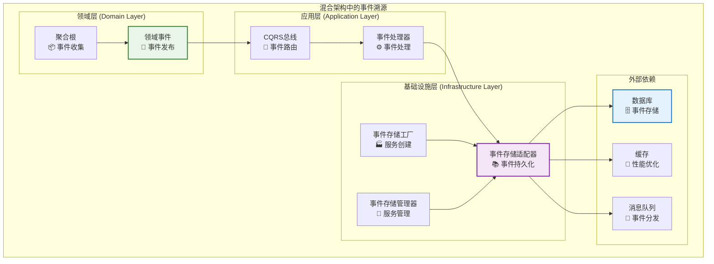
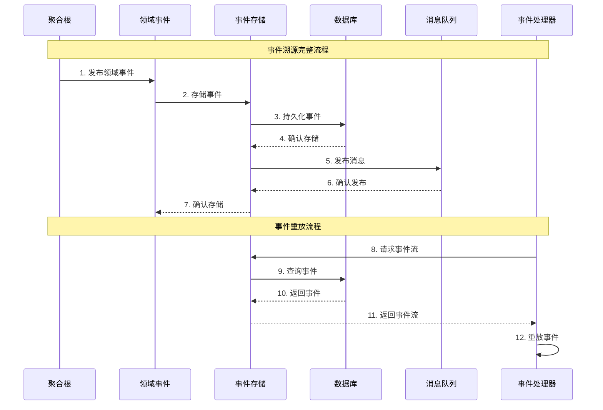
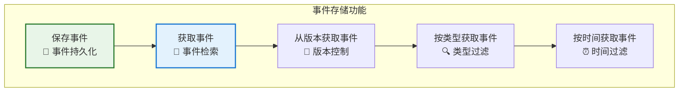
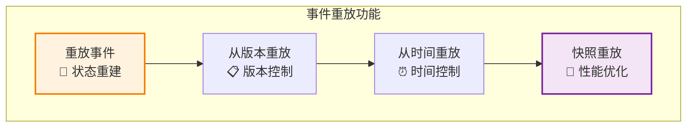
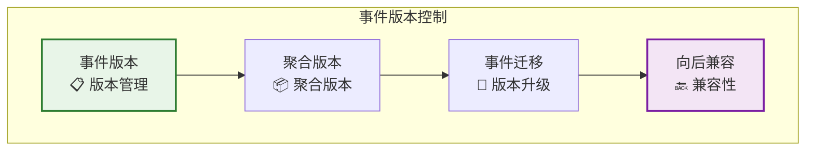
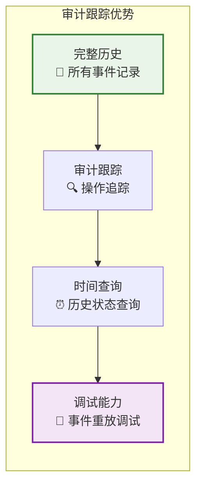
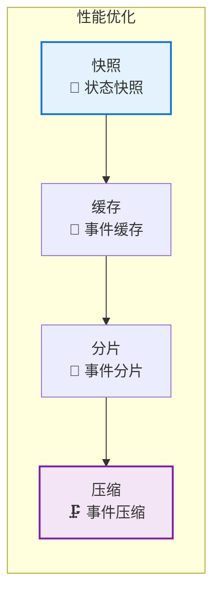

# 🎯 事件溯源在混合架构中的位置

## 📋 概述

本文档专门展示事件溯源（Event Sourcing）在混合架构中的具体位置和实现方式。

---

## 🏗️ 事件溯源在架构中的位置

### 1. 整体架构中的位置



### 2. 事件溯源数据流



---

## 📁 事件溯源在代码中的具体位置

### 1. 领域层事件溯源

#### 位置：`packages/hybrid-archi/src/domain/events/`

```typescript
// 基础领域事件
export class BaseDomainEvent {
  // 事件ID、聚合根ID、事件类型、事件数据等
  // 支持事件版本控制
  // 支持事件元数据
}

// 领域事件类型
export interface IDomainEvent {
  eventId: string;
  aggregateId: string;
  eventType: string;
  eventData: unknown;
  eventVersion: number;
  occurredAt: Date;
}
```

### 2. 应用层事件溯源

#### 位置：`packages/hybrid-archi/src/application/cqrs/event-store/`

```typescript
// 事件存储接口
export interface IEventStore {
  saveEvents(aggregateId: string, events: IDomainEvent[]): Promise<void>;
  getEvents(aggregateId: string): Promise<IDomainEvent[]>;
  getEventsFromVersion(aggregateId: string, fromVersion: number): Promise<IDomainEvent[]>;
}

// 事件流结果
export interface IEventStreamResult {
  events: IDomainEvent[];
  nextVersion: number;
  hasMore: boolean;
}
```

### 3. 基础设施层事件溯源

#### 位置：`packages/hybrid-archi/src/infrastructure/adapters/event-store/`

```typescript
// 事件存储适配器
@Injectable()
export class EventStoreAdapter implements IEventStore {
  constructor(
    private readonly databaseService: DatabaseService,
    private readonly cacheService: CacheService,
    private readonly logger: Logger
  ) {}
  
  async saveEvents(aggregateId: string, events: IDomainEvent[]): Promise<void> {
    // 实现事件存储逻辑
  }
  
  async getEvents(aggregateId: string): Promise<IDomainEvent[]> {
    // 实现事件检索逻辑
  }
}

// 事件存储工厂
@Injectable()
export class EventStoreFactory {
  createEventStore(config: IEventStoreConfig): EventStoreAdapter {
    // 创建事件存储实例
  }
}

// 事件存储管理器
@Injectable()
export class EventStoreManager {
  // 管理事件存储服务
}
```

---

## 🔧 事件溯源的核心功能

### 1. 事件存储功能



### 2. 事件重放功能



### 3. 事件版本控制



---

## 🎯 事件溯源的优势

### 1. 审计跟踪



### 2. 性能优化



---

## 📚 事件溯源使用示例

### 1. 创建事件存储

```typescript
import { EventStoreAdapter } from '@hl8/hybrid-archi/infrastructure';
import { DatabaseService } from '@hl8/database';
import { CacheService } from '@hl8/cache';
import { Logger } from '@hl8/logger';

// 创建事件存储适配器
const eventStore = new EventStoreAdapter(
  databaseService,
  cacheService,
  logger
);
```

### 2. 保存事件

```typescript
// 保存领域事件
await eventStore.saveEvents(aggregateId, [
  new UserCreatedEvent(userId, userData),
  new UserActivatedEvent(userId, activationData)
]);
```

### 3. 重放事件

```typescript
// 获取所有事件
const events = await eventStore.getEvents(aggregateId);

// 从特定版本获取事件
const eventsFromVersion = await eventStore.getEventsFromVersion(
  aggregateId, 
  fromVersion
);

// 重放事件重建聚合状态
const aggregate = events.reduce((acc, event) => {
  return acc.apply(event);
}, new UserAggregate());
```

---

## 🎯 总结

事件溯源在混合架构中的位置：

1. **领域层**: 通过 `BaseDomainEvent` 和聚合根发布领域事件
2. **应用层**: 通过 `IEventStore` 接口定义事件存储契约
3. **基础设施层**: 通过 `EventStoreAdapter` 实现具体的事件存储逻辑

事件溯源提供了：

- ✅ **完整的事件历史记录**
- ✅ **审计跟踪能力**
- ✅ **事件重放功能**
- ✅ **时间查询能力**
- ✅ **调试和故障排除能力**

事件溯源是混合架构中实现完整审计跟踪和状态重建的核心技术！
