# 🏗️ 混合架构总览

## 基于 packages/hybrid-archi 模块的混合架构设计

### 📖 文档概述

本文档基于 `packages/hybrid-archi` 模块的实际代码实现，以图示方式展示整个混合架构的各功能组件及机制。该模块作为通用功能组件，为业务模块的开发提供统一的混合架构设计模式。

---

## 🎯 第一部分：整体架构图

### 1.1 混合架构分层结构

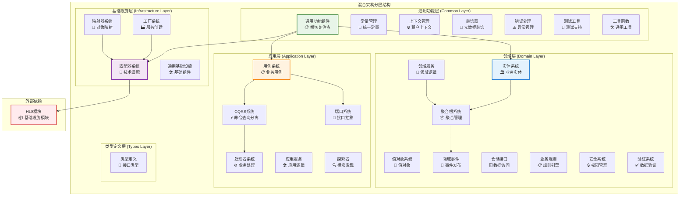

### 1.2 架构依赖关系

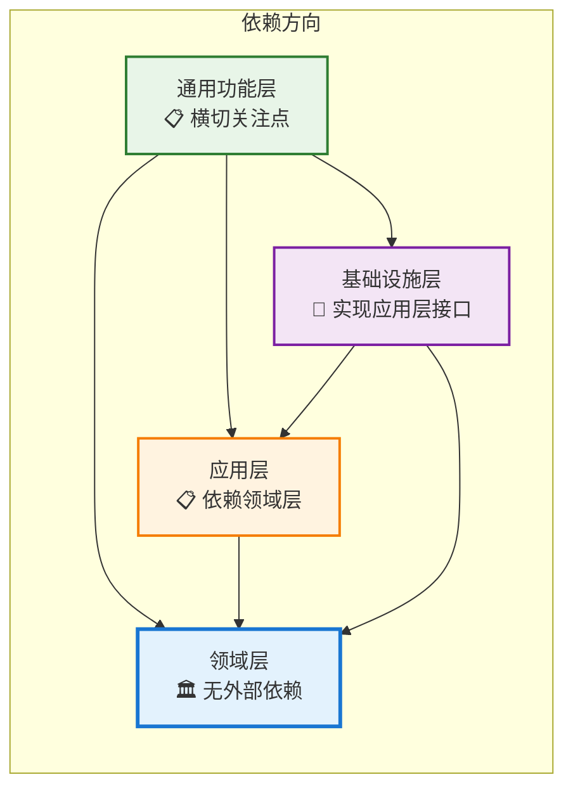

---

## 🏛️ 第二部分：领域层详细架构

### 2.1 领域层组件结构

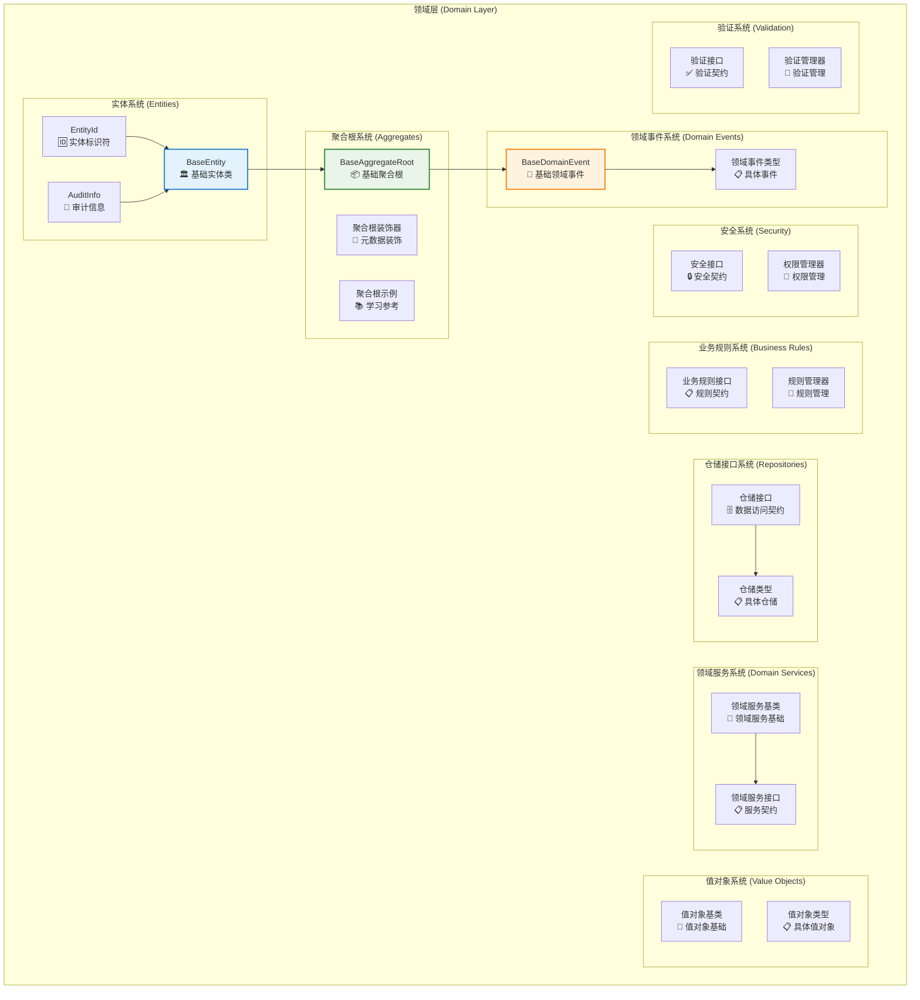

### 2.2 领域层数据流

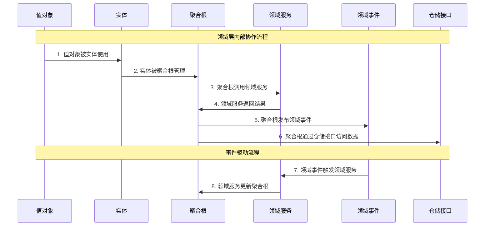

---

## 📋 第三部分：应用层详细架构

### 3.1 应用层组件结构

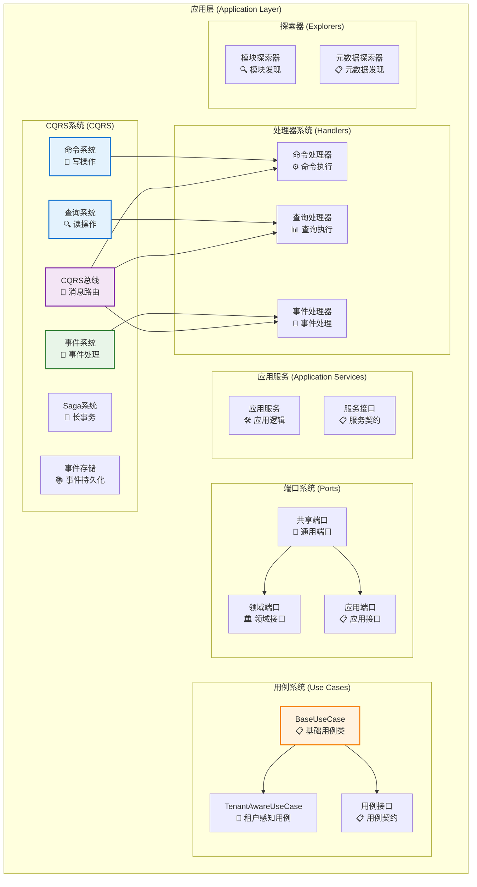

### 3.2 CQRS 数据流

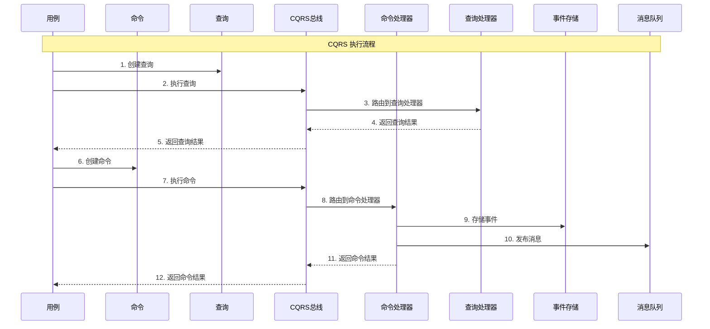

---

## 🔌 第四部分：基础设施层详细架构

### 4.1 基础设施层组件结构

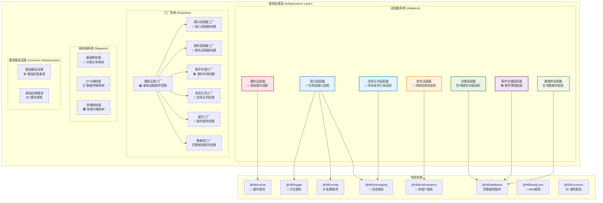

### 4.2 基础设施层数据流

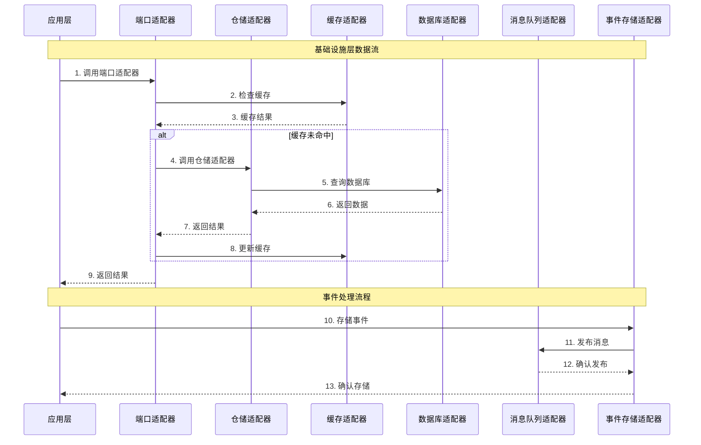

---

## 🔧 第五部分：通用功能层详细架构

### 5.1 通用功能层组件结构

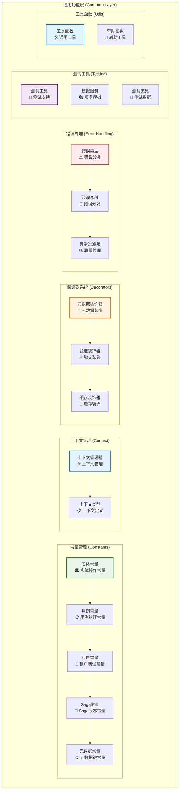

---

## 🔄 第六部分：混合架构数据流

### 6.1 完整的数据流图

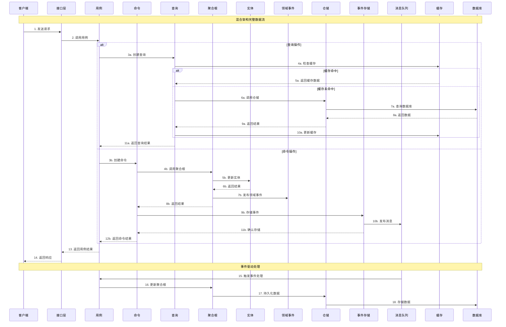

### 6.2 架构模式集成

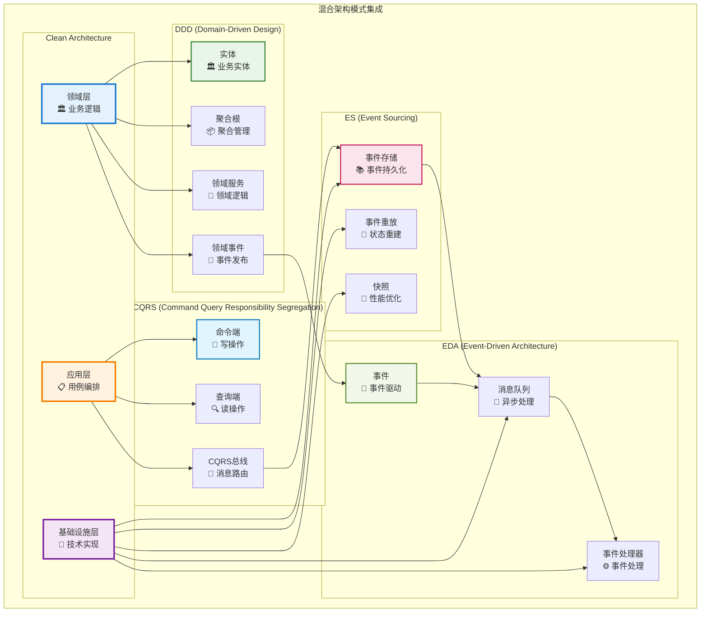

---

## 🎯 第七部分：架构优势

### 7.1 架构优势总结

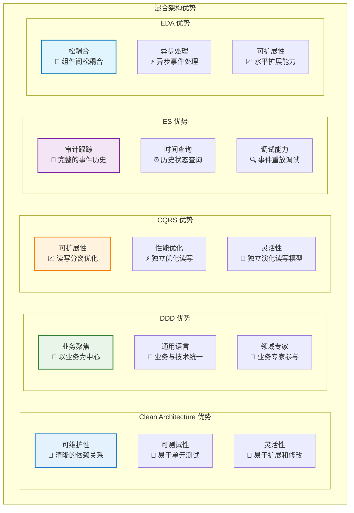

### 7.2 技术栈集成

```mermaid
graph TB
    subgraph "技术栈集成"
        subgraph "核心框架"
            NESTJS["NestJS<br/>🚀 Node.js框架"]
            TYPESCRIPT["TypeScript<br/>📝 类型安全"]
            PNPM["pnpm<br/>📦 包管理"]
        end
        
        subgraph "数据存储"
            POSTGRESQL["PostgreSQL<br/>🐘 关系型数据库"]
            MONGODB["MongoDB<br/>🍃 文档型数据库"]
            REDIS["Redis<br/>💾 缓存数据库"]
        end
        
        subgraph "消息队列"
            RABBITMQ["RabbitMQ<br/>🐰 消息队列"]
            KAFKA["Kafka<br/>📨 流处理"]
        end
        
        subgraph "监控和日志"
            PINO["Pino<br/>📝 日志记录"]
            PROMETHEUS["Prometheus<br/>📊 监控指标"]
            GRAFANA["Grafana<br/>📈 可视化"]
        end
        
        subgraph "测试框架"
            JEST["Jest<br/>🧪 测试框架"]
            CYPRESS["Cypress<br/>🌐 E2E测试"]
        end
    end
    
    NESTJS --> TYPESCRIPT
    TYPESCRIPT --> PNPM
    
    POSTGRESQL --> MONGODB
    MONGODB --> REDIS
    
    RABBITMQ --> KAFKA
    
    PINO --> PROMETHEUS
    PROMETHEUS --> GRAFANA
    
    JEST --> CYPRESS
    
    style NESTJS fill:#e3f2fd,stroke:#1976d2,stroke-width:2px
    style POSTGRESQL fill:#e8f5e8,stroke:#2e7d32,stroke-width:2px
    style RABBITMQ fill:#fff3e0,stroke:#f57c00,stroke-width:2px
    style PINO fill:#f3e5f5,stroke:#7b1fa2,stroke-width:2px
    style JEST fill:#e1f5fe,stroke:#0277bd,stroke-width:2px
```

---

## 📚 第八部分：使用指南

### 8.1 模块导入指南

```typescript
// 导入领域层组件
import { 
  BaseEntity, 
  BaseAggregateRoot, 
  BaseDomainEvent,
  EntityId 
} from '@hl8/hybrid-archi/domain';

// 导入应用层组件
import { 
  BaseUseCase, 
  TenantAwareUseCase 
} from '@hl8/hybrid-archi/application';

// 导入基础设施层组件
import { 
  CacheAdapter, 
  DatabaseAdapter, 
  EventStoreAdapter,
  MessageQueueAdapter 
} from '@hl8/hybrid-archi/infrastructure';

// 导入通用功能组件
import { 
  ENTITY_OPERATIONS, 
  USE_CASE_ERROR_CODES 
} from '@hl8/hybrid-archi/common';
```

### 8.2 基础使用示例

```typescript
// 创建实体
class User extends BaseEntity {
  constructor(
    id: EntityId,
    private name: string,
    private email: string,
    auditInfo: Partial<IAuditInfo>
  ) {
    super(id, auditInfo);
  }
  
  updateName(newName: string): void {
    this.name = newName;
    this.updateTimestamp();
  }
}

// 创建用例
class CreateUserUseCase extends BaseUseCase<CreateUserRequest, CreateUserResponse> {
  constructor(
    private readonly userRepository: IUserRepository,
    private readonly eventBus: IDomainEventBus
  ) {
    super('CreateUser', '创建用户用例');
  }
  
  protected async executeUseCase(
    request: CreateUserRequest,
    context: IUseCaseContext
  ): Promise<CreateUserResponse> {
    const user = new User(
      EntityId.generate(),
      request.name,
      request.email,
      { createdBy: context.userId, tenantId: context.tenantId }
    );
    
    await this.userRepository.save(user);
    return new CreateUserResponse(user.id);
  }
}

// 使用基础设施适配器
const cacheAdapter = new CacheAdapter(cacheService, logger);
const databaseAdapter = new DatabaseAdapter(databaseService, logger);
const eventStoreAdapter = new EventStoreAdapter(databaseService, cacheService, logger);
```

---

## 🎯 总结

### 架构特点

1. **分层清晰**: Clean Architecture 分层明确，依赖方向正确
2. **职责分离**: CQRS 命令查询分离，职责清晰
3. **事件驱动**: 完整的事件驱动架构，支持异步处理
4. **充血模型**: DDD 充血模型实现，业务逻辑内聚
5. **事件溯源**: 完整的事件溯源支持，审计跟踪
6. **通用组件**: 提供通用的架构模式和基础组件
7. **模块集成**: 与现有 `@hl8/*` 模块深度集成

### 技术优势

- ✅ **可维护性**: 清晰的架构分层和依赖关系
- ✅ **可扩展性**: 支持水平扩展和垂直扩展
- ✅ **可测试性**: 完整的测试支持和模拟能力
- ✅ **性能优化**: 多级缓存和异步处理
- ✅ **业务聚焦**: 以业务为中心的架构设计
- ✅ **技术无关**: 技术实现与业务逻辑分离

### 适用场景

- 🏢 **企业级应用**: 复杂业务逻辑的企业应用
- 🔄 **微服务架构**: 分布式微服务系统
- 📈 **高并发系统**: 需要高性能和高并发的系统
- 🎯 **业务复杂系统**: 业务逻辑复杂的领域系统
- 🔍 **审计要求系统**: 需要完整审计跟踪的系统

`packages/hybrid-archi` 模块为业务模块的开发提供了完整的混合架构支持，是构建高质量、可维护、可扩展业务系统的理想选择。
