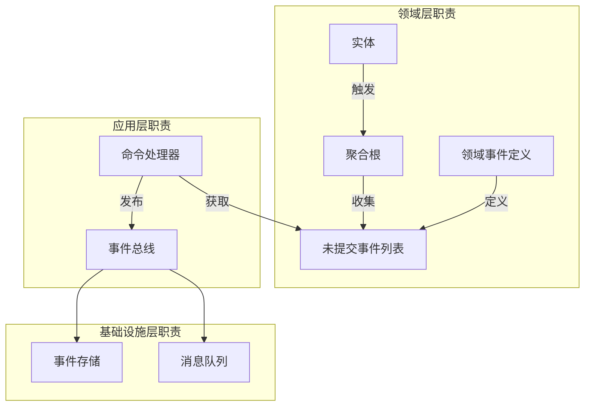

# 🏛️ 聚合根事件管理机制详解

## 为什么聚合根可以在领域层承担事件发布职责？

### 📖 问题背景

在 Clean Architecture 中，领域层应该是最纯净的，不依赖任何外部技术。那么为什么聚合根作为领域层的组件，却可以承担事件发布的职责？这是否违反了架构原则？

**重要说明**: 本文档基于 `packages/hybrid-archi` 模块的实际实现，该模块作为通用功能组件，提供业务模块所需的基础领域层功能。

### 🎯 核心答案

**聚合根并不直接发布事件到基础设施，而是采用"事件收集 + 延迟发布"的机制。**

---

## 🔧 第一部分：事件发布机制的详细分析

### 1.1 聚合根的事件管理机制

```typescript
/**
 * 聚合根的事件管理实现
 */
export abstract class BaseAggregateRoot extends BaseEntity {
  private _uncommittedEvents: BaseDomainEvent[] = [];
  private _version: number = 0;

  // ✅ 关键：这里只是"收集"事件，不是"发布"事件
  protected addDomainEvent(event: BaseDomainEvent): void {
    // 只是将事件添加到内存中的未提交事件列表
    // 没有任何基础设施依赖
    this._uncommittedEvents.push(event);
    this._version++;
  }

  // ✅ 提供事件访问接口，但不直接发布
  getUncommittedEvents(): BaseDomainEvent[] {
    return [...this._uncommittedEvents]; // 返回副本，保护内部状态
  }

  // ✅ 标记事件已处理，清空未提交列表
  markEventsAsCommitted(): void {
    this._uncommittedEvents = [];
  }

  // ✅ 获取聚合版本
  getVersion(): number {
    return this._version;
  }
}

/**
 * 用户聚合根的事件收集
 */
export class UserAggregate extends BaseAggregateRoot {
  activate(activatedBy: string): void {
    const oldStatus = this.user.getStatus();
    
    // 委托业务逻辑给实体
    this.user.activate(activatedBy);
    
    // 只是收集事件，不发布！
    if (oldStatus !== this.user.getStatus()) {
      this.addDomainEvent(new UserActivatedEvent(
        this.user.getId().getValue(),
        activatedBy,
        new Date()
      ));
    }
  }
  
  // 注意：这里没有 eventBus.publish() 调用
  // 没有任何基础设施依赖！
}
```

### 1.2 真正的事件发布在应用层

```typescript
/**
 * 应用层控制事件的实际发布
 */
@CommandHandler(ActivateUserCommand)
export class ActivateUserHandler implements ICommandHandler<ActivateUserCommand> {
  constructor(
    private userRepository: IUserRepository,
    private eventBus: IEventBus  // 应用层依赖基础设施
  ) {}

  async execute(command: ActivateUserCommand): Promise<void> {
    // 1. 加载聚合根
    const userAggregate = await this.userRepository.findById(command.userId);
    
    // 2. 执行业务操作（聚合根只收集事件）
    userAggregate.activate(command.activatedBy);
    
    // 3. 在事务中保存聚合
    await this.transaction.run(async () => {
      await this.userRepository.save(userAggregate);
      
      // 4. 应用层负责真正的事件发布
      const events = userAggregate.getUncommittedEvents();
      for (const event of events) {
        await this.eventBus.publish(event); // 真正的发布在这里
      }
      
      // 5. 标记事件已提交
      userAggregate.markEventsAsCommitted();
    });
  }
}
```

---

## 🏗️ 第二部分：架构层次的职责分析

### 2.1 领域层的事件职责



**职责分工**：

- **领域层**：定义事件、收集事件、管理事件版本
- **应用层**：控制事件发布时机、处理事务边界
- **基础设施层**：实际的事件存储和分发

### 2.2 聚合根事件管理的设计细节

```typescript
/**
 * 聚合根事件管理的完整实现
 */
export class UserAggregate extends BaseAggregateRoot {
  private readonly user: UserEntity;
  private readonly tenantId: string;
  
  // ========== 事件收集机制 ==========
  
  activate(activatedBy: string): void {
    // 记录操作前的状态
    const operationContext = this.createOperationContext();
    const oldStatus = this.user.getStatus();
    
    try {
      // 执行业务逻辑
      this.user.activate(activatedBy);
      
      // 检查是否需要收集事件
      if (this.shouldCollectActivationEvent(oldStatus)) {
        this.collectActivationEvent(oldStatus, activatedBy, operationContext);
      }
      
    } catch (error) {
      // 业务逻辑失败时，也可能需要收集错误事件
      this.collectErrorEvent('activation-failed', error, operationContext);
      throw error;
    }
  }
  
  // ========== 事件收集的业务逻辑 ==========
  
  private shouldCollectActivationEvent(oldStatus: UserStatus): boolean {
    // 业务规则：只有状态真正发生变化时才收集事件
    return oldStatus !== this.user.getStatus() && 
           this.user.getStatus() === UserStatus.ACTIVE;
  }
  
  private collectActivationEvent(
    oldStatus: UserStatus, 
    activatedBy: string,
    context: OperationContext
  ): void {
    const event = new UserActivatedEvent(
      this.user.getId().getValue(),
      activatedBy,
      oldStatus,
      this.user.getStatus(),
      new Date()
    );
    
    // 设置事件的上下文信息
    event.setContext({
      tenantId: this.tenantId,
      correlationId: context.correlationId,
      causationId: context.causationId,
      operationId: context.operationId
    });
    
    // 只是收集，不发布
    this.addDomainEvent(event);
  }
  
  // ========== 事件元数据管理 ==========
  
  private createOperationContext(): OperationContext {
    return new OperationContext(
      generateUUID(), // operationId
      this.getCurrentCorrelationId(),
      this.getCurrentCausationId()
    );
  }
  
  // ========== 事件版本控制 ==========
  
  protected addDomainEvent(event: BaseDomainEvent): void {
    // 设置事件版本
    event.setAggregateVersion(this._version + 1);
    event.setEventSequence(this._uncommittedEvents.length + 1);
    
    // 添加到未提交列表
    super.addDomainEvent(event);
  }
}
```

---

## 🔍 第三部分：与其他架构模式的对比

### 3.1 事件溯源（Event Sourcing）中的设计

```typescript
/**
 * 在事件溯源架构中，聚合根的事件管理更加重要
 */
export class EventSourcedUserAggregate extends BaseAggregateRoot {
  private readonly user: UserEntity;
  
  // ========== 从事件重建聚合 ==========
  
  static fromHistory(events: BaseDomainEvent[]): EventSourcedUserAggregate {
    const aggregate = new EventSourcedUserAggregate();
    
    // 重放事件来重建状态
    events.forEach(event => {
      aggregate.apply(event);
    });
    
    // 重建后清空未提交事件
    aggregate.markEventsAsCommitted();
    
    return aggregate;
  }
  
  // ========== 事件应用逻辑 ==========
  
  private apply(event: BaseDomainEvent): void {
    switch (event.getEventName()) {
      case 'user.registered':
        this.applyUserRegistered(event as UserRegisteredEvent);
        break;
      case 'user.activated':
        this.applyUserActivated(event as UserActivatedEvent);
        break;
      // 更多事件处理...
    }
    
    this._version = event.getAggregateVersion();
  }
  
  private applyUserActivated(event: UserActivatedEvent): void {
    // 通过事件重建实体状态
    this.user.reconstructFromActivationEvent(event);
  }
  
  // ========== 新事件的生成 ==========
  
  activate(activatedBy: string): void {
    // 在事件溯源中，聚合根的事件管理更加关键
    const event = new UserActivatedEvent(...);
    
    // 先应用事件到内部状态
    this.apply(event);
    
    // 然后收集事件待发布
    this.addDomainEvent(event);
  }
}
```

### 3.2 CQRS 中的事件处理

```typescript
/**
 * CQRS 架构中的事件流转
 */

// 命令端：聚合根收集事件
class UserAggregate extends BaseAggregateRoot {
  activate(activatedBy: string): void {
    this.user.activate(activatedBy);
    this.addDomainEvent(new UserActivatedEvent(...)); // 收集事件
  }
}

// 应用层：控制事件发布
@CommandHandler(ActivateUserCommand)
class ActivateUserHandler {
  async execute(command: ActivateUserCommand): Promise<void> {
    const aggregate = await this.userRepository.findById(command.userId);
    aggregate.activate(command.activatedBy);
    
    await this.userRepository.save(aggregate); // 保存时发布事件
  }
}

// 查询端：事件投影器更新读模型
@EventHandler(UserActivatedEvent)
class UserActivatedProjector {
  async handle(event: UserActivatedEvent): Promise<void> {
    // 更新读模型
    await this.userReadModel.updateUserStatus(event.userId, 'active');
  }
}
```

---

## 🏛️ 第四部分：领域层事件管理的设计原理

### 4.1 领域事件的本质

```typescript
/**
 * 领域事件的本质：领域概念，不是技术概念
 */

// ✅ 领域事件是领域概念
export class UserActivatedEvent extends BaseDomainEvent {
  constructor(
    public readonly userId: string,
    public readonly activatedBy: string,
    occurredOn: Date = new Date()
  ) {
    super(occurredOn);
  }
  
  // 这是领域概念，描述业务事实
  getEventName(): string {
    return 'user.activated';
  }
  
  // 领域事件可以包含业务查询方法
  isFirstTimeActivation(): boolean {
    // 业务逻辑：判断是否是首次激活
    return this.previousStatus === UserStatus.PENDING;
  }
  
  requiresWelcomeEmail(): boolean {
    // 业务逻辑：判断是否需要发送欢迎邮件
    return this.isFirstTimeActivation();
  }
}

// ❌ 事件总线是基础设施概念
interface IEventBus {
  publish(event: BaseDomainEvent): Promise<void>;
  subscribe(eventType: string, handler: IEventHandler): void;
}
```

### 4.2 聚合根事件管理的层次设计

```typescript
/**
 * 聚合根的事件管理：三层设计
 */
export class UserAggregate extends BaseAggregateRoot {
  
  // ========== 第一层：事件收集（领域层职责） ==========
  
  activate(activatedBy: string): void {
    const oldStatus = this.user.getStatus();
    this.user.activate(activatedBy);
    
    // 这里只是收集事件，没有发布
    if (oldStatus !== this.user.getStatus()) {
      this.addDomainEvent(new UserActivatedEvent(
        this.user.getId().getValue(),
        activatedBy,
        new Date()
      ));
    }
  }
  
  // ========== 第二层：事件元数据管理（领域层职责） ==========
  
  protected addDomainEvent(event: BaseDomainEvent): void {
    // 设置聚合相关的元数据
    event.setAggregateId(this.getId().getValue());
    event.setAggregateType('User');
    event.setAggregateVersion(this._version + 1);
    
    // 设置业务上下文
    event.setTenantId(this.tenantId);
    event.setEventSequence(this._uncommittedEvents.length + 1);
    
    // 添加到未提交列表
    this._uncommittedEvents.push(event);
    this._version++;
  }
  
  // ========== 第三层：事件访问接口（领域层职责） ==========
  
  /**
   * 获取未提交的事件（只读访问）
   */
  getUncommittedEvents(): ReadonlyArray<BaseDomainEvent> {
    return this._uncommittedEvents;
  }
  
  /**
   * 检查是否有未提交的事件
   */
  hasUncommittedEvents(): boolean {
    return this._uncommittedEvents.length > 0;
  }
  
  /**
   * 获取特定类型的未提交事件
   */
  getUncommittedEventsOfType<T extends BaseDomainEvent>(
    eventType: new (...args: any[]) => T
  ): T[] {
    return this._uncommittedEvents.filter(event => 
      event instanceof eventType
    ) as T[];
  }
}
```

### 1.3 应用层控制实际发布

```typescript
/**
 * 应用层：真正的事件发布控制
 */
@Injectable()
export class DomainEventPublisher {
  constructor(
    private eventBus: IEventBus,        // 基础设施依赖
    private eventStore: IEventStore,    // 基础设施依赖
    private logger: ILoggerService      // 基础设施依赖
  ) {}

  /**
   * 发布聚合根的未提交事件
   */
  async publishAggregateEvents(aggregate: BaseAggregateRoot): Promise<void> {
    const events = aggregate.getUncommittedEvents();
    
    if (events.length === 0) {
      return;
    }
    
    try {
      // 1. 保存事件到事件存储
      await this.eventStore.saveEvents(
        aggregate.getId().getValue(),
        events,
        aggregate.getVersion() - events.length
      );
      
      // 2. 发布事件到事件总线
      for (const event of events) {
        await this.eventBus.publish(event);
        
        this.logger.info('领域事件已发布', {
          eventName: event.getEventName(),
          aggregateId: event.getAggregateId(),
          aggregateType: event.getAggregateType()
        });
      }
      
      // 3. 标记事件已提交
      aggregate.markEventsAsCommitted();
      
    } catch (error) {
      this.logger.error('事件发布失败', {
        aggregateId: aggregate.getId().getValue(),
        eventCount: events.length,
        error
      });
      throw error;
    }
  }
}

/**
 * 命令处理器使用事件发布器
 */
@CommandHandler(ActivateUserCommand)
export class ActivateUserHandler {
  constructor(
    private userRepository: IUserRepository,
    private eventPublisher: DomainEventPublisher  // 使用专门的事件发布器
  ) {}

  async execute(command: ActivateUserCommand): Promise<void> {
    const userAggregate = await this.userRepository.findById(command.userId);
    
    // 执行业务操作
    userAggregate.activate(command.activatedBy);
    
    // 在事务中保存和发布
    await this.transaction.run(async () => {
      await this.userRepository.save(userAggregate);
      await this.eventPublisher.publishAggregateEvents(userAggregate);
    });
  }
}
```

---

## 🔄 第五部分：事件发布时机的控制

### 5.1 事务一致性的保证

```typescript
/**
 * 事务一致性的事件发布控制
 */
export class TransactionalEventPublisher {
  private pendingEvents: Map<string, BaseDomainEvent[]> = new Map();
  
  /**
   * 在事务中注册待发布的事件
   */
  registerEventsForTransaction(
    transactionId: string, 
    events: BaseDomainEvent[]
  ): void {
    this.pendingEvents.set(transactionId, events);
  }
  
  /**
   * 事务提交后发布事件
   */
  async onTransactionCommitted(transactionId: string): Promise<void> {
    const events = this.pendingEvents.get(transactionId);
    if (!events) return;
    
    try {
      // 事务成功后才真正发布事件
      for (const event of events) {
        await this.eventBus.publish(event);
      }
      
    } finally {
      // 清理待发布事件
      this.pendingEvents.delete(transactionId);
    }
  }
  
  /**
   * 事务回滚时清理事件
   */
  async onTransactionRolledBack(transactionId: string): Promise<void> {
    // 事务失败时不发布事件
    this.pendingEvents.delete(transactionId);
  }
}

/**
 * 仓储实现中的事件处理
 */
@Injectable()
export class UserRepositoryImpl implements IUserRepository {
  constructor(
    private databaseService: TenantAwareDatabaseService,
    private eventPublisher: TransactionalEventPublisher
  ) {}

  async save(userAggregate: UserAggregate): Promise<void> {
    const transactionId = generateTransactionId();
    
    try {
      await this.databaseService.transaction(async (tx) => {
        // 1. 保存聚合数据
        await this.saveAggregateData(userAggregate, tx);
        
        // 2. 注册事件待发布
        const events = userAggregate.getUncommittedEvents();
        this.eventPublisher.registerEventsForTransaction(transactionId, events);
        
        // 3. 事务提交后会自动发布事件
      });
      
      // 4. 通知事务成功
      await this.eventPublisher.onTransactionCommitted(transactionId);
      
      // 5. 标记聚合事件已提交
      userAggregate.markEventsAsCommitted();
      
    } catch (error) {
      // 事务失败时清理事件
      await this.eventPublisher.onTransactionRolledBack(transactionId);
      throw error;
    }
  }
}
```

---

## 🎨 第六部分：设计模式的应用

### 6.1 观察者模式在聚合根中的应用

```typescript
/**
 * 聚合根内部的观察者模式
 */
export class UserAggregate extends BaseAggregateRoot {
  private eventCollectors: IEventCollector[] = [];
  
  constructor(user: UserEntity, tenantId: string) {
    super(user.getId());
    this.user = user;
    this.tenantId = tenantId;
    
    // 注册事件收集器
    this.registerEventCollectors();
  }
  
  private registerEventCollectors(): void {
    // 用户状态变更事件收集器
    this.eventCollectors.push(new UserStatusChangeEventCollector());
    
    // 用户信息更新事件收集器
    this.eventCollectors.push(new UserInfoUpdateEventCollector());
    
    // 安全相关事件收集器
    this.eventCollectors.push(new UserSecurityEventCollector());
  }
  
  activate(activatedBy: string): void {
    const context = new OperationContext(this.user, activatedBy, 'activate');
    
    // 执行业务逻辑
    this.user.activate(activatedBy);
    
    // 通知所有事件收集器
    this.eventCollectors.forEach(collector => {
      const events = collector.collectEvents(context);
      events.forEach(event => this.addDomainEvent(event));
    });
  }
}

/**
 * 事件收集器接口
 */
interface IEventCollector {
  collectEvents(context: OperationContext): BaseDomainEvent[];
}

/**
 * 用户状态变更事件收集器
 */
class UserStatusChangeEventCollector implements IEventCollector {
  collectEvents(context: OperationContext): BaseDomainEvent[] {
    const events: BaseDomainEvent[] = [];
    
    if (context.operation === 'activate' && context.hasStatusChanged()) {
      events.push(new UserActivatedEvent(
        context.userId,
        context.operatedBy,
        context.oldStatus,
        context.newStatus,
        new Date()
      ));
    }
    
    return events;
  }
}
```

### 6.2 命令模式在事件管理中的应用

```typescript
/**
 * 使用命令模式管理事件操作
 */
interface IEventCommand {
  execute(): BaseDomainEvent;
  canExecute(): boolean;
}

class CreateActivationEventCommand implements IEventCommand {
  constructor(
    private userId: string,
    private activatedBy: string,
    private oldStatus: UserStatus,
    private newStatus: UserStatus
  ) {}
  
  canExecute(): boolean {
    return this.oldStatus !== this.newStatus && 
           this.newStatus === UserStatus.ACTIVE;
  }
  
  execute(): BaseDomainEvent {
    return new UserActivatedEvent(
      this.userId,
      this.activatedBy,
      this.oldStatus,
      this.newStatus,
      new Date()
    );
  }
}

export class UserAggregate extends BaseAggregateRoot {
  activate(activatedBy: string): void {
    const oldStatus = this.user.getStatus();
    
    // 执行业务逻辑
    this.user.activate(activatedBy);
    
    // 使用命令模式创建事件
    const eventCommand = new CreateActivationEventCommand(
      this.user.getId().getValue(),
      activatedBy,
      oldStatus,
      this.user.getStatus()
    );
    
    if (eventCommand.canExecute()) {
      const event = eventCommand.execute();
      this.addDomainEvent(event);
    }
  }
}
```

---

## 📋 第七部分：设计决策的权衡分析

### 7.1 不同设计方案的对比

| 方案 | 优点 | 缺点 | 适用场景 |
|------|------|------|----------|
| **实体直接发布** | 简单直接 | 破坏架构纯净性、测试困难 | 简单应用 |
| **聚合根收集事件** | 职责清晰、架构纯净 | 稍微复杂 | 企业级应用 |
| **应用层发布** | 完全分离 | 事件逻辑分散、容易遗漏 | 特殊场景 |

### 7.2 我们选择"聚合根收集"的原因

```typescript
/**
 * 设计决策的完整考虑
 */

// 考虑因素1：架构纯净性
class UserAggregate extends BaseAggregateRoot {
  // ✅ 没有基础设施依赖
  // ✅ 事件是领域概念，不是技术概念
  // ✅ 符合Clean Architecture原则
  
  activate(activatedBy: string): void {
    this.user.activate(activatedBy);
    this.addDomainEvent(new UserActivatedEvent(...)); // 领域概念
  }
}

// 考虑因素2：事务一致性
class ActivateUserHandler {
  async execute(command: ActivateUserCommand): Promise<void> {
    const aggregate = await this.userRepository.findById(command.userId);
    
    // 业务操作和事件收集在同一个对象中
    aggregate.activate(command.activatedBy);
    
    // 事务边界控制
    await this.transaction.run(async () => {
      await this.userRepository.save(aggregate);
      // 只有保存成功后才发布事件
      await this.publishEvents(aggregate.getUncommittedEvents());
    });
  }
}

// 考虑因素3：测试友好性
describe('UserAggregate', () => {
  it('should collect activation event', () => {
    const aggregate = UserAggregate.create(...);
    
    aggregate.activate('admin-001');
    
    // 可以轻松测试事件收集，无需mock基础设施
    const events = aggregate.getUncommittedEvents();
    expect(events).toHaveLength(1);
    expect(events[0]).toBeInstanceOf(UserActivatedEvent);
  });
});
```

---

## 🔍 第八部分：深入理解：事件的"发布"定义

### 8.1 什么是真正的"发布"？

```typescript
/**
 * 事件发布的完整过程
 */

// 第1步：聚合根"收集"事件（领域层）
class UserAggregate {
  activate(): void {
    this.addDomainEvent(event); // 这不是"发布"，是"收集"
  }
}

// 第2步：应用层"调度"事件发布（应用层）
class EventPublishingService {
  async publishEvents(events: BaseDomainEvent[]): Promise<void> {
    for (const event of events) {
      await this.scheduleEventPublication(event);
    }
  }
}

// 第3步：基础设施层"执行"事件发布（基础设施层）
class EventBusImpl implements IEventBus {
  async publish(event: BaseDomainEvent): Promise<void> {
    // 真正的发布：写入消息队列、通知订阅者等
    await this.messageQueue.send(event);
    await this.notifySubscribers(event);
  }
}
```

### 8.2 聚合根的"事件发布"实际上是"事件收集"

```typescript
/**
 * 澄清概念：聚合根的事件管理
 */
export class UserAggregate extends BaseAggregateRoot {
  
  // 这个方法的名字可能造成误解
  // 实际上应该叫 "collectDomainEvent" 更准确
  protected addDomainEvent(event: BaseDomainEvent): void {
    // 这里只是收集事件到内存列表
    // 没有任何"发布"动作
    this._uncommittedEvents.push(event);
  }
  
  // 更准确的命名可能是：
  protected collectDomainEvent(event: BaseDomainEvent): void {
    this._uncommittedEvents.push(event);
  }
  
  protected recordDomainEvent(event: BaseDomainEvent): void {
    this._uncommittedEvents.push(event);
  }
  
  protected queueDomainEvent(event: BaseDomainEvent): void {
    this._uncommittedEvents.push(event);
  }
}
```

---

## 🎯 第九部分：为什么这样设计？

### 9.1 架构纯净性的价值

```typescript
/**
 * 纯净的领域层设计
 */

// ✅ 领域层：纯粹的业务概念
class UserAggregate extends BaseAggregateRoot {
  activate(activatedBy: string): void {
    this.user.activate(activatedBy);
    
    // 这里的"事件"是领域概念，不是技术概念
    this.addDomainEvent(new UserActivatedEvent(...));
  }
}

// ✅ 应用层：技术和业务的桥梁
class ActivateUserHandler {
  async execute(command: ActivateUserCommand): Promise<void> {
    const aggregate = await this.userRepository.findById(command.userId);
    aggregate.activate(command.activatedBy);
    
    // 应用层负责技术实现
    await this.saveAggregateAndPublishEvents(aggregate);
  }
}

// ✅ 基础设施层：纯粹的技术实现
class EventBusImpl implements IEventBus {
  async publish(event: BaseDomainEvent): Promise<void> {
    // 技术实现：消息队列、数据库、网络等
    await this.messageQueue.send(event);
  }
}
```

### 9.2 可测试性的提升

```typescript
/**
 * 测试友好的设计
 */

// 实体测试：纯粹的业务逻辑测试
describe('UserEntity', () => {
  it('should activate user', () => {
    const user = UserEntity.create(...);
    
    user.activate('admin-001');
    
    expect(user.getStatus()).toBe(UserStatus.ACTIVE);
    // 不需要mock任何基础设施
  });
});

// 聚合根测试：事件收集测试
describe('UserAggregate', () => {
  it('should collect activation event', () => {
    const aggregate = UserAggregate.create(...);
    
    aggregate.activate('admin-001');
    
    const events = aggregate.getUncommittedEvents();
    expect(events).toHaveLength(1);
    expect(events[0]).toBeInstanceOf(UserActivatedEvent);
    // 仍然不需要mock基础设施
  });
});

// 应用层测试：完整流程测试
describe('ActivateUserHandler', () => {
  it('should activate user and publish event', async () => {
    const mockEventBus = jest.fn();
    const handler = new ActivateUserHandler(repository, mockEventBus);
    
    await handler.execute(command);
    
    expect(mockEventBus.publish).toHaveBeenCalledWith(
      expect.any(UserActivatedEvent)
    );
  });
});
```

---

## 🏆 总结

### **为什么聚合根可以在领域层承担事件发布职责？**

**核心答案**：聚合根**不是真正的发布事件**，而是**收集和管理领域事件**。

### **关键区别**

1. **事件收集**（领域层职责）：
   - 创建领域事件对象
   - 添加到未提交事件列表
   - 管理事件元数据和版本
   - **没有基础设施依赖**

2. **事件发布**（应用层/基础设施层职责）：
   - 将事件写入事件存储
   - 通过消息队列分发事件
   - 通知事件订阅者
   - **需要基础设施支持**

### **设计价值**

1. **架构纯净性**：领域层保持纯净，不依赖基础设施
2. **职责清晰性**：聚合根管理事件，应用层控制发布
3. **事务一致性**：事件发布与数据保存在同一事务中
4. **测试友好性**：可以独立测试事件收集和业务逻辑
5. **扩展灵活性**：可以在应用层实现复杂的事件发布策略

### **核心理念**

聚合根的"事件发布"实际上是"事件收集"，真正的发布由应用层控制。这样既保持了领域层的纯净性，又确保了事件管理的集中性和一致性。

这是一个精妙的架构设计，既遵循了Clean Architecture的原则，又满足了事件驱动架构的需求！
