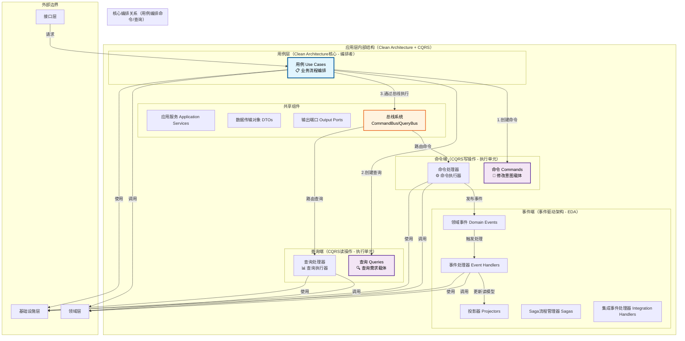
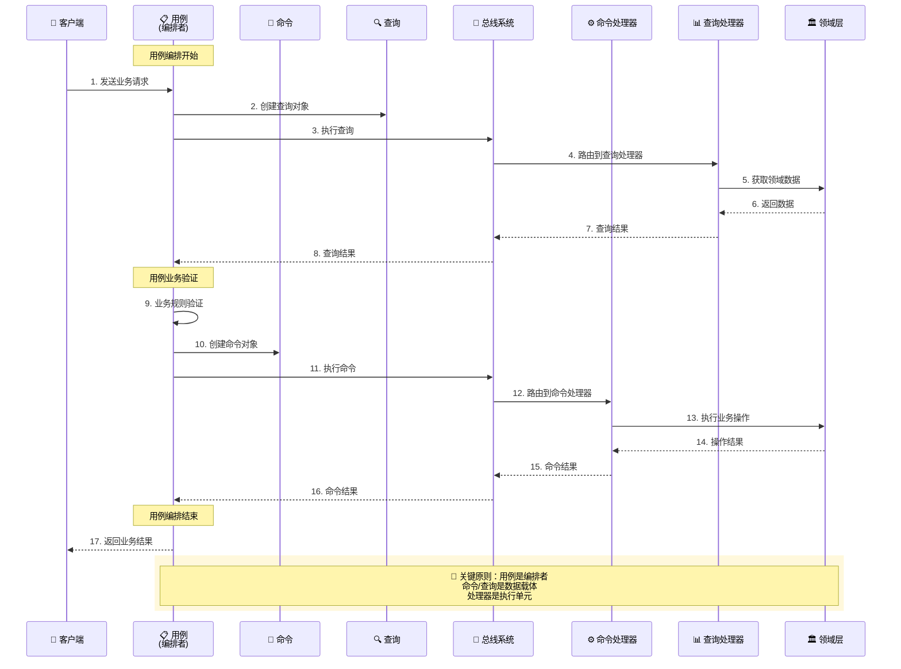
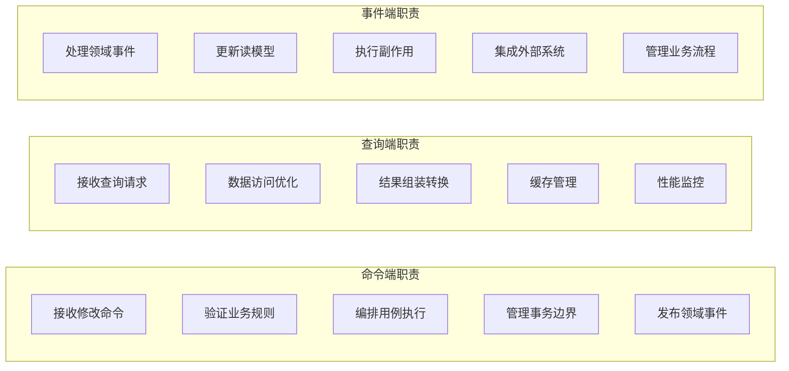
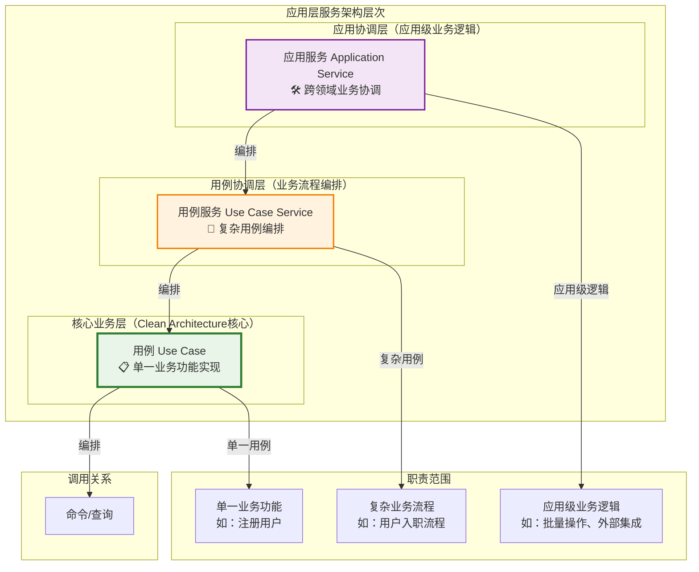
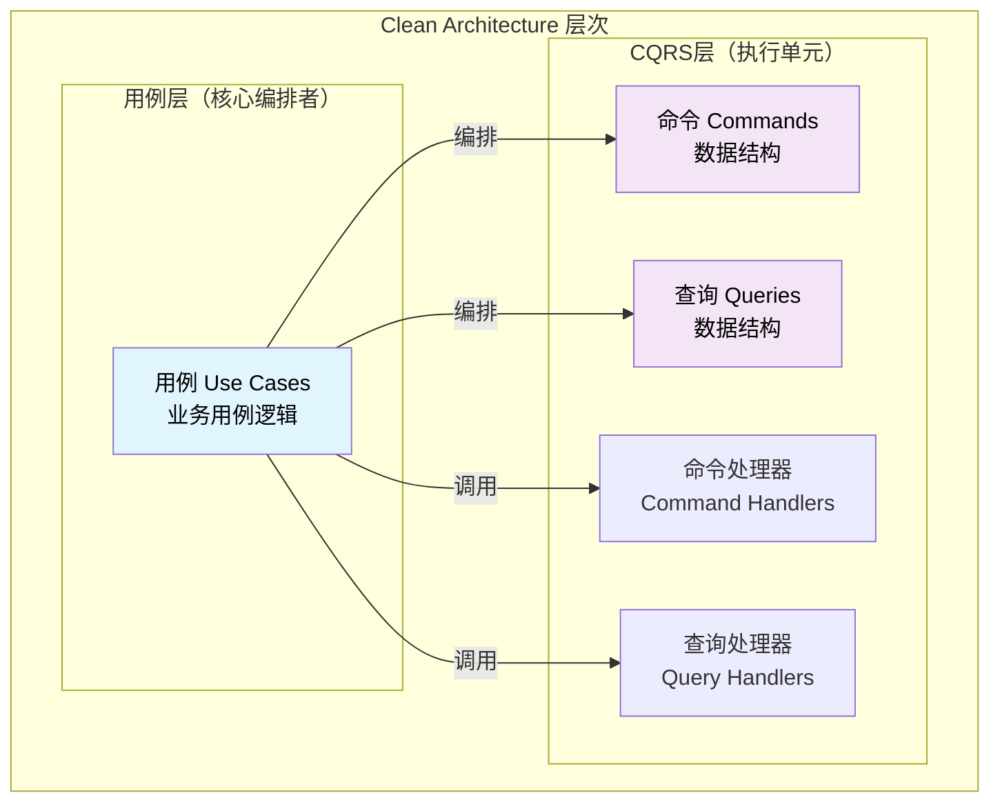
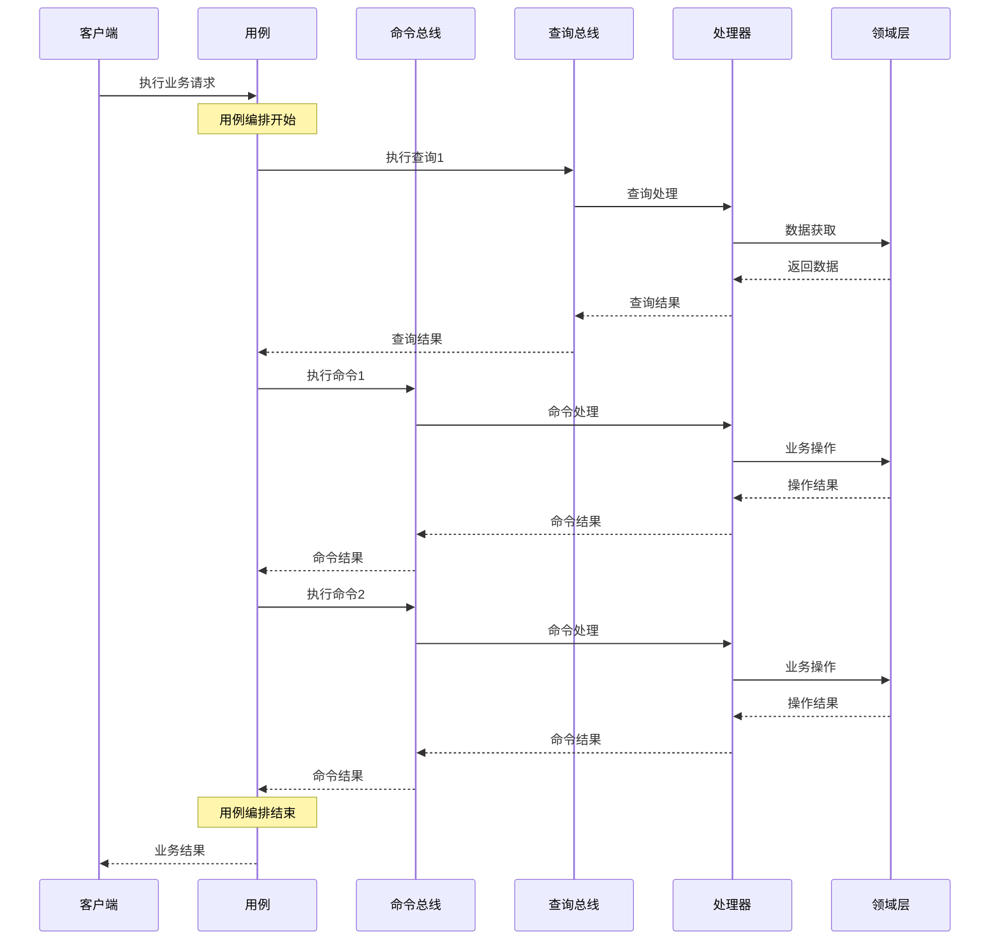
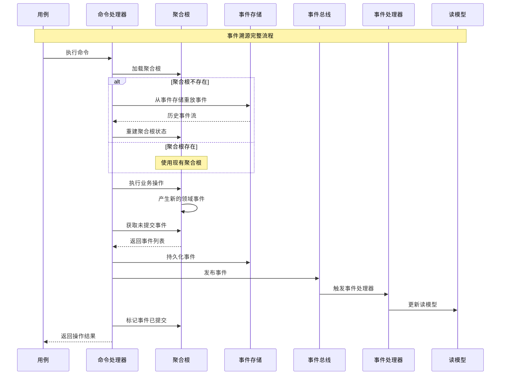
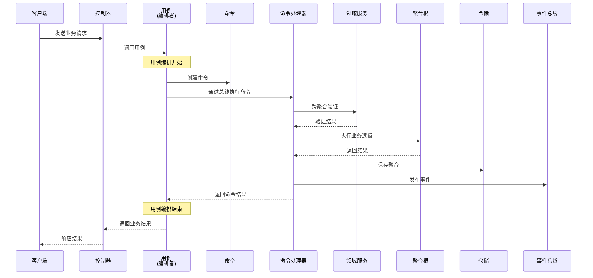
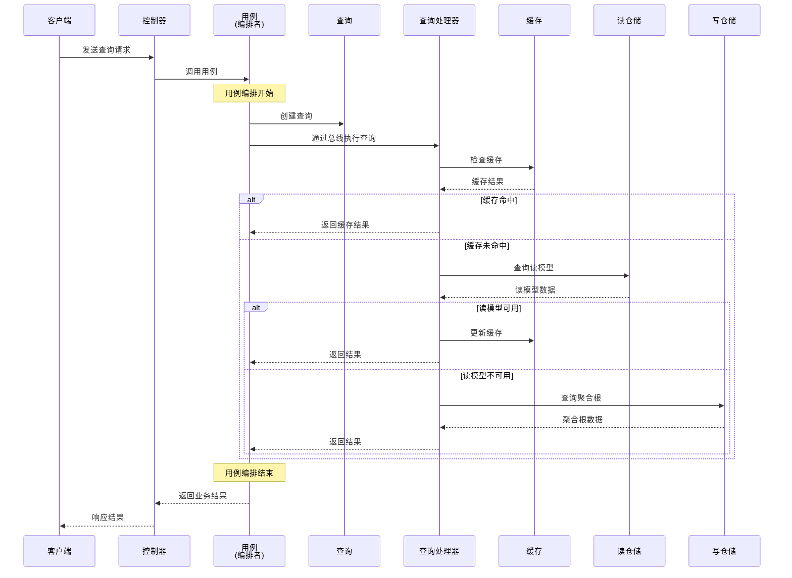

# 🔧 应用层设计原则详解

## CQRS 模式下的应用层组件职责与设计规范

### 📖 文档概述

本文档详细阐述了在混合架构（Clean Architecture + CQRS + ES + EDA）下，应用层各个组件的职责划分、设计原则和最佳实践。应用层作为领域层和基础设施层的桥梁，遵循**"用例编排命令/查询"**的核心架构原则，负责业务流程编排、事务管理、事件发布和外部协调。

**重要说明**: 本文档基于 `packages/hybrid-archi` 模块的实际实现，该模块作为通用功能组件，提供业务模块所需的基础应用层功能。

---

## 🎯 第一部分：应用层组件职责矩阵

### 1.1 组件职责总览

| 组件 | 主要职责 | 次要职责 | 不应承担的职责 |
|------|---------|---------|---------------|
| **用例（Use Case）** | 业务用例实现、流程编排 | 权限验证、数据转换 | 具体业务规则、技术实现细节 |
| **命令（Command）** | 表达修改意图、携带业务数据 | 基础验证、元数据管理 | 业务逻辑执行、状态管理 |
| **命令处理器** | 命令执行、事务管理 | 业务验证、事件发布 | 具体业务逻辑、数据存储 |
| **查询（Query）** | 表达查询需求、携带查询条件 | 缓存键生成、参数验证 | 数据获取逻辑、结果处理 |
| **查询处理器** | 查询执行、数据组装 | 缓存管理、性能优化 | 状态修改、事件发布 |
| **事件处理器** | 副作用处理、读模型更新 | 异步任务、集成事件 | 核心业务逻辑、直接数据修改 |
| **事件总线** | 事件路由、异步分发 | 事件监控、故障处理 | 业务逻辑、数据存储 |
| **Saga流程管理器** | 长事务编排、补偿机制 | 状态跟踪、错误恢复 | 短期事务、同步处理 |
| **集成事件处理器** | 外部系统集成、跨界通信 | 重试机制、降级处理 | 内部业务逻辑、数据一致性 |
| **应用服务** | 应用级业务逻辑、外部集成 | 数据转换、权限检查 | 领域业务逻辑、基础设施细节 |
| **DTO** | 数据传输、接口契约 | 数据验证、格式转换 | 业务逻辑、状态管理 |

### 1.2 应用层架构图



### 1.3 用例编排命令/查询的详细流程



### 1.4 CQRS 职责分离



---

## 🎯 第二部分：用例（Use Case）设计原则

### 2.1 用例在Clean Architecture中的核心地位

用例是Clean Architecture应用层的核心组件，代表了系统的具体业务功能。在我们的混合架构中，用例作为**业务流程的编排者**，负责创建和编排CQRS的命令、查询，而不是被命令/查询编排。

#### **用例的核心职责**

1. **业务用例实现**：实现具体的业务功能和用户故事
2. **流程编排**：编排命令和查询来完成复杂的业务流程  
3. **权限控制**：实现用例级别的权限验证
4. **数据转换**：处理输入输出数据的转换
5. **事务协调**：管理跨多个聚合的事务操作

> 💡 **重要说明**：在我们的混合架构中，用例遵循**"用例编排命令/查询"**的核心原则，作为业务流程的指挥者，创建命令和查询并通过总线系统编排其执行，同时保持Clean Architecture的用例中心设计。

---

## 🔄 第三部分：用例、用例服务、应用服务的区别与联系

### 3.1 三者的概念定位和层次关系

#### 3.1.1 概念层次图



#### 3.1.2 职责分层矩阵

| 组件 | 核心职责 | 业务范围 | 复杂度 | 编排对象 | 典型场景 |
|------|---------|---------|--------|---------|----------|
| **用例（Use Case）** | 单一业务功能实现 | 单一聚合或简单跨聚合 | 低-中 | 命令/查询 | 注册用户、更新资料 |
| **用例服务（Use Case Service）** | 复杂用例编排 | 多聚合复杂流程 | 中-高 | 多个用例 | 用户入职、订单处理 |
| **应用服务（Application Service）** | 应用级业务逻辑 | 跨领域、外部集成 | 高 | 用例服务/用例 | 批量操作、系统集成 |

---

## 🏗️ 第四部分：用例编排命令/查询的架构原则

### 4.1 核心架构原则：用例编排命令/查询

**在我们的混合架构中，应该是用例编排命令/查询，而不是命令/查询编排用例。**

这是Clean Architecture和CQRS结合的核心原则，确保了架构的正确依赖方向和职责分离。

#### 4.1.1 架构依赖关系



**关键原则**：

- **用例是业务逻辑的核心**：位于Clean Architecture的中心
- **命令/查询是数据传输的载体**：服务于用例的需要
- **依赖方向**：用例 → 命令/查询 → 处理器

#### 4.1.2 正确模式：用例编排命令/查询

```typescript
/**
 * ✅ 正确：用例编排命令/查询
 * 用例作为业务流程的指挥者，编排多个命令和查询
 * 基于 packages/hybrid-archi 模块的 BaseUseCase
 */
import { BaseUseCase } from '@hl8/hybrid-archi/application';
import { GeneralBadRequestException } from '@hl8/common';

export class ProcessOrderUseCase extends BaseUseCase<ProcessOrderRequest, ProcessOrderResponse> {
  constructor(
    private readonly orderRepository: IOrderRepository,
    private readonly productRepository: IProductRepository,
    private readonly eventBus: IDomainEventBus
  ) {
    super('ProcessOrder', '处理订单用例');
  }

  protected async executeUseCase(
    request: ProcessOrderRequest,
    context: IUseCaseContext
  ): Promise<ProcessOrderResponse> {
    // 用例编排整个业务流程
    
    // 1. 查询：验证库存
    const checkStockQuery = new CheckProductStockQuery(request.productId, request.quantity);
    const stockAvailable = await this.queryBus.execute(checkStockQuery);
    
    if (!stockAvailable) {
      throw new GeneralBadRequestException('库存不足');
    }

    // 2. 命令：创建订单
    const createOrderCommand = new CreateOrderCommand(
      request.customerId,
      request.productId,
      request.quantity,
      request.price
    );
    const orderResult = await this.commandBus.execute(createOrderCommand);

    // 3. 命令：扣减库存
    const reduceStockCommand = new ReduceProductStockCommand(
      request.productId,
      request.quantity,
      orderResult.orderId
    );
    await this.commandBus.execute(reduceStockCommand);

    // 4. 命令：发送确认邮件
    const emailCommand = new SendOrderConfirmationCommand(
      orderResult.orderId,
      request.customerEmail
    );
    await this.commandBus.execute(emailCommand);

    // 5. 返回业务结果
    return new ProcessOrderResponse(
      orderResult.orderId,
      orderResult.status,
      orderResult.totalAmount
    );
  }
}
```

**优势**：

- ✅ **业务逻辑集中**：用例包含完整的业务流程
- ✅ **事务边界清晰**：用例控制整个事务的边界
- ✅ **错误处理统一**：用例处理业务级别的错误
- ✅ **测试友好**：可以模拟命令/查询来测试用例

#### 4.1.3 错误模式：命令/查询编排用例

```typescript
/**
 * ❌ 错误：命令编排用例
 * 这违反了Clean Architecture的依赖原则
 */
export class RegisterUserCommand extends BaseCommand {
  constructor(
    public readonly email: string,
    public readonly name: string,
    public readonly tenantId: string
  ) {
    super();
  }

  // ❌ 错误：命令不应该编排用例
  async orchestrateRegistration(): Promise<void> {
    // 这些逻辑应该在用例中
    const validateUseCase = new ValidateUserUseCase();
    await validateUseCase.execute({ email: this.email });

    const createUseCase = new CreateUserUseCase();
    await createUseCase.execute({ 
      email: this.email, 
      name: this.name, 
      tenantId: this.tenantId 
    });

    const notifyUseCase = new NotifyUserUseCase();
    await notifyUseCase.execute({ email: this.email });
  }
}
```

**问题**：

- ❌ **违反依赖原则**：命令依赖了用例，颠倒了依赖方向
- ❌ **职责混乱**：命令承担了业务编排的职责
- ❌ **难以测试**：命令变得复杂，难以单元测试
- ❌ **重用困难**：命令与特定的用例组合绑定

### 4.2 编排模式的实践指导

#### 4.2.1 简单场景：单命令用例

```typescript
/**
 * 简单场景：用例编排单个命令
 */
export class UpdateUserProfileUseCase {
  async execute(request: UpdateUserProfileRequest): Promise<UpdateUserProfileResponse> {
    // 即使是简单场景，也是用例编排命令
    
    // 1. 业务验证（用例层）
    if (!request.userId || !request.name) {
      throw new ValidationError('用户ID和姓名不能为空');
    }

    // 2. 权限检查（用例层）
    await this.checkPermission(request.userId, 'update-profile');

    // 3. 编排命令执行
    const command = new UpdateUserProfileCommand(
      request.userId,
      request.name,
      request.avatar,
      request.updatedBy
    );

    const result = await this.commandBus.execute(command);

    // 4. 返回业务结果
    return new UpdateUserProfileResponse(
      result.userId,
      result.name,
      result.avatar,
      result.updatedAt
    );
  }

  private async checkPermission(userId: string, permission: string): Promise<void> {
    const query = new CheckUserPermissionQuery(userId, permission);
    const hasPermission = await this.queryBus.execute(query);
    
    if (!hasPermission) {
      throw new UnauthorizedError('没有权限执行此操作');
    }
  }
}
```

#### 4.2.2 复杂场景：多命令查询编排

```typescript
/**
 * 复杂场景：用例编排多个命令和查询
 */
export class TransferMoneyUseCase {
  async execute(request: TransferMoneyRequest): Promise<TransferMoneyResponse> {
    // 用例编排复杂的业务流程
    
    try {
      // 步骤1：查询账户信息
      const fromAccountQuery = new GetAccountQuery(request.fromAccountId);
      const toAccountQuery = new GetAccountQuery(request.toAccountId);
      
      const [fromAccount, toAccount] = await Promise.all([
        this.queryBus.execute(fromAccountQuery),
        this.queryBus.execute(toAccountQuery)
      ]);

      // 步骤2：业务验证（用例层）
      this.validateTransfer(fromAccount, toAccount, request.amount);

      // 步骤3：创建转账记录
      const createTransferCommand = new CreateTransferCommand(
        request.fromAccountId,
        request.toAccountId,
        request.amount,
        request.currency,
        request.description
      );
      const transferResult = await this.commandBus.execute(createTransferCommand);

      // 步骤4：扣款
      const debitCommand = new DebitAccountCommand(
        request.fromAccountId,
        request.amount,
        transferResult.transferId
      );
      await this.commandBus.execute(debitCommand);

      // 步骤5：入账
      const creditCommand = new CreditAccountCommand(
        request.toAccountId,
        request.amount,
        transferResult.transferId
      );
      await this.commandBus.execute(creditCommand);

      // 步骤6：更新转账状态
      const completeTransferCommand = new CompleteTransferCommand(
        transferResult.transferId,
        'completed'
      );
      await this.commandBus.execute(completeTransferCommand);

      return new TransferMoneyResponse(
        transferResult.transferId,
        request.amount,
        'completed',
        new Date()
      );

    } catch (error) {
      // 用例层统一处理错误和补偿
      await this.handleTransferError(error, request);
      throw error;
    }
  }

  private validateTransfer(
    fromAccount: Account, 
    toAccount: Account, 
    amount: number
  ): void {
    if (fromAccount.balance < amount) {
      throw new BusinessError('余额不足');
    }
    
    if (fromAccount.status !== 'active' || toAccount.status !== 'active') {
      throw new BusinessError('账户状态异常');
    }
    
    if (amount <= 0) {
      throw new BusinessError('转账金额必须大于0');
    }
  }

  private async handleTransferError(error: Error, request: TransferMoneyRequest): Promise<void> {
    // 补偿逻辑
    const compensationCommand = new CreateTransferCompensationCommand(
      request.fromAccountId,
      request.toAccountId,
      request.amount,
      error.message
    );
    
    await this.commandBus.execute(compensationCommand);
  }
}
```

### 4.3 架构价值和设计收益

#### 4.3.1 Clean Architecture视角

- **用例是业务编排者**：控制整个业务流程的执行顺序
- **命令/查询是执行单元**：被用例调用来完成具体操作
- **总线是传输机制**：负责将命令/查询路由到对应的处理器

#### 4.3.2 CQRS视角



#### 4.3.3 核心收益

1. **符合Clean Architecture原则**：用例是业务逻辑的核心
2. **保持职责分离**：用例负责编排，命令/查询负责数据传输
3. **便于测试和维护**：清晰的依赖关系和职责边界
4. **支持复杂业务流程**：用例可以编排多个命令和查询
5. **事务边界清晰**：用例控制整个业务事务的边界

### 4.4 实践原则总结

> 🎯 **核心原则**：用例是指挥官，命令和查询是士兵，指挥官编排士兵执行任务，而不是士兵指挥指挥官！

**实践指导**：

- **简单操作**：用例编排单个命令或查询
- **复杂流程**：用例编排多个命令和查询的执行顺序
- **事务性操作**：用例管理事务边界和补偿机制
- **错误处理**：用例统一处理业务级别的错误和异常

**架构保证**：
这种编排模式确保了我们的混合架构（Clean Architecture + CQRS + ES + EDA）的：

- **一致性**：统一的编排模式
- **可扩展性**：易于添加新的命令和查询
- **可维护性**：清晰的职责分离
- **可测试性**：独立的组件便于单元测试

---

## 📝 第五部分：命令（Command）设计原则

### 4.1 命令的核心职责

**命令是CQRS架构中表达修改意图的数据结构**，它承载着用户的操作意图和必要的业务数据。

#### 4.1.1 主要职责

```typescript
/**
 * 命令的主要职责示例
 */
export class RegisterUserCommand extends BaseCommand {
  constructor(
    public readonly email: string,
    public readonly name: string,
    public readonly tenantId: string,
    public readonly createdBy?: string
  ) {
    super();
  }

  /**
   * 职责1：表达修改意图
   */
  getCommandIntent(): string {
    return `在租户 ${this.tenantId} 中注册用户 ${this.email}`;
  }

  /**
   * 职责2：携带业务数据
   */
  getRequiredData(): Record<string, unknown> {
    return {
      email: this.email,
      name: this.name,
      tenantId: this.tenantId,
      createdBy: this.createdBy
    };
  }

  /**
   * 职责3：基础验证
   */
  validate(): void {
    if (!this.email) throw new ValidationError('邮箱不能为空');
    if (!this.name) throw new ValidationError('用户名不能为空');
    if (!this.tenantId) throw new ValidationError('租户ID不能为空');
  }

  /**
   * 职责4：元数据管理
   */
  getMetadata(): CommandMetadata {
    return new CommandMetadata(
      this.getId(),
      this.getTimestamp(),
      this.createdBy,
      'user-registration'
    );
  }
}
```

### 4.2 命令设计原则

**原则1：意图明确性** - 命令名称清晰表达操作意图  
**原则2：数据完整性** - 包含执行操作所需的所有数据  
**原则3：不可变性** - 命令属性为只读，创建后不可修改  

### 4.3 命令不应承担的职责

❌ **业务逻辑执行** - 命令不执行业务逻辑，只携带数据  
❌ **状态管理** - 命令是无状态的数据结构  
❌ **数据持久化** - 命令不直接操作数据库或存储  

---

## 🔍 第六部分：查询（Query）设计原则

### 6.1 查询的核心职责

**查询是CQRS架构中表达数据需求的数据结构**，它描述了用户希望获取什么数据以及如何获取。

#### 6.1.1 主要职责

```typescript
/**
 * 查询的主要职责示例
 */
export class GetUserProfileQuery extends BaseQuery {
  constructor(
    public readonly userId: string,
    public readonly includeExtendedInfo: boolean = false
  ) {
    super();
  }

  /**
   * 职责1：表达查询需求
   */
  getQueryIntent(): string {
    return `获取用户 ${this.userId} 的资料信息`;
  }

  /**
   * 职责2：携带查询条件
   */
  getQueryConditions(): QueryConditions {
    return new QueryConditions({
      userId: this.userId,
      includeExtended: this.includeExtendedInfo
    });
  }

  /**
   * 职责3：缓存键生成
   */
  getCacheKey(): string {
    return `user:profile:${this.userId}:ext:${this.includeExtendedInfo}`;
  }

  /**
   * 职责4：参数验证
   */
  validate(): void {
    if (!this.userId) throw new ValidationError('用户ID不能为空');
    if (!this.isValidUUID(this.userId)) throw new ValidationError('用户ID格式不正确');
  }
}
```

### 6.2 查询设计原则

**原则1：需求明确性** - 查询名称清晰表达数据需求  
**原则2：条件完整性** - 包含所有必要的查询条件和参数  
**原则3：性能考虑** - 考虑缓存、分页等性能优化因素  

### 6.3 查询不应承担的职责

❌ **数据获取逻辑** - 查询不执行实际的数据获取操作  
❌ **结果处理** - 查询不格式化或处理查询结果  
❌ **状态修改** - 查询是只读操作，不修改任何状态  

---

## 📝 第七部分：命令处理器（Command Handler）设计原则

### 7.1 命令处理器的核心职责

#### **命令处理器的主要职责**

1. **用例编排**：协调领域对象完成具体的业务用例
2. **事务管理**：定义和控制事务的边界和一致性
3. **事件发布**：在适当时机发布领域事件
4. **业务验证**：执行应用层级别的业务验证

#### **命令处理器设计示例**

```typescript
/**
 * 命令处理器设计原则示例
 */
@Injectable()
@CommandHandler(RegisterUserCommand)
export class RegisterUserHandler implements ICommandHandler<RegisterUserCommand, RegisterUserResult> {
  constructor(
    private readonly userRepository: IUserRepository,
    private readonly tenantRepository: ITenantRepository,
    private readonly userRegistrationService: UserRegistrationDomainService,
    private readonly eventBus: IEventBus,
    private readonly logger: ILoggerService,
    private readonly transactionManager: ITransactionManager
  ) {}

  // ========== 原则1：用例编排，不包含具体业务逻辑 ==========
  
  async execute(command: RegisterUserCommand): Promise<RegisterUserResult> {
    this.logger.info('开始执行用户注册用例', {
      email: command.email,
      tenantId: command.tenantId
    });

    // 1. 验证应用层前置条件
    await this.validateApplicationPreconditions(command);
    
    // 2. 加载相关聚合
    const tenantAggregate = await this.loadTenantAggregate(command.tenantId);
    
    // 3. 执行跨聚合业务验证（使用领域服务）
    await this.validateCrossAggregateRules(command, tenantAggregate);
    
    // 4. 在事务中执行核心业务逻辑
    return await this.executeInTransaction(command, tenantAggregate);
  }

  // ========== 原则2：事务边界管理 ==========
  
  private async executeInTransaction(
    command: RegisterUserCommand,
    tenantAggregate: TenantAggregate
  ): Promise<RegisterUserResult> {
    return await this.transactionManager.execute(async () => {
      // 创建用户聚合（领域层操作）
      const userAggregate = this.createUserAggregate(command);
      
      // 保存聚合
      await this.userRepository.save(userAggregate);
      
      // 更新租户统计（如果需要）
      await this.updateTenantStatistics(tenantAggregate, userAggregate);
      
      // 发布事件
      await this.publishDomainEvents(userAggregate);
      
      // 返回结果
      return this.buildResult(userAggregate);
    });
  }

  // ========== 原则3：应用层验证（不是业务规则验证） ==========
  
  private async validateApplicationPreconditions(command: RegisterUserCommand): Promise<void> {
    // 验证租户上下文
    const tenantContext = TenantContextManager.getCurrentTenant();
    if (!tenantContext || tenantContext.tenantId !== command.tenantId) {
      throw new ApplicationException('租户上下文不匹配');
    }
    
    // 验证操作权限
    if (!await this.hasRegistrationPermission(command.createdBy)) {
      throw new ApplicationException('无权限执行用户注册操作');
    }
    
    // 验证请求频率限制
    if (await this.isRegistrationRateLimited(command.tenantId)) {
      throw new ApplicationException('注册请求过于频繁，请稍后重试');
    }
  }

  // ========== 原则4：委托领域逻辑给领域层 ==========
  
  private async validateCrossAggregateRules(
    command: RegisterUserCommand,
    tenantAggregate: TenantAggregate
  ): Promise<void> {
    // 使用领域服务进行跨聚合验证
    const validationResult = await this.userRegistrationService.validateUserRegistration(
      {
        email: new Email(command.email),
        name: new UserName(command.name)
      },
      tenantAggregate,
      (email) => this.userRepository.existsByEmail(email)
    );

    if (!validationResult.isValid) {
      throw new BusinessRuleViolationException(
        '用户注册验证失败',
        validationResult.errors
      );
    }
  }

  private createUserAggregate(command: RegisterUserCommand): UserAggregate {
    // 委托给领域层创建聚合
    return UserAggregate.create(
      UserId.generate(),
      new Email(command.email),
      new UserName(command.name),
      command.tenantId,
      command.createdBy
    );
  }

  // ========== 原则5：事件发布控制 ==========
  
  private async publishDomainEvents(aggregate: UserAggregate): Promise<void> {
    const events = aggregate.getUncommittedEvents();
    
    for (const event of events) {
      // 设置应用层的事件上下文
      event.setApplicationContext({
        requestId: this.getCurrentRequestId(),
        userId: this.getCurrentUserId(),
        timestamp: new Date()
      });
      
      // 发布事件
      await this.eventBus.publish(event);
      
      this.logger.info('领域事件已发布', {
        eventName: event.getEventName(),
        aggregateId: event.getAggregateId()
      });
    }
    
    // 标记事件已提交
    aggregate.markEventsAsCommitted();
  }

  // ========== 原则6：结果构建和转换 ==========
  
  private buildResult(userAggregate: UserAggregate): RegisterUserResult {
    const user = userAggregate.getUser();
    
    return new RegisterUserResult(
      userAggregate.getId().getValue(),
      user.getEmail().getValue(),
      user.getName().getValue(),
      user.getStatus(),
      user.getCreatedAt()
    );
  }

  // ========== 辅助方法 ==========
  
  private async loadTenantAggregate(tenantId: string): Promise<TenantAggregate> {
    const tenant = await this.tenantRepository.findById(tenantId);
    if (!tenant) {
      throw new ApplicationException(`租户 ${tenantId} 不存在`);
    }
    return tenant;
  }

  private async hasRegistrationPermission(userId?: string): Promise<boolean> {
    // 检查用户是否有注册权限
    return true; // 简化实现
  }

  private async isRegistrationRateLimited(tenantId: string): Promise<boolean> {
    // 检查注册频率限制
    return false; // 简化实现
  }
}
```

### 7.2 命令处理器设计的关键原则

1. **单一用例职责**：每个命令处理器只处理一个特定的用例
2. **编排不实现**：编排领域对象，不实现具体业务逻辑
3. **事务边界明确**：清晰定义事务的开始和结束
4. **异常处理完整**：处理所有可能的异常情况
5. **日志记录详细**：记录用例执行的关键信息

---

## 🔍 第八部分：查询处理器（Query Handler）设计原则

### 8.1 查询处理器的核心职责

#### **查询处理器的主要职责**

1. **查询编排**：协调数据访问完成查询需求
2. **数据组装**：将多个数据源的数据组装成查询结果
3. **缓存管理**：实现查询结果的缓存策略
4. **性能优化**：优化查询性能和资源使用

#### **查询处理器设计示例**

```typescript
/**
 * 查询处理器设计原则示例
 */
@Injectable()
@QueryHandler(GetUserProfileQuery)
export class GetUserProfileHandler implements IQueryHandler<GetUserProfileQuery, GetUserProfileResult> {
  constructor(
    private readonly userRepository: IUserRepository,
    private readonly userReadRepository: IUserReadRepository,
    private readonly cacheManager: ICacheManager,
    private readonly logger: ILoggerService,
    private readonly performanceMonitor: IPerformanceMonitor
  ) {}

  // ========== 原则1：查询编排，不修改状态 ==========
  
  @Cacheable({
    key: 'user:profile:{{query.userId}}',
    ttl: 1800, // 30分钟
    tenantAware: true
  })
  @MonitorPerformance('get-user-profile')
  async execute(query: GetUserProfileQuery): Promise<GetUserProfileResult> {
    this.logger.info('开始执行获取用户资料查询', {
      userId: query.userId
    });

    // 1. 验证查询权限
    await this.validateQueryPermissions(query);
    
    // 2. 尝试从优化的读模型获取数据
    const cachedResult = await this.tryGetFromReadModel(query);
    if (cachedResult) {
      return cachedResult;
    }
    
    // 3. 从聚合根获取数据（降级方案）
    return await this.getFromAggregateRoot(query);
  }

  // ========== 原则2：多数据源协调 ==========
  
  private async tryGetFromReadModel(query: GetUserProfileQuery): Promise<GetUserProfileResult | null> {
    try {
      // 优先使用读模型
      const userProfile = await this.userReadRepository.findUserProfile(query.userId);
      
      if (userProfile) {
        return this.buildResultFromReadModel(userProfile);
      }
      
    } catch (error) {
      this.logger.warn('读模型查询失败，降级到聚合根查询', {
        userId: query.userId,
        error: error instanceof Error ? error.message : String(error)
      });
    }
    
    return null;
  }

  private async getFromAggregateRoot(query: GetUserProfileQuery): Promise<GetUserProfileResult> {
    // 从聚合根获取数据
    const userAggregate = await this.userRepository.findById(
      UserId.fromString(query.userId)
    );

    if (!userAggregate) {
      throw new UserNotFoundException(query.userId);
    }

    // 验证租户权限
    await this.validateTenantAccess(userAggregate);

    return this.buildResultFromAggregate(userAggregate);
  }

  // ========== 原则3：缓存策略管理 ==========
  
  private async validateQueryPermissions(query: GetUserProfileQuery): Promise<void> {
    const tenantContext = TenantContextManager.requireTenantContext();
    
    // 检查用户是否有查询权限
    if (!await this.hasQueryPermission(query.userId, tenantContext.userId)) {
      throw new UnauthorizedQueryException('无权限查询该用户信息');
    }
  }

  private async validateTenantAccess(userAggregate: UserAggregate): Promise<void> {
    const tenantContext = TenantContextManager.requireTenantContext();
    
    if (userAggregate.getTenantId() !== tenantContext.tenantId) {
      throw new UnauthorizedQueryException('无权限访问其他租户的用户信息');
    }
  }

  // ========== 原则4：结果构建和转换 ==========
  
  private buildResultFromReadModel(userProfile: UserProfileReadModel): GetUserProfileResult {
    return new GetUserProfileResult(
      userProfile.id,
      userProfile.email,
      userProfile.name,
      userProfile.status,
      userProfile.emailVerified,
      userProfile.initials,
      userProfile.tenantId,
      userProfile.lastLoginAt,
      userProfile.createdAt,
      userProfile.updatedAt
    );
  }

  private buildResultFromAggregate(userAggregate: UserAggregate): GetUserProfileResult {
    const user = userAggregate.getUser();
    const displayInfo = userAggregate.getDisplayInfo();
    
    return new GetUserProfileResult(
      displayInfo.id,
      displayInfo.email,
      displayInfo.name,
      displayInfo.status,
      displayInfo.emailVerified,
      displayInfo.initials,
      userAggregate.getTenantId(),
      user.getLastLoginAt(),
      user.getCreatedAt(),
      user.getUpdatedAt()
    );
  }

  // ========== 原则5：性能监控和优化 ==========
  
  private async hasQueryPermission(targetUserId: string, currentUserId?: string): Promise<boolean> {
    // 用户可以查询自己的信息
    if (targetUserId === currentUserId) {
      return true;
    }
    
    // 检查是否有管理员权限
    return await this.permissionService.hasPermission(currentUserId, 'user:read');
  }
}
```

### 8.2 查询处理器设计的关键原则

1. **只读操作**：查询处理器不应该修改任何状态
2. **性能优先**：优化查询性能，使用缓存和读模型
3. **降级处理**：当优化路径失败时提供降级方案
4. **权限检查**：确保查询操作的安全性
5. **监控友好**：提供详细的性能监控信息

---

## 📚 第九部分：事件溯源（Event Sourcing）在应用层的机制

### 9.1 事件溯源的应用层职责

**事件溯源是我们混合架构中的核心模式之一**，在应用层主要负责事件的收集、存储、重放和聚合重建等机制。

#### 9.1.1 应用层事件溯源流程



#### 9.1.2 命令处理器中的事件溯源实现

```typescript
/**
 * 命令处理器中的事件溯源机制示例
 */
@CommandHandler(UpdateUserProfileCommand)
export class UpdateUserProfileHandler implements ICommandHandler<UpdateUserProfileCommand> {
  constructor(
    private readonly userRepository: IUserRepository,
    private readonly eventStore: IEventStore,
    private readonly eventBus: IEventBus,
    private readonly logger: ILoggerService
  ) {}

  async execute(command: UpdateUserProfileCommand): Promise<UpdateUserProfileResult> {
    // ========== 步骤1：事件溯源加载聚合根 ==========
    const userAggregate = await this.loadAggregateFromEventStore(command.userId);
    
    // ========== 步骤2：执行业务操作（产生新事件） ==========
    userAggregate.updateProfile(
      new UserName(command.name),
      command.avatar,
      command.updatedBy
    );
    
    // ========== 步骤3：事件溯源持久化和发布 ==========
    await this.persistAndPublishEvents(userAggregate);
    
    return new UpdateUserProfileResult(
      userAggregate.getId().getValue(),
      userAggregate.getUser().getName().getValue(),
      userAggregate.getUser().getAvatar(),
      userAggregate.getUser().getUpdatedAt()
    );
  }

  // ========== 事件溯源：聚合根重建 ==========
  private async loadAggregateFromEventStore(userId: string): Promise<UserAggregate> {
    const aggregateId = UserId.fromString(userId);
    
    // 尝试从快照加载（性能优化）
    const snapshot = await this.eventStore.getSnapshot(aggregateId);
    let aggregate: UserAggregate;
    let fromVersion = 0;
    
    if (snapshot) {
      // 从快照重建聚合根
      aggregate = UserAggregate.fromSnapshot(snapshot);
      fromVersion = snapshot.version;
      
      this.logger.info('从快照加载聚合根', {
        aggregateId: aggregateId.getValue(),
        snapshotVersion: fromVersion
      });
    } else {
      // 创建空的聚合根
      aggregate = new UserAggregate(aggregateId);
    }
    
    // 获取快照之后的事件
    const events = await this.eventStore.getEvents(aggregateId, fromVersion);
    
    if (events.length > 0) {
      // 重放事件重建聚合根状态
      aggregate.replayEvents(events);
      
      this.logger.info('通过事件重放重建聚合根', {
        aggregateId: aggregateId.getValue(),
        eventCount: events.length,
        fromVersion,
        toVersion: aggregate.getVersion()
      });
    }
    
    return aggregate;
  }

  // ========== 事件溯源：事件持久化和发布 ==========
  private async persistAndPublishEvents(aggregate: UserAggregate): Promise<void> {
    const uncommittedEvents = aggregate.getUncommittedEvents();
    
    if (uncommittedEvents.length === 0) {
      return; // 没有新事件需要处理
    }

    try {
      // 步骤1：持久化事件到事件存储
      await this.eventStore.saveEvents(
        aggregate.getId(),
        uncommittedEvents,
        aggregate.getVersion() - uncommittedEvents.length // 期望版本
      );

      // 步骤2：发布事件到事件总线
      for (const event of uncommittedEvents) {
        // 设置事件元数据
        event.setMetadata({
          aggregateId: aggregate.getId().getValue(),
          aggregateVersion: event.getAggregateVersion(),
          causationId: this.getCurrentCommandId(),
          correlationId: this.getCurrentCorrelationId(),
          timestamp: new Date(),
          userId: this.getCurrentUserId()
        });

        // 发布到事件总线
        await this.eventBus.publish(event);
      }

      // 步骤3：标记事件已提交
      aggregate.markEventsAsCommitted();

      // 步骤4：创建快照（如果需要）
      await this.createSnapshotIfNeeded(aggregate);

    } catch (error) {
      this.logger.error('事件溯源操作失败', {
        aggregateId: aggregate.getId().getValue(),
        error: error instanceof Error ? error.message : String(error)
      });
      throw error;
    }
  }

  // ========== 事件溯源：快照管理 ==========
  private async createSnapshotIfNeeded(aggregate: UserAggregate): Promise<void> {
    const SNAPSHOT_FREQUENCY = 50; // 每50个事件创建一次快照
    
    if (aggregate.getVersion() % SNAPSHOT_FREQUENCY === 0) {
      const snapshot = aggregate.createSnapshot();
      await this.eventStore.saveSnapshot(snapshot);
      
      this.logger.info('创建聚合根快照', {
        aggregateId: aggregate.getId().getValue(),
        snapshotVersion: snapshot.version
      });
    }
  }
}
```

### 9.2 事件溯源的读模型投影

```typescript
/**
 * 事件溯源驱动的读模型投影器
 */
@EventHandler(UserProfileUpdatedEvent)
export class UserProfileProjector implements IEventHandler<UserProfileUpdatedEvent> {
  constructor(
    private readonly readModelRepository: IUserReadModelRepository,
    private readonly eventStore: IEventStore,
    private readonly logger: ILoggerService
  ) {}

  // ========== 事件溯源：读模型投影 ==========
  async handle(event: UserProfileUpdatedEvent): Promise<void> {
    try {
      // 获取现有读模型
      let readModel = await this.readModelRepository.findById(event.userId);
      
      if (!readModel) {
        // 如果读模型不存在，从事件历史重建
        readModel = await this.rebuildReadModelFromEvents(event.userId);
      }
      
      // 应用当前事件
      readModel.applyUserProfileUpdatedEvent(event);
      
      // 保存更新的读模型
      await this.readModelRepository.save(readModel);
      
      this.logger.info('读模型投影更新成功', {
        userId: event.userId,
        eventName: event.getEventName(),
        readModelVersion: readModel.version
      });
      
    } catch (error) {
      this.logger.error('读模型投影失败', {
        userId: event.userId,
        eventName: event.getEventName(),
        error: error instanceof Error ? error.message : String(error)
      });
      throw error;
    }
  }

  // ========== 事件溯源：读模型重建 ==========
  private async rebuildReadModelFromEvents(userId: string): Promise<UserReadModel> {
    this.logger.info('开始从事件历史重建读模型', { userId });
    
    // 获取用户的所有历史事件
    const events = await this.eventStore.getEvents(UserId.fromString(userId));
    
    // 创建空的读模型
    let readModel = new UserReadModel(userId);
    
    // 按顺序应用所有历史事件
    for (const event of events) {
      readModel = readModel.applyEvent(event);
    }
    
    this.logger.info('读模型重建完成', {
      userId,
      eventCount: events.length,
      readModelVersion: readModel.version
    });
    
    return readModel;
  }
}
```

### 9.3 事件溯源的错误恢复机制

```typescript
/**
 * 事件溯源错误恢复服务
 */
@Injectable()
export class EventSourcingRecoveryService {
  constructor(
    private readonly eventStore: IEventStore,
    private readonly userRepository: IUserRepository,
    private readonly eventBus: IEventBus,
    private readonly logger: ILoggerService
  ) {}

  // ========== 事件溯源：聚合根状态修复 ==========
  async repairAggregateState(aggregateId: string): Promise<void> {
    this.logger.info('开始修复聚合根状态', { aggregateId });
    
    try {
      // 1. 从事件存储获取所有事件
      const events = await this.eventStore.getEvents(UserId.fromString(aggregateId));
      
      if (events.length === 0) {
        throw new Error(`聚合根 ${aggregateId} 没有找到任何事件`);
      }
      
      // 2. 重新构建聚合根
      const aggregate = new UserAggregate(UserId.fromString(aggregateId));
      aggregate.replayEvents(events);
      
      // 3. 验证聚合根状态
      this.validateAggregateState(aggregate);
      
      // 4. 创建新的快照
      const snapshot = aggregate.createSnapshot();
      await this.eventStore.saveSnapshot(snapshot);
      
      this.logger.info('聚合根状态修复成功', {
        aggregateId,
        eventCount: events.length,
        finalVersion: aggregate.getVersion()
      });
      
    } catch (error) {
      this.logger.error('聚合根状态修复失败', {
        aggregateId,
        error: error instanceof Error ? error.message : String(error)
      });
      throw error;
    }
  }

  // ========== 事件溯源：读模型重建 ==========
  async rebuildReadModels(aggregateId: string): Promise<void> {
    this.logger.info('开始重建读模型', { aggregateId });
    
    try {
      // 获取所有相关事件
      const events = await this.eventStore.getEvents(UserId.fromString(aggregateId));
      
      // 重新应用所有事件到读模型
      for (const event of events) {
        // 发布事件，让投影器重新处理
        await this.eventBus.publish(event);
      }
      
      this.logger.info('读模型重建完成', {
        aggregateId,
        eventCount: events.length
      });
      
    } catch (error) {
      this.logger.error('读模型重建失败', {
        aggregateId,
        error: error instanceof Error ? error.message : String(error)
      });
      throw error;
    }
  }

  private validateAggregateState(aggregate: UserAggregate): void {
    // 验证聚合根状态的一致性
    if (!aggregate.getUser()) {
      throw new Error('聚合根状态不一致：缺少用户实体');
    }
    
    if (!aggregate.getUser().getEmail()) {
      throw new Error('聚合根状态不一致：缺少用户邮箱');
    }
  }
}
```

---

## 🌐 第十部分：事件驱动架构（Event-Driven Architecture）在应用层的体现

### 10.1 事件驱动架构的核心特征

**事件驱动架构是我们混合架构中实现松耦合和异步处理的关键模式**，在应用层主要体现为异步事件处理、最终一致性保证和系统集成。

#### 10.1.1 EDA的应用层核心机制

1. **异步事件处理**：事件发布后立即返回，处理异步进行
2. **松耦合通信**：模块间通过事件进行松耦合通信
3. **最终一致性**：通过事件确保数据最终达到一致状态
4. **系统集成**：通过事件驱动与外部系统集成
5. **故障恢复**：事件重试、补偿和死信队列处理

#### 10.1.2 事件驱动的异步处理模式

```typescript
/**
 * 事件驱动异步处理示例
 */
export class OrderProcessingUseCase {
  async execute(request: ProcessOrderRequest): Promise<ProcessOrderResponse> {
    // ========== 同步处理：核心业务逻辑 ==========
    
    // 1. 创建订单（同步）
    const createOrderCommand = new CreateOrderCommand(
      request.customerId,
      request.items,
      request.shippingAddress
    );
    const orderResult = await this.commandBus.execute(createOrderCommand);

    // 2. 处理支付（同步）
    const processPaymentCommand = new ProcessPaymentCommand(
      orderResult.orderId,
      orderResult.totalAmount,
      request.paymentMethod
    );
    await this.commandBus.execute(processPaymentCommand);

    // ========== 事件驱动：异步处理 ==========
    
    // 3. 发布订单已创建事件（异步处理开始）
    const orderCreatedEvent = new OrderCreatedEvent(
      orderResult.orderId,
      request.customerId,
      orderResult.totalAmount,
      request.items
    );
    
    // 异步发布事件，不等待处理结果
    await this.eventBus.publishAsync(orderCreatedEvent);
    
    // 4. 立即返回结果，后续处理异步进行
    return new ProcessOrderResponse(
      orderResult.orderId,
      'processing', // 初始状态
      orderResult.totalAmount,
      '订单已创建，正在处理中...'
    );
    
    // 注意：以下处理将通过事件驱动异步进行：
    // - 库存扣减
    // - 发送确认邮件
    // - 通知仓库发货
    // - 更新客户统计
    // - 记录分析数据
  }
}
```

### 10.2 事件驱动的松耦合设计

#### 10.2.1 跨模块通信

```typescript
/**
 * 事件驱动的跨模块通信示例
 */

// 用户模块发布事件
@CommandHandler(ActivateUserCommand)
export class ActivateUserHandler {
  async execute(command: ActivateUserCommand): Promise<void> {
    // 执行用户激活逻辑
    const userAggregate = await this.userRepository.findById(command.userId);
    userAggregate.activate(command.activatedBy);
    await this.userRepository.save(userAggregate);
    
    // 发布用户激活事件（松耦合通信）
    const event = new UserActivatedEvent(
      command.userId,
      userAggregate.getEmail().getValue(),
      userAggregate.getTenantId(),
      command.activatedBy,
      new Date()
    );
    
    await this.eventBus.publish(event);
    
    // 用户模块的工作完成，其他模块通过事件驱动响应
  }
}

// 通知模块响应事件（松耦合）
@EventHandler(UserActivatedEvent)
export class UserActivatedNotificationHandler {
  async handle(event: UserActivatedEvent): Promise<void> {
    // 异步发送激活通知
    await this.notificationService.sendUserActivationNotification({
      userId: event.userId,
      email: event.email,
      activatedBy: event.activatedBy
    });
  }
}

// 分析模块响应事件（松耦合）
@EventHandler(UserActivatedEvent)
export class UserActivatedAnalyticsHandler {
  async handle(event: UserActivatedEvent): Promise<void> {
    // 异步更新用户激活统计
    await this.analyticsService.recordUserActivation({
      userId: event.userId,
      tenantId: event.tenantId,
      activationDate: event.activatedAt
    });
  }
}
```

### 10.3 事件驱动的最终一致性

#### 10.3.1 最终一致性保证机制

```typescript
/**
 * 事件驱动最终一致性示例
 */
@Injectable()
export class EventualConsistencyManager {
  // ========== 事件驱动：一致性检查和修复 ==========
  
  @Cron('0 */5 * * * *') // 每5分钟执行一次
  async checkAndRepairConsistency(): Promise<void> {
    this.logger.info('开始执行最终一致性检查');

    try {
      // 1. 检查读模型与事件存储的一致性
      const inconsistencies = await this.consistencyChecker.checkReadModelConsistency();
      
      if (inconsistencies.length > 0) {
        this.logger.warn('发现数据不一致问题', {
          inconsistencyCount: inconsistencies.length
        });

        // 2. 修复不一致的数据
        await this.repairInconsistencies(inconsistencies);
      }

      // 3. 检查事件处理器的处理状态
      await this.checkEventProcessingStatus();

    } catch (error) {
      this.logger.error('一致性检查失败', {
        error: error instanceof Error ? error.message : String(error)
      });
    }
  }

  private async repairInconsistencies(
    inconsistencies: DataInconsistency[]
  ): Promise<void> {
    for (const inconsistency of inconsistencies) {
      try {
        // 获取聚合的最新事件
        const events = await this.eventStore.getEvents(
          inconsistency.aggregateId,
          inconsistency.lastProcessedVersion
        );

        // 重新发布未处理的事件
        for (const event of events) {
          await this.eventBus.republish(event);
          
          this.logger.info('重新发布事件以修复一致性', {
            eventId: event.getId(),
            aggregateId: inconsistency.aggregateId,
            eventVersion: event.getAggregateVersion()
          });
        }

      } catch (error) {
        this.logger.error('修复数据不一致失败', {
          aggregateId: inconsistency.aggregateId,
          error: error instanceof Error ? error.message : String(error)
        });
      }
    }
  }
}
```

---

## 🎭 第十一部分：事件处理器（Event Handler）设计原则

### 11.1 事件处理器的分类和职责

#### **投影器（Projector）** - 更新读模型

```typescript
/**
 * 投影器设计原则示例
 */
@Injectable()
@EventHandler(UserRegisteredEvent)
export class UserRegisteredProjector implements IEventHandler<UserRegisteredEvent> {
  constructor(
    private readonly userReadModelRepository: IUserReadModelRepository,
    private readonly logger: ILoggerService
  ) {}

  // ========== 原则1：专注读模型更新 ==========
  
  async handle(event: UserRegisteredEvent): Promise<void> {
    this.logger.info('更新用户注册读模型', {
      userId: event.userId,
      tenantId: event.tenantId
    });

    try {
      // 创建用户读模型
      const userReadModel = new UserReadModel(
        event.userId,
        event.email,
        event.userName,
        'pending', // 初始状态
        event.tenantId,
        false, // 邮箱未验证
        event.occurredOn
      );

      // 保存到读模型存储
      await this.userReadModelRepository.save(userReadModel);

      this.logger.info('用户注册读模型更新成功', {
        userId: event.userId
      });

    } catch (error) {
      this.logger.error('用户注册读模型更新失败', {
        userId: event.userId,
        error: error instanceof Error ? error.message : String(error)
      });
      
      // 投影器失败不应该影响主业务流程
      // 可以选择重试或记录到死信队列
      throw error;
    }
  }
}

/**
 * 复杂投影器：处理多个事件类型
 */
@Injectable()
export class UserDashboardProjector {
  @EventHandler(UserRegisteredEvent)
  async onUserRegistered(event: UserRegisteredEvent): Promise<void> {
    await this.createUserDashboard(event);
  }

  @EventHandler(UserActivatedEvent)
  async onUserActivated(event: UserActivatedEvent): Promise<void> {
    await this.updateUserDashboardStatus(event.userId, 'active');
  }

  @EventHandler(UserEmailUpdatedEvent)
  async onUserEmailUpdated(event: UserEmailUpdatedEvent): Promise<void> {
    await this.updateUserDashboardEmail(event.userId, event.newEmail);
  }

  private async createUserDashboard(event: UserRegisteredEvent): Promise<void> {
    const dashboard = new UserDashboardReadModel(
      event.userId,
      event.email,
      event.userName,
      event.tenantId,
      0, // 初始统计
      event.occurredOn
    );

    await this.dashboardRepository.save(dashboard);
  }
}
```

#### **副作用处理器（Side Effect Handler）** - 处理业务副作用

```typescript
/**
 * 副作用处理器设计原则示例
 */
@Injectable()
@EventHandler(UserRegisteredEvent)
export class UserRegistrationSideEffectHandler implements IEventHandler<UserRegisteredEvent> {
  constructor(
    private readonly emailService: IEmailService,
    private readonly notificationService: INotificationService,
    private readonly analyticsService: IAnalyticsService,
    private readonly logger: ILoggerService
  ) {}

  // ========== 原则1：处理异步副作用 ==========
  
  async handle(event: UserRegisteredEvent): Promise<void> {
    this.logger.info('处理用户注册副作用', {
      userId: event.userId,
      email: event.email
    });

    try {
      // 并行执行多个副作用
      await Promise.allSettled([
        this.sendWelcomeEmail(event),
        this.sendSystemNotification(event),
        this.recordAnalyticsEvent(event),
        this.initializeUserDefaults(event)
      ]);

    } catch (error) {
      this.logger.error('用户注册副作用处理失败', {
        userId: event.userId,
        error: error instanceof Error ? error.message : String(error)
      });
      
      // 副作用失败不应该影响主业务
      // 但需要记录错误以便后续处理
    }
  }

  // ========== 原则2：幂等性处理 ==========
  
  private async sendWelcomeEmail(event: UserRegisteredEvent): Promise<void> {
    // 检查是否已发送过欢迎邮件
    const emailSent = await this.emailService.hasWelcomeEmailBeenSent(event.userId);
    if (emailSent) {
      return; // 幂等性：避免重复发送
    }

    await this.emailService.sendWelcomeEmail({
      to: event.email,
      userName: event.userName,
      userId: event.userId,
      tenantId: event.tenantId
    });

    this.logger.info('欢迎邮件发送成功', {
      userId: event.userId,
      email: event.email
    });
  }

  // ========== 原则3：错误隔离 ==========
  
  private async sendSystemNotification(event: UserRegisteredEvent): Promise<void> {
    try {
      await this.notificationService.createNotification({
        userId: event.userId,
        type: 'WELCOME',
        title: '欢迎加入我们！',
        content: `${event.userName}，欢迎使用我们的平台！`,
        tenantId: event.tenantId
      });
    } catch (error) {
      // 通知失败不影响其他副作用
      this.logger.warn('系统通知发送失败', {
        userId: event.userId,
        error: error instanceof Error ? error.message : String(error)
      });
    }
  }
}
```

#### **流程管理器（Saga）** - 管理长事务流程

```typescript
/**
 * Saga 设计原则示例
 */
@Injectable()
@Saga()
export class UserRegistrationSaga {
  constructor(
    private readonly commandBus: ICommandBus,
    private readonly logger: ILoggerService
  ) {}

  // ========== 原则1：流程编排 ==========
  
  @SagaStart(UserRegisteredEvent)
  async onUserRegistered(event: UserRegisteredEvent): Promise<void> {
    this.logger.info('启动用户注册流程', {
      userId: event.userId,
      sagaId: this.generateSagaId(event)
    });

    try {
      // 步骤1：发送验证邮件
      await this.commandBus.execute(new SendVerificationEmailCommand(
        event.userId,
        event.email
      ));

      // 步骤2：创建用户资料
      await this.commandBus.execute(new CreateUserProfileCommand(
        event.userId,
        event.userName,
        event.tenantId
      ));

      // 步骤3：分配默认权限
      await this.commandBus.execute(new AssignDefaultRoleCommand(
        event.userId,
        event.tenantId
      ));

    } catch (error) {
      // 流程失败时启动补偿
      await this.handleRegistrationFailure(event, error);
    }
  }

  // ========== 原则2：补偿机制 ==========
  
  @SagaOrchestrator(EmailVerificationFailedEvent)
  async onEmailVerificationFailed(event: EmailVerificationFailedEvent): Promise<void> {
    this.logger.warn('邮箱验证失败，启动补偿流程', {
      userId: event.userId,
      reason: event.reason
    });

    // 补偿操作：重试或标记失败
    if (event.retryCount < 3) {
      // 重试发送验证邮件
      await this.commandBus.execute(new SendVerificationEmailCommand(
        event.userId,
        event.email,
        event.retryCount + 1
      ));
    } else {
      // 标记用户为需要手动处理
      await this.commandBus.execute(new MarkUserForManualVerificationCommand(
        event.userId,
        '邮箱验证多次失败'
      ));
    }
  }

  // ========== 原则3：状态跟踪 ==========
  
  private async handleRegistrationFailure(
    event: UserRegisteredEvent,
    error: unknown
  ): Promise<void> {
    this.logger.error('用户注册流程失败', {
      userId: event.userId,
      error: error instanceof Error ? error.message : String(error)
    });

    // 启动回滚流程
    await this.commandBus.execute(new RollbackUserRegistrationCommand(
      event.userId,
      '注册流程执行失败'
    ));
  }

  private generateSagaId(event: UserRegisteredEvent): string {
    return `user-registration-${event.userId}-${Date.now()}`;
  }
}
```

### 11.2 事件处理器设计的关键原则

1. **幂等性设计**：重复处理同一事件应该产生相同结果
2. **错误隔离**：一个事件处理失败不影响其他处理器
3. **异步处理**：事件处理应该是异步的，不阻塞主流程
4. **补偿机制**：长事务流程应该有补偿和回滚机制
5. **监控友好**：提供详细的处理状态和性能指标

---

## 🔄 第十二部分：用例服务（Use Case Service）设计原则

### 12.1 用例服务的使用场景

#### **场景1：复杂用例编排**

```typescript
/**
 * 复杂用例编排示例
 */
@Injectable()
export class UserOnboardingUseCase {
  constructor(
    private readonly userRepository: IUserRepository,
    private readonly tenantRepository: ITenantRepository,
    private readonly roleRepository: IRoleRepository,
    private readonly commandBus: ICommandBus,
    private readonly eventBus: IEventBus,
    private readonly transactionManager: ITransactionManager,
    private readonly logger: ILoggerService
  ) {}

  // ========== 原则1：复杂业务流程编排 ==========
  
  async execute(request: UserOnboardingRequest): Promise<UserOnboardingResult> {
    this.logger.info('开始用户入职流程', {
      email: request.email,
      tenantId: request.tenantId,
      roleId: request.roleId
    });

    return await this.transactionManager.execute(async () => {
      // 步骤1：注册用户
      const userResult = await this.registerUser(request);
      
      // 步骤2：分配角色
      await this.assignRole(userResult.userId, request.roleId);
      
      // 步骤3：创建用户资料
      await this.createUserProfile(userResult.userId, request.profileData);
      
      // 步骤4：设置用户偏好
      await this.setupUserPreferences(userResult.userId, request.preferences);
      
      // 步骤5：发送入职通知
      await this.sendOnboardingNotifications(userResult.userId);
      
      return new UserOnboardingResult(
        userResult.userId,
        '用户入职流程完成',
        new Date()
      );
    });
  }

  // ========== 原则2：子用例的协调 ==========
  
  private async registerUser(request: UserOnboardingRequest): Promise<RegisterUserResult> {
    const command = new RegisterUserCommand(
      request.email,
      request.name,
      request.tenantId,
      request.createdBy
    );

    return await this.commandBus.execute(command);
  }

  private async assignRole(userId: string, roleId: string): Promise<void> {
    const command = new AssignUserRoleCommand(userId, roleId);
    await this.commandBus.execute(command);
  }

  private async createUserProfile(userId: string, profileData: UserProfileData): Promise<void> {
    const command = new CreateUserProfileCommand(userId, profileData);
    await this.commandBus.execute(command);
  }

  // ========== 原则3：补偿和回滚机制 ==========
  
  private async handleOnboardingFailure(
    userId: string,
    completedSteps: string[],
    error: unknown
  ): Promise<void> {
    this.logger.error('用户入职流程失败，开始回滚', {
      userId,
      completedSteps,
      error: error instanceof Error ? error.message : String(error)
    });

    // 按相反顺序回滚已完成的步骤
    if (completedSteps.includes('preferences')) {
      await this.rollbackUserPreferences(userId);
    }

    if (completedSteps.includes('profile')) {
      await this.rollbackUserProfile(userId);
    }

    if (completedSteps.includes('role')) {
      await this.rollbackUserRole(userId);
    }

    if (completedSteps.includes('registration')) {
      await this.rollbackUserRegistration(userId);
    }
  }
}
```

#### **集成事件处理器（Integration Event Handler）** - 外部系统集成

```typescript
/**
 * 集成事件处理器设计原则示例
 */
@Injectable()
@EventHandler(UserActivatedEvent)
export class UserActivatedIntegrationHandler implements IEventHandler<UserActivatedEvent> {
  constructor(
    private readonly crmIntegrationService: ICRMIntegrationService,
    private readonly analyticsService: IAnalyticsService,
    private readonly auditService: IAuditService,
    private readonly logger: ILoggerService
  ) {}

  // ========== 原则1：外部系统集成 ==========
  
  async handle(event: UserActivatedEvent): Promise<void> {
    this.logger.info('处理用户激活集成事件', {
      userId: event.userId,
      activatedBy: event.activatedBy
    });

    // 并行处理多个外部集成
    const integrationTasks = [
      this.syncToCRM(event),
      this.trackAnalytics(event),
      this.recordAuditLog(event),
      this.updateExternalSystems(event)
    ];

    const results = await Promise.allSettled(integrationTasks);
    
    // 检查集成结果
    this.handleIntegrationResults(event, results);
  }

  // ========== 原则2：错误容忍和重试 ==========
  
  private async syncToCRM(event: UserActivatedEvent): Promise<void> {
    const maxRetries = 3;
    let attempt = 0;

    while (attempt < maxRetries) {
      try {
        await this.crmIntegrationService.updateUserStatus(
          event.userId,
          'active',
          event.activatedBy
        );
        
        this.logger.info('CRM同步成功', { userId: event.userId });
        return;

      } catch (error) {
        attempt++;
        this.logger.warn(`CRM同步失败，重试 ${attempt}/${maxRetries}`, {
          userId: event.userId,
          error: error instanceof Error ? error.message : String(error)
        });

        if (attempt >= maxRetries) {
          // 最终失败，记录到死信队列
          await this.deadLetterQueue.send(new CRMSyncFailedEvent(
            event.userId,
            error,
            maxRetries
          ));
        } else {
          // 指数退避重试
          await this.delay(Math.pow(2, attempt) * 1000);
        }
      }
    }
  }

  // ========== 原则3：集成结果处理 ==========
  
  private handleIntegrationResults(
    event: UserActivatedEvent,
    results: PromiseSettledResult<void>[]
  ): void {
    const failures = results.filter(result => result.status === 'rejected');
    
    if (failures.length > 0) {
      this.logger.warn('部分外部集成失败', {
        userId: event.userId,
        failureCount: failures.length,
        totalIntegrations: results.length
      });

      // 发布集成失败事件，供后续处理
      this.eventBus.publish(new ExternalIntegrationPartiallyFailedEvent(
        event.userId,
        failures.map(f => (f as PromiseRejectedResult).reason)
      ));
    }
  }
}
```

---

## 🛠️ 第十三部分：应用服务（Application Service）设计原则

### 13.1 应用服务的职责定位

#### **应用级业务逻辑协调**

```typescript
/**
 * 应用服务设计原则示例
 */
@Injectable()
export class UserManagementApplicationService {
  constructor(
    private readonly commandBus: ICommandBus,
    private readonly queryBus: IQueryBus,
    private readonly userRepository: IUserRepository,
    private readonly permissionService: IPermissionService,
    private readonly logger: ILoggerService
  ) {}

  // ========== 原则1：高层业务流程编排 ==========
  
  async bulkActivateUsers(
    userIds: string[],
    activatedBy: string,
    reason: string
  ): Promise<BulkOperationResult> {
    this.logger.info('开始批量激活用户', {
      userCount: userIds.length,
      activatedBy,
      reason
    });

    const results: BulkOperationItemResult[] = [];
    const errors: string[] = [];

    // 批量操作的协调逻辑
    for (const userId of userIds) {
      try {
        // 检查单个用户的权限
        await this.validateUserActivationPermission(userId, activatedBy);
        
        // 执行激活命令
        const command = new ActivateUserCommand(userId, activatedBy, reason);
        await this.commandBus.execute(command);
        
        results.push(new BulkOperationItemResult(userId, 'success'));
        
      } catch (error) {
        const errorMessage = error instanceof Error ? error.message : String(error);
        errors.push(`用户 ${userId}: ${errorMessage}`);
        results.push(new BulkOperationItemResult(userId, 'failed', errorMessage));
      }
    }

    return new BulkOperationResult(
      results.length,
      results.filter(r => r.status === 'success').length,
      results.filter(r => r.status === 'failed').length,
      results,
      errors
    );
  }

  // ========== 原则2：权限和安全检查 ==========
  
  async getUsersWithPermissionCheck(
    tenantId: string,
    requestedBy: string,
    filters?: UserQueryFilters
  ): Promise<UserListResult> {
    // 验证查询权限
    if (!await this.permissionService.hasPermission(requestedBy, 'user:list')) {
      throw new UnauthorizedOperationException('无权限查询用户列表');
    }

    // 根据权限级别调整查询范围
    const effectiveFilters = await this.adjustFiltersBasedOnPermissions(
      filters,
      requestedBy
    );

    // 执行查询
    const query = new GetUserListQuery(tenantId, effectiveFilters);
    return await this.queryBus.execute(query);
  }

  // ========== 原则3：数据转换和适配 ==========
  
  async exportUsersToExternalFormat(
    tenantId: string,
    format: 'csv' | 'excel' | 'json',
    requestedBy: string
  ): Promise<ExportResult> {
    // 验证导出权限
    await this.validateExportPermission(requestedBy, tenantId);

    // 获取用户数据
    const users = await this.getUsersForExport(tenantId);

    // 根据格式转换数据
    const exportData = await this.convertToExternalFormat(users, format);

    // 记录导出操作
    await this.recordExportOperation(tenantId, requestedBy, format, users.length);

    return new ExportResult(
      exportData,
      format,
      users.length,
      new Date()
    );
  }

  // ========== 原则4：外部服务协调 ==========
  
  async synchronizeUserWithExternalSystems(
    userId: string,
    systems: string[],
    syncedBy: string
  ): Promise<SynchronizationResult> {
    const user = await this.userRepository.findById(UserId.fromString(userId));
    if (!user) {
      throw new UserNotFoundException(userId);
    }

    const syncResults: SystemSyncResult[] = [];

    for (const system of systems) {
      try {
        const adapter = this.getExternalSystemAdapter(system);
        await adapter.syncUser(user.getDisplayInfo());
        
        syncResults.push(new SystemSyncResult(system, 'success'));
        
      } catch (error) {
        syncResults.push(new SystemSyncResult(
          system, 
          'failed', 
          error instanceof Error ? error.message : String(error)
        ));
      }
    }

    return new SynchronizationResult(userId, syncResults);
  }
}
```

### 13.2 应用服务设计的关键原则

1. **高层编排**：协调多个命令和查询完成复杂业务流程
2. **权限控制**：实现应用层级别的权限检查和安全控制
3. **数据转换**：处理内部数据模型与外部格式的转换
4. **外部集成**：协调与外部系统的集成和同步
5. **批量操作**：提供高效的批量操作能力

---

## 📋 第十四部分：DTO（Data Transfer Object）设计原则

### 14.1 DTO 的设计规范

#### **输入 DTO 设计**

```typescript
/**
 * 输入 DTO 设计原则示例
 */

// ✅ 命令 DTO：表达用户意图
export class CreateUserDto {
  @ApiProperty({ description: '用户邮箱', example: 'user@example.com' })
  @IsEmail({}, { message: '邮箱格式不正确' })
  @IsNotEmpty({ message: '邮箱不能为空' })
  @MaxLength(320, { message: '邮箱长度不能超过320个字符' })
  email: string;

  @ApiProperty({ description: '用户姓名', example: '张三' })
  @IsString({ message: '用户名必须是字符串' })
  @IsNotEmpty({ message: '用户名不能为空' })
  @Length(2, 50, { message: '用户名长度必须在2-50个字符之间' })
  @Matches(/^[\u4e00-\u9fa5a-zA-Z0-9\s]+$/, { message: '用户名只能包含中文、英文、数字和空格' })
  name: string;

  @ApiProperty({ description: '租户ID', example: 'tenant-123', required: false })
  @IsString({ message: '租户ID必须是字符串' })
  @IsOptional()
  @IsUUID(4, { message: '租户ID必须是有效的UUID格式' })
  tenantId?: string;

  // DTO 可以包含业务验证逻辑
  @ValidateNested()
  @Type(() => UserPreferencesDto)
  @IsOptional()
  preferences?: UserPreferencesDto;

  // DTO 可以提供便利方法
  getEmailDomain(): string {
    return this.email.split('@')[1];
  }

  isCorporateEmail(): boolean {
    const publicDomains = ['gmail.com', 'yahoo.com', 'qq.com'];
    return !publicDomains.includes(this.getEmailDomain().toLowerCase());
  }
}

// ✅ 查询 DTO：表达查询条件
export class UserQueryDto {
  @ApiProperty({ description: '搜索关键词', required: false })
  @IsString()
  @IsOptional()
  @MaxLength(100)
  keyword?: string;

  @ApiProperty({ description: '用户状态过滤', required: false })
  @IsEnum(UserStatus)
  @IsOptional()
  status?: UserStatus;

  @ApiProperty({ description: '是否只查询已验证邮箱用户', required: false })
  @IsBoolean()
  @IsOptional()
  emailVerifiedOnly?: boolean;

  @ApiProperty({ description: '页码', minimum: 1, default: 1 })
  @IsNumber({}, { message: '页码必须是数字' })
  @Min(1, { message: '页码必须大于0' })
  @Type(() => Number)
  page: number = 1;

  @ApiProperty({ description: '每页数量', minimum: 1, maximum: 100, default: 20 })
  @IsNumber({}, { message: '每页数量必须是数字' })
  @Min(1, { message: '每页数量必须大于0' })
  @Max(100, { message: '每页数量不能超过100' })
  @Type(() => Number)
  pageSize: number = 20;

  // 计算偏移量
  getOffset(): number {
    return (this.page - 1) * this.pageSize;
  }

  // 构建查询条件
  toQueryConditions(): UserQueryConditions {
    return new UserQueryConditions(
      this.keyword,
      this.status,
      this.emailVerifiedOnly,
      this.page,
      this.pageSize
    );
  }
}
```

#### **输出 DTO 设计**

```typescript
/**
 * 输出 DTO 设计原则示例
 */

// ✅ 响应 DTO：优化的数据结构
export class UserResponseDto {
  @ApiProperty({ description: '用户ID' })
  id: string;

  @ApiProperty({ description: '用户邮箱（脱敏）' })
  email: string;

  @ApiProperty({ description: '用户姓名' })
  name: string;

  @ApiProperty({ description: '用户状态' })
  status: string;

  @ApiProperty({ description: '邮箱是否已验证' })
  emailVerified: boolean;

  @ApiProperty({ description: '用户头像字母' })
  initials: string;

  @ApiProperty({ description: '最后登录时间', required: false })
  lastLoginAt?: Date;

  @ApiProperty({ description: '创建时间' })
  createdAt: Date;

  @ApiProperty({ description: '更新时间' })
  updatedAt: Date;

  // DTO 可以包含计算属性
  @ApiProperty({ description: '用户活跃状态' })
  get isActive(): boolean {
    return this.status === 'active';
  }

  @ApiProperty({ description: '账户完整度' })
  get completeness(): number {
    let score = 0;
    if (this.emailVerified) score += 30;
    if (this.name && this.name.length > 0) score += 20;
    if (this.lastLoginAt) score += 25;
    // 其他完整度计算...
    return Math.min(score, 100);
  }

  // 工厂方法：从领域对象创建
  static fromAggregate(userAggregate: UserAggregate): UserResponseDto {
    const displayInfo = userAggregate.getDisplayInfo();
    
    const dto = new UserResponseDto();
    dto.id = displayInfo.id;
    dto.email = displayInfo.email; // 已经是脱敏的
    dto.name = displayInfo.name;
    dto.status = displayInfo.status;
    dto.emailVerified = displayInfo.emailVerified;
    dto.initials = displayInfo.initials;
    dto.lastLoginAt = userAggregate.getLastLoginAt();
    dto.createdAt = userAggregate.getUser().getCreatedAt();
    dto.updatedAt = userAggregate.getUser().getUpdatedAt();
    
    return dto;
  }
}

// ✅ 分页响应 DTO
export class PagedUserResponseDto {
  @ApiProperty({ description: '用户列表', type: [UserResponseDto] })
  users: UserResponseDto[];

  @ApiProperty({ description: '总数量' })
  total: number;

  @ApiProperty({ description: '当前页码' })
  page: number;

  @ApiProperty({ description: '每页数量' })
  pageSize: number;

  @ApiProperty({ description: '总页数' })
  totalPages: number;

  @ApiProperty({ description: '是否有下一页' })
  get hasNext(): boolean {
    return this.page < this.totalPages;
  }

  @ApiProperty({ description: '是否有上一页' })
  get hasPrevious(): boolean {
    return this.page > 1;
  }

  constructor(
    users: UserResponseDto[],
    total: number,
    page: number,
    pageSize: number
  ) {
    this.users = users;
    this.total = total;
    this.page = page;
    this.pageSize = pageSize;
    this.totalPages = Math.ceil(total / pageSize);
  }
}
```

### 14.2 DTO 设计的关键原则

1. **接口契约**：DTO 定义了应用层的输入输出契约
2. **数据验证**：包含完整的数据验证规则
3. **格式转换**：处理内外部数据格式的转换
4. **文档友好**：提供完整的 API 文档信息
5. **版本控制**：支持 API 版本的演进

---

## 🔗 第十五部分：应用层组件协作模式

### 15.1 标准 CQRS 流程

#### **命令处理流程**



#### **查询处理流程**



### 15.2 错误处理的分层策略

```typescript
/**
 * 应用层错误处理策略
 */

// 应用层异常基类
export abstract class ApplicationException extends Error {
  constructor(
    message: string,
    public readonly code: string,
    public readonly details?: any
  ) {
    super(message);
    this.name = this.constructor.name;
  }
}

// 具体的应用层异常
export class UnauthorizedOperationException extends ApplicationException {
  constructor(operation: string, userId?: string) {
    super(
      `用户无权限执行操作: ${operation}`,
      'UNAUTHORIZED_OPERATION',
      { operation, userId }
    );
  }
}

export class ConcurrencyConflictException extends ApplicationException {
  constructor(aggregateId: string, expectedVersion: number, actualVersion: number) {
    super(
      `聚合 ${aggregateId} 版本冲突`,
      'CONCURRENCY_CONFLICT',
      { aggregateId, expectedVersion, actualVersion }
    );
  }
}

// 命令处理器中的错误处理
@CommandHandler(RegisterUserCommand)
export class RegisterUserHandler {
  async execute(command: RegisterUserCommand): Promise<RegisterUserResult> {
    try {
      // 业务逻辑执行
      return await this.executeBusinessLogic(command);
      
    } catch (error) {
      // 分类处理不同类型的错误
      if (error instanceof BusinessRuleViolationException) {
        // 业务规则违反：直接抛出
        throw error;
      } else if (error instanceof ConcurrencyException) {
        // 并发冲突：转换为应用层异常
        throw new ConcurrencyConflictException(
          command.userId,
          error.expectedVersion,
          error.actualVersion
        );
      } else if (error instanceof InfrastructureException) {
        // 基础设施错误：包装为应用层异常
        throw new ApplicationException(
          '系统暂时不可用，请稍后重试',
          'INFRASTRUCTURE_ERROR',
          { originalError: error.message }
        );
      } else {
        // 未知错误：记录详细信息
        this.logger.error('未知错误', {
          command,
          error: error instanceof Error ? error.stack : String(error)
        });
        
        throw new ApplicationException(
          '系统内部错误',
          'UNKNOWN_ERROR'
        );
      }
    }
  }
}
```

---

## 🚀 第十六部分：应用层性能优化原则

### 16.1 缓存策略设计

```typescript
/**
 * 应用层缓存策略示例
 */

// 多级缓存的查询处理器
@QueryHandler(GetUserDashboardQuery)
export class GetUserDashboardHandler {
  
  // ========== 原则1：分层缓存策略 ==========
  
  @Cacheable({
    key: 'user:dashboard:{{query.userId}}',
    ttl: 1800, // 30分钟
    levels: ['memory', 'redis'],
    tenantAware: true
  })
  async execute(query: GetUserDashboardQuery): Promise<UserDashboardResult> {
    // L1: 内存缓存（最快）
    const memoryResult = await this.getFromMemoryCache(query);
    if (memoryResult) return memoryResult;
    
    // L2: Redis 缓存（较快）
    const redisResult = await this.getFromRedisCache(query);
    if (redisResult) {
      await this.setMemoryCache(query, redisResult);
      return redisResult;
    }
    
    // L3: 数据库查询（较慢）
    const dbResult = await this.getFromDatabase(query);
    await this.setCaches(query, dbResult);
    
    return dbResult;
  }

  // ========== 原则2：缓存失效策略 ==========
  
  @CacheEvict({
    keys: [
      'user:dashboard:{{event.userId}}',
      'user:profile:{{event.userId}}',
      'user:statistics:{{event.tenantId}}'
    ],
    tenantAware: true
  })
  @EventHandler(UserProfileUpdatedEvent)
  async onUserProfileUpdated(event: UserProfileUpdatedEvent): Promise<void> {
    // 用户资料更新时，自动清除相关缓存
    this.logger.info('用户资料更新，清除相关缓存', {
      userId: event.userId
    });
  }

  // ========== 原则3：预热和预加载 ==========
  
  async preloadUserDashboards(tenantId: string): Promise<void> {
    // 预加载活跃用户的仪表板数据
    const activeUsers = await this.userRepository.findActiveUsers(tenantId, 50);
    
    const preloadTasks = activeUsers.map(async (user) => {
      const query = new GetUserDashboardQuery(user.getId().getValue());
      
      try {
        const result = await this.execute(query);
        await this.setCaches(query, result);
      } catch (error) {
        this.logger.warn('预加载用户仪表板失败', {
          userId: user.getId().getValue(),
          error: error instanceof Error ? error.message : String(error)
        });
      }
    });

    await Promise.allSettled(preloadTasks);
  }
}
```

### 16.2 异步处理模式

```typescript
/**
 * 异步处理模式示例
 */

// 异步命令处理器
@CommandHandler(BulkActivateUsersCommand)
export class BulkActivateUsersHandler {
  
  // ========== 原则1：异步任务分发 ==========
  
  async execute(command: BulkActivateUsersCommand): Promise<BulkOperationResult> {
    this.logger.info('开始批量激活用户', {
      userCount: command.userIds.length,
      activatedBy: command.activatedBy
    });

    // 创建批次任务
    const batchId = this.generateBatchId();
    const batches = this.createBatches(command.userIds, 10); // 每批10个用户

    // 异步处理批次
    const batchTasks = batches.map(async (batch, index) => {
      return this.processBatch(batchId, index, batch, command.activatedBy);
    });

    // 等待所有批次完成
    const batchResults = await Promise.allSettled(batchTasks);
    
    return this.aggregateBatchResults(batchId, batchResults);
  }

  // ========== 原则2：批次处理和错误隔离 ==========
  
  private async processBatch(
    batchId: string,
    batchIndex: number,
    userIds: string[],
    activatedBy: string
  ): Promise<BatchResult> {
    this.logger.info('处理用户激活批次', {
      batchId,
      batchIndex,
      userCount: userIds.length
    });

    const results: UserActivationResult[] = [];

    for (const userId of userIds) {
      try {
        // 单个用户激活
        const command = new ActivateUserCommand(userId, activatedBy);
        await this.commandBus.execute(command);
        
        results.push(new UserActivationResult(userId, 'success'));
        
      } catch (error) {
        // 单个失败不影响批次中的其他用户
        results.push(new UserActivationResult(
          userId, 
          'failed', 
          error instanceof Error ? error.message : String(error)
        ));
      }
    }

    return new BatchResult(batchId, batchIndex, results);
  }

  // ========== 原则3：进度跟踪和状态报告 ==========
  
  private async aggregateBatchResults(
    batchId: string,
    batchResults: PromiseSettledResult<BatchResult>[]
  ): Promise<BulkOperationResult> {
    const allResults: UserActivationResult[] = [];
    let successCount = 0;
    let failureCount = 0;

    for (const batchResult of batchResults) {
      if (batchResult.status === 'fulfilled') {
        allResults.push(...batchResult.value.results);
        successCount += batchResult.value.results.filter(r => r.status === 'success').length;
        failureCount += batchResult.value.results.filter(r => r.status === 'failed').length;
      } else {
        // 整个批次失败
        this.logger.error('批次处理失败', {
          batchId,
          error: batchResult.reason
        });
      }
    }

    // 记录操作统计
    await this.recordBulkOperationStats(batchId, successCount, failureCount);

    return new BulkOperationResult(
      batchId,
      allResults.length,
      successCount,
      failureCount,
      allResults
    );
  }
}
```

---

## 📋 第十七部分：应用层开发检查清单

### 17.1 命令处理器开发检查清单

#### **用例编排检查**

- [ ] 命令处理器只包含编排逻辑，不包含具体业务规则
- [ ] 正确委托业务逻辑给领域层
- [ ] 实现了完整的用例流程
- [ ] 处理了所有可能的异常情况

#### **事务管理检查**

- [ ] 明确定义了事务边界
- [ ] 确保了数据的一致性
- [ ] 实现了适当的隔离级别
- [ ] 处理了并发冲突

#### **事件发布检查**

- [ ] 在事务成功后发布事件
- [ ] 事件包含完整的上下文信息
- [ ] 实现了事件的幂等性处理
- [ ] 处理了事件发布失败的情况

#### **权限和安全检查**

- [ ] 验证了操作权限
- [ ] 检查了租户隔离
- [ ] 实现了适当的安全控制
- [ ] 记录了安全相关的审计日志

### 17.2 查询处理器开发检查清单

#### **查询优化检查**

- [ ] 使用了适当的缓存策略
- [ ] 实现了读模型优化
- [ ] 提供了降级查询方案
- [ ] 优化了查询性能

#### **数据组装检查**

- [ ] 正确组装了多数据源的数据
- [ ] 实现了数据的格式转换
- [ ] 处理了数据不一致的情况
- [ ] 提供了丰富的查询结果

#### **缓存管理检查**

- [ ] 实现了多级缓存策略
- [ ] 设置了合适的缓存过期时间
- [ ] 处理了缓存失效的情况
- [ ] 实现了缓存预热机制

### 17.3 事件处理器开发检查清单

#### **事件处理检查**

- [ ] 实现了事件处理的幂等性
- [ ] 处理了事件的重复投递
- [ ] 实现了适当的重试机制
- [ ] 处理了事件处理失败的情况

#### **读模型更新检查**

- [ ] 正确更新了读模型
- [ ] 处理了读模型的版本冲突
- [ ] 实现了读模型的一致性检查
- [ ] 提供了读模型的修复机制

#### **副作用处理检查**

- [ ] 正确处理了业务副作用
- [ ] 实现了副作用的错误隔离
- [ ] 处理了外部服务的集成
- [ ] 实现了补偿和回滚机制

### 17.4 应用服务开发检查清单

#### **业务流程检查**

- [ ] 实现了完整的业务流程编排
- [ ] 处理了流程中的异常情况
- [ ] 实现了流程的监控和追踪
- [ ] 提供了流程的状态查询

#### **外部集成检查**

- [ ] 正确集成了外部系统
- [ ] 实现了集成的错误处理
- [ ] 处理了外部系统的不可用情况
- [ ] 实现了集成的监控和告警

---

## 🎯 总结

### 应用层设计的核心价值

1. **用例编排命令/查询**：遵循核心架构原则，用例作为编排者创建和编排命令/查询
2. **技术桥梁**：连接纯净的领域层和具体的基础设施层
3. **事务控制**：管理事务边界和数据一致性
4. **性能优化**：实现缓存、异步处理等性能优化策略

### 设计原则的实践指导

1. **用例是编排者**：用例创建命令/查询并编排其执行，不被命令/查询编排
2. **编排不实现**：应用层编排业务流程，不实现具体业务逻辑
3. **依赖管理**：正确管理对领域层和基础设施层的依赖
4. **异常处理**：实现完整的异常处理和错误恢复机制
5. **性能考虑**：在应用层实现性能优化和监控

### 常见设计陷阱

1. **依赖方向错误**：命令/查询编排用例，违反了架构依赖原则
2. **业务逻辑泄露**：在应用层实现具体的业务规则
3. **事务边界不清**：事务范围过大或过小
4. **缓存策略不当**：缓存过期策略不合理
5. **错误处理不完整**：没有处理所有可能的异常情况

### CQRS 模式的关键收益

1. **读写分离**：命令和查询可以独立优化
2. **扩展性**：读写端可以独立扩展
3. **性能优化**：查询端可以使用专门的读模型
4. **复杂性管理**：将复杂的业务逻辑分解为简单的命令和查询

### 事件驱动架构（EDA）的关键收益

1. **松耦合通信**：模块间通过事件进行松耦合通信，降低系统耦合度
2. **异步处理能力**：核心业务同步执行，副作用异步处理，提升响应速度
3. **最终一致性**：通过事件确保分布式系统的数据最终一致性
4. **故障容错**：事件重试、补偿机制和死信队列提供强大的容错能力
5. **系统集成**：通过事件驱动实现与外部系统的松耦合集成
6. **可扩展性**：事件处理器可以独立扩展，支持高并发处理

### 混合架构的协同价值

我们的混合架构（Clean Architecture + CQRS + ES + EDA）实现了：

1. **架构一致性**：用例编排命令/查询，事件驱动异步处理
2. **性能优化**：CQRS读写分离 + EDA异步处理 + ES事件重放
3. **可维护性**：Clean Architecture分层 + 事件驱动松耦合
4. **可扩展性**：各层独立扩展，事件驱动水平扩展
5. **数据一致性**：事件溯源审计 + 最终一致性保证

---

**文档版本**: v1.0.0  
**最后更新**: 2024年12月19日  
**适用版本**: AIOFIX AI SAAS Platform v1.x  
**文档状态**: ✅ 完成

---

*本文档为应用层开发提供详细的设计原则和最佳实践指导，建议与领域层设计原则文档结合学习。*
