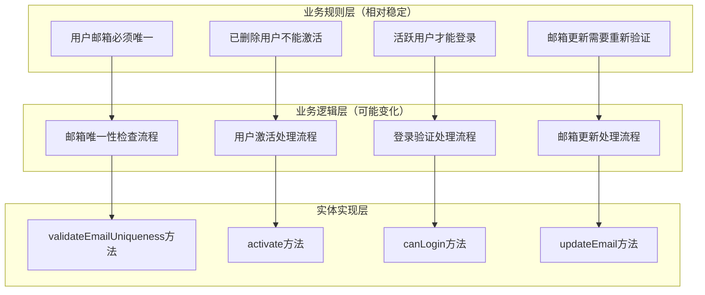

# 📋 业务规则 vs 业务逻辑：实体设计的核心概念

## 概念澄清与实体封装原则

### 📖 文档目的

本文档详细阐述业务规则（Business Rules）和业务逻辑（Business Logic）的区别，以及在充血模型的实体设计中应该如何正确封装这两个概念。

**重要说明**: 本文档基于 `packages/hybrid-archi` 模块的实际实现，该模块作为通用功能组件，提供业务模块所需的基础领域层功能。

---

## 🎯 第一部分：概念定义与区别

### 1.1 业务规则（Business Rules）

**定义**：业务规则是**不变的业务约束和政策**，描述了业务必须遵循的条件和限制。

**特征**：

- **稳定性**：相对稳定，不经常变化
- **约束性**：定义了业务的边界和限制
- **声明性**：描述"什么是允许的"或"什么是不允许的"
- **业务驱动**：来源于业务需求和政策

**示例**：

```typescript
/**
 * 用户实体的业务规则示例
 */
class UserEntity {
  // 业务规则1：用户邮箱必须唯一
  // 业务规则2：已删除的用户不能激活
  // 业务规则3：用户名长度必须在2-50个字符之间
  // 业务规则4：只有活跃且邮箱已验证的用户可以登录
  // 业务规则5：用户状态变更必须记录操作者
  
  canLogin(): boolean {
    // 实现业务规则4
    return this._status === UserStatus.ACTIVE && this._emailVerified;
  }
  
  private validateActivation(): void {
    // 实现业务规则2
    if (this._status === UserStatus.DELETED) {
      throw new Error('已删除的用户不能激活');
    }
  }
}
```

### 1.2 业务逻辑（Business Logic）

**定义**：业务逻辑是**实现业务规则的具体流程和算法**，描述了如何执行业务操作。

**特征**：

- **可变性**：可能随业务发展而变化
- **过程性**：描述"如何做"的具体步骤
- **算法性**：包含具体的执行流程和计算
- **实现导向**：关注如何实现业务规则

**示例**：

```typescript
/**
 * 用户实体的业务逻辑示例
 */
class UserEntity {
  // 业务逻辑：如何激活用户的具体流程
  activate(activatedBy: string): void {
    // 步骤1：验证前置条件（实现业务规则）
    this.validateActivation();
    
    // 步骤2：幂等性检查
    if (this._status === UserStatus.ACTIVE) {
      return;
    }
    
    // 步骤3：执行状态变更
    this._status = UserStatus.ACTIVE;
    this._updatedBy = activatedBy;
    this.updateTimestamp();
    
    // 步骤4：执行后置处理
    this.onActivated(activatedBy);
  }
  
  // 业务逻辑：如何更新邮箱的具体流程
  updateEmail(newEmail: Email, updatedBy: string): void {
    // 步骤1：参数验证
    if (!newEmail) {
      throw new Error('新邮箱不能为空');
    }
    
    // 步骤2：权限检查（实现业务规则）
    if (!this.canUpdate()) {
      throw new Error('当前状态不允许更新邮箱');
    }
    
    // 步骤3：幂等性检查
    if (this._email.equals(newEmail)) {
      return;
    }
    
    // 步骤4：业务规则验证
    this.validateEmailUpdate(newEmail);
    
    // 步骤5：执行状态变更
    const oldEmail = this._email;
    this._email = newEmail;
    this._emailVerified = false;
    this._updatedBy = updatedBy;
    this.updateTimestamp();
    
    // 步骤6：后置处理
    this.onEmailUpdated(oldEmail, newEmail, updatedBy);
  }
}
```

---

## 🔧 第二部分：实体封装的完整设计

### 2.1 实体应该封装的内容

**✅ 实体应该同时封装业务规则和业务逻辑**

```typescript
/**
 * 完整的充血模型实体设计
 */
export class UserEntity extends BaseEntity {
  
  // ========== 业务规则定义区域 ==========
  
  /**
   * 业务规则1：用户激活的前置条件
   */
  private validateActivation(): void {
    if (this._status === UserStatus.DELETED) {
      throw new Error('已删除的用户不能激活');
    }
    
    if (!this._email) {
      throw new Error('用户必须有邮箱才能激活');
    }
    
    // 更多业务规则...
  }
  
  /**
   * 业务规则2：邮箱更新的约束条件
   */
  private validateEmailUpdate(newEmail: Email): void {
    if (!this.canUpdate()) {
      throw new Error('当前状态不允许更新邮箱');
    }
    
    // 邮箱域名安全规则
    this.validateEmailDomainSecurity(newEmail);
    
    // 更多邮箱相关的业务规则...
  }
  
  /**
   * 业务规则3：用户登录的资格检查
   */
  canLogin(): boolean {
    return this._status === UserStatus.ACTIVE && this._emailVerified;
  }
  
  /**
   * 业务规则4：用户信息更新的资格检查
   */
  canUpdate(): boolean {
    return this._status !== UserStatus.DELETED && 
           this._status !== UserStatus.SUSPENDED;
  }
  
  // ========== 业务逻辑实现区域 ==========
  
  /**
   * 业务逻辑：用户激活的完整流程
   */
  activate(activatedBy: string): void {
    // 步骤1：验证业务规则
    this.validateActivation();
    
    // 步骤2：幂等性检查
    if (this._status === UserStatus.ACTIVE) {
      return; // 已激活，无需重复操作
    }
    
    // 步骤3：执行状态变更
    this._status = UserStatus.ACTIVE;
    this._updatedBy = activatedBy;
    this.updateTimestamp();
    
    // 步骤4：执行激活后的业务处理
    this.onActivated(activatedBy);
  }
  
  /**
   * 业务逻辑：邮箱更新的完整流程
   */
  updateEmail(newEmail: Email, updatedBy: string): void {
    // 步骤1：幂等性检查
    if (this._email.equals(newEmail)) {
      return; // 邮箱未变化，无需更新
    }
    
    // 步骤2：验证业务规则
    this.validateEmailUpdate(newEmail);
    
    // 步骤3：记录变更前的状态
    const oldEmail = this._email;
    
    // 步骤4：执行状态变更
    this._email = newEmail;
    this._emailVerified = false; // 新邮箱需要重新验证
    this._updatedBy = updatedBy;
    this.updateTimestamp();
    
    // 步骤5：执行邮箱更新后的业务处理
    this.onEmailUpdated(oldEmail, newEmail, updatedBy);
  }
  
  /**
   * 业务逻辑：用户登录的处理流程
   */
  recordLogin(): void {
    // 步骤1：验证业务规则
    if (!this.canLogin()) {
      throw new Error('用户状态不允许登录');
    }
    
    // 步骤2：记录登录时间
    this._lastLoginAt = new Date();
    this.updateTimestamp();
    
    // 步骤3：执行登录后的业务处理
    this.onLoginRecorded();
  }
  
  // ========== 业务规则验证方法（私有） ==========
  
  /**
   * 邮箱域名安全性业务规则
   */
  private validateEmailDomainSecurity(email: Email): void {
    const domain = email.getDomain().toLowerCase();
    const blockedDomains = ['blocked-domain.com', 'spam-domain.com'];
    
    if (blockedDomains.includes(domain)) {
      throw new Error(`业务规则违反：不允许使用邮箱域名 ${domain}`);
    }
  }
  
  // ========== 业务逻辑扩展点（私有） ==========
  
  /**
   * 激活后的业务逻辑处理
   */
  private onActivated(activatedBy: string): void {
    // 激活后的业务逻辑扩展点
    // 例如：初始化用户默认设置、记录审计日志等
  }
  
  /**
   * 邮箱更新后的业务逻辑处理
   */
  private onEmailUpdated(oldEmail: Email, newEmail: Email, updatedBy: string): void {
    // 邮箱更新后的业务逻辑扩展点
    // 例如：发送变更通知、更新相关配置等
  }
}
```

---

## 📊 第三部分：业务规则和业务逻辑的层次关系

### 3.1 层次结构图



### 3.2 实际代码中的体现

```typescript
/**
 * 业务规则和业务逻辑在实体中的完整体现
 */
export class UserEntity extends BaseEntity {
  
  // ========== 业务规则的声明和验证 ==========
  
  /**
   * 业务规则：用户激活的约束条件
   */
  private static readonly ACTIVATION_RULES = {
    CANNOT_ACTIVATE_DELETED: '已删除的用户不能激活',
    MUST_HAVE_EMAIL: '用户必须有邮箱才能激活',
    MUST_HAVE_VALID_DOMAIN: '邮箱域名必须通过安全检查'
  } as const;
  
  /**
   * 业务规则：邮箱更新的约束条件
   */
  private static readonly EMAIL_UPDATE_RULES = {
    CANNOT_UPDATE_IF_DELETED: '已删除用户不能更新邮箱',
    CANNOT_UPDATE_IF_SUSPENDED: '已暂停用户不能更新邮箱',
    DOMAIN_MUST_BE_ALLOWED: '邮箱域名必须在允许列表中',
    FREQUENCY_LIMIT: '邮箱更新频率不能超过限制'
  } as const;
  
  /**
   * 验证激活业务规则
   */
  private validateActivationRules(): void {
    if (this._status === UserStatus.DELETED) {
      throw new BusinessRuleViolationException(
        UserEntity.ACTIVATION_RULES.CANNOT_ACTIVATE_DELETED
      );
    }
    
    if (!this._email) {
      throw new BusinessRuleViolationException(
        UserEntity.ACTIVATION_RULES.MUST_HAVE_EMAIL
      );
    }
    
    if (!this.isEmailDomainAllowed()) {
      throw new BusinessRuleViolationException(
        UserEntity.ACTIVATION_RULES.MUST_HAVE_VALID_DOMAIN
      );
    }
  }
  
  /**
   * 验证邮箱更新业务规则
   */
  private validateEmailUpdateRules(newEmail: Email): void {
    if (this._status === UserStatus.DELETED) {
      throw new BusinessRuleViolationException(
        UserEntity.EMAIL_UPDATE_RULES.CANNOT_UPDATE_IF_DELETED
      );
    }
    
    if (this._status === UserStatus.SUSPENDED) {
      throw new BusinessRuleViolationException(
        UserEntity.EMAIL_UPDATE_RULES.CANNOT_UPDATE_IF_SUSPENDED
      );
    }
    
    if (!this.isEmailDomainAllowed(newEmail)) {
      throw new BusinessRuleViolationException(
        UserEntity.EMAIL_UPDATE_RULES.DOMAIN_MUST_BE_ALLOWED
      );
    }
  }
  
  // ========== 业务逻辑的实现 ==========
  
  /**
   * 业务逻辑：用户激活的完整处理流程
   */
  activate(activatedBy: string): void {
    // 业务逻辑步骤1：验证业务规则
    this.validateActivationRules();
    
    // 业务逻辑步骤2：幂等性检查
    if (this._status === UserStatus.ACTIVE) {
      return; // 已激活，执行幂等逻辑
    }
    
    // 业务逻辑步骤3：记录变更前状态（用于审计）
    const previousStatus = this._status;
    
    // 业务逻辑步骤4：执行状态变更
    this._status = UserStatus.ACTIVE;
    this._updatedBy = activatedBy;
    this._activatedAt = new Date();
    this.updateTimestamp();
    
    // 业务逻辑步骤5：执行激活后处理
    this.executeActivationPostProcessing(previousStatus, activatedBy);
  }
  
  /**
   * 业务逻辑：邮箱更新的完整处理流程
   */
  updateEmail(newEmail: Email, updatedBy: string): void {
    // 业务逻辑步骤1：幂等性检查
    if (this._email.equals(newEmail)) {
      return; // 邮箱未变化，执行幂等逻辑
    }
    
    // 业务逻辑步骤2：验证业务规则
    this.validateEmailUpdateRules(newEmail);
    
    // 业务逻辑步骤3：记录变更历史
    const emailChangeRecord = this.createEmailChangeRecord(newEmail, updatedBy);
    
    // 业务逻辑步骤4：执行状态变更
    const oldEmail = this._email;
    this._email = newEmail;
    this._emailVerified = false; // 业务逻辑：新邮箱需要重新验证
    this._updatedBy = updatedBy;
    this.updateTimestamp();
    
    // 业务逻辑步骤5：执行邮箱更新后处理
    this.executeEmailUpdatePostProcessing(oldEmail, newEmail, emailChangeRecord);
  }
  
  // ========== 复杂业务逻辑的分解 ==========
  
  /**
   * 激活后处理的业务逻辑
   */
  private executeActivationPostProcessing(
    previousStatus: UserStatus, 
    activatedBy: string
  ): void {
    // 业务逻辑：根据之前的状态执行不同的处理
    switch (previousStatus) {
      case UserStatus.PENDING:
        this.handleFirstTimeActivation(activatedBy);
        break;
      case UserStatus.INACTIVE:
        this.handleReactivation(activatedBy);
        break;
      default:
        // 其他状态的激活处理
        break;
    }
    
    // 业务逻辑：通用的激活后处理
    this.initializeUserDefaults();
    this.scheduleWelcomeNotification(activatedBy);
  }
  
  /**
   * 邮箱更新后处理的业务逻辑
   */
  private executeEmailUpdatePostProcessing(
    oldEmail: Email,
    newEmail: Email,
    changeRecord: EmailChangeRecord
  ): void {
    // 业务逻辑：根据邮箱类型变化执行不同处理
    if (this.isEmailTypeChanged(oldEmail, newEmail)) {
      this.handleEmailTypeChange(oldEmail, newEmail);
    }
    
    // 业务逻辑：安全相关的处理
    if (this.isSecuritySensitiveChange(oldEmail, newEmail)) {
      this.handleSecuritySensitiveEmailChange(changeRecord);
    }
    
    // 业务逻辑：通知相关的处理
    this.scheduleEmailChangeNotification(oldEmail, newEmail);
  }
  
  // ========== 业务规则的查询接口 ==========
  
  /**
   * 业务规则查询：检查用户是否可以执行特定操作
   */
  canPerformSensitiveOperation(): boolean {
    return this._status === UserStatus.ACTIVE && 
           this._emailVerified &&
           this.hasRecentActivity() &&
           !this.hasPendingSecurityIssues();
  }
  
  /**
   * 业务规则查询：检查用户是否需要重新验证
   */
  needsRevalidation(): boolean {
    return !this._emailVerified || 
           this.isPasswordExpired() ||
           this.hasStaleSecuritySettings();
  }
  
  // ========== 辅助方法（支持业务规则和业务逻辑） ==========
  
  private isEmailDomainAllowed(email?: Email): boolean {
    const targetEmail = email || this._email;
    const domain = targetEmail.getDomain().toLowerCase();
    const blockedDomains = ['blocked-domain.com', 'spam-domain.com'];
    return !blockedDomains.includes(domain);
  }
  
  private isEmailTypeChanged(oldEmail: Email, newEmail: Email): boolean {
    return oldEmail.isCorporateEmail() !== newEmail.isCorporateEmail();
  }
  
  private createEmailChangeRecord(newEmail: Email, updatedBy: string): EmailChangeRecord {
    return new EmailChangeRecord(
      this._email,
      newEmail,
      updatedBy,
      new Date()
    );
  }
}
```

---

## 🎨 第四部分：设计模式的应用

### 4.1 策略模式在业务规则中的应用

```typescript
/**
 * 使用策略模式实现可变的业务规则
 */

// 业务规则策略接口
interface IUserValidationStrategy {
  validate(user: UserEntity): ValidationResult;
}

// 具体的业务规则策略实现
class StandardUserValidationStrategy implements IUserValidationStrategy {
  validate(user: UserEntity): ValidationResult {
    const errors: string[] = [];
    
    if (!user.getEmail()) {
      errors.push('用户必须有邮箱');
    }
    
    if (!user.getName()) {
      errors.push('用户必须有姓名');
    }
    
    return new ValidationResult(errors.length === 0, errors);
  }
}

class EnterpriseUserValidationStrategy implements IUserValidationStrategy {
  validate(user: UserEntity): ValidationResult {
    const errors: string[] = [];
    
    // 企业用户的特殊业务规则
    if (!user.getEmail().isCorporateEmail()) {
      errors.push('企业用户必须使用企业邮箱');
    }
    
    if (!user.getName().isChineseName()) {
      errors.push('企业用户必须使用真实中文姓名');
    }
    
    return new ValidationResult(errors.length === 0, errors);
  }
}

// 在实体中使用策略模式
class UserEntity extends BaseEntity {
  private validationStrategy: IUserValidationStrategy;
  
  constructor(
    id: UserId,
    // ... 其他参数
    validationStrategy: IUserValidationStrategy = new StandardUserValidationStrategy()
  ) {
    super(id);
    this.validationStrategy = validationStrategy;
  }
  
  /**
   * 使用策略验证业务规则
   */
  validateBusinessRules(): ValidationResult {
    return this.validationStrategy.validate(this);
  }
  
  /**
   * 动态切换验证策略（业务逻辑）
   */
  switchToEnterpriseValidation(): void {
    this.validationStrategy = new EnterpriseUserValidationStrategy();
  }
}
```

### 4.2 规约模式在业务规则中的应用

```typescript
/**
 * 使用规约模式实现复杂的业务规则
 */

// 业务规则规约接口
interface IUserSpecification {
  isSatisfiedBy(user: UserEntity): boolean;
  getErrorMessage(): string;
}

// 具体的业务规则规约
class CanActivateSpecification implements IUserSpecification {
  isSatisfiedBy(user: UserEntity): boolean {
    return user.getStatus() !== UserStatus.DELETED &&
           user.getEmail() !== null &&
           user.isEmailDomainAllowed();
  }
  
  getErrorMessage(): string {
    return '用户不满足激活条件';
  }
}

class CanUpdateEmailSpecification implements IUserSpecification {
  constructor(private newEmail: Email) {}
  
  isSatisfiedBy(user: UserEntity): boolean {
    return user.canUpdate() &&
           this.newEmail.getDomain() !== 'blocked-domain.com' &&
           !user.hasRecentEmailChange();
  }
  
  getErrorMessage(): string {
    return '用户不满足邮箱更新条件';
  }
}

// 在实体中使用规约模式
class UserEntity extends BaseEntity {
  /**
   * 使用规约验证激活条件（业务规则）
   */
  private validateActivationWithSpecification(): void {
    const canActivateSpec = new CanActivateSpecification();
    
    if (!canActivateSpec.isSatisfiedBy(this)) {
      throw new BusinessRuleViolationException(canActivateSpec.getErrorMessage());
    }
  }
  
  /**
   * 激活用户（业务逻辑实现）
   */
  activate(activatedBy: string): void {
    // 使用规约验证业务规则
    this.validateActivationWithSpecification();
    
    // 执行激活的业务逻辑
    if (this._status === UserStatus.ACTIVE) {
      return; // 幂等性逻辑
    }
    
    this._status = UserStatus.ACTIVE;
    this._updatedBy = activatedBy;
    this.updateTimestamp();
    
    this.onActivated(activatedBy);
  }
}
```

---

## 🔍 第五部分：实际应用指导

### 5.1 如何识别业务规则 vs 业务逻辑

#### **识别业务规则的关键问题**

1. 这个约束是否来自业务政策？
2. 这个条件是否相对稳定不变？
3. 违反这个条件是否会导致业务错误？
4. 这个规则是否可以独立验证？

#### **识别业务逻辑的关键问题**

1. 这个流程是否描述了如何执行操作？
2. 这个算法是否可能随业务发展而变化？
3. 这个步骤是否是为了实现某个业务规则？
4. 这个处理是否涉及多个步骤的协调？

### 5.2 实体设计的最佳实践

```typescript
/**
 * 最佳实践：业务规则和业务逻辑的完整封装
 */
export class UserEntity extends BaseEntity {
  
  // ========== 业务规则定义区 ==========
  
  /**
   * 业务规则：用户状态转换规则
   */
  private static readonly STATUS_TRANSITION_RULES = new Map([
    [UserStatus.PENDING, [UserStatus.ACTIVE, UserStatus.DELETED]],
    [UserStatus.ACTIVE, [UserStatus.INACTIVE, UserStatus.SUSPENDED, UserStatus.DELETED]],
    [UserStatus.INACTIVE, [UserStatus.ACTIVE, UserStatus.DELETED]],
    [UserStatus.SUSPENDED, [UserStatus.ACTIVE, UserStatus.DELETED]],
    [UserStatus.DELETED, []] // 已删除用户不能转换到任何状态
  ]);
  
  /**
   * 检查状态转换是否符合业务规则
   */
  private canTransitionTo(targetStatus: UserStatus): boolean {
    const allowedTransitions = UserEntity.STATUS_TRANSITION_RULES.get(this._status) || [];
    return allowedTransitions.includes(targetStatus);
  }
  
  // ========== 业务逻辑实现区 ==========
  
  /**
   * 业务逻辑：状态转换的通用处理流程
   */
  private transitionTo(
    targetStatus: UserStatus, 
    operatedBy: string, 
    reason?: string
  ): void {
    // 步骤1：验证业务规则
    if (!this.canTransitionTo(targetStatus)) {
      throw new Error(`不能从 ${this._status} 转换到 ${targetStatus}`);
    }
    
    // 步骤2：记录变更历史
    const transition = new StatusTransition(
      this._status,
      targetStatus,
      operatedBy,
      reason,
      new Date()
    );
    
    // 步骤3：执行状态变更
    const oldStatus = this._status;
    this._status = targetStatus;
    this._updatedBy = operatedBy;
    this.updateTimestamp();
    
    // 步骤4：执行状态变更后处理
    this.onStatusChanged(oldStatus, targetStatus, transition);
  }
  
  /**
   * 业务逻辑：激活用户的具体实现
   */
  activate(activatedBy: string): void {
    // 使用通用的状态转换逻辑
    this.transitionTo(UserStatus.ACTIVE, activatedBy, '用户激活');
    
    // 激活特有的业务逻辑
    this.initializeActivationDefaults();
    this.scheduleActivationNotifications();
  }
  
  /**
   * 业务逻辑：停用用户的具体实现
   */
  deactivate(deactivatedBy: string, reason?: string): void {
    this.transitionTo(UserStatus.INACTIVE, deactivatedBy, reason);
    
    // 停用特有的业务逻辑
    this.clearActiveUserSessions();
    this.scheduleDeactivationNotifications();
  }
  
  // ========== 业务逻辑的扩展点 ==========
  
  private onStatusChanged(
    oldStatus: UserStatus,
    newStatus: UserStatus,
    transition: StatusTransition
  ): void {
    // 状态变更后的通用业务逻辑
    this.recordStatusChangeAudit(transition);
    this.updateSecurityProfile(newStatus);
    this.notifyRelatedSystems(oldStatus, newStatus);
  }
}
```

---

## 📋 第六部分：设计检查清单

### 6.1 业务规则封装检查

- [ ] **规则明确性**：每个业务规则都有清晰的定义和说明
- [ ] **规则完整性**：覆盖了所有相关的业务约束
- [ ] **规则一致性**：规则之间没有冲突和矛盾
- [ ] **规则可验证性**：每个规则都可以通过代码验证
- [ ] **规则可测试性**：每个规则都有对应的单元测试

### 6.2 业务逻辑实现检查

- [ ] **逻辑完整性**：实现了完整的业务处理流程
- [ ] **逻辑正确性**：正确实现了业务规则的要求
- [ ] **逻辑可读性**：代码清晰表达了业务意图
- [ ] **逻辑可维护性**：复杂逻辑进行了合理的分解
- [ ] **逻辑可扩展性**：为未来变化预留了扩展点

### 6.3 实体设计质量检查

- [ ] **封装完整性**：业务规则和业务逻辑都在实体内部
- [ ] **职责单一性**：实体只负责自己相关的业务
- [ ] **接口丰富性**：提供了丰富的业务查询方法
- [ ] **防御性编程**：对所有输入进行了验证
- [ ] **幂等性设计**：重复操作产生相同结果

---

## 🎯 总结

### 核心观点

**实体应该同时封装业务规则和业务逻辑**：

1. **业务规则**：定义了"什么是允许的"业务约束
2. **业务逻辑**：实现了"如何执行"的具体流程
3. **两者结合**：构成了完整的业务能力

### 设计价值

1. **业务完整性**：实体包含了完整的业务能力
2. **代码内聚性**：相关的规则和逻辑集中在一起
3. **维护便利性**：业务变更时修改范围明确
4. **测试友好性**：可以完整测试业务能力

### 实践建议

1. **从业务规则开始**：先定义业务约束，再实现业务逻辑
2. **保持规则稳定**：业务规则应该相对稳定
3. **逻辑可演进**：业务逻辑可以随需求变化而调整
4. **持续重构**：定期审查和优化业务规则和逻辑的实现

---

**文档版本**: v1.0.0  
**最后更新**: 2024年12月19日  
**文档状态**: ✅ 完成

---

*业务规则定义约束，业务逻辑实现流程，两者在充血模型的实体中完美结合！*
