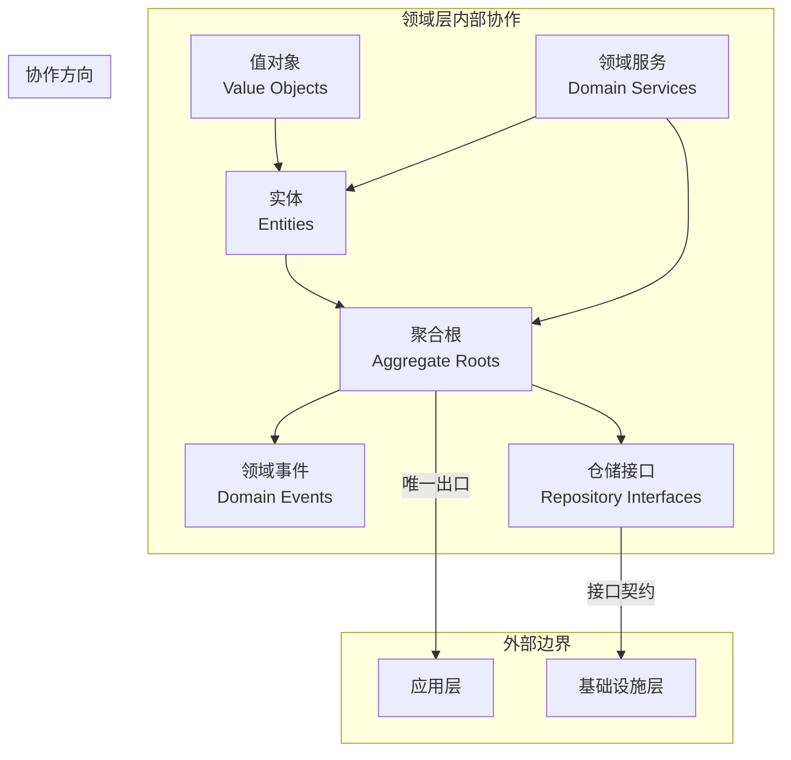

# 🏛️ 领域层设计原则详解

## 充血模型下的领域组件职责与设计规范

### 📖 文档概述

本文档详细阐述了在充血模型设计下，领域层各个组件的职责划分、设计原则和最佳实践。这些原则将指导开发团队创建高质量、可维护、可扩展的领域模型。

**重要说明**: 本文档基于 `packages/hybrid-archi` 模块的实际实现，该模块作为通用功能组件，提供业务模块所需的基础领域层功能。

---

## 🎯 第一部分：领域层组件职责矩阵

### 1.1 组件职责总览

| 组件 | 主要职责 | 次要职责 | 不应承担的职责 |
|------|---------|---------|---------------|
| **值对象** | 数据封装、验证规则 | 业务语义、格式转换 | 状态管理、事件发布 |
| **实体** | 业务规则、业务逻辑 | 状态管理、数据验证 | 事件发布、跨聚合操作 |
| **聚合根** | 事件收集、聚合协调 | 事务边界、外部接口 | 具体业务逻辑 |
| **领域服务** | 跨聚合逻辑、复杂计算 | 业务策略、算法实现 | 数据持久化、基础设施 |
| **领域事件** | 状态变更通知、审计 | 跨聚合通信、异步触发 | 业务逻辑、数据存储 |

### 1.2 组件协作关系



---

## 🔧 第二部分：实体（Entity）设计原则

### 2.1 实体的核心职责

#### **主要职责**

1. **业务逻辑封装**：包含与实体相关的所有业务规则和行为
2. **状态管理**：管理实体的内部状态和生命周期
3. **业务验证**：执行实体级别的业务规则验证
4. **数据完整性**：确保实体数据的一致性和有效性

#### **设计原则示例**

```typescript
/**
 * 充血模型实体设计示例
 * 基于 packages/hybrid-archi 模块的 BaseEntity
 */
import { BaseEntity } from '@hl8/hybrid-archi/domain';
import { EntityId } from '@hl8/hybrid-archi/domain';

export class UserEntity extends BaseEntity {
  private constructor(
    id: EntityId,
    private _email: string,
    private _name: string,
    private _status: UserStatus,
    private _emailVerified: boolean = false,
    auditInfo: Partial<IAuditInfo>
  ) {
    super(id, auditInfo);
  }

  // ========== 原则1：业务逻辑内聚 ==========
  
  /**
   * 激活用户
   * 
   * @description 包含完整的激活业务逻辑
   */
  activate(activatedBy: string): void {
    // 前置条件验证
    this.validateActivation();
    
    // 幂等性检查
    if (this._status === UserStatus.ACTIVE) {
      return;
    }
    
    // 状态变更
    this._status = UserStatus.ACTIVE;
    this.updateTimestamp();
    
    // 后置处理
    this.onActivated(activatedBy);
  }

  // ========== 原则2：防御性编程 ==========
  
  updateEmail(newEmail: Email, updatedBy: string): void {
    // 参数验证
    if (!newEmail) {
      throw new Error('新邮箱不能为空');
    }
    
    // 权限检查
    if (!this.canUpdate()) {
      throw new Error('当前状态不允许更新邮箱');
    }
    
    // 幂等性检查
    if (this._email.equals(newEmail)) {
      return;
    }
    
    // 业务规则验证
    this.validateEmailUpdate(newEmail);
    
    // 状态变更
    const oldEmail = this._email;
    this._email = newEmail;
    this._emailVerified = false;
    this._updatedBy = updatedBy;
    this.updateTimestamp();
    
    // 后置处理
    this.onEmailUpdated(oldEmail, newEmail, updatedBy);
  }

  // ========== 原则3：丰富的查询接口 ==========
  
  /**
   * 检查用户是否可以登录
   */
  canLogin(): boolean {
    return this._status === UserStatus.ACTIVE && this._emailVerified;
  }
  
  /**
   * 检查用户是否可以更新信息
   */
  canUpdate(): boolean {
    return this._status !== UserStatus.DELETED && 
           this._status !== UserStatus.SUSPENDED;
  }
  
  /**
   * 检查用户是否需要重新验证
   */
  needsRevalidation(): boolean {
    return !this._emailVerified || this.isPasswordExpired();
  }

  // ========== 原则4：复杂逻辑私有化 ==========
  
  /**
   * 验证激活操作的前置条件
   */
  private validateActivation(): void {
    if (this._status === UserStatus.DELETED) {
      throw new GeneralBadRequestException('已删除的用户不能激活');
    }
    
    if (!this._email) {
      throw new GeneralBadRequestException('用户必须有邮箱才能激活');
    }
    
    // 复杂的业务规则验证
    this.validateEmailDomainForActivation();
    this.checkComplianceRequirements();
    this.verifyOperatorPermissions();
  }
  
  /**
   * 验证邮箱更新的业务规则
   */
  private validateEmailUpdate(newEmail: Email): void {
    // 安全性检查
    this.validateEmailDomainSecurity(newEmail);
    
    // 业务策略检查
    this.checkEmailChangePolicy();
    
    // 频率限制检查
    this.checkEmailChangeFrequency();
  }

  // ========== 原则5：扩展点设计 ==========
  
  /**
   * 激活后的业务处理钩子
   */
  private onActivated(activatedBy: string): void {
    // 为未来的扩展预留钩子方法
    // 例如：
    // - 记录激活审计日志
    // - 发送内部通知
    // - 初始化用户默认设置
    // - 触发欢迎流程
  }
  
  /**
   * 邮箱更新后的业务处理钩子
   */
  private onEmailUpdated(oldEmail: Email, newEmail: Email, updatedBy: string): void {
    // 邮箱更新后的扩展处理
    // 例如：
    // - 发送邮箱变更通知
    // - 记录安全日志
    // - 更新相关配置
    // - 触发重新验证流程
  }
}
```

### 2.2 实体设计的最佳实践

#### **✅ 正确的实体设计**

```typescript
class UserEntity extends BaseEntity {
  // 1. 充血模型：包含丰富的业务行为
  activate(activatedBy: string): void { /* 业务逻辑 */ }
  updateEmail(newEmail: Email): void { /* 业务逻辑 */ }
  canLogin(): boolean { /* 业务查询 */ }
  
  // 2. 防御性编程：完整的验证体系
  private validateActivation(): void { /* 验证逻辑 */ }
  private validateEmailUpdate(email: Email): void { /* 验证逻辑 */ }
  
  // 3. 扩展性设计：预留钩子方法
  private onActivated(activatedBy: string): void { /* 扩展点 */ }
  private onEmailUpdated(oldEmail: Email, newEmail: Email): void { /* 扩展点 */ }
}
```

#### **❌ 错误的实体设计**

```typescript
// 贫血模型：只有数据，没有行为
class User {
  id: string;
  email: string;
  name: string;
  status: string;
  
  // 只有简单的getter/setter
  getEmail(): string { return this.email; }
  setEmail(email: string): void { this.email = email; }
}

// 业务逻辑散落在服务中
class UserService {
  activateUser(user: User): void {
    // 业务逻辑与数据分离，违反封装原则
    if (user.status === 'deleted') {
      throw new Error('已删除的用户不能激活');
    }
    user.status = 'active';
  }
}
```

---

## 🌟 第三部分：聚合根（Aggregate Root）设计原则

### 3.1 聚合根的核心职责

#### **主要职责**

1. **聚合边界管理**：作为聚合的唯一入口点
2. **事件发布**：发布所有的领域事件
3. **事务边界**：定义事务的一致性边界
4. **外部协调**：协调聚合内部实体的操作

#### **设计原则示例**

```typescript
/**
 * 聚合根设计原则示例
 */
export class UserAggregate extends BaseAggregateRoot {
  constructor(
    private readonly user: UserEntity,
    private readonly tenantId: string
  ) {
    super(user.getId());
  }

  // ========== 原则1：委托业务逻辑给实体 ==========
  
  activate(activatedBy: string): void {
    const oldStatus = this.user.getStatus();
    
    // 委托给实体处理具体的业务逻辑
    this.user.activate(activatedBy);
    
    // 聚合根负责事件发布
    if (oldStatus !== this.user.getStatus()) {
      this.addDomainEvent(new UserActivatedEvent(
        this.user.getId().getValue(),
        activatedBy,
        new Date()
      ));
    }
  }

  // ========== 原则2：聚合级别的业务协调 ==========
  
  updateUserProfile(profileData: UpdateProfileData): void {
    // 聚合级别的前置检查
    if (!this.canUpdateProfile()) {
      throw new Error('当前状态不允许更新资料');
    }
    
    // 协调多个实体的操作（未来扩展）
    this.user.validateProfileUpdate(profileData);
    // this.profile.update(profileData);     // 未来可能的实体
    // this.preferences.syncFromProfile();   // 未来可能的实体
    
    // 聚合一致性检查
    this.validateAggregateConsistency();
    
    // 发布聚合级别的事件
    this.addDomainEvent(new UserProfileUpdatedEvent(
      this.user.getId().getValue(),
      profileData,
      new Date()
    ));
  }

  // ========== 原则3：只读访问内部实体 ==========
  
  /**
   * 获取用户实体（只读）
   * 
   * @description 外部代码不应该直接修改返回的实体
   */
  getUser(): Readonly<UserEntity> {
    return this.user;
  }

  // ========== 原则4：聚合级别的查询方法 ==========
  
  canUpdateProfile(): boolean {
    return this.user.canUpdate() && 
           this.hasValidTenantContext() &&
           this.isWithinUpdateWindow();
  }
  
  isEligibleForPremiumFeatures(): boolean {
    return this.user.isActive() && 
           this.user.isEmailVerified() &&
           this.hasValidSubscription();
  }

  // ========== 原则5：聚合级别的验证 ==========
  
  private validateAggregateConsistency(): void {
    // 检查聚合内部的一致性规则
    if (this.user.isActive() && !this.user.isEmailVerified()) {
      throw new Error('活跃用户必须验证邮箱');
    }
    
    // 检查租户级别的约束
    if (!this.hasValidTenantContext()) {
      throw new Error('聚合必须在有效的租户上下文中');
    }
  }
  
  private hasValidTenantContext(): boolean {
    return this.tenantId && this.tenantId.length > 0;
  }
  
  private isWithinUpdateWindow(): boolean {
    // 检查是否在允许的更新时间窗口内
    const lastUpdate = this.user.getUpdatedAt();
    const now = new Date();
    const timeDiff = now.getTime() - lastUpdate.getTime();
    const minUpdateInterval = 5 * 60 * 1000; // 5分钟
    
    return timeDiff >= minUpdateInterval;
  }
}
```

### 3.2 聚合设计的边界原则

#### **聚合大小原则**

```typescript
// ✅ 合适的聚合大小
class UserAggregate extends BaseAggregateRoot {
  constructor(
    private user: UserEntity,           // 核心实体
    private profile: UserProfileEntity, // 紧密相关的实体
    private tenantId: string
  ) {}
  
  // 聚合内的操作应该是原子的
  updateUserAndProfile(userData: UserData, profileData: ProfileData): void {
    this.user.update(userData);
    this.profile.update(profileData);
    
    // 确保一致性
    this.validateUserProfileConsistency();
    
    this.addDomainEvent(new UserProfileUpdatedEvent(...));
  }
}

// ❌ 过大的聚合（避免）
class BadUserAggregate extends BaseAggregateRoot {
  constructor(
    private user: UserEntity,
    private profile: UserProfileEntity,
    private orders: OrderEntity[],        // 应该是独立聚合
    private payments: PaymentEntity[],    // 应该是独立聚合
    private notifications: NotificationEntity[] // 应该是独立聚合
  ) {}
  
  // 这样的聚合太大，违反了聚合设计原则
}
```

#### **聚合边界识别原则**

1. **业务不变性**：聚合内的业务规则必须在事务中保持一致
2. **操作原子性**：聚合内的操作应该是原子的
3. **生命周期一致**：聚合内实体的生命周期应该相关
4. **修改频率**：经常一起修改的实体应该在同一聚合中

---

## 🛠️ 第四部分：领域服务（Domain Service）设计原则

### 4.1 领域服务的使用场景

#### **场景1：跨聚合的业务逻辑**

```typescript
/**
 * 用户注册领域服务
 * 
 * @description 处理涉及用户聚合和租户聚合的注册业务逻辑
 */
@Injectable()
export class UserRegistrationDomainService {
  /**
   * 验证用户是否可以在指定租户中注册
   */
  async validateUserRegistration(
    registrationData: {email: Email, name: UserName},
    tenantAggregate: TenantAggregate,
    existingUserCheck: (email: Email) => Promise<boolean>
  ): Promise<RegistrationValidationResult> {
    const errors: string[] = [];
    
    // 检查租户级别的注册策略
    if (!tenantAggregate.allowsNewRegistrations()) {
      errors.push('该租户暂不允许新用户注册');
    }
    
    // 检查用户数量限制
    if (await tenantAggregate.hasReachedUserLimit()) {
      errors.push('租户用户数量已达上限');
    }
    
    // 检查邮箱域名策略
    if (!tenantAggregate.isEmailDomainAllowed(registrationData.email.getDomain())) {
      errors.push('邮箱域名不符合租户政策');
    }
    
    // 检查邮箱唯一性
    if (await existingUserCheck(registrationData.email)) {
      errors.push('邮箱已被注册');
    }
    
    return new RegistrationValidationResult(errors.length === 0, errors);
  }
}
```

#### **场景2：复杂的业务计算**

```typescript
/**
 * 用户权限计算领域服务
 */
@Injectable()
export class UserPermissionCalculationService {
  /**
   * 计算用户的有效权限
   */
  calculateEffectivePermissions(
    userAggregate: UserAggregate,
    roleAggregates: RoleAggregate[],
    organizationContext: OrganizationContext
  ): EffectivePermissions {
    const permissions = new Map<string, Permission>();
    
    // 1. 收集角色权限
    for (const role of roleAggregates) {
      role.getPermissions().forEach(permission => {
        permissions.set(permission.getId(), permission);
      });
    }
    
    // 2. 应用组织级别的权限策略
    const orgFilteredPermissions = organizationContext
      .getPermissionPolicy()
      .filter(Array.from(permissions.values()), userAggregate);
    
    // 3. 应用用户级别的权限限制
    const userFilteredPermissions = this.applyUserLevelRestrictions(
      orgFilteredPermissions, 
      userAggregate
    );
    
    // 4. 计算时间敏感的权限
    const timeAwarePermissions = this.applyTimeBasedRestrictions(
      userFilteredPermissions,
      userAggregate.getLastLoginAt()
    );
    
    return new EffectivePermissions(timeAwarePermissions);
  }
  
  private applyUserLevelRestrictions(
    permissions: Permission[],
    userAggregate: UserAggregate
  ): Permission[] {
    // 基于用户状态过滤权限
    if (!userAggregate.isActive()) {
      return permissions.filter(p => p.isBasicPermission());
    }
    
    if (!userAggregate.isEmailVerified()) {
      return permissions.filter(p => !p.requiresEmailVerification());
    }
    
    return permissions;
  }
}
```

#### **场景3：业务策略实现**

```typescript
/**
 * 用户验证策略领域服务
 */
@Injectable()
export class UserValidationPolicyService {
  /**
   * 根据租户政策验证用户数据
   */
  validateUserData(
    userData: {email: Email, name: UserName},
    tenantPolicy: TenantPolicy
  ): ValidationResult {
    const validator = new UserDataValidator();
    
    // 应用邮箱策略
    if (tenantPolicy.requiresCorporateEmail()) {
      validator.addRule(new CorporateEmailRule(userData.email));
    }
    
    // 应用用户名策略
    if (tenantPolicy.requiresRealName()) {
      validator.addRule(new RealNameRule(userData.name));
    }
    
    // 应用域名白名单策略
    const allowedDomains = tenantPolicy.getAllowedEmailDomains();
    if (allowedDomains.length > 0) {
      validator.addRule(new EmailDomainWhitelistRule(userData.email, allowedDomains));
    }
    
    return validator.validate();
  }
}
```

### 4.2 领域服务设计原则

1. **无状态设计**：领域服务不应该保存状态
2. **跨聚合协调**：处理涉及多个聚合的业务逻辑
3. **业务语义明确**：方法名应该清晰表达业务意图
4. **依赖最小化**：只依赖必要的领域概念
5. **策略模式应用**：用于实现可变的业务策略

---

## 📢 第五部分：领域事件（Domain Event）设计原则

### 5.1 领域事件的设计规范

#### **事件命名原则**

```typescript
// ✅ 正确的事件命名（过去时，表达已发生的事实）
export class UserRegisteredEvent extends BaseDomainEvent {
  // 事件名清晰表达业务事实
  getEventName(): string {
    return 'user.registered';
  }
}

export class UserEmailUpdatedEvent extends BaseDomainEvent {
  getEventName(): string {
    return 'user.email.updated';
  }
}

// ❌ 错误的事件命名
export class RegisterUserEvent extends BaseDomainEvent {
  // 错误：使用现在时，像是命令而不是事件
}

export class UserUpdateEvent extends BaseDomainEvent {
  // 错误：过于泛化，缺乏具体的业务语义
}
```

#### **事件数据设计**

```typescript
/**
 * 完整的领域事件设计示例
 */
export class UserEmailUpdatedEvent extends BaseDomainEvent {
  constructor(
    // ✅ 原则1：包含足够的上下文信息
    public readonly userId: string,
    public readonly oldEmail: string,
    public readonly newEmail: string,
    public readonly updatedBy: string,
    public readonly updateReason?: string,
    
    // ✅ 原则2：包含事件元数据
    public readonly metadata: {
      tenantId: string;
      correlationId?: string;
      causationId?: string;
      sourceSystem?: string;
    } = {},
    
    occurredOn: Date = new Date()
  ) {
    super(occurredOn);
    
    // ✅ 原则3：确保事件不可变
    Object.freeze(this);
  }
  
  // ✅ 原则4：提供事件标识信息
  getEventName(): string {
    return 'user.email.updated';
  }
  
  getEventVersion(): number {
    return 1;
  }
  
  getAggregateId(): string {
    return this.userId;
  }
  
  getAggregateType(): string {
    return 'User';
  }
  
  // ✅ 原则5：提供便利的查询方法
  isEmailDomainChanged(): boolean {
    const oldDomain = this.oldEmail.split('@')[1];
    const newDomain = this.newEmail.split('@')[1];
    return oldDomain !== newDomain;
  }
  
  isSignificantChange(): boolean {
    // 判断是否是重要的邮箱变更（如从个人邮箱到企业邮箱）
    return this.isEmailDomainChanged() && this.isCorporateEmailChange();
  }
  
  private isCorporateEmailChange(): boolean {
    const oldIsCorporate = !this.isPublicDomain(this.oldEmail);
    const newIsCorporate = !this.isPublicDomain(this.newEmail);
    return oldIsCorporate !== newIsCorporate;
  }
  
  private isPublicDomain(email: string): boolean {
    const domain = email.split('@')[1].toLowerCase();
    const publicDomains = ['gmail.com', 'yahoo.com', 'hotmail.com'];
    return publicDomains.includes(domain);
  }
}
```

### 5.2 事件设计的层次结构

#### **基础事件类型**

```typescript
// 简单状态变更事件
export class UserActivatedEvent extends BaseDomainEvent {
  constructor(
    public readonly userId: string,
    public readonly activatedBy: string,
    occurredOn: Date = new Date()
  ) {
    super(occurredOn);
  }
  
  getEventName(): string { return 'user.activated'; }
  getEventVersion(): number { return 1; }
}

// 复杂业务流程事件
export class UserRegistrationCompletedEvent extends BaseDomainEvent {
  constructor(
    public readonly userId: string,
    public readonly registrationData: {
      email: string;
      name: string;
      source: string;
      referrer?: string;
    },
    public readonly completionSteps: {
      emailVerified: boolean;
      profileCompleted: boolean;
      termsAccepted: boolean;
    },
    public readonly tenantId: string,
    occurredOn: Date = new Date()
  ) {
    super(occurredOn);
  }
  
  getEventName(): string { return 'user.registration.completed'; }
  getEventVersion(): number { return 1; }
  
  // 提供业务查询方法
  isFullyCompleted(): boolean {
    return this.completionSteps.emailVerified &&
           this.completionSteps.profileCompleted &&
           this.completionSteps.termsAccepted;
  }
}
```

---

## 🔗 第六部分：组件协作模式

### 6.1 标准协作流程

#### **用户注册的完整流程**

```typescript
/**
 * 用户注册的领域层协作示例
 */

// 1. 应用层调用聚合根
class RegisterUserHandler {
  async execute(command: RegisterUserCommand): Promise<RegisterUserResult> {
    // 使用领域服务进行跨聚合验证
    const validationResult = await this.userRegistrationService
      .validateUserRegistration(
        { email: new Email(command.email), name: new UserName(command.name) },
        tenantAggregate,
        (email) => this.userRepository.existsByEmail(email)
      );
    
    if (!validationResult.isValid) {
      throw new Error(validationResult.errors.join(', '));
    }
    
    // 创建用户聚合
    const userAggregate = UserAggregate.create(
      UserId.generate(),
      new Email(command.email),
      new UserName(command.name),
      command.tenantId,
      command.createdBy
    );
    
    // 保存聚合（触发事件发布）
    await this.userRepository.save(userAggregate);
    
    return new RegisterUserResult(userAggregate.getId().getValue());
  }
}

// 2. 聚合根协调实体和发布事件
class UserAggregate {
  static create(...): UserAggregate {
    // 创建用户实体
    const userEntity = UserEntity.create(id, email, name, createdBy);
    
    // 创建聚合根
    const aggregate = new UserAggregate(userEntity, tenantId);
    
    // 发布领域事件
    aggregate.addDomainEvent(new UserRegisteredEvent(...));
    
    return aggregate;
  }
}

// 3. 实体执行业务逻辑
class UserEntity {
  static create(...): UserEntity {
    // 验证业务规则
    this.validateCreationData(email, name);
    
    // 创建实体
    return new UserEntity(id, email, name, UserStatus.PENDING);
  }
}

// 4. 值对象提供验证和语义
class Email {
  constructor(value: string) {
    super(value);
    this.validate(); // 自验证
  }
}
```

### 6.2 错误处理的分层责任

```typescript
/**
 * 分层错误处理示例
 */

// 值对象层：数据格式错误
class Email extends BaseValueObject<string> {
  private validate(): void {
    if (!this.isValidFormat()) {
      throw new EmailFormatException(this.value);
    }
  }
}

// 实体层：业务规则错误
class UserEntity extends BaseEntity {
  activate(activatedBy: string): void {
    if (this._status === UserStatus.DELETED) {
      throw new UserBusinessRuleException('已删除的用户不能激活');
    }
  }
}

// 聚合根层：聚合一致性错误
class UserAggregate extends BaseAggregateRoot {
  updateProfile(data: ProfileData): void {
    if (!this.canUpdateProfile()) {
      throw new AggregateConsistencyException('当前聚合状态不允许更新资料');
    }
  }
}

// 领域服务层：跨聚合业务错误
class UserRegistrationDomainService {
  async validateRegistration(...): Promise<ValidationResult> {
    if (!tenantAggregate.allowsNewRegistrations()) {
      throw new CrossAggregateBusinessException('租户政策不允许新用户注册');
    }
  }
}
```

---

## 📋 第七部分：领域层开发检查清单

### 7.1 实体开发检查清单

#### **业务逻辑检查**

- [ ] 实体包含完整的业务逻辑，不依赖外部服务
- [ ] 所有业务方法都有适当的前置条件验证
- [ ] 实现了幂等性，重复操作产生相同结果
- [ ] 包含丰富的业务查询方法
- [ ] 复杂的验证逻辑拆分为私有方法

#### **数据完整性检查**

- [ ] 所有状态变更都更新了时间戳
- [ ] 敏感操作记录了操作者信息
- [ ] 实现了适当的业务不变性检查
- [ ] 数据验证覆盖所有可能的输入

#### **扩展性检查**

- [ ] 预留了业务事件回调方法
- [ ] 设计了合理的扩展点
- [ ] 避免了硬编码的业务规则
- [ ] 支持策略模式的业务规则

### 7.2 聚合根开发检查清单

#### **聚合设计检查**

- [ ] 聚合大小适中，不包含无关实体
- [ ] 聚合边界清晰，业务不变性明确
- [ ] 提供了聚合的唯一入口点
- [ ] 正确委托业务逻辑给内部实体

#### **事件管理检查**

- [ ] 所有重要的状态变更都发布了事件
- [ ] 事件包含足够的上下文信息
- [ ] 事件命名符合业务语义
- [ ] 避免了事件的重复发布

#### **一致性检查**

- [ ] 实现了聚合级别的一致性验证
- [ ] 确保了事务边界的正确性
- [ ] 处理了并发访问的问题
- [ ] 实现了适当的乐观锁机制

### 7.3 领域服务开发检查清单

#### **职责边界检查**

- [ ] 只处理跨聚合的业务逻辑
- [ ] 不包含应用层的编排逻辑
- [ ] 不直接访问基础设施层
- [ ] 保持无状态设计

#### **业务语义检查**

- [ ] 方法名清晰表达业务意图
- [ ] 参数和返回值有明确的业务含义
- [ ] 避免了技术术语的泄露
- [ ] 实现了合理的抽象层次

### 7.4 领域事件开发检查清单

#### **事件设计检查**

- [ ] 事件名使用过去时，表达已发生的事实
- [ ] 包含足够的上下文信息
- [ ] 实现了事件的不可变性
- [ ] 提供了版本控制支持

#### **事件内容检查**

- [ ] 包含聚合ID和聚合类型
- [ ] 包含事件发生的时间戳
- [ ] 包含必要的业务数据
- [ ] 避免了敏感信息的泄露

---

## 🎯 总结

### 领域层设计的核心价值

1. **业务逻辑集中化**：通过充血模型将业务逻辑集中在实体中
2. **职责分离清晰化**：每个组件都有明确的职责边界
3. **扩展性前瞻化**：为未来的业务复杂化做好准备
4. **测试友好化**：每个组件都可以独立测试

### 设计原则的实践指导

1. **从业务出发**：所有设计决策都应该基于业务需求
2. **渐进式复杂化**：从简单开始，根据需要逐步增加复杂性
3. **一致性优先**：在整个项目中保持设计的一致性
4. **团队协作**：通过清晰的原则促进团队协作

### 常见设计陷阱

1. **过度设计**：不要为了使用模式而使用模式
2. **职责混乱**：避免在错误的组件中放置业务逻辑
3. **边界模糊**：确保聚合边界的清晰性
4. **事件滥用**：不是所有状态变更都需要发布事件

---

**文档版本**: v1.0.0  
**最后更新**: 2024年12月19日  
**适用版本**: AIOFIX AI SAAS Platform v1.x  
**文档状态**: ✅ 完成

---

*本文档为领域层开发提供详细的设计原则和最佳实践指导，建议与实际代码示例结合学习。*
