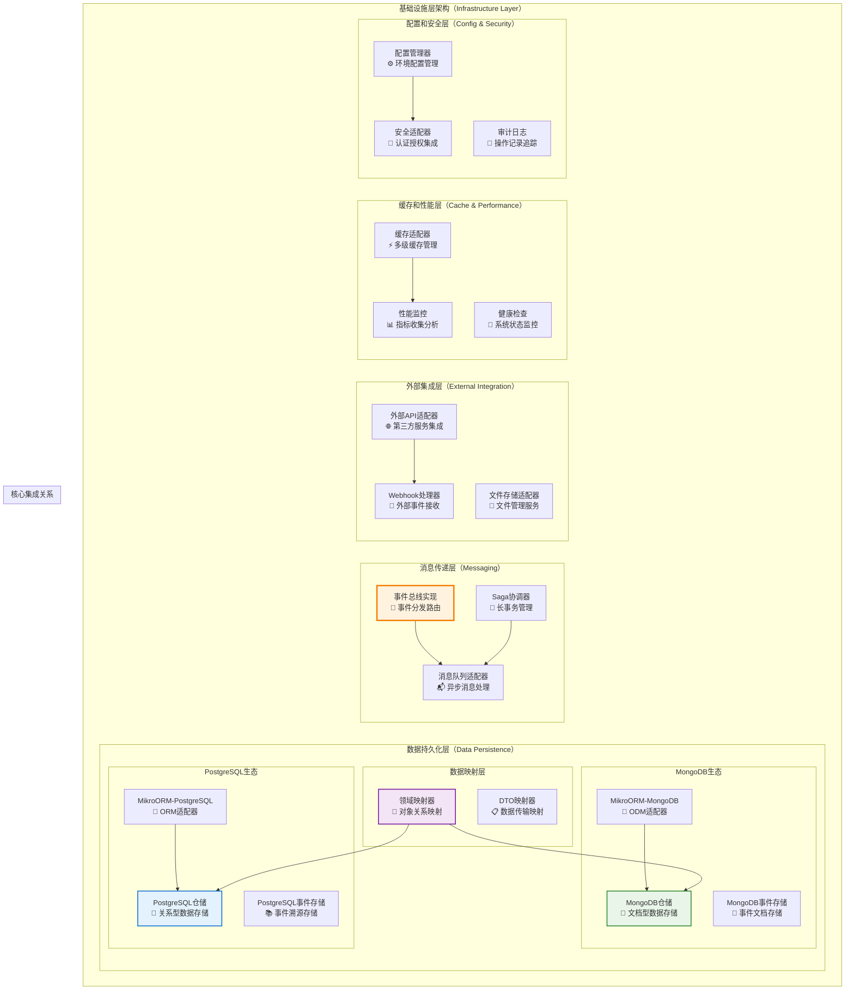
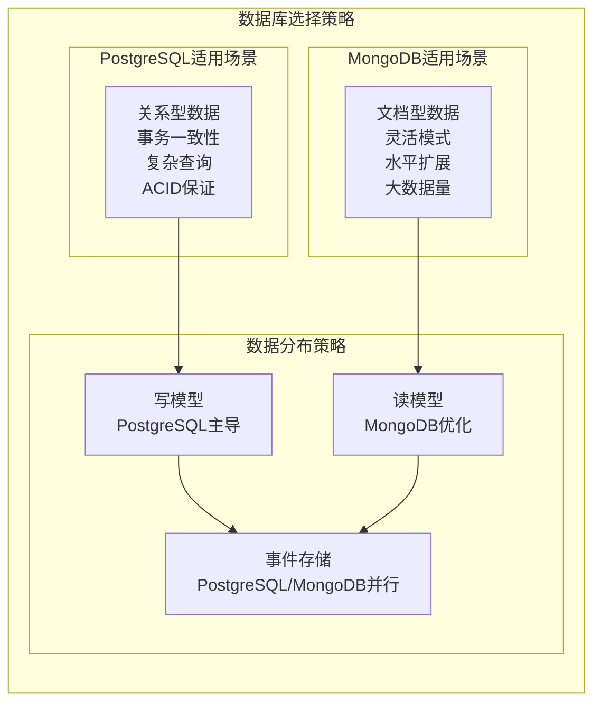
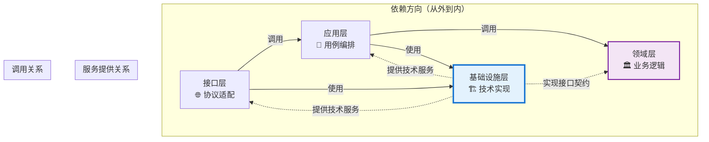

# 🏗️ 基础设施层设计原则详解

## 混合架构下的基础设施层组件职责与设计规范

### 📖 文档概述

本文档详细阐述了在混合架构（Clean Architecture + CQRS + ES + EDA）下，基础设施层各个组件的职责划分、设计原则和最佳实践。基础设施层作为系统的最外层，负责技术实现细节，支持PostgreSQL和MongoDB双数据库架构，遵循**"技术实现服务业务需求"**的核心原则，为领域层和应用层提供稳定可靠的技术支撑。

**重要说明**: 本文档基于 `packages/hybrid-archi` 模块的实际实现，该模块作为通用功能组件，提供业务模块所需的基础基础设施层功能。

---

## 🎯 第一部分：基础设施层组件职责矩阵

### 1.1 组件职责总览

| 组件 | 主要职责 | 次要职责 | 不应承担的职责 |
|------|---------|---------|---------------|
| **仓储实现（Repository）** | 聚合根持久化、数据访问 | 查询优化、缓存集成 | 业务逻辑、数据验证 |
| **事件存储（Event Store）** | 事件持久化、事件重放 | 快照管理、版本控制 | 事件处理逻辑、业务规则 |
| **数据库适配器** | 数据库连接、事务管理 | 连接池管理、性能监控 | 业务逻辑、数据映射 |
| **映射器（Mapper）** | 领域对象与数据模型转换 | 数据验证、格式转换 | 业务逻辑、持久化逻辑 |
| **外部服务适配器** | 外部API集成、协议转换 | 重试机制、降级处理 | 业务逻辑、内部数据结构 |
| **消息队列适配器** | 消息发布、消息消费 | 死信处理、监控告警 | 消息内容处理、业务逻辑 |
| **缓存适配器** | 数据缓存、缓存失效 | 缓存策略、性能监控 | 业务逻辑、数据一致性 |
| **配置管理器** | 配置加载、环境适配 | 配置热更新、验证 | 业务逻辑、配置内容定义 |

### 1.2 基础设施层架构图



### 1.3 双数据库架构策略



---

## 🐘 第二部分：PostgreSQL基础设施设计原则

### 2.1 PostgreSQL在混合架构中的定位

**PostgreSQL作为关系型数据库，在我们的架构中主要承担写模型存储、事件存储和强一致性数据管理的职责。**

#### 2.1.1 PostgreSQL的核心优势

```typescript
/**
 * PostgreSQL基础设施配置
 */
@Injectable()
export class PostgreSQLInfrastructureService {
  constructor(
    private readonly postgresqlConfig: PostgreSQLConfig,
    private readonly connectionPool: PostgreSQLConnectionPool,
    private readonly transactionManager: PostgreSQLTransactionManager,
    private readonly logger: ILoggerService
  ) {}

  /**
   * PostgreSQL优势：
   * 1. ACID事务保证：强一致性事务支持
   * 2. 复杂查询能力：支持复杂的SQL查询和分析
   * 3. 数据完整性：外键约束和数据完整性检查
   * 4. 并发控制：MVCC并发控制机制
   * 5. 扩展性：丰富的扩展插件生态
   */

  // ========== PostgreSQL：事务管理 ==========
  async executeInTransaction<T>(
    operation: (entityManager: EntityManager) => Promise<T>
  ): Promise<T> {
    const em = this.connectionPool.getEntityManager();
    
    return await em.transactional(async (transactionalEm) => {
      try {
        this.logger.debug('PostgreSQL事务开始');
        
        const result = await operation(transactionalEm);
        
        this.logger.debug('PostgreSQL事务提交成功');
        return result;
        
      } catch (error) {
        this.logger.error('PostgreSQL事务回滚', {
          error: error instanceof Error ? error.message : String(error)
        });
        throw error;
      }
    });
  }

  // ========== PostgreSQL：连接池管理 ==========
  async getHealthStatus(): Promise<PostgreSQLHealthStatus> {
    const pool = this.connectionPool.getPool();
    
    return new PostgreSQLHealthStatus(
      pool.totalCount,      // 总连接数
      pool.idleCount,       // 空闲连接数
      pool.waitingCount,    // 等待连接数
      pool.activeCount,     // 活跃连接数
      await this.testConnection()
    );
  }

  private async testConnection(): Promise<boolean> {
    try {
      const em = this.connectionPool.getEntityManager();
      await em.getConnection().execute('SELECT 1');
      return true;
    } catch {
      return false;
    }
  }
}
```

### 2.2 PostgreSQL仓储实现

#### 2.2.1 聚合根仓储

```typescript
/**
 * PostgreSQL聚合根仓储实现
 */
@Injectable()
export class PostgreSQLUserRepository implements IUserRepository {
  constructor(
    @InjectRepository(UserDbEntity)
    private readonly userRepository: EntityRepository<UserDbEntity>,
    private readonly userMapper: UserAggregateMapper,
    private readonly eventStore: PostgreSQLEventStore,
    private readonly logger: ILoggerService
  ) {}

  // ========== PostgreSQL：聚合根保存 ==========
  async save(userAggregate: UserAggregate): Promise<void> {
    this.logger.debug('保存用户聚合根到PostgreSQL', {
      userId: userAggregate.getId().getValue(),
      version: userAggregate.getVersion()
    });

    try {
      // 1. 映射聚合根到数据库实体
      const userDbEntity = this.userMapper.toPersistence(userAggregate);
      
      // 2. 保存到PostgreSQL
      await this.userRepository.persistAndFlush(userDbEntity);
      
      // 3. 保存事件到事件存储
      const uncommittedEvents = userAggregate.getUncommittedEvents();
      if (uncommittedEvents.length > 0) {
        await this.eventStore.saveEvents(
          userAggregate.getId(),
          uncommittedEvents,
          userAggregate.getVersion() - uncommittedEvents.length
        );
      }

      this.logger.info('用户聚合根保存成功', {
        userId: userAggregate.getId().getValue(),
        eventCount: uncommittedEvents.length
      });

    } catch (error) {
      this.logger.error('用户聚合根保存失败', {
        userId: userAggregate.getId().getValue(),
        error: error instanceof Error ? error.message : String(error)
      });
      throw new RepositoryException('用户保存失败', error);
    }
  }

  // ========== PostgreSQL：聚合根查找 ==========
  async findById(userId: UserId): Promise<UserAggregate | null> {
    this.logger.debug('从PostgreSQL查找用户聚合根', {
      userId: userId.getValue()
    });

    try {
      // 1. 从数据库查找实体
      const userDbEntity = await this.userRepository.findOne({
        id: userId.getValue()
      }, {
        populate: ['profile', 'preferences', 'roles'] // 预加载关联数据
      });

      if (!userDbEntity) {
        return null;
      }

      // 2. 映射数据库实体到聚合根
      const userAggregate = this.userMapper.toDomain(userDbEntity);

      // 3. 从事件存储加载事件（如果需要）
      const events = await this.eventStore.getEvents(userId, userDbEntity.version);
      if (events.length > 0) {
        userAggregate.replayEvents(events);
      }

      this.logger.debug('用户聚合根查找成功', {
        userId: userId.getValue(),
        version: userAggregate.getVersion()
      });

      return userAggregate;

    } catch (error) {
      this.logger.error('用户聚合根查找失败', {
        userId: userId.getValue(),
        error: error instanceof Error ? error.message : String(error)
      });
      throw new RepositoryException('用户查找失败', error);
    }
  }

  // ========== PostgreSQL：复杂查询支持 ==========
  async findByComplexCriteria(criteria: UserSearchCriteria): Promise<UserAggregate[]> {
    const qb = this.userRepository.createQueryBuilder('user');
    
    // 利用PostgreSQL的强大查询能力
    if (criteria.emailDomain) {
      qb.andWhere('user.email LIKE ?', [`%@${criteria.emailDomain}`]);
    }
    
    if (criteria.registeredDateRange) {
      qb.andWhere('user.createdAt BETWEEN ? AND ?', [
        criteria.registeredDateRange.start,
        criteria.registeredDateRange.end
      ]);
    }
    
    if (criteria.hasRoles) {
      qb.leftJoin('user.roles', 'role')
        .andWhere('role.name IN (?)', [criteria.hasRoles]);
    }
    
    // 排序和分页
    qb.orderBy('user.createdAt', 'DESC')
      .limit(criteria.limit)
      .offset(criteria.offset);

    const userDbEntities = await qb.getResult();
    
    return userDbEntities.map(entity => this.userMapper.toDomain(entity));
  }
}
```

### 2.3 PostgreSQL事件存储

#### 2.3.1 事件存储实现

```typescript
/**
 * PostgreSQL事件存储实现
 */
@Injectable()
export class PostgreSQLEventStore implements IEventStore {
  constructor(
    @InjectRepository(EventDbEntity)
    private readonly eventRepository: EntityRepository<EventDbEntity>,
    @InjectRepository(SnapshotDbEntity)
    private readonly snapshotRepository: EntityRepository<SnapshotDbEntity>,
    private readonly eventSerializer: IEventSerializer,
    private readonly logger: ILoggerService
  ) {}

  // ========== PostgreSQL：事件保存 ==========
  async saveEvents(
    aggregateId: EntityId,
    events: BaseDomainEvent[],
    expectedVersion: number
  ): Promise<void> {
    this.logger.debug('保存事件到PostgreSQL事件存储', {
      aggregateId: aggregateId.getValue(),
      eventCount: events.length,
      expectedVersion
    });

    try {
      // 1. 检查并发冲突（乐观锁）
      await this.checkConcurrency(aggregateId, expectedVersion);

      // 2. 序列化和保存事件
      const eventDbEntities = events.map((event, index) => {
        const serializedData = this.eventSerializer.serialize(event);
        
        return new EventDbEntity(
          generateUUID(),
          aggregateId.getValue(),
          event.getEventName(),
          serializedData.data,
          serializedData.metadata,
          expectedVersion + index + 1,
          event.getTimestamp(),
          event.getCorrelationId(),
          event.getCausationId()
        );
      });

      // 3. 批量插入事件（利用PostgreSQL的批量插入性能）
      await this.eventRepository.persistAndFlush(eventDbEntities);

      this.logger.info('事件保存到PostgreSQL成功', {
        aggregateId: aggregateId.getValue(),
        eventCount: events.length,
        finalVersion: expectedVersion + events.length
      });

    } catch (error) {
      this.logger.error('PostgreSQL事件保存失败', {
        aggregateId: aggregateId.getValue(),
        error: error instanceof Error ? error.message : String(error)
      });
      throw new EventStoreException('事件保存失败', error);
    }
  }

  // ========== PostgreSQL：事件查询 ==========
  async getEvents(
    aggregateId: EntityId,
    fromVersion?: number
  ): Promise<BaseDomainEvent[]> {
    this.logger.debug('从PostgreSQL事件存储获取事件', {
      aggregateId: aggregateId.getValue(),
      fromVersion
    });

    try {
      const qb = this.eventRepository.createQueryBuilder('event');
      
      qb.where('event.aggregateId = ?', [aggregateId.getValue()]);
      
      if (fromVersion !== undefined) {
        qb.andWhere('event.version > ?', [fromVersion]);
      }
      
      qb.orderBy('event.version', 'ASC');

      const eventDbEntities = await qb.getResult();
      
      // 反序列化事件
      const events = eventDbEntities.map(entity => 
        this.eventSerializer.deserialize(
          entity.eventType,
          entity.eventData,
          entity.metadata
        )
      );

      this.logger.debug('PostgreSQL事件获取成功', {
        aggregateId: aggregateId.getValue(),
        eventCount: events.length
      });

      return events;

    } catch (error) {
      this.logger.error('PostgreSQL事件获取失败', {
        aggregateId: aggregateId.getValue(),
        error: error instanceof Error ? error.message : String(error)
      });
      throw new EventStoreException('事件获取失败', error);
    }
  }

  // ========== PostgreSQL：快照管理 ==========
  async saveSnapshot(snapshot: AggregateSnapshot): Promise<void> {
    try {
      const snapshotDbEntity = new SnapshotDbEntity(
        generateUUID(),
        snapshot.aggregateId,
        snapshot.aggregateType,
        this.eventSerializer.serialize(snapshot.data),
        snapshot.version,
        snapshot.timestamp
      );

      await this.snapshotRepository.persistAndFlush(snapshotDbEntity);

      this.logger.info('快照保存到PostgreSQL成功', {
        aggregateId: snapshot.aggregateId,
        version: snapshot.version
      });

    } catch (error) {
      this.logger.error('PostgreSQL快照保存失败', {
        aggregateId: snapshot.aggregateId,
        error: error instanceof Error ? error.message : String(error)
      });
      throw new EventStoreException('快照保存失败', error);
    }
  }

  // ========== PostgreSQL：并发控制 ==========
  private async checkConcurrency(
    aggregateId: EntityId,
    expectedVersion: number
  ): Promise<void> {
    const latestEvent = await this.eventRepository.findOne({
      aggregateId: aggregateId.getValue()
    }, {
      orderBy: { version: 'DESC' }
    });

    const currentVersion = latestEvent?.version || 0;

    if (currentVersion !== expectedVersion) {
      throw new ConcurrencyException(
        aggregateId.getValue(),
        expectedVersion,
        currentVersion
      );
    }
  }
}
```

---

## 🍃 第三部分：MongoDB基础设施设计原则

### 3.1 MongoDB在混合架构中的定位

**MongoDB作为文档型数据库，在我们的架构中主要承担读模型存储、灵活数据结构和高性能查询的职责。**

#### 3.1.1 MongoDB的核心优势

```typescript
/**
 * MongoDB基础设施配置
 */
@Injectable()
export class MongoDBInfrastructureService {
  constructor(
    private readonly mongodbConfig: MongoDBConfig,
    private readonly connectionManager: MongoDBConnectionManager,
    private readonly logger: ILoggerService
  ) {}

  /**
   * MongoDB优势：
   * 1. 灵活模式：无需预定义严格的数据结构
   * 2. 水平扩展：原生支持分片和副本集
   * 3. 高性能查询：优化的文档查询和索引
   * 4. 大数据量处理：适合处理大量非结构化数据
   * 5. 聚合管道：强大的数据聚合和分析能力
   */

  // ========== MongoDB：连接管理 ==========
  async getConnection(tenantId?: string): Promise<Connection> {
    try {
      // 支持多租户的数据库连接策略
      if (tenantId && this.mongodbConfig.multiTenantStrategy === 'database') {
        return await this.connectionManager.getTenantConnection(tenantId);
      }
      
      return await this.connectionManager.getDefaultConnection();
      
    } catch (error) {
      this.logger.error('MongoDB连接获取失败', {
        tenantId,
        error: error instanceof Error ? error.message : String(error)
      });
      throw new DatabaseConnectionException('MongoDB连接失败', error);
    }
  }

  // ========== MongoDB：性能监控 ==========
  async getPerformanceMetrics(): Promise<MongoDBPerformanceMetrics> {
    try {
      const connection = await this.getConnection();
      const db = connection.getDb();
      
      // 获取数据库统计信息
      const stats = await db.stats();
      
      // 获取当前操作统计
      const currentOp = await db.admin().command({ currentOp: 1 });
      
      return new MongoDBPerformanceMetrics(
        stats.collections,     // 集合数量
        stats.dataSize,        // 数据大小
        stats.indexSize,       // 索引大小
        currentOp.inprog.length, // 当前操作数量
        stats.avgObjSize       // 平均对象大小
      );
      
    } catch (error) {
      this.logger.error('MongoDB性能指标获取失败', {
        error: error instanceof Error ? error.message : String(error)
      });
      throw new MonitoringException('性能指标获取失败', error);
    }
  }
}
```

### 3.2 MongoDB读模型仓储

#### 3.2.1 优化的读模型实现

```typescript
/**
 * MongoDB读模型仓储实现
 */
@Injectable()
export class MongoDBUserReadModelRepository implements IUserReadModelRepository {
  constructor(
    @InjectRepository(UserReadModelDocument)
    private readonly readModelRepository: EntityRepository<UserReadModelDocument>,
    private readonly readModelMapper: UserReadModelMapper,
    private readonly cacheManager: ICacheManager,
    private readonly logger: ILoggerService
  ) {}

  // ========== MongoDB：优化的读模型查询 ==========
  async findUserProfile(userId: string): Promise<UserProfileReadModel | null> {
    this.logger.debug('从MongoDB读模型查询用户资料', { userId });

    try {
      // 1. 尝试从缓存获取
      const cacheKey = `user:profile:${userId}`;
      const cached = await this.cacheManager.get<UserProfileReadModel>(cacheKey);
      
      if (cached) {
        this.logger.debug('从缓存获取用户资料', { userId });
        return cached;
      }

      // 2. 从MongoDB读模型查询
      const readModelDoc = await this.readModelRepository.findOne({
        userId: userId
      });

      if (!readModelDoc) {
        return null;
      }

      // 3. 映射文档到读模型
      const readModel = this.readModelMapper.toDomain(readModelDoc);

      // 4. 更新缓存
      await this.cacheManager.set(cacheKey, readModel, 1800); // 30分钟缓存

      this.logger.debug('从MongoDB读模型获取用户资料成功', { userId });
      return readModel;

    } catch (error) {
      this.logger.error('MongoDB读模型查询失败', {
        userId,
        error: error instanceof Error ? error.message : String(error)
      });
      throw new ReadModelException('读模型查询失败', error);
    }
  }

  // ========== MongoDB：聚合查询 ==========
  async getUserStatistics(tenantId: string): Promise<UserStatistics> {
    this.logger.debug('获取用户统计信息', { tenantId });

    try {
      // 利用MongoDB的聚合管道进行复杂统计
      const pipeline = [
        // 匹配租户
        { $match: { tenantId: tenantId } },
        
        // 分组统计
        {
          $group: {
            _id: '$status',
            count: { $sum: 1 },
            avgLoginFrequency: { $avg: '$loginFrequency' },
            lastActiveUsers: {
              $push: {
                $cond: [
                  { $gte: ['$lastLoginAt', new Date(Date.now() - 7 * 24 * 60 * 60 * 1000)] },
                  '$userId',
                  null
                ]
              }
            }
          }
        },
        
        // 过滤空值
        {
          $project: {
            status: '$_id',
            count: 1,
            avgLoginFrequency: 1,
            lastActiveUsers: {
              $filter: {
                input: '$lastActiveUsers',
                cond: { $ne: ['$$this', null] }
              }
            }
          }
        }
      ];

      const aggregationResult = await this.readModelRepository
        .getEntityManager()
        .aggregate(UserReadModelDocument, pipeline)
        .toArray();

      return new UserStatistics(tenantId, aggregationResult);

    } catch (error) {
      this.logger.error('用户统计查询失败', {
        tenantId,
        error: error instanceof Error ? error.message : String(error)
      });
      throw new ReadModelException('统计查询失败', error);
    }
  }

  // ========== MongoDB：全文搜索 ==========
  async searchUsers(
    tenantId: string,
    searchTerm: string,
    options: SearchOptions
  ): Promise<UserSearchResult[]> {
    try {
      // 利用MongoDB的全文搜索能力
      const searchQuery = {
        tenantId: tenantId,
        $text: { $search: searchTerm }
      };

      const results = await this.readModelRepository.find(searchQuery, {
        limit: options.limit,
        offset: options.offset,
        orderBy: { score: { $meta: 'textScore' } } // 按相关性排序
      });

      return results.map(doc => this.readModelMapper.toSearchResult(doc));

    } catch (error) {
      this.logger.error('MongoDB全文搜索失败', {
        tenantId,
        searchTerm,
        error: error instanceof Error ? error.message : String(error)
      });
      throw new SearchException('全文搜索失败', error);
    }
  }
}
```

---

## 🔧 第四部分：MikroORM集成设计原则

### 4.1 MikroORM双数据库配置

#### 4.1.1 统一ORM配置策略

```typescript
/**
 * MikroORM双数据库配置
 */
@Injectable()
export class MikroORMConfigurationService {
  constructor(
    private readonly configService: IConfigService,
    private readonly logger: ILoggerService
  ) {}

  // ========== MikroORM：PostgreSQL配置 ==========
  createPostgreSQLConfig(): PostgreSqlMikroOrmConfig {
    return {
      type: 'postgresql',
      host: this.configService.get('database.postgresql.host'),
      port: this.configService.get('database.postgresql.port'),
      user: this.configService.get('database.postgresql.username'),
      password: this.configService.get('database.postgresql.password'),
      dbName: this.configService.get('database.postgresql.database'),
      
      // 实体配置
      entities: [
        UserDbEntity,
        EventDbEntity,
        SnapshotDbEntity,
        TenantDbEntity
      ],
      
      // 连接池配置
      pool: {
        min: 5,
        max: 20,
        acquireTimeoutMillis: 30000,
        createTimeoutMillis: 30000,
        destroyTimeoutMillis: 5000,
        idleTimeoutMillis: 30000,
        reapIntervalMillis: 1000,
        createRetryIntervalMillis: 200
      },
      
      // 性能优化
      debug: this.configService.get('app.environment') === 'development',
      cache: {
        enabled: true,
        adapter: RedisAdapter,
        options: {
          client: this.configService.get('cache.redis.client')
        }
      },
      
      // 迁移配置
      migrations: {
        path: './migrations/postgresql',
        pattern: /^[\w-]+\d+\.(ts|js)$/,
        transactional: true,
        disableForeignKeys: false
      }
    };
  }

  // ========== MikroORM：MongoDB配置 ==========
  createMongoDBConfig(): MongoMikroOrmConfig {
    return {
      type: 'mongo',
      clientUrl: this.configService.get('database.mongodb.uri'),
      dbName: this.configService.get('database.mongodb.database'),
      
      // 文档配置
      entities: [
        UserReadModelDocument,
        EventDocument,
        AnalyticsDocument,
        LogDocument
      ],
      
      // 连接配置
      connectTimeoutMS: 30000,
      serverSelectionTimeoutMS: 30000,
      maxPoolSize: 10,
      minPoolSize: 2,
      maxIdleTimeMS: 30000,
      
      // 读写分离配置
      readPreference: 'secondaryPreferred',
      readConcern: { level: 'majority' },
      writeConcern: { w: 'majority', j: true },
      
      // 性能优化
      debug: this.configService.get('app.environment') === 'development',
      cache: {
        enabled: true,
        adapter: RedisAdapter,
        options: {
          client: this.configService.get('cache.redis.client')
        }
      }
    };
  }

  // ========== MikroORM：多数据库管理 ==========
  createMultiDatabaseConfig(): MikroOrmMultiDbConfig {
    return {
      // 默认数据库（PostgreSQL）
      default: this.createPostgreSQLConfig(),
      
      // 读模型数据库（MongoDB）
      readModel: this.createMongoDBConfig(),
      
      // 数据库路由策略
      contextStrategy: 'tenant-aware',
      
      // 事务管理
      transactionStrategy: 'per-database',
      
      // 健康检查
      healthCheck: {
        enabled: true,
        interval: 30000, // 30秒检查一次
        timeout: 5000
      }
    };
  }
}
```

### 4.2 MikroORM实体映射

#### 4.2.1 PostgreSQL实体定义

```typescript
/**
 * PostgreSQL用户实体定义
 */
@Entity({ tableName: 'users' })
export class UserDbEntity {
  @PrimaryKey({ type: 'uuid' })
  id: string;

  @Property({ type: 'varchar', length: 320, unique: true })
  email: string;

  @Property({ type: 'varchar', length: 100 })
  name: string;

  @Enum(() => UserStatus)
  status: UserStatus;

  @Property({ type: 'boolean', default: false })
  emailVerified: boolean;

  @Property({ type: 'varchar', length: 36 })
  tenantId: string;

  @Property({ type: 'varchar', length: 36, nullable: true })
  createdBy?: string;

  @Property({ type: 'int', default: 1 })
  version: number;

  @Property({ type: 'timestamptz' })
  createdAt: Date;

  @Property({ type: 'timestamptz', onUpdate: () => new Date() })
  updatedAt: Date;

  // 关联关系（利用PostgreSQL的外键能力）
  @OneToOne(() => UserProfileDbEntity, profile => profile.user, { 
    cascade: [Cascade.ALL],
    owner: true 
  })
  profile?: UserProfileDbEntity;

  @OneToMany(() => UserRoleDbEntity, role => role.user, { 
    cascade: [Cascade.ALL] 
  })
  roles = new Collection<UserRoleDbEntity>(this);

  @OneToMany(() => UserPreferenceDbEntity, preference => preference.user, { 
    cascade: [Cascade.ALL] 
  })
  preferences = new Collection<UserPreferenceDbEntity>(this);

  // PostgreSQL特有的索引优化
  @Index({ name: 'idx_user_email_tenant' })
  @Index({ name: 'idx_user_status_created' })
  @Index({ name: 'idx_user_tenant_status' })

  constructor(
    id: string,
    email: string,
    name: string,
    tenantId: string,
    createdBy?: string
  ) {
    this.id = id;
    this.email = email;
    this.name = name;
    this.status = UserStatus.PENDING;
    this.emailVerified = false;
    this.tenantId = tenantId;
    this.createdBy = createdBy;
    this.version = 1;
    this.createdAt = new Date();
    this.updatedAt = new Date();
  }
}

/**
 * PostgreSQL事件实体定义
 */
@Entity({ tableName: 'events' })
export class EventDbEntity {
  @PrimaryKey({ type: 'uuid' })
  id: string;

  @Property({ type: 'varchar', length: 36 })
  @Index()
  aggregateId: string;

  @Property({ type: 'varchar', length: 100 })
  eventType: string;

  @Property({ type: 'jsonb' }) // 利用PostgreSQL的JSONB类型
  eventData: Record<string, unknown>;

  @Property({ type: 'jsonb' })
  metadata: Record<string, unknown>;

  @Property({ type: 'int' })
  version: number;

  @Property({ type: 'timestamptz' })
  @Index()
  timestamp: Date;

  @Property({ type: 'varchar', length: 36, nullable: true })
  correlationId?: string;

  @Property({ type: 'varchar', length: 36, nullable: true })
  causationId?: string;

  // PostgreSQL特有的复合索引
  @Index({ name: 'idx_events_aggregate_version' })
  @Index({ name: 'idx_events_timestamp' })
  @Index({ name: 'idx_events_correlation' })

  constructor(
    id: string,
    aggregateId: string,
    eventType: string,
    eventData: Record<string, unknown>,
    metadata: Record<string, unknown>,
    version: number,
    timestamp: Date,
    correlationId?: string,
    causationId?: string
  ) {
    this.id = id;
    this.aggregateId = aggregateId;
    this.eventType = eventType;
    this.eventData = eventData;
    this.metadata = metadata;
    this.version = version;
    this.timestamp = timestamp;
    this.correlationId = correlationId;
    this.causationId = causationId;
  }
}
```

#### 4.2.2 MongoDB文档定义

```typescript
/**
 * MongoDB用户读模型文档定义
 */
@Entity({ collection: 'user_read_models' })
export class UserReadModelDocument {
  @PrimaryKey({ type: 'ObjectId' })
  _id: ObjectId;

  @Property({ type: 'string', unique: true })
  userId: string;

  @Property({ type: 'string' })
  email: string;

  @Property({ type: 'string' })
  name: string;

  @Property({ type: 'string' })
  status: string;

  @Property({ type: 'boolean' })
  emailVerified: boolean;

  @Property({ type: 'string' })
  initials: string;

  @Property({ type: 'string' })
  tenantId: string;

  // MongoDB灵活的嵌套文档结构
  @Property({ type: 'object' })
  profile: {
    avatar?: string;
    bio?: string;
    location?: string;
    website?: string;
    socialLinks?: Record<string, string>;
  };

  @Property({ type: 'object' })
  preferences: {
    language: string;
    timezone: string;
    notifications: {
      email: boolean;
      push: boolean;
      sms: boolean;
    };
    theme: string;
  };

  @Property({ type: 'array' })
  roles: string[];

  @Property({ type: 'array' })
  permissions: string[];

  // 统计信息（适合MongoDB的文档模型）
  @Property({ type: 'object' })
  statistics: {
    loginCount: number;
    lastLoginAt?: Date;
    sessionDuration: number;
    activityScore: number;
  };

  @Property({ type: 'date' })
  createdAt: Date;

  @Property({ type: 'date' })
  updatedAt: Date;

  @Property({ type: 'int' })
  version: number;

  // MongoDB特有的文本索引
  @Index({ name: 'text_search_index', type: 'text' })
  @Index({ name: 'tenant_status_index' })
  @Index({ name: 'email_index' })

  constructor(
    userId: string,
    email: string,
    name: string,
    tenantId: string
  ) {
    this._id = new ObjectId();
    this.userId = userId;
    this.email = email;
    this.name = name;
    this.status = 'pending';
    this.emailVerified = false;
    this.initials = this.generateInitials(name);
    this.tenantId = tenantId;
    this.profile = {};
    this.preferences = {
      language: 'zh-CN',
      timezone: 'Asia/Shanghai',
      notifications: { email: true, push: true, sms: false },
      theme: 'light'
    };
    this.roles = [];
    this.permissions = [];
    this.statistics = {
      loginCount: 0,
      sessionDuration: 0,
      activityScore: 0
    };
    this.createdAt = new Date();
    this.updatedAt = new Date();
    this.version = 1;
  }

  private generateInitials(name: string): string {
    return name
      .split(' ')
      .map(part => part.charAt(0).toUpperCase())
      .join('')
      .substring(0, 2);
  }
}

/**
 * MongoDB事件文档定义
 */
@Entity({ collection: 'events' })
export class EventDocument {
  @PrimaryKey({ type: 'ObjectId' })
  _id: ObjectId;

  @Property({ type: 'string' })
  @Index()
  aggregateId: string;

  @Property({ type: 'string' })
  eventType: string;

  @Property({ type: 'object' }) // MongoDB原生支持复杂对象
  eventData: Record<string, unknown>;

  @Property({ type: 'object' })
  metadata: {
    aggregateVersion: number;
    correlationId?: string;
    causationId?: string;
    userId?: string;
    tenantId?: string;
    timestamp: Date;
  };

  @Property({ type: 'int' })
  version: number;

  @Property({ type: 'date' })
  @Index()
  timestamp: Date;

  // MongoDB特有的TTL索引（自动过期）
  @Index({ name: 'ttl_index', expireAfterSeconds: 365 * 24 * 60 * 60 }) // 1年后过期

  constructor(
    aggregateId: string,
    eventType: string,
    eventData: Record<string, unknown>,
    metadata: Record<string, unknown>,
    version: number
  ) {
    this._id = new ObjectId();
    this.aggregateId = aggregateId;
    this.eventType = eventType;
    this.eventData = eventData;
    this.metadata = metadata as any;
    this.version = version;
    this.timestamp = new Date();
  }
}
```

### 4.3 MikroORM数据库路由策略

#### 4.3.1 智能数据库路由

```typescript
/**
 * MikroORM数据库路由管理
 */
@Injectable()
export class DatabaseRoutingService {
  constructor(
    private readonly postgresqlOrm: MikroORM,
    private readonly mongodbOrm: MikroORM,
    private readonly logger: ILoggerService
  ) {}

  // ========== 数据库路由：写操作路由 ==========
  getWriteEntityManager(entityType: string): EntityManager {
    // 写操作优先使用PostgreSQL（ACID保证）
    const writeEntities = [
      'UserDbEntity',
      'EventDbEntity',
      'SnapshotDbEntity',
      'TenantDbEntity',
      'TransactionDbEntity'
    ];

    if (writeEntities.includes(entityType)) {
      this.logger.debug('路由写操作到PostgreSQL', { entityType });
      return this.postgresqlOrm.em;
    }

    // 其他写操作使用MongoDB
    this.logger.debug('路由写操作到MongoDB', { entityType });
    return this.mongodbOrm.em;
  }

  // ========== 数据库路由：读操作路由 ==========
  getReadEntityManager(entityType: string, queryType: 'simple' | 'complex' | 'analytics'): EntityManager {
    // 根据查询类型选择最优数据库
    switch (queryType) {
      case 'simple':
        // 简单查询优先使用MongoDB（性能优势）
        if (this.isReadModelEntity(entityType)) {
          this.logger.debug('路由简单查询到MongoDB', { entityType });
          return this.mongodbOrm.em;
        }
        break;
        
      case 'complex':
        // 复杂查询使用PostgreSQL（SQL能力）
        this.logger.debug('路由复杂查询到PostgreSQL', { entityType });
        return this.postgresqlOrm.em;
        
      case 'analytics':
        // 分析查询使用MongoDB（聚合管道）
        this.logger.debug('路由分析查询到MongoDB', { entityType });
        return this.mongodbOrm.em;
    }

    // 默认使用PostgreSQL
    return this.postgresqlOrm.em;
  }

  // ========== 数据库路由：事务管理 ==========
  async executeInMultiDatabaseTransaction<T>(
    operation: (managers: { pg: EntityManager; mongo: EntityManager }) => Promise<T>
  ): Promise<T> {
    // 跨数据库事务协调（使用分布式事务模式）
    const pgEm = this.postgresqlOrm.em.fork();
    const mongoEm = this.mongodbOrm.em.fork();

    try {
      // 开始分布式事务
      await pgEm.begin();
      // MongoDB不支持传统事务，使用会话
      const mongoSession = mongoEm.getConnection().getDb().startSession();
      
      try {
        await mongoSession.startTransaction();
        
        const result = await operation({ pg: pgEm, mongo: mongoEm });
        
        // 两阶段提交
        await mongoSession.commitTransaction();
        await pgEm.commit();
        
        this.logger.info('跨数据库事务提交成功');
        return result;
        
      } catch (error) {
        // 回滚所有数据库
        await mongoSession.abortTransaction();
        await pgEm.rollback();
        
        this.logger.error('跨数据库事务回滚', {
          error: error instanceof Error ? error.message : String(error)
        });
        throw error;
        
      } finally {
        await mongoSession.endSession();
      }
      
    } catch (error) {
      this.logger.error('分布式事务执行失败', {
        error: error instanceof Error ? error.message : String(error)
      });
      throw new DistributedTransactionException('跨数据库事务失败', error);
    }
  }

  private isReadModelEntity(entityType: string): boolean {
    const readModelEntities = [
      'UserReadModelDocument',
      'AnalyticsDocument',
      'ReportDocument',
      'DashboardDocument'
    ];
    
    return readModelEntities.includes(entityType);
  }
}
```

---

## 🔄 第五部分：数据映射器设计原则

### 5.1 领域对象与数据库实体映射

#### 5.1.1 PostgreSQL聚合根映射器

```typescript
/**
 * PostgreSQL用户聚合根映射器
 */
@Injectable()
@DomainMapper('UserAggregate', 'UserDbEntity')
export class PostgreSQLUserAggregateMapper 
  extends BaseAggregateMapper<UserAggregate, UserDbEntity> {
  
  constructor(
    private readonly userEntityMapper: UserEntityMapper,
    private readonly logger: ILoggerService
  ) {
    super();
  }

  // ========== PostgreSQL：聚合根到实体映射 ==========
  toPersistence(aggregate: UserAggregate): UserDbEntity {
    this.logger.debug('映射用户聚合根到PostgreSQL实体', {
      userId: aggregate.getId().getValue()
    });

    try {
      const user = aggregate.getUser();
      
      // 创建PostgreSQL实体
      const dbEntity = new UserDbEntity(
        aggregate.getId().getValue(),
        user.getEmail().getValue(),
        user.getName().getValue(),
        aggregate.getTenantId(),
        user.getCreatedBy()
      );

      // 映射状态和版本
      dbEntity.status = user.getStatus();
      dbEntity.emailVerified = user.isEmailVerified();
      dbEntity.version = aggregate.getVersion();
      dbEntity.createdAt = user.getCreatedAt();
      dbEntity.updatedAt = user.getUpdatedAt();

      // 映射关联对象（利用PostgreSQL的关系特性）
      if (aggregate.hasProfile()) {
        dbEntity.profile = this.mapUserProfile(aggregate.getProfile());
      }

      if (aggregate.hasPreferences()) {
        dbEntity.preferences.set(this.mapUserPreferences(aggregate.getPreferences()));
      }

      if (aggregate.hasRoles()) {
        dbEntity.roles.set(this.mapUserRoles(aggregate.getRoles()));
      }

      return dbEntity;

    } catch (error) {
      this.logger.error('PostgreSQL聚合根映射失败', {
        userId: aggregate.getId().getValue(),
        error: error instanceof Error ? error.message : String(error)
      });
      throw new MappingException('聚合根映射失败', error);
    }
  }

  // ========== PostgreSQL：实体到聚合根映射 ==========
  toDomain(dbEntity: UserDbEntity): UserAggregate {
    this.logger.debug('映射PostgreSQL实体到用户聚合根', {
      userId: dbEntity.id
    });

    try {
      // 重建用户实体
      const userEntity = new UserEntity(
        UserId.fromString(dbEntity.id),
        new Email(dbEntity.email),
        new UserName(dbEntity.name),
        dbEntity.tenantId,
        dbEntity.createdBy
      );

      // 恢复状态
      userEntity.setStatus(dbEntity.status);
      userEntity.setEmailVerified(dbEntity.emailVerified);
      userEntity.setTimestamps(dbEntity.createdAt, dbEntity.updatedAt);

      // 创建聚合根
      const aggregate = new UserAggregate(userEntity);
      aggregate.setVersion(dbEntity.version);

      // 映射关联对象
      if (dbEntity.profile) {
        const profile = this.mapDbProfileToDomain(dbEntity.profile);
        aggregate.setProfile(profile);
      }

      if (dbEntity.preferences.isInitialized()) {
        const preferences = this.mapDbPreferencesToDomain(dbEntity.preferences.getItems());
        aggregate.setPreferences(preferences);
      }

      if (dbEntity.roles.isInitialized()) {
        const roles = this.mapDbRolesToDomain(dbEntity.roles.getItems());
        aggregate.setRoles(roles);
      }

      return aggregate;

    } catch (error) {
      this.logger.error('PostgreSQL实体映射失败', {
        userId: dbEntity.id,
        error: error instanceof Error ? error.message : String(error)
      });
      throw new MappingException('实体映射失败', error);
    }
  }

  // ========== PostgreSQL：关联对象映射 ==========
  private mapUserProfile(profile: UserProfile): UserProfileDbEntity {
    return new UserProfileDbEntity(
      profile.getUserId().getValue(),
      profile.getAvatar(),
      profile.getBio(),
      profile.getLocation(),
      profile.getWebsite()
    );
  }

  private mapUserPreferences(preferences: UserPreferences[]): UserPreferenceDbEntity[] {
    return preferences.map(pref => new UserPreferenceDbEntity(
      pref.getUserId().getValue(),
      pref.getKey(),
      pref.getValue(),
      pref.getType()
    ));
  }
}
```

#### 5.1.2 MongoDB读模型映射器

```typescript
/**
 * MongoDB用户读模型映射器
 */
@Injectable()
@ReadModelMapper('UserReadModel', 'UserReadModelDocument')
export class MongoDBUserReadModelMapper 
  extends BaseReadModelMapper<UserReadModel, UserReadModelDocument> {
  
  constructor(
    private readonly logger: ILoggerService
  ) {
    super();
  }

  // ========== MongoDB：读模型到文档映射 ==========
  toPersistence(readModel: UserReadModel): UserReadModelDocument {
    this.logger.debug('映射用户读模型到MongoDB文档', {
      userId: readModel.userId
    });

    try {
      const document = new UserReadModelDocument(
        readModel.userId,
        readModel.email,
        readModel.name,
        readModel.tenantId
      );

      // 映射基础属性
      document.status = readModel.status;
      document.emailVerified = readModel.emailVerified;
      document.initials = readModel.initials;

      // 映射嵌套对象（利用MongoDB的文档特性）
      document.profile = {
        avatar: readModel.profile?.avatar,
        bio: readModel.profile?.bio,
        location: readModel.profile?.location,
        website: readModel.profile?.website,
        socialLinks: readModel.profile?.socialLinks || {}
      };

      document.preferences = {
        language: readModel.preferences.language,
        timezone: readModel.preferences.timezone,
        notifications: {
          email: readModel.preferences.notifications.email,
          push: readModel.preferences.notifications.push,
          sms: readModel.preferences.notifications.sms
        },
        theme: readModel.preferences.theme
      };

      // 映射数组数据
      document.roles = readModel.roles.map(role => role.name);
      document.permissions = readModel.permissions.map(perm => perm.name);

      // 映射统计信息
      document.statistics = {
        loginCount: readModel.statistics.loginCount,
        lastLoginAt: readModel.statistics.lastLoginAt,
        sessionDuration: readModel.statistics.sessionDuration,
        activityScore: readModel.statistics.activityScore
      };

      document.version = readModel.version;
      document.updatedAt = new Date();

      return document;

    } catch (error) {
      this.logger.error('MongoDB读模型映射失败', {
        userId: readModel.userId,
        error: error instanceof Error ? error.message : String(error)
      });
      throw new MappingException('读模型映射失败', error);
    }
  }

  // ========== MongoDB：文档到读模型映射 ==========
  toDomain(document: UserReadModelDocument): UserReadModel {
    this.logger.debug('映射MongoDB文档到用户读模型', {
      userId: document.userId
    });

    try {
      const readModel = new UserReadModel(
        document.userId,
        document.email,
        document.name,
        document.status,
        document.emailVerified,
        document.initials,
        document.tenantId
      );

      // 映射嵌套对象
      if (document.profile) {
        readModel.setProfile(new UserProfileReadModel(
          document.profile.avatar,
          document.profile.bio,
          document.profile.location,
          document.profile.website,
          document.profile.socialLinks
        ));
      }

      // 映射偏好设置
      readModel.setPreferences(new UserPreferencesReadModel(
        document.preferences.language,
        document.preferences.timezone,
        document.preferences.notifications,
        document.preferences.theme
      ));

      // 映射角色和权限
      readModel.setRoles(document.roles.map(roleName => new RoleReadModel(roleName)));
      readModel.setPermissions(document.permissions.map(permName => new PermissionReadModel(permName)));

      // 映射统计信息
      readModel.setStatistics(new UserStatisticsReadModel(
        document.statistics.loginCount,
        document.statistics.lastLoginAt,
        document.statistics.sessionDuration,
        document.statistics.activityScore
      ));

      readModel.setVersion(document.version);
      readModel.setTimestamps(document.createdAt, document.updatedAt);

      return readModel;

    } catch (error) {
      this.logger.error('MongoDB文档映射失败', {
        userId: document.userId,
        error: error instanceof Error ? error.message : String(error)
      });
      throw new MappingException('文档映射失败', error);
    }
  }

  // ========== MongoDB：搜索结果映射 ==========
  toSearchResult(document: UserReadModelDocument): UserSearchResult {
    return new UserSearchResult(
      document.userId,
      document.email,
      document.name,
      document.status,
      document.initials,
      document.statistics.lastLoginAt,
      // MongoDB文本搜索得分
      document._id ? 1.0 : 0.0 // 简化的相关性得分
    );
  }
}
```

---

## 🚌 第六部分：消息传递基础设施设计原则

### 6.1 事件总线基础设施实现

#### 6.1.1 多后端事件总线

```typescript
/**
 * 多后端事件总线实现
 */
@Injectable()
export class HybridEventBusInfrastructure implements IEventBus {
  constructor(
    private readonly redisEventBus: RedisEventBus,
    private readonly rabbitMQEventBus: RabbitMQEventBus,
    private readonly inMemoryEventBus: InMemoryEventBus,
    private readonly configService: IConfigService,
    private readonly logger: ILoggerService
  ) {}

  // ========== 事件总线：智能路由发布 ==========
  async publish<T extends BaseDomainEvent>(event: T): Promise<void> {
    const eventType = event.getEventName();
    const routingStrategy = this.getRoutingStrategy(eventType);

    this.logger.debug('发布事件到事件总线', {
      eventType,
      eventId: event.getId(),
      routingStrategy
    });

    try {
      switch (routingStrategy) {
        case 'high-throughput':
          // 高吞吐量事件使用Redis
          await this.redisEventBus.publish(event);
          break;
          
        case 'reliable':
          // 可靠性要求高的事件使用RabbitMQ
          await this.rabbitMQEventBus.publish(event);
          break;
          
        case 'local':
          // 本地事件使用内存总线
          await this.inMemoryEventBus.publish(event);
          break;
          
        case 'broadcast':
          // 广播事件同时发布到多个总线
          await Promise.all([
            this.redisEventBus.publish(event),
            this.rabbitMQEventBus.publish(event)
          ]);
          break;
      }

      this.logger.info('事件发布成功', {
        eventType,
        eventId: event.getId(),
        routingStrategy
      });

    } catch (error) {
      this.logger.error('事件发布失败', {
        eventType,
        eventId: event.getId(),
        error: error instanceof Error ? error.message : String(error)
      });
      throw new EventBusException('事件发布失败', error);
    }
  }

  // ========== 事件总线：路由策略 ==========
  private getRoutingStrategy(eventType: string): EventRoutingStrategy {
    // 根据事件类型确定路由策略
    const config = this.configService.get('messaging.eventRouting');
    
    // 高频事件使用Redis
    if (config.highThroughputEvents.includes(eventType)) {
      return 'high-throughput';
    }
    
    // 关键业务事件使用RabbitMQ
    if (config.criticalEvents.includes(eventType)) {
      return 'reliable';
    }
    
    // 本地事件使用内存总线
    if (config.localEvents.includes(eventType)) {
      return 'local';
    }
    
    // 系统事件广播到所有总线
    if (config.systemEvents.includes(eventType)) {
      return 'broadcast';
    }
    
    // 默认使用可靠传输
    return 'reliable';
  }

  // ========== 事件总线：订阅管理 ==========
  async subscribe<T extends BaseDomainEvent>(
    eventType: string,
    handler: IEventHandler<T>
  ): Promise<void> {
    const routingStrategy = this.getRoutingStrategy(eventType);
    
    // 根据路由策略订阅相应的总线
    switch (routingStrategy) {
      case 'high-throughput':
        await this.redisEventBus.subscribe(eventType, handler);
        break;
        
      case 'reliable':
        await this.rabbitMQEventBus.subscribe(eventType, handler);
        break;
        
      case 'local':
        await this.inMemoryEventBus.subscribe(eventType, handler);
        break;
        
      case 'broadcast':
        // 广播事件需要在所有总线上订阅
        await Promise.all([
          this.redisEventBus.subscribe(eventType, handler),
          this.rabbitMQEventBus.subscribe(eventType, handler)
        ]);
        break;
    }

    this.logger.info('事件订阅成功', {
      eventType,
      handlerName: handler.constructor.name,
      routingStrategy
    });
  }
}
```

### 6.2 消息队列基础设施

#### 6.2.1 RabbitMQ适配器

```typescript
/**
 * RabbitMQ消息队列适配器
 */
@Injectable()
export class RabbitMQInfrastructureAdapter implements IMessageQueueAdapter {
  constructor(
    private readonly connection: amqp.Connection,
    private readonly channelManager: RabbitMQChannelManager,
    private readonly logger: ILoggerService
  ) {}

  // ========== RabbitMQ：消息发布 ==========
  async publishMessage<T>(
    exchange: string,
    routingKey: string,
    message: T,
    options?: PublishOptions
  ): Promise<void> {
    const channel = await this.channelManager.getChannel();
    
    try {
      const messageBuffer = Buffer.from(JSON.stringify(message));
      
      // RabbitMQ发布选项
      const publishOptions: amqp.Options.Publish = {
        persistent: options?.persistent ?? true,
        mandatory: options?.mandatory ?? false,
        deliveryMode: options?.persistent ? 2 : 1,
        timestamp: Date.now(),
        messageId: generateUUID(),
        correlationId: options?.correlationId,
        replyTo: options?.replyTo,
        expiration: options?.ttl?.toString(),
        headers: {
          ...options?.headers,
          'x-retry-count': '0',
          'x-max-retries': options?.maxRetries?.toString() || '3'
        }
      };

      const published = channel.publish(
        exchange,
        routingKey,
        messageBuffer,
        publishOptions
      );

      if (!published) {
        throw new Error('消息发布被RabbitMQ拒绝');
      }

      this.logger.info('RabbitMQ消息发布成功', {
        exchange,
        routingKey,
        messageId: publishOptions.messageId
      });

    } catch (error) {
      this.logger.error('RabbitMQ消息发布失败', {
        exchange,
        routingKey,
        error: error instanceof Error ? error.message : String(error)
      });
      throw new MessageQueueException('消息发布失败', error);
    }
  }

  // ========== RabbitMQ：消息消费 ==========
  async consumeMessages<T>(
    queue: string,
    handler: (message: T, context: MessageContext) => Promise<void>,
    options?: ConsumeOptions
  ): Promise<void> {
    const channel = await this.channelManager.getChannel();
    
    try {
      // 设置QoS（服务质量）
      await channel.prefetch(options?.prefetchCount || 10);
      
      // 开始消费消息
      await channel.consume(queue, async (msg) => {
        if (!msg) return;
        
        const messageContext = new MessageContext(
          msg.properties.messageId,
          msg.properties.correlationId,
          msg.properties.timestamp,
          msg.properties.headers,
          msg.fields.deliveryTag
        );

        try {
          // 解析消息内容
          const messageContent = JSON.parse(msg.content.toString());
          
          // 执行消息处理器
          await handler(messageContent, messageContext);
          
          // 确认消息处理成功
          channel.ack(msg);
          
          this.logger.debug('RabbitMQ消息处理成功', {
            queue,
            messageId: messageContext.messageId
          });

        } catch (error) {
          this.logger.error('RabbitMQ消息处理失败', {
            queue,
            messageId: messageContext.messageId,
            error: error instanceof Error ? error.message : String(error)
          });

          // 重试机制
          await this.handleMessageFailure(msg, messageContext, error, channel);
        }
      }, {
        noAck: false,
        exclusive: options?.exclusive || false,
        consumerTag: options?.consumerTag
      });

      this.logger.info('RabbitMQ消息消费者启动成功', { queue });

    } catch (error) {
      this.logger.error('RabbitMQ消息消费启动失败', {
        queue,
        error: error instanceof Error ? error.message : String(error)
      });
      throw new MessageQueueException('消息消费启动失败', error);
    }
  }

  // ========== RabbitMQ：消息重试和死信处理 ==========
  private async handleMessageFailure(
    msg: amqp.ConsumeMessage,
    context: MessageContext,
    error: unknown,
    channel: amqp.Channel
  ): Promise<void> {
    const retryCount = parseInt(msg.properties.headers['x-retry-count'] || '0');
    const maxRetries = parseInt(msg.properties.headers['x-max-retries'] || '3');

    if (retryCount < maxRetries) {
      // 重试：发布到延迟队列
      const delayMs = Math.pow(2, retryCount) * 1000; // 指数退避
      
      await this.publishToDelayQueue(msg, context, retryCount + 1, delayMs);
      channel.ack(msg);
      
      this.logger.warn('消息重试处理', {
        messageId: context.messageId,
        retryCount: retryCount + 1,
        maxRetries,
        delayMs
      });
      
    } else {
      // 超过重试次数：发送到死信队列
      await this.publishToDeadLetterQueue(msg, context, error);
      channel.ack(msg);
      
      this.logger.error('消息发送到死信队列', {
        messageId: context.messageId,
        retryCount,
        error: error instanceof Error ? error.message : String(error)
      });
    }
  }
}
```

---

## ⚡ 第七部分：缓存基础设施设计原则

### 7.1 多级缓存架构

#### 7.1.1 分层缓存策略

```typescript
/**
 * 多级缓存基础设施实现
 */
@Injectable()
export class MultiLevelCacheInfrastructure implements ICacheManager {
  constructor(
    private readonly l1Cache: InMemoryCacheAdapter,      // L1: 内存缓存
    private readonly l2Cache: RedisCacheAdapter,         // L2: Redis缓存
    private readonly l3Cache: DatabaseCacheAdapter,      // L3: 数据库缓存
    private readonly cacheMetrics: CacheMetricsCollector,
    private readonly logger: ILoggerService
  ) {}

  // ========== 多级缓存：智能缓存策略 ==========
  async get<T>(key: string, options?: CacheGetOptions): Promise<T | null> {
    const startTime = Date.now();
    
    try {
      // L1: 内存缓存（最快）
      const l1Result = await this.l1Cache.get<T>(key);
      if (l1Result !== null) {
        this.recordCacheHit('L1', key, Date.now() - startTime);
        return l1Result;
      }

      // L2: Redis缓存（较快）
      const l2Result = await this.l2Cache.get<T>(key);
      if (l2Result !== null) {
        // 回填L1缓存
        await this.l1Cache.set(key, l2Result, options?.l1TTL || 300);
        this.recordCacheHit('L2', key, Date.now() - startTime);
        return l2Result;
      }

      // L3: 数据库缓存（较慢）
      if (options?.enableL3) {
        const l3Result = await this.l3Cache.get<T>(key);
        if (l3Result !== null) {
          // 回填L2和L1缓存
          await Promise.all([
            this.l2Cache.set(key, l3Result, options?.l2TTL || 1800),
            this.l1Cache.set(key, l3Result, options?.l1TTL || 300)
          ]);
          this.recordCacheHit('L3', key, Date.now() - startTime);
          return l3Result;
        }
      }

      // 缓存未命中
      this.recordCacheMiss(key, Date.now() - startTime);
      return null;

    } catch (error) {
      this.logger.error('多级缓存获取失败', {
        key,
        error: error instanceof Error ? error.message : String(error)
      });
      return null; // 缓存失败不应影响业务逻辑
    }
  }

  // ========== 多级缓存：智能缓存写入 ==========
  async set<T>(
    key: string,
    value: T,
    ttl?: number,
    options?: CacheSetOptions
  ): Promise<void> {
    try {
      const tasks: Promise<void>[] = [];

      // 根据数据大小和重要性选择缓存级别
      const dataSize = this.estimateDataSize(value);
      const importance = options?.importance || 'normal';

      // L1缓存：小数据且重要的数据
      if (dataSize < 1024 && (importance === 'high' || importance === 'critical')) {
        tasks.push(this.l1Cache.set(key, value, Math.min(ttl || 300, 300)));
      }

      // L2缓存：中等数据或一般重要性数据
      if (dataSize < 1024 * 1024) { // 小于1MB
        tasks.push(this.l2Cache.set(key, value, ttl || 1800));
      }

      // L3缓存：大数据或低频访问数据
      if (options?.enableL3 && dataSize >= 1024 * 1024) {
        tasks.push(this.l3Cache.set(key, value, ttl || 3600));
      }

      await Promise.all(tasks);

      this.logger.debug('多级缓存设置成功', {
        key,
        dataSize,
        importance,
        levels: tasks.length
      });

    } catch (error) {
      this.logger.error('多级缓存设置失败', {
        key,
        error: error instanceof Error ? error.message : String(error)
      });
      // 缓存设置失败不应影响业务逻辑
    }
  }

  // ========== 多级缓存：智能失效 ==========
  async invalidate(pattern: string, options?: CacheInvalidateOptions): Promise<void> {
    try {
      const tasks: Promise<void>[] = [];

      // 根据失效策略选择缓存级别
      if (options?.levels?.includes('L1') || !options?.levels) {
        tasks.push(this.l1Cache.invalidate(pattern));
      }

      if (options?.levels?.includes('L2') || !options?.levels) {
        tasks.push(this.l2Cache.invalidate(pattern));
      }

      if (options?.levels?.includes('L3') && options?.enableL3) {
        tasks.push(this.l3Cache.invalidate(pattern));
      }

      await Promise.all(tasks);

      this.logger.info('多级缓存失效成功', {
        pattern,
        levels: options?.levels || ['L1', 'L2', 'L3']
      });

    } catch (error) {
      this.logger.error('多级缓存失效失败', {
        pattern,
        error: error instanceof Error ? error.message : String(error)
      });
    }
  }

  // ========== 多级缓存：性能监控 ==========
  private recordCacheHit(level: string, key: string, responseTime: number): void {
    this.cacheMetrics.recordHit(level, key, responseTime);
  }

  private recordCacheMiss(key: string, responseTime: number): void {
    this.cacheMetrics.recordMiss(key, responseTime);
  }

  private estimateDataSize(value: unknown): number {
    // 简单的数据大小估算
    return JSON.stringify(value).length * 2; // UTF-8近似
  }
}
```

---

## 🌐 第八部分：外部服务集成基础设施

### 8.1 外部API适配器设计

#### 8.1.1 统一的外部服务适配器

```typescript
/**
 * 外部服务适配器基础设施
 */
@Injectable()
export class ExternalServiceInfrastructure {
  constructor(
    private readonly httpClient: HttpClient,
    private readonly circuitBreaker: CircuitBreaker,
    private readonly retryPolicy: RetryPolicy,
    private readonly rateLimiter: RateLimiter,
    private readonly logger: ILoggerService
  ) {}

  // ========== 外部服务：HTTP客户端适配器 ==========
  async callExternalAPI<TRequest, TResponse>(
    config: ExternalAPIConfig,
    request: TRequest
  ): Promise<TResponse> {
    const requestId = generateUUID();
    
    this.logger.info('调用外部API', {
      requestId,
      service: config.serviceName,
      endpoint: config.endpoint,
      method: config.method
    });

    try {
      // 1. 速率限制检查
      await this.rateLimiter.checkLimit(config.serviceName);

      // 2. 断路器检查
      if (!this.circuitBreaker.isCallable(config.serviceName)) {
        throw new CircuitBreakerOpenException(config.serviceName);
      }

      // 3. 执行HTTP调用（带重试）
      const response = await this.retryPolicy.execute(async () => {
        return await this.httpClient.request<TResponse>({
          url: config.endpoint,
          method: config.method,
          data: request,
          headers: {
            ...config.headers,
            'X-Request-ID': requestId,
            'X-Correlation-ID': this.getCurrentCorrelationId()
          },
          timeout: config.timeout || 30000
        });
      });

      // 4. 记录成功调用
      this.circuitBreaker.recordSuccess(config.serviceName);
      
      this.logger.info('外部API调用成功', {
        requestId,
        service: config.serviceName,
        statusCode: response.status
      });

      return response.data;

    } catch (error) {
      // 记录失败调用
      this.circuitBreaker.recordFailure(config.serviceName);
      
      this.logger.error('外部API调用失败', {
        requestId,
        service: config.serviceName,
        error: error instanceof Error ? error.message : String(error)
      });

      throw new ExternalServiceException(
        `外部服务调用失败: ${config.serviceName}`,
        error
      );
    }
  }

  // ========== 外部服务：断路器模式 ==========
  private async handleCircuitBreakerOpen(serviceName: string): Promise<void> {
    this.logger.warn('外部服务断路器打开', { serviceName });
    
    // 发布服务不可用事件
    await this.eventBus.publish(new ExternalServiceUnavailableEvent(
      serviceName,
      new Date(),
      'circuit-breaker-open'
    ));
  }

  // ========== 外部服务：降级处理 ==========
  async callWithFallback<TRequest, TResponse>(
    config: ExternalAPIConfig,
    request: TRequest,
    fallbackHandler: () => Promise<TResponse>
  ): Promise<TResponse> {
    try {
      return await this.callExternalAPI(config, request);
      
    } catch (error) {
      this.logger.warn('外部服务调用失败，执行降级处理', {
        service: config.serviceName,
        error: error instanceof Error ? error.message : String(error)
      });

      // 执行降级逻辑
      const fallbackResult = await fallbackHandler();
      
      // 记录降级事件
      await this.eventBus.publish(new ExternalServiceFallbackExecutedEvent(
        config.serviceName,
        error instanceof Error ? error.message : String(error),
        new Date()
      ));

      return fallbackResult;
    }
  }
}
```

---

## 📊 第九部分：监控和诊断基础设施

### 9.1 性能监控基础设施

#### 9.1.1 统一监控服务

```typescript
/**
 * 基础设施层性能监控
 */
@Injectable()
export class InfrastructureMonitoringService {
  constructor(
    private readonly metricsCollector: MetricsCollector,
    private readonly alertManager: AlertManager,
    private readonly logger: ILoggerService
  ) {}

  // ========== 监控：数据库性能监控 ==========
  @MonitorPerformance('database-operation')
  async monitorDatabaseOperation<T>(
    operation: () => Promise<T>,
    context: DatabaseOperationContext
  ): Promise<T> {
    const startTime = Date.now();
    const operationId = generateUUID();

    this.logger.debug('开始监控数据库操作', {
      operationId,
      database: context.database,
      operation: context.operation
    });

    try {
      const result = await operation();
      const duration = Date.now() - startTime;

      // 记录成功指标
      this.metricsCollector.recordDatabaseOperation({
        operationId,
        database: context.database,
        operation: context.operation,
        duration,
        success: true,
        timestamp: new Date()
      });

      // 性能告警
      if (duration > context.slowQueryThreshold) {
        await this.alertManager.sendAlert(new SlowQueryAlert(
          context.database,
          context.operation,
          duration,
          context.slowQueryThreshold
        ));
      }

      this.logger.debug('数据库操作监控完成', {
        operationId,
        duration,
        success: true
      });

      return result;

    } catch (error) {
      const duration = Date.now() - startTime;

      // 记录失败指标
      this.metricsCollector.recordDatabaseOperation({
        operationId,
        database: context.database,
        operation: context.operation,
        duration,
        success: false,
        error: error instanceof Error ? error.message : String(error),
        timestamp: new Date()
      });

      this.logger.error('数据库操作失败', {
        operationId,
        duration,
        error: error instanceof Error ? error.message : String(error)
      });

      throw error;
    }
  }

  // ========== 监控：缓存性能监控 ==========
  async getCacheMetrics(): Promise<CacheMetricsReport> {
    try {
      const l1Metrics = await this.l1Cache.getMetrics();
      const l2Metrics = await this.l2Cache.getMetrics();
      const l3Metrics = await this.l3Cache.getMetrics();

      return new CacheMetricsReport(
        l1Metrics,
        l2Metrics,
        l3Metrics,
        this.calculateOverallHitRate([l1Metrics, l2Metrics, l3Metrics])
      );

    } catch (error) {
      this.logger.error('缓存指标获取失败', {
        error: error instanceof Error ? error.message : String(error)
      });
      throw new MonitoringException('缓存指标获取失败', error);
    }
  }

  // ========== 监控：系统健康检查 ==========
  async performHealthCheck(): Promise<InfrastructureHealthReport> {
    const healthChecks = [
      this.checkPostgreSQLHealth(),
      this.checkMongoDBHealth(),
      this.checkRedisHealth(),
      this.checkRabbitMQHealth(),
      this.checkExternalServicesHealth()
    ];

    const results = await Promise.allSettled(healthChecks);
    
    const report = new InfrastructureHealthReport();
    
    results.forEach((result, index) => {
      const componentName = ['PostgreSQL', 'MongoDB', 'Redis', 'RabbitMQ', 'ExternalServices'][index];
      
      if (result.status === 'fulfilled') {
        report.addComponent(componentName, result.value);
      } else {
        report.addComponent(componentName, new HealthStatus(
          componentName,
          'unhealthy',
          result.reason instanceof Error ? result.reason.message : String(result.reason)
        ));
      }
    });

    return report;
  }
}
```

---

## 🔐 第十部分：安全和配置基础设施

### 10.1 配置管理基础设施

#### 10.1.1 环境配置适配器

```typescript
/**
 * 基础设施配置管理
 */
@Injectable()
export class InfrastructureConfigurationManager {
  constructor(
    private readonly configLoader: ConfigLoader,
    private readonly encryptionService: EncryptionService,
    private readonly logger: ILoggerService
  ) {}

  // ========== 配置管理：数据库配置 ==========
  getDatabaseConfig(): DatabaseInfrastructureConfig {
    return {
      postgresql: {
        host: this.configLoader.get('DB_POSTGRESQL_HOST'),
        port: this.configLoader.getNumber('DB_POSTGRESQL_PORT'),
        username: this.configLoader.get('DB_POSTGRESQL_USERNAME'),
        password: this.encryptionService.decrypt(
          this.configLoader.get('DB_POSTGRESQL_PASSWORD_ENCRYPTED')
        ),
        database: this.configLoader.get('DB_POSTGRESQL_DATABASE'),
        ssl: this.configLoader.getBoolean('DB_POSTGRESQL_SSL', false),
        connectionTimeout: this.configLoader.getNumber('DB_POSTGRESQL_CONNECTION_TIMEOUT', 30000)
      },
      
      mongodb: {
        uri: this.encryptionService.decrypt(
          this.configLoader.get('DB_MONGODB_URI_ENCRYPTED')
        ),
        database: this.configLoader.get('DB_MONGODB_DATABASE'),
        authSource: this.configLoader.get('DB_MONGODB_AUTH_SOURCE', 'admin'),
        ssl: this.configLoader.getBoolean('DB_MONGODB_SSL', false),
        replicaSet: this.configLoader.get('DB_MONGODB_REPLICA_SET')
      }
    };
  }

  // ========== 配置管理：消息队列配置 ==========
  getMessagingConfig(): MessagingInfrastructureConfig {
    return {
      rabbitmq: {
        url: this.encryptionService.decrypt(
          this.configLoader.get('MQ_RABBITMQ_URL_ENCRYPTED')
        ),
        heartbeat: this.configLoader.getNumber('MQ_RABBITMQ_HEARTBEAT', 60),
        connectionTimeout: this.configLoader.getNumber('MQ_RABBITMQ_CONNECTION_TIMEOUT', 30000),
        exchanges: this.configLoader.getArray('MQ_RABBITMQ_EXCHANGES'),
        queues: this.configLoader.getArray('MQ_RABBITMQ_QUEUES')
      },
      
      redis: {
        host: this.configLoader.get('CACHE_REDIS_HOST'),
        port: this.configLoader.getNumber('CACHE_REDIS_PORT'),
        password: this.encryptionService.decrypt(
          this.configLoader.get('CACHE_REDIS_PASSWORD_ENCRYPTED')
        ),
        db: this.configLoader.getNumber('CACHE_REDIS_DB', 0),
        keyPrefix: this.configLoader.get('CACHE_REDIS_KEY_PREFIX', 'aiofix:')
      }
    };
  }

  // ========== 配置管理：外部服务配置 ==========
  getExternalServicesConfig(): ExternalServicesConfig {
    return {
      crmService: {
        baseUrl: this.configLoader.get('EXTERNAL_CRM_BASE_URL'),
        apiKey: this.encryptionService.decrypt(
          this.configLoader.get('EXTERNAL_CRM_API_KEY_ENCRYPTED')
        ),
        timeout: this.configLoader.getNumber('EXTERNAL_CRM_TIMEOUT', 30000),
        retryAttempts: this.configLoader.getNumber('EXTERNAL_CRM_RETRY_ATTEMPTS', 3)
      },
      
      emailService: {
        provider: this.configLoader.get('EMAIL_PROVIDER', 'sendgrid'),
        apiKey: this.encryptionService.decrypt(
          this.configLoader.get('EMAIL_API_KEY_ENCRYPTED')
        ),
        fromAddress: this.configLoader.get('EMAIL_FROM_ADDRESS'),
        templates: this.configLoader.getObject('EMAIL_TEMPLATES')
      },
      
      fileStorageService: {
        provider: this.configLoader.get('FILE_STORAGE_PROVIDER', 's3'),
        bucket: this.configLoader.get('FILE_STORAGE_BUCKET'),
        region: this.configLoader.get('FILE_STORAGE_REGION'),
        accessKey: this.encryptionService.decrypt(
          this.configLoader.get('FILE_STORAGE_ACCESS_KEY_ENCRYPTED')
        ),
        secretKey: this.encryptionService.decrypt(
          this.configLoader.get('FILE_STORAGE_SECRET_KEY_ENCRYPTED')
        )
      }
    };
  }
}
```

---

## 🔄 第十一部分：与其他层的协作边界

### 11.1 基础设施层的职责边界

#### 11.1.1 基础设施层主导的职责

**✅ 基础设施层应该承担的职责**：

```typescript
/**
 * 基础设施层主导职责清单
 */
export class InfrastructureLayerResponsibilities {
  // ========== 数据持久化管理 ==========
  async manageDatabaseConnections(): Promise<void> {
    // ✅ 数据库连接池管理
    // ✅ 事务管理和分布式事务协调
    // ✅ 数据库性能监控和优化
    // ✅ 连接故障恢复和重连机制
  }

  // ========== 外部系统集成 ==========
  async integrateExternalServices(): Promise<void> {
    // ✅ 第三方API调用实现
    // ✅ 外部服务断路器和重试机制
    // ✅ 外部服务降级和容错处理
    // ✅ 外部服务监控和健康检查
  }

  // ========== 消息传递基础设施 ==========
  async provideMessagingInfrastructure(): Promise<void> {
    // ✅ 消息队列连接和管理
    // ✅ 消息序列化和反序列化
    // ✅ 消息路由和分发机制
    // ✅ 死信队列和重试策略
  }

  // ========== 缓存基础设施 ==========
  async manageCacheInfrastructure(): Promise<void> {
    // ✅ 缓存连接池管理
    // ✅ 缓存策略实现（LRU、TTL等）
    // ✅ 缓存数据序列化
    // ✅ 缓存集群和分片管理
  }

  // ========== 配置和安全管理 ==========
  async manageConfigurationAndSecurity(): Promise<void> {
    // ✅ 配置文件加载和解析
    // ✅ 环境变量管理和验证
    // ✅ 敏感信息加密和解密
    // ✅ 配置热更新机制
  }
}
```

#### 11.1.2 基础设施层不应承担的职责

**❌ 基础设施层不应该承担的职责**：

```typescript
/**
 * 基础设施层不应承担的职责（应由其他层负责）
 */
export class InfrastructureLayerProhibitions {
  // ❌ 不应承担：业务逻辑处理
  async processBusinessLogic(): Promise<void> {
    // 应由领域层和应用层处理
    throw new Error('基础设施层不应处理业务逻辑');
  }

  // ❌ 不应承担：用户交互和协议适配
  async handleUserInteraction(): Promise<void> {
    // 应由接口层处理
    throw new Error('基础设施层不应直接处理用户交互');
  }

  // ❌ 不应承担：业务规则验证
  async validateBusinessRules(): Promise<void> {
    // 应由领域层处理
    throw new Error('基础设施层不应验证业务规则');
  }

  // ❌ 不应承担：用例编排
  async orchestrateUseCases(): Promise<void> {
    // 应由应用层处理
    throw new Error('基础设施层不应编排用例');
  }
}
```

### 11.2 与接口层的协作关系

#### 11.2.1 为接口层提供的服务

```typescript
/**
 * 基础设施层为接口层提供的核心服务
 */
@Injectable()
export class InfrastructureForInterfaceLayer {
  // ========== 缓存服务提供 ==========
  @Provides('ICacheManager')
  provideCacheManager(): ICacheManager {
    return new MultiLevelCacheInfrastructure(
      this.l1Cache,
      this.l2Cache,
      this.l3Cache
    );
  }

  // ========== 日志服务提供 ==========
  @Provides('ILoggerService')
  provideLoggerService(): ILoggerService {
    return new InfrastructureLoggerService(
      this.loggerConfig,
      this.loggerAdapters
    );
  }

  // ========== 配置服务提供 ==========
  @Provides('IConfigService')
  provideConfigService(): IConfigService {
    return new InfrastructureConfigurationManager(
      this.configLoader,
      this.encryptionService
    );
  }

  // ========== 监控服务提供 ==========
  @Provides('IMetricsService')
  provideMetricsService(): IMetricsService {
    return new InfrastructureMonitoringService(
      this.metricsCollector,
      this.alertManager
    );
  }
}
```

#### 11.2.2 接口层的正确使用方式

```typescript
/**
 * 接口层正确使用基础设施层服务的示例
 */
@Controller('users')
export class UserController {
  constructor(
    // ✅ 正确：通过依赖注入使用基础设施服务
    private readonly cacheManager: ICacheManager,        // 来自基础设施层
    private readonly logger: ILoggerService,             // 来自基础设施层
    private readonly metricsService: IMetricsService,    // 来自基础设施层
    // ✅ 正确：直接依赖应用层用例
    private readonly getUserProfileUseCase: GetUserProfileUseCase
  ) {}

  @Get(':id')
  async getUserProfile(@Param('id') userId: string): Promise<UserResponseDto> {
    // ✅ 正确：使用基础设施层的缓存服务
    const cacheKey = `user:profile:${userId}`;
    const cached = await this.cacheManager.get<UserResponseDto>(cacheKey);
    
    if (cached) {
      // ✅ 正确：使用基础设施层的日志服务
      this.logger.debug('从缓存获取用户资料', { userId });
      
      // ✅ 正确：使用基础设施层的监控服务
      this.metricsService.incrementCounter('cache_hit', { resource: 'user_profile' });
      
      return cached;
    }

    // ✅ 正确：调用应用层用例
    const useCaseResponse = await this.getUserProfileUseCase.execute(
      new GetUserProfileRequest(userId)
    );

    // ✅ 正确：使用基础设施层的缓存服务存储结果
    await this.cacheManager.set(cacheKey, useCaseResponse, 1800);

    return UserResponseDto.fromUseCaseResponse(useCaseResponse);
  }
}
```

### 11.3 与应用层的协作关系

#### 11.3.1 为应用层提供的服务

```typescript
/**
 * 基础设施层为应用层提供的核心服务
 */
@Injectable()
export class InfrastructureForApplicationLayer {
  // ========== 仓储实现提供 ==========
  @Provides('IUserRepository')
  provideUserRepository(): IUserRepository {
    return new PostgreSQLUserRepository(
      this.userDbRepository,
      this.userMapper,
      this.eventStore
    );
  }

  // ========== 事件总线提供 ==========
  @Provides('IEventBus')
  provideEventBus(): IEventBus {
    return new HybridEventBusInfrastructure(
      this.redisEventBus,
      this.rabbitMQEventBus,
      this.inMemoryEventBus
    );
  }

  // ========== 外部服务适配器提供 ==========
  @Provides('IEmailService')
  provideEmailService(): IEmailService {
    return new ExternalEmailServiceAdapter(
      this.emailConfig,
      this.httpClient,
      this.circuitBreaker
    );
  }
}
```

### 11.4 与领域层的协作关系

#### 11.4.1 实现领域层定义的接口

```typescript
/**
 * 基础设施层实现领域层定义的仓储接口
 */
@Injectable()
export class PostgreSQLUserRepository implements IUserRepository {
  // ✅ 正确：实现领域层定义的接口契约
  async save(userAggregate: UserAggregate): Promise<void> {
    // 基础设施层负责具体的持久化实现
  }

  async findById(userId: UserId): Promise<UserAggregate | null> {
    // 基础设施层负责具体的查询实现
  }

  // ❌ 错误：不应在基础设施层实现业务逻辑
  async validateUserBusinessRules(user: UserAggregate): Promise<boolean> {
    throw new Error('业务规则验证应由领域层处理');
  }
}
```

### 11.5 协作边界总结

#### 11.5.1 清晰的依赖方向



#### 11.5.2 协作原则

1. **依赖倒置**：基础设施层实现领域层和应用层定义的接口
2. **服务提供**：基础设施层为其他层提供技术服务，不参与业务决策
3. **技术隔离**：基础设施层封装技术细节，其他层不直接依赖具体技术
4. **单向依赖**：其他层可以使用基础设施层服务，基础设施层不应调用其他层

---

## 🎯 总结

### 基础设施层设计的核心价值

1. **技术实现服务业务需求**：基础设施层实现领域层和应用层定义的接口契约
2. **双数据库架构优势**：PostgreSQL保证一致性，MongoDB优化性能
3. **MikroORM统一抽象**：提供统一的数据访问接口，屏蔽数据库差异
4. **多级缓存优化**：L1内存+L2Redis+L3数据库的分层缓存策略
5. **外部集成能力**：统一的外部服务集成，支持降级和容错

### 设计原则的实践指导

1. **技术无关性**：基础设施层实现可以独立替换，不影响业务逻辑
2. **性能优化**：通过缓存、连接池、查询优化等手段提升性能
3. **可靠性保证**：通过重试、断路器、降级等机制保证系统可靠性
4. **监控友好**：提供完整的监控指标和健康检查机制
5. **安全考虑**：配置加密、连接安全、访问控制等安全措施

### 双数据库架构的关键收益

1. **数据模型优化**：PostgreSQL关系型+MongoDB文档型，各取所长
2. **性能优化**：写操作PostgreSQL，读操作MongoDB，读写分离
3. **扩展性**：MongoDB水平扩展，PostgreSQL垂直扩展
4. **一致性保证**：PostgreSQL强一致性，MongoDB最终一致性
5. **查询能力**：PostgreSQL复杂查询，MongoDB聚合分析

### 常见设计陷阱

1. **职责边界模糊**：基础设施层承担了业务逻辑或用户交互职责
2. **层次依赖错误**：基础设施层调用应用层或接口层代码
3. **技术泄露**：基础设施层的技术细节暴露给其他层
4. **外部服务集成混乱**：接口层直接调用外部API而不通过基础设施层
5. **缓存职责不清**：接口层实现缓存策略而不使用基础设施层服务
6. **配置管理分散**：各层分别管理配置而不统一使用基础设施层服务
7. **监控指标重复**：多层都实现监控逻辑导致指标重复和不一致

---

**文档版本**: v1.0.0  
**最后更新**: 2024年12月19日  
**适用版本**: AIOFIX AI SAAS Platform v1.x  
**文档状态**: ✅ 完成

---

*本文档为基础设施层开发提供详细的设计原则和最佳实践指导，建议与应用层设计原则文档和领域层设计原则文档结合学习。*
