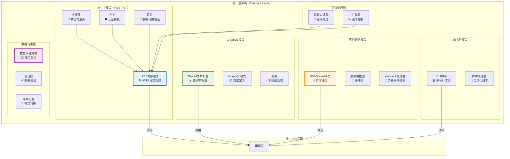
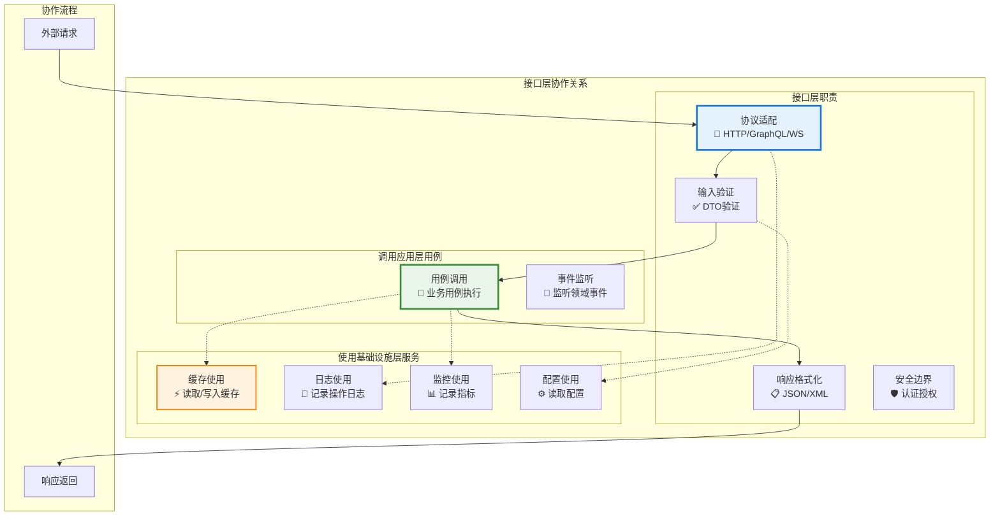

# 🌐 接口层设计原则详解

## 混合架构下的接口层组件职责与设计规范

### 📖 文档概述

本文档详细阐述了在混合架构（Clean Architecture + CQRS + ES + EDA）下，接口层各个组件的职责划分、设计原则和最佳实践。接口层作为系统的最外层，负责处理外部交互，遵循**"协议适配服务业务用例"**的核心原则，为用户提供友好、安全、高性能的接口服务。

**重要说明**: 本文档基于 `packages/hybrid-archi` 模块的实际实现，该模块作为通用功能组件，提供业务模块所需的基础接口层功能。注意：重构后的 `hybrid-archi` 模块已移除具体的Web框架实现，专注于提供通用的架构模式和基础组件。

---

## 🎯 第一部分：接口层组件职责矩阵

### 1.1 组件职责总览

| 组件 | 主要职责 | 次要职责 | 不应承担的职责 |
|------|---------|---------|---------------|
| **REST控制器** | HTTP请求处理、路由分发 | 输入验证、响应格式化 | 业务逻辑、数据持久化 |
| **GraphQL解析器** | GraphQL查询解析、数据获取 | 字段解析、类型转换 | 业务规则、数据存储 |
| **WebSocket网关** | 实时通信、连接管理 | 消息路由、状态同步 | 业务逻辑、数据处理 |
| **CLI命令处理器** | 命令行接口、脚本执行 | 参数解析、结果输出 | 业务逻辑、用户交互 |
| **DTO验证器** | 输入数据验证、格式检查 | 错误消息生成、类型转换 | 业务规则、数据存储 |
| **中间件** | 横切关注点、请求预处理 | 日志记录、性能监控 | 业务逻辑、响应生成 |
| **异常过滤器** | 异常捕获、错误响应 | 日志记录、监控告警 | 业务逻辑、异常恢复 |
| **守卫** | 认证授权、访问控制 | 权限检查、安全审计 | 业务逻辑、用户管理 |

### 1.2 接口层架构图



---

## 🌐 第二部分：REST API设计原则

### 2.1 REST控制器设计规范

#### 2.1.1 RESTful控制器实现

```typescript
/**
 * REST控制器设计原则示例
 */
@Controller('users')
@ApiTags('用户管理')
@UseGuards(JwtAuthGuard, TenantIsolationGuard)
@UseInterceptors(LoggingInterceptor, PerformanceInterceptor)
export class UserController {
  constructor(
    private readonly registerUserUseCase: RegisterUserUseCase,
    private readonly getUserProfileUseCase: GetUserProfileUseCase,
    private readonly updateUserProfileUseCase: UpdateUserProfileUseCase,
    private readonly deleteUserUseCase: DeleteUserUseCase,
    private readonly logger: ILoggerService
  ) {}

  // ========== REST：用户注册接口 ==========
  @Post()
  @ApiOperation({ 
    summary: '注册新用户',
    description: '在指定租户中注册新用户账户'
  })
  @ApiResponse({ 
    status: 201, 
    description: '用户注册成功',
    type: UserResponseDto 
  })
  @ApiResponse({ 
    status: 400, 
    description: '请求参数错误',
    type: ErrorResponseDto 
  })
  @ApiResponse({ 
    status: 409, 
    description: '用户已存在',
    type: ErrorResponseDto 
  })
  @UsePipes(new ValidationPipe({ transform: true, whitelist: true }))
  async createUser(
    @Body() createUserDto: CreateUserDto,
    @CurrentUser() currentUser: CurrentUserContext,
    @TenantContext() tenantContext: TenantContextInfo
  ): Promise<UserResponseDto> {
    this.logger.info('接收用户注册请求', {
      email: createUserDto.email,
      tenantId: tenantContext.tenantId,
      requestedBy: currentUser.userId
    });

    try {
      // 1. DTO转换为用例请求
      const useCaseRequest = new RegisterUserRequest(
        createUserDto.email,
        createUserDto.name,
        createUserDto.tenantId || tenantContext.tenantId,
        currentUser.userId,
        this.generateRequestId(),
        this.getCorrelationId()
      );

      // 2. 执行用例
      const useCaseResponse = await this.registerUserUseCase.execute(useCaseRequest);

      // 3. 转换为响应DTO
      const responseDto = UserResponseDto.fromUseCaseResponse(useCaseResponse);

      this.logger.info('用户注册成功', {
        userId: responseDto.id,
        email: responseDto.email
      });

      return responseDto;

    } catch (error) {
      this.logger.error('用户注册失败', {
        email: createUserDto.email,
        error: error instanceof Error ? error.message : String(error)
      });
      throw error; // 让异常过滤器处理
    }
  }

  // ========== REST：用户查询接口 ==========
  @Get(':id')
  @ApiOperation({ 
    summary: '获取用户资料',
    description: '根据用户ID获取用户详细资料'
  })
  @ApiParam({ 
    name: 'id', 
    description: '用户ID',
    type: 'string',
    format: 'uuid'
  })
  @ApiQuery({
    name: 'includeExtended',
    description: '是否包含扩展信息',
    required: false,
    type: 'boolean'
  })
  @UseInterceptors(CacheInterceptor)
  @CacheTTL(1800) // 30分钟缓存
  async getUserProfile(
    @Param('id', ParseUUIDPipe) userId: string,
    @Query('includeExtended', ParseBoolPipe) includeExtended: boolean = false,
    @CurrentUser() currentUser: CurrentUserContext
  ): Promise<UserResponseDto> {
    this.logger.info('接收获取用户资料请求', {
      userId,
      includeExtended,
      requestedBy: currentUser.userId
    });

    try {
      // 1. 创建用例请求
      const useCaseRequest = new GetUserProfileRequest(
        userId,
        includeExtended,
        currentUser.userId
      );

      // 2. 执行用例
      const useCaseResponse = await this.getUserProfileUseCase.execute(useCaseRequest);

      // 3. 转换为响应DTO
      const responseDto = UserResponseDto.fromUseCaseResponse(useCaseResponse);

      return responseDto;

    } catch (error) {
      this.logger.error('获取用户资料失败', {
        userId,
        error: error instanceof Error ? error.message : String(error)
      });
      throw error;
    }
  }

  // ========== REST：用户更新接口 ==========
  @Put(':id')
  @ApiOperation({ 
    summary: '更新用户资料',
    description: '更新指定用户的资料信息'
  })
  @RequirePermissions('user:update')
  async updateUserProfile(
    @Param('id', ParseUUIDPipe) userId: string,
    @Body() updateUserDto: UpdateUserDto,
    @CurrentUser() currentUser: CurrentUserContext
  ): Promise<UserResponseDto> {
    try {
      // 权限检查：用户只能更新自己的资料，或者有管理员权限
      if (userId !== currentUser.userId && !currentUser.hasPermission('user:admin')) {
        throw new ForbiddenException('无权限更新其他用户资料');
      }

      const useCaseRequest = new UpdateUserProfileRequest(
        userId,
        updateUserDto.name,
        updateUserDto.avatar,
        currentUser.userId
      );

      const useCaseResponse = await this.updateUserProfileUseCase.execute(useCaseRequest);
      
      return UserResponseDto.fromUseCaseResponse(useCaseResponse);

    } catch (error) {
      this.logger.error('更新用户资料失败', {
        userId,
        error: error instanceof Error ? error.message : String(error)
      });
      throw error;
    }
  }

  // ========== REST：用户删除接口 ==========
  @Delete(':id')
  @ApiOperation({ 
    summary: '删除用户',
    description: '软删除指定用户账户'
  })
  @RequirePermissions('user:delete')
  @HttpCode(204)
  async deleteUser(
    @Param('id', ParseUUIDPipe) userId: string,
    @CurrentUser() currentUser: CurrentUserContext
  ): Promise<void> {
    try {
      const useCaseRequest = new DeleteUserRequest(
        userId,
        currentUser.userId,
        '用户主动删除'
      );

      await this.deleteUserUseCase.execute(useCaseRequest);

      this.logger.info('用户删除成功', {
        userId,
        deletedBy: currentUser.userId
      });

    } catch (error) {
      this.logger.error('用户删除失败', {
        userId,
        error: error instanceof Error ? error.message : String(error)
      });
      throw error;
    }
  }
}
```

### 2.2 REST API设计原则

#### 2.2.1 RESTful设计规范

#### **原则1：资源导向设计**

```typescript
// ✅ 好的设计：资源导向的URL设计
@Controller('users')           // 用户资源
@Controller('users/:id/roles') // 用户角色子资源
@Controller('tenants')         // 租户资源
@Controller('organizations')   // 组织资源

// ❌ 不好的设计：动作导向的URL
@Controller('createUser')      // 违反REST原则
@Controller('getUserInfo')     // 违反REST原则
```

#### **原则2：HTTP方法语义化**

```typescript
// ✅ 正确的HTTP方法使用
@Post('users')           // 创建用户
@Get('users/:id')        // 获取用户
@Put('users/:id')        // 完整更新用户
@Patch('users/:id')      // 部分更新用户
@Delete('users/:id')     // 删除用户

// ❌ 错误的HTTP方法使用
@Get('users/create')     // 应该使用POST
@Post('users/get')       // 应该使用GET
```

#### **原则3：状态码规范化**

```typescript
// ✅ 正确的状态码使用
@HttpCode(201) // 创建成功
@HttpCode(200) // 操作成功
@HttpCode(204) // 删除成功，无内容返回
@HttpCode(304) // 资源未修改

// 异常状态码由异常过滤器统一处理
// 400: 请求参数错误
// 401: 未认证
// 403: 无权限
// 404: 资源不存在
// 409: 资源冲突
// 500: 服务器内部错误
```

---

## 📊 第三部分：GraphQL接口设计原则

### 3.1 GraphQL解析器设计

#### 3.1.1 查询解析器实现

```typescript
/**
 * GraphQL查询解析器设计原则
 */
@Resolver(() => UserType)
export class UserResolver {
  constructor(
    private readonly getUserProfileUseCase: GetUserProfileUseCase,
    private readonly getUserListUseCase: GetUserListUseCase,
    private readonly registerUserUseCase: RegisterUserUseCase,
    private readonly updateUserProfileUseCase: UpdateUserProfileUseCase,
    private readonly logger: ILoggerService
  ) {}

  // ========== GraphQL：单个用户查询 ==========
  @Query(() => UserType, { 
    description: '根据ID获取用户信息',
    nullable: true 
  })
  @UseGuards(GraphQLAuthGuard)
  @RequirePermissions('user:read')
  async user(
    @Args('id', { type: () => ID }) id: string,
    @Args('includeExtended', { 
      type: () => Boolean, 
      defaultValue: false,
      description: '是否包含扩展信息'
    }) includeExtended: boolean,
    @Context() context: GraphQLContext,
    @Info() info: GraphQLResolveInfo
  ): Promise<UserType | null> {
    this.logger.info('GraphQL用户查询', {
      userId: id,
      includeExtended,
      requestedBy: context.user.userId
    });

    try {
      // 1. 分析GraphQL查询字段
      const requestedFields = this.analyzeRequestedFields(info);
      
      // 2. 创建用例请求
      const useCaseRequest = new GetUserProfileRequest(
        id,
        includeExtended,
        context.user.userId,
        requestedFields
      );

      // 3. 执行用例
      const useCaseResponse = await this.getUserProfileUseCase.execute(useCaseRequest);

      // 4. 转换为GraphQL类型
      return UserType.fromUseCaseResponse(useCaseResponse);

    } catch (error) {
      this.logger.error('GraphQL用户查询失败', {
        userId: id,
        error: error instanceof Error ? error.message : String(error)
      });
      throw new GraphQLError('用户查询失败', {
        extensions: {
          code: 'USER_QUERY_FAILED',
          userId: id
        }
      });
    }
  }

  // ========== GraphQL：用户列表查询 ==========
  @Query(() => UserConnection, { 
    description: '获取用户列表（支持分页和过滤）'
  })
  @UseGuards(GraphQLAuthGuard)
  @RequirePermissions('user:list')
  async users(
    @Args() args: UsersQueryArgs,
    @Context() context: GraphQLContext,
    @Info() info: GraphQLResolveInfo
  ): Promise<UserConnection> {
    try {
      // GraphQL分页参数转换
      const pagination = this.convertGraphQLPagination(args);
      const filters = this.convertGraphQLFilters(args);

      const useCaseRequest = new GetUserListRequest(
        context.tenant.tenantId,
        filters,
        pagination,
        context.user.userId
      );

      const useCaseResponse = await this.getUserListUseCase.execute(useCaseRequest);

      // 转换为GraphQL连接类型
      return UserConnection.fromUseCaseResponse(useCaseResponse, args);

    } catch (error) {
      this.logger.error('GraphQL用户列表查询失败', {
        tenantId: context.tenant.tenantId,
        error: error instanceof Error ? error.message : String(error)
      });
      throw new GraphQLError('用户列表查询失败');
    }
  }

  // ========== GraphQL：用户创建变更 ==========
  @Mutation(() => UserType, { 
    description: '创建新用户'
  })
  @UseGuards(GraphQLAuthGuard)
  @RequirePermissions('user:create')
  async createUser(
    @Args('input') input: CreateUserInput,
    @Context() context: GraphQLContext
  ): Promise<UserType> {
    try {
      const useCaseRequest = new RegisterUserRequest(
        input.email,
        input.name,
        input.tenantId || context.tenant.tenantId,
        context.user.userId
      );

      const useCaseResponse = await this.registerUserUseCase.execute(useCaseRequest);
      
      return UserType.fromUseCaseResponse(useCaseResponse);

    } catch (error) {
      this.logger.error('GraphQL用户创建失败', {
        email: input.email,
        error: error instanceof Error ? error.message : String(error)
      });
      throw new GraphQLError('用户创建失败');
    }
  }

  // ========== GraphQL：字段解析器 ==========
  @ResolveField(() => [RoleType], { 
    description: '用户角色列表',
    nullable: true 
  })
  async roles(
    @Parent() user: UserType,
    @Context() context: GraphQLContext
  ): Promise<RoleType[]> {
    // 懒加载用户角色（GraphQL字段级加载）
    const useCaseRequest = new GetUserRolesRequest(
      user.id,
      context.user.userId
    );

    const useCaseResponse = await this.getUserRolesUseCase.execute(useCaseRequest);
    
    return useCaseResponse.roles.map(role => RoleType.fromDomain(role));
  }

  @ResolveField(() => UserStatisticsType, { 
    description: '用户统计信息',
    nullable: true 
  })
  @RequirePermissions('user:statistics')
  async statistics(
    @Parent() user: UserType,
    @Context() context: GraphQLContext
  ): Promise<UserStatisticsType | null> {
    // 需要特殊权限的字段
    if (!context.user.hasPermission('user:statistics')) {
      return null;
    }

    const useCaseRequest = new GetUserStatisticsRequest(
      user.id,
      context.user.userId
    );

    const useCaseResponse = await this.getUserStatisticsUseCase.execute(useCaseRequest);
    
    return UserStatisticsType.fromUseCaseResponse(useCaseResponse);
  }

  // ========== GraphQL：工具方法 ==========
  private analyzeRequestedFields(info: GraphQLResolveInfo): string[] {
    // 分析GraphQL查询中请求的字段
    const fieldNodes = info.fieldNodes[0];
    const selectionSet = fieldNodes.selectionSet;
    
    if (!selectionSet) return [];
    
    return selectionSet.selections
      .filter((selection): selection is FieldNode => selection.kind === 'Field')
      .map(field => field.name.value);
  }

  private convertGraphQLPagination(args: UsersQueryArgs): PaginationRequest {
    return new PaginationRequest(
      args.first || 20,
      args.after,
      args.last,
      args.before
    );
  }

  private convertGraphQLFilters(args: UsersQueryArgs): UserFilters {
    return new UserFilters(
      args.where?.status,
      args.where?.emailVerified,
      args.where?.search,
      args.where?.roles
    );
  }
}
```

### 3.2 GraphQL类型定义

#### 3.2.1 GraphQL模式设计

```typescript
/**
 * GraphQL类型定义
 */
@ObjectType('User', { 
  description: '用户信息类型'
})
export class UserType {
  @Field(() => ID, { description: '用户唯一标识符' })
  id: string;

  @Field(() => String, { description: '用户邮箱地址' })
  email: string;

  @Field(() => String, { description: '用户姓名' })
  name: string;

  @Field(() => UserStatus, { description: '用户状态' })
  status: UserStatus;

  @Field(() => Boolean, { description: '邮箱是否已验证' })
  emailVerified: boolean;

  @Field(() => String, { description: '用户头像字母' })
  initials: string;

  @Field(() => Date, { description: '创建时间' })
  createdAt: Date;

  @Field(() => Date, { description: '最后更新时间' })
  updatedAt: Date;

  // 关联字段（懒加载）
  @Field(() => [RoleType], { 
    description: '用户角色列表',
    nullable: true 
  })
  roles?: RoleType[];

  @Field(() => UserProfileType, { 
    description: '用户详细资料',
    nullable: true 
  })
  profile?: UserProfileType;

  @Field(() => UserStatisticsType, { 
    description: '用户统计信息',
    nullable: true 
  })
  statistics?: UserStatisticsType;

  // 工厂方法
  static fromUseCaseResponse(response: GetUserProfileResponse): UserType {
    const userType = new UserType();
    userType.id = response.userId;
    userType.email = response.email;
    userType.name = response.name;
    userType.status = response.status;
    userType.emailVerified = response.emailVerified;
    userType.initials = response.initials;
    userType.createdAt = response.createdAt;
    userType.updatedAt = response.updatedAt;
    return userType;
  }
}

/**
 * GraphQL输入类型
 */
@InputType('CreateUserInput', { 
  description: '创建用户输入参数'
})
export class CreateUserInput {
  @Field(() => String, { description: '用户邮箱地址' })
  @IsEmail({}, { message: '邮箱格式不正确' })
  @MaxLength(320, { message: '邮箱长度不能超过320个字符' })
  email: string;

  @Field(() => String, { description: '用户姓名' })
  @IsString({ message: '用户名必须是字符串' })
  @Length(2, 50, { message: '用户名长度必须在2-50个字符之间' })
  name: string;

  @Field(() => String, { 
    description: '租户ID',
    nullable: true 
  })
  @IsOptional()
  @IsUUID(4, { message: '租户ID必须是有效的UUID格式' })
  tenantId?: string;
}

/**
 * GraphQL连接类型（分页）
 */
@ObjectType('UserConnection', { 
  description: '用户列表连接类型'
})
export class UserConnection {
  @Field(() => [UserEdge], { description: '用户边缘列表' })
  edges: UserEdge[];

  @Field(() => PageInfo, { description: '分页信息' })
  pageInfo: PageInfo;

  @Field(() => Int, { description: '总数量' })
  totalCount: number;

  static fromUseCaseResponse(
    response: GetUserListResponse, 
    args: UsersQueryArgs
  ): UserConnection {
    const connection = new UserConnection();
    
    connection.edges = response.users.map((user, index) => 
      UserEdge.fromUser(user, this.generateCursor(user.id))
    );
    
    connection.pageInfo = new PageInfo(
      connection.edges.length > 0 ? connection.edges[0].cursor : null,
      connection.edges.length > 0 ? connection.edges[connection.edges.length - 1].cursor : null,
      response.hasNextPage,
      response.hasPreviousPage
    );
    
    connection.totalCount = response.totalCount;
    
    return connection;
  }
}
```

---

## ⚡ 第四部分：WebSocket实时通信设计原则

### 4.1 WebSocket网关设计

#### 4.1.1 实时通信网关实现

```typescript
/**
 * WebSocket网关设计原则
 */
@WebSocketGateway({
  port: 8001,
  namespace: 'users',
  cors: {
    origin: process.env.CORS_ORIGINS?.split(',') || ['http://localhost:3000'],
    credentials: true
  },
  transports: ['websocket', 'polling']
})
export class UserWebSocketGateway 
  implements OnGatewayInit, OnGatewayConnection, OnGatewayDisconnect {
  
  constructor(
    private readonly getUserProfileUseCase: GetUserProfileUseCase,
    private readonly updateUserStatusUseCase: UpdateUserStatusUseCase,
    private readonly jwtService: JwtService,
    private readonly logger: ILoggerService
  ) {}

  @WebSocketServer()
  server: Server;

  private connectedClients = new Map<string, ClientConnection>();

  // ========== WebSocket：连接生命周期管理 ==========
  
  afterInit(server: Server): void {
    this.logger.info('WebSocket服务器初始化完成', {
      namespace: 'users',
      port: 8001
    });
  }

  async handleConnection(client: Socket, ...args: any[]): Promise<void> {
    try {
      // 1. 验证WebSocket连接认证
      const token = client.handshake.auth.token || client.handshake.headers.authorization;
      if (!token) {
        client.disconnect(true);
        return;
      }

      // 2. 解析用户信息
      const userPayload = await this.jwtService.verifyAsync(token);
      const userId = userPayload.sub;

      // 3. 建立客户端连接记录
      const clientConnection = new ClientConnection(
        client.id,
        userId,
        userPayload.tenantId,
        new Date(),
        client.handshake.address
      );

      this.connectedClients.set(client.id, clientConnection);

      // 4. 加入用户专属房间
      await client.join(`user:${userId}`);
      await client.join(`tenant:${userPayload.tenantId}`);

      // 5. 发送连接确认
      client.emit('connected', {
        clientId: client.id,
        userId: userId,
        timestamp: new Date()
      });

      this.logger.info('WebSocket客户端连接成功', {
        clientId: client.id,
        userId: userId,
        tenantId: userPayload.tenantId
      });

    } catch (error) {
      this.logger.error('WebSocket连接认证失败', {
        clientId: client.id,
        error: error instanceof Error ? error.message : String(error)
      });
      client.disconnect(true);
    }
  }

  handleDisconnect(client: Socket): void {
    const connection = this.connectedClients.get(client.id);
    
    if (connection) {
      this.connectedClients.delete(client.id);
      
      this.logger.info('WebSocket客户端断开连接', {
        clientId: client.id,
        userId: connection.userId,
        duration: Date.now() - connection.connectedAt.getTime()
      });
    }
  }

  // ========== WebSocket：消息处理 ==========
  
  @SubscribeMessage('getUserProfile')
  @UseGuards(WebSocketAuthGuard)
  async handleGetUserProfile(
    @MessageBody() data: GetUserProfileMessage,
    @ConnectedSocket() client: Socket
  ): Promise<WsResponse<UserProfileData>> {
    const connection = this.connectedClients.get(client.id);
    if (!connection) {
      throw new WsException('连接未认证');
    }

    try {
      const useCaseRequest = new GetUserProfileRequest(
        data.userId,
        data.includeExtended || false,
        connection.userId
      );

      const useCaseResponse = await this.getUserProfileUseCase.execute(useCaseRequest);

      return {
        event: 'userProfile',
        data: UserProfileData.fromUseCaseResponse(useCaseResponse)
      };

    } catch (error) {
      this.logger.error('WebSocket用户资料查询失败', {
        userId: data.userId,
        clientId: client.id,
        error: error instanceof Error ? error.message : String(error)
      });
      
      throw new WsException('用户资料查询失败');
    }
  }

  @SubscribeMessage('updateUserStatus')
  @UseGuards(WebSocketAuthGuard)
  @RequirePermissions('user:update-status')
  async handleUpdateUserStatus(
    @MessageBody() data: UpdateUserStatusMessage,
    @ConnectedSocket() client: Socket
  ): Promise<void> {
    const connection = this.connectedClients.get(client.id);
    if (!connection) {
      throw new WsException('连接未认证');
    }

    try {
      const useCaseRequest = new UpdateUserStatusRequest(
        data.userId,
        data.status,
        connection.userId,
        data.reason
      );

      await this.updateUserStatusUseCase.execute(useCaseRequest);

      // 广播状态更新到相关客户端
      this.server.to(`user:${data.userId}`).emit('userStatusUpdated', {
        userId: data.userId,
        status: data.status,
        updatedBy: connection.userId,
        timestamp: new Date()
      });

      this.logger.info('用户状态更新成功', {
        userId: data.userId,
        status: data.status,
        updatedBy: connection.userId
      });

    } catch (error) {
      this.logger.error('WebSocket用户状态更新失败', {
        userId: data.userId,
        error: error instanceof Error ? error.message : String(error)
      });
      
      client.emit('error', {
        message: '用户状态更新失败',
        code: 'UPDATE_STATUS_FAILED'
      });
    }
  }

  // ========== WebSocket：事件广播 ==========
  
  @EventHandler(UserRegisteredEvent)
  async onUserRegistered(event: UserRegisteredEvent): Promise<void> {
    // 向租户内所有连接的客户端广播新用户注册事件
    this.server.to(`tenant:${event.tenantId}`).emit('userRegistered', {
      userId: event.userId,
      email: event.email,
      name: event.userName,
      timestamp: event.occurredOn
    });

    this.logger.info('广播用户注册事件', {
      userId: event.userId,
      tenantId: event.tenantId
    });
  }

  @EventHandler(UserProfileUpdatedEvent)
  async onUserProfileUpdated(event: UserProfileUpdatedEvent): Promise<void> {
    // 向特定用户的所有连接推送资料更新
    this.server.to(`user:${event.userId}`).emit('profileUpdated', {
      userId: event.userId,
      updatedFields: event.updatedFields,
      timestamp: event.occurredOn
    });
  }
}
```

---

## 💻 第五部分：CLI接口设计原则

### 5.1 命令行接口设计

#### 5.1.1 CLI命令处理器

```typescript
/**
 * CLI命令处理器设计原则
 */
@Injectable()
export class UserManagementCLI {
  constructor(
    private readonly registerUserUseCase: RegisterUserUseCase,
    private readonly getUserListUseCase: GetUserListUseCase,
    private readonly bulkImportUsersUseCase: BulkImportUsersUseCase,
    private readonly logger: ILoggerService
  ) {}

  // ========== CLI：用户注册命令 ==========
  @Command({
    name: 'user:create',
    description: '创建新用户账户',
    options: [
      { name: 'email', alias: 'e', description: '用户邮箱', required: true },
      { name: 'name', alias: 'n', description: '用户姓名', required: true },
      { name: 'tenant', alias: 't', description: '租户ID', required: true },
      { name: 'role', alias: 'r', description: '用户角色', defaultValue: 'user' },
      { name: 'send-email', description: '是否发送欢迎邮件', type: 'boolean', defaultValue: true }
    ]
  })
  async createUser(options: CreateUserCLIOptions): Promise<void> {
    this.logger.info('CLI创建用户命令执行', {
      email: options.email,
      tenantId: options.tenant
    });

    try {
      // 1. 验证CLI参数
      this.validateCreateUserOptions(options);

      // 2. 创建用例请求
      const useCaseRequest = new RegisterUserRequest(
        options.email,
        options.name,
        options.tenant,
        'cli-admin', // CLI操作标识
        generateUUID(),
        generateUUID(),
        {
          source: 'cli',
          sendWelcomeEmail: options.sendEmail,
          initialRole: options.role
        }
      );

      // 3. 执行用例
      const useCaseResponse = await this.registerUserUseCase.execute(useCaseRequest);

      // 4. 输出结果
      console.log('✅ 用户创建成功');
      console.log(`   用户ID: ${useCaseResponse.userId}`);
      console.log(`   邮箱: ${useCaseResponse.email}`);
      console.log(`   姓名: ${useCaseResponse.name}`);
      console.log(`   状态: ${useCaseResponse.status}`);
      console.log(`   创建时间: ${useCaseResponse.createdAt.toISOString()}`);

    } catch (error) {
      this.logger.error('CLI用户创建失败', {
        email: options.email,
        error: error instanceof Error ? error.message : String(error)
      });
      
      console.error('❌ 用户创建失败');
      console.error(`   错误信息: ${error instanceof Error ? error.message : String(error)}`);
      process.exit(1);
    }
  }

  // ========== CLI：用户列表命令 ==========
  @Command({
    name: 'user:list',
    description: '列出用户',
    options: [
      { name: 'tenant', alias: 't', description: '租户ID', required: true },
      { name: 'status', alias: 's', description: '用户状态过滤' },
      { name: 'limit', alias: 'l', description: '限制数量', type: 'number', defaultValue: 10 },
      { name: 'format', alias: 'f', description: '输出格式', choices: ['table', 'json', 'csv'], defaultValue: 'table' }
    ]
  })
  async listUsers(options: ListUsersCLIOptions): Promise<void> {
    try {
      const useCaseRequest = new GetUserListRequest(
        options.tenant,
        new UserFilters(options.status),
        new PaginationRequest(options.limit, undefined),
        'cli-admin'
      );

      const useCaseResponse = await this.getUserListUseCase.execute(useCaseRequest);

      // 根据格式输出结果
      switch (options.format) {
        case 'table':
          this.outputUsersAsTable(useCaseResponse.users);
          break;
        case 'json':
          console.log(JSON.stringify(useCaseResponse.users, null, 2));
          break;
        case 'csv':
          this.outputUsersAsCSV(useCaseResponse.users);
          break;
      }

      console.log(`\n📊 总计: ${useCaseResponse.totalCount} 个用户`);

    } catch (error) {
      console.error('❌ 用户列表获取失败');
      console.error(`   错误信息: ${error instanceof Error ? error.message : String(error)}`);
      process.exit(1);
    }
  }

  // ========== CLI：批量导入命令 ==========
  @Command({
    name: 'user:import',
    description: '从CSV文件批量导入用户',
    options: [
      { name: 'file', alias: 'f', description: 'CSV文件路径', required: true },
      { name: 'tenant', alias: 't', description: '目标租户ID', required: true },
      { name: 'dry-run', description: '试运行模式，不实际创建用户', type: 'boolean', defaultValue: false },
      { name: 'batch-size', description: '批次大小', type: 'number', defaultValue: 100 }
    ]
  })
  async importUsers(options: ImportUsersCLIOptions): Promise<void> {
    console.log('🚀 开始批量导入用户');
    console.log(`   文件: ${options.file}`);
    console.log(`   租户: ${options.tenant}`);
    console.log(`   试运行: ${options.dryRun ? '是' : '否'}`);

    try {
      // 1. 读取和解析CSV文件
      const csvData = await this.readCSVFile(options.file);
      const userRecords = await this.parseUserRecords(csvData);

      console.log(`📄 解析到 ${userRecords.length} 条用户记录`);

      if (options.dryRun) {
        console.log('🔍 试运行模式，显示前5条记录:');
        userRecords.slice(0, 5).forEach((record, index) => {
          console.log(`   ${index + 1}. ${record.email} - ${record.name}`);
        });
        return;
      }

      // 2. 执行批量导入
      const useCaseRequest = new BulkImportUsersRequest(
        userRecords,
        options.tenant,
        'cli-admin',
        options.batchSize
      );

      const useCaseResponse = await this.bulkImportUsersUseCase.execute(useCaseRequest);

      // 3. 输出导入结果
      console.log('✅ 批量导入完成');
      console.log(`   成功: ${useCaseResponse.successCount} 个用户`);
      console.log(`   失败: ${useCaseResponse.failureCount} 个用户`);
      
      if (useCaseResponse.failures.length > 0) {
        console.log('\n❌ 失败记录:');
        useCaseResponse.failures.forEach(failure => {
          console.log(`   ${failure.email}: ${failure.reason}`);
        });
      }

    } catch (error) {
      console.error('❌ 批量导入失败');
      console.error(`   错误信息: ${error instanceof Error ? error.message : String(error)}`);
      process.exit(1);
    }
  }

  // ========== CLI：工具方法 ==========
  private validateCreateUserOptions(options: CreateUserCLIOptions): void {
    if (!options.email || !options.name || !options.tenant) {
      throw new Error('邮箱、姓名和租户ID都是必需的参数');
    }

    if (!this.isValidEmail(options.email)) {
      throw new Error('邮箱格式不正确');
    }

    if (!this.isValidUUID(options.tenant)) {
      throw new Error('租户ID格式不正确');
    }
  }

  private outputUsersAsTable(users: UserListItem[]): void {
    const table = new Table({
      head: ['ID', '邮箱', '姓名', '状态', '邮箱验证', '创建时间'],
      colWidths: [38, 30, 20, 12, 12, 20]
    });

    users.forEach(user => {
      table.push([
        user.id,
        user.email,
        user.name,
        user.status,
        user.emailVerified ? '✅' : '❌',
        user.createdAt.toLocaleDateString()
      ]);
    });

    console.log(table.toString());
  }

  private outputUsersAsCSV(users: UserListItem[]): void {
    console.log('ID,邮箱,姓名,状态,邮箱验证,创建时间');
    users.forEach(user => {
      console.log([
        user.id,
        user.email,
        user.name,
        user.status,
        user.emailVerified,
        user.createdAt.toISOString()
      ].join(','));
    });
  }
}
```

---

## 🔧 第六部分：数据传输对象（DTO）设计原则

### 6.1 接口层DTO设计规范

#### 6.1.1 输入DTO设计

```typescript
/**
 * 接口层输入DTO设计原则
 */

// ✅ REST API输入DTO
export class CreateUserDto {
  @ApiProperty({ 
    description: '用户邮箱地址',
    example: 'user@example.com',
    format: 'email'
  })
  @IsEmail({}, { message: '邮箱格式不正确' })
  @IsNotEmpty({ message: '邮箱不能为空' })
  @MaxLength(320, { message: '邮箱长度不能超过320个字符' })
  @Transform(({ value }) => value?.toLowerCase().trim())
  email: string;

  @ApiProperty({ 
    description: '用户姓名',
    example: '张三',
    minLength: 2,
    maxLength: 50
  })
  @IsString({ message: '用户名必须是字符串' })
  @IsNotEmpty({ message: '用户名不能为空' })
  @Length(2, 50, { message: '用户名长度必须在2-50个字符之间' })
  @Transform(({ value }) => value?.trim())
  name: string;

  @ApiProperty({ 
    description: '租户ID',
    example: 'tenant-uuid-here',
    required: false,
    format: 'uuid'
  })
  @IsOptional()
  @IsUUID(4, { message: '租户ID必须是有效的UUID格式' })
  tenantId?: string;

  @ApiProperty({ 
    description: '用户初始角色',
    example: 'user',
    enum: ['admin', 'user', 'guest'],
    required: false
  })
  @IsOptional()
  @IsEnum(['admin', 'user', 'guest'], { message: '角色必须是有效值' })
  initialRole?: string;

  // DTO转换方法
  toUseCaseRequest(context: RequestContext): RegisterUserRequest {
    return new RegisterUserRequest(
      this.email,
      this.name,
      this.tenantId || context.tenantId,
      context.userId,
      context.requestId,
      context.correlationId,
      {
        source: 'api',
        initialRole: this.initialRole,
        clientInfo: context.clientInfo
      }
    );
  }

  // DTO验证方法
  validate(): ValidationResult {
    const errors: string[] = [];

    if (!this.email) {
      errors.push('邮箱不能为空');
    }

    if (!this.name) {
      errors.push('用户名不能为空');
    }

    if (this.tenantId && !this.isValidUUID(this.tenantId)) {
      errors.push('租户ID格式不正确');
    }

    return new ValidationResult(errors.length === 0, errors);
  }

  private isValidUUID(uuid: string): boolean {
    const uuidRegex = /^[0-9a-f]{8}-[0-9a-f]{4}-[1-5][0-9a-f]{3}-[89ab][0-9a-f]{3}-[0-9a-f]{12}$/i;
    return uuidRegex.test(uuid);
  }
}

// ✅ 查询参数DTO
export class UserQueryDto {
  @ApiProperty({ 
    description: '搜索关键词',
    required: false,
    example: '张三'
  })
  @IsOptional()
  @IsString()
  @MaxLength(100, { message: '搜索关键词不能超过100个字符' })
  @Transform(({ value }) => value?.trim())
  search?: string;

  @ApiProperty({ 
    description: '用户状态过滤',
    required: false,
    enum: UserStatus
  })
  @IsOptional()
  @IsEnum(UserStatus, { message: '用户状态必须是有效值' })
  status?: UserStatus;

  @ApiProperty({ 
    description: '是否只查询已验证邮箱用户',
    required: false,
    type: 'boolean'
  })
  @IsOptional()
  @IsBoolean({ message: '邮箱验证过滤必须是布尔值' })
  @Transform(({ value }) => value === 'true' || value === true)
  emailVerifiedOnly?: boolean;

  @ApiProperty({ 
    description: '页码',
    minimum: 1,
    default: 1,
    example: 1
  })
  @IsOptional()
  @IsNumber({}, { message: '页码必须是数字' })
  @Min(1, { message: '页码必须大于0' })
  @Transform(({ value }) => parseInt(value) || 1)
  page: number = 1;

  @ApiProperty({ 
    description: '每页数量',
    minimum: 1,
    maximum: 100,
    default: 20,
    example: 20
  })
  @IsOptional()
  @IsNumber({}, { message: '每页数量必须是数字' })
  @Min(1, { message: '每页数量必须大于0' })
  @Max(100, { message: '每页数量不能超过100' })
  @Transform(({ value }) => parseInt(value) || 20)
  pageSize: number = 20;

  // 查询条件转换
  toUseCaseRequest(tenantId: string, userId: string): GetUserListRequest {
    return new GetUserListRequest(
      tenantId,
      new UserFilters(
        this.search,
        this.status,
        this.emailVerifiedOnly
      ),
      new PaginationRequest(
        this.pageSize,
        (this.page - 1) * this.pageSize
      ),
      userId
    );
  }
}
```

#### 6.1.2 输出DTO设计

```typescript
/**
 * 接口层输出DTO设计原则
 */

// ✅ 用户响应DTO
export class UserResponseDto {
  @ApiProperty({ description: '用户唯一标识符' })
  id: string;

  @ApiProperty({ description: '用户邮箱地址（脱敏处理）' })
  email: string;

  @ApiProperty({ description: '用户姓名' })
  name: string;

  @ApiProperty({ description: '用户状态', enum: UserStatus })
  status: UserStatus;

  @ApiProperty({ description: '邮箱是否已验证' })
  emailVerified: boolean;

  @ApiProperty({ description: '用户头像字母' })
  initials: string;

  @ApiProperty({ description: '最后登录时间', required: false })
  lastLoginAt?: Date;

  @ApiProperty({ description: '创建时间' })
  createdAt: Date;

  @ApiProperty({ description: '更新时间' })
  updatedAt: Date;

  // 计算属性（接口层特有）
  @ApiProperty({ description: '用户活跃状态' })
  get isActive(): boolean {
    return this.status === UserStatus.ACTIVE;
  }

  @ApiProperty({ description: '账户完整度百分比' })
  get completeness(): number {
    let score = 0;
    if (this.emailVerified) score += 30;
    if (this.name && this.name.length > 0) score += 20;
    if (this.lastLoginAt) score += 25;
    // 其他完整度计算...
    return Math.min(score + 25, 100); // 基础分25分
  }

  // 工厂方法：从用例响应创建
  static fromUseCaseResponse(response: GetUserProfileResponse): UserResponseDto {
    const dto = new UserResponseDto();
    dto.id = response.userId;
    dto.email = response.email; // 假设已在用例层脱敏
    dto.name = response.name;
    dto.status = response.status;
    dto.emailVerified = response.emailVerified;
    dto.initials = response.initials;
    dto.lastLoginAt = response.lastLoginAt;
    dto.createdAt = response.createdAt;
    dto.updatedAt = response.updatedAt;
    return dto;
  }

  // 安全方法：确保敏感信息不泄露
  sanitize(): UserResponseDto {
    // 接口层的额外安全处理
    if (this.email && this.email.includes('@')) {
      const [localPart, domain] = this.email.split('@');
      if (localPart.length > 3) {
        this.email = `${localPart.substring(0, 3)}***@${domain}`;
      }
    }
    return this;
  }
}

// ✅ 分页响应DTO
export class PagedUserResponseDto {
  @ApiProperty({ description: '用户列表', type: [UserResponseDto] })
  data: UserResponseDto[];

  @ApiProperty({ description: '分页元数据' })
  meta: PaginationMetaDto;

  @ApiProperty({ description: '响应链接' })
  links: PaginationLinksDto;

  constructor(
    users: UserResponseDto[],
    totalCount: number,
    page: number,
    pageSize: number,
    baseUrl: string
  ) {
    this.data = users;
    this.meta = new PaginationMetaDto(totalCount, page, pageSize);
    this.links = new PaginationLinksDto(baseUrl, page, pageSize, totalCount);
  }

  static fromUseCaseResponse(
    response: GetUserListResponse,
    page: number,
    pageSize: number,
    baseUrl: string
  ): PagedUserResponseDto {
    const userDtos = response.users.map(user => 
      UserResponseDto.fromUseCaseResponse(user)
    );
    
    return new PagedUserResponseDto(
      userDtos,
      response.totalCount,
      page,
      pageSize,
      baseUrl
    );
  }
}

// ✅ 错误响应DTO
export class ErrorResponseDto {
  @ApiProperty({ description: '错误代码' })
  code: string;

  @ApiProperty({ description: '错误消息' })
  message: string;

  @ApiProperty({ description: '详细错误信息', required: false })
  details?: Record<string, unknown>;

  @ApiProperty({ description: '请求追踪ID' })
  traceId: string;

  @ApiProperty({ description: '错误发生时间' })
  timestamp: Date;

  @ApiProperty({ description: '请求路径' })
  path: string;

  constructor(
    code: string,
    message: string,
    traceId: string,
    path: string,
    details?: Record<string, unknown>
  ) {
    this.code = code;
    this.message = message;
    this.details = details;
    this.traceId = traceId;
    this.timestamp = new Date();
    this.path = path;
  }

  static fromError(
    error: Error,
    context: ExecutionContext,
    traceId: string
  ): ErrorResponseDto {
    const request = context.switchToHttp().getRequest();
    
    if (error instanceof BusinessError) {
      return new ErrorResponseDto(
        'BUSINESS_ERROR',
        error.message,
        traceId,
        request.url,
        { businessCode: error.code }
      );
    }

    if (error instanceof ValidationError) {
      return new ErrorResponseDto(
        'VALIDATION_ERROR',
        '请求参数验证失败',
        traceId,
        request.url,
        { validationErrors: error.errors }
      );
    }

    // 默认错误处理
    return new ErrorResponseDto(
      'INTERNAL_ERROR',
      '系统内部错误',
      traceId,
      request.url
    );
  }
}
```

---

## 🛡️ 第七部分：中间件和守卫设计原则

### 7.1 认证授权中间件

#### 7.1.1 JWT认证守卫

```typescript
/**
 * JWT认证守卫设计原则
 */
@Injectable()
export class JwtAuthGuard implements CanActivate {
  constructor(
    private readonly jwtService: JwtService,
    private readonly userService: IUserService,
    private readonly logger: ILoggerService
  ) {}

  // ========== 认证守卫：JWT验证 ==========
  async canActivate(context: ExecutionContext): Promise<boolean> {
    const request = context.switchToHttp().getRequest();
    const traceId = request.headers['x-trace-id'] || generateUUID();

    try {
      // 1. 提取JWT令牌
      const token = this.extractTokenFromHeader(request);
      if (!token) {
        throw new UnauthorizedException('缺少认证令牌');
      }

      // 2. 验证JWT令牌
      const payload = await this.jwtService.verifyAsync(token);
      
      // 3. 验证用户状态
      const user = await this.userService.findById(payload.sub);
      if (!user || !user.isActive()) {
        throw new UnauthorizedException('用户账户无效或已禁用');
      }

      // 4. 设置请求上下文
      request.user = new CurrentUserContext(
        user.getId().getValue(),
        user.getEmail().getValue(),
        user.getName().getValue(),
        user.getTenantId(),
        user.getRoles().map(role => role.getName()),
        user.getPermissions().map(perm => perm.getName())
      );

      request.traceId = traceId;

      this.logger.debug('JWT认证成功', {
        userId: user.getId().getValue(),
        traceId
      });

      return true;

    } catch (error) {
      this.logger.warn('JWT认证失败', {
        traceId,
        error: error instanceof Error ? error.message : String(error),
        userAgent: request.headers['user-agent'],
        ip: request.ip
      });

      throw new UnauthorizedException('认证失败');
    }
  }

  private extractTokenFromHeader(request: any): string | null {
    const authHeader = request.headers.authorization;
    
    if (!authHeader) {
      return null;
    }

    const [type, token] = authHeader.split(' ');
    
    return type === 'Bearer' ? token : null;
  }
}
```

#### 7.1.2 权限控制守卫

```typescript
/**
 * 权限控制守卫设计原则
 */
@Injectable()
export class PermissionGuard implements CanActivate {
  constructor(
    private readonly reflector: Reflector,
    private readonly permissionService: IPermissionService,
    private readonly logger: ILoggerService
  ) {}

  // ========== 权限守卫：权限验证 ==========
  async canActivate(context: ExecutionContext): Promise<boolean> {
    const request = context.switchToHttp().getRequest();
    const user = request.user as CurrentUserContext;

    if (!user) {
      throw new UnauthorizedException('用户未认证');
    }

    // 1. 获取所需权限
    const requiredPermissions = this.reflector.getAllAndOverride<string[]>(
      PERMISSIONS_KEY,
      [context.getHandler(), context.getClass()]
    );

    if (!requiredPermissions || requiredPermissions.length === 0) {
      return true; // 无权限要求
    }

    try {
      // 2. 检查用户权限
      const hasPermission = await this.permissionService.hasAnyPermission(
        user.userId,
        requiredPermissions,
        user.tenantId
      );

      if (!hasPermission) {
        this.logger.warn('权限检查失败', {
          userId: user.userId,
          requiredPermissions,
          userPermissions: user.permissions,
          traceId: request.traceId
        });

        throw new ForbiddenException('权限不足');
      }

      this.logger.debug('权限检查通过', {
        userId: user.userId,
        requiredPermissions,
        traceId: request.traceId
      });

      return true;

    } catch (error) {
      this.logger.error('权限检查异常', {
        userId: user.userId,
        requiredPermissions,
        error: error instanceof Error ? error.message : String(error),
        traceId: request.traceId
      });

      throw error;
    }
  }
}

/**
 * 租户隔离守卫
 */
@Injectable()
export class TenantIsolationGuard implements CanActivate {
  constructor(
    private readonly tenantService: ITenantService,
    private readonly logger: ILoggerService
  ) {}

  // ========== 租户守卫：数据隔离 ==========
  async canActivate(context: ExecutionContext): Promise<boolean> {
    const request = context.switchToHttp().getRequest();
    const user = request.user as CurrentUserContext;

    if (!user) {
      throw new UnauthorizedException('用户未认证');
    }

    try {
      // 1. 获取请求中的租户信息
      const requestTenantId = this.extractTenantId(request);
      
      // 2. 验证用户是否属于该租户
      if (requestTenantId && requestTenantId !== user.tenantId) {
        // 检查用户是否有跨租户权限
        const hasCrossTenantAccess = await this.tenantService.hasCrossTenantAccess(
          user.userId,
          requestTenantId
        );

        if (!hasCrossTenantAccess) {
          throw new ForbiddenException('无权限访问其他租户数据');
        }
      }

      // 3. 设置租户上下文
      const tenantContext = new TenantContextInfo(
        requestTenantId || user.tenantId,
        user.tenantId === requestTenantId ? 'owner' : 'guest'
      );

      request.tenantContext = tenantContext;
      
      // 4. 设置租户上下文管理器
      TenantContextManager.setCurrentTenant(tenantContext);

      this.logger.debug('租户隔离检查通过', {
        userId: user.userId,
        userTenantId: user.tenantId,
        requestTenantId: requestTenantId,
        traceId: request.traceId
      });

      return true;

    } catch (error) {
      this.logger.error('租户隔离检查失败', {
        userId: user.userId,
        error: error instanceof Error ? error.message : String(error),
        traceId: request.traceId
      });

      throw error;
    }
  }

  private extractTenantId(request: any): string | null {
    // 从多个位置提取租户ID
    return request.params?.tenantId || 
           request.query?.tenantId || 
           request.body?.tenantId ||
           request.headers['x-tenant-id'] ||
           null;
  }
}
```

---

## 🔍 第八部分：数据验证和转换设计原则

### 8.1 数据验证管道

#### 8.1.1 自定义验证管道

```typescript
/**
 * 自定义验证管道设计原则
 */
@Injectable()
export class CustomValidationPipe implements PipeTransform {
  constructor(
    private readonly logger: ILoggerService
  ) {}

  // ========== 验证管道：数据转换和验证 ==========
  async transform(value: any, metadata: ArgumentMetadata): Promise<any> {
    const { type, metatype, data } = metadata;

    // 跳过基础类型
    if (!metatype || this.isBasicType(metatype)) {
      return value;
    }

    try {
      // 1. 类型转换
      const transformedValue = this.transformValue(value, metatype);
      
      // 2. 数据验证
      const validationResult = await this.validateValue(transformedValue, metatype);
      
      if (!validationResult.isValid) {
        throw new ValidationException(
          '数据验证失败',
          validationResult.errors
        );
      }

      // 3. 安全清理
      const sanitizedValue = this.sanitizeValue(validationResult.value);

      this.logger.debug('数据验证通过', {
        type,
        metatype: metatype.name,
        field: data
      });

      return sanitizedValue;

    } catch (error) {
      this.logger.error('数据验证失败', {
        type,
        metatype: metatype?.name,
        field: data,
        value: this.safeStringify(value),
        error: error instanceof Error ? error.message : String(error)
      });

      if (error instanceof ValidationException) {
        throw new BadRequestException({
          message: '请求参数验证失败',
          errors: error.errors,
          field: data
        });
      }

      throw new BadRequestException('请求参数格式错误');
    }
  }

  // ========== 验证管道：类型转换 ==========
  private transformValue(value: any, metatype: any): any {
    // 字符串转换
    if (typeof value === 'string') {
      value = value.trim();
    }

    // 数字转换
    if (metatype === Number && typeof value === 'string') {
      const num = Number(value);
      if (!isNaN(num)) {
        return num;
      }
    }

    // 布尔转换
    if (metatype === Boolean && typeof value === 'string') {
      return value.toLowerCase() === 'true';
    }

    // 日期转换
    if (metatype === Date && typeof value === 'string') {
      const date = new Date(value);
      if (!isNaN(date.getTime())) {
        return date;
      }
    }

    return value;
  }

  // ========== 验证管道：数据清理 ==========
  private sanitizeValue(value: any): any {
    if (typeof value === 'string') {
      // XSS防护
      value = value
        .replace(/<script\b[^<]*(?:(?!<\/script>)<[^<]*)*<\/script>/gi, '')
        .replace(/<[^>]*>/g, '');
      
      // SQL注入防护
      value = value
        .replace(/'/g, "''")
        .replace(/;/g, '');
    }

    if (typeof value === 'object' && value !== null) {
      // 递归清理对象属性
      const sanitized = {};
      for (const [key, val] of Object.entries(value)) {
        sanitized[key] = this.sanitizeValue(val);
      }
      return sanitized;
    }

    return value;
  }

  private isBasicType(metatype: any): boolean {
    const basicTypes = [String, Boolean, Number, Array, Object];
    return basicTypes.includes(metatype);
  }

  private safeStringify(value: any): string {
    try {
      return JSON.stringify(value);
    } catch {
      return String(value);
    }
  }
}
```

---

## 🚨 第九部分：异常处理设计原则

### 9.1 全局异常过滤器

#### 9.1.1 统一异常处理

```typescript
/**
 * 全局异常过滤器设计原则
 */
@Catch()
export class GlobalExceptionFilter implements ExceptionFilter {
  constructor(
    private readonly logger: ILoggerService,
    private readonly metricsService: IMetricsService
  ) {}

  // ========== 异常过滤器：统一异常处理 ==========
  catch(exception: unknown, host: ArgumentsHost): void {
    const ctx = host.switchToHttp();
    const request = ctx.getRequest();
    const response = ctx.getResponse();
    const traceId = request.traceId || generateUUID();

    // 1. 异常分类和处理
    const errorResponse = this.handleException(exception, request, traceId);
    
    // 2. 记录异常日志
    this.logException(exception, request, traceId, errorResponse.code);
    
    // 3. 记录异常指标
    this.recordExceptionMetrics(exception, request, errorResponse.code);
    
    // 4. 返回错误响应
    response.status(errorResponse.statusCode).json(errorResponse.body);
  }

  // ========== 异常过滤器：异常分类处理 ==========
  private handleException(
    exception: unknown,
    request: any,
    traceId: string
  ): { statusCode: number; body: ErrorResponseDto; code: string } {
    
    // 业务异常
    if (exception instanceof BusinessError) {
      return {
        statusCode: 400,
        code: 'BUSINESS_ERROR',
        body: new ErrorResponseDto(
          'BUSINESS_ERROR',
          exception.message,
          traceId,
          request.url,
          { businessCode: exception.code }
        )
      };
    }

    // 验证异常
    if (exception instanceof ValidationError) {
      return {
        statusCode: 400,
        code: 'VALIDATION_ERROR',
        body: new ErrorResponseDto(
          'VALIDATION_ERROR',
          '请求参数验证失败',
          traceId,
          request.url,
          { validationErrors: exception.errors }
        )
      };
    }

    // 认证异常
    if (exception instanceof UnauthorizedException) {
      return {
        statusCode: 401,
        code: 'UNAUTHORIZED',
        body: new ErrorResponseDto(
          'UNAUTHORIZED',
          '认证失败，请重新登录',
          traceId,
          request.url
        )
      };
    }

    // 权限异常
    if (exception instanceof ForbiddenException) {
      return {
        statusCode: 403,
        code: 'FORBIDDEN',
        body: new ErrorResponseDto(
          'FORBIDDEN',
          '权限不足，无法执行此操作',
          traceId,
          request.url
        )
      };
    }

    // 资源不存在异常
    if (exception instanceof NotFoundException) {
      return {
        statusCode: 404,
        code: 'NOT_FOUND',
        body: new ErrorResponseDto(
          'NOT_FOUND',
          '请求的资源不存在',
          traceId,
          request.url
        )
      };
    }

    // 冲突异常
    if (exception instanceof ConflictException) {
      return {
        statusCode: 409,
        code: 'CONFLICT',
        body: new ErrorResponseDto(
          'CONFLICT',
          '资源冲突，请检查数据状态',
          traceId,
          request.url
        )
      };
    }

    // HTTP异常
    if (exception instanceof HttpException) {
      return {
        statusCode: exception.getStatus(),
        code: 'HTTP_ERROR',
        body: new ErrorResponseDto(
          'HTTP_ERROR',
          exception.message,
          traceId,
          request.url,
          { httpStatus: exception.getStatus() }
        )
      };
    }

    // 系统异常
    return {
      statusCode: 500,
      code: 'INTERNAL_ERROR',
      body: new ErrorResponseDto(
        'INTERNAL_ERROR',
        '系统内部错误，请稍后重试',
        traceId,
        request.url
      )
    };
  }

  // ========== 异常过滤器：异常日志记录 ==========
  private logException(
    exception: unknown,
    request: any,
    traceId: string,
    errorCode: string
  ): void {
    const logData = {
      traceId,
      errorCode,
      method: request.method,
      url: request.url,
      userAgent: request.headers['user-agent'],
      ip: request.ip,
      userId: request.user?.userId,
      tenantId: request.tenantContext?.tenantId
    };

    if (exception instanceof Error) {
      this.logger.error('接口异常', {
        ...logData,
        message: exception.message,
        stack: exception.stack
      });
    } else {
      this.logger.error('未知异常', {
        ...logData,
        exception: String(exception)
      });
    }
  }

  // ========== 异常过滤器：指标记录 ==========
  private recordExceptionMetrics(
    exception: unknown,
    request: any,
    errorCode: string
  ): void {
    this.metricsService.incrementCounter('api_errors_total', {
      method: request.method,
      endpoint: request.route?.path || request.url,
      error_code: errorCode,
      status_code: this.getStatusCode(exception).toString()
    });
  }

  private getStatusCode(exception: unknown): number {
    if (exception instanceof HttpException) {
      return exception.getStatus();
    }
    return 500;
  }
}
```

---

## 📡 第十部分：实时通信设计原则

### 10.1 服务端推送（SSE）

#### 10.1.1 事件流处理器

```typescript
/**
 * 服务端推送设计原则
 */
@Controller('events')
export class EventStreamController {
  constructor(
    private readonly eventStreamService: EventStreamService,
    private readonly logger: ILoggerService
  ) {}

  // ========== SSE：用户事件流 ==========
  @Get('users/:userId/stream')
  @UseGuards(JwtAuthGuard, PermissionGuard)
  @RequirePermissions('user:events')
  @Sse()
  async getUserEventStream(
    @Param('userId') userId: string,
    @CurrentUser() currentUser: CurrentUserContext,
    @Query('types') eventTypes?: string
  ): Promise<Observable<MessageEvent>> {
    this.logger.info('建立用户事件流连接', {
      userId,
      requestedBy: currentUser.userId,
      eventTypes
    });

    // 权限检查：用户只能订阅自己的事件流
    if (userId !== currentUser.userId && !currentUser.hasPermission('user:admin')) {
      throw new ForbiddenException('无权限订阅其他用户的事件流');
    }

    try {
      // 创建事件流
      const eventStream = this.eventStreamService.createUserEventStream(
        userId,
        eventTypes?.split(',') || [],
        currentUser.userId
      );

      return eventStream.pipe(
        map(event => ({
          id: event.id,
          type: event.type,
          data: JSON.stringify(event.data),
          retry: 3000
        } as MessageEvent)),
        
        catchError(error => {
          this.logger.error('事件流处理异常', {
            userId,
            error: error instanceof Error ? error.message : String(error)
          });
          
          return of({
            id: generateUUID(),
            type: 'error',
            data: JSON.stringify({ 
              message: '事件流处理异常',
              code: 'STREAM_ERROR'
            })
          } as MessageEvent);
        })
      );

    } catch (error) {
      this.logger.error('事件流创建失败', {
        userId,
        error: error instanceof Error ? error.message : String(error)
      });
      throw new InternalServerErrorException('事件流创建失败');
    }
  }

  // ========== SSE：租户事件流 ==========
  @Get('tenants/:tenantId/stream')
  @UseGuards(JwtAuthGuard, TenantIsolationGuard)
  @RequirePermissions('tenant:events')
  @Sse()
  async getTenantEventStream(
    @Param('tenantId') tenantId: string,
    @CurrentUser() currentUser: CurrentUserContext,
    @Query('categories') categories?: string
  ): Promise<Observable<MessageEvent>> {
    this.logger.info('建立租户事件流连接', {
      tenantId,
      requestedBy: currentUser.userId,
      categories
    });

    try {
      const eventStream = this.eventStreamService.createTenantEventStream(
        tenantId,
        categories?.split(',') || [],
        currentUser.userId
      );

      return eventStream.pipe(
        map(event => ({
          id: event.id,
          type: event.type,
          data: JSON.stringify(event.data),
          retry: 5000
        } as MessageEvent)),
        
        // 添加心跳机制
        startWith({
          id: generateUUID(),
          type: 'heartbeat',
          data: JSON.stringify({ 
            message: '连接建立成功',
            timestamp: new Date()
          })
        } as MessageEvent)
      );

    } catch (error) {
      this.logger.error('租户事件流创建失败', {
        tenantId,
        error: error instanceof Error ? error.message : String(error)
      });
      throw new InternalServerErrorException('事件流创建失败');
    }
  }
}
```

---

## 🔄 第十一部分：与其他层的协作边界

### 11.1 接口层的职责边界

#### 11.1.1 接口层主导的职责

**✅ 接口层应该承担的职责**：

```typescript
/**
 * 接口层主导职责清单
 */
export class InterfaceLayerResponsibilities {
  // ========== 协议适配和转换 ==========
  async adaptProtocols(): Promise<void> {
    // ✅ HTTP请求/响应处理
    // ✅ GraphQL查询解析和响应构建
    // ✅ WebSocket连接管理和消息路由
    // ✅ CLI命令解析和结果输出
  }

  // ========== 输入验证和数据转换 ==========
  async validateAndTransformInput(): Promise<void> {
    // ✅ DTO验证和格式检查
    // ✅ 请求参数类型转换
    // ✅ 输入数据清理和安全过滤
    // ✅ 协议特定的数据格式转换
  }

  // ========== 用户交互和体验 ==========
  async manageUserInteraction(): Promise<void> {
    // ✅ 用户认证状态管理
    // ✅ 会话和连接生命周期管理
    // ✅ 实时通信和事件推送
    // ✅ 用户友好的错误消息生成
  }

  // ========== 响应格式化和序列化 ==========
  async formatResponses(): Promise<void> {
    // ✅ 响应数据格式化（JSON、XML等）
    // ✅ 分页和元数据构建
    // ✅ 错误响应标准化
    // ✅ 协议特定的响应头设置
  }

  // ========== 安全边界控制 ==========
  async enforceSecurityBoundary(): Promise<void> {
    // ✅ 请求认证和授权检查
    // ✅ 输入数据安全验证
    // ✅ 跨域资源共享（CORS）控制
    // ✅ 速率限制和防护机制
  }
}
```

#### 11.1.2 接口层不应承担的职责

**❌ 接口层不应该承担的职责**：

```typescript
/**
 * 接口层不应承担的职责（应由其他层负责）
 */
export class InterfaceLayerProhibitions {
  // ❌ 不应承担：业务逻辑处理
  async processBusinessLogic(): Promise<void> {
    // 应由领域层和应用层处理
    throw new Error('接口层不应处理业务逻辑');
  }

  // ❌ 不应承担：数据持久化操作
  async persistData(): Promise<void> {
    // 应由基础设施层处理
    throw new Error('接口层不应直接操作数据库');
  }

  // ❌ 不应承担：外部服务调用
  async callExternalServices(): Promise<void> {
    // 应由基础设施层处理
    throw new Error('接口层不应直接调用外部API');
  }

  // ❌ 不应承担：复杂的业务规则验证
  async validateComplexBusinessRules(): Promise<void> {
    // 应由领域层处理
    throw new Error('接口层不应验证复杂业务规则');
  }

  // ❌ 不应承担：缓存策略实现
  async implementCacheStrategy(): Promise<void> {
    // 应由基础设施层处理
    throw new Error('接口层不应实现缓存策略');
  }
}
```

### 11.2 与基础设施层的协作关系

#### 11.2.1 正确使用基础设施层服务

```typescript
/**
 * 接口层正确使用基础设施层服务的完整示例
 */
@Controller('users')
@UseGuards(JwtAuthGuard, TenantIsolationGuard)
@UseInterceptors(LoggingInterceptor, PerformanceInterceptor)
export class UserController {
  constructor(
    // ✅ 正确：注入基础设施层提供的服务
    private readonly cacheManager: ICacheManager,
    private readonly logger: ILoggerService,
    private readonly metricsService: IMetricsService,
    private readonly configService: IConfigService,
    // ✅ 正确：注入应用层用例
    private readonly registerUserUseCase: RegisterUserUseCase,
    private readonly getUserProfileUseCase: GetUserProfileUseCase
  ) {}

  @Post()
  async createUser(@Body() createUserDto: CreateUserDto): Promise<UserResponseDto> {
    // ✅ 正确：使用基础设施层的日志服务
    this.logger.info('接收用户注册请求', {
      email: createUserDto.email
    });

    try {
      // ✅ 正确：协议适配 - DTO转换为用例请求
      const useCaseRequest = createUserDto.toUseCaseRequest(this.getRequestContext());

      // ✅ 正确：调用应用层用例
      const useCaseResponse = await this.registerUserUseCase.execute(useCaseRequest);

      // ✅ 正确：协议适配 - 用例响应转换为DTO
      const responseDto = UserResponseDto.fromUseCaseResponse(useCaseResponse);

      // ✅ 正确：使用基础设施层的缓存服务
      const cacheKey = `user:profile:${responseDto.id}`;
      await this.cacheManager.set(cacheKey, responseDto, 1800);

      // ✅ 正确：使用基础设施层的监控服务
      this.metricsService.incrementCounter('user_created_total', {
        method: 'api',
        status: 'success'
      });

      return responseDto;

    } catch (error) {
      // ✅ 正确：使用基础设施层的日志和监控服务
      this.logger.error('用户注册失败', {
        email: createUserDto.email,
        error: error instanceof Error ? error.message : String(error)
      });

      this.metricsService.incrementCounter('user_created_total', {
        method: 'api',
        status: 'error'
      });

      throw error; // 让全局异常过滤器处理
    }
  }

  // ❌ 错误示例：接口层不应直接调用外部服务
  /*
  async sendWelcomeEmail(userId: string): Promise<void> {
    // ❌ 错误：直接调用外部邮件服务
    const emailResponse = await fetch('https://api.sendgrid.com/v3/mail/send', {
      method: 'POST',
      headers: { 'Authorization': 'Bearer ' + process.env.SENDGRID_API_KEY },
      body: JSON.stringify(emailData)
    });
  }
  */

  // ✅ 正确示例：通过应用层调用外部服务
  @Post(':id/send-welcome-email')
  async sendWelcomeEmail(@Param('id') userId: string): Promise<void> {
    // ✅ 正确：调用应用层用例，由应用层协调基础设施层服务
    await this.sendWelcomeEmailUseCase.execute(
      new SendWelcomeEmailRequest(userId)
    );
  }
}
```

#### 11.2.2 避免的错误使用方式

```typescript
/**
 * 接口层错误使用基础设施层的反面示例
 */
@Controller('users')
export class BadUserController {
  constructor(
    // ❌ 错误：直接依赖数据库仓储
    private readonly userRepository: IUserRepository,
    // ❌ 错误：直接依赖外部服务适配器
    private readonly emailService: IEmailService,
    // ❌ 错误：直接依赖消息队列
    private readonly messageQueue: IMessageQueue
  ) {}

  @Post()
  async createUser(@Body() createUserDto: CreateUserDto): Promise<UserResponseDto> {
    // ❌ 错误：在接口层实现业务逻辑
    if (createUserDto.email.endsWith('@competitor.com')) {
      throw new BadRequestException('不允许竞争对手邮箱');
    }

    // ❌ 错误：直接操作数据库
    const existingUser = await this.userRepository.findByEmail(createUserDto.email);
    if (existingUser) {
      throw new ConflictException('用户已存在');
    }

    // ❌ 错误：在接口层创建领域对象
    const user = new UserAggregate(
      UserId.generate(),
      new Email(createUserDto.email),
      new UserName(createUserDto.name)
    );

    // ❌ 错误：直接保存到数据库
    await this.userRepository.save(user);

    // ❌ 错误：直接调用外部服务
    await this.emailService.sendWelcomeEmail(user.getEmail().getValue());

    // ❌ 错误：直接发送消息
    await this.messageQueue.publish('user.created', {
      userId: user.getId().getValue(),
      email: user.getEmail().getValue()
    });

    return UserResponseDto.fromDomain(user);
  }
}
```

### 11.3 与应用层的协作关系

#### 11.3.1 标准的用例调用模式

```typescript
/**
 * 接口层与应用层协作的标准模式
 */
@Controller('users')
export class UserController {
  constructor(
    // ✅ 正确：依赖应用层用例
    private readonly registerUserUseCase: RegisterUserUseCase,
    private readonly getUserProfileUseCase: GetUserProfileUseCase,
    private readonly updateUserProfileUseCase: UpdateUserProfileUseCase,
    private readonly deleteUserUseCase: DeleteUserUseCase
  ) {}

  // ========== 标准CRUD操作模式 ==========
  
  @Post()
  async create(@Body() dto: CreateUserDto): Promise<UserResponseDto> {
    // 1. 协议适配：DTO → 用例请求
    const request = dto.toUseCaseRequest(this.getRequestContext());
    
    // 2. 用例执行
    const response = await this.registerUserUseCase.execute(request);
    
    // 3. 协议适配：用例响应 → DTO
    return UserResponseDto.fromUseCaseResponse(response);
  }

  @Get(':id')
  async findOne(@Param('id') id: string): Promise<UserResponseDto> {
    const request = new GetUserProfileRequest(id, false, this.getCurrentUserId());
    const response = await this.getUserProfileUseCase.execute(request);
    return UserResponseDto.fromUseCaseResponse(response);
  }

  @Put(':id')
  async update(
    @Param('id') id: string,
    @Body() dto: UpdateUserDto
  ): Promise<UserResponseDto> {
    const request = dto.toUseCaseRequest(id, this.getRequestContext());
    const response = await this.updateUserProfileUseCase.execute(request);
    return UserResponseDto.fromUseCaseResponse(response);
  }

  @Delete(':id')
  @HttpCode(204)
  async remove(@Param('id') id: string): Promise<void> {
    const request = new DeleteUserRequest(id, this.getCurrentUserId());
    await this.deleteUserUseCase.execute(request);
  }
}
```

### 11.4 WebSocket与事件驱动架构的协作

#### 11.4.1 正确的事件处理模式

```typescript
/**
 * WebSocket网关与事件驱动架构的正确协作
 */
@WebSocketGateway()
export class UserWebSocketGateway {
  constructor(
    // ✅ 正确：依赖应用层用例
    private readonly getUserProfileUseCase: GetUserProfileUseCase,
    // ✅ 正确：使用基础设施层服务
    private readonly logger: ILoggerService
  ) {}

  // ========== WebSocket：用例调用模式 ==========
  @SubscribeMessage('getUserProfile')
  async handleGetUserProfile(
    @MessageBody() data: GetUserProfileMessage,
    @ConnectedSocket() client: Socket
  ): Promise<WsResponse<UserProfileData>> {
    // ✅ 正确：通过用例获取数据
    const request = new GetUserProfileRequest(data.userId, false, this.getClientUserId(client));
    const response = await this.getUserProfileUseCase.execute(request);
    
    return {
      event: 'userProfile',
      data: UserProfileData.fromUseCaseResponse(response)
    };
  }

  // ========== 事件监听：接收来自应用层的事件 ==========
  @EventHandler(UserRegisteredEvent)
  async onUserRegistered(event: UserRegisteredEvent): Promise<void> {
    // ✅ 正确：接口层只负责事件广播，不处理业务逻辑
    this.server.to(`tenant:${event.tenantId}`).emit('userRegistered', {
      userId: event.userId,
      email: event.email,
      name: event.userName,
      timestamp: event.occurredOn
    });

    this.logger.info('广播用户注册事件', {
      userId: event.userId,
      tenantId: event.tenantId
    });
  }

  // ❌ 错误：不应在接口层处理复杂的业务事件逻辑
  /*
  @EventHandler(UserRegisteredEvent)
  async onUserRegisteredBad(event: UserRegisteredEvent): Promise<void> {
    // ❌ 错误：业务逻辑应在应用层处理
    if (event.email.endsWith('@vip.com')) {
      await this.upgradeToVipUser(event.userId);
    }
    
    // ❌ 错误：直接调用外部服务
    await this.emailService.sendWelcomeEmail(event.email);
  }
  */
}
```

### 11.5 协作边界总结

#### 11.5.1 清晰的协作关系图



#### 11.5.2 协作原则

1. **单一职责**：接口层专注于协议适配，不处理业务逻辑
2. **依赖方向**：接口层依赖应用层用例，使用基础设施层服务
3. **协议无关**：业务逻辑与具体协议解耦，支持多协议访问
4. **边界清晰**：明确区分协议处理、业务处理和技术服务
5. **事件驱动**：通过事件监听实现松耦合的实时通信

---

## 🎯 总结

### 接口层设计的核心价值

1. **协议适配服务业务用例**：接口层适配各种协议为业务用例提供服务
2. **用户体验优化**：提供友好、一致、高性能的接口体验
3. **安全边界控制**：实现认证、授权、数据验证等安全控制
4. **多协议支持**：REST、GraphQL、WebSocket、CLI等多种接口协议

### 设计原则的实践指导

1. **协议无关性**：接口层实现可以独立替换，不影响业务逻辑
2. **安全优先**：认证、授权、数据验证、安全审计等安全措施
3. **性能优化**：缓存、连接管理、批量处理等性能优化
4. **用户友好**：清晰的错误信息、完整的API文档、一致的接口设计

### 多协议接口的关键收益

1. **用户选择**：用户可以选择最适合的接口协议
2. **场景优化**：不同协议适用于不同的使用场景
3. **渐进迁移**：支持从旧协议到新协议的渐进迁移
4. **生态集成**：支持各种客户端和集成场景

### 常见设计陷阱

1. **职责边界混乱**：接口层承担业务逻辑、数据持久化或外部服务调用
2. **层次依赖错误**：接口层直接依赖基础设施层的具体实现而不是抽象接口
3. **协议耦合严重**：业务逻辑与特定协议（HTTP/WebSocket等）紧密耦合
4. **绕过应用层**：接口层直接调用领域层或基础设施层，跳过用例编排
5. **重复实现服务**：接口层重复实现缓存、日志、监控等基础设施功能
6. **事件处理越界**：在WebSocket事件处理中实现复杂业务逻辑
7. **安全边界不清**：认证、授权逻辑分散在多个层次而不是集中在接口层
8. **DTO职责混乱**：DTO包含业务逻辑或直接操作数据库

---

**文档版本**: v1.0.0  
**最后更新**: 2024年12月19日  
**适用版本**: AIOFIX AI SAAS Platform v1.x  
**文档状态**: ✅ 完成

---

*本文档为接口层开发提供详细的设计原则和最佳实践指导，建议与应用层设计原则文档、基础设施层设计原则文档和领域层设计原则文档结合学习。*
