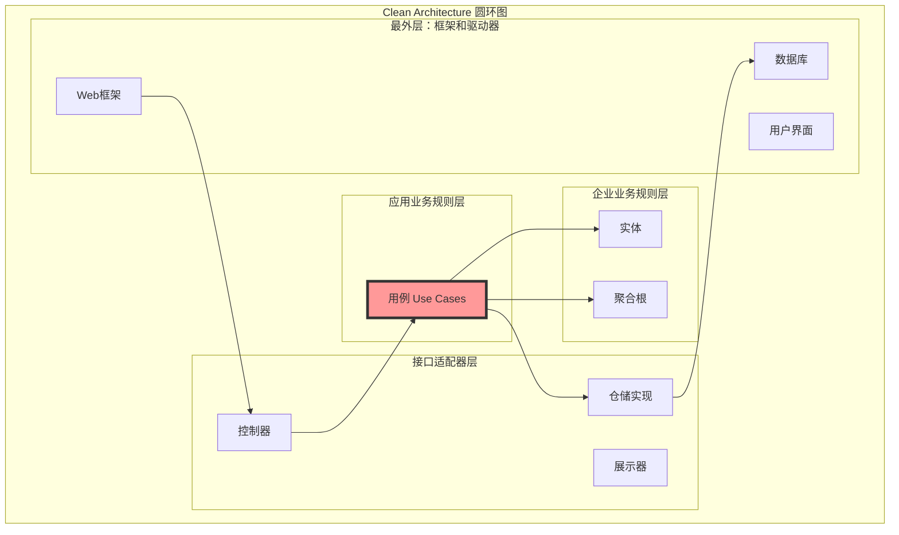
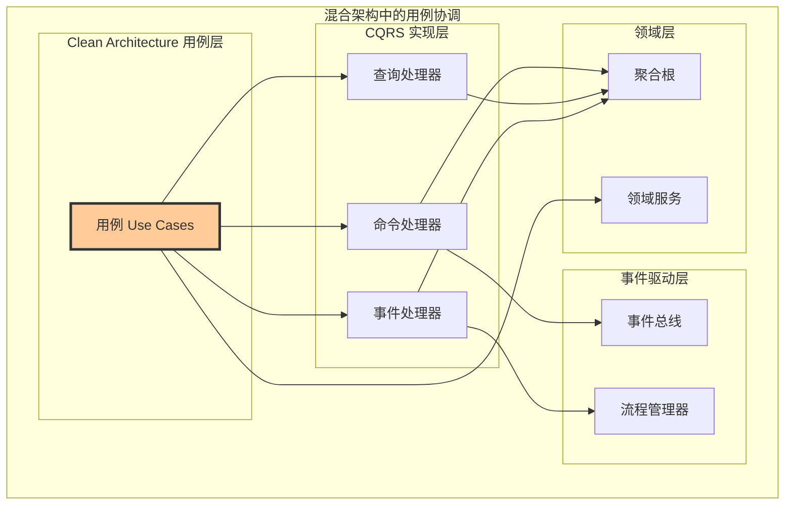

# 🎯 用例（Use Case）设计原则详解

## Clean Architecture 核心：用例在混合架构中的地位

### 📖 文档概述

本文档专门阐述用例（Use Case）在Clean Architecture中的核心地位，以及在我们的混合架构（Clean Architecture + CQRS + 事件驱动）中如何正确设计和实现用例。用例是应用层的灵魂，体现了系统的业务意图。

**重要说明**: 本文档基于 `packages/hybrid-archi` 模块的实际实现，该模块作为通用功能组件，提供业务模块所需的基础用例功能。

---

## 🏛️ 第一部分：用例在混合架构中的定位

### 1.1 Clean Architecture中的用例地位



**用例的核心价值**：

- **业务意图的体现**：每个用例代表一个具体的业务功能
- **依赖倒置的实现**：用例定义接口，外层实现接口
- **测试的边界**：用例是业务功能测试的天然边界
- **变更的隔离**：业务规则变更时，用例提供稳定的接口

### 1.2 混合架构中的用例协调



**混合架构的协调原则**：

- 用例是业务功能的入口点
- 命令处理器实现用例的写操作部分
- 查询处理器实现用例的读操作部分
- 事件处理器实现用例的副作用部分

---

## 🎯 第二部分：用例设计的核心原则

### 2.1 用例的职责边界

#### **用例应该做什么**

```typescript
/**
 * 正确的用例设计示例
 */
export class RegisterUserUseCase implements IUseCase<RegisterUserRequest, RegisterUserResponse> {
  constructor(
    private readonly userRepository: IUserRepository,
    private readonly tenantRepository: ITenantRepository,
    private readonly userRegistrationService: UserRegistrationDomainService,
    private readonly permissionService: IPermissionService,
    private readonly eventBus: IEventBus,
    private readonly transactionManager: ITransactionManager,
    private readonly logger: ILoggerService
  ) {}

  // ✅ 用例实现：完整的业务流程
  async execute(request: RegisterUserRequest): Promise<RegisterUserResponse> {
    this.logger.info('执行用户注册用例', {
      email: request.email,
      tenantId: request.tenantId
    });

    // 步骤1：权限验证（用例层职责）
    await this.validateUseCasePermissions(request);
    
    // 步骤2：业务前置条件验证
    await this.validateBusinessPreconditions(request);
    
    // 步骤3：执行核心业务逻辑
    const result = await this.executeInTransaction(request);
    
    // 步骤4：后置处理
    await this.executePostProcessing(result);
    
    return result;
  }

  // ✅ 权限验证：用例级别的安全控制
  private async validateUseCasePermissions(request: RegisterUserRequest): Promise<void> {
    // 检查操作者权限
    if (request.createdBy) {
      const hasPermission = await this.permissionService.hasPermission(
        request.createdBy,
        'user:register',
        request.tenantId
      );
      
      if (!hasPermission) {
        throw new UnauthorizedUseCaseException(
          '用户注册',
          request.createdBy,
          request.tenantId
        );
      }
    }

    // 检查租户上下文
    const tenantContext = TenantContextManager.getCurrentTenant();
    if (tenantContext?.tenantId !== request.tenantId) {
      throw new TenantContextMismatchException(
        '用例执行的租户上下文不匹配'
      );
    }
  }

  // ✅ 业务编排：协调多个领域对象
  private async executeInTransaction(request: RegisterUserRequest): Promise<RegisterUserResponse> {
    return await this.transactionManager.execute(async () => {
      // 加载租户聚合
      const tenantAggregate = await this.tenantRepository.findById(request.tenantId);
      
      // 使用领域服务验证跨聚合规则
      const validationResult = await this.userRegistrationService.validateUserRegistration(
        { email: new Email(request.email), name: new UserName(request.name) },
        tenantAggregate,
        (email) => this.userRepository.existsByEmail(email)
      );

      if (!validationResult.isValid) {
        throw new BusinessPreconditionViolationException(validationResult.errors);
      }

      // 创建用户聚合（委托给领域层）
      const userAggregate = UserAggregate.create(
        UserId.generate(),
        new Email(request.email),
        new UserName(request.name),
        request.tenantId,
        request.createdBy
      );

      // 保存聚合
      await this.userRepository.save(userAggregate);

      // 发布领域事件
      await this.publishDomainEvents(userAggregate);

      // 返回用例结果
      return new RegisterUserResponse(
        userAggregate.getId().getValue(),
        userAggregate.getEmail().getValue(),
        userAggregate.getName().getValue(),
        userAggregate.getStatus(),
        userAggregate.getUser().getCreatedAt()
      );
    });
  }

  // ✅ 事件发布：用例控制事件发布时机
  private async publishDomainEvents(aggregate: UserAggregate): Promise<void> {
    const events = aggregate.getUncommittedEvents();
    
    for (const event of events) {
      // 设置用例级别的事件上下文
      event.setUseCaseContext({
        useCaseName: 'RegisterUser',
        requestId: this.getCurrentRequestId(),
        executedBy: this.getCurrentUserId(),
        executedAt: new Date()
      });
      
      await this.eventBus.publish(event);
    }
    
    aggregate.markEventsAsCommitted();
  }
}
```

#### **用例不应该做什么**

```typescript
/**
 * 错误的用例设计示例
 */

// ❌ 错误：用例包含具体的业务规则
class BadRegisterUserUseCase {
  async execute(request: RegisterUserRequest): Promise<RegisterUserResponse> {
    // 错误：在用例中实现具体的业务规则
    if (request.email.length > 320) {
      throw new Error('邮箱长度不能超过320个字符');
    }
    
    // 错误：在用例中直接操作数据
    const userData = {
      id: generateId(),
      email: request.email,
      status: 'pending'
    };
    
    await this.database.insert('users', userData);
  }
}

// ❌ 错误：用例依赖具体的技术实现
class BadUserQueryUseCase {
  constructor(
    private readonly mongoClient: MongoClient, // 直接依赖技术实现
    private readonly redisClient: RedisClient   // 直接依赖技术实现
  ) {}
}
```

### 2.2 用例与CQRS的集成模式

#### **模式1：用例直接实现（简单场景）**

```typescript
/**
 * 简单用例：直接实现模式
 */
export class ActivateUserUseCase implements IUseCase<ActivateUserRequest, ActivateUserResponse> {
  constructor(
    private readonly userRepository: IUserRepository,
    private readonly eventBus: IEventBus,
    private readonly logger: ILoggerService
  ) {}

  async execute(request: ActivateUserRequest): Promise<ActivateUserResponse> {
    // 用例直接实现简单的业务流程
    const userAggregate = await this.userRepository.findById(
      UserId.fromString(request.userId)
    );

    if (!userAggregate) {
      throw new UserNotFoundException(request.userId);
    }

    // 执行激活
    userAggregate.activate(request.activatedBy);

    // 保存和发布事件
    await this.userRepository.save(userAggregate);
    await this.publishEvents(userAggregate);

    return new ActivateUserResponse(
      userAggregate.getId().getValue(),
      '用户激活成功'
    );
  }
}
```

#### **模式2：用例委托给处理器（复杂场景）**

```typescript
/**
 * 复杂用例：委托给CQRS处理器模式
 */
export class UserOnboardingUseCase implements IUseCase<UserOnboardingRequest, UserOnboardingResponse> {
  constructor(
    private readonly commandBus: ICommandBus,
    private readonly queryBus: IQueryBus,
    private readonly logger: ILoggerService
  ) {}

  async execute(request: UserOnboardingRequest): Promise<UserOnboardingResponse> {
    this.logger.info('开始用户入职用例', { email: request.email });

    try {
      // 用例编排多个命令和查询
      const onboardingSteps = await this.executeOnboardingFlow(request);
      
      return new UserOnboardingResponse(
        onboardingSteps.userId,
        '用户入职完成',
        onboardingSteps.completedSteps
      );
      
    } catch (error) {
      await this.handleOnboardingFailure(request, error);
      throw error;
    }
  }

  private async executeOnboardingFlow(request: UserOnboardingRequest): Promise<OnboardingSteps> {
    const steps: string[] = [];
    
    // 步骤1：注册用户（使用命令处理器）
    const registerCommand = new RegisterUserCommand(
      request.email,
      request.name,
      request.tenantId,
      request.createdBy
    );
    const registerResult = await this.commandBus.execute(registerCommand);
    steps.push('user-registered');
    
    // 步骤2：验证注册结果（使用查询处理器）
    const userQuery = new GetUserProfileQuery(registerResult.userId);
    const userProfile = await this.queryBus.execute(userQuery);
    
    if (!userProfile) {
      throw new UseCaseExecutionException('用户注册后查询失败');
    }
    steps.push('registration-verified');
    
    // 步骤3：分配角色（使用命令处理器）
    const assignRoleCommand = new AssignUserRoleCommand(
      registerResult.userId,
      request.defaultRoleId
    );
    await this.commandBus.execute(assignRoleCommand);
    steps.push('role-assigned');
    
    return new OnboardingSteps(registerResult.userId, steps);
  }
}
```

---

## 🔄 第三部分：用例的分类和设计模式

### 3.1 用例的分类

#### **简单用例（Single-Aggregate Use Case）**

```typescript
/**
 * 简单用例：只涉及单个聚合的操作
 */
export class UpdateUserEmailUseCase implements IUseCase<UpdateUserEmailRequest, UpdateUserEmailResponse> {
  constructor(
    private readonly userRepository: IUserRepository,
    private readonly emailValidationService: IEmailValidationService,
    private readonly eventBus: IEventBus
  ) {}

  async execute(request: UpdateUserEmailRequest): Promise<UpdateUserEmailResponse> {
    // 1. 加载聚合
    const userAggregate = await this.userRepository.findById(
      UserId.fromString(request.userId)
    );

    if (!userAggregate) {
      throw new UserNotFoundException(request.userId);
    }

    // 2. 验证新邮箱
    await this.emailValidationService.validateEmail(request.newEmail);

    // 3. 执行业务逻辑（委托给聚合根）
    userAggregate.updateEmail(
      new Email(request.newEmail),
      request.updatedBy
    );

    // 4. 保存和发布事件
    await this.userRepository.save(userAggregate);
    await this.publishEvents(userAggregate);

    return new UpdateUserEmailResponse(
      userAggregate.getId().getValue(),
      userAggregate.getEmail().getValue(),
      '邮箱更新成功'
    );
  }
}
```

#### **复杂用例（Multi-Aggregate Use Case）**

```typescript
/**
 * 复杂用例：涉及多个聚合的协调操作
 */
export class TransferUserBetweenTenantsUseCase implements IUseCase<TransferUserRequest, TransferUserResponse> {
  constructor(
    private readonly userRepository: IUserRepository,
    private readonly tenantRepository: ITenantRepository,
    private readonly userTransferService: UserTransferDomainService,
    private readonly commandBus: ICommandBus,
    private readonly transactionManager: ITransactionManager,
    private readonly logger: ILoggerService
  ) {}

  async execute(request: TransferUserRequest): Promise<TransferUserResponse> {
    this.logger.info('开始用户租户转移用例', {
      userId: request.userId,
      fromTenantId: request.fromTenantId,
      toTenantId: request.toTenantId
    });

    return await this.transactionManager.execute(async () => {
      // 1. 加载相关聚合
      const { userAggregate, fromTenant, toTenant } = await this.loadAggregates(request);
      
      // 2. 验证转移条件（使用领域服务）
      await this.validateTransferConditions(userAggregate, fromTenant, toTenant);
      
      // 3. 执行转移流程
      const transferSteps = await this.executeTransferFlow(
        userAggregate, 
        fromTenant, 
        toTenant, 
        request
      );
      
      // 4. 清理和同步
      await this.executeTransferCleanup(userAggregate, fromTenant, request);
      
      return new TransferUserResponse(
        userAggregate.getId().getValue(),
        request.toTenantId,
        '用户转移完成',
        transferSteps
      );
    });
  }

  private async loadAggregates(request: TransferUserRequest): Promise<{
    userAggregate: UserAggregate;
    fromTenant: TenantAggregate;
    toTenant: TenantAggregate;
  }> {
    const [userAggregate, fromTenant, toTenant] = await Promise.all([
      this.userRepository.findById(UserId.fromString(request.userId)),
      this.tenantRepository.findById(request.fromTenantId),
      this.tenantRepository.findById(request.toTenantId)
    ]);

    if (!userAggregate) {
      throw new UserNotFoundException(request.userId);
    }
    if (!fromTenant) {
      throw new TenantNotFoundException(request.fromTenantId);
    }
    if (!toTenant) {
      throw new TenantNotFoundException(request.toTenantId);
    }

    return { userAggregate, fromTenant, toTenant };
  }

  private async validateTransferConditions(
    userAggregate: UserAggregate,
    fromTenant: TenantAggregate,
    toTenant: TenantAggregate
  ): Promise<void> {
    // 使用领域服务验证转移条件
    const canTransfer = await this.userTransferService.canTransferUser(
      userAggregate,
      fromTenant,
      toTenant
    );

    if (!canTransfer.isAllowed) {
      throw new UserTransferNotAllowedException(
        userAggregate.getId().getValue(),
        canTransfer.reasons
      );
    }
  }
}
```

#### **查询用例（Query Use Case）**

```typescript
/**
 * 查询用例设计示例
 */
export class GetUserDashboardUseCase implements IUseCase<GetUserDashboardRequest, GetUserDashboardResponse> {
  constructor(
    private readonly userRepository: IUserRepository,
    private readonly userReadRepository: IUserReadRepository,
    private readonly permissionService: IPermissionService,
    private readonly cacheManager: ICacheManager,
    private readonly logger: ILoggerService
  ) {}

  async execute(request: GetUserDashboardRequest): Promise<GetUserDashboardResponse> {
    this.logger.info('执行获取用户仪表板用例', {
      userId: request.userId,
      requestedBy: request.requestedBy
    });

    // 1. 权限验证
    await this.validateDashboardAccess(request);
    
    // 2. 数据获取（多数据源策略）
    const dashboardData = await this.getDashboardData(request);
    
    // 3. 数据组装
    const response = await this.assembleDashboardResponse(dashboardData, request);
    
    return response;
  }

  private async getDashboardData(request: GetUserDashboardRequest): Promise<DashboardData> {
    // 并行获取多个数据源
    const [userProfile, userStats, recentActivity, notifications] = await Promise.all([
      this.getUserProfile(request.userId),
      this.getUserStatistics(request.userId),
      this.getRecentActivity(request.userId),
      this.getUnreadNotifications(request.userId)
    ]);

    return new DashboardData(userProfile, userStats, recentActivity, notifications);
  }

  private async getUserProfile(userId: string): Promise<UserProfileData> {
    // 优先从读模型获取
    try {
      const readModel = await this.userReadRepository.findUserProfile(userId);
      if (readModel) {
        return this.convertFromReadModel(readModel);
      }
    } catch (error) {
      this.logger.warn('读模型查询失败，使用聚合根查询', { userId, error });
    }

    // 降级到聚合根查询
    const userAggregate = await this.userRepository.findById(UserId.fromString(userId));
    if (!userAggregate) {
      throw new UserNotFoundException(userId);
    }

    return this.convertFromAggregate(userAggregate);
  }
}
```

### 3.2 用例的生命周期管理

#### **用例执行的标准流程**

```typescript
/**
 * 用例执行的标准模板
 */
export abstract class BaseUseCase<TRequest, TResponse> implements IUseCase<TRequest, TResponse> {
  protected abstract logger: ILoggerService;
  protected abstract performanceMonitor: IPerformanceMonitor;

  async execute(request: TRequest): Promise<TResponse> {
    const useCaseName = this.constructor.name;
    const startTime = Date.now();
    
    try {
      // 1. 前置处理
      await this.preExecute(request);
      
      // 2. 权限验证
      await this.validatePermissions(request);
      
      // 3. 业务前置条件验证
      await this.validatePreconditions(request);
      
      // 4. 执行核心逻辑
      const response = await this.executeCore(request);
      
      // 5. 后置处理
      await this.postExecute(request, response);
      
      // 6. 性能监控
      const duration = Date.now() - startTime;
      this.performanceMonitor.recordUseCaseExecution(useCaseName, duration, 'success');
      
      return response;
      
    } catch (error) {
      // 错误处理
      const duration = Date.now() - startTime;
      this.performanceMonitor.recordUseCaseExecution(useCaseName, duration, 'error');
      
      await this.handleError(request, error);
      throw error;
    }
  }

  // 抽象方法：子类必须实现
  protected abstract executeCore(request: TRequest): Promise<TResponse>;

  // 可选的钩子方法：子类可以重写
  protected async preExecute(request: TRequest): Promise<void> {
    // 默认实现：记录用例开始执行
    this.logger.info(`开始执行用例 ${this.constructor.name}`, { request });
  }

  protected async validatePermissions(request: TRequest): Promise<void> {
    // 默认实现：基础权限检查
    const tenantContext = TenantContextManager.getCurrentTenant();
    if (!tenantContext) {
      throw new TenantContextRequiredException();
    }
  }

  protected async validatePreconditions(request: TRequest): Promise<void> {
    // 默认实现：基础前置条件检查
    if (!request) {
      throw new InvalidUseCaseRequestException('用例请求不能为空');
    }
  }

  protected async postExecute(request: TRequest, response: TResponse): Promise<void> {
    // 默认实现：记录用例执行完成
    this.logger.info(`用例 ${this.constructor.name} 执行完成`, { request, response });
  }

  protected async handleError(request: TRequest, error: unknown): Promise<void> {
    // 默认实现：记录错误日志
    this.logger.error(`用例 ${this.constructor.name} 执行失败`, {
      request,
      error: error instanceof Error ? error.message : String(error)
    });
  }
}
```

### 3.3 用例的组合模式

#### **用例组合：复杂业务流程的实现**

```typescript
/**
 * 用例组合模式：大用例由多个小用例组成
 */
export class CompleteUserRegistrationUseCase implements IUseCase<CompleteRegistrationRequest, CompleteRegistrationResponse> {
  constructor(
    private readonly registerUserUseCase: RegisterUserUseCase,
    private readonly activateUserUseCase: ActivateUserUseCase,
    private readonly assignRoleUseCase: AssignUserRoleUseCase,
    private readonly createProfileUseCase: CreateUserProfileUseCase,
    private readonly sendWelcomeEmailUseCase: SendWelcomeEmailUseCase,
    private readonly logger: ILoggerService
  ) {}

  async execute(request: CompleteRegistrationRequest): Promise<CompleteRegistrationResponse> {
    this.logger.info('开始完整用户注册流程', {
      email: request.email,
      tenantId: request.tenantId
    });

    const completedSteps: string[] = [];
    let userId: string;

    try {
      // 步骤1：注册用户
      const registerResult = await this.registerUserUseCase.execute(
        new RegisterUserRequest(request.email, request.name, request.tenantId)
      );
      userId = registerResult.userId;
      completedSteps.push('registration');

      // 步骤2：激活用户
      await this.activateUserUseCase.execute(
        new ActivateUserRequest(userId, 'system-auto')
      );
      completedSteps.push('activation');

      // 步骤3：分配默认角色
      await this.assignRoleUseCase.execute(
        new AssignUserRoleRequest(userId, request.defaultRoleId)
      );
      completedSteps.push('role-assignment');

      // 步骤4：创建用户资料
      await this.createProfileUseCase.execute(
        new CreateUserProfileRequest(userId, request.profileData)
      );
      completedSteps.push('profile-creation');

      // 步骤5：发送欢迎邮件
      await this.sendWelcomeEmailUseCase.execute(
        new SendWelcomeEmailRequest(userId, request.email, request.name)
      );
      completedSteps.push('welcome-email');

      return new CompleteRegistrationResponse(
        userId,
        '完整注册流程执行成功',
        completedSteps
      );

    } catch (error) {
      // 执行补偿操作
      await this.executeCompensation(userId!, completedSteps, error);
      throw error;
    }
  }

  private async executeCompensation(
    userId: string,
    completedSteps: string[],
    error: unknown
  ): Promise<void> {
    this.logger.error('完整注册流程失败，开始补偿', {
      userId,
      completedSteps,
      error: error instanceof Error ? error.message : String(error)
    });

    // 按相反顺序执行补偿
    if (completedSteps.includes('welcome-email')) {
      // 邮件已发送，记录需要通知用户
      await this.recordEmailSentForFailedRegistration(userId);
    }

    if (completedSteps.includes('profile-creation')) {
      await this.deleteUserProfile(userId);
    }

    if (completedSteps.includes('role-assignment')) {
      await this.revokeUserRole(userId);
    }

    if (completedSteps.includes('activation')) {
      await this.deactivateUser(userId);
    }

    if (completedSteps.includes('registration')) {
      await this.deleteUser(userId);
    }
  }
}
```

---

## 🔧 第四部分：用例与依赖注入

### 4.1 用例的依赖管理

#### **依赖注入的最佳实践**

```typescript
/**
 * 用例依赖注入的最佳实践
 */

// ✅ 正确的依赖注入
@Injectable()
export class RegisterUserUseCase {
  constructor(
    // 领域层依赖（通过接口）
    private readonly userRepository: IUserRepository,
    private readonly userRegistrationService: UserRegistrationDomainService,
    
    // 应用层依赖
    private readonly permissionService: IPermissionService,
    private readonly transactionManager: ITransactionManager,
    
    // 基础设施层依赖（通过接口）
    private readonly eventBus: IEventBus,
    private readonly logger: ILoggerService
  ) {}
}

// ❌ 错误的依赖注入
@Injectable()
export class BadRegisterUserUseCase {
  constructor(
    // 错误：直接依赖具体实现
    private readonly postgresUserRepository: PostgresUserRepository,
    private readonly redisCache: RedisCache,
    
    // 错误：依赖过多的基础设施细节
    private readonly mongoClient: MongoClient,
    private readonly rabbitMQClient: RabbitMQClient
  ) {}
}
```

#### **用例的模块注册**

```typescript
/**
 * 用例的NestJS模块注册
 */
@Module({
  providers: [
    // 用例注册
    RegisterUserUseCase,
    ActivateUserUseCase,
    GetUserProfileUseCase,
    UpdateUserEmailUseCase,
    
    // 命令处理器（委托给用例）
    {
      provide: RegisterUserHandler,
      useFactory: (useCase: RegisterUserUseCase) => {
        return new RegisterUserHandler(useCase);
      },
      inject: [RegisterUserUseCase]
    },
    
    // 查询处理器（委托给用例）
    {
      provide: GetUserProfileHandler,
      useFactory: (useCase: GetUserProfileUseCase) => {
        return new GetUserProfileHandler(useCase);
      },
      inject: [GetUserProfileUseCase]
    }
  ]
})
export class UserUseCaseModule {}
```

### 4.2 用例与处理器的协作模式

#### **处理器委托给用例的模式**

```typescript
/**
 * 命令处理器委托给用例
 */
@CommandHandler(RegisterUserCommand)
export class RegisterUserHandler implements ICommandHandler<RegisterUserCommand, RegisterUserResult> {
  constructor(
    private readonly registerUserUseCase: RegisterUserUseCase
  ) {}

  async execute(command: RegisterUserCommand): Promise<RegisterUserResult> {
    // 将命令转换为用例请求
    const request = new RegisterUserRequest(
      command.email,
      command.name,
      command.tenantId,
      command.createdBy
    );

    // 委托给用例执行
    const response = await this.registerUserUseCase.execute(request);

    // 将用例响应转换为命令结果
    return new RegisterUserResult(
      response.userId,
      response.email,
      response.name,
      response.status,
      response.createdAt
    );
  }
}

/**
 * 查询处理器委托给用例
 */
@QueryHandler(GetUserProfileQuery)
export class GetUserProfileHandler implements IQueryHandler<GetUserProfileQuery, GetUserProfileResult> {
  constructor(
    private readonly getUserProfileUseCase: GetUserProfileUseCase
  ) {}

  async execute(query: GetUserProfileQuery): Promise<GetUserProfileResult> {
    const request = new GetUserProfileRequest(
      query.userId,
      this.getCurrentUserId()
    );

    const response = await this.getUserProfileUseCase.execute(request);

    return new GetUserProfileResult(
      response.id,
      response.email,
      response.name,
      response.status,
      response.emailVerified,
      response.initials,
      response.tenantId,
      response.lastLoginAt,
      response.createdAt,
      response.updatedAt
    );
  }
}
```

---

## 📋 第五部分：用例设计检查清单

### 5.1 用例职责检查清单

#### **核心职责检查**

- [ ] 用例实现了完整的业务功能
- [ ] 用例编排了领域对象而不是实现业务规则
- [ ] 用例处理了权限验证和安全控制
- [ ] 用例管理了事务边界和一致性
- [ ] 用例实现了适当的错误处理

#### **依赖管理检查**

- [ ] 用例只依赖接口，不依赖具体实现
- [ ] 用例的依赖注入清晰明确
- [ ] 用例不直接依赖基础设施细节
- [ ] 用例的依赖关系符合Clean Architecture原则

#### **数据处理检查**

- [ ] 用例正确处理了输入数据验证
- [ ] 用例实现了输出数据的转换
- [ ] 用例处理了数据的安全和隐私
- [ ] 用例实现了适当的数据缓存策略

### 5.2 用例与CQRS集成检查清单

#### **命令用例检查**

- [ ] 命令用例正确管理了写操作的事务
- [ ] 命令用例发布了适当的领域事件
- [ ] 命令用例实现了操作的幂等性
- [ ] 命令用例处理了并发冲突

#### **查询用例检查**

- [ ] 查询用例不修改任何状态
- [ ] 查询用例实现了适当的缓存策略
- [ ] 查询用例提供了多数据源降级方案
- [ ] 查询用例优化了查询性能

#### **复杂用例检查**

- [ ] 复杂用例正确编排了多个子用例
- [ ] 复杂用例实现了补偿和回滚机制
- [ ] 复杂用例处理了部分失败的情况
- [ ] 复杂用例提供了执行状态的追踪

### 5.3 用例测试检查清单

#### **单元测试检查**

- [ ] 用例的核心逻辑有完整的单元测试
- [ ] 用例的权限验证逻辑有测试覆盖
- [ ] 用例的异常处理有测试覆盖
- [ ] 用例的补偿机制有测试覆盖

#### **集成测试检查**

- [ ] 用例与领域层的集成测试
- [ ] 用例与基础设施层的集成测试
- [ ] 用例的端到端业务流程测试
- [ ] 用例的性能和负载测试

---

## 🎯 总结

### 用例在混合架构中的核心价值

1. **业务意图的体现**：用例清晰表达了系统的业务功能
2. **架构的稳定性**：用例提供了稳定的业务接口
3. **测试的边界**：用例是业务功能测试的天然边界
4. **变更的隔离**：业务变更时，用例提供了变更的隔离边界

### 用例设计的关键原则

1. **单一职责**：每个用例只负责一个具体的业务功能
2. **依赖倒置**：用例依赖接口，不依赖具体实现
3. **编排不实现**：用例编排业务流程，不实现具体业务规则
4. **事务协调**：用例管理复杂的事务边界
5. **错误恢复**：用例实现错误处理和补偿机制

### Clean Architecture + CQRS的协调

1. **用例是核心**：Clean Architecture的用例是业务功能的核心
2. **CQRS是实现**：命令、查询处理器是用例的具体实现方式
3. **事件是协调**：事件驱动架构提供了用例间的协调机制
4. **分层是结构**：分层架构确保了依赖关系的正确性

### 实践建议

1. **从用例开始**：设计业务模块时先定义用例
2. **保持简单**：用例应该保持简洁，复杂逻辑委托给领域层
3. **测试驱动**：用例是测试驱动开发的理想边界
4. **持续重构**：随着业务发展，及时重构和优化用例设计

---

**文档版本**: v1.0.0  
**最后更新**: 2024年12月19日  
**适用版本**: AIOFIX AI SAAS Platform v1.x  
**文档状态**: ✅ 完成

---

*用例是Clean Architecture的核心，在混合架构中通过CQRS模式实现，体现了业务意图和系统价值！*
