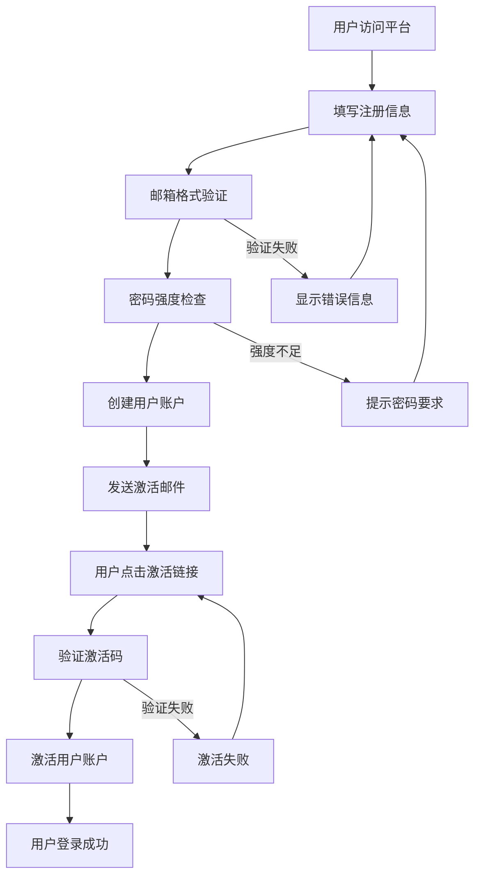
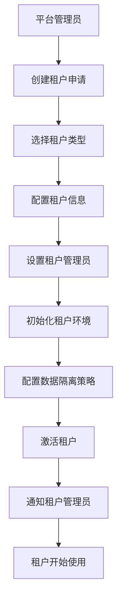
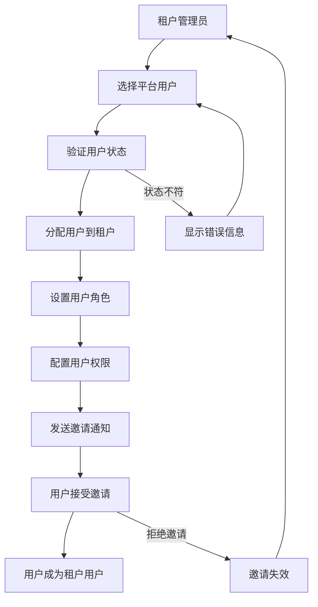
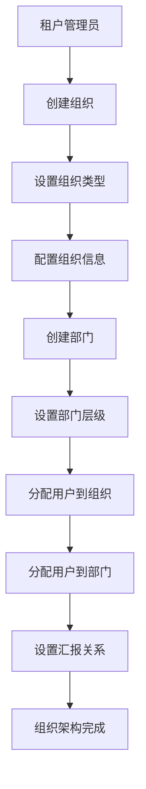

# HL8 SAAS 平台业务需求文档

> **文档版本**: 1.0.0 | **创建日期**: 2025-01-27 | **用途**: 业务需求分析和产品规划

---

## 📋 目录

- [1. 业务概览](#1-业务概览)
- [2. 业务规则体系](#2-业务规则体系)
- [3. 业务流程分析](#3-业务流程分析)
- [4. 用户故事集合](#4-用户故事集合)
- [5. 业务场景分析](#5-业务场景分析)
- [6. 非功能性需求](#6-非功能性需求)
- [7. 业务约束条件](#7-业务约束条件)

---

## 1. 业务概览

### 1.1 平台定位

**HL8 SAAS 平台**是一个企业级多租户软件即服务平台，为不同类型的组织提供完整的数字化管理和协作解决方案。

**核心价值主张**：

- 🏢 **多租户架构**：支持企业、社群、团队、个人等多种租户类型
- 🔐 **安全隔离**：完整的数据隔离和权限控制体系
- 🏗️ **灵活组织**：支持横向组织和纵向部门的混合管理
- 👥 **用户管理**：统一的用户身份和灵活的角色权限
- 📊 **可扩展性**：为未来的微服务拆分做好准备

### 1.2 租户类型体系

平台支持五种租户类型，满足不同规模和需求的客户：

#### **1. 免费租户 (FREE)**

- **目标用户**：个人用户、小型团队、试用客户
- **用户限制**：最多5个用户
- **存储限制**：100MB
- **组织限制**：1个组织（默认组织）
- **部门限制**：无限制（支持多层级部门结构）
- **部门层级**：系统配置限制在7层以内
- **功能限制**：基础功能，有广告
- **技术支持**：社区支持
- **数据保留**：30天

#### **2. 基础租户 (BASIC)**

- **目标用户**：小型企业、初创公司
- **用户限制**：最多50个用户
- **存储限制**：1GB
- **组织限制**：2个组织
- **部门限制**：无限制（支持多层级部门结构）
- **部门层级**：系统配置限制在7层以内
- **功能限制**：标准功能，无广告
- **技术支持**：邮件支持
- **数据保留**：1年

#### **3. 专业租户 (PROFESSIONAL)**

- **目标用户**：中型企业、专业团队
- **用户限制**：最多500个用户
- **存储限制**：10GB
- **组织限制**：10个组织
- **部门限制**：无限制（支持多层级部门结构）
- **部门层级**：系统配置限制在7层以内
- **功能限制**：高级功能、API访问
- **技术支持**：优先邮件支持
- **数据保留**：3年

#### **4. 企业租户 (ENTERPRISE)**

- **目标用户**：大型企业、集团公司
- **用户限制**：最多10,000个用户
- **存储限制**：100GB
- **组织限制**：100个组织
- **部门限制**：无限制（支持多层级部门结构）
- **部门层级**：系统配置限制在8层以内
- **功能限制**：全部功能、定制开发
- **技术支持**：专属客户经理
- **数据保留**：永久保留

#### **5. 定制租户 (CUSTOM)**

- **目标用户**：特殊需求客户、政府机构
- **用户限制**：无限制
- **存储限制**：无限制
- **组织限制**：无限制
- **部门限制**：无限制（支持多层级部门结构）
- **部门层级**：可通过配置调整，技术上无限制
- **功能限制**：完全定制
- **技术支持**：7×24小时支持
- **数据保留**：按合同约定

### 1.3 目标用户群体

#### 平台级用户

- **平台管理员**：负责平台运营、租户管理、技术支持
- **个人用户**：使用平台个人服务的独立用户

#### 租户级用户

- **免费租户用户**：个人用户、小型团队、试用客户
- **基础租户用户**：小型企业、初创公司
- **专业租户用户**：中型企业、专业团队
- **企业租户用户**：大型企业、集团公司
- **定制租户用户**：特殊需求客户、政府机构

### 1.4 数据隔离策略

平台采用多级数据隔离策略，确保租户数据的安全性和隔离性：

#### **运营初期策略：统一行级隔离**

**战略决策**：平台运营初期，所有租户统一采用行级隔离策略，简化系统复杂度，降低运营成本，加快平台启动速度。

#### **1. 行级隔离 (ROW_LEVEL_SECURITY)** - 🏆 **当前默认策略**

- **适用场景**：**所有租户类型**（运营初期统一策略）
- **技术实现**：共享数据库和模式，通过租户ID进行严格的行级数据隔离
- **优势**：
  - 最高的资源利用率和成本效益
  - 统一的数据库管理和运维
  - 简化的备份、监控和故障恢复
  - 快速的租户创建和部署
- **适用租户**：所有租户类型，特别是免费和基础租户

#### **2. 数据库级隔离 (DATABASE_PER_TENANT)** - 🚀 **未来扩展策略**

- **适用场景**：大型企业租户、定制租户、高安全要求租户
- **技术实现**：每个租户拥有独立的数据库实例
- **优势**：
  - 最高级别的数据隔离
  - 完全独立的数据库配置
  - 支持租户特定的数据库优化
  - 满足严格的合规要求
- **适用租户**：企业租户、定制租户

#### **3. 模式级隔离 (SCHEMA_PER_TENANT)** - 📊 **中等规模策略**

- **适用场景**：中等规模的专业租户
- **技术实现**：每个租户拥有独立的数据库模式
- **优势**：
  - 良好的数据隔离性
  - 适中的资源使用
  - 支持租户特定的数据模型
  - 便于数据迁移和管理
- **适用租户**：专业租户、部分企业租户

#### **4. 应用级隔离 (APPLICATION_LEVEL)** - 🔧 **特定场景策略**

- **适用场景**：特殊合规要求、混合云部署
- **技术实现**：通过应用层逻辑实现数据隔离
- **优势**：
  - 最大的部署灵活性
  - 支持混合云架构
  - 适应特殊合规要求
  - 便于与现有系统集成
- **适用租户**：定制租户、政府机构

### 1.5 核心业务领域

基于DDD领域划分，平台包含以下核心业务领域：

1. **用户身份领域**：用户注册、认证、基础信息管理
2. **租户管理领域**：租户生命周期管理、配置管理、数据隔离
3. **组织架构领域**：组织创建、部门管理、层级关系维护
4. **权限授权领域**：角色管理、权限分配、访问控制
5. **平台管理领域**：系统监控、运营管理、审计日志

### 1.4 业务架构层次

```
┌─────────────────────────────────────────────────────────────┐
│                    HL8 SAAS 平台业务架构                     │
├─────────────────────────────────────────────────────────────┤
│                                                             │
│  ┌─────────────────┐    ┌─────────────────┐                │
│  │   平台管理层    │    │   用户身份层    │                │
│  │ Platform Mgmt   │    │ User Identity   │                │
│  └─────────────────┘    └─────────────────┘                │
│           │                       │                        │
│           └───────────┬───────────┘                        │
│                       │                                    │
│  ┌─────────────────────────────────────────────────────┐   │
│  │              租户管理层                             │   │
│  │            Tenant Management                        │   │
│  └─────────────────────────────────────────────────────┘   │
│                       │                                    │
│  ┌─────────────────────────────────────────────────────┐   │
│  │             组织架构层                              │   │
│  │         Organization Architecture                   │   │
│  └─────────────────────────────────────────────────────┘   │
│                       │                                    │
│  ┌─────────────────────────────────────────────────────┐   │
│  │              权限授权层                             │   │
│  │              Authorization                          │   │
│  └─────────────────────────────────────────────────────┘   │
│                                                             │
└─────────────────────────────────────────────────────────────┘
```

---

## 2. 业务规则体系

### 2.1 用户管理业务规则

#### 用户注册规则

- **唯一性规则**：用户邮箱在平台内必须唯一
- **验证规则**：注册时必须验证邮箱格式和密码强度
- **状态规则**：新注册用户状态为"待激活"
- **激活规则**：用户必须通过邮箱验证才能激活账户

#### 用户认证规则

- **状态检查**：只有"活跃"状态的用户才能登录
- **密码策略**：密码必须符合安全强度要求
- **失败处理**：连续登录失败超过5次将锁定账户
- **会话管理**：用户会话超时时间为24小时

#### 用户分配规则

- **平台归属**：用户首先属于平台，是基础身份
- **租户分配**：平台用户可以被分配到租户，成为租户用户
- **组织分配**：租户用户可以被分配到组织，参与组织管理
- **部门分配**：租户用户可以被分配到部门，参与部门业务
- **兼职支持**：用户可以同时属于多个组织和部门

### 2.2 租户管理业务规则

#### 租户创建规则

- **类型选择**：租户创建时必须选择租户类型（企业/社群/团队/个人）
- **配置隔离**：每个租户拥有独立的配置环境
- **数据隔离**：租户间数据完全隔离，互不可见
- **资源限制**：不同类型租户有不同的资源使用限制

#### 租户生命周期规则

- **创建流程**：租户创建 → 配置初始化 → 管理员设置 → 激活
- **状态管理**：活跃、暂停、禁用、删除等状态转换
- **数据保留**：租户删除时数据保留30天，之后永久删除
- **迁移支持**：支持租户数据和配置的迁移

### 2.3 组织架构业务规则

#### 组织创建规则

- **租户归属**：组织必须属于某个租户
- **类型分类**：组织必须明确类型（专业委员会/项目管理团队/质量控制小组/绩效管理小组）
- **横向设置**：组织之间没有从属关系，是平行的
- **职能专一**：每个组织专注于特定职能或业务领域

#### 部门管理规则

- **层级关系**：部门具有明确的上下级关系
- **组织归属**：部门必须属于某个组织
- **层级限制**：最多支持三级部门嵌套
- **汇报关系**：下级部门向上级部门汇报

### 2.4 权限授权业务规则

#### 角色权限规则

- **层级权限**：上级权限包含下级权限
- **跨域权限**：跨层级权限需要特殊授权
- **兼职权限**：兼职用户权限需要合并处理
- **权限继承**：下级角色继承上级角色的基础权限

#### 访问控制规则

- **数据隔离**：用户只能访问所属租户的数据
- **组织隔离**：用户只能访问所属组织的数据
- **部门隔离**：用户只能访问所属部门的数据
- **权限验证**：每次数据访问都需要权限验证

---

## 3. 业务流程分析

### 3.1 用户注册激活流程



### 3.2 租户创建流程



### 3.3 用户分配到租户流程



### 3.4 组织架构建立流程



---

## 4. 用户故事集合

### 4.1 平台管理员用户故事

#### 故事1：平台运营管理

**作为** 平台管理员  
**我希望** 能够监控平台的整体运营状况  
**以便** 确保平台的稳定运行和及时处理问题  

**验收标准**：

- 能够查看平台用户总数和活跃度
- 能够监控租户数量和资源使用情况
- 能够查看系统性能和错误日志
- 能够接收关键事件的实时通知

#### 故事2：租户生命周期管理

**作为** 平台管理员  
**我希望** 能够管理租户的完整生命周期  
**以便** 为不同类型的客户提供优质服务  

**验收标准**：

- 能够创建新租户并配置租户类型
- 能够暂停、恢复或删除租户
- 能够查看租户的资源使用情况
- 能够处理租户的配置迁移需求

### 4.2 租户管理员用户故事

#### 故事3：租户用户管理

**作为** 租户管理员  
**我希望** 能够管理租户内的用户  
**以便** 控制租户的访问权限和用户行为  

**验收标准**：

- 能够邀请平台用户加入租户
- 能够分配用户到不同的组织和部门
- 能够设置用户的角色和权限
- 能够禁用或移除租户用户

#### 故事4：组织架构管理

**作为** 租户管理员  
**我希望** 能够建立和管理租户的组织架构  
**以便** 实现有效的组织管理和业务分工  

**验收标准**：

- 能够创建不同类型的组织
- 能够建立部门的层级关系
- 能够分配用户到组织和部门
- 能够调整组织架构和汇报关系

### 4.3 普通用户用户故事

#### 故事5：用户注册和认证

**作为** 新用户  
**我希望** 能够快速注册并激活账户  
**以便** 开始使用平台的服务  

**验收标准**：

- 能够通过邮箱注册新账户
- 能够接收激活邮件并完成激活
- 能够设置安全的登录密码
- 能够成功登录到平台

#### 故事6：个人信息管理

**作为** 注册用户  
**我希望** 能够管理我的个人信息  
**以便** 保持信息的准确性和完整性  

**验收标准**：

- 能够查看和编辑个人资料
- 能够修改登录密码
- 能够设置个人偏好
- 能够查看账户状态和权限

#### 故事7：多租户工作

**作为** 租户用户  
**我希望** 能够同时参与多个租户的工作  
**以便** 提高工作效率和协作能力  

**验收标准**：

- 能够查看所属的所有租户
- 能够在不同租户间切换
- 能够管理不同租户中的角色
- 能够保持各租户间的数据隔离

---

## 5. 业务场景分析

### 5.1 企业租户场景

#### 场景描述

一家中大型科技公司需要为内部团队提供协作平台，公司有多个部门（技术部、市场部、财务部），每个部门下有多个小组。

#### 业务流程

1. **租户创建**：公司IT管理员申请创建企业租户
2. **组织建立**：创建技术委员会、项目管理办公室等组织
3. **部门设置**：在技术委员会下创建技术部，技术部下创建前端组、后端组、测试组
4. **用户分配**：将员工分配到相应的组织和部门
5. **权限配置**：为不同角色设置相应的权限

#### 关键需求

- 支持复杂的组织层级结构
- 提供细粒度的权限控制
- 支持部门间的协作和沟通
- 提供数据安全和隐私保护

### 5.2 社群租户场景

#### 场景描述

一个技术社区需要为会员提供交流平台，社区有多个兴趣小组（前端开发、后端开发、DevOps等）。

#### 业务流程

1. **租户创建**：社区管理员创建社群租户
2. **兴趣组织**：创建前端开发小组、后端开发小组等组织
3. **会员管理**：邀请社区会员加入相应的兴趣小组
4. **内容分享**：会员在小组内分享技术内容和经验
5. **活动组织**：组织技术分享会和线上活动

#### 关键需求

- 支持兴趣小组的灵活管理
- 提供内容分享和讨论功能
- 支持活动的组织和参与
- 提供会员等级和积分系统

### 5.3 团队租户场景

#### 场景描述

一个临时项目团队需要快速搭建协作平台，团队由来自不同公司的成员组成。

#### 业务流程

1. **快速创建**：项目负责人快速创建团队租户
2. **成员邀请**：邀请项目成员加入团队
3. **角色分配**：为不同成员分配项目角色
4. **任务协作**：团队成员协作完成项目任务
5. **项目结束**：项目完成后解散团队或转为长期团队

#### 关键需求

- 支持快速创建和配置
- 提供灵活的角色分配
- 支持跨组织的协作
- 提供项目生命周期管理

---

## 6. 非功能性需求

### 6.1 性能需求

#### 响应时间要求

- **用户操作响应**：页面加载时间 < 2秒
- **数据查询响应**：复杂查询响应时间 < 5秒
- **批量操作响应**：批量用户操作响应时间 < 10秒
- **系统监控响应**：监控数据更新频率 < 1分钟

#### 并发处理能力

- **用户并发**：支持10,000个并发用户
- **租户并发**：支持1,000个活跃租户
- **API并发**：支持每秒10,000个API请求
- **数据处理**：支持每秒100,000条数据记录

### 6.2 可用性需求

#### 系统可用性

- **正常运行时间**：99.9%的系统可用性
- **故障恢复**：系统故障后5分钟内恢复
- **数据备份**：每日自动备份，支持点时间恢复
- **灾难恢复**：支持跨地域的灾难恢复

#### 用户体验

- **界面友好**：直观易用的用户界面
- **响应式设计**：支持桌面和移动设备
- **多语言支持**：支持中文和英文界面
- **无障碍访问**：符合WCAG 2.1 AA标准

### 6.3 安全需求

#### 数据安全

- **数据加密**：敏感数据加密存储和传输
- **访问控制**：基于角色的访问控制
- **审计日志**：完整的操作审计日志
- **数据隔离**：租户间数据完全隔离

#### 身份安全

- **身份验证**：多因素身份验证支持
- **密码策略**：强密码策略和定期更换
- **会话管理**：安全的会话管理和超时控制
- **权限验证**：每次操作都进行权限验证

---

## 7. 业务约束条件

### 7.1 技术约束

#### 架构约束

- **多租户架构**：必须支持完整的多租户隔离
- **微服务就绪**：架构设计必须支持未来的微服务拆分
- **事件驱动**：核心业务逻辑必须基于事件驱动架构
- **云原生**：支持容器化部署和云原生架构

#### 技术栈约束

- **后端技术**：TypeScript + NestJS + Fastify
- **数据库**：PostgreSQL + Redis
- **消息队列**：支持异步消息处理
- **缓存策略**：多层缓存架构

### 7.2 业务约束

#### 合规性约束

- **数据保护**：符合GDPR等数据保护法规
- **隐私保护**：用户隐私数据保护要求
- **审计要求**：支持合规审计和报告
- **数据保留**：符合数据保留政策要求

#### 运营约束

- **成本控制**：运营成本控制在合理范围内
- **扩展性**：支持业务的快速扩展
- **维护性**：系统易于维护和升级
- **可监控性**：提供完整的监控和告警机制

---

**文档状态**: 🟢 **第一部分完成**  
**下一步**: 创建详细的业务规则文档  
**最后更新**: 2025-01-27  
**文档版本**: 1.0.0
