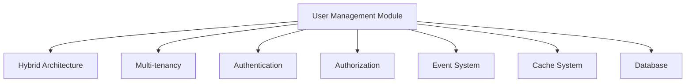

# 用户管理模块设计方案

> **版本**: 1.0.0 | **创建日期**: 2025-01-27 | **基于架构**: Hybrid Architecture (Clean Architecture + DDD + CQRS + ES + EDA)

---

## 📋 目录

- [1. 模块概述](#1-模块概述)
- [2. 业务需求分析](#2-业务需求分析)
- [3. 架构设计](#3-架构设计)
- [4. 领域模型设计](#4-领域模型设计)
- [5. 应用层设计](#5-应用层设计)
- [6. 接口层设计](#6-接口层设计)
- [7. 基础设施层设计](#7-基础设施层设计)
- [8. 实现计划](#8-实现计划)
- [9. 验证方案](#9-验证方案)

---

## 1. 模块概述

### 1.1 模块定位

用户管理模块是SAAS平台的核心基础模块，负责管理平台内的所有用户实体，包括用户注册、认证、授权、个人信息管理等功能。

### 1.2 设计目标

- **业务完整性**: 支持完整的用户生命周期管理
- **架构一致性**: 严格遵循Hybrid Architecture设计原则
- **多租户支持**: 完整的租户隔离和权限控制
- **可扩展性**: 支持未来业务需求的扩展
- **性能优化**: 支持高并发用户操作

### 1.3 技术约束

- 基于现有的`@hl8/hybrid-archi`架构
- 遵循DDD充血模型设计
- 使用CQRS模式分离命令和查询
- 支持事件驱动架构
- 集成多租户支持

---

## 2. 业务需求分析

### 2.1 核心业务实体

#### 2.1.1 用户实体 (User)

```typescript
// 用户基础信息
interface User {
  id: UserId;
  email: Email;
  username: Username;
  password: Password;
  profile: UserProfile;
  status: UserStatus;
  tenantId?: TenantId;
  createdAt: Date;
  updatedAt: Date;
}
```

#### 2.1.2 用户配置文件 (UserProfile)

```typescript
interface UserProfile {
  firstName: string;
  lastName: string;
  avatar?: string;
  phone?: string;
  timezone: string;
  language: string;
  preferences: UserPreferences;
}
```

#### 2.1.3 用户角色 (UserRole)

```typescript
interface UserRole {
  id: RoleId;
  name: string;
  permissions: Permission[];
  tenantId: TenantId;
}
```

### 2.2 业务用例

#### 2.2.1 用户注册用例

- **命令**: `RegisterUserCommand`
- **查询**: `GetUserQuery`
- **事件**: `UserRegisteredEvent`

#### 2.2.2 用户认证用例

- **命令**: `AuthenticateUserCommand`
- **查询**: `ValidateUserQuery`
- **事件**: `UserAuthenticatedEvent`

#### 2.2.3 用户授权用例

- **命令**: `AuthorizeUserCommand`
- **查询**: `CheckUserPermissionsQuery`
- **事件**: `UserAuthorizedEvent`

#### 2.2.4 用户信息管理用例

- **命令**: `UpdateUserProfileCommand`
- **查询**: `GetUserProfileQuery`
- **事件**: `UserProfileUpdatedEvent`

---

## 3. 架构设计

### 3.1 分层架构

```
┌─────────────────────────────────────────┐
│            Interface Layer              │
│  ┌─────────────┐ ┌─────────────┐        │
│  │   REST API  │ │  GraphQL    │        │
│  │ Controllers │ │ Resolvers   │        │
│  └─────────────┘ └─────────────┘        │
└─────────────────────────────────────────┘
┌─────────────────────────────────────────┐
│           Application Layer              │
│  ┌─────────────┐ ┌─────────────┐        │
│  │   Commands  │ │   Queries   │        │
│  │   Handlers  │ │   Handlers  │        │
│  └─────────────┘ └─────────────┘        │
└─────────────────────────────────────────┘
┌─────────────────────────────────────────┐
│             Domain Layer                │
│  ┌─────────────┐ ┌─────────────┐        │
│  │   Entities  │ │  Services   │        │
│  │ Aggregates  │ │   Events    │        │
│  └─────────────┘ └─────────────┘        │
└─────────────────────────────────────────┘
┌─────────────────────────────────────────┐
│         Infrastructure Layer            │
│  ┌─────────────┐ ┌─────────────┐        │
│  │ Repositories │ │   External  │        │
│  │   Adapters  │ │  Services   │        │
│  └─────────────┘ └─────────────┘        │
└─────────────────────────────────────────┘
```

### 3.2 模块依赖关系



---

## 4. 领域模型设计

### 4.1 聚合根设计

#### 4.1.1 User聚合根

```typescript
/**
 * 用户聚合根
 * 
 * @description 用户聚合根，管理用户的完整生命周期
 * 包含用户基础信息、认证信息、权限信息等
 */
export class User extends BaseAggregateRoot<UserId> {
  private constructor(
    private readonly _id: UserId,
    private _email: Email,
    private _username: Username,
    private _password: Password,
    private _profile: UserProfile,
    private _status: UserStatus,
    private _tenantId?: TenantId
  ) {
    super(_id);
  }

  // 业务方法
  public register(email: Email, username: Username, password: Password): void {
    if (this._status !== UserStatus.Pending) {
      throw new UserAlreadyRegisteredException();
    }
    
    this._email = email;
    this._username = username;
    this._password = password;
    this._status = UserStatus.Active;
    
    this.addDomainEvent(new UserRegisteredEvent(this._id, this._email));
  }

  public authenticate(password: Password): boolean {
    if (this._status !== UserStatus.Active) {
      throw new UserNotActiveException();
    }
    
    const isValid = this._password.verify(password);
    if (isValid) {
      this.addDomainEvent(new UserAuthenticatedEvent(this._id));
    }
    
    return isValid;
  }

  public updateProfile(profile: UserProfile): void {
    this._profile = profile;
    this.addDomainEvent(new UserProfileUpdatedEvent(this._id, profile));
  }

  public assignToTenant(tenantId: TenantId): void {
    this._tenantId = tenantId;
    this.addDomainEvent(new UserAssignedToTenantEvent(this._id, tenantId));
  }
}
```

#### 4.1.2 UserProfile值对象

```typescript
/**
 * 用户配置文件值对象
 * 
 * @description 用户配置文件，包含用户的个人信息和偏好设置
 */
export class UserProfile extends BaseValueObject {
  constructor(
    public readonly firstName: string,
    public readonly lastName: string,
    public readonly avatar?: string,
    public readonly phone?: string,
    public readonly timezone: string = 'UTC',
    public readonly language: string = 'zh-CN',
    public readonly preferences: UserPreferences = new UserPreferences()
  ) {
    super();
    this.validate();
  }

  private validate(): void {
    if (!this.firstName || this.firstName.trim().length === 0) {
      throw new InvalidUserProfileException('First name is required');
    }
    if (!this.lastName || this.lastName.trim().length === 0) {
      throw new InvalidUserProfileException('Last name is required');
    }
  }

  public getFullName(): string {
    return `${this.firstName} ${this.lastName}`;
  }
}
```

### 4.2 领域服务

#### 4.2.1 UserDomainService

```typescript
/**
 * 用户领域服务
 * 
 * @description 处理用户相关的复杂业务逻辑
 */
export class UserDomainService implements IDomainService {
  constructor(
    private readonly userRepository: IUserRepository,
    private readonly passwordService: IPasswordService,
    private readonly emailService: IEmailService
  ) {}

  public async isEmailUnique(email: Email, tenantId?: TenantId): Promise<boolean> {
    const existingUser = await this.userRepository.findByEmail(email, tenantId);
    return existingUser === null;
  }

  public async isUsernameUnique(username: Username, tenantId?: TenantId): Promise<boolean> {
    const existingUser = await this.userRepository.findByUsername(username, tenantId);
    return existingUser === null;
  }

  public async validateUserRegistration(
    email: Email,
    username: Username,
    tenantId?: TenantId
  ): Promise<void> {
    if (!(await this.isEmailUnique(email, tenantId))) {
      throw new EmailAlreadyExistsException(email.value);
    }
    
    if (!(await this.isUsernameUnique(username, tenantId))) {
      throw new UsernameAlreadyExistsException(username.value);
    }
  }
}
```

### 4.3 领域事件

#### 4.3.1 用户注册事件

```typescript
/**
 * 用户注册事件
 * 
 * @description 当用户成功注册时触发
 */
export class UserRegisteredEvent extends DomainEvent {
  constructor(
    public readonly userId: UserId,
    public readonly email: Email,
    public readonly tenantId?: TenantId
  ) {
    super();
  }
}
```

#### 4.3.2 用户认证事件

```typescript
/**
 * 用户认证事件
 * 
 * @description 当用户成功认证时触发
 */
export class UserAuthenticatedEvent extends DomainEvent {
  constructor(
    public readonly userId: UserId,
    public readonly timestamp: Date = new Date()
  ) {
    super();
  }
}
```

---

## 5. 应用层设计

### 5.1 命令处理器

#### 5.1.1 用户注册命令处理器

```typescript
/**
 * 用户注册命令处理器
 * 
 * @description 处理用户注册命令
 */
@CommandHandler(RegisterUserCommand)
export class RegisterUserHandler implements ICommandHandler<RegisterUserCommand> {
  constructor(
    private readonly userRepository: IUserRepository,
    private readonly userDomainService: UserDomainService,
    private readonly eventBus: IEventBus
  ) {}

  async execute(command: RegisterUserCommand): Promise<UserId> {
    // 验证用户注册信息
    await this.userDomainService.validateUserRegistration(
      command.email,
      command.username,
      command.tenantId
    );

    // 创建用户实体
    const user = User.create(
      UserId.generate(),
      command.email,
      command.username,
      Password.create(command.password),
      UserProfile.create(command.profile),
      UserStatus.Pending,
      command.tenantId
    );

    // 注册用户
    user.register(command.email, command.username, Password.create(command.password));

    // 保存用户
    await this.userRepository.save(user);

    // 发布领域事件
    await this.eventBus.publishAll(user.getUncommittedEvents());

    return user.getId();
  }
}
```

#### 5.1.2 用户认证命令处理器

```typescript
/**
 * 用户认证命令处理器
 * 
 * @description 处理用户认证命令
 */
@CommandHandler(AuthenticateUserCommand)
export class AuthenticateUserHandler implements ICommandHandler<AuthenticateUserCommand> {
  constructor(
    private readonly userRepository: IUserRepository,
    private readonly eventBus: IEventBus
  ) {}

  async execute(command: AuthenticateUserCommand): Promise<boolean> {
    const user = await this.userRepository.findByEmail(
      command.email,
      command.tenantId
    );

    if (!user) {
      throw new UserNotFoundException(command.email.value);
    }

    const isAuthenticated = user.authenticate(Password.create(command.password));

    if (isAuthenticated) {
      await this.eventBus.publishAll(user.getUncommittedEvents());
    }

    return isAuthenticated;
  }
}
```

### 5.2 查询处理器

#### 5.2.1 获取用户查询处理器

```typescript
/**
 * 获取用户查询处理器
 * 
 * @description 处理获取用户信息的查询
 */
@QueryHandler(GetUserQuery)
export class GetUserHandler implements IQueryHandler<GetUserQuery> {
  constructor(
    private readonly userRepository: IUserRepository
  ) {}

  async execute(query: GetUserQuery): Promise<UserDto> {
    const user = await this.userRepository.findById(query.userId);
    
    if (!user) {
      throw new UserNotFoundException(query.userId.value);
    }

    return UserDto.fromEntity(user);
  }
}
```

### 5.3 事件处理器

#### 5.3.1 用户注册事件处理器

```typescript
/**
 * 用户注册事件处理器
 * 
 * @description 处理用户注册成功后的后续操作
 */
@EventsHandler(UserRegisteredEvent)
export class UserRegisteredHandler implements IEventHandler<UserRegisteredEvent> {
  constructor(
    private readonly emailService: IEmailService,
    private readonly notificationService: INotificationService
  ) {}

  async handle(event: UserRegisteredEvent): Promise<void> {
    // 发送欢迎邮件
    await this.emailService.sendWelcomeEmail(event.email);
    
    // 发送通知
    await this.notificationService.notifyUserRegistration(event.userId);
  }
}
```

---

## 6. 接口层设计

### 6.1 REST API控制器

#### 6.1.1 用户控制器

```typescript
/**
 * 用户REST API控制器
 * 
 * @description 提供用户管理的REST API接口
 */
@Controller('users')
@UseGuards(JwtAuthGuard, TenantIsolationGuard)
export class UserController extends BaseController {
  constructor(
    private readonly commandBus: ICommandBus,
    private readonly queryBus: IQueryBus
  ) {
    super();
  }

  @Post('register')
  @RequirePermissions('user:create')
  async register(@Body() dto: RegisterUserDto): Promise<UserDto> {
    const command = new RegisterUserCommand(
      Email.create(dto.email),
      Username.create(dto.username),
      dto.password,
      UserProfile.create(dto.profile),
      this.getCurrentTenantId()
    );

    const userId = await this.commandBus.execute(command);
    
    const query = new GetUserQuery(userId);
    return await this.queryBus.execute(query);
  }

  @Post('authenticate')
  async authenticate(@Body() dto: AuthenticateUserDto): Promise<AuthResultDto> {
    const command = new AuthenticateUserCommand(
      Email.create(dto.email),
      dto.password,
      this.getCurrentTenantId()
    );

    const isAuthenticated = await this.commandBus.execute(command);
    
    return new AuthResultDto(isAuthenticated);
  }

  @Get(':id')
  @RequirePermissions('user:read')
  async getUser(@Param('id') id: string): Promise<UserDto> {
    const query = new GetUserQuery(UserId.create(id));
    return await this.queryBus.execute(query);
  }

  @Put(':id/profile')
  @RequirePermissions('user:update')
  async updateProfile(
    @Param('id') id: string,
    @Body() dto: UpdateUserProfileDto
  ): Promise<UserDto> {
    const command = new UpdateUserProfileCommand(
      UserId.create(id),
      UserProfile.create(dto.profile)
    );

    await this.commandBus.execute(command);
    
    const query = new GetUserQuery(UserId.create(id));
    return await this.queryBus.execute(query);
  }
}
```

### 6.2 GraphQL解析器

#### 6.2.1 用户GraphQL解析器

```typescript
/**
 * 用户GraphQL解析器
 * 
 * @description 提供用户管理的GraphQL接口
 */
@Resolver(() => User)
export class UserResolver extends BaseResolver {
  constructor(
    private readonly commandBus: ICommandBus,
    private readonly queryBus: IQueryBus
  ) {
    super();
  }

  @Mutation(() => User)
  @RequirePermissions('user:create')
  async registerUser(
    @Args('input') input: RegisterUserInput
  ): Promise<User> {
    const command = new RegisterUserCommand(
      Email.create(input.email),
      Username.create(input.username),
      input.password,
      UserProfile.create(input.profile),
      this.getCurrentTenantId()
    );

    const userId = await this.commandBus.execute(command);
    
    const query = new GetUserQuery(userId);
    return await this.queryBus.execute(query);
  }

  @Query(() => User)
  @RequirePermissions('user:read')
  async user(@Args('id') id: string): Promise<User> {
    const query = new GetUserQuery(UserId.create(id));
    return await this.queryBus.execute(query);
  }

  @Mutation(() => User)
  @RequirePermissions('user:update')
  async updateUserProfile(
    @Args('id') id: string,
    @Args('input') input: UpdateUserProfileInput
  ): Promise<User> {
    const command = new UpdateUserProfileCommand(
      UserId.create(id),
      UserProfile.create(input.profile)
    );

    await this.commandBus.execute(command);
    
    const query = new GetUserQuery(UserId.create(id));
    return await this.queryBus.execute(query);
  }
}
```

---

## 7. 基础设施层设计

### 7.1 仓储实现

#### 7.1.1 用户仓储实现

```typescript
/**
 * 用户仓储实现
 * 
 * @description 基于MikroORM的用户仓储实现
 */
@Injectable()
export class UserRepository implements IUserRepository {
  constructor(
    @InjectRepository(UserEntity)
    private readonly userEntityRepository: EntityRepository<UserEntity>,
    private readonly mapper: UserMapper
  ) {}

  async findById(id: UserId): Promise<User | null> {
    const entity = await this.userEntityRepository.findOne({ id: id.value });
    return entity ? this.mapper.toDomain(entity) : null;
  }

  async findByEmail(email: Email, tenantId?: TenantId): Promise<User | null> {
    const where: any = { email: email.value };
    if (tenantId) {
      where.tenantId = tenantId.value;
    }
    
    const entity = await this.userEntityRepository.findOne(where);
    return entity ? this.mapper.toDomain(entity) : null;
  }

  async findByUsername(username: Username, tenantId?: TenantId): Promise<User | null> {
    const where: any = { username: username.value };
    if (tenantId) {
      where.tenantId = tenantId.value;
    }
    
    const entity = await this.userEntityRepository.findOne(where);
    return entity ? this.mapper.toDomain(entity) : null;
  }

  async save(user: User): Promise<void> {
    const entity = this.mapper.toEntity(user);
    await this.userEntityRepository.persistAndFlush(entity);
  }

  async delete(id: UserId): Promise<void> {
    await this.userEntityRepository.nativeDelete({ id: id.value });
  }
}
```

### 7.2 外部服务适配器

#### 7.2.1 邮件服务适配器

```typescript
/**
 * 邮件服务适配器
 * 
 * @description 邮件服务的外部适配器实现
 */
@Injectable()
export class EmailServiceAdapter implements IEmailService {
  constructor(
    private readonly emailClient: EmailClient,
    private readonly templateEngine: TemplateEngine
  ) {}

  async sendWelcomeEmail(email: Email): Promise<void> {
    const template = await this.templateEngine.render('welcome-email', {
      email: email.value
    });

    await this.emailClient.send({
      to: email.value,
      subject: '欢迎注册',
      html: template
    });
  }

  async sendPasswordResetEmail(email: Email, resetToken: string): Promise<void> {
    const template = await this.templateEngine.render('password-reset-email', {
      email: email.value,
      resetToken
    });

    await this.emailClient.send({
      to: email.value,
      subject: '密码重置',
      html: template
    });
  }
}
```

---

## 8. 实现计划

### 8.1 第一阶段：核心领域模型 (1-2天)

- [ ] 实现User聚合根
- [ ] 实现UserProfile值对象
- [ ] 实现UserDomainService
- [ ] 实现领域事件
- [ ] 编写单元测试

### 8.2 第二阶段：应用层实现 (2-3天)

- [ ] 实现命令处理器
- [ ] 实现查询处理器
- [ ] 实现事件处理器
- [ ] 编写应用层测试

### 8.3 第三阶段：接口层实现 (2-3天)

- [ ] 实现REST API控制器
- [ ] 实现GraphQL解析器
- [ ] 实现DTO和验证
- [ ] 编写接口层测试

### 8.4 第四阶段：基础设施层实现 (2-3天)

- [ ] 实现用户仓储
- [ ] 实现外部服务适配器
- [ ] 实现数据映射器
- [ ] 编写基础设施层测试

### 8.5 第五阶段：集成测试 (1-2天)

- [ ] 端到端测试
- [ ] 性能测试
- [ ] 安全测试
- [ ] 文档完善

---

## 9. 验证方案

### 9.1 架构验证

#### 9.1.1 分层架构验证

- ✅ 领域层不依赖任何其他层
- ✅ 应用层只依赖领域层
- ✅ 接口层依赖应用层和领域层
- ✅ 基础设施层实现领域层接口

#### 9.1.2 DDD模式验证

- ✅ 聚合根设计合理
- ✅ 值对象不可变
- ✅ 领域服务处理复杂业务逻辑
- ✅ 领域事件正确发布

#### 9.1.3 CQRS模式验证

- ✅ 命令和查询分离
- ✅ 命令处理器处理写操作
- ✅ 查询处理器处理读操作
- ✅ 事件处理器处理副作用

### 9.2 功能验证

#### 9.2.1 用户注册流程

1. 用户提交注册信息
2. 验证邮箱和用户名唯一性
3. 创建用户实体
4. 发布用户注册事件
5. 发送欢迎邮件

#### 9.2.2 用户认证流程

1. 用户提交认证信息
2. 验证用户存在性
3. 验证密码正确性
4. 发布用户认证事件
5. 返回认证结果

#### 9.2.3 用户信息管理流程

1. 用户提交更新信息
2. 验证用户权限
3. 更新用户信息
4. 发布用户信息更新事件
5. 返回更新结果

### 9.3 性能验证

#### 9.3.1 并发测试

- 1000个并发用户注册
- 1000个并发用户认证
- 1000个并发用户信息查询

#### 9.3.2 响应时间测试

- 用户注册响应时间 < 500ms
- 用户认证响应时间 < 200ms
- 用户信息查询响应时间 < 100ms

### 9.4 安全验证

#### 9.4.1 认证安全

- 密码加密存储
- 认证令牌安全
- 会话管理安全

#### 9.4.2 授权安全

- 权限验证正确
- 租户隔离有效
- 数据访问控制

---

## 🎯 总结

用户管理模块设计方案基于现有的Hybrid Architecture架构，严格遵循Clean Architecture、DDD、CQRS等设计原则，确保：

1. **架构一致性**: 与现有架构完美集成
2. **业务完整性**: 覆盖用户管理的完整生命周期
3. **技术先进性**: 使用最新的架构模式和设计原则
4. **可维护性**: 清晰的代码结构和职责分离
5. **可扩展性**: 支持未来业务需求的扩展

通过这个设计方案，我们可以验证现有架构的合理性，并为后续的业务模块开发提供参考模板。
