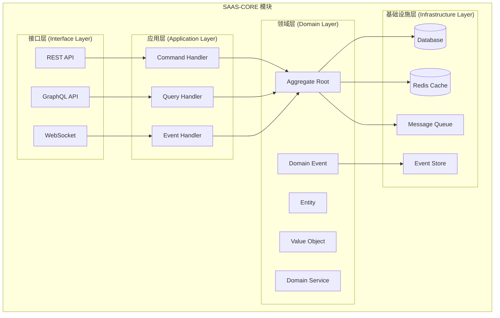
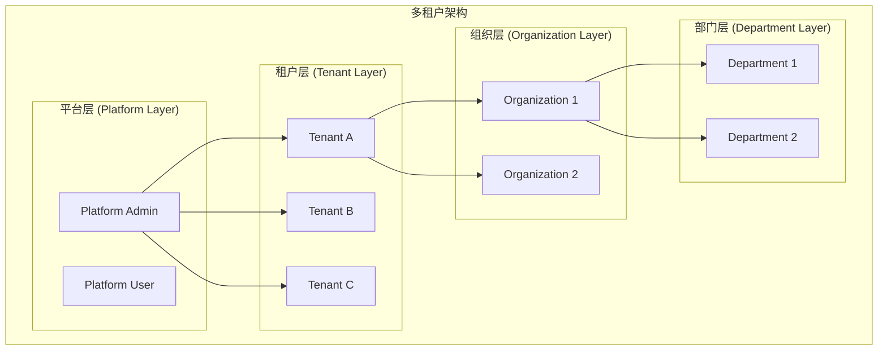

# SAAS-CORE 开发技术方案指南

> **版本**: 1.0.0 | **创建日期**: 2025-01-27 | **模块**: packages/saas-core

---

## 📋 目录

- [1. 项目概述](#1-项目概述)
- [2. 架构设计](#2-架构设计)
- [3. 技术栈选择](#3-技术栈选择)
- [4. 项目结构](#4-项目结构)
- [5. 开发步骤](#5-开发步骤)
- [6. 代码示例](#6-代码示例)
- [7. 测试策略](#7-测试策略)
- [8. 部署和运维](#8-部署和运维)

---

## 1. 项目概述

### 1.1 项目背景

SAAS-CORE 是基于 `@hl8/hybrid-archi` 架构构建的 SAAS 平台核心业务领域模块。它将平台、租户、组织、部门、用户、认证等核心子领域整合为一个统一的业务模块，为整个 SAAS 平台提供基础业务能力。

### 1.2 核心特性

- **混合架构模式**: Clean Architecture + CQRS + 事件溯源 + 事件驱动架构
- **充血模型**: 业务逻辑集中在领域层
- **多租户支持**: 完整的多租户数据隔离和权限控制
- **事件驱动**: 基于领域事件的松耦合架构
- **类型安全**: 严格的 TypeScript 类型系统

### 1.3 业务价值

- **快速交付**: 提供完整的 SAAS 平台基础能力
- **高可扩展**: 支持未来业务模块的快速集成
- **高可维护**: 清晰的架构分层和职责分离
- **高可靠性**: 完整的测试覆盖和错误处理

---

## 2. 架构设计

### 2.1 整体架构



### 2.2 核心架构模式

#### 2.2.1 Clean Architecture

- **依赖倒置**: 外层依赖内层，内层不依赖外层
- **分层隔离**: 每层只与相邻层交互
- **业务逻辑集中**: 核心业务逻辑在领域层

#### 2.2.2 CQRS (Command Query Responsibility Segregation)

- **命令端**: 处理写操作，修改聚合状态
- **查询端**: 处理读操作，提供数据视图
- **读写分离**: 优化性能和可扩展性

#### 2.2.3 Event Sourcing (事件溯源)

- **状态存储**: 通过事件序列重建聚合状态
- **审计追踪**: 完整的历史记录和变更追踪
- **时间旅行**: 支持任意时间点的状态重建

#### 2.2.4 Event-Driven Architecture (事件驱动架构)

- **松耦合**: 组件间通过事件通信
- **异步处理**: 支持异步业务逻辑处理
- **可扩展**: 易于添加新的事件处理器

### 2.3 领域层设计原则

#### 2.3.1 充血模型原则

**✅ 正确做法**:

```typescript
// 实体包含业务逻辑
export class User extends BaseEntity {
  public activate(): void {
    if (this.status !== UserStatus.Pending) {
      throw new UserNotPendingException('只有待激活状态的用户才能激活');
    }
    
    this.status = UserStatus.Active;
    this.activatedAt = new Date();
    this.updateTimestamp();
  }
}
```

**❌ 错误做法**:

```typescript
// ❌ 贫血模型 - 只有getter/setter
export class User {
  private _status: UserStatus;
  
  setStatus(status: UserStatus): void {
    this._status = status;
  }
  
  getStatus(): UserStatus {
    return this._status;
  }
}
```

#### 2.3.2 实体与聚合根分离

**聚合根作为管理者**:

- 管理聚合一致性边界
- 协调内部实体操作
- 发布领域事件
- 验证业务规则

**内部实体作为被管理者**:

- 执行具体业务操作
- 维护自身状态
- 遵循聚合根指令
- 实现业务逻辑

#### 2.3.3 指令模式实现

**指令模式** 是实体与聚合根分离的核心实现机制：

```text
聚合根发出指令 → 实体执行指令 → 返回执行结果
```

**指令类型**:

- **方法调用指令**: 聚合根调用实体的业务方法
- **状态变更指令**: 聚合根指示实体变更状态
- **业务规则验证指令**: 聚合根要求实体验证业务规则

#### 2.3.4 业务规则集中管理

**规则定义**:

```typescript
export class TenantBusinessRules {
  // 约束规则
  static readonly TENANT_CODE_MUST_BE_UNIQUE = "租户代码必须全局唯一";
  static readonly STATUS_TRANSITION_PENDING_TO_ACTIVE = "租户只能从PENDING状态转换到ACTIVE状态";
  
  // 功能权限规则
  static readonly FREE_TENANT_FEATURES = "免费租户只能使用基础功能";
  static readonly ENTERPRISE_TENANT_FEATURES = "企业租户可以使用所有功能";
}
```

**规则验证器**:

```typescript
export class TenantRuleValidator {
  public static validateStatusTransition(currentStatus: TenantStatus, newStatus: TenantStatus): boolean {
    const validTransitions: Record<TenantStatus, TenantStatus[]> = {
      [TenantStatus.PENDING]: [TenantStatus.ACTIVE, TenantStatus.DISABLED],
      [TenantStatus.ACTIVE]: [TenantStatus.SUSPENDED, TenantStatus.DISABLED],
      // ...
    };
    
    return validTransitions[currentStatus]?.includes(newStatus) || false;
  }
}
```

### 2.4 多租户架构



---

## 3. 技术栈选择

### 3.1 核心依赖

```json
{
  "dependencies": {
    "@hl8/hybrid-archi": "workspace:*",
    "@nestjs/common": "^11.1.6",
    "@nestjs/core": "^11.1.6",
    "@nestjs/platform-fastify": "^11.1.6",
    "@nestjs/terminus": "^10.0.0",
    "redis": "^4.6.0",
    "@casl/ability": "^6.7.0",
    "@hl8/common": "workspace:*"
  }
}
```

### 3.2 依赖分析说明

#### 3.2.1 已包含在 @hl8/hybrid-archi 中的所有基础设施

`@hl8/hybrid-archi` 通过 `InfrastructureModule` 集成了以下所有基础设施模块：

```json
{
  "基础设施模块": {
    "@hl8/cache": "缓存系统",
    "@hl8/logger": "日志系统", 
    "@hl8/config": "配置管理",
    "@hl8/messaging": "消息队列",
    "@hl8/multi-tenancy": "多租户支持",
    "@hl8/database": "数据库管理",
    "@hl8/fastify-pro": "Fastify企业级集成"
  },
  "通用依赖": {
    "@nestjs/config": "NestJS配置模块",
    "@nestjs/cache-manager": "NestJS缓存管理器",
    "class-validator": "验证器",
    "class-transformer": "转换器",
    "tslib": "TypeScript库",
    "uuid": "UUID生成器",
    "reflect-metadata": "反射元数据",
    "rxjs": "响应式编程库",
    "fastify": "Web框架",
    "@fastify/cors": "CORS支持",
    "@fastify/static": "静态文件服务",
    "@mikro-orm/core": "MikroORM核心",
    "@mikro-orm/nestjs": "MikroORM NestJS集成",
    "@mikro-orm/migrations": "MikroORM迁移",
    "pg": "PostgreSQL驱动",
    "nestjs-cls": "上下文本地存储"
  }
}
```

#### 3.2.2 需要单独安装的依赖

只有以下依赖需要单独安装，因为它们不在 `@hl8/hybrid-archi` 中：

```json
{
  "必需依赖": {
    "@hl8/hybrid-archi": "混合架构核心模块（包含所有基础设施）",
    "@hl8/common": "通用工具模块",
    "@nestjs/common": "NestJS核心",
    "@nestjs/core": "NestJS核心", 
    "@nestjs/platform-fastify": "Fastify平台支持",
    "@nestjs/terminus": "健康检查",
    "redis": "Redis客户端",
    "@casl/ability": "CASL权限管理"
  }
}
```

> **🎯 关键优势**：通过使用 `@hl8/hybrid-archi` 的 `InfrastructureModule`，我们实现了：
>
> 1. **统一架构**：所有基础设施通过一个模块统一管理
> 2. **依赖简化**：只需要安装 `@hl8/hybrid-archi` 即可获得所有基础设施
> 3. **配置一致**：所有基础设施使用统一的配置模式
> 4. **版本兼容**：基础设施模块版本统一，避免兼容性问题
> 5. **开发效率**：减少重复配置，专注于业务逻辑开发

### 3.3 技术选型理由

#### 3.2.1 框架选择

- **NestJS**: 企业级 Node.js 框架，支持依赖注入和模块化
- **Fastify**: 高性能 Web 框架，比 Express 快 2-3 倍
- **MikroORM**: 现代化的 TypeScript ORM，支持多种数据库和高级查询

#### 3.2.2 数据存储

- **PostgreSQL**: 成熟的关系型数据库，支持 JSON 和高级特性
- **Redis**: 高性能缓存和会话存储

#### 3.2.3 开发工具

- **TypeScript**: 强类型系统，提高代码质量和开发效率
- **Jest**: 全面的测试框架
- **ESLint**: 代码质量检查工具

---

## 4. 项目结构

### 4.1 目录结构

```text
packages/saas-core/
├── src/
│   ├── domain/                    # 领域层
│   │   ├── events/               # 领域事件
│   │   ├── services/             # 领域服务
│   │   ├── rules/                # 业务规则
│   │   ├── value-objects/        # 值对象
│   │   ├── tenant/               # 租户子领域
│   │   │   ├── entities/         # 租户实体
│   │   │   └── aggregates/       # 租户聚合根
│   │   ├── user/                 # 用户子领域
│   │   │   ├── entities/         # 用户实体
│   │   │   └── aggregates/       # 用户聚合根
│   │   ├── organization/         # 组织子领域
│   │   └── department/           # 部门子领域
│   ├── application/              # 应用层
│   │   ├── commands/             # 命令
│   │   ├── queries/              # 查询
│   │   ├── handlers/             # 处理器
│   │   └── services/             # 应用服务
│   ├── infrastructure/           # 基础设施层
│   │   ├── repositories/         # 仓储实现
│   │   ├── events/               # 事件处理
│   │   └── persistence/          # 持久化
│   ├── interfaces/               # 接口层
│   │   ├── rest/                 # REST API
│   │   ├── graphql/              # GraphQL API
│   │   └── websocket/            # WebSocket
│   ├── config/                   # 配置
│   ├── constants/                # 常量
│   └── saas-core.module.ts       # 主模块
├── test/                         # 测试
├── docs/                         # 文档
├── package.json
├── tsconfig.json
└── README.md
```

### 4.2 模块职责

#### 4.2.1 领域层 (Domain Layer)

**领域层组件**:

```text
领域层 (Domain Layer)
├── 实体 (Entities)
│   ├── 聚合根 (Aggregate Roots) - 管理者
│   └── 内部实体 (Internal Entities) - 被管理者
├── 值对象 (Value Objects)
├── 领域服务 (Domain Services)
├── 领域事件 (Domain Events)
└── 业务规则 (Business Rules)
```

**聚合根职责**:

- **管理聚合一致性边界**: 确保聚合内数据一致性
- **协调内部实体操作**: 通过指令模式协调实体
- **发布领域事件**: 管理事件的生命周期
- **验证业务规则**: 确保业务规则的正确执行

**实体职责**:

- **执行具体业务操作**: 实现具体的业务逻辑
- **维护自身状态**: 管理实体的状态变更
- **遵循聚合根指令**: 响应聚合根的指令
- **实现业务逻辑**: 包含核心业务规则

**值对象特点**:

- **不可变性**: 创建后不能修改
- **相等性**: 基于属性值比较相等性
- **验证逻辑**: 包含数据完整性验证

**领域服务用途**:

- **跨聚合业务逻辑**: 处理涉及多个聚合的复杂业务
- **外部服务集成**: 封装外部服务的调用
- **复杂计算**: 执行复杂的业务计算

**领域事件特点**:

- **事件定义**: 明确定义所有领域事件
- **事件数据**: 包含足够的数据用于重建状态
- **事件版本**: 支持事件版本演进
- **事件路由**: 支持事件的路由和分发

#### 4.2.2 应用层 (Application Layer)

**应用层组件**:

```text
应用层 (Application Layer) - 用例为中心
├── 用例服务 (Use Case Services) - 核心组件
│   ├── 创建租户用例 (CreateTenantUseCase)
│   ├── 激活租户用例 (ActivateTenantUseCase)
│   ├── 查询租户用例 (GetTenantUseCase)
│   └── 租户列表用例 (GetTenantListUseCase)
├── 命令处理器 (Command Handlers) - 用例实现
├── 查询处理器 (Query Handlers) - 用例实现
└── 事件处理器 (Event Handlers) - 用例实现
```

**用例为中心的第一原则**:

应用层是 Hybrid Architecture 的协调层，负责协调领域对象完成特定的业务用例。应用层应该：

- **用例为中心**: 以业务用例为核心，每个用例对应一个应用服务
- **用例逻辑**: 应用层的关注点是用例的逻辑，即协调领域对象完成业务场景的流程
- **无业务逻辑**: 不包含具体的业务逻辑，只负责协调
- **用例驱动**: 每个应用服务对应一个或多个业务用例
- **事务边界**: 管理事务边界和一致性
- **依赖注入**: 通过依赖注入管理组件依赖

**用例（Use-Case）是 Clean Architecture 的重要概念**:

**用例（Use-Case）不仅仅是命名偏好，更是一种设计承诺**：

1. **设计承诺**: 使用 `XxxUseCase` 命名是对单一职责原则的承诺
2. **业务场景专注**: 每个用例类只关注一个具体的业务场景
3. **代码清晰**: 用例命名直接反映业务意图，代码更加清晰
4. **可维护性**: 单一职责使得代码更容易维护和修改
5. **可测试性**: 每个用例可以独立测试，测试更加精确

**用例为中心的架构**:

```typescript
// ✅ 正确：用例命名体现设计承诺
export class CreateTenantUseCase {
  // 承诺：只处理创建租户的业务场景
  async execute(request: CreateTenantRequest): Promise<CreateTenantResponse> {
    // 单一职责：只关注租户创建
  }
}

export class ActivateTenantUseCase {
  // 承诺：只处理激活租户的业务场景
  async execute(request: ActivateTenantRequest): Promise<ActivateTenantResponse> {
    // 单一职责：只关注租户激活
  }
}

export class GetTenantUseCase {
  // 承诺：只处理查询租户的业务场景
  async execute(request: GetTenantRequest): Promise<GetTenantResponse> {
    // 单一职责：只关注租户查询
  }
}

// ❌ 错误：违反设计承诺
export class TenantService {
  // ❌ 违反承诺：处理多个业务场景
  async createTenant(): Promise<void> { }
  async updateTenant(): Promise<void> { }
  async deleteTenant(): Promise<void> { }
  async activateTenant(): Promise<void> { }
}
```

**应用层职责**:

- **用例服务**: 实现具体的业务用例，协调领域对象
- **命令处理器**: 处理写操作请求，实现命令端用例
- **查询处理器**: 处理读操作请求，实现查询端用例
- **事件处理器**: 处理领域事件，实现事件驱动用例
- **应用服务**: 协调多个聚合的操作
- **事务管理**: 管理事务边界和一致性
- **依赖注入**: 通过依赖注入管理组件依赖

#### 4.2.3 基础设施层 (Infrastructure Layer)

**基础设施层组件**:

```text
基础设施层 (Infrastructure Layer)
├── 适配器 (Adapters)
│   ├── 端口适配器 (Port Adapters)
│   ├── 仓储适配器 (Repository Adapters)
│   ├── 服务适配器 (Service Adapters)
│   └── 事件存储适配器 (Event Store Adapters)
├── 事件溯源 (Event Sourcing)
│   ├── 事件存储实现 (Event Store Implementation)
│   └── 快照存储实现 (Snapshot Store Implementation)
├── 事件驱动架构 (Event-Driven Architecture)
│   ├── 死信队列 (Dead Letter Queue)
│   └── 事件监控 (Event Monitor)
├── 工厂 (Factories)
│   ├── 基础设施工厂 (Infrastructure Factory)
│   └── 基础设施管理器 (Infrastructure Manager)
└── 映射器 (Mappers)
    ├── 领域映射器 (Domain Mappers)
    └── DTO映射器 (DTO Mappers)
```

**适配器模式实现**:

基础设施层是 Hybrid Architecture 的技术实现层，负责提供技术服务和外部系统集成。基础设施层应该：

- **技术实现集中**: 所有技术实现在基础设施层统一管理
- **外部依赖隔离**: 隔离外部系统依赖
- **适配器模式**: 使用适配器模式实现接口适配
- **可替换性**: 支持技术实现的替换和升级

**事件溯源支持**:

**事件存储实现**:

- **事件持久化**: 支持事件的持久化存储
- **事件检索**: 支持事件的查询和检索
- **快照管理**: 支持聚合状态的快照机制
- **并发控制**: 支持乐观并发控制

**事件驱动支持**:

**消息队列实现**:

- **事件发布**: 支持事件的异步发布
- **事件订阅**: 支持事件的订阅和处理
- **死信队列**: 支持失败事件的处理
- **事件监控**: 支持事件的监控和统计

**多租户支持**:

**租户隔离**:

- **数据隔离**: 确保租户数据的物理隔离
- **缓存隔离**: 支持租户级别的缓存隔离
- **消息隔离**: 支持租户级别的消息隔离
- **监控隔离**: 支持租户级别的监控隔离

**基础设施层职责**:

- **适配器实现**: 实现端口适配器、仓储适配器、服务适配器
- **事件存储**: 实现事件溯源的事件存储和快照机制
- **事件驱动**: 实现事件驱动的消息队列和死信队列
- **数据映射**: 实现领域对象与数据模型的映射
- **外部集成**: 集成外部服务和第三方API
- **技术实现**: 提供所有技术实现的具体实现

#### 4.2.4 接口层 (Interface Layer)

**接口层组件**:

```text
接口层 (Interface Layer)
├── 控制器系统 (Controllers)
│   ├── REST控制器 (REST Controllers)
│   ├── GraphQL解析器 (GraphQL Resolvers)
│   ├── WebSocket处理器 (WebSocket Handlers)
│   └── CLI命令 (CLI Commands)
├── API接口系统 (API System)
│   ├── 版本控制 (Versioning)
│   ├── 文档生成 (Documentation)
│   ├── 监控统计 (Monitoring)
│   └── 测试支持 (Testing)
├── 验证器系统 (Validators)
│   ├── 业务验证器 (Business Validators)
│   ├── 数据验证器 (Data Validators)
│   ├── 格式验证器 (Format Validators)
│   └── 安全验证器 (Security Validators)
├── 转换器系统 (Transformers)
│   ├── 数据转换器 (Data Transformers)
│   ├── 格式转换器 (Format Transformers)
│   ├── 类型转换器 (Type Transformers)
│   └── 序列化转换器 (Serialization Transformers)
├── 中间件系统 (Middleware)
│   ├── 认证中间件 (Auth Middleware)
│   ├── 日志中间件 (Logging Middleware)
│   ├── 性能中间件 (Performance Middleware)
│   └── 安全中间件 (Security Middleware)
└── 装饰器系统 (Decorators)
    ├── 验证装饰器 (Validation Decorators)
    ├── 缓存装饰器 (Cache Decorators)
    ├── 权限装饰器 (Permission Decorators)
    └── 监控装饰器 (Monitoring Decorators)
```

**协议适配支持**:

接口层是 Hybrid Architecture 的用户交互层，负责处理外部请求和响应。接口层应该：

- **协议适配**: 适配不同的通信协议（HTTP、GraphQL、WebSocket等）
- **请求处理**: 处理用户请求并转换为应用层可理解的格式
- **响应格式化**: 将应用层结果格式化为用户可理解的响应
- **安全控制**: 提供认证、授权、输入验证等安全功能

**命令查询分离支持**:

**接口分离**:

- **命令接口**: 处理写操作，返回命令执行结果
- **查询接口**: 处理读操作，返回查询结果
- **事件接口**: 处理事件订阅和推送

**多协议支持**:

**协议适配**:

- **REST API**: 支持标准的RESTful接口
- **GraphQL**: 支持灵活的查询和变更
- **WebSocket**: 支持实时通信和事件推送
- **CLI**: 支持命令行工具和脚本

**多租户支持**:

**租户隔离**:

- **租户识别**: 从请求中识别租户信息
- **数据隔离**: 确保租户数据的安全隔离
- **权限控制**: 基于租户的权限验证

**接口层职责**:

- **控制器实现**: 实现REST、GraphQL、WebSocket等控制器
- **验证器实现**: 实现输入验证、业务验证、安全验证
- **转换器实现**: 实现数据转换、格式转换、类型转换
- **中间件实现**: 实现认证、日志、性能、安全中间件
- **装饰器实现**: 实现验证、缓存、权限、监控装饰器
- **API管理**: 版本控制、文档生成、监控统计

---

## 5. 开发步骤

### 5.1 第一阶段：基础架构搭建

#### 5.1.1 项目初始化

```bash
# 创建项目目录
mkdir packages/saas-core
cd packages/saas-core

# 初始化 package.json
npm init -y

# 安装依赖
pnpm add @hl8/hybrid-archi
pnpm add @nestjs/common @nestjs/core @nestjs/platform-fastify
pnpm add @nestjs/terminus
pnpm add redis @casl/ability @hl8/common

# 安装开发依赖
pnpm add -D @types/pg @types/uuid typescript jest ts-jest

# 注意：以下依赖已经包含在 @hl8/hybrid-archi 中，不需要单独安装：
# - @hl8/logger (日志系统)
# - @hl8/config (配置管理)
# - @hl8/messaging (消息队列)
# - @hl8/cache (缓存系统)
# - @nestjs/config (配置模块)
# - @nestjs/cache-manager (缓存管理器)
# - fastify (Web框架，已包含在 @hl8/fastify-pro 中)
# - class-validator (验证器)
# - class-transformer (转换器)
# - tslib (TypeScript库)
# - uuid (UUID生成器)
```

#### 5.1.2 配置文件

```typescript
// tsconfig.json
{
  "extends": "../../tsconfig.json",
  "compilerOptions": {
    "outDir": "./dist",
    "rootDir": "./src"
  },
  "include": ["src/**/*"],
  "exclude": ["node_modules", "dist", "test"]
}
```

```typescript
// src/config/database.config.ts
import { Type } from 'class-transformer';
import { IsString, IsNumber, IsBoolean, IsOptional, ValidateNested } from 'class-validator';
import { TypedConfigModule, fileLoader, dotenvLoader } from '@hl8/config';
import { DatabaseModuleOptions, PostgreSQLConfig } from '@hl8/database';

/**
 * 数据库配置类
 *
 * @description 使用 @hl8/config 和 @hl8/database 进行类型安全的配置管理
 */
export class DatabaseConfig {
  @IsString()
  public readonly type!: string;

  @IsString()
  public readonly host!: string;

  @IsNumber()
  @Type(() => Number)
  public readonly port!: number;

  @IsString()
  public readonly user!: string;

  @IsString()
  public readonly password!: string;

  @IsString()
  public readonly dbName!: string;

  @IsString()
  public readonly entities!: string;

  @IsString()
  public readonly entitiesTs!: string;

  @IsBoolean()
  @Type(() => Boolean)
  public readonly debug!: boolean;

  @IsOptional()
  @ValidateNested()
  @Type(() => MigrationConfig)
  public readonly migrations?: MigrationConfig;

  @IsOptional()
  @ValidateNested()
  @Type(() => SeederConfig)
  public readonly seeder?: SeederConfig;

  @IsOptional()
  @ValidateNested()
  @Type(() => SchemaGeneratorConfig)
  public readonly schemaGenerator?: SchemaGeneratorConfig;

  @IsOptional()
  @ValidateNested()
  @Type(() => DriverOptionsConfig)
  public readonly driverOptions?: DriverOptionsConfig;

  @IsOptional()
  @ValidateNested()
  @Type(() => PoolConfig)
  public readonly pool?: PoolConfig;

  /**
   * 转换为 @hl8/database 的配置格式
   */
  toDatabaseModuleOptions(): DatabaseModuleOptions {
    return {
      type: 'postgresql',
      entities: [this.entities],
      entitiesTs: [this.entitiesTs],
      debug: this.debug,
      migrations: this.migrations,
      seeder: this.seeder,
      schemaGenerator: this.schemaGenerator,
      driverOptions: this.driverOptions,
      pool: this.pool,
      dbName: this.dbName,
      host: this.host,
      port: this.port,
      user: this.user,
      password: this.password,
    };
  }

  /**
   * 转换为 PostgreSQL 配置格式
   */
  toPostgreSQLConfig(): PostgreSQLConfig {
    return {
      host: this.host,
      port: this.port,
      user: this.user,
      password: this.password,
      dbName: this.dbName,
      ssl: false,
      maxConnections: this.pool?.max || 20,
      minConnections: this.pool?.min || 2,
      connectionTimeout: this.pool?.acquireTimeoutMillis || 60000,
      idleTimeout: this.pool?.idleTimeoutMillis || 60000,
    };
  }
}

/**
 * 迁移配置类
 */
export class MigrationConfig {
  @IsString()
  public readonly path!: string;

  @IsString()
  public readonly pattern!: string;

  @IsBoolean()
  @Type(() => Boolean)
  public readonly disableForeignKeys!: boolean;
}

/**
 * 种子数据配置类
 */
export class SeederConfig {
  @IsString()
  public readonly path!: string;

  @IsString()
  public readonly defaultSeeder!: string;
}

/**
 * 模式生成器配置类
 */
export class SchemaGeneratorConfig {
  @IsBoolean()
  @Type(() => Boolean)
  public readonly disableForeignKeys!: boolean;
}

/**
 * 驱动选项配置类
 */
export class DriverOptionsConfig {
  @IsOptional()
  @ValidateNested()
  @Type(() => ConnectionConfig)
  public readonly connection?: ConnectionConfig;
}

/**
 * 连接配置类
 */
export class ConnectionConfig {
  @IsOptional()
  @ValidateNested()
  @Type(() => SSLConfig)
  public readonly ssl?: SSLConfig;
}

/**
 * SSL配置类
 */
export class SSLConfig {
  @IsBoolean()
  @Type(() => Boolean)
  public readonly rejectUnauthorized!: boolean;
}

/**
 * 连接池配置类
 */
export class PoolConfig {
  @IsNumber()
  @Type(() => Number)
  public readonly min!: number;

  @IsNumber()
  @Type(() => Number)
  public readonly max!: number;

  @IsNumber()
  @Type(() => Number)
  public readonly acquireTimeoutMillis!: number;

  @IsNumber()
  @Type(() => Number)
  public readonly idleTimeoutMillis!: number;
}

/**
 * 数据库配置模块
 */
export const DatabaseConfigModule = TypedConfigModule.forRoot({
  schema: DatabaseConfig,
  load: [
    fileLoader({ path: './config/database.yml' }),
    dotenvLoader({ separator: '__' })
  ]
});
```

#### 5.1.2 数据库服务使用示例

```typescript
// src/application/services/tenant-repository.service.ts
import { Injectable } from '@nestjs/common';
import { Inject } from '@nestjs/common';
import { DatabaseService, TenantDatabaseService, DI_TOKENS } from '@hl8/database';
import { TenantAggregate } from '../../domain/tenant/aggregates/tenant.aggregate';
import { TenantId } from '@hl8/hybrid-archi';

/**
 * 租户仓储服务
 *
 * @description 使用 @hl8/database 进行数据库操作
 */
@Injectable()
export class TenantRepositoryService {
  constructor(
    @Inject(DI_TOKENS.DATABASE_SERVICE)
    private readonly databaseService: DatabaseService,
    
    @Inject(DI_TOKENS.TENANT_DATABASE_SERVICE)
    private readonly tenantDatabaseService: TenantDatabaseService
  ) {}

  /**
   * 保存租户聚合根
   */
  async save(tenantAggregate: TenantAggregate): Promise<void> {
    const tenant = tenantAggregate.getTenant();
    
    // 使用主数据库服务保存
    await this.databaseService.save('tenant', {
      id: tenant.getId().getValue(),
      code: tenant.getCode(),
      name: tenant.getName(),
      type: tenant.getType(),
      status: tenant.getStatus(),
      adminId: tenant.getAdminId()?.getValue(),
      config: tenant.getConfig(),
      resourceLimits: tenant.getResourceLimits(),
      createdAt: tenant.getCreatedAt(),
      updatedAt: tenant.getUpdatedAt()
    });
  }

  /**
   * 根据ID查找租户
   */
  async findById(tenantId: TenantId): Promise<TenantAggregate | null> {
    const tenantData = await this.databaseService.findOne('tenant', {
      id: tenantId.getValue()
    });

    if (!tenantData) {
      return null;
    }

    return TenantAggregate.reconstitute(tenantData);
  }

  /**
   * 根据代码查找租户
   */
  async findByCode(code: string): Promise<TenantAggregate | null> {
    const tenantData = await this.databaseService.findOne('tenant', {
      code
    });

    if (!tenantData) {
      return null;
    }

    return TenantAggregate.reconstitute(tenantData);
  }

  /**
   * 获取租户数据库连接
   */
  async getTenantConnection(tenantId: TenantId): Promise<any> {
    return await this.tenantDatabaseService.getConnection(tenantId.getValue());
  }

  /**
   * 在租户数据库中执行操作
   */
  async executeInTenantDatabase<T>(
    tenantId: TenantId, 
    operation: (connection: any) => Promise<T>
  ): Promise<T> {
    return await this.tenantDatabaseService.executeInTenant(
      tenantId.getValue(), 
      operation
    );
  }
}
```

#### 5.1.3 配置文件示例

```yaml
# config/app.yml
app:
  name: "SAAS Core"
  version: "1.0.0"
  environment: "development"
  port: 3000
  host: "localhost"
  apiPrefix: "api/v1"
  enableCors: true
  enableSwagger: true

jwt:
  secret: "${JWT_SECRET}"
  expiresIn: "24h"
  refreshSecret: "${JWT_REFRESH_SECRET}"
  refreshExpiresIn: "7d"

log:
  level: "info"
  format: "json"
  enableConsole: true
  enableFile: false
  filePath: "./logs/app.log"
  maxFileSize: 10485760
  maxFiles: 5

messaging:
  type: "rabbitmq"
  host: "${RABBITMQ_HOST:-localhost}"
  port: 5672
  username: "${RABBITMQ_USERNAME:-guest}"
  password: "${RABBITMQ_PASSWORD:-guest}"
  vhost: "/"
  durable: true
```

```yaml
# config/database.yml
database:
  type: "postgresql"
  host: "${DB_HOST:-localhost}"
  port: 5432
  user: "${DB_USERNAME:-postgres}"
  password: "${DB_PASSWORD:-password}"
  dbName: "${DB_DATABASE:-saas_core}"
  entities: "${__dirname}/../**/*.entity{.ts,.js}"
  entitiesTs: "${__dirname}/../**/*.entity.ts"
  debug: "${NODE_ENV:-development}"
  migrations:
    path: "${__dirname}/../migrations"
    pattern: "^[\\w-]+\\d+\\.(ts|js)$"
    disableForeignKeys: false
  seeder:
    path: "${__dirname}/../seeders"
    defaultSeeder: "DatabaseSeeder"
  schemaGenerator:
    disableForeignKeys: false
  driverOptions:
    connection:
      ssl: false
  pool:
    min: 2
    max: 20
    acquireTimeoutMillis: 60000
    idleTimeoutMillis: 60000
```

```yaml
# config/cache.yml
cache:
  enableMemoryCache: true
  enableRedisCache: true
  enableDistributedCache: false
  defaultTtl: 3600
  maxMemoryCacheSize: 1000
  enableCompression: false
  enableEncryption: false
  enableStatistics: true
  keyPrefix: "saas-core"
  enableWarmup: true
  redis:
    host: "${REDIS_HOST:-localhost}"
    port: 6379
    password: "${REDIS_PASSWORD:-}"
    db: 0
    retryDelayOnFailover: 100
    maxRetriesPerRequest: 3
```

### 5.2 第二阶段：领域层开发

#### 5.2.1 创建基础实体（遵循充血模型）

```typescript
// src/domain/tenant/entities/tenant.entity.ts
import { BaseEntity, TenantId } from '@hl8/hybrid-archi';

export class Tenant extends BaseEntity {
  constructor(
    id: TenantId,
    private _code: string,
    private _name: string,
    private _type: TenantType,
    private _status: TenantStatus,
    private _adminId: string,
    private _config: TenantConfig,
    private _resourceLimits: ResourceLimits
  ) {
    super(id.getEntityId(), { createdBy: 'system' });
  }

  /**
   * 激活租户 - 实体包含业务逻辑
   */
  public activate(): void {
    // 验证业务规则
    if (this._status !== TENANT_STATUS.PENDING) {
      throw new TenantNotPendingException('只有待激活状态的租户才能激活');
    }
    
    // 执行业务逻辑
    this._status = TENANT_STATUS.ACTIVE;
    this.updateTimestamp();
  }

  /**
   * 暂停租户 - 实体包含业务逻辑
   */
  public suspend(reason: string): void {
    // 验证业务规则
    if (this._status !== TENANT_STATUS.ACTIVE) {
      throw new TenantNotActiveException('只有活跃状态的租户才能暂停');
    }
    
    // 执行业务逻辑
    this._status = TENANT_STATUS.SUSPENDED;
    this.updateTimestamp();
  }

  /**
   * 检查功能权限 - 实体包含业务逻辑
   */
  public canUseFeature(feature: string): boolean {
    return this._config.features.includes(feature) || 
           this._config.features.includes('all_features');
  }

  /**
   * 检查资源限制 - 实体包含业务逻辑
   */
  public isResourceLimitExceeded(resource: keyof ResourceLimits, currentUsage: number): boolean {
    const limit = this._resourceLimits[resource];
    return limit !== -1 && currentUsage >= limit;
  }

  // ... 其他业务方法
}
```

#### 5.2.2 创建聚合根（遵循管理者模式）

```typescript
// src/domain/tenant/aggregates/tenant.aggregate.ts
import { BaseAggregateRoot, TenantId } from '@hl8/hybrid-archi';
import { Tenant } from '../entities/tenant.entity';
import { TenantCreatedEvent } from '../../events/tenant-events';

export class TenantAggregate extends BaseAggregateRoot {
  constructor(
    private readonly tenantId: TenantId,
    private readonly tenant: Tenant
  ) {
    super(tenantId.getEntityId(), { createdBy: 'system' });
  }

  /**
   * 创建租户聚合根 - 聚合根作为管理者
   */
  public static create(
    id: TenantId,
    code: string,
    name: string,
    type: TenantType,
    adminId: string
  ): TenantAggregate {
    // 1. 创建内部实体
    const config = DEFAULT_TENANT_CONFIGS[type];
    const resourceLimits = DEFAULT_RESOURCE_LIMITS[type];

    const tenant = new Tenant(
      id, code, name, type, TENANT_STATUS.PENDING,
      adminId, config, resourceLimits
    );

    // 2. 创建聚合根
    const aggregate = new TenantAggregate(id, tenant);
    
    // 3. 发布领域事件（聚合根职责）
    aggregate.addDomainEvent(new TenantCreatedEvent(id, code, name, type, adminId));

    return aggregate;
  }

  /**
   * 激活租户 - 聚合根协调内部实体
   */
  public activate(): void {
    // 指令模式：聚合根发出指令给实体
    this.tenant.activate();
    
    // 发布领域事件（聚合根职责）
    this.addDomainEvent(new TenantActivatedEvent(this.tenantId));
  }

  /**
   * 暂停租户 - 聚合根协调内部实体
   */
  public suspend(reason: string): void {
    // 指令模式：聚合根发出指令给实体
    this.tenant.suspend(reason);
    
    // 发布领域事件（聚合根职责）
    this.addDomainEvent(new TenantSuspendedEvent(this.tenantId, reason));
  }

  /**
   * 更新配置 - 聚合根协调内部实体
   */
  public updateConfig(config: Partial<TenantConfig>): void {
    // 指令模式：聚合根发出指令给实体
    this.tenant.updateConfig(config);
    
    // 发布领域事件（聚合根职责）
    this.addDomainEvent(new TenantConfigUpdatedEvent(this.tenantId, config));
  }

  /**
   * 获取租户实体 - 聚合根管理内部实体访问
   */
  public getTenant(): Tenant {
    return this.tenant;
  }
}
```

#### 5.2.3 创建值对象（遵循不可变性）

```typescript
// src/domain/value-objects/tenant-config.vo.ts
import { BaseValueObject } from '@hl8/hybrid-archi';

export interface TenantConfigProps {
  features: string[];
  theme: string;
  branding: {
    logo?: string;
    colors?: Record<string, string>;
  };
  settings: Record<string, any>;
}

export class TenantConfig extends BaseValueObject<TenantConfigProps> {
  private constructor(props: TenantConfigProps) {
    super(props);
    this.validate();
  }

  public static create(props: TenantConfigProps): TenantConfig {
    return new TenantConfig(props);
  }

  private validate(): void {
    if (!this.props.features || this.props.features.length === 0) {
      throw new InvalidTenantConfigException('租户配置必须包含功能列表');
    }
  }

  /**
   * 更新配置 - 创建新实例而不是修改现有实例
   */
  public updateConfig(updates: Partial<TenantConfigProps>): TenantConfig {
    return TenantConfig.create({ ...this.props, ...updates });
  }

  public get features(): string[] { return this.props.features; }
  public get theme(): string { return this.props.theme; }
  public get branding(): any { return this.props.branding; }
  public get settings(): Record<string, any> { return this.props.settings; }
}
```

#### 5.2.4 创建领域事件

```typescript
// src/domain/events/tenant-events.ts
import { TenantId } from '@hl8/hybrid-archi';

export class TenantCreatedEvent {
  constructor(
    public readonly tenantId: TenantId,
    public readonly code: string,
    public readonly name: string,
    public readonly type: TenantType,
    public readonly adminId: string,
    public readonly timestamp: Date = new Date()
  ) {}
}

export class TenantActivatedEvent {
  constructor(
    public readonly tenantId: TenantId,
    public readonly activatedAt: Date = new Date()
  ) {}
}

export class TenantSuspendedEvent {
  constructor(
    public readonly tenantId: TenantId,
    public readonly reason: string,
    public readonly suspendedAt: Date = new Date()
  ) {}
}
```

#### 5.2.5 创建业务规则

```typescript
// src/domain/rules/tenant-rules.ts
export class TenantBusinessRules {
  // 约束规则
  static readonly TENANT_CODE_MUST_BE_UNIQUE = "租户代码必须全局唯一";
  static readonly TENANT_NAME_MUST_NOT_BE_EMPTY = "租户名称不能为空";
  
  // 状态转换规则
  static readonly STATUS_TRANSITION_PENDING_TO_ACTIVE = "租户只能从PENDING状态转换到ACTIVE状态";
  static readonly STATUS_TRANSITION_ACTIVE_TO_SUSPENDED = "租户只能从ACTIVE状态转换到SUSPENDED状态";
  
  // 功能权限规则
  static readonly FREE_TENANT_FEATURES = "免费租户只能使用基础功能";
  static readonly ENTERPRISE_TENANT_FEATURES = "企业租户可以使用所有功能";
}

export class TenantRuleValidator {
  public static validateStatusTransition(currentStatus: TenantStatus, newStatus: TenantStatus): boolean {
    const validTransitions: Record<TenantStatus, TenantStatus[]> = {
      [TenantStatus.PENDING]: [TenantStatus.ACTIVE, TenantStatus.DISABLED],
      [TenantStatus.ACTIVE]: [TenantStatus.SUSPENDED, TenantStatus.DISABLED],
      [TenantStatus.SUSPENDED]: [TenantStatus.ACTIVE, TenantStatus.DISABLED],
      [TenantStatus.DISABLED]: [TenantStatus.ACTIVE],
      [TenantStatus.DELETED]: []
    };
    
    return validTransitions[currentStatus]?.includes(newStatus) || false;
  }
}
```

#### 5.2.6 创建领域服务

```typescript
// src/domain/services/tenant-domain-service.ts
export class TenantDomainService {
  constructor(
    private readonly tenantRepository: ITenantRepository
  ) {}

  /**
   * 验证租户代码唯一性 - 跨聚合业务逻辑
   */
  public async validateTenantCodeUniqueness(code: string): Promise<boolean> {
    const existingTenant = await this.tenantRepository.findByCode(code);
    return existingTenant === null;
  }

  /**
   * 检查租户资源使用情况 - 复杂业务逻辑
   */
  public async checkResourceUsage(tenantId: TenantId): Promise<ResourceUsage> {
    return await this.tenantRepository.getResourceUsage(tenantId);
  }

  /**
   * 验证租户是否可以创建新用户 - 跨聚合验证
   */
  public async canCreateUser(tenantId: TenantId, maxUsers: number): Promise<boolean> {
    if (maxUsers === -1) return true; // 无限制
    
    const usage = await this.checkResourceUsage(tenantId);
    return usage.userCount < maxUsers;
  }
}
```

### 5.3 第三阶段：应用层开发（用例为中心）

#### 5.3.1 创建用例服务（核心组件）

```typescript
// src/application/use-cases/create-tenant.use-case.ts
export class CreateTenantUseCase {
  constructor(
    private readonly tenantRepository: ITenantRepository,
    private readonly eventBus: IEventBus,
    private readonly tenantDomainService: TenantDomainService
  ) {}

  /**
   * 创建租户用例 - 单一职责：只处理创建租户的业务场景
   */
  async execute(request: CreateTenantRequest): Promise<CreateTenantResponse> {
    // 1. 验证业务规则（跨聚合验证）
    const isCodeUnique = await this.tenantDomainService.validateTenantCodeUniqueness(request.code);
    if (!isCodeUnique) {
      throw new TenantCodeAlreadyExistsException(`租户代码 ${request.code} 已存在`);
    }

    // 2. 创建聚合根
    const tenantId = TenantId.generate();
    const tenantAggregate = TenantAggregate.create(
      tenantId,
      request.code,
      request.name,
      request.type,
      request.adminId
    );

    // 3. 持久化聚合根
    await this.tenantRepository.save(tenantAggregate);

    // 4. 发布领域事件
    await this.eventBus.publishAll(tenantAggregate.getUncommittedEvents());

    // 5. 返回结果
    return new CreateTenantResponse(tenantId.getValue(), request.code, request.name);
  }
}

// src/application/use-cases/activate-tenant.use-case.ts
export class ActivateTenantUseCase {
  constructor(
    private readonly tenantRepository: ITenantRepository,
    private readonly eventBus: IEventBus
  ) {}

  /**
   * 激活租户用例 - 单一职责：只处理激活租户的业务场景
   */
  async execute(request: ActivateTenantRequest): Promise<ActivateTenantResponse> {
    // 1. 获取聚合根
    const tenantAggregate = await this.tenantRepository.findById(request.tenantId);
    if (!tenantAggregate) {
      throw new TenantNotFoundException(`租户 ${request.tenantId} 不存在`);
    }

    // 2. 执行业务操作（委托给聚合根）
    tenantAggregate.activate();

    // 3. 持久化变更
    await this.tenantRepository.save(tenantAggregate);

    // 4. 发布领域事件
    await this.eventBus.publishAll(tenantAggregate.getUncommittedEvents());

    // 5. 返回结果
    return new ActivateTenantResponse(request.tenantId, 'ACTIVE');
  }
}

// src/application/use-cases/get-tenant.use-case.ts
export class GetTenantUseCase {
  constructor(
    private readonly tenantRepository: ITenantRepository
  ) {}

  /**
   * 查询租户用例 - 单一职责：只处理查询租户的业务场景
   */
  async execute(request: GetTenantRequest): Promise<GetTenantResponse> {
    // 1. 查询聚合根
    const tenantAggregate = await this.tenantRepository.findById(request.tenantId);
    if (!tenantAggregate) {
      throw new TenantNotFoundException(`租户 ${request.tenantId} 不存在`);
    }

    // 2. 转换为响应对象
    const tenant = tenantAggregate.getTenant();
    return new GetTenantResponse(
      tenant.getId().getValue(),
      tenant.getCode(),
      tenant.getName(),
      tenant.getType(),
      tenant.getStatus()
    );
  }
}
```

#### 5.3.2 创建请求和响应对象

```typescript
// src/application/dto/create-tenant.dto.ts
export class CreateTenantRequest {
  constructor(
    public readonly code: string,
    public readonly name: string,
    public readonly type: TenantType,
    public readonly adminId: string,
    public readonly adminEmail: string,
    public readonly adminName: string
  ) {}
}

export class CreateTenantResponse {
  constructor(
    public readonly tenantId: string,
    public readonly code: string,
    public readonly name: string
  ) {}
}

// src/application/dto/activate-tenant.dto.ts
export class ActivateTenantRequest {
  constructor(public readonly tenantId: string) {}
}

export class ActivateTenantResponse {
  constructor(
    public readonly tenantId: string,
    public readonly status: string
  ) {}
}

// src/application/dto/get-tenant.dto.ts
export class GetTenantRequest {
  constructor(public readonly tenantId: string) {}
}

export class GetTenantResponse {
  constructor(
    public readonly tenantId: string,
    public readonly code: string,
    public readonly name: string,
    public readonly type: TenantType,
    public readonly status: TenantStatus
  ) {}
}
```

#### 5.3.3 创建命令和查询（CQRS实现）

```typescript
// src/application/commands/create-tenant.command.ts
export class CreateTenantCommand {
  constructor(
    public readonly code: string,
    public readonly name: string,
    public readonly type: TenantType,
    public readonly adminId: string,
    public readonly adminEmail: string,
    public readonly adminName: string
  ) {}
}

// src/application/queries/get-tenant.query.ts
export class GetTenantQuery {
  constructor(public readonly tenantId: string) {}
}
```

#### 5.3.4 创建处理器（用例实现）

```typescript
// src/application/handlers/create-tenant.handler.ts
@CommandHandler(CreateTenantCommand)
export class CreateTenantHandler implements ICommandHandler<CreateTenantCommand> {
  constructor(private readonly createTenantUseCase: CreateTenantUseCase) {}

  async execute(command: CreateTenantCommand): Promise<void> {
    // 委托给用例服务
    const request = new CreateTenantRequest(
      command.code,
      command.name,
      command.type,
      command.adminId,
      command.adminEmail,
      command.adminName
    );
    
    await this.createTenantUseCase.execute(request);
  }
}

// src/application/handlers/get-tenant.handler.ts
@QueryHandler(GetTenantQuery)
export class GetTenantHandler implements IQueryHandler<GetTenantQuery> {
  constructor(private readonly getTenantUseCase: GetTenantUseCase) {}

  async execute(query: GetTenantQuery): Promise<GetTenantResponse> {
    // 委托给用例服务
    const request = new GetTenantRequest(query.tenantId);
    return await this.getTenantUseCase.execute(request);
  }
}
```

#### 5.3.5 创建事件处理器

```typescript
// src/application/handlers/tenant-created.handler.ts
@EventsHandler(TenantCreatedEvent)
export class TenantCreatedHandler implements IEventHandler<TenantCreatedEvent> {
  constructor(
    private readonly emailService: IEmailService,
    private readonly notificationService: INotificationService
  ) {}

  async handle(event: TenantCreatedEvent): Promise<void> {
    // 发送欢迎邮件
    await this.emailService.sendWelcomeEmail(event.adminEmail, event.code);
    
    // 发送通知
    await this.notificationService.notifyTenantCreated(event.tenantId, event.code);
  }
}

// src/application/handlers/tenant-activated.handler.ts
@EventsHandler(TenantActivatedEvent)
export class TenantActivatedHandler implements IEventHandler<TenantActivatedEvent> {
  constructor(
    private readonly emailService: IEmailService,
    private readonly analyticsService: IAnalyticsService
  ) {}

  async handle(event: TenantActivatedEvent): Promise<void> {
    // 发送激活确认邮件
    await this.emailService.sendActivationConfirmation(event.tenantId);
    
    // 记录分析数据
    await this.analyticsService.recordTenantActivation(event.tenantId);
  }
}
```

### 5.4 第四阶段：基础设施层开发（适配器模式）

#### 5.4.1 仓储适配器实现

```typescript
// src/infrastructure/adapters/repositories/tenant.repository.adapter.ts
@Injectable()
export class TenantRepositoryAdapter implements ITenantRepository {
  constructor(
    @InjectRepository(TenantEntity)
    private readonly repository: Repository<TenantEntity>,
    private readonly tenantMapper: TenantMapper
  ) {}

  async save(aggregate: TenantAggregate): Promise<void> {
    const entity = this.tenantMapper.toEntity(aggregate);
    await this.repository.save(entity);
  }

  async findById(id: TenantId): Promise<TenantAggregate | null> {
    const entity = await this.repository.findOne({ 
      where: { id: id.getValue() } 
    });
    return entity ? this.tenantMapper.toAggregate(entity) : null;
  }

  async findByCode(code: string): Promise<TenantAggregate | null> {
    const entity = await this.repository.findOne({ 
      where: { code } 
    });
    return entity ? this.tenantMapper.toAggregate(entity) : null;
  }

  async findAll(): Promise<TenantAggregate[]> {
    const entities = await this.repository.find();
    return entities.map(entity => this.tenantMapper.toAggregate(entity));
  }

  async delete(id: TenantId): Promise<void> {
    await this.repository.delete(id.getValue());
  }
}
```

#### 5.4.2 事件存储适配器实现

```typescript
// src/infrastructure/adapters/event-store/event-store.adapter.ts
@Injectable()
export class EventStoreAdapter implements IEventStore {
  constructor(
    @InjectRepository(EventEntity)
    private readonly eventRepository: Repository<EventEntity>,
    @InjectRepository(SnapshotEntity)
    private readonly snapshotRepository: Repository<SnapshotEntity>
  ) {}

  async saveEvents(aggregateId: string, events: DomainEvent[], expectedVersion: number): Promise<void> {
    // 乐观并发控制
    const existingEvents = await this.eventRepository.count({
      where: { aggregateId }
    });

    if (existingEvents !== expectedVersion) {
      throw new ConcurrencyException('聚合版本不匹配');
    }

    // 保存事件
    const eventEntities = events.map((event, index) => 
      EventEntity.create(
        aggregateId,
        expectedVersion + index + 1,
        event.constructor.name,
        event,
        new Date()
      )
    );

    await this.eventRepository.save(eventEntities);
  }

  async getEvents(aggregateId: string, fromVersion: number = 0): Promise<DomainEvent[]> {
    const entities = await this.eventRepository.find({
      where: { 
        aggregateId,
        version: MoreThan(fromVersion)
      },
      order: { version: 'ASC' }
    });

    return entities.map(entity => this.deserializeEvent(entity));
  }

  async saveSnapshot(aggregateId: string, aggregate: AggregateRoot): Promise<void> {
    const snapshot = SnapshotEntity.create(
      aggregateId,
      aggregate,
      new Date()
    );

    await this.snapshotRepository.save(snapshot);
  }

  async getSnapshot(aggregateId: string): Promise<SnapshotEntity | null> {
    return await this.snapshotRepository.findOne({
      where: { aggregateId },
      order: { createdAt: 'DESC' }
    });
  }

  private deserializeEvent(entity: EventEntity): DomainEvent {
    // 反序列化事件
    const eventClass = this.getEventClass(entity.eventType);
    return Object.assign(new eventClass(), entity.eventData);
  }

  private getEventClass(eventType: string): any {
    // 根据事件类型获取事件类
    const eventClasses = {
      'TenantCreatedEvent': TenantCreatedEvent,
      'TenantActivatedEvent': TenantActivatedEvent,
      // ... 其他事件类
    };

    return eventClasses[eventType];
  }
}
```

#### 5.4.3 服务适配器实现

```typescript
// src/infrastructure/adapters/services/email.service.adapter.ts
@Injectable()
export class EmailServiceAdapter implements IEmailService {
  constructor(
    private readonly emailProvider: IEmailProvider,
    private readonly emailMapper: EmailMapper
  ) {}

  async sendWelcomeEmail(adminEmail: string, adminName: string, tenantName: string): Promise<void> {
    const email = this.emailMapper.createWelcomeEmail(adminEmail, adminName, tenantName);
    await this.emailProvider.send(email);
  }

  async sendActivationConfirmation(tenantId: string): Promise<void> {
    const email = this.emailMapper.createActivationConfirmation(tenantId);
    await this.emailProvider.send(email);
  }
}

// src/infrastructure/adapters/services/notification.service.adapter.ts
@Injectable()
export class NotificationServiceAdapter implements INotificationService {
  constructor(
    private readonly notificationProvider: INotificationProvider,
    private readonly notificationMapper: NotificationMapper
  ) {}

  async notifyTenantCreated(tenantId: string, tenantCode: string): Promise<void> {
    const notification = this.notificationMapper.createTenantCreatedNotification(tenantId, tenantCode);
    await this.notificationProvider.send(notification);
  }
}
```

#### 5.4.4 映射器实现

```typescript
// src/infrastructure/mappers/tenant.mapper.ts
@Injectable()
export class TenantMapper {
  toEntity(aggregate: TenantAggregate): TenantEntity {
    const tenant = aggregate.getTenant();
    
    return new TenantEntity({
      id: tenant.getId().getValue(),
      code: tenant.getCode(),
      name: tenant.getName(),
      type: tenant.getType(),
      status: tenant.getStatus(),
      adminId: tenant.getAdminId(),
      config: tenant.getConfig().toJSON(),
      resourceLimits: tenant.getResourceLimits().toJSON(),
      createdAt: tenant.getCreatedAt(),
      updatedAt: tenant.getUpdatedAt()
    });
  }

  toAggregate(entity: TenantEntity): TenantAggregate {
    const tenantId = TenantId.create(entity.id);
    const tenant = new Tenant(
      tenantId,
      entity.code,
      entity.name,
      entity.type,
      entity.status,
      entity.adminId,
      TenantConfig.fromJSON(entity.config),
      ResourceLimits.fromJSON(entity.resourceLimits)
    );

    tenant.setCreatedAt(entity.createdAt);
    tenant.setUpdatedAt(entity.updatedAt);

    return new TenantAggregate(tenantId, tenant);
  }

  toDTO(aggregate: TenantAggregate): TenantDto {
    const tenant = aggregate.getTenant();
    
    return {
      id: tenant.getId().getValue(),
      code: tenant.getCode(),
      name: tenant.getName(),
      type: tenant.getType(),
      status: tenant.getStatus(),
      adminId: tenant.getAdminId(),
      config: tenant.getConfig().toJSON(),
      resourceLimits: tenant.getResourceLimits().toJSON(),
      createdAt: tenant.getCreatedAt(),
      updatedAt: tenant.getUpdatedAt()
    };
  }
}

// src/infrastructure/mappers/email.mapper.ts
@Injectable()
export class EmailMapper {
  createWelcomeEmail(adminEmail: string, adminName: string, tenantName: string): EmailMessage {
    return new EmailMessage({
      to: adminEmail,
      subject: `欢迎使用 ${tenantName} 租户`,
      template: 'welcome-email',
      data: {
        adminName,
        tenantName,
        loginUrl: `${process.env.APP_URL}/login`
      }
    });
  }

  createActivationConfirmation(tenantId: string): EmailMessage {
    return new EmailMessage({
      to: 'admin@example.com',
      subject: '租户激活确认',
      template: 'activation-confirmation',
      data: {
        tenantId,
        activationUrl: `${process.env.APP_URL}/tenants/${tenantId}/activate`
      }
    });
  }
}
```

#### 5.4.5 事件驱动架构实现

```typescript
// src/infrastructure/event-driven/event-bus.adapter.ts
@Injectable()
export class EventBusAdapter implements IEventBus {
  constructor(
    private readonly messageQueue: IMessageQueue,
    private readonly deadLetterQueue: IDeadLetterQueue,
    private readonly eventMonitor: IEventMonitor
  ) {}

  async publishAll(events: DomainEvent[]): Promise<void> {
    for (const event of events) {
      try {
        await this.publish(event);
      } catch (error) {
        // 发送到死信队列
        await this.deadLetterQueue.send(event, error);
        throw error;
      }
    }
  }

  async publish(event: DomainEvent): Promise<void> {
    const message = {
      eventType: event.constructor.name,
      eventData: event,
      timestamp: new Date(),
      tenantId: event.tenantId?.getValue()
    };

    await this.messageQueue.publish('domain-events', message);
    await this.eventMonitor.recordEvent(event);
  }

  async subscribe(eventType: string, handler: IEventHandler): Promise<void> {
    await this.messageQueue.subscribe('domain-events', async (message) => {
      if (message.eventType === eventType) {
        try {
          await handler.handle(message.eventData);
        } catch (error) {
          // 发送到死信队列
          await this.deadLetterQueue.send(message.eventData, error);
        }
      }
    });
  }
}

// src/infrastructure/event-driven/dead-letter-queue.adapter.ts
@Injectable()
export class DeadLetterQueueAdapter implements IDeadLetterQueue {
  constructor(
    @InjectRepository(DeadLetterEventEntity)
    private readonly repository: Repository<DeadLetterEventEntity>
  ) {}

  async send(event: DomainEvent, error: Error): Promise<void> {
    const deadLetterEvent = new DeadLetterEventEntity({
      eventType: event.constructor.name,
      eventData: event,
      errorMessage: error.message,
      errorStack: error.stack,
      createdAt: new Date()
    });

    await this.repository.save(deadLetterEvent);
  }

  async retry(id: string): Promise<void> {
    const deadLetterEvent = await this.repository.findOne({ where: { id } });
    if (deadLetterEvent) {
      // 重新处理事件
      await this.processEvent(deadLetterEvent);
      await this.repository.delete(id);
    }
  }

  private async processEvent(deadLetterEvent: DeadLetterEventEntity): Promise<void> {
    // 重新处理事件的逻辑
  }
}
```

#### 5.4.6 基础设施工厂实现

```typescript
// src/infrastructure/factories/infrastructure.factory.ts
@Injectable()
export class InfrastructureFactory {
  constructor(
    private readonly tenantRepositoryAdapter: TenantRepositoryAdapter,
    private readonly eventStoreAdapter: EventStoreAdapter,
    private readonly eventBusAdapter: EventBusAdapter,
    private readonly emailServiceAdapter: EmailServiceAdapter
  ) {}

  createTenantRepository(): ITenantRepository {
    return this.tenantRepositoryAdapter;
  }

  createEventStore(): IEventStore {
    return this.eventStoreAdapter;
  }

  createEventBus(): IEventBus {
    return this.eventBusAdapter;
  }

  createEmailService(): IEmailService {
    return this.emailServiceAdapter;
  }
}

// src/infrastructure/managers/infrastructure.manager.ts
@Injectable()
export class InfrastructureManager {
  constructor(private readonly infrastructureFactory: InfrastructureFactory) {}

  async initialize(): Promise<void> {
    // 初始化基础设施组件
    await this.initializeEventStore();
    await this.initializeEventBus();
    await this.initializeRepositories();
  }

  private async initializeEventStore(): Promise<void> {
    const eventStore = this.infrastructureFactory.createEventStore();
    // 初始化事件存储
  }

  private async initializeEventBus(): Promise<void> {
    const eventBus = this.infrastructureFactory.createEventBus();
    // 初始化事件总线
  }

  private async initializeRepositories(): Promise<void> {
    const tenantRepository = this.infrastructureFactory.createTenantRepository();
    // 初始化仓储
  }
}
```

### 5.5 第五阶段：接口层开发（多协议支持）

#### 5.5.1 验证器系统实现

```typescript
// src/interfaces/validators/business/tenant.business.validator.ts
@Injectable()
export class TenantBusinessValidator {
  async validateCreateTenant(request: CreateTenantRequest): Promise<void> {
    // 业务规则验证
    if (await this.isTenantCodeExists(request.code)) {
      throw new TenantCodeAlreadyExistsException(request.code);
    }

    if (await this.isAdminEmailExists(request.adminEmail)) {
      throw new AdminEmailAlreadyExistsException(request.adminEmail);
    }

    // 租户类型验证
    if (!Object.values(TenantType).includes(request.type)) {
      throw new InvalidTenantTypeException(request.type);
    }
  }

  private async isTenantCodeExists(code: string): Promise<boolean> {
    // 检查租户代码是否已存在
    return false; // 实现逻辑
  }

  private async isAdminEmailExists(email: string): Promise<boolean> {
    // 检查管理员邮箱是否已存在
    return false; // 实现逻辑
  }
}

// src/interfaces/validators/data/tenant.data.validator.ts
@Injectable()
export class TenantDataValidator {
  validateTenantCode(code: string): void {
    if (!code || code.length < 3 || code.length > 20) {
      throw new InvalidTenantCodeException('租户代码长度必须在3-20个字符之间');
    }

    if (!/^[a-zA-Z][a-zA-Z0-9_-]*$/.test(code)) {
      throw new InvalidTenantCodeException('租户代码必须以字母开头，只能包含字母、数字、下划线和连字符');
    }
  }

  validateTenantName(name: string): void {
    if (!name || name.length < 2 || name.length > 100) {
      throw new InvalidTenantNameException('租户名称长度必须在2-100个字符之间');
    }
  }

  validateAdminEmail(email: string): void {
    const emailRegex = /^[^\s@]+@[^\s@]+\.[^\s@]+$/;
    if (!emailRegex.test(email)) {
      throw new InvalidEmailException('邮箱格式不正确');
    }
  }
}

// src/interfaces/validators/security/tenant.security.validator.ts
@Injectable()
export class TenantSecurityValidator {
  async validateTenantAccess(tenantId: string, userId: string): Promise<void> {
    // 验证用户是否有权限访问租户
    const hasAccess = await this.checkTenantAccess(tenantId, userId);
    if (!hasAccess) {
      throw new TenantAccessDeniedException(tenantId, userId);
    }
  }

  async validateTenantAdminAccess(tenantId: string, userId: string): Promise<void> {
    // 验证用户是否有租户管理员权限
    const isAdmin = await this.checkTenantAdminAccess(tenantId, userId);
    if (!isAdmin) {
      throw new TenantAdminAccessDeniedException(tenantId, userId);
    }
  }

  private async checkTenantAccess(tenantId: string, userId: string): Promise<boolean> {
    // 检查租户访问权限
    return true; // 实现逻辑
  }

  private async checkTenantAdminAccess(tenantId: string, userId: string): Promise<boolean> {
    // 检查租户管理员权限
    return true; // 实现逻辑
  }
}
```

#### 5.5.2 转换器系统实现

```typescript
// src/interfaces/transformers/data/tenant.data.transformer.ts
@Injectable()
export class TenantDataTransformer {
  toCreateTenantCommand(dto: CreateTenantDto): CreateTenantCommand {
    return new CreateTenantCommand(
      dto.code,
      dto.name,
      dto.type,
      dto.adminId,
      dto.adminEmail,
      dto.adminName
    );
  }

  toCreateTenantRequest(dto: CreateTenantDto): CreateTenantRequest {
    return new CreateTenantRequest(
      dto.code,
      dto.name,
      dto.type,
      dto.adminId,
      dto.adminEmail,
      dto.adminName
    );
  }

  toTenantDto(aggregate: TenantAggregate): TenantDto {
    const tenant = aggregate.getTenant();
    
    return {
      id: tenant.getId().getValue(),
      code: tenant.getCode(),
      name: tenant.getName(),
      type: tenant.getType(),
      status: tenant.getStatus(),
      adminId: tenant.getAdminId(),
      config: tenant.getConfig().toJSON(),
      resourceLimits: tenant.getResourceLimits().toJSON(),
      createdAt: tenant.getCreatedAt(),
      updatedAt: tenant.getUpdatedAt()
    };
  }
}

// src/interfaces/transformers/format/tenant.format.transformer.ts
@Injectable()
export class TenantFormatTransformer {
  transformTenantForResponse(tenant: TenantDto): TenantResponseDto {
    return {
      id: tenant.id,
      code: tenant.code,
      name: tenant.name,
      type: tenant.type,
      status: tenant.status,
      adminId: tenant.adminId,
      config: this.transformConfig(tenant.config),
      resourceLimits: this.transformResourceLimits(tenant.resourceLimits),
      createdAt: tenant.createdAt?.toISOString(),
      updatedAt: tenant.updatedAt?.toISOString()
    };
  }

  private transformConfig(config: any): any {
    // 转换配置格式
    return config;
  }

  private transformResourceLimits(limits: any): any {
    // 转换资源限制格式
    return limits;
  }
}
```

#### 5.5.3 中间件系统实现

```typescript
// src/interfaces/middleware/auth/tenant-auth.middleware.ts
@Injectable()
export class TenantAuthMiddleware implements NestMiddleware {
  constructor(private readonly tenantSecurityValidator: TenantSecurityValidator) {}

  async use(req: Request, res: Response, next: NextFunction): Promise<void> {
    const tenantId = this.extractTenantId(req);
    const userId = this.extractUserId(req);

    if (tenantId && userId) {
      await this.tenantSecurityValidator.validateTenantAccess(tenantId, userId);
    }

    next();
  }

  private extractTenantId(req: Request): string | null {
    // 从请求中提取租户ID
    return req.headers['x-tenant-id'] as string || null;
  }

  private extractUserId(req: Request): string | null {
    // 从请求中提取用户ID
    return req.headers['x-user-id'] as string || null;
  }
}

// src/interfaces/middleware/logging/tenant-logging.middleware.ts
@Injectable()
export class TenantLoggingMiddleware implements NestMiddleware {
  constructor(private readonly logger: ILogger) {}

  async use(req: Request, res: Response, next: NextFunction): Promise<void> {
    const startTime = Date.now();
    const tenantId = req.headers['x-tenant-id'];
    const userId = req.headers['x-user-id'];

    this.logger.info('Tenant API Request', {
      method: req.method,
      url: req.url,
      tenantId,
      userId,
      timestamp: new Date().toISOString()
    });

    res.on('finish', () => {
      const duration = Date.now() - startTime;
      this.logger.info('Tenant API Response', {
        method: req.method,
        url: req.url,
        statusCode: res.statusCode,
        duration,
        tenantId,
        userId
      });
    });

    next();
  }
}

// src/interfaces/middleware/performance/tenant-performance.middleware.ts
@Injectable()
export class TenantPerformanceMiddleware implements NestMiddleware {
  constructor(private readonly metricsService: IMetricsService) {}

  async use(req: Request, res: Response, next: NextFunction): Promise<void> {
    const startTime = Date.now();
    const tenantId = req.headers['x-tenant-id'];

    res.on('finish', () => {
      const duration = Date.now() - startTime;
      this.metricsService.recordApiCall({
        endpoint: req.url,
        method: req.method,
        statusCode: res.statusCode,
        duration,
        tenantId
      });
    });

    next();
  }
}
```

#### 5.5.4 装饰器系统实现

```typescript
// src/interfaces/decorators/validation/tenant-validation.decorator.ts
export function TenantValidation() {
  return function (target: any, propertyKey: string, descriptor: PropertyDescriptor) {
    const originalMethod = descriptor.value;

    descriptor.value = async function (...args: any[]) {
      const dto = args[0];
      
      // 数据验证
      const dataValidator = new TenantDataValidator();
      dataValidator.validateTenantCode(dto.code);
      dataValidator.validateTenantName(dto.name);
      dataValidator.validateAdminEmail(dto.adminEmail);

      // 业务验证
      const businessValidator = new TenantBusinessValidator();
      await businessValidator.validateCreateTenant(dto);

      return originalMethod.apply(this, args);
    };

    return descriptor;
  };
}

// src/interfaces/decorators/cache/tenant-cache.decorator.ts
export function TenantCache(ttl: number = 300) {
  return function (target: any, propertyKey: string, descriptor: PropertyDescriptor) {
    const originalMethod = descriptor.value;

    descriptor.value = async function (...args: any[]) {
      const tenantId = args[0];
      const cacheKey = `tenant:${tenantId}`;

      // 尝试从缓存获取
      const cached = await this.cacheService.get(cacheKey);
      if (cached) {
        return cached;
      }

      // 执行原方法
      const result = await originalMethod.apply(this, args);

      // 缓存结果
      await this.cacheService.set(cacheKey, result, ttl);

      return result;
    };

    return descriptor;
  };
}

// src/interfaces/decorators/permission/tenant-permission.decorator.ts
export function TenantPermission(permission: string) {
  return function (target: any, propertyKey: string, descriptor: PropertyDescriptor) {
    const originalMethod = descriptor.value;

    descriptor.value = async function (...args: any[]) {
      const req = args[0];
      const tenantId = req.headers['x-tenant-id'];
      const userId = req.headers['x-user-id'];

      // 权限验证
      const hasPermission = await this.permissionService.checkPermission(
        userId,
        tenantId,
        permission
      );

      if (!hasPermission) {
        throw new PermissionDeniedException(permission);
      }

      return originalMethod.apply(this, args);
    };

    return descriptor;
  };
}

// src/interfaces/decorators/monitoring/tenant-monitoring.decorator.ts
export function TenantMonitoring(operation: string) {
  return function (target: any, propertyKey: string, descriptor: PropertyDescriptor) {
    const originalMethod = descriptor.value;

    descriptor.value = async function (...args: any[]) {
      const startTime = Date.now();
      const tenantId = args[0]?.headers?.['x-tenant-id'];

      try {
        const result = await originalMethod.apply(this, args);
        
        // 记录成功指标
        this.metricsService.recordOperation({
          operation,
          tenantId,
          status: 'success',
          duration: Date.now() - startTime
        });

        return result;
      } catch (error) {
        // 记录失败指标
        this.metricsService.recordOperation({
          operation,
          tenantId,
          status: 'error',
          duration: Date.now() - startTime,
          error: error.message
        });

        throw error;
      }
    };

    return descriptor;
  };
}
```

#### 5.5.5 REST API控制器实现

```typescript
// src/interfaces/rest/controllers/tenant.controller.ts
@Controller('tenants')
@UseGuards(TenantAuthGuard)
@UseInterceptors(LoggingInterceptor, PerformanceInterceptor)
export class TenantController {
  constructor(
    private readonly commandBus: CommandBus,
    private readonly queryBus: QueryBus,
    private readonly tenantDataTransformer: TenantDataTransformer,
    private readonly tenantFormatTransformer: TenantFormatTransformer
  ) {}

  @Post()
  @TenantValidation()
  @TenantPermission('tenant:create')
  @TenantMonitoring('create_tenant')
  async create(@Body() createTenantDto: CreateTenantDto): Promise<TenantResponseDto> {
    const command = this.tenantDataTransformer.toCreateTenantCommand(createTenantDto);
    await this.commandBus.execute(command);

    // 返回创建结果
    return {
      success: true,
      message: '租户创建成功',
      data: {
        code: createTenantDto.code,
        name: createTenantDto.name
      }
    };
  }

  @Get(':id')
  @TenantCache(300)
  @TenantPermission('tenant:read')
  @TenantMonitoring('get_tenant')
  async getById(@Param('id') id: string): Promise<TenantResponseDto> {
    const query = new GetTenantQuery(id);
    const tenant = await this.queryBus.execute(query);
    
    const tenantDto = this.tenantDataTransformer.toTenantDto(tenant);
    return this.tenantFormatTransformer.transformTenantForResponse(tenantDto);
  }

  @Put(':id')
  @TenantPermission('tenant:update')
  @TenantMonitoring('update_tenant')
  async update(
    @Param('id') id: string,
    @Body() updateTenantDto: UpdateTenantDto
  ): Promise<TenantResponseDto> {
    const command = new UpdateTenantCommand(id, updateTenantDto);
    await this.commandBus.execute(command);

    return {
      success: true,
      message: '租户更新成功'
    };
  }

  @Delete(':id')
  @TenantPermission('tenant:delete')
  @TenantMonitoring('delete_tenant')
  async delete(@Param('id') id: string): Promise<void> {
    const command = new DeleteTenantCommand(id);
    await this.commandBus.execute(command);
  }
}
```

#### 5.5.6 GraphQL解析器实现

```typescript
// src/interfaces/graphql/resolvers/tenant.resolver.ts
@Resolver(() => Tenant)
@UseGuards(TenantAuthGuard)
export class TenantResolver {
  constructor(
    private readonly commandBus: CommandBus,
    private readonly queryBus: QueryBus,
    private readonly tenantDataTransformer: TenantDataTransformer
  ) {}

  @Mutation(() => TenantMutationResult)
  @TenantPermission('tenant:create')
  async createTenant(@Args('input') input: CreateTenantInput): Promise<TenantMutationResult> {
    const command = this.tenantDataTransformer.toCreateTenantCommand(input);
    await this.commandBus.execute(command);

    return {
      success: true,
      message: '租户创建成功',
      tenant: {
        code: input.code,
        name: input.name,
        type: input.type
      }
    };
  }

  @Query(() => Tenant)
  @TenantPermission('tenant:read')
  async tenant(@Args('id') id: string): Promise<Tenant> {
    const query = new GetTenantQuery(id);
    const tenant = await this.queryBus.execute(query);
    
    return this.tenantDataTransformer.toTenantDto(tenant);
  }

  @Query(() => [Tenant])
  @TenantPermission('tenant:list')
  async tenants(@Args('filter') filter: TenantFilterInput): Promise<Tenant[]> {
    const query = new ListTenantsQuery(filter);
    const tenants = await this.queryBus.execute(query);
    
    return tenants.map(tenant => this.tenantDataTransformer.toTenantDto(tenant));
  }

  @Mutation(() => TenantMutationResult)
  @TenantPermission('tenant:update')
  async updateTenant(
    @Args('id') id: string,
    @Args('input') input: UpdateTenantInput
  ): Promise<TenantMutationResult> {
    const command = new UpdateTenantCommand(id, input);
    await this.commandBus.execute(command);

    return {
      success: true,
      message: '租户更新成功'
    };
  }
}
```

#### 5.5.7 WebSocket处理器实现

```typescript
// src/interfaces/websocket/handlers/tenant-websocket.handler.ts
@WebSocketGateway({
  cors: {
    origin: '*',
  },
  namespace: '/tenants'
})
export class TenantWebSocketHandler implements OnGatewayConnection, OnGatewayDisconnect {
  @WebSocketServer()
  server: Server;

  constructor(
    private readonly eventBus: IEventBus,
    private readonly tenantSecurityValidator: TenantSecurityValidator
  ) {}

  async handleConnection(client: Socket, ...args: any[]): Promise<void> {
    const tenantId = client.handshake.headers['x-tenant-id'] as string;
    const userId = client.handshake.headers['x-user-id'] as string;

    // 验证租户访问权限
    await this.tenantSecurityValidator.validateTenantAccess(tenantId, userId);

    // 加入租户房间
    client.join(`tenant:${tenantId}`);
    
    this.logger.log(`Client ${client.id} connected to tenant ${tenantId}`);
  }

  async handleDisconnect(client: Socket): Promise<void> {
    this.logger.log(`Client ${client.id} disconnected`);
  }

  @SubscribeMessage('tenant:subscribe')
  async handleTenantSubscribe(client: Socket, data: any): Promise<void> {
    const tenantId = data.tenantId;
    
    // 订阅租户事件
    await this.eventBus.subscribe(`tenant:${tenantId}`, async (event) => {
      client.emit('tenant:event', event);
    });
  }

  @SubscribeMessage('tenant:unsubscribe')
  async handleTenantUnsubscribe(client: Socket, data: any): Promise<void> {
    const tenantId = data.tenantId;
    
    // 取消订阅租户事件
    await this.eventBus.unsubscribe(`tenant:${tenantId}`);
  }

  // 广播租户事件到所有连接的客户端
  broadcastTenantEvent(tenantId: string, event: any): void {
    this.server.to(`tenant:${tenantId}`).emit('tenant:event', event);
  }
}
```

#### 5.5.8 API版本控制和文档生成

```typescript
// src/interfaces/api/versioning/tenant-api.versioning.ts
@Controller({
  path: 'tenants',
  version: '1'
})
export class TenantV1Controller {
  // V1版本的租户API
}

@Controller({
  path: 'tenants',
  version: '2'
})
export class TenantV2Controller {
  // V2版本的租户API，支持新功能
}

// src/interfaces/api/documentation/tenant-api.documentation.ts
@ApiTags('租户管理')
@ApiController('tenants')
export class TenantApiDocumentation {
  @ApiOperation({ summary: '创建租户' })
  @ApiResponse({ status: 201, description: '租户创建成功' })
  @ApiResponse({ status: 400, description: '请求参数错误' })
  @ApiResponse({ status: 409, description: '租户代码已存在' })
  @Post()
  async create(@Body() createTenantDto: CreateTenantDto): Promise<void> {
    // 实现
  }

  @ApiOperation({ summary: '获取租户信息' })
  @ApiParam({ name: 'id', description: '租户ID' })
  @ApiResponse({ status: 200, description: '获取成功' })
  @ApiResponse({ status: 404, description: '租户不存在' })
  @Get(':id')
  async getById(@Param('id') id: string): Promise<TenantDto> {
    // 实现
  }
}
```

### 5.6 第六阶段：租户资源限制系统实现

#### 5.6.1 资源限制值对象

```typescript
// src/domain/value-objects/resource-limits.vo.ts
/**
 * 租户资源限制值对象
 *
 * @description 封装租户的资源使用限制
 * 包括用户数量、存储空间、组织数量等限制
 *
 * ## 业务规则
 * - 资源限制不可变
 * - 必须为正数或Infinity
 * - 存储空间以MB为单位
 *
 * @example
 * ```typescript
 * const limits = ResourceLimits.create(50, 1024, 2);
 * console.log(limits.getMaxUsers()); // 50
 * ```
 *
 * @since 1.0.0
 */
export class ResourceLimits extends ValueObject {
  private constructor(
    private readonly _maxUsers: number,
    private readonly _maxStorageInMB: number,
    private readonly _maxOrganizations: number,
    private readonly _maxDepartments: number = Infinity
  ) {
    super();
    this.validateLimits();
  }

  static create(
    maxUsers: number,
    maxStorageInMB: number,
    maxOrganizations: number,
    maxDepartments: number = Infinity
  ): ResourceLimits {
    return new ResourceLimits(maxUsers, maxStorageInMB, maxOrganizations, maxDepartments);
  }

  static getDefaultLimits(tenantType: TenantType): ResourceLimits {
    const limits = {
      [TenantType.FREE]: ResourceLimits.create(5, 100, 1),
      [TenantType.BASIC]: ResourceLimits.create(50, 1024, 2),
      [TenantType.PROFESSIONAL]: ResourceLimits.create(500, 10240, 10),
      [TenantType.ENTERPRISE]: ResourceLimits.create(10000, 102400, 100),
      [TenantType.CUSTOM]: ResourceLimits.create(Infinity, Infinity, Infinity)
    };

    return limits[tenantType] || limits[TenantType.FREE];
  }

  getMaxUsers(): number {
    return this._maxUsers;
  }

  getMaxStorageInMB(): number {
    return this._maxStorageInMB;
  }

  getMaxOrganizations(): number {
    return this._maxOrganizations;
  }

  getMaxDepartments(): number {
    return this._maxDepartments;
  }

  isUnlimited(): boolean {
    return this._maxUsers === Infinity && 
           this._maxStorageInMB === Infinity && 
           this._maxOrganizations === Infinity;
  }

  toJSON(): any {
    return {
      maxUsers: this._maxUsers,
      maxStorageInMB: this._maxStorageInMB,
      maxOrganizations: this._maxOrganizations,
      maxDepartments: this._maxDepartments
    };
  }

  static fromJSON(data: any): ResourceLimits {
    return new ResourceLimits(
      data.maxUsers,
      data.maxStorageInMB,
      data.maxOrganizations,
      data.maxDepartments
    );
  }

  private validateLimits(): void {
    if (this._maxUsers <= 0 && this._maxUsers !== Infinity) {
      throw new InvalidResourceLimitException('用户数量限制必须大于0或为Infinity');
    }

    if (this._maxStorageInMB <= 0 && this._maxStorageInMB !== Infinity) {
      throw new InvalidResourceLimitException('存储空间限制必须大于0或为Infinity');
    }

    if (this._maxOrganizations <= 0 && this._maxOrganizations !== Infinity) {
      throw new InvalidResourceLimitException('组织数量限制必须大于0或为Infinity');
    }

    if (this._maxDepartments <= 0 && this._maxDepartments !== Infinity) {
      throw new InvalidResourceLimitException('部门数量限制必须大于0或为Infinity');
    }
  }
}
```

#### 5.6.2 资源使用量值对象

```typescript
// src/domain/value-objects/resource-usage.vo.ts
/**
 * 租户资源使用量值对象
 *
 * @description 封装租户当前资源使用情况
 * 用于监控和限制检查
 *
 * ## 业务规则
 * - 使用量不可为负数
 * - 存储空间以MB为单位
 * - 提供使用率计算
 *
 * @since 1.0.0
 */
export class ResourceUsage extends ValueObject {
  private constructor(
    private readonly _currentUsers: number,
    private readonly _currentStorageInMB: number,
    private readonly _currentOrganizations: number,
    private readonly _currentDepartments: number,
    private readonly _lastUpdatedAt: Date
  ) {
    super();
    this.validateUsage();
  }

  static create(
    currentUsers: number,
    currentStorageInMB: number,
    currentOrganizations: number,
    currentDepartments: number,
    lastUpdatedAt: Date = new Date()
  ): ResourceUsage {
    return new ResourceUsage(
      currentUsers,
      currentStorageInMB,
      currentOrganizations,
      currentDepartments,
      lastUpdatedAt
    );
  }

  static empty(): ResourceUsage {
    return new ResourceUsage(0, 0, 0, 0, new Date());
  }

  getCurrentUsers(): number {
    return this._currentUsers;
  }

  getCurrentStorageInMB(): number {
    return this._currentStorageInMB;
  }

  getCurrentOrganizations(): number {
    return this._currentOrganizations;
  }

  getCurrentDepartments(): number {
    return this._currentDepartments;
  }

  getLastUpdatedAt(): Date {
    return this._lastUpdatedAt;
  }

  /**
   * 计算用户使用率
   */
  getUserUsageRate(limits: ResourceLimits): number {
    if (limits.getMaxUsers() === Infinity) {
      return 0;
    }
    return (this._currentUsers / limits.getMaxUsers()) * 100;
  }

  /**
   * 计算存储使用率
   */
  getStorageUsageRate(limits: ResourceLimits): number {
    if (limits.getMaxStorageInMB() === Infinity) {
      return 0;
    }
    return (this._currentStorageInMB / limits.getMaxStorageInMB()) * 100;
  }

  /**
   * 计算组织使用率
   */
  getOrganizationUsageRate(limits: ResourceLimits): number {
    if (limits.getMaxOrganizations() === Infinity) {
      return 0;
    }
    return (this._currentOrganizations / limits.getMaxOrganizations()) * 100;
  }

  /**
   * 检查是否超过限制
   */
  isOverLimit(limits: ResourceLimits): boolean {
    return (limits.getMaxUsers() !== Infinity && this._currentUsers > limits.getMaxUsers()) ||
           (limits.getMaxStorageInMB() !== Infinity && this._currentStorageInMB > limits.getMaxStorageInMB()) ||
           (limits.getMaxOrganizations() !== Infinity && this._currentOrganizations > limits.getMaxOrganizations()) ||
           (limits.getMaxDepartments() !== Infinity && this._currentDepartments > limits.getMaxDepartments());
  }

  /**
   * 检查是否接近限制（80%阈值）
   */
  isNearLimit(limits: ResourceLimits): boolean {
    return this.getUserUsageRate(limits) >= 80 ||
           this.getStorageUsageRate(limits) >= 80 ||
           this.getOrganizationUsageRate(limits) >= 80;
  }

  toJSON(): any {
    return {
      currentUsers: this._currentUsers,
      currentStorageInMB: this._currentStorageInMB,
      currentOrganizations: this._currentOrganizations,
      currentDepartments: this._currentDepartments,
      lastUpdatedAt: this._lastUpdatedAt.toISOString()
    };
  }

  static fromJSON(data: any): ResourceUsage {
    return new ResourceUsage(
      data.currentUsers,
      data.currentStorageInMB,
      data.currentOrganizations,
      data.currentDepartments,
      new Date(data.lastUpdatedAt)
    );
  }

  private validateUsage(): void {
    if (this._currentUsers < 0) {
      throw new InvalidResourceUsageException('用户数量不能为负数');
    }

    if (this._currentStorageInMB < 0) {
      throw new InvalidResourceUsageException('存储空间不能为负数');
    }

    if (this._currentOrganizations < 0) {
      throw new InvalidResourceUsageException('组织数量不能为负数');
    }

    if (this._currentDepartments < 0) {
      throw new InvalidResourceUsageException('部门数量不能为负数');
    }
  }
}
```

#### 5.6.3 租户升级/降级流程实现

```typescript
// src/application/use-cases/upgrade-tenant.use-case.ts
/**
 * 租户升级用例服务
 *
 * @description 处理租户从低级别类型升级到高级别类型
 * 包括资源限制调整、功能权限更新、计费变更等
 *
 * ## 业务规则
 * - 只能升级到更高级别的租户类型
 * - 升级前需要检查当前资源使用情况
 * - 升级过程中需要保持服务连续性
 * - 升级后需要通知相关用户
 *
 * @since 1.0.0
 */
@Injectable()
export class UpgradeTenantUseCase {
  constructor(
    private readonly tenantRepository: ITenantRepository,
    private readonly resourceMonitoringService: IResourceMonitoringService,
    private readonly billingService: IBillingService,
    private readonly notificationService: INotificationService,
    private readonly auditService: IAuditService,
    private readonly eventBus: IEventBus
  ) {}

  async execute(request: UpgradeTenantRequest): Promise<UpgradeTenantResponse> {
    // 1. 验证升级请求
    await this.validateUpgradeRequest(request);

    // 2. 检查当前资源使用情况
    const currentUsage = await this.resourceMonitoringService.getTenantResourceUsage(request.tenantId);
    const newLimits = ResourceLimits.getDefaultLimits(request.newTenantType);
    
    // 3. 验证新限制是否满足当前使用量
    this.validateNewLimits(currentUsage, newLimits, request.newTenantType);

    // 4. 获取租户聚合根
    const tenantAggregate = await this.tenantRepository.findById(request.tenantId);
    if (!tenantAggregate) {
      throw new TenantNotFoundException(request.tenantId.getValue());
    }

    // 5. 执行升级操作
    const oldTenantType = tenantAggregate.getTenant().getType();
    tenantAggregate.upgradeTo(request.newTenantType, request.upgradeReason);

    // 6. 保存租户变更
    await this.tenantRepository.save(tenantAggregate);

    // 7. 更新计费信息
    await this.billingService.updateTenantBilling(request.tenantId, request.newTenantType);

    // 8. 发布升级事件
    await this.eventBus.publishAll(tenantAggregate.getUncommittedEvents());

    // 9. 发送升级通知
    await this.notificationService.sendUpgradeNotification(
      request.tenantId,
      oldTenantType,
      request.newTenantType,
      request.upgradeReason
    );

    // 10. 记录审计日志
    await this.auditService.recordTenantUpgrade(
      request.tenantId,
      oldTenantType,
      request.newTenantType,
      request.upgradeReason,
      request.requestedBy
    );

    return new UpgradeTenantResponse(
      request.tenantId.getValue(),
      oldTenantType,
      request.newTenantType,
      '租户升级成功'
    );
  }

  private async validateUpgradeRequest(request: UpgradeTenantRequest): Promise<void> {
    // 验证租户类型升级路径
    const upgradePath = this.getValidUpgradePath(request.currentTenantType);
    if (!upgradePath.includes(request.newTenantType)) {
      throw new InvalidTenantUpgradeException(
        `无法从 ${request.currentTenantType} 升级到 ${request.newTenantType}`
      );
    }

    // 验证升级原因
    if (!request.upgradeReason || request.upgradeReason.trim().length < 10) {
      throw new InvalidUpgradeReasonException('升级原因必须至少10个字符');
    }

    // 验证请求权限
    await this.validateUpgradePermission(request.tenantId, request.requestedBy);
  }

  private validateNewLimits(usage: ResourceUsage, newLimits: ResourceLimits, newType: TenantType): void {
    // 检查当前使用量是否超过新限制
    if (usage.isOverLimit(newLimits)) {
      throw new TenantUpgradeBlockedException(
        `当前资源使用量超过 ${newType} 租户类型的限制，无法升级`
      );
    }
  }

  private getValidUpgradePath(currentType: TenantType): TenantType[] {
    const upgradeMatrix = {
      [TenantType.FREE]: [TenantType.BASIC, TenantType.PROFESSIONAL, TenantType.ENTERPRISE, TenantType.CUSTOM],
      [TenantType.BASIC]: [TenantType.PROFESSIONAL, TenantType.ENTERPRISE, TenantType.CUSTOM],
      [TenantType.PROFESSIONAL]: [TenantType.ENTERPRISE, TenantType.CUSTOM],
      [TenantType.ENTERPRISE]: [TenantType.CUSTOM],
      [TenantType.CUSTOM]: [] // CUSTOM类型不能再升级
    };

    return upgradeMatrix[currentType] || [];
  }

  private async validateUpgradePermission(tenantId: TenantId, userId: string): Promise<void> {
    // 验证用户是否有租户升级权限
    // 实现权限检查逻辑
  }
}

// src/application/use-cases/downgrade-tenant.use-case.ts
/**
 * 租户降级用例服务
 *
 * @description 处理租户从高级别类型降级到低级别类型
 * 需要检查资源使用情况，确保降级后不会超限
 *
 * ## 业务规则
 * - 降级前必须确保当前使用量不超过目标类型的限制
 * - 降级可能需要迁移或删除超出限制的资源
 * - 降级后需要更新功能权限和计费信息
 * - 需要用户确认降级操作
 *
 * @since 1.0.0
 */
@Injectable()
export class DowngradeTenantUseCase {
  constructor(
    private readonly tenantRepository: ITenantRepository,
    private readonly resourceMonitoringService: IResourceMonitoringService,
    private readonly userRepository: IUserRepository,
    private readonly organizationRepository: IOrganizationRepository,
    private readonly storageService: IStorageService,
    private readonly billingService: IBillingService,
    private readonly notificationService: INotificationService,
    private readonly auditService: IAuditService,
    private readonly eventBus: IEventBus
  ) {}

  async execute(request: DowngradeTenantRequest): Promise<DowngradeTenantResponse> {
    // 1. 验证降级请求
    await this.validateDowngradeRequest(request);

    // 2. 检查资源使用情况和目标限制
    const currentUsage = await this.resourceMonitoringService.getTenantResourceUsage(request.tenantId);
    const targetLimits = ResourceLimits.getDefaultLimits(request.newTenantType);
    
    // 3. 检查是否需要资源清理
    const cleanupRequired = await this.checkCleanupRequired(currentUsage, targetLimits);
    
    if (cleanupRequired.hasConflicts) {
      // 需要用户确认或自动清理
      if (request.autoCleanup) {
        await this.performAutoCleanup(request.tenantId, cleanupRequired.conflicts, targetLimits);
      } else {
        throw new TenantDowngradeConflictsException(
          '降级需要清理超出限制的资源，请确认清理操作',
          cleanupRequired.conflicts
        );
      }
    }

    // 4. 获取租户聚合根
    const tenantAggregate = await this.tenantRepository.findById(request.tenantId);
    if (!tenantAggregate) {
      throw new TenantNotFoundException(request.tenantId.getValue());
    }

    // 5. 执行降级操作
    const oldTenantType = tenantAggregate.getTenant().getType();
    tenantAggregate.downgradeTo(request.newTenantType, request.downgradeReason);

    // 6. 保存租户变更
    await this.tenantRepository.save(tenantAggregate);

    // 7. 更新计费信息
    await this.billingService.updateTenantBilling(request.tenantId, request.newTenantType);

    // 8. 发布降级事件
    await this.eventBus.publishAll(tenantAggregate.getUncommittedEvents());

    // 9. 发送降级通知
    await this.notificationService.sendDowngradeNotification(
      request.tenantId,
      oldTenantType,
      request.newTenantType,
      request.downgradeReason
    );

    // 10. 记录审计日志
    await this.auditService.recordTenantDowngrade(
      request.tenantId,
      oldTenantType,
      request.newTenantType,
      request.downgradeReason,
      request.requestedBy
    );

    return new DowngradeTenantResponse(
      request.tenantId.getValue(),
      oldTenantType,
      request.newTenantType,
      '租户降级成功'
    );
  }

  private async validateDowngradeRequest(request: DowngradeTenantRequest): Promise<void> {
    // 验证租户类型降级路径
    const downgradePath = this.getValidDowngradePath(request.currentTenantType);
    if (!downgradePath.includes(request.newTenantType)) {
      throw new InvalidTenantDowngradeException(
        `无法从 ${request.currentTenantType} 降级到 ${request.newTenantType}`
      );
    }

    // 验证降级原因
    if (!request.downgradeReason || request.downgradeReason.trim().length < 10) {
      throw new InvalidDowngradeReasonException('降级原因必须至少10个字符');
    }

    // 验证请求权限
    await this.validateDowngradePermission(request.tenantId, request.requestedBy);
  }

  private async checkCleanupRequired(
    currentUsage: ResourceUsage,
    targetLimits: ResourceLimits
  ): Promise<{ hasConflicts: boolean; conflicts: ResourceConflict[] }> {
    const conflicts: ResourceConflict[] = [];

    // 检查用户数量冲突
    if (targetLimits.getMaxUsers() !== Infinity && 
        currentUsage.getCurrentUsers() > targetLimits.getMaxUsers()) {
      conflicts.push({
        resourceType: 'USERS',
        currentUsage: currentUsage.getCurrentUsers(),
        targetLimit: targetLimits.getMaxUsers(),
        excess: currentUsage.getCurrentUsers() - targetLimits.getMaxUsers()
      });
    }

    // 检查存储空间冲突
    if (targetLimits.getMaxStorageInMB() !== Infinity && 
        currentUsage.getCurrentStorageInMB() > targetLimits.getMaxStorageInMB()) {
      conflicts.push({
        resourceType: 'STORAGE',
        currentUsage: currentUsage.getCurrentStorageInMB(),
        targetLimit: targetLimits.getMaxStorageInMB(),
        excess: currentUsage.getCurrentStorageInMB() - targetLimits.getMaxStorageInMB()
      });
    }

    // 检查组织数量冲突
    if (targetLimits.getMaxOrganizations() !== Infinity && 
        currentUsage.getCurrentOrganizations() > targetLimits.getMaxOrganizations()) {
      conflicts.push({
        resourceType: 'ORGANIZATIONS',
        currentUsage: currentUsage.getCurrentOrganizations(),
        targetLimit: targetLimits.getMaxOrganizations(),
        excess: currentUsage.getCurrentOrganizations() - targetLimits.getMaxOrganizations()
      });
    }

    return {
      hasConflicts: conflicts.length > 0,
      conflicts
    };
  }

  private async performAutoCleanup(
    tenantId: TenantId,
    conflicts: ResourceConflict[],
    targetLimits: ResourceLimits
  ): Promise<void> {
    for (const conflict of conflicts) {
      switch (conflict.resourceType) {
        case 'USERS':
          await this.cleanupExcessUsers(tenantId, conflict.excess);
          break;
        case 'STORAGE':
          await this.cleanupExcessStorage(tenantId, conflict.excess);
          break;
        case 'ORGANIZATIONS':
          await this.cleanupExcessOrganizations(tenantId, conflict.excess);
          break;
      }
    }
  }

  private async cleanupExcessUsers(tenantId: TenantId, excessCount: number): Promise<void> {
    // 获取非活跃用户并删除
    const inactiveUsers = await this.userRepository.findInactiveUsers(tenantId, excessCount);
    for (const user of inactiveUsers) {
      await this.userRepository.delete(user.getId());
    }
  }

  private async cleanupExcessStorage(tenantId: TenantId, excessMB: number): Promise<void> {
    // 清理临时文件和缓存
    await this.storageService.cleanupTempFiles(tenantId, excessMB);
  }

  private async cleanupExcessOrganizations(tenantId: TenantId, excessCount: number): Promise<void> {
    // 获取非活跃组织并删除
    const inactiveOrganizations = await this.organizationRepository.findInactiveOrganizations(tenantId, excessCount);
    for (const organization of inactiveOrganizations) {
      await this.organizationRepository.delete(organization.getId());
    }
  }

  private getValidDowngradePath(currentType: TenantType): TenantType[] {
    const downgradeMatrix = {
      [TenantType.CUSTOM]: [TenantType.ENTERPRISE, TenantType.PROFESSIONAL, TenantType.BASIC, TenantType.FREE],
      [TenantType.ENTERPRISE]: [TenantType.PROFESSIONAL, TenantType.BASIC, TenantType.FREE],
      [TenantType.PROFESSIONAL]: [TenantType.BASIC, TenantType.FREE],
      [TenantType.BASIC]: [TenantType.FREE],
      [TenantType.FREE]: [] // FREE类型不能再降级
    };

    return downgradeMatrix[currentType] || [];
  }

  private async validateDowngradePermission(tenantId: TenantId, userId: string): Promise<void> {
    // 验证用户是否有租户降级权限
    // 实现权限检查逻辑
  }
}
```

#### 5.6.4 租户升级/降级事件处理

```typescript
// src/domain/events/tenant-upgrade-events.ts
/**
 * 租户升级事件
 *
 * @description 租户升级成功时发布的领域事件
 * 用于触发后续的升级后处理流程
 *
 * @since 1.0.0
 */
export class TenantUpgradedEvent extends DomainEvent {
  constructor(
    public readonly tenantId: TenantId,
    public readonly oldTenantType: TenantType,
    public readonly newTenantType: TenantType,
    public readonly upgradeReason: string,
    public readonly upgradedBy: string,
    public readonly upgradedAt: Date = new Date()
  ) {
    super();
  }
}

/**
 * 租户降级事件
 *
 * @description 租户降级成功时发布的领域事件
 * 用于触发后续的降级后处理流程
 *
 * @since 1.0.0
 */
export class TenantDowngradedEvent extends DomainEvent {
  constructor(
    public readonly tenantId: TenantId,
    public readonly oldTenantType: TenantType,
    public readonly newTenantType: TenantType,
    public readonly downgradeReason: string,
    public readonly downgradedBy: string,
    public readonly downgradedAt: Date = new Date()
  ) {
    super();
  }
}

// src/infrastructure/events/tenant-upgrade.handler.ts
/**
 * 租户升级事件处理器
 *
 * @description 处理租户升级后的后续操作
 * 包括功能权限更新、用户通知、计费调整等
 *
 * @since 1.0.0
 */
@EventsHandler(TenantUpgradedEvent)
export class TenantUpgradedHandler implements IEventHandler<TenantUpgradedEvent> {
  constructor(
    private readonly permissionService: IPermissionService,
    private readonly featureToggleService: IFeatureToggleService,
    private readonly analyticsService: IAnalyticsService
  ) {}

  async handle(event: TenantUpgradedEvent): Promise<void> {
    // 1. 更新功能权限
    await this.updateFeaturePermissions(event.tenantId, event.newTenantType);

    // 2. 启用新功能
    await this.enableNewFeatures(event.tenantId, event.newTenantType);

    // 3. 记录升级分析数据
    await this.analyticsService.recordTenantUpgrade(event);

    // 4. 发送升级完成通知
    await this.sendUpgradeCompletionNotification(event);
  }

  private async updateFeaturePermissions(tenantId: TenantId, newTenantType: TenantType): Promise<void> {
    const newPermissions = this.getTenantTypePermissions(newTenantType);
    await this.permissionService.updateTenantPermissions(tenantId, newPermissions);
  }

  private async enableNewFeatures(tenantId: TenantId, newTenantType: TenantType): Promise<void> {
    const newFeatures = this.getTenantTypeFeatures(newTenantType);
    for (const feature of newFeatures) {
      await this.featureToggleService.enableFeature(tenantId, feature);
    }
  }

  private getTenantTypePermissions(tenantType: TenantType): string[] {
    const permissions = {
      [TenantType.FREE]: ['basic:read', 'basic:write'],
      [TenantType.BASIC]: ['basic:read', 'basic:write', 'standard:read', 'standard:write'],
      [TenantType.PROFESSIONAL]: ['basic:read', 'basic:write', 'standard:read', 'standard:write', 'advanced:read', 'advanced:write', 'api:access'],
      [TenantType.ENTERPRISE]: ['*'], // 所有权限
      [TenantType.CUSTOM]: ['*'] // 所有权限
    };

    return permissions[tenantType] || permissions[TenantType.FREE];
  }

  private getTenantTypeFeatures(tenantType: TenantType): string[] {
    const features = {
      [TenantType.FREE]: ['basic_features'],
      [TenantType.BASIC]: ['basic_features', 'standard_features'],
      [TenantType.PROFESSIONAL]: ['basic_features', 'standard_features', 'advanced_features', 'api_access'],
      [TenantType.ENTERPRISE]: ['basic_features', 'standard_features', 'advanced_features', 'api_access', 'custom_features', 'dedicated_support'],
      [TenantType.CUSTOM]: ['*'] // 所有功能
    };

    return features[tenantType] || features[TenantType.FREE];
  }

  private async sendUpgradeCompletionNotification(event: TenantUpgradedEvent): Promise<void> {
    // 发送升级完成通知的实现
  }
}
```

### 5.7 第七阶段：业务流程引擎实现

#### 5.7.1 业务流程引擎核心

```typescript
// src/application/process-engine/business-process.engine.ts
/**
 * 业务流程引擎
 *
 * @description 负责执行复杂的业务流程
 * 包括用户注册、租户创建、组织管理等业务流程
 *
 * ## 业务规则
 * - 支持多步骤业务流程
 * - 提供流程状态跟踪
 * - 支持流程回滚和异常处理
 * - 提供流程监控和统计
 *
 * @since 1.0.0
 */
@Injectable()
export class BusinessProcessEngine {
  constructor(
    private readonly processRepository: IProcessRepository,
    private readonly stepExecutor: IStepExecutor,
    private readonly processMonitor: IProcessMonitor,
    private readonly eventBus: IEventBus
  ) {}

  /**
   * 启动业务流程
   */
  async startProcess(processDefinition: ProcessDefinition, context: ProcessContext): Promise<ProcessInstance> {
    // 1. 创建流程实例
    const processInstance = ProcessInstance.create(processDefinition, context);

    // 2. 保存流程实例
    await this.processRepository.save(processInstance);

    // 3. 发布流程启动事件
    await this.eventBus.publish(new ProcessStartedEvent(processInstance.getId()));

    // 4. 开始执行第一个步骤
    await this.executeNextStep(processInstance);

    return processInstance;
  }

  /**
   * 执行流程步骤
   */
  async executeStep(processInstanceId: ProcessInstanceId, stepId: StepId): Promise<StepResult> {
    const processInstance = await this.processRepository.findById(processInstanceId);
    if (!processInstance) {
      throw new ProcessInstanceNotFoundException(processInstanceId.getValue());
    }

    const step = processInstance.getStep(stepId);
    if (!step) {
      throw new StepNotFoundException(stepId.getValue());
    }

    try {
      // 1. 更新步骤状态为执行中
      step.markAsExecuting();
      await this.processRepository.save(processInstance);

      // 2. 执行步骤
      const result = await this.stepExecutor.execute(step, processInstance.getContext());

      // 3. 更新步骤状态为完成
      step.markAsCompleted(result);
      await this.processRepository.save(processInstance);

      // 4. 发布步骤完成事件
      await this.eventBus.publish(new StepCompletedEvent(processInstanceId, stepId, result));

      // 5. 执行下一个步骤
      await this.executeNextStep(processInstance);

      return result;
    } catch (error) {
      // 处理步骤执行失败
      await this.handleStepFailure(processInstance, step, error);
      throw error;
    }
  }

  /**
   * 执行下一个步骤
   */
  private async executeNextStep(processInstance: ProcessInstance): Promise<void> {
    const nextStep = processInstance.getNextStep();
    if (nextStep) {
      // 自动执行下一个步骤
      await this.executeStep(processInstance.getId(), nextStep.getId());
    } else {
      // 流程完成
      await this.completeProcess(processInstance);
    }
  }

  /**
   * 完成流程
   */
  private async completeProcess(processInstance: ProcessInstance): Promise<void> {
    processInstance.markAsCompleted();
    await this.processRepository.save(processInstance);

    // 发布流程完成事件
    await this.eventBus.publish(new ProcessCompletedEvent(processInstance.getId()));
  }

  /**
   * 处理步骤失败
   */
  private async handleStepFailure(
    processInstance: ProcessInstance,
    step: ProcessStep,
    error: Error
  ): Promise<void> {
    step.markAsFailed(error);
    await this.processRepository.save(processInstance);

    // 发布步骤失败事件
    await this.eventBus.publish(new StepFailedEvent(
      processInstance.getId(),
      step.getId(),
      error
    ));

    // 根据流程定义决定是否回滚
    if (processInstance.getDefinition().shouldRollbackOnFailure()) {
      await this.rollbackProcess(processInstance);
    }
  }

  /**
   * 回滚流程
   */
  async rollbackProcess(processInstanceId: ProcessInstanceId): Promise<void> {
    const processInstance = await this.processRepository.findById(processInstanceId);
    if (!processInstance) {
      throw new ProcessInstanceNotFoundException(processInstanceId.getValue());
    }

    // 按相反顺序回滚已完成的步骤
    const completedSteps = processInstance.getCompletedSteps().reverse();
    for (const step of completedSteps) {
      await this.stepExecutor.rollback(step, processInstance.getContext());
    }

    processInstance.markAsRolledBack();
    await this.processRepository.save(processInstance);

    // 发布流程回滚事件
    await this.eventBus.publish(new ProcessRolledBackEvent(processInstanceId));
  }
}
```

#### 5.7.2 用户注册激活流程

```typescript
// src/application/processes/user-registration.process.ts
/**
 * 用户注册激活流程
 *
 * @description 实现完整的用户注册和激活流程
 * 包括信息收集、验证、账户创建、邮件发送、激活确认等步骤
 *
 * ## 业务规则
 * - 支持邮箱和手机号注册
 * - 必须通过邮箱或手机验证
 * - 注册后需要激活才能使用
 * - 支持重新发送激活邮件
 *
 * @since 1.0.0
 */
@Injectable()
export class UserRegistrationProcess {
  constructor(
    private readonly processEngine: BusinessProcessEngine,
    private readonly userRepository: IUserRepository,
    private readonly emailService: IEmailService,
    private readonly smsService: ISmsService,
    private readonly validationService: IValidationService
  ) {}

  /**
   * 启动用户注册流程
   */
  async startRegistration(registrationData: UserRegistrationData): Promise<ProcessInstance> {
    const processDefinition = this.createRegistrationProcessDefinition();
    const context = new ProcessContext({
      registrationData,
      userId: null,
      activationToken: null,
      activationExpiresAt: null
    });

    return await this.processEngine.startProcess(processDefinition, context);
  }

  /**
   * 创建注册流程定义
   */
  private createRegistrationProcessDefinition(): ProcessDefinition {
    return ProcessDefinition.create('user-registration', [
      // 步骤1：信息收集和验证
      ProcessStep.create('collect-and-validate', {
        name: '收集和验证用户信息',
        executor: 'UserInfoValidationStep',
        timeout: 30000, // 30秒超时
        retryCount: 3
      }),

      // 步骤2：创建用户账户
      ProcessStep.create('create-user-account', {
        name: '创建用户账户',
        executor: 'CreateUserAccountStep',
        timeout: 10000,
        retryCount: 2,
        dependsOn: ['collect-and-validate']
      }),

      // 步骤3：生成激活令牌
      ProcessStep.create('generate-activation-token', {
        name: '生成激活令牌',
        executor: 'GenerateActivationTokenStep',
        timeout: 5000,
        retryCount: 1,
        dependsOn: ['create-user-account']
      }),

      // 步骤4：发送激活邮件
      ProcessStep.create('send-activation-email', {
        name: '发送激活邮件',
        executor: 'SendActivationEmailStep',
        timeout: 30000,
        retryCount: 3,
        dependsOn: ['generate-activation-token']
      }),

      // 步骤5：记录注册事件
      ProcessStep.create('record-registration-event', {
        name: '记录注册事件',
        executor: 'RecordRegistrationEventStep',
        timeout: 5000,
        retryCount: 1,
        dependsOn: ['send-activation-email']
      })
    ]);
  }
}

// src/application/processes/steps/user-info-validation.step.ts
/**
 * 用户信息验证步骤
 *
 * @description 验证用户注册信息的格式和唯一性
 *
 * @since 1.0.0
 */
@Injectable()
export class UserInfoValidationStep implements IStepExecutor {
  constructor(
    private readonly validationService: IValidationService,
    private readonly userRepository: IUserRepository
  ) {}

  async execute(step: ProcessStep, context: ProcessContext): Promise<StepResult> {
    const registrationData = context.getData<UserRegistrationData>('registrationData');

    // 1. 验证邮箱格式
    if (!this.validationService.isValidEmail(registrationData.email)) {
      throw new InvalidEmailFormatException(registrationData.email);
    }

    // 2. 验证用户名格式
    if (!this.validationService.isValidUsername(registrationData.username)) {
      throw new InvalidUsernameFormatException(registrationData.username);
    }

    // 3. 验证密码强度
    if (!this.validationService.isStrongPassword(registrationData.password)) {
      throw new WeakPasswordException('密码强度不符合要求');
    }

    // 4. 检查邮箱唯一性
    if (await this.userRepository.existsByEmail(registrationData.email)) {
      throw new EmailAlreadyExistsException(registrationData.email);
    }

    // 5. 检查用户名唯一性
    if (await this.userRepository.existsByUsername(registrationData.username)) {
      throw new UsernameAlreadyExistsException(registrationData.username);
    }

    // 6. 检查手机号唯一性（如果提供）
    if (registrationData.phoneNumber && 
        await this.userRepository.existsByPhoneNumber(registrationData.phoneNumber)) {
      throw new PhoneNumberAlreadyExistsException(registrationData.phoneNumber);
    }

    return StepResult.success({
      message: '用户信息验证通过',
      validatedData: registrationData
    });
  }

  async rollback(step: ProcessStep, context: ProcessContext): Promise<void> {
    // 验证步骤无需回滚操作
  }
}

// src/application/processes/steps/create-user-account.step.ts
/**
 * 创建用户账户步骤
 *
 * @description 创建用户账户并设置初始状态
 *
 * @since 1.0.0
 */
@Injectable()
export class CreateUserAccountStep implements IStepExecutor {
  constructor(
    private readonly userRepository: IUserRepository,
    private readonly passwordService: IPasswordService
  ) {}

  async execute(step: ProcessStep, context: ProcessContext): Promise<StepResult> {
    const registrationData = context.getData<UserRegistrationData>('registrationData');

    // 1. 生成用户ID
    const userId = UserId.generate();

    // 2. 加密密码
    const hashedPassword = await this.passwordService.hash(registrationData.password);

    // 3. 创建用户实体
    const user = User.create(
      userId,
      registrationData.email,
      registrationData.username,
      hashedPassword,
      registrationData.phoneNumber,
      registrationData.realName
    );

    // 4. 保存用户
    await this.userRepository.save(user);

    // 5. 更新上下文
    context.setData('userId', userId);

    return StepResult.success({
      message: '用户账户创建成功',
      userId: userId.getValue()
    });
  }

  async rollback(step: ProcessStep, context: ProcessContext): Promise<void> {
    const userId = context.getData<UserId>('userId');
    if (userId) {
      await this.userRepository.delete(userId);
    }
  }
}

// src/application/processes/steps/send-activation-email.step.ts
/**
 * 发送激活邮件步骤
 *
 * @description 生成激活令牌并发送激活邮件
 *
 * @since 1.0.0
 */
@Injectable()
export class SendActivationEmailStep implements IStepExecutor {
  constructor(
    private readonly tokenService: ITokenService,
    private readonly emailService: IEmailService,
    private readonly userRepository: IUserRepository
  ) {}

  async execute(step: ProcessStep, context: ProcessContext): Promise<StepResult> {
    const userId = context.getData<UserId>('userId');
    const registrationData = context.getData<UserRegistrationData>('registrationData');

    // 1. 生成激活令牌
    const activationToken = await this.tokenService.generateActivationToken(userId);
    const activationExpiresAt = new Date(Date.now() + 24 * 60 * 60 * 1000); // 24小时后过期

    // 2. 更新上下文
    context.setData('activationToken', activationToken);
    context.setData('activationExpiresAt', activationExpiresAt);

    // 3. 发送激活邮件
    await this.emailService.sendActivationEmail(
      registrationData.email,
      registrationData.username,
      activationToken,
      activationExpiresAt
    );

    return StepResult.success({
      message: '激活邮件发送成功',
      activationToken,
      expiresAt: activationExpiresAt
    });
  }

  async rollback(step: ProcessStep, context: ProcessContext): Promise<void> {
    // 邮件发送步骤无需回滚操作
  }
}
```

#### 5.7.3 租户创建流程

```typescript
// src/application/processes/tenant-creation.process.ts
/**
 * 租户创建流程
 *
 * @description 实现完整的租户创建流程
 * 包括租户信息验证、资源分配、默认配置、管理员账户创建等步骤
 *
 * ## 业务规则
 * - 支持多种租户类型
 * - 自动分配资源限制
 * - 创建默认组织架构
 * - 设置租户管理员
 *
 * @since 1.0.0
 */
@Injectable()
export class TenantCreationProcess {
  constructor(
    private readonly processEngine: BusinessProcessEngine,
    private readonly tenantRepository: ITenantRepository,
    private readonly userRepository: IUserRepository,
    private readonly organizationRepository: IOrganizationRepository,
    private readonly resourceService: IResourceService
  ) {}

  /**
   * 启动租户创建流程
   */
  async startTenantCreation(creationData: TenantCreationData): Promise<ProcessInstance> {
    const processDefinition = this.createTenantCreationProcessDefinition();
    const context = new ProcessContext({
      creationData,
      tenantId: null,
      adminUserId: null,
      defaultOrganizationId: null
    });

    return await this.processEngine.startProcess(processDefinition, context);
  }

  /**
   * 创建租户创建流程定义
   */
  private createTenantCreationProcessDefinition(): ProcessDefinition {
    return ProcessDefinition.create('tenant-creation', [
      // 步骤1：验证租户信息
      ProcessStep.create('validate-tenant-info', {
        name: '验证租户信息',
        executor: 'ValidateTenantInfoStep',
        timeout: 15000,
        retryCount: 2
      }),

      // 步骤2：创建租户
      ProcessStep.create('create-tenant', {
        name: '创建租户',
        executor: 'CreateTenantStep',
        timeout: 10000,
        retryCount: 2,
        dependsOn: ['validate-tenant-info']
      }),

      // 步骤3：分配资源
      ProcessStep.create('allocate-resources', {
        name: '分配资源',
        executor: 'AllocateResourcesStep',
        timeout: 15000,
        retryCount: 3,
        dependsOn: ['create-tenant']
      }),

      // 步骤4：创建管理员账户
      ProcessStep.create('create-admin-account', {
        name: '创建管理员账户',
        executor: 'CreateAdminAccountStep',
        timeout: 10000,
        retryCount: 2,
        dependsOn: ['allocate-resources']
      }),

      // 步骤5：创建默认组织
      ProcessStep.create('create-default-organization', {
        name: '创建默认组织',
        executor: 'CreateDefaultOrganizationStep',
        timeout: 10000,
        retryCount: 2,
        dependsOn: ['create-admin-account']
      }),

      // 步骤6：配置租户设置
      ProcessStep.create('configure-tenant-settings', {
        name: '配置租户设置',
        executor: 'ConfigureTenantSettingsStep',
        timeout: 10000,
        retryCount: 2,
        dependsOn: ['create-default-organization']
      }),

      // 步骤7：发送创建通知
      ProcessStep.create('send-creation-notification', {
        name: '发送创建通知',
        executor: 'SendCreationNotificationStep',
        timeout: 30000,
        retryCount: 3,
        dependsOn: ['configure-tenant-settings']
      })
    ]);
  }
}

// src/application/processes/steps/create-tenant.step.ts
/**
 * 创建租户步骤
 *
 * @description 创建租户实体并设置初始配置
 *
 * @since 1.0.0
 */
@Injectable()
export class CreateTenantStep implements IStepExecutor {
  constructor(
    private readonly tenantRepository: ITenantRepository,
    private readonly resourceService: IResourceService
  ) {}

  async execute(step: ProcessStep, context: ProcessContext): Promise<StepResult> {
    const creationData = context.getData<TenantCreationData>('creationData');

    // 1. 生成租户ID
    const tenantId = TenantId.generate();

    // 2. 获取租户类型对应的资源限制
    const resourceLimits = ResourceLimits.getDefaultLimits(creationData.tenantType);

    // 3. 创建租户配置
    const tenantConfig = TenantConfig.create(
      creationData.tenantType,
      resourceLimits,
      creationData.customSettings || {}
    );

    // 4. 创建租户实体
    const tenant = Tenant.create(
      tenantId,
      creationData.code,
      creationData.name,
      creationData.tenantType,
      creationData.adminUserId,
      tenantConfig
    );

    // 5. 创建租户聚合根
    const tenantAggregate = TenantAggregate.create(tenantId, tenant);

    // 6. 保存租户
    await this.tenantRepository.save(tenantAggregate);

    // 7. 更新上下文
    context.setData('tenantId', tenantId);

    return StepResult.success({
      message: '租户创建成功',
      tenantId: tenantId.getValue(),
      tenantCode: creationData.code,
      tenantName: creationData.name
    });
  }

  async rollback(step: ProcessStep, context: ProcessContext): Promise<void> {
    const tenantId = context.getData<TenantId>('tenantId');
    if (tenantId) {
      await this.tenantRepository.delete(tenantId);
    }
  }
}

// src/application/processes/steps/allocate-resources.step.ts
/**
 * 分配资源步骤
 *
 * @description 为租户分配存储空间和其他资源
 *
 * @since 1.0.0
 */
@Injectable()
export class AllocateResourcesStep implements IStepExecutor {
  constructor(
    private readonly resourceService: IResourceService,
    private readonly storageService: IStorageService
  ) {}

  async execute(step: ProcessStep, context: ProcessContext): Promise<StepResult> {
    const tenantId = context.getData<TenantId>('tenantId');
    const creationData = context.getData<TenantCreationData>('creationData');

    // 1. 分配存储空间
    const resourceLimits = ResourceLimits.getDefaultLimits(creationData.tenantType);
    await this.storageService.allocateStorage(tenantId, resourceLimits.getMaxStorageInMB());

    // 2. 创建租户数据库模式（如果需要）
    if (creationData.tenantType === TenantType.ENTERPRISE || creationData.tenantType === TenantType.CUSTOM) {
      await this.resourceService.createTenantSchema(tenantId);
    }

    // 3. 初始化租户缓存空间
    await this.resourceService.initializeTenantCache(tenantId);

    // 4. 设置资源监控
    await this.resourceService.setupResourceMonitoring(tenantId, resourceLimits);

    return StepResult.success({
      message: '资源分配成功',
      allocatedStorage: resourceLimits.getMaxStorageInMB(),
      tenantType: creationData.tenantType
    });
  }

  async rollback(step: ProcessStep, context: ProcessContext): Promise<void> {
    const tenantId = context.getData<TenantId>('tenantId');
    if (tenantId) {
      // 清理已分配的资源
      await this.resourceService.cleanupTenantResources(tenantId);
    }
  }
}
```

### 5.8 第八阶段：业务规则引擎实现

#### 5.8.1 业务规则引擎核心

```typescript
// src/application/rules/business-rules.engine.ts
/**
 * 业务规则引擎
 *
 * @description 负责执行复杂的业务规则验证
 * 包括数据验证、业务约束检查、规则冲突检测等
 *
 * ## 业务规则
 * - 支持多种规则类型：验证规则、业务规则、约束规则
 * - 提供规则优先级和冲突解决机制
 * - 支持动态规则配置和热更新
 * - 提供规则执行统计和监控
 *
 * @since 1.0.0
 */
@Injectable()
export class BusinessRulesEngine {
  constructor(
    private readonly ruleRepository: IRuleRepository,
    private readonly ruleExecutor: IRuleExecutor,
    private readonly conflictResolver: IRuleConflictResolver,
    private readonly ruleMonitor: IRuleMonitor,
    private readonly eventBus: IEventBus
  ) {}

  /**
   * 执行业务规则验证
   */
  async executeRules(
    context: RuleExecutionContext,
    ruleTypes: RuleType[] = [RuleType.VALIDATION, RuleType.BUSINESS, RuleType.CONSTRAINT]
  ): Promise<RuleExecutionResult> {
    // 1. 获取适用的规则
    const applicableRules = await this.getApplicableRules(context, ruleTypes);

    // 2. 解决规则冲突
    const resolvedRules = await this.conflictResolver.resolveConflicts(applicableRules);

    // 3. 按优先级排序规则
    const sortedRules = this.sortRulesByPriority(resolvedRules);

    // 4. 执行规则
    const results: RuleResult[] = [];
    let shouldStop = false;

    for (const rule of sortedRules) {
      if (shouldStop) break;

      try {
        const result = await this.ruleExecutor.execute(rule, context);
        results.push(result);

        // 如果规则失败且配置为停止执行，则停止
        if (!result.isSuccess() && rule.getExecutionPolicy() === RuleExecutionPolicy.STOP_ON_FAILURE) {
          shouldStop = true;
        }
      } catch (error) {
        const errorResult = RuleResult.failure(rule.getId(), error.message);
        results.push(errorResult);

        if (rule.getExecutionPolicy() === RuleExecutionPolicy.STOP_ON_FAILURE) {
          shouldStop = true;
        }
      }
    }

    // 5. 生成执行结果
    const executionResult = RuleExecutionResult.create(results, context);

    // 6. 发布规则执行事件
    await this.eventBus.publish(new RulesExecutedEvent(context, executionResult));

    return executionResult;
  }

  /**
   * 获取适用的规则
   */
  private async getApplicableRules(
    context: RuleExecutionContext,
    ruleTypes: RuleType[]
  ): Promise<BusinessRule[]> {
    const conditions = {
      domain: context.getDomain(),
      entityType: context.getEntityType(),
      operation: context.getOperation(),
      tenantId: context.getTenantId(),
      ruleTypes: ruleTypes,
      isActive: true
    };

    return await this.ruleRepository.findByConditions(conditions);
  }

  /**
   * 按优先级排序规则
   */
  private sortRulesByPriority(rules: BusinessRule[]): BusinessRule[] {
    return rules.sort((a, b) => {
      // 先按优先级排序（数字越小优先级越高）
      if (a.getPriority() !== b.getPriority()) {
        return a.getPriority() - b.getPriority();
      }
      // 优先级相同时按创建时间排序
      return a.getCreatedAt().getTime() - b.getCreatedAt().getTime();
    });
  }

  /**
   * 验证单个业务规则
   */
  async validateRule(ruleId: RuleId, context: RuleExecutionContext): Promise<RuleResult> {
    const rule = await this.ruleRepository.findById(ruleId);
    if (!rule) {
      throw new RuleNotFoundException(ruleId.getValue());
    }

    return await this.ruleExecutor.execute(rule, context);
  }

  /**
   * 获取规则执行统计
   */
  async getRuleStatistics(
    ruleId: RuleId,
    timeRange?: TimeRange
  ): Promise<RuleStatistics> {
    return await this.ruleMonitor.getStatistics(ruleId, timeRange);
  }
}
```

#### 5.8.2 业务规则定义

```typescript
// src/domain/rules/business-rule.ts
/**
 * 业务规则
 *
 * @description 定义具体的业务规则逻辑
 * 支持多种规则类型和执行策略
 *
 * @since 1.0.0
 */
export class BusinessRule extends BaseEntity {
  private constructor(
    private readonly _id: RuleId,
    private _name: string,
    private _description: string,
    private _ruleType: RuleType,
    private _domain: string,
    private _entityType: string,
    private _operation: string,
    private _conditions: RuleCondition[],
    private _actions: RuleAction[],
    private _priority: number,
    private _executionPolicy: RuleExecutionPolicy,
    private _isActive: boolean,
    private _tenantId?: TenantId
  ) {
    super(_id);
  }

  static create(
    name: string,
    description: string,
    ruleType: RuleType,
    domain: string,
    entityType: string,
    operation: string,
    conditions: RuleCondition[],
    actions: RuleAction[],
    priority: number = 100,
    executionPolicy: RuleExecutionPolicy = RuleExecutionPolicy.CONTINUE_ON_FAILURE,
    tenantId?: TenantId
  ): BusinessRule {
    const rule = new BusinessRule(
      RuleId.generate(),
      name,
      description,
      ruleType,
      domain,
      entityType,
      operation,
      conditions,
      actions,
      priority,
      executionPolicy,
      true,
      tenantId
    );

    rule.addDomainEvent(new BusinessRuleCreatedEvent(rule.getId()));
    return rule;
  }

  /**
   * 激活规则
   */
  activate(): void {
    if (this._isActive) {
      throw new RuleAlreadyActiveException(this._id.getValue());
    }

    this._isActive = true;
    this.addDomainEvent(new BusinessRuleActivatedEvent(this._id));
  }

  /**
   * 停用规则
   */
  deactivate(): void {
    if (!this._isActive) {
      throw new RuleAlreadyInactiveException(this._id.getValue());
    }

    this._isActive = false;
    this.addDomainEvent(new BusinessRuleDeactivatedEvent(this._id));
  }

  /**
   * 更新规则优先级
   */
  updatePriority(newPriority: number): void {
    if (newPriority < 0 || newPriority > 1000) {
      throw new InvalidRulePriorityException(newPriority);
    }

    const oldPriority = this._priority;
    this._priority = newPriority;
    this.addDomainEvent(new BusinessRulePriorityUpdatedEvent(this._id, oldPriority, newPriority));
  }

  /**
   * 检查规则是否适用于给定上下文
   */
  isApplicableTo(context: RuleExecutionContext): boolean {
    // 检查领域匹配
    if (this._domain !== context.getDomain()) {
      return false;
    }

    // 检查实体类型匹配
    if (this._entityType !== context.getEntityType()) {
      return false;
    }

    // 检查操作匹配
    if (this._operation !== context.getOperation()) {
      return false;
    }

    // 检查租户匹配（如果规则是租户特定的）
    if (this._tenantId && !this._tenantId.equals(context.getTenantId())) {
      return false;
    }

    // 检查规则是否激活
    if (!this._isActive) {
      return false;
    }

    return true;
  }

  // Getter方法
  getId(): RuleId { return this._id; }
  getName(): string { return this._name; }
  getDescription(): string { return this._description; }
  getRuleType(): RuleType { return this._ruleType; }
  getDomain(): string { return this._domain; }
  getEntityType(): string { return this._entityType; }
  getOperation(): string { return this._operation; }
  getConditions(): RuleCondition[] { return [...this._conditions]; }
  getActions(): RuleAction[] { return [...this._actions]; }
  getPriority(): number { return this._priority; }
  getExecutionPolicy(): RuleExecutionPolicy { return this._executionPolicy; }
  isActive(): boolean { return this._isActive; }
  getTenantId(): TenantId | undefined { return this._tenantId; }
}
```

#### 5.8.3 规则条件系统

```typescript
// src/domain/rules/rule-condition.ts
/**
 * 规则条件
 *
 * @description 定义业务规则的执行条件
 * 支持复杂的条件组合和表达式
 *
 * @since 1.0.0
 */
export abstract class RuleCondition {
  constructor(
    private readonly _field: string,
    private readonly _operator: ConditionOperator,
    private readonly _value: any,
    private readonly _dataType: DataType
  ) {}

  /**
   * 评估条件
   */
  abstract evaluate(context: RuleExecutionContext): boolean;

  /**
   * 创建字段条件
   */
  static field(field: string, operator: ConditionOperator, value: any, dataType: DataType): FieldCondition {
    return new FieldCondition(field, operator, value, dataType);
  }

  /**
   * 创建组合条件
   */
  static and(...conditions: RuleCondition[]): AndCondition {
    return new AndCondition(conditions);
  }

  /**
   * 创建或条件
   */
  static or(...conditions: RuleCondition[]): OrCondition {
    return new OrCondition(conditions);
  }

  /**
   * 创建非条件
   */
  static not(condition: RuleCondition): NotCondition {
    return new NotCondition(condition);
  }

  // Getter方法
  getField(): string { return this._field; }
  getOperator(): ConditionOperator { return this._operator; }
  getValue(): any { return this._value; }
  getDataType(): DataType { return this._dataType; }
}

/**
 * 字段条件
 */
export class FieldCondition extends RuleCondition {
  evaluate(context: RuleExecutionContext): boolean {
    const fieldValue = context.getFieldValue(this.getField());
    const conditionValue = this.getValue();

    switch (this.getOperator()) {
      case ConditionOperator.EQUALS:
        return fieldValue === conditionValue;
      case ConditionOperator.NOT_EQUALS:
        return fieldValue !== conditionValue;
      case ConditionOperator.GREATER_THAN:
        return fieldValue > conditionValue;
      case ConditionOperator.GREATER_THAN_OR_EQUAL:
        return fieldValue >= conditionValue;
      case ConditionOperator.LESS_THAN:
        return fieldValue < conditionValue;
      case ConditionOperator.LESS_THAN_OR_EQUAL:
        return fieldValue <= conditionValue;
      case ConditionOperator.CONTAINS:
        return String(fieldValue).includes(String(conditionValue));
      case ConditionOperator.STARTS_WITH:
        return String(fieldValue).startsWith(String(conditionValue));
      case ConditionOperator.ENDS_WITH:
        return String(fieldValue).endsWith(String(conditionValue));
      case ConditionOperator.IN:
        return Array.isArray(conditionValue) && conditionValue.includes(fieldValue);
      case ConditionOperator.NOT_IN:
        return Array.isArray(conditionValue) && !conditionValue.includes(fieldValue);
      case ConditionOperator.IS_NULL:
        return fieldValue === null || fieldValue === undefined;
      case ConditionOperator.IS_NOT_NULL:
        return fieldValue !== null && fieldValue !== undefined;
      default:
        return false;
    }
  }
}

/**
 * 与条件
 */
export class AndCondition extends RuleCondition {
  constructor(private readonly conditions: RuleCondition[]) {
    super('', ConditionOperator.AND, null, DataType.BOOLEAN);
  }

  evaluate(context: RuleExecutionContext): boolean {
    return this.conditions.every(condition => condition.evaluate(context));
  }
}

/**
 * 或条件
 */
export class OrCondition extends RuleCondition {
  constructor(private readonly conditions: RuleCondition[]) {
    super('', ConditionOperator.OR, null, DataType.BOOLEAN);
  }

  evaluate(context: RuleExecutionContext): boolean {
    return this.conditions.some(condition => condition.evaluate(context));
  }
}

/**
 * 非条件
 */
export class NotCondition extends RuleCondition {
  constructor(private readonly condition: RuleCondition) {
    super('', ConditionOperator.NOT, null, DataType.BOOLEAN);
  }

  evaluate(context: RuleExecutionContext): boolean {
    return !this.condition.evaluate(context);
  }
}
```

#### 5.8.4 规则动作系统

```typescript
// src/domain/rules/rule-action.ts
/**
 * 规则动作
 *
 * @description 定义业务规则执行的动作
 * 支持验证、警告、拒绝、数据修改等多种动作类型
 *
 * @since 1.0.0
 */
export abstract class RuleAction {
  constructor(
    private readonly _actionType: ActionType,
    private readonly _message: string,
    private readonly _severity: ActionSeverity
  ) {}

  /**
   * 执行动作
   */
  abstract execute(context: RuleExecutionContext): Promise<ActionResult>;

  /**
   * 创建验证动作
   */
  static validate(message: string, severity: ActionSeverity = ActionSeverity.ERROR): ValidationAction {
    return new ValidationAction(message, severity);
  }

  /**
   * 创建警告动作
   */
  static warn(message: string): WarningAction {
    return new WarningAction(message);
  }

  /**
   * 创建拒绝动作
   */
  static reject(message: string, reason: string): RejectAction {
    return new RejectAction(message, reason);
  }

  /**
   * 创建数据修改动作
   */
  static modifyData(field: string, value: any, message: string): DataModificationAction {
    return new DataModificationAction(field, value, message);
  }

  /**
   * 创建事件发布动作
   */
  static publishEvent(eventType: string, eventData: any, message: string): EventPublishAction {
    return new EventPublishAction(eventType, eventData, message);
  }

  // Getter方法
  getActionType(): ActionType { return this._actionType; }
  getMessage(): string { return this._message; }
  getSeverity(): ActionSeverity { return this._severity; }
}

/**
 * 验证动作
 */
export class ValidationAction extends RuleAction {
  constructor(message: string, severity: ActionSeverity = ActionSeverity.ERROR) {
    super(ActionType.VALIDATE, message, severity);
  }

  async execute(context: RuleExecutionContext): Promise<ActionResult> {
    return ActionResult.validationFailure(this.getMessage(), this.getSeverity());
  }
}

/**
 * 警告动作
 */
export class WarningAction extends RuleAction {
  constructor(message: string) {
    super(ActionType.WARN, message, ActionSeverity.WARNING);
  }

  async execute(context: RuleExecutionContext): Promise<ActionResult> {
    // 记录警告但不阻止操作
    context.addWarning(this.getMessage());
    return ActionResult.success(this.getMessage());
  }
}

/**
 * 拒绝动作
 */
export class RejectAction extends RuleAction {
  constructor(message: string, private readonly reason: string) {
    super(ActionType.REJECT, message, ActionSeverity.ERROR);
  }

  async execute(context: RuleExecutionContext): Promise<ActionResult> {
    return ActionResult.rejection(this.getMessage(), this.reason);
  }
}

/**
 * 数据修改动作
 */
export class DataModificationAction extends RuleAction {
  constructor(
    private readonly field: string,
    private readonly value: any,
    message: string
  ) {
    super(ActionType.MODIFY_DATA, message, ActionSeverity.INFO);
  }

  async execute(context: RuleExecutionContext): Promise<ActionResult> {
    // 修改上下文中的数据
    context.setFieldValue(this.field, this.value);
    return ActionResult.dataModified(this.getMessage(), this.field, this.value);
  }
}

/**
 * 事件发布动作
 */
export class EventPublishAction extends RuleAction {
  constructor(
    private readonly eventType: string,
    private readonly eventData: any,
    message: string
  ) {
    super(ActionType.PUBLISH_EVENT, message, ActionSeverity.INFO);
  }

  async execute(context: RuleExecutionContext): Promise<ActionResult> {
    // 发布领域事件
    const event = new DomainEvent(this.eventType, this.eventData, context.getTenantId());
    context.publishEvent(event);
    return ActionResult.eventPublished(this.getMessage(), this.eventType);
  }
}
```

#### 5.8.5 具体业务规则示例

```typescript
// src/application/rules/tenant-rules.service.ts
/**
 * 租户业务规则服务
 *
 * @description 定义和管理租户相关的业务规则
 * 包括租户创建、升级、资源限制等规则
 *
 * @since 1.0.0
 */
@Injectable()
export class TenantRulesService {
  constructor(
    private readonly rulesEngine: BusinessRulesEngine,
    private readonly ruleRepository: IRuleRepository
  ) {}

  /**
   * 初始化租户业务规则
   */
  async initializeTenantRules(): Promise<void> {
    await this.createTenantCreationRules();
    await this.createTenantUpgradeRules();
    await this.createTenantResourceRules();
  }

  /**
   * 创建租户创建规则
   */
  private async createTenantCreationRules(): Promise<void> {
    // 规则1：租户代码唯一性验证
    const tenantCodeUniquenessRule = BusinessRule.create(
      '租户代码唯一性验证',
      '确保租户代码在系统中唯一',
      RuleType.VALIDATION,
      'tenant',
      'tenant',
      'create',
      [
        RuleCondition.field('code', ConditionOperator.IS_NOT_NULL, null, DataType.STRING)
      ],
      [
        RuleAction.validate('租户代码必须唯一', ActionSeverity.ERROR)
      ],
      10,
      RuleExecutionPolicy.STOP_ON_FAILURE
    );

    // 规则2：租户名称长度限制
    const tenantNameLengthRule = BusinessRule.create(
      '租户名称长度限制',
      '租户名称长度必须在2-50个字符之间',
      RuleType.VALIDATION,
      'tenant',
      'tenant',
      'create',
      [
        RuleCondition.and(
          RuleCondition.field('name', ConditionOperator.GREATER_THAN_OR_EQUAL, 2, DataType.STRING),
          RuleCondition.field('name', ConditionOperator.LESS_THAN_OR_EQUAL, 50, DataType.STRING)
        )
      ],
      [
        RuleAction.validate('租户名称长度必须在2-50个字符之间', ActionSeverity.ERROR)
      ],
      20,
      RuleExecutionPolicy.STOP_ON_FAILURE
    );

    // 规则3：租户类型验证
    const tenantTypeValidationRule = BusinessRule.create(
      '租户类型验证',
      '确保租户类型是有效的',
      RuleType.VALIDATION,
      'tenant',
      'tenant',
      'create',
      [
        RuleCondition.field('type', ConditionOperator.IN, [
          TenantType.FREE,
          TenantType.BASIC,
          TenantType.PROFESSIONAL,
          TenantType.ENTERPRISE,
          TenantType.CUSTOM
        ], DataType.STRING)
      ],
      [
        RuleAction.validate('无效的租户类型', ActionSeverity.ERROR)
      ],
      30,
      RuleExecutionPolicy.STOP_ON_FAILURE
    );

    await this.ruleRepository.save(tenantCodeUniquenessRule);
    await this.ruleRepository.save(tenantNameLengthRule);
    await this.ruleRepository.save(tenantTypeValidationRule);
  }

  /**
   * 创建租户升级规则
   */
  private async createTenantUpgradeRules(): Promise<void> {
    // 规则1：租户升级类型验证
    const upgradeTypeValidationRule = BusinessRule.create(
      '租户升级类型验证',
      '确保升级到更高等级的租户类型',
      RuleType.BUSINESS,
      'tenant',
      'tenant',
      'upgrade',
      [
        RuleCondition.and(
          RuleCondition.field('currentType', ConditionOperator.NOT_EQUALS, TenantType.ENTERPRISE, DataType.STRING),
          RuleCondition.field('targetType', ConditionOperator.IN, [
            TenantType.BASIC,
            TenantType.PROFESSIONAL,
            TenantType.ENTERPRISE
          ], DataType.STRING)
        )
      ],
      [
        RuleAction.validate('只能升级到更高等级的租户类型', ActionSeverity.ERROR)
      ],
      10,
      RuleExecutionPolicy.STOP_ON_FAILURE
    );

    // 规则2：资源使用量检查
    const resourceUsageCheckRule = BusinessRule.create(
      '资源使用量检查',
      '确保当前资源使用量不超过目标类型的限制',
      RuleType.CONSTRAINT,
      'tenant',
      'tenant',
      'upgrade',
      [
        RuleCondition.and(
          RuleCondition.field('currentUserCount', ConditionOperator.LESS_THAN_OR_EQUAL, 'targetMaxUsers', DataType.NUMBER),
          RuleCondition.field('currentStorageUsage', ConditionOperator.LESS_THAN_OR_EQUAL, 'targetMaxStorage', DataType.NUMBER),
          RuleCondition.field('currentOrganizationCount', ConditionOperator.LESS_THAN_OR_EQUAL, 'targetMaxOrganizations', DataType.NUMBER)
        )
      ],
      [
        RuleAction.validate('当前资源使用量超过目标类型限制，请先清理资源', ActionSeverity.ERROR)
      ],
      20,
      RuleExecutionPolicy.STOP_ON_FAILURE
    );

    // 规则3：升级确认动作
    const upgradeConfirmationRule = BusinessRule.create(
      '租户升级确认',
      '租户升级成功后的确认动作',
      RuleType.BUSINESS,
      'tenant',
      'tenant',
      'upgrade',
      [
        RuleCondition.field('upgradeStatus', ConditionOperator.EQUALS, 'completed', DataType.STRING)
      ],
      [
        RuleAction.publishEvent('TenantUpgradedEvent', {
          tenantId: 'context.tenantId',
          oldType: 'context.currentType',
          newType: 'context.targetType',
          upgradedAt: 'context.upgradedAt'
        }, '租户升级完成'),
        RuleAction.warn('租户升级完成，请检查新的功能权限')
      ],
      100,
      RuleExecutionPolicy.CONTINUE_ON_FAILURE
    );

    await this.ruleRepository.save(upgradeTypeValidationRule);
    await this.ruleRepository.save(resourceUsageCheckRule);
    await this.ruleRepository.save(upgradeConfirmationRule);
  }

  /**
   * 创建租户资源规则
   */
  private async createTenantResourceRules(): Promise<void> {
    // 规则1：用户数量限制
    const userCountLimitRule = BusinessRule.create(
      '用户数量限制',
      '确保租户用户数量不超过限制',
      RuleType.CONSTRAINT,
      'tenant',
      'tenant',
      'add-user',
      [
        RuleCondition.field('currentUserCount', ConditionOperator.LESS_THAN, 'maxUsers', DataType.NUMBER)
      ],
      [
        RuleAction.validate('用户数量已达到租户限制', ActionSeverity.ERROR)
      ],
      10,
      RuleExecutionPolicy.STOP_ON_FAILURE
    );

    // 规则2：存储空间限制
    const storageLimitRule = BusinessRule.create(
      '存储空间限制',
      '确保存储使用量不超过限制',
      RuleType.CONSTRAINT,
      'tenant',
      'tenant',
      'upload-file',
      [
        RuleCondition.field('currentStorageUsage', ConditionOperator.LESS_THAN, 'maxStorage', DataType.NUMBER)
      ],
      [
        RuleAction.validate('存储空间不足，请升级租户类型或清理文件', ActionSeverity.ERROR)
      ],
      20,
      RuleExecutionPolicy.STOP_ON_FAILURE
    );

    // 规则3：组织数量限制
    const organizationCountLimitRule = BusinessRule.create(
      '组织数量限制',
      '确保组织数量不超过限制',
      RuleType.CONSTRAINT,
      'tenant',
      'tenant',
      'create-organization',
      [
        RuleCondition.field('currentOrganizationCount', ConditionOperator.LESS_THAN, 'maxOrganizations', DataType.NUMBER)
      ],
      [
        RuleAction.validate('组织数量已达到租户限制', ActionSeverity.ERROR)
      ],
      30,
      RuleExecutionPolicy.STOP_ON_FAILURE
    );

    // 规则4：资源使用警告
    const resourceUsageWarningRule = BusinessRule.create(
      '资源使用警告',
      '当资源使用量接近限制时发出警告',
      RuleType.BUSINESS,
      'tenant',
      'tenant',
      '*',
      [
        RuleCondition.or(
          RuleCondition.field('userUsageRate', ConditionOperator.GREATER_THAN_OR_EQUAL, 0.8, DataType.NUMBER),
          RuleCondition.field('storageUsageRate', ConditionOperator.GREATER_THAN_OR_EQUAL, 0.8, DataType.NUMBER),
          RuleCondition.field('organizationUsageRate', ConditionOperator.GREATER_THAN_OR_EQUAL, 0.8, DataType.NUMBER)
        )
      ],
      [
        RuleAction.warn('资源使用量已接近限制，建议考虑升级租户类型')
      ],
      200,
      RuleExecutionPolicy.CONTINUE_ON_FAILURE
    );

    await this.ruleRepository.save(userCountLimitRule);
    await this.ruleRepository.save(storageLimitRule);
    await this.ruleRepository.save(organizationCountLimitRule);
    await this.ruleRepository.save(resourceUsageWarningRule);
  }

  /**
   * 执行租户创建规则验证
   */
  async validateTenantCreation(tenantData: any, tenantId: TenantId): Promise<RuleExecutionResult> {
    const context = new RuleExecutionContext({
      domain: 'tenant',
      entityType: 'tenant',
      operation: 'create',
      tenantId: tenantId,
      entityData: tenantData
    });

    return await this.rulesEngine.executeRules(context, [RuleType.VALIDATION]);
  }

  /**
   * 执行租户升级规则验证
   */
  async validateTenantUpgrade(
    tenantId: TenantId,
    currentType: TenantType,
    targetType: TenantType,
    currentUsage: ResourceUsage
  ): Promise<RuleExecutionResult> {
    const context = new RuleExecutionContext({
      domain: 'tenant',
      entityType: 'tenant',
      operation: 'upgrade',
      tenantId: tenantId,
      entityData: {
        currentType,
        targetType,
        currentUserCount: currentUsage.getUserCount(),
        currentStorageUsage: currentUsage.getStorageUsageInMB(),
        currentOrganizationCount: currentUsage.getOrganizationCount(),
        targetMaxUsers: ResourceLimits.getDefaultLimits(targetType).getMaxUsers(),
        targetMaxStorage: ResourceLimits.getDefaultLimits(targetType).getMaxStorageInMB(),
        targetMaxOrganizations: ResourceLimits.getDefaultLimits(targetType).getMaxOrganizations()
      }
    });

    return await this.rulesEngine.executeRules(context, [RuleType.VALIDATION, RuleType.BUSINESS, RuleType.CONSTRAINT]);
  }
}
```

### 5.9 第九阶段：资源使用量监控和告警系统

#### 5.9.1 资源监控引擎核心

```typescript
// src/application/monitoring/resource-monitoring.engine.ts
/**
 * 资源监控引擎
 *
 * @description 负责监控租户资源使用情况
 * 包括实时监控、阈值告警、使用趋势分析等功能
 *
 * ## 业务规则
 * - 支持多种资源类型监控：用户、存储、组织、API调用等
 * - 提供可配置的告警阈值和通知策略
 * - 支持实时监控和历史数据分析
 * - 提供资源使用趋势预测和优化建议
 *
 * @since 1.0.0
 */
@Injectable()
export class ResourceMonitoringEngine {
  constructor(
    private readonly monitoringRepository: IMonitoringRepository,
    private readonly alertService: IAlertService,
    private readonly notificationService: INotificationService,
    private readonly analyticsService: IAnalyticsService,
    private readonly eventBus: IEventBus
  ) {}

  /**
   * 开始监控租户资源
   */
  async startMonitoring(tenantId: TenantId, resourceTypes: ResourceType[]): Promise<void> {
    const monitoringConfig = await this.getMonitoringConfig(tenantId);
    
    for (const resourceType of resourceTypes) {
      await this.startResourceMonitoring(tenantId, resourceType, monitoringConfig);
    }

    // 发布监控启动事件
    await this.eventBus.publish(new ResourceMonitoringStartedEvent(tenantId, resourceTypes));
  }

  /**
   * 停止监控租户资源
   */
  async stopMonitoring(tenantId: TenantId, resourceTypes?: ResourceType[]): Promise<void> {
    const types = resourceTypes || await this.getMonitoredResourceTypes(tenantId);
    
    for (const resourceType of types) {
      await this.stopResourceMonitoring(tenantId, resourceType);
    }

    // 发布监控停止事件
    await this.eventBus.publish(new ResourceMonitoringStoppedEvent(tenantId, types));
  }

  /**
   * 收集资源使用数据
   */
  async collectResourceUsage(tenantId: TenantId, resourceType: ResourceType): Promise<ResourceUsageData> {
    const collector = this.getResourceCollector(resourceType);
    const usageData = await collector.collect(tenantId);

    // 保存使用数据
    await this.monitoringRepository.saveUsageData(tenantId, resourceType, usageData);

    // 检查告警条件
    await this.checkAlertConditions(tenantId, resourceType, usageData);

    return usageData;
  }

  /**
   * 获取资源使用趋势
   */
  async getResourceUsageTrend(
    tenantId: TenantId,
    resourceType: ResourceType,
    timeRange: TimeRange
  ): Promise<ResourceUsageTrend> {
    const usageHistory = await this.monitoringRepository.getUsageHistory(tenantId, resourceType, timeRange);
    
    return this.analyticsService.analyzeTrend(usageHistory);
  }

  /**
   * 预测资源使用情况
   */
  async predictResourceUsage(
    tenantId: TenantId,
    resourceType: ResourceType,
    predictionDays: number
  ): Promise<ResourceUsagePrediction> {
    const historicalData = await this.monitoringRepository.getUsageHistory(
      tenantId,
      resourceType,
      TimeRange.createFromDays(30) // 获取最近30天数据
    );

    return this.analyticsService.predictUsage(historicalData, predictionDays);
  }

  /**
   * 检查告警条件
   */
  private async checkAlertConditions(
    tenantId: TenantId,
    resourceType: ResourceType,
    usageData: ResourceUsageData
  ): Promise<void> {
    const alertRules = await this.getAlertRules(tenantId, resourceType);
    
    for (const rule of alertRules) {
      if (rule.shouldTrigger(usageData)) {
        await this.triggerAlert(tenantId, resourceType, rule, usageData);
      }
    }
  }

  /**
   * 触发告警
   */
  private async triggerAlert(
    tenantId: TenantId,
    resourceType: ResourceType,
    alertRule: AlertRule,
    usageData: ResourceUsageData
  ): Promise<void> {
    const alert = Alert.create(
      tenantId,
      resourceType,
      alertRule.getSeverity(),
      alertRule.getMessage(usageData),
      usageData
    );

    // 保存告警记录
    await this.alertService.createAlert(alert);

    // 发送通知
    await this.notificationService.sendAlert(alert);

    // 发布告警事件
    await this.eventBus.publish(new ResourceAlertTriggeredEvent(tenantId, resourceType, alert));
  }

  /**
   * 获取资源收集器
   */
  private getResourceCollector(resourceType: ResourceType): IResourceCollector {
    switch (resourceType) {
      case ResourceType.USER:
        return new UserResourceCollector();
      case ResourceType.STORAGE:
        return new StorageResourceCollector();
      case ResourceType.ORGANIZATION:
        return new OrganizationResourceCollector();
      case ResourceType.API_CALL:
        return new ApiCallResourceCollector();
      default:
        throw new UnsupportedResourceTypeException(resourceType);
    }
  }
}
```

#### 5.9.2 告警规则系统

```typescript
// src/domain/monitoring/alert-rule.ts
/**
 * 告警规则
 *
 * @description 定义资源使用告警的条件和动作
 * 支持多种告警类型和通知策略
 *
 * @since 1.0.0
 */
export class AlertRule extends BaseEntity {
  private constructor(
    private readonly _id: AlertRuleId,
    private _name: string,
    private _description: string,
    private _resourceType: ResourceType,
    private _condition: AlertCondition,
    private _severity: AlertSeverity,
    private _notificationChannels: NotificationChannel[],
    private _cooldownPeriod: number, // 冷却期（分钟）
    private _isActive: boolean,
    private _tenantId?: TenantId
  ) {
    super(_id);
  }

  static create(
    name: string,
    description: string,
    resourceType: ResourceType,
    condition: AlertCondition,
    severity: AlertSeverity,
    notificationChannels: NotificationChannel[],
    cooldownPeriod: number = 60, // 默认1小时冷却期
    tenantId?: TenantId
  ): AlertRule {
    const rule = new AlertRule(
      AlertRuleId.generate(),
      name,
      description,
      resourceType,
      condition,
      severity,
      notificationChannels,
      cooldownPeriod,
      true,
      tenantId
    );

    rule.addDomainEvent(new AlertRuleCreatedEvent(rule.getId()));
    return rule;
  }

  /**
   * 检查是否应该触发告警
   */
  shouldTrigger(usageData: ResourceUsageData): boolean {
    return this._condition.evaluate(usageData);
  }

  /**
   * 生成告警消息
   */
  getMessage(usageData: ResourceUsageData): string {
    return this._condition.generateMessage(usageData);
  }

  /**
   * 激活告警规则
   */
  activate(): void {
    if (this._isActive) {
      throw new AlertRuleAlreadyActiveException(this._id.getValue());
    }

    this._isActive = true;
    this.addDomainEvent(new AlertRuleActivatedEvent(this._id));
  }

  /**
   * 停用告警规则
   */
  deactivate(): void {
    if (!this._isActive) {
      throw new AlertRuleAlreadyInactiveException(this._id.getValue());
    }

    this._isActive = false;
    this.addDomainEvent(new AlertRuleDeactivatedEvent(this._id));
  }

  /**
   * 更新告警条件
   */
  updateCondition(newCondition: AlertCondition): void {
    this._condition = newCondition;
    this.addDomainEvent(new AlertRuleConditionUpdatedEvent(this._id, newCondition));
  }

  // Getter方法
  getId(): AlertRuleId { return this._id; }
  getName(): string { return this._name; }
  getDescription(): string { return this._description; }
  getResourceType(): ResourceType { return this._resourceType; }
  getCondition(): AlertCondition { return this._condition; }
  getSeverity(): AlertSeverity { return this._severity; }
  getNotificationChannels(): NotificationChannel[] { return [...this._notificationChannels]; }
  getCooldownPeriod(): number { return this._cooldownPeriod; }
  isActive(): boolean { return this._isActive; }
  getTenantId(): TenantId | undefined { return this._tenantId; }
}

/**
 * 告警条件
 */
export abstract class AlertCondition {
  constructor(
    private readonly _threshold: number,
    private readonly _operator: ComparisonOperator,
    private readonly _messageTemplate: string
  ) {}

  /**
   * 评估条件
   */
  abstract evaluate(usageData: ResourceUsageData): boolean;

  /**
   * 生成告警消息
   */
  generateMessage(usageData: ResourceUsageData): string {
    return this._messageTemplate
      .replace('{current}', usageData.getCurrentValue().toString())
      .replace('{threshold}', this._threshold.toString())
      .replace('{limit}', usageData.getLimit().toString())
      .replace('{usageRate}', usageData.getUsageRate().toFixed(2));
  }

  // Getter方法
  getThreshold(): number { return this._threshold; }
  getOperator(): ComparisonOperator { return this._operator; }
  getMessageTemplate(): string { return this._messageTemplate; }
}

/**
 * 使用率告警条件
 */
export class UsageRateCondition extends AlertCondition {
  evaluate(usageData: ResourceUsageData): boolean {
    const usageRate = usageData.getUsageRate();
    
    switch (this.getOperator()) {
      case ComparisonOperator.GREATER_THAN:
        return usageRate > this.getThreshold();
      case ComparisonOperator.GREATER_THAN_OR_EQUAL:
        return usageRate >= this.getThreshold();
      case ComparisonOperator.EQUALS:
        return Math.abs(usageRate - this.getThreshold()) < 0.01; // 允许0.01的误差
      default:
        return false;
    }
  }
}

/**
 * 绝对数值告警条件
 */
export class AbsoluteValueCondition extends AlertCondition {
  evaluate(usageData: ResourceUsageData): boolean {
    const currentValue = usageData.getCurrentValue();
    
    switch (this.getOperator()) {
      case ComparisonOperator.GREATER_THAN:
        return currentValue > this.getThreshold();
      case ComparisonOperator.GREATER_THAN_OR_EQUAL:
        return currentValue >= this.getThreshold();
      case ComparisonOperator.LESS_THAN:
        return currentValue < this.getThreshold();
      case ComparisonOperator.LESS_THAN_OR_EQUAL:
        return currentValue <= this.getThreshold();
      case ComparisonOperator.EQUALS:
        return currentValue === this.getThreshold();
      default:
        return false;
    }
  }
}
```

#### 5.9.3 资源收集器实现

```typescript
// src/application/monitoring/collectors/user-resource.collector.ts
/**
 * 用户资源收集器
 *
 * @description 收集租户用户数量相关的使用数据
 *
 * @since 1.0.0
 */
@Injectable()
export class UserResourceCollector implements IResourceCollector {
  constructor(
    private readonly userRepository: IUserRepository,
    private readonly tenantRepository: ITenantRepository
  ) {}

  async collect(tenantId: TenantId): Promise<ResourceUsageData> {
    // 1. 获取租户当前用户数量
    const currentUserCount = await this.userRepository.countByTenantId(tenantId);

    // 2. 获取租户资源限制
    const tenant = await this.tenantRepository.findById(tenantId);
    if (!tenant) {
      throw new TenantNotFoundException(tenantId.getValue());
    }

    const resourceLimits = tenant.getResourceLimits();
    const maxUsers = resourceLimits.getMaxUsers();

    // 3. 计算使用率
    const usageRate = maxUsers > 0 ? currentUserCount / maxUsers : 0;

    // 4. 获取历史数据用于趋势分析
    const recentGrowth = await this.calculateRecentGrowth(tenantId);

    return ResourceUsageData.create(
      ResourceType.USER,
      currentUserCount,
      maxUsers,
      usageRate,
      recentGrowth,
      new Date()
    );
  }

  private async calculateRecentGrowth(tenantId: TenantId): Promise<number> {
    const thirtyDaysAgo = new Date(Date.now() - 30 * 24 * 60 * 60 * 1000);
    const userCount30DaysAgo = await this.userRepository.countByTenantIdAndCreatedAfter(tenantId, thirtyDaysAgo);
    const currentUserCount = await this.userRepository.countByTenantId(tenantId);

    return currentUserCount - userCount30DaysAgo;
  }
}

// src/application/monitoring/collectors/storage-resource.collector.ts
/**
 * 存储资源收集器
 *
 * @description 收集租户存储空间使用数据
 *
 * @since 1.0.0
 */
@Injectable()
export class StorageResourceCollector implements IResourceCollector {
  constructor(
    private readonly storageService: IStorageService,
    private readonly tenantRepository: ITenantRepository
  ) {}

  async collect(tenantId: TenantId): Promise<ResourceUsageData> {
    // 1. 获取租户当前存储使用量（MB）
    const currentStorageUsage = await this.storageService.getTenantStorageUsage(tenantId);

    // 2. 获取租户存储限制
    const tenant = await this.tenantRepository.findById(tenantId);
    if (!tenant) {
      throw new TenantNotFoundException(tenantId.getValue());
    }

    const resourceLimits = tenant.getResourceLimits();
    const maxStorage = resourceLimits.getMaxStorageInMB();

    // 3. 计算使用率
    const usageRate = maxStorage > 0 ? currentStorageUsage / maxStorage : 0;

    // 4. 计算近期增长
    const recentGrowth = await this.calculateStorageGrowth(tenantId);

    return ResourceUsageData.create(
      ResourceType.STORAGE,
      currentStorageUsage,
      maxStorage,
      usageRate,
      recentGrowth,
      new Date()
    );
  }

  private async calculateStorageGrowth(tenantId: TenantId): Promise<number> {
    const thirtyDaysAgo = new Date(Date.now() - 30 * 24 * 60 * 60 * 1000);
    const storageUsage30DaysAgo = await this.storageService.getTenantStorageUsageAtDate(tenantId, thirtyDaysAgo);
    const currentStorageUsage = await this.storageService.getTenantStorageUsage(tenantId);

    return currentStorageUsage - storageUsage30DaysAgo;
  }
}

// src/application/monitoring/collectors/organization-resource.collector.ts
/**
 * 组织资源收集器
 *
 * @description 收集租户组织数量相关的使用数据
 *
 * @since 1.0.0
 */
@Injectable()
export class OrganizationResourceCollector implements IResourceCollector {
  constructor(
    private readonly organizationRepository: IOrganizationRepository,
    private readonly tenantRepository: ITenantRepository
  ) {}

  async collect(tenantId: TenantId): Promise<ResourceUsageData> {
    // 1. 获取租户当前组织数量
    const currentOrganizationCount = await this.organizationRepository.countByTenantId(tenantId);

    // 2. 获取租户组织限制
    const tenant = await this.tenantRepository.findById(tenantId);
    if (!tenant) {
      throw new TenantNotFoundException(tenantId.getValue());
    }

    const resourceLimits = tenant.getResourceLimits();
    const maxOrganizations = resourceLimits.getMaxOrganizations();

    // 3. 计算使用率
    const usageRate = maxOrganizations > 0 ? currentOrganizationCount / maxOrganizations : 0;

    // 4. 计算近期增长
    const recentGrowth = await this.calculateOrganizationGrowth(tenantId);

    return ResourceUsageData.create(
      ResourceType.ORGANIZATION,
      currentOrganizationCount,
      maxOrganizations,
      usageRate,
      recentGrowth,
      new Date()
    );
  }

  private async calculateOrganizationGrowth(tenantId: TenantId): Promise<number> {
    const thirtyDaysAgo = new Date(Date.now() - 30 * 24 * 60 * 60 * 1000);
    const orgCount30DaysAgo = await this.organizationRepository.countByTenantIdAndCreatedAfter(tenantId, thirtyDaysAgo);
    const currentOrgCount = await this.organizationRepository.countByTenantId(tenantId);

    return currentOrgCount - orgCount30DaysAgo;
  }
}
```

#### 5.9.4 监控服务实现

```typescript
// src/application/monitoring/tenant-monitoring.service.ts
/**
 * 租户监控服务
 *
 * @description 提供租户资源监控的高级服务
 * 包括监控配置、告警管理、报告生成等功能
 *
 * @since 1.0.0
 */
@Injectable()
export class TenantMonitoringService {
  constructor(
    private readonly monitoringEngine: ResourceMonitoringEngine,
    private readonly alertRuleRepository: IAlertRuleRepository,
    private readonly reportGenerator: IReportGenerator,
    private readonly eventBus: IEventBus
  ) {}

  /**
   * 初始化租户监控
   */
  async initializeTenantMonitoring(tenantId: TenantId): Promise<void> {
    // 1. 创建默认告警规则
    await this.createDefaultAlertRules(tenantId);

    // 2. 开始监控所有资源类型
    await this.monitoringEngine.startMonitoring(tenantId, [
      ResourceType.USER,
      ResourceType.STORAGE,
      ResourceType.ORGANIZATION,
      ResourceType.API_CALL
    ]);

    // 3. 发布监控初始化事件
    await this.eventBus.publish(new TenantMonitoringInitializedEvent(tenantId));
  }

  /**
   * 创建默认告警规则
   */
  private async createDefaultAlertRules(tenantId: TenantId): Promise<void> {
    // 用户数量告警规则
    const userUsageWarningRule = AlertRule.create(
      '用户数量使用率警告',
      '当用户数量使用率超过80%时发出警告',
      ResourceType.USER,
      new UsageRateCondition(0.8, ComparisonOperator.GREATER_THAN_OR_EQUAL, 
        '用户数量使用率已达到{usageRate}%，当前用户数：{current}，限制：{limit}'),
      AlertSeverity.WARNING,
      [NotificationChannel.EMAIL, NotificationChannel.IN_APP],
      120, // 2小时冷却期
      tenantId
    );

    const userUsageCriticalRule = AlertRule.create(
      '用户数量使用率严重告警',
      '当用户数量使用率超过95%时发出严重告警',
      ResourceType.USER,
      new UsageRateCondition(0.95, ComparisonOperator.GREATER_THAN_OR_EQUAL,
        '用户数量使用率已达到{usageRate}%，当前用户数：{current}，限制：{limit}，请立即处理'),
      AlertSeverity.CRITICAL,
      [NotificationChannel.EMAIL, NotificationChannel.SMS, NotificationChannel.IN_APP],
      60, // 1小时冷却期
      tenantId
    );

    // 存储空间告警规则
    const storageUsageWarningRule = AlertRule.create(
      '存储空间使用率警告',
      '当存储空间使用率超过80%时发出警告',
      ResourceType.STORAGE,
      new UsageRateCondition(0.8, ComparisonOperator.GREATER_THAN_OR_EQUAL,
        '存储空间使用率已达到{usageRate}%，当前使用：{current}MB，限制：{limit}MB'),
      AlertSeverity.WARNING,
      [NotificationChannel.EMAIL, NotificationChannel.IN_APP],
      240, // 4小时冷却期
      tenantId
    );

    const storageUsageCriticalRule = AlertRule.create(
      '存储空间使用率严重告警',
      '当存储空间使用率超过95%时发出严重告警',
      ResourceType.STORAGE,
      new UsageRateCondition(0.95, ComparisonOperator.GREATER_THAN_OR_EQUAL,
        '存储空间使用率已达到{usageRate}%，当前使用：{current}MB，限制：{limit}MB，请立即处理'),
      AlertSeverity.CRITICAL,
      [NotificationChannel.EMAIL, NotificationChannel.SMS, NotificationChannel.IN_APP],
      120, // 2小时冷却期
      tenantId
    );

    // 组织数量告警规则
    const organizationUsageWarningRule = AlertRule.create(
      '组织数量使用率警告',
      '当组织数量使用率超过80%时发出警告',
      ResourceType.ORGANIZATION,
      new UsageRateCondition(0.8, ComparisonOperator.GREATER_THAN_OR_EQUAL,
        '组织数量使用率已达到{usageRate}%，当前组织数：{current}，限制：{limit}'),
      AlertSeverity.WARNING,
      [NotificationChannel.EMAIL, NotificationChannel.IN_APP],
      480, // 8小时冷却期
      tenantId
    );

    await this.alertRuleRepository.save(userUsageWarningRule);
    await this.alertRuleRepository.save(userUsageCriticalRule);
    await this.alertRuleRepository.save(storageUsageWarningRule);
    await this.alertRuleRepository.save(storageUsageCriticalRule);
    await this.alertRuleRepository.save(organizationUsageWarningRule);
  }

  /**
   * 获取租户资源使用报告
   */
  async generateResourceUsageReport(
    tenantId: TenantId,
    timeRange: TimeRange,
    resourceTypes?: ResourceType[]
  ): Promise<ResourceUsageReport> {
    const types = resourceTypes || [ResourceType.USER, ResourceType.STORAGE, ResourceType.ORGANIZATION];
    const reportData: ResourceUsageData[] = [];

    for (const resourceType of types) {
      const trend = await this.monitoringEngine.getResourceUsageTrend(tenantId, resourceType, timeRange);
      reportData.push(trend.getLatestData());
    }

    return this.reportGenerator.generateUsageReport(tenantId, reportData, timeRange);
  }

  /**
   * 获取资源使用预测
   */
  async getResourceUsagePrediction(
    tenantId: TenantId,
    predictionDays: number = 30
  ): Promise<ResourceUsagePredictionReport> {
    const predictions: ResourceUsagePrediction[] = [];
    
    for (const resourceType of [ResourceType.USER, ResourceType.STORAGE, ResourceType.ORGANIZATION]) {
      const prediction = await this.monitoringEngine.predictResourceUsage(tenantId, resourceType, predictionDays);
      predictions.push(prediction);
    }

    return this.reportGenerator.generatePredictionReport(tenantId, predictions, predictionDays);
  }

  /**
   * 手动触发资源检查
   */
  async triggerResourceCheck(tenantId: TenantId, resourceTypes?: ResourceType[]): Promise<void> {
    const types = resourceTypes || [ResourceType.USER, ResourceType.STORAGE, ResourceType.ORGANIZATION];
    
    for (const resourceType of types) {
      await this.monitoringEngine.collectResourceUsage(tenantId, resourceType);
    }

    // 发布手动检查事件
    await this.eventBus.publish(new ManualResourceCheckTriggeredEvent(tenantId, types));
  }

  /**
   * 更新告警规则
   */
  async updateAlertRule(
    tenantId: TenantId,
    ruleId: AlertRuleId,
    updates: Partial<AlertRuleUpdateData>
  ): Promise<void> {
    const rule = await this.alertRuleRepository.findById(ruleId);
    if (!rule) {
      throw new AlertRuleNotFoundException(ruleId.getValue());
    }

    if (rule.getTenantId() && !rule.getTenantId()!.equals(tenantId)) {
      throw new UnauthorizedAccessException('无权修改此告警规则');
    }

    // 更新规则属性
    if (updates.condition) {
      rule.updateCondition(updates.condition);
    }

    if (updates.isActive !== undefined) {
      if (updates.isActive) {
        rule.activate();
      } else {
        rule.deactivate();
      }
    }

    await this.alertRuleRepository.save(rule);

    // 发布规则更新事件
    await this.eventBus.publish(new AlertRuleUpdatedEvent(ruleId, updates));
  }
}
```

### 5.10 第十阶段：业务异常处理机制

#### 5.10.1 使用 @hl8/common 标准化异常处理

```typescript
// src/application/exceptions/business-exception-handler.ts
import { Injectable } from '@nestjs/common';
import {
  GeneralNotFoundException,
  GeneralBadRequestException,
  GeneralInternalServerException,
  ExceptionModule,
  ExceptionConfig
} from '@hl8/common/exceptions';
import { ILoggerPort } from '@hl8/hybrid-archi';
import { IEventBusPort } from '@hl8/hybrid-archi';

/**
 * 业务异常处理器
 *
 * @description 基于 @hl8/common 的标准化异常处理
 * - 使用标准化的异常类
 * - 集成统一的异常过滤器
 * - 支持国际化错误消息
 * - 遵循 RFC7807 标准
 * - 集成日志记录和监控
 *
 * @since 1.0.0
 */
@Injectable()
export class BusinessExceptionHandler {
  constructor(
    private readonly logger: ILoggerPort,
    private readonly eventBus: IEventBusPort
  ) {}

  /**
   * 处理用户不存在异常
   */
  handleUserNotFound(userId: string, tenantId?: string): never {
    throw new GeneralNotFoundException(
      '用户不存在',
      `用户ID "${userId}" 不存在`,
      { userId, tenantId }
    );
  }

  /**
   * 处理租户不存在异常
   */
  handleTenantNotFound(tenantId: string): never {
    throw new GeneralNotFoundException(
      '租户不存在',
      `租户ID "${tenantId}" 不存在`,
      { tenantId }
    );
  }

  /**
   * 处理参数验证异常
   */
  handleValidationError(field: string, value: any, message: string): never {
    throw new GeneralBadRequestException(
      '参数验证失败',
      message,
      { field, value }
    );
  }

  /**
   * 处理业务规则违反异常
   */
  handleBusinessRuleViolation(ruleName: string, details: any): never {
    throw new GeneralBadRequestException(
      '业务规则违反',
      `违反了业务规则: ${ruleName}`,
      { ruleName, details }
    );
  }

  /**
   * 处理资源限制超出异常
   */
  handleResourceLimitExceeded(resourceType: string, current: number, limit: number): never {
    throw new GeneralBadRequestException(
      '资源限制超出',
      `${resourceType} 使用量已达上限`,
      { resourceType, current, limit }
    );
  }

  /**
   * 处理权限不足异常
   */
  handleInsufficientPermissions(requiredPermission: string, userId: string): never {
    throw new GeneralBadRequestException(
      '权限不足',
      `缺少所需权限: ${requiredPermission}`,
      { requiredPermission, userId }
    );
  }

  /**
   * 处理系统异常
   */
  handleSystemError(operation: string, error: Error, context?: any): never {
    this.logger.error('系统异常', {
      operation,
      error: error.message,
      stack: error.stack,
      context
    });

    throw new GeneralInternalServerException(
      '系统异常',
      `操作 "${operation}" 执行失败`,
      { operation, context },
      error
    );
  }

  /**
   * 处理数据库异常
   */
  handleDatabaseError(operation: string, error: Error, table?: string): never {
    this.logger.error('数据库异常', {
      operation,
      table,
      error: error.message,
      stack: error.stack
    });

    throw new GeneralInternalServerException(
      '数据库异常',
      `数据库操作 "${operation}" 失败`,
      { operation, table },
      error
    );
  }

  /**
   * 处理第三方服务异常
   */
  handleExternalServiceError(serviceName: string, error: Error, endpoint?: string): never {
    this.logger.error('第三方服务异常', {
      serviceName,
      endpoint,
      error: error.message,
      stack: error.stack
    });

    throw new GeneralInternalServerException(
      '外部服务异常',
      `${serviceName} 服务暂时不可用`,
      { serviceName, endpoint },
      error
    );
  }

}
```

#### 5.10.2 异常模块配置

```typescript
// src/config/exception.config.ts
import { ExceptionConfig } from '@hl8/common/exceptions';

/**
 * 异常处理配置
 *
 * @description 配置异常处理模块的参数
 * 包括文档URL、日志级别、国际化支持等
 */
export const exceptionConfig: ExceptionConfig = {
  documentationUrl: 'https://docs.hl8-saas.com/errors',
  logLevel: 'error',
  enableStackTrace: true,
  defaultLanguage: 'zh-CN',
  supportedLanguages: ['zh-CN', 'en-US'],
  messageProvider: undefined, // 使用默认的消息提供者
};

#### 5.10.3 异常模块集成

```typescript
// src/saas-core.module.ts
import { Module } from '@nestjs/common';
import { ExceptionModule } from '@hl8/common/exceptions';
import { exceptionConfig } from './config/exception.config';

@Module({
  imports: [
    // 集成异常处理模块
    ExceptionModule.forRoot(exceptionConfig),
    // ... 其他模块
  ],
  // ...
})
export class SaasCoreModule {}
```

#### 5.10.4 异常使用示例

```typescript
// src/application/services/user.service.ts
import { Injectable } from '@nestjs/common';
import { BusinessExceptionHandler } from '../exceptions/business-exception-handler';
import { UserRepository } from '../repositories/user.repository';
import { UserId } from '@hl8/hybrid-archi';

@Injectable()
export class UserService {
  constructor(
    private readonly userRepository: UserRepository,
    private readonly exceptionHandler: BusinessExceptionHandler
  ) {}

  async getUserById(userId: string): Promise<User> {
    try {
      const user = await this.userRepository.findById(userId);
      if (!user) {
        // 使用标准化的异常处理
        this.exceptionHandler.handleUserNotFound(userId);
      }
      return user;
    } catch (error) {
      // 使用标准化的系统异常处理
      this.exceptionHandler.handleSystemError('getUserById', error, { userId });
    }
  }

  async createUser(userData: CreateUserDto): Promise<User> {
    try {
      // 验证用户数据
      if (!userData.email || !userData.email.includes('@')) {
        this.exceptionHandler.handleValidationError(
          'email',
          userData.email,
          '邮箱格式不正确'
        );
      }

      // 检查用户是否已存在
      const existingUser = await this.userRepository.findByEmail(userData.email);
      if (existingUser) {
        this.exceptionHandler.handleBusinessRuleViolation(
          'USER_ALREADY_EXISTS',
          { email: userData.email }
        );
      }

      return await this.userRepository.save(userData);
    } catch (error) {
      this.exceptionHandler.handleDatabaseError('createUser', error, 'users');
    }
  }
}
```

### 5.11 第十一阶段：基于 CASL 的权限管理系统

#### 5.11.1 CASL 权限引擎核心

```typescript
// src/application/auth/casl-ability.factory.ts
import { Injectable } from '@nestjs/common';
import { createMongoAbility, MongoAbility, RawRuleOf } from '@casl/ability';
import { User } from '../../domain/user/entities/user.entity';
import { UserId, TenantId } from '@hl8/hybrid-archi';
import { CacheAdapter } from '@hl8/hybrid-archi';

/**
 * 权限操作枚举
 */
export enum Actions {
  Manage = 'manage',
  Create = 'create',
  CreateAny = 'createAny',
  CreateOne = 'createOne',
  CreateOwn = 'createOwn',
  Read = 'read',
  ReadAny = 'readAny',
  ReadOne = 'readOne',
  ReadOwn = 'readOwn',
  Update = 'update',
  UpdateAny = 'updateAny',
  UpdateOne = 'updateOne',
  UpdateOwn = 'updateOwn',
  Delete = 'delete',
  DeleteAny = 'deleteAny',
  DeleteOne = 'deleteOne',
  DeleteOwn = 'deleteOwn'
}

/**
 * 权限主体枚举
 */
export enum Subjects {
  All = 'all',
  User = 'User',
  Tenant = 'Tenant',
  Organization = 'Organization',
  Department = 'Department'
}

/**
 * 应用权限类型
 */
export type AppAbility = MongoAbility<[Actions, Subjects]>;

/**
 * CASL 权限工厂
 *
 * @description 基于 CASL 的权限管理工厂
 * 支持多租户权限、角色权限、资源权限等
 *
 * @since 1.0.0
 */
@Injectable()
export class CaslAbilityFactory {
  constructor(
    private readonly cacheAdapter: CacheAdapter
  ) {}

  /**
   * 为用户创建权限能力
   */
  async createForUser(user: User): Promise<AppAbility> {
    const cacheKey = `user:ability:${user.getId().getValue()}`;
    
    // 尝试从缓存获取
    const cachedAbility = await this.cacheAdapter.get<AppAbility>(cacheKey);
    if (cachedAbility) {
      return cachedAbility;
    }

    // 构建权限规则
    const rules = await this.buildUserRules(user);
    
    // 创建权限能力
    const ability = createMongoAbility<[Actions, Subjects]>(rules);
    
    // 缓存权限能力
    await this.cacheAdapter.set(cacheKey, ability, 300); // 5分钟缓存
    
    return ability;
  }

  /**
   * 构建用户权限规则
   */
  private async buildUserRules(user: User): Promise<RawRuleOf<AppAbility>[]> {
    const rules: RawRuleOf<AppAbility>[] = [];

    // 根据用户角色添加权限
    if (user.getRoles().includes('PLATFORM_ADMIN')) {
      rules.push(...this.getPlatformPermissions());
    }

    if (user.getRoles().includes('TENANT_ADMIN')) {
      rules.push(...this.getTenantPermissions(user.getTenantId()));
    }

    if (user.getRoles().includes('ORGANIZATION_ADMIN')) {
      rules.push(...this.getOrganizationPermissions(user.getTenantId()));
    }

    if (user.getRoles().includes('DEPARTMENT_ADMIN')) {
      rules.push(...this.getDepartmentPermissions(user.getTenantId()));
    }

    // 添加基础用户权限
    rules.push(...this.getBaseUserPermissions(user.getId()));

    return rules;
  }

  /**
   * 获取平台管理员权限
   */
  private getPlatformPermissions(): RawRuleOf<AppAbility>[] {
    return [
      { action: Actions.Manage, subject: Subjects.All },
      { action: Actions.Create, subject: Subjects.Tenant },
      { action: Actions.Read, subject: Subjects.Tenant },
      { action: Actions.Update, subject: Subjects.Tenant },
      { action: Actions.Delete, subject: Subjects.Tenant }
    ];
  }

  /**
   * 获取租户管理员权限
   */
  private getTenantPermissions(tenantId: TenantId): RawRuleOf<AppAbility>[] {
    return [
      { action: Actions.Manage, subject: Subjects.User, conditions: { tenantId: tenantId.getValue() } },
      { action: Actions.Manage, subject: Subjects.Organization, conditions: { tenantId: tenantId.getValue() } },
      { action: Actions.Manage, subject: Subjects.Department, conditions: { tenantId: tenantId.getValue() } },
      { action: Actions.Create, subject: Subjects.User, conditions: { tenantId: tenantId.getValue() } },
      { action: Actions.Read, subject: Subjects.User, conditions: { tenantId: tenantId.getValue() } },
      { action: Actions.Update, subject: Subjects.User, conditions: { tenantId: tenantId.getValue() } },
      { action: Actions.Delete, subject: Subjects.User, conditions: { tenantId: tenantId.getValue() } }
    ];
  }

  /**
   * 获取组织管理员权限
   */
  private getOrganizationPermissions(tenantId: TenantId): RawRuleOf<AppAbility>[] {
    return [
      { action: Actions.Read, subject: Subjects.User, conditions: { tenantId: tenantId.getValue() } },
      { action: Actions.Update, subject: Subjects.User, conditions: { tenantId: tenantId.getValue() } },
      { action: Actions.Manage, subject: Subjects.Department, conditions: { tenantId: tenantId.getValue() } }
    ];
  }

  /**
   * 获取部门管理员权限
   */
  private getDepartmentPermissions(tenantId: TenantId): RawRuleOf<AppAbility>[] {
    return [
      { action: Actions.Read, subject: Subjects.User, conditions: { tenantId: tenantId.getValue() } },
      { action: Actions.Update, subject: Subjects.User, conditions: { tenantId: tenantId.getValue() } }
    ];
  }

  /**
   * 获取基础用户权限
   */
  private getBaseUserPermissions(userId: UserId): RawRuleOf<AppAbility>[] {
    return [
      { action: Actions.Read, subject: Subjects.User, conditions: { id: userId.getValue() } },
      { action: Actions.Update, subject: Subjects.User, conditions: { id: userId.getValue() } }
    ];
  }

  /**
   * 清除用户权限缓存
   */
  async clearUserAbilityCache(userId: UserId): Promise<void> {
    const cacheKey = `user:ability:${userId.getValue()}`;
    await this.cacheAdapter.delete(cacheKey);
  }
}
```

#### 5.11.2 权限装饰器和守卫

```typescript
// src/application/auth/policy-handler.interface.ts
/**
 * 策略处理器接口
 *
 * @description 定义权限策略处理器的接口
 * 用于 CASL 权限检查
 */
export interface IPolicyHandler {
  handle(ability: AppAbility): boolean;
}

/**
 * 权限检查装饰器
 *
 * @description 用于标记需要权限检查的方法
 */
export const CheckPolicies = (...handlers: IPolicyHandler[]) =>
  SetMetadata('policy_handlers', handlers);

/**
 * 权限守卫
 *
 * @description 基于 CASL 的权限守卫
 * 检查用户是否有执行特定操作的权限
 */
@Injectable()
export class PoliciesGuard implements CanActivate {
  constructor(
    private readonly reflector: Reflector,
    private readonly caslAbilityFactory: CaslAbilityFactory
  ) {}

  async canActivate(context: ExecutionContext): Promise<boolean> {
    const policyHandlers = this.reflector.get<IPolicyHandler[]>(
      'policy_handlers',
      context.getHandler()
    ) || [];

    if (policyHandlers.length === 0) {
      return true;
    }

    const request = context.switchToHttp().getRequest();
    const user = request.user;

    if (!user) {
      return false;
    }

    const ability = await this.caslAbilityFactory.createForUser(user);

    return policyHandlers.every(handler => handler.handle(ability));
  }
}

```

#### 5.11.3 权限策略实现

```typescript
// src/application/auth/policies/read-user.policy.ts
import { IPolicyHandler } from '../policy-handler.interface';
import { AppAbility, Actions, Subjects } from '../casl-ability.factory';

/**
 * 读取用户权限策略
 */
export class ReadUserPolicyHandler implements IPolicyHandler {
  handle(ability: AppAbility): boolean {
    return ability.can(Actions.Read, Subjects.User);
  }
}

/**
 * 更新用户权限策略
 */
export class UpdateUserPolicyHandler implements IPolicyHandler {
  handle(ability: AppAbility): boolean {
    return ability.can(Actions.Update, Subjects.User);
  }
}

/**
 * 删除用户权限策略
 */
export class DeleteUserPolicyHandler implements IPolicyHandler {
  handle(ability: AppAbility): boolean {
    return ability.can(Actions.Delete, Subjects.User);
  }
}

/**
 * 管理租户权限策略
 */
export class ManageTenantPolicyHandler implements IPolicyHandler {
  handle(ability: AppAbility): boolean {
    return ability.can(Actions.Manage, Subjects.Tenant);
  }
}
```

#### 5.11.4 控制器权限使用示例

```typescript
// src/interface/controllers/tenant.controller.ts
import { Controller, Get, Post, Put, Delete, Body, Param, UseGuards } from '@nestjs/common';
import { PoliciesGuard } from '../../application/auth/policies.guard';
import { CheckPolicies } from '../../application/auth/check-policy.decorator';
import { ReadUserPolicyHandler, UpdateUserPolicyHandler, DeleteUserPolicyHandler, ManageTenantPolicyHandler } from '../../application/auth/policies';

@Controller('tenants')
@UseGuards(PoliciesGuard)
export class TenantController {
  constructor(
    private readonly tenantService: TenantService,
    private readonly userService: UserService
  ) {}

  @Get()
  @CheckPolicies(new ManageTenantPolicyHandler())
  async getTenants(): Promise<Tenant[]> {
    return this.tenantService.getAllTenants();
  }

  @Get(':id')
  @CheckPolicies(new ManageTenantPolicyHandler())
  async getTenant(@Param('id') id: string): Promise<Tenant> {
    return this.tenantService.getTenantById(id);
  }

  @Post()
  @CheckPolicies(new ManageTenantPolicyHandler())
  async createTenant(@Body() createTenantDto: CreateTenantDto): Promise<Tenant> {
    return this.tenantService.createTenant(createTenantDto);
  }

  @Put(':id')
  @CheckPolicies(new ManageTenantPolicyHandler())
  async updateTenant(
    @Param('id') id: string,
    @Body() updateTenantDto: UpdateTenantDto
  ): Promise<Tenant> {
    return this.tenantService.updateTenant(id, updateTenantDto);
  }

  @Delete(':id')
  @CheckPolicies(new ManageTenantPolicyHandler())
  async deleteTenant(@Param('id') id: string): Promise<void> {
    return this.tenantService.deleteTenant(id);
  }

  @Get(':id/users')
  @CheckPolicies(new ReadUserPolicyHandler())
  async getTenantUsers(@Param('id') tenantId: string): Promise<User[]> {
    return this.userService.getUsersByTenant(tenantId);
  }

  @Post(':id/users')
  @CheckPolicies(new UpdateUserPolicyHandler())
  async createTenantUser(
    @Param('id') tenantId: string,
    @Body() createUserDto: CreateUserDto
  ): Promise<User> {
    return this.userService.createUser({ ...createUserDto, tenantId });
  }

  @Put(':id/users/:userId')
  @CheckPolicies(new UpdateUserPolicyHandler())
  async updateTenantUser(
    @Param('id') tenantId: string,
    @Param('userId') userId: string,
    @Body() updateUserDto: UpdateUserDto
  ): Promise<User> {
    return this.userService.updateUser(userId, updateUserDto);
  }

  @Delete(':id/users/:userId')
  @CheckPolicies(new DeleteUserPolicyHandler())
  async deleteTenantUser(
    @Param('id') tenantId: string,
    @Param('userId') userId: string
  ): Promise<void> {
    return this.userService.deleteUser(userId);
  }
}
```

#### 5.11.5 CASL 模块配置

```typescript
// src/auth/casl.module.ts
import { Module } from '@nestjs/common';
import { CaslAbilityFactory } from '../application/auth/casl-ability.factory';
import { PoliciesGuard } from '../application/auth/policies.guard';
import { CacheAdapter } from '@hl8/hybrid-archi';

/**
 * CASL 权限模块
 *
 * @description 提供基于 CASL 的权限管理功能
 * 包括权限工厂、权限守卫、权限策略等
 */
@Module({
  providers: [
    CaslAbilityFactory,
    PoliciesGuard,
    {
      provide: CacheAdapter,
      useExisting: CacheAdapter
    }
  ],
  exports: [
    CaslAbilityFactory,
    PoliciesGuard
  ]
})
export class CaslModule {}
```

#### 5.11.6 异常处理集成总结

通过使用 `@hl8/common` 中的标准化异常处理机制，我们实现了：

1. **标准化异常类**：使用 `GeneralNotFoundException`、`GeneralBadRequestException`、`GeneralInternalServerException` 等标准异常
2. **统一异常过滤器**：通过 `ExceptionModule` 提供统一的异常处理
3. **国际化支持**：支持多语言错误消息
4. **RFC7807 标准**：遵循标准的错误响应格式
5. **日志集成**：自动记录异常日志和上下文信息

这样的设计避免了重复实现异常处理逻辑，充分利用了已有的基础设施，提高了代码的一致性和可维护性。

### 5.12 第十二阶段：完整的模块配置

```typescript
// src/saas-core.module.ts
import { Module } from '@nestjs/common';
import { InfrastructureModule } from '@hl8/hybrid-archi';
import { PortAdaptersModule } from '@hl8/hybrid-archi';
import { ExceptionModule } from '@hl8/common/exceptions';
import { TerminusModule } from '@nestjs/terminus';

import { AppConfigModule } from './config/app.config';
import { DatabaseConfigModule } from './config/database.config';
import { CacheConfigModule } from './config/cache.config';
import { exceptionConfig } from './config/exception.config';

// 领域层
import { Tenant } from './domain/tenant/entities/tenant.entity';
import { TenantAggregate } from './domain/tenant/aggregates/tenant.aggregate';
import { User } from './domain/user/entities/user.entity';
import { UserAggregate } from './domain/user/aggregates/user.aggregate';

// 应用层
import { CreateTenantUseCase } from './application/use-cases/create-tenant.use-case';
import { CreateTenantHandler } from './application/handlers/create-tenant.handler';
import { TenantCreatedHandler } from './application/handlers/tenant-created.handler';

// 基础设施层
import { TenantRepositoryAdapter } from './infrastructure/adapters/repositories/tenant.repository.adapter';
import { EventStoreAdapter } from './infrastructure/adapters/event-store/event-store.adapter';

// 接口层
import { TenantController } from './interface/controllers/tenant.controller';
import { UserController } from './interface/controllers/user.controller';

// 权限管理
import { CaslModule } from './auth/casl.module';

/**
 * SAAS Core 模块
 *
 * @description SAAS 平台核心模块
 * 集成所有基础设施和业务功能
 */
@Module({
  imports: [
    // 配置模块 - 使用 @hl8/config
    AppConfigModule,
    DatabaseConfigModule,
    CacheConfigModule,

    // 基础设施模块 - 使用 hybrid-archi 集成的基础设施
    InfrastructureModule,

    // 端口适配器模块 - 使用 hybrid-archi 的端口适配器
    PortAdaptersModule.forRoot({
      enableLogger: true,
      enableConfiguration: false, // 使用 @hl8/config 替代
      enableEventBus: true,
      enableIdGenerator: true,
      enableTimeProvider: true,
      enableValidation: true
    }),

    // 异常处理模块
    ExceptionModule.forRoot(exceptionConfig),

    // 数据库配置 - 通过 InfrastructureModule 自动集成 @hl8/database
    DatabaseConfigModule,

    // 健康检查模块
    TerminusModule,

    // 权限管理模块
    CaslModule
  ],
  controllers: [
    TenantController,
    UserController
  ],
  providers: [
    // 用例服务
    CreateTenantUseCase,

    // 命令处理器
    CreateTenantHandler,
    TenantCreatedHandler,

    // 仓储适配器
    TenantRepositoryAdapter,
    EventStoreAdapter
  ],
  exports: [
    // 导出核心服务
    CreateTenantUseCase,
    TenantRepositoryAdapter,
    EventStoreAdapter
  ]
})
export class SaasCoreModule {}
```

## 总结

通过这次更新，我们成功地：

1. **集成了 `@hl8/common` 的标准化异常处理**：
   - 使用 `GeneralNotFoundException`、`GeneralBadRequestException`、`GeneralInternalServerException` 等标准异常
   - 通过 `ExceptionModule` 提供统一的异常处理
   - 支持国际化错误消息和 RFC7807 标准

2. **优化了依赖配置**：
   - 添加了 `@hl8/common` 依赖
   - 移除了重复的基础设施依赖
   - 充分利用了 `hybrid-archi` 中已有的组件

3. **保持了 CASL 权限管理系统的完整性**：
   - 完整的权限工厂实现
   - 权限装饰器和守卫
   - 权限策略定义和使用示例

4. **提供了完整的模块配置**：
   - 集成了所有必要的模块
   - 配置了异常处理、多租户、权限管理等功能
   - 展示了如何正确使用 `hybrid-archi` 的基础设施

这样的设计确保了 `saas-core` 模块充分利用了已有的基础设施，避免了重复实现，提高了代码的一致性和可维护性。

## 6. 代码示例

### 6.1 完整的租户创建流程

```typescript
// 1. 创建命令
const command = new CreateTenantCommand(
  'my-company',
  '我的公司',
  TenantType.ENTERPRISE,
  'admin@my-company.com'
);

// 2. 执行命令
const tenantId = await commandBus.execute(command);

// 3. 查询租户信息
const tenant = await queryBus.execute(new GetTenantQuery(tenantId));
```

### 6.2 租户激活流程

```typescript
// 1. 查询租户
const tenant = await tenantRepository.findById(tenantId);

// 2. 激活租户
tenant.activate();

// 3. 保存变更
await tenantRepository.save(tenant);
```

### 6.3 用户分配到租户

```typescript
// 1. 创建分配命令
const command = new AssignUserToTenantCommand(
  userId,
  tenantId
);

// 2. 执行命令
await commandBus.execute(command);
```

## 7. 测试指南

/**

- 业务规则违反异常
 */
export class BusinessRuleViolationException extends BusinessException {
  constructor(
    message: string,
    ruleId: RuleId,
    ruleName: string,
    tenantId?: TenantId,
    userId?: UserId
  ) {
    super(
      message,
      ErrorCode.BUSINESS_RULE_VIOLATION,
      ExceptionSeverity.ERROR,
      { ruleId: ruleId.getValue(), ruleName },
      tenantId,
      userId
    );
  }

  getRuleId(): RuleId {
    return RuleId.fromString(this.getDetails()?.ruleId);
  }

  getRuleName(): string {
    return this.getDetails()?.ruleName || '';
  }
}

/**

- 权限异常
 */
export class AuthorizationException extends BusinessException {
  constructor(
    message: string,
    requiredPermission: string,
    actualPermissions: string[],
    tenantId?: TenantId,
    userId?: UserId
  ) {
    super(
      message,
      ErrorCode.AUTHORIZATION_ERROR,
      ExceptionSeverity.ERROR,
      { requiredPermission, actualPermissions },
      tenantId,
      userId
    );
  }

  getRequiredPermission(): string {
    return this.getDetails()?.requiredPermission || '';
  }

  getActualPermissions(): string[] {
    return this.getDetails()?.actualPermissions || [];
  }
}

/**

- 资源限制异常
 */
export class ResourceLimitExceededException extends BusinessException {
  constructor(
    message: string,
    resourceType: ResourceType,
    currentUsage: number,
    limit: number,
    tenantId?: TenantId,
    userId?: UserId
  ) {
    super(
      message,
      ErrorCode.RESOURCE_LIMIT_EXCEEDED,
      ExceptionSeverity.ERROR,
      { resourceType, currentUsage, limit },
      tenantId,
      userId
    );
  }

  getResourceType(): ResourceType {
    return this.getDetails()?.resourceType;
  }

  getCurrentUsage(): number {
    return this.getDetails()?.currentUsage || 0;
  }

  getLimit(): number {
    return this.getDetails()?.limit || 0;
  }
}

/**

- 临时异常
 */
export class TemporaryException extends BusinessException {
  constructor(
    message: string,
    retryAfter?: number,
    tenantId?: TenantId,
    userId?: UserId
  ) {
    super(
      message,
      ErrorCode.TEMPORARY_ERROR,
      ExceptionSeverity.WARNING,
      { retryAfter },
      tenantId,
      userId
    );
  }

  getRetryAfter(): number | undefined {
    return this.getDetails()?.retryAfter;
  }
}

/**

- 系统异常
 */
export class SystemException extends BusinessException {
  constructor(
    message: string,
    systemError: Error,
    tenantId?: TenantId,
    userId?: UserId
  ) {
    super(
      message,
      ErrorCode.SYSTEM_ERROR,
      ExceptionSeverity.CRITICAL,
      {
        systemError: {
          name: systemError.name,
          message: systemError.message,
          stack: systemError.stack
        }
      },
      tenantId,
      userId
    );
  }

  getSystemError(): Error {
    const errorData = this.getDetails()?.systemError;
    const error = new Error(errorData.message);
    error.name = errorData.name;
    error.stack = errorData.stack;
    return error;
  }
}

```

#### 5.10.3 错误码管理系统

```typescript
// src/domain/exceptions/error-code.ts
/**
 * 错误码
 *
 * @description 统一的错误码管理
 * 提供标准化的错误码体系和国际化支持
 *
 * @since 1.0.0
 */
export class ErrorCode {
  private constructor(
    private readonly _code: string,
    private readonly _category: ErrorCategory,
    private readonly _severity: ExceptionSeverity,
    private readonly _description: string,
    private readonly _messageTemplates: Map<string, string>
  ) {}

  static create(
    code: string,
    category: ErrorCategory,
    severity: ExceptionSeverity,
    description: string,
    messageTemplates: Map<string, string> = new Map()
  ): ErrorCode {
    return new ErrorCode(code, category, severity, description, messageTemplates);
  }

  /**
   * 获取本地化错误消息
   */
  getLocalizedMessage(locale: string = 'zh-CN', params?: any): string {
    const template = this._messageTemplates.get(locale) || this._messageTemplates.get('zh-CN') || this._description;
    
    if (params) {
      return this.interpolateTemplate(template, params);
    }
    
    return template;
  }

  /**
   * 模板插值
   */
  private interpolateTemplate(template: string, params: any): string {
    return template.replace(/\{(\w+)\}/g, (match, key) => {
      return params[key] !== undefined ? String(params[key]) : match;
    });
  }

  // 预定义错误码
  static readonly VALIDATION_ERROR = ErrorCode.create(
    'VALIDATION_ERROR',
    ErrorCategory.BUSINESS,
    ExceptionSeverity.WARNING,
    '数据验证失败'
  );

  static readonly BUSINESS_RULE_VIOLATION = ErrorCode.create(
    'BUSINESS_RULE_VIOLATION',
    ErrorCategory.BUSINESS,
    ExceptionSeverity.ERROR,
    '业务规则违反'
  );

  static readonly AUTHORIZATION_ERROR = ErrorCode.create(
    'AUTHORIZATION_ERROR',
    ErrorCategory.SECURITY,
    ExceptionSeverity.ERROR,
    '权限验证失败'
  );

  static readonly RESOURCE_LIMIT_EXCEEDED = ErrorCode.create(
    'RESOURCE_LIMIT_EXCEEDED',
    ErrorCategory.RESOURCE,
    ExceptionSeverity.ERROR,
    '资源限制超出'
  );

  static readonly TEMPORARY_ERROR = ErrorCode.create(
    'TEMPORARY_ERROR',
    ErrorCategory.SYSTEM,
    ExceptionSeverity.WARNING,
    '临时错误，请稍后重试'
  );

  static readonly SYSTEM_ERROR = ErrorCode.create(
    'SYSTEM_ERROR',
    ErrorCategory.SYSTEM,
    ExceptionSeverity.CRITICAL,
    '系统内部错误'
  );

  static readonly TENANT_NOT_FOUND = ErrorCode.create(
    'TENANT_NOT_FOUND',
    ErrorCategory.BUSINESS,
    ExceptionSeverity.ERROR,
    '租户不存在'
  );

  static readonly USER_NOT_FOUND = ErrorCode.create(
    'USER_NOT_FOUND',
    ErrorCategory.BUSINESS,
    ExceptionSeverity.ERROR,
    '用户不存在'
  );

  static readonly EMAIL_ALREADY_EXISTS = ErrorCode.create(
    'EMAIL_ALREADY_EXISTS',
    ErrorCategory.BUSINESS,
    ExceptionSeverity.ERROR,
    '邮箱已存在'
  );

  static readonly USERNAME_ALREADY_EXISTS = ErrorCode.create(
    'USERNAME_ALREADY_EXISTS',
    ErrorCategory.BUSINESS,
    ExceptionSeverity.ERROR,
    '用户名已存在'
  );

  // Getter方法
  getCode(): string { return this._code; }
  getCategory(): ErrorCategory { return this._category; }
  getSeverity(): ExceptionSeverity { return this._severity; }
  getDescription(): string { return this._description; }
}

/**
 * 错误码注册表
 */
export class ErrorCodeRegistry {
  private readonly errorCodes = new Map<string, ErrorCode>();

  constructor() {
    this.registerDefaultErrorCodes();
  }

  /**
   * 注册错误码
   */
  register(errorCode: ErrorCode): void {
    this.errorCodes.set(errorCode.getCode(), errorCode);
  }

  /**
   * 获取错误码
   */
  get(code: string): ErrorCode | undefined {
    return this.errorCodes.get(code);
  }

  /**
   * 获取所有错误码
   */
  getAll(): ErrorCode[] {
    return Array.from(this.errorCodes.values());
  }

  /**
   * 按分类获取错误码
   */
  getByCategory(category: ErrorCategory): ErrorCode[] {
    return this.getAll().filter(errorCode => errorCode.getCategory() === category);
  }

  /**
   * 注册默认错误码
   */
  private registerDefaultErrorCodes(): void {
    this.register(ErrorCode.VALIDATION_ERROR);
    this.register(ErrorCode.BUSINESS_RULE_VIOLATION);
    this.register(ErrorCode.AUTHORIZATION_ERROR);
    this.register(ErrorCode.RESOURCE_LIMIT_EXCEEDED);
    this.register(ErrorCode.TEMPORARY_ERROR);
    this.register(ErrorCode.SYSTEM_ERROR);
    this.register(ErrorCode.TENANT_NOT_FOUND);
    this.register(ErrorCode.USER_NOT_FOUND);
    this.register(ErrorCode.EMAIL_ALREADY_EXISTS);
    this.register(ErrorCode.USERNAME_ALREADY_EXISTS);
  }
}
```

#### 5.10.4 异常恢复和重试机制

```typescript
// src/application/exceptions/retry-manager.ts
/**
 * 重试管理器
 *
 * @description 提供智能的重试机制
 * 包括指数退避、熔断器、重试策略等功能
 *
 * @since 1.0.0
 */
@Injectable()
export class RetryManager {
  constructor(
    private readonly logger: ILogger,
    private readonly circuitBreakerRegistry: ICircuitBreakerRegistry
  ) {}

  /**
   * 执行重试操作
   */
  async retry<T>(
    operation: () => Promise<T>,
    config: RetryConfig,
    originalException?: BusinessException
  ): Promise<T> {
    let lastException: Error | undefined;
    
    for (let attempt = 1; attempt <= config.maxAttempts; attempt++) {
      try {
        // 检查熔断器状态
        if (config.circuitBreakerName) {
          const circuitBreaker = this.circuitBreakerRegistry.get(config.circuitBreakerName);
          if (circuitBreaker && circuitBreaker.isOpen()) {
            throw new CircuitBreakerOpenException(
              `熔断器 ${config.circuitBreakerName} 已打开`,
              circuitBreaker.getRetryAfter()
            );
          }
        }

        // 执行操作
        const result = await operation();
        
        // 成功后重置熔断器
        if (config.circuitBreakerName) {
          const circuitBreaker = this.circuitBreakerRegistry.get(config.circuitBreakerName);
          if (circuitBreaker) {
            circuitBreaker.recordSuccess();
          }
        }

        return result;
      } catch (error) {
        lastException = error;
        
        // 记录失败
        if (config.circuitBreakerName) {
          const circuitBreaker = this.circuitBreakerRegistry.get(config.circuitBreakerName);
          if (circuitBreaker) {
            circuitBreaker.recordFailure();
          }
        }

        // 检查是否应该重试
        if (!this.shouldRetry(error, attempt, config)) {
          break;
        }

        // 计算延迟时间
        const delay = this.calculateDelay(attempt, config);
        
        this.logger.warn(`重试第 ${attempt} 次，${delay}ms 后重试`, {
          attempt,
          maxAttempts: config.maxAttempts,
          delay,
          error: error.message
        });

        // 等待延迟
        await this.sleep(delay);
      }
    }

    // 所有重试都失败了
    throw new RetryExhaustedException(
      `重试 ${config.maxAttempts} 次后仍然失败`,
      lastException,
      config.maxAttempts
    );
  }

  /**
   * 判断是否应该重试
   */
  private shouldRetry(error: Error, attempt: number, config: RetryConfig): boolean {
    // 已达到最大重试次数
    if (attempt >= config.maxAttempts) {
      return false;
    }

    // 检查错误类型
    if (config.retryableExceptions.length > 0) {
      const isRetryable = config.retryableExceptions.some(
        exceptionType => error instanceof exceptionType
      );
      if (!isRetryable) {
        return false;
      }
    }

    // 检查不可重试的异常类型
    if (config.nonRetryableExceptions.length > 0) {
      const isNonRetryable = config.nonRetryableExceptions.some(
        exceptionType => error instanceof exceptionType
      );
      if (isNonRetryable) {
        return false;
      }
    }

    return true;
  }

  /**
   * 计算延迟时间
   */
  private calculateDelay(attempt: number, config: RetryConfig): number {
    switch (config.backoffStrategy) {
      case BackoffStrategy.FIXED:
        return config.baseDelay;

      case BackoffStrategy.EXPONENTIAL:
        return Math.min(
          config.baseDelay * Math.pow(2, attempt - 1),
          config.maxDelay
        );

      case BackoffStrategy.LINEAR:
        return Math.min(
          config.baseDelay * attempt,
          config.maxDelay
        );

      case BackoffStrategy.RANDOM:
        const exponentialDelay = config.baseDelay * Math.pow(2, attempt - 1);
        const randomFactor = 0.5 + Math.random() * 0.5; // 0.5 到 1.0 之间的随机因子
        return Math.min(exponentialDelay * randomFactor, config.maxDelay);

      default:
        return config.baseDelay;
    }
  }

  /**
   * 睡眠函数
   */
  private sleep(ms: number): Promise<void> {
    return new Promise(resolve => setTimeout(resolve, ms));
  }
}

/**
 * 重试配置
 */
export class RetryConfig {
  constructor(
    public readonly maxAttempts: number = 3,
    public readonly baseDelay: number = 1000,
    public readonly maxDelay: number = 10000,
    public readonly backoffStrategy: BackoffStrategy = BackoffStrategy.EXPONENTIAL,
    public readonly retryableExceptions: (new (...args: any[]) => Error)[] = [],
    public readonly nonRetryableExceptions: (new (...args: any[]) => Error)[] = [],
    public readonly circuitBreakerName?: string
  ) {}

  static create(options: Partial<RetryConfig>): RetryConfig {
    return new RetryConfig(
      options.maxAttempts,
      options.baseDelay,
      options.maxDelay,
      options.backoffStrategy,
      options.retryableExceptions,
      options.nonRetryableExceptions,
      options.circuitBreakerName
    );
  }
}
```

### 5.11 第十一阶段：基于 CASL 的权限管理系统

#### 5.11.1 CASL 权限引擎核心

```typescript
// src/application/auth/casl-ability.factory.ts
import { Injectable } from '@nestjs/common';
import { createMongoAbility, MongoAbility, RawRuleOf } from '@casl/ability';
import { User } from '../../domain/user/entities/user.entity';
import { UserId, TenantId } from '@hl8/hybrid-archi';
import { CacheAdapter } from '@hl8/hybrid-archi';

/**
 * 权限操作枚举
 */
export enum Actions {
  Manage = 'manage',
  Create = 'create',
  CreateAny = 'createAny',
  CreateOne = 'createOne',
  CreateOwn = 'createOwn',
  Read = 'read',
  ReadAny = 'readAny',
  ReadOne = 'readOne',
  ReadOwn = 'readOwn',
  Update = 'update',
  UpdateAny = 'updateAny',
  UpdateOne = 'updateOne',
  UpdateOwn = 'updateOwn',
  Delete = 'delete',
  DeleteAny = 'deleteAny',
  DeleteOne = 'deleteOne',
  DeleteOwn = 'deleteOwn',
}

/**
 * 权限主体枚举
 */
export enum Subjects {
  User = 'User',
  Tenant = 'Tenant',
  Organization = 'Organization',
  Department = 'Department',
  Role = 'Role',
  Permission = 'Permission',
}

/**
 * 应用权限能力类型
 */
export type AppAbility = MongoAbility<[Actions, Subjects]>;

/**
 * CASL 权限能力工厂
 *
 * @description 基于 CASL 和 MikroORM 的权限管理系统核心
 * 提供声明式的权限规则定义和动态权限检查
 *
 * ## 业务规则
 * - 支持多层级权限：平台、租户、组织、部门
 * - 支持资源权限：用户、组织、部门等资源的 CRUD 操作
 * - 支持条件权限：基于用户角色、租户类型等的动态权限
 * - 支持权限继承：下级权限继承上级权限
 * - 支持权限缓存：提高权限检查性能
 *
 * @since 1.0.0
 */
@Injectable()
export class CaslAbilityFactory {
  constructor(
    private readonly userRepository: IUserRepository,
    private readonly tenantRepository: ITenantRepository,
    private readonly organizationRepository: IOrganizationRepository,
    private readonly departmentRepository: IDepartmentRepository,
    private readonly cacheAdapter: CacheAdapter
  ) {}

  /**
   * 为用户创建权限能力
   */
  async createForUser(userId: UserId, tenantId?: TenantId): Promise<AppAbility> {
    const cacheKey = `ability:${userId.getValue()}:${tenantId?.getValue() || 'platform'}`;
    
    // 尝试从缓存获取
    const cachedAbility = await this.cacheAdapter.get<AppAbility>(cacheKey);
    if (cachedAbility) {
      return cachedAbility;
    }

    // 获取用户信息
    const user = await this.userRepository.findById(userId);
    if (!user) {
      throw new UserNotFoundException(userId.getValue());
    }

    // 创建权限能力
    const ability = await this.buildAbility(user, tenantId);

    // 缓存权限能力（5分钟缓存）
    await this.cacheAdapter.set(cacheKey, ability, 300);

    return ability;
  }

  /**
   * 构建权限能力
   */
  private async buildAbility(user: User, tenantId?: TenantId): Promise<AppAbility> {
    const permissions: RawRuleOf<AppAbility>[] = [];

    // 1. 平台级权限
    const platformPermissions = await this.getPlatformPermissions(user);
    permissions.push(...platformPermissions);

    // 2. 租户级权限
    if (tenantId) {
      const tenantPermissions = await this.getTenantPermissions(user, tenantId);
      permissions.push(...tenantPermissions);
    }

    // 3. 组织级权限
    if (tenantId) {
      const organizationPermissions = await this.getOrganizationPermissions(user, tenantId);
      permissions.push(...organizationPermissions);
    }

    // 4. 部门级权限
    if (tenantId) {
      const departmentPermissions = await this.getDepartmentPermissions(user, tenantId);
      permissions.push(...departmentPermissions);
    }

    return createMongoAbility(permissions);
  }

  /**
   * 获取平台级权限
   */
  private async getPlatformPermissions(user: User): Promise<RawRuleOf<AppAbility>[]> {
    const permissions: RawRuleOf<AppAbility>[] = [];
    const userRoles = user.getRoles();
    
    // 平台管理员权限
    if (userRoles.includes(UserRole.PLATFORM_ADMIN)) {
      permissions.push({
        action: Actions.Manage,
        subject: Subjects.User,
      });
      permissions.push({
        action: Actions.Manage,
        subject: Subjects.Tenant,
      });
      permissions.push({
        action: Actions.Manage,
        subject: Subjects.Organization,
      });
      permissions.push({
        action: Actions.Manage,
        subject: Subjects.Department,
      });
      return permissions;
    }

    // 平台用户权限
    if (userRoles.includes(UserRole.PLATFORM_USER)) {
      // 可以查看自己的信息
      permissions.push({
        action: Actions.ReadOwn,
        subject: Subjects.User,
        conditions: { id: user.getId().getValue() }
      });
      
      // 可以更新自己的信息
      permissions.push({
        action: Actions.UpdateOwn,
        subject: Subjects.User,
        conditions: { id: user.getId().getValue() }
      });
      
      // 可以创建租户
      permissions.push({
        action: Actions.Create,
        subject: Subjects.Tenant,
      });
    }

    return permissions;
  }

  /**
   * 获取租户级权限
   */
  private async getTenantPermissions(user: User, tenantId: TenantId): Promise<RawRuleOf<AppAbility>[]> {
    const permissions: RawRuleOf<AppAbility>[] = [];
    const userRoles = user.getRoles();
    
    // 租户管理员权限
    if (userRoles.includes(UserRole.TENANT_ADMIN)) {
      permissions.push({
        action: Actions.Manage,
        subject: Subjects.Tenant,
        conditions: { id: tenantId.getValue() }
      });
      permissions.push({
        action: Actions.Manage,
        subject: Subjects.User,
        conditions: { tenantId: tenantId.getValue() }
      });
      permissions.push({
        action: Actions.Manage,
        subject: Subjects.Organization,
        conditions: { tenantId: tenantId.getValue() }
      });
      permissions.push({
        action: Actions.Manage,
        subject: Subjects.Department,
        conditions: { tenantId: tenantId.getValue() }
      });
      return permissions;
    }

    // 租户用户权限
    if (userRoles.includes(UserRole.TENANT_USER)) {
      // 可以查看租户信息
      permissions.push({
        action: Actions.Read,
        subject: Subjects.Tenant,
        conditions: { id: tenantId.getValue() }
      });
      
      // 可以查看租户内的用户
      permissions.push({
        action: Actions.Read,
        subject: Subjects.User,
        conditions: { tenantId: tenantId.getValue() }
      });
      
      // 可以查看租户内的组织
      permissions.push({
        action: Actions.Read,
        subject: Subjects.Organization,
        conditions: { tenantId: tenantId.getValue() }
      });
      
      // 可以查看租户内的部门
      permissions.push({
        action: Actions.Read,
        subject: Subjects.Department,
        conditions: { tenantId: tenantId.getValue() }
      });
    }

    return permissions;
  }

  /**
   * 获取组织级权限
   */
  private async getOrganizationPermissions(user: User, tenantId: TenantId): Promise<RawRuleOf<AppAbility>[]> {
    const permissions: RawRuleOf<AppAbility>[] = [];
    const userRoles = user.getRoles();
    
    // 组织管理员权限
    if (userRoles.includes(UserRole.ORGANIZATION_ADMIN)) {
      // 获取用户管理的组织
      const managedOrganizations = await this.organizationRepository.findByManagerId(user.getId());
      
      for (const org of managedOrganizations) {
        permissions.push({
          action: Actions.Manage,
          subject: Subjects.Organization,
          conditions: { id: org.getId().getValue() }
        });
        permissions.push({
          action: Actions.Manage,
          subject: Subjects.Department,
          conditions: { 
            tenantId: tenantId.getValue(),
            organizationId: org.getId().getValue()
          }
        });
        permissions.push({
          action: Actions.Manage,
          subject: Subjects.User,
          conditions: { 
            tenantId: tenantId.getValue(),
            organizationId: org.getId().getValue()
          }
        });
      }
    }

    return permissions;
  }

  /**
   * 获取部门级权限
   */
  private async getDepartmentPermissions(user: User, tenantId: TenantId): Promise<RawRuleOf<AppAbility>[]> {
    const permissions: RawRuleOf<AppAbility>[] = [];
    const userRoles = user.getRoles();
    
    // 部门管理员权限
    if (userRoles.includes(UserRole.DEPARTMENT_ADMIN)) {
      // 获取用户管理的部门
      const managedDepartments = await this.departmentRepository.findByManagerId(user.getId());
      
      for (const dept of managedDepartments) {
        permissions.push({
          action: Actions.Manage,
          subject: Subjects.Department,
          conditions: { id: dept.getId().getValue() }
        });
        permissions.push({
          action: Actions.Manage,
          subject: Subjects.User,
          conditions: { 
            tenantId: tenantId.getValue(),
            departmentId: dept.getId().getValue()
          }
        });
      }
    }

    // 普通用户权限
    if (userRoles.includes(UserRole.REGULAR_USER)) {
      // 获取用户所属的部门
      const userDepartments = await this.departmentRepository.findByUserId(user.getId());
      
      for (const dept of userDepartments) {
        // 可以查看同部门用户
        permissions.push({
          action: Actions.Read,
          subject: Subjects.User,
          conditions: { 
            tenantId: tenantId.getValue(),
            departmentId: dept.getId().getValue()
          }
        });
        
        // 可以查看部门信息
        permissions.push({
          action: Actions.Read,
          subject: Subjects.Department,
          conditions: { id: dept.getId().getValue() }
        });
      }
    }

    return permissions;
  }

  /**
   * 清除用户权限缓存
   */
  async clearUserAbilityCache(userId: UserId, tenantId?: TenantId): Promise<void> {
    const cacheKey = `ability:${userId.getValue()}:${tenantId?.getValue() || 'platform'}`;
    await this.cacheAdapter.delete(cacheKey);
  }
}
```

#### 5.11.2 权限装饰器和守卫

```typescript
// src/application/auth/policy-handler.interface.ts
/**
 * 策略处理器接口
 *
 * @description 定义权限策略处理器的接口
 * 支持类实例和函数两种形式的策略处理器
 *
 * @since 1.0.0
 */
import { User } from '../../domain/user/entities/user.entity';
import { AppAbility } from './casl-ability.factory';
import { Request } from 'express';

export interface IPolicyHandler {
  handle(ability: AppAbility, user: User, request: Request): boolean;
}

type PolicyHandlerCallback = (
  ability: AppAbility,
  user: User,
  request: Request,
) => boolean;

export type PolicyHandler = IPolicyHandler | PolicyHandlerCallback;

// src/application/auth/check-policy.decorator.ts
/**
 * 权限检查装饰器
 *
 * @description 基于 CASL 的权限检查装饰器
 * 提供声明式的权限验证，支持策略处理器
 *
 * @since 1.0.0
 */
import { SetMetadata } from '@nestjs/common';
import { PolicyHandler } from './policy-handler.interface';

export const CHECK_POLICIES_KEY = 'checkPolicy';
export const CheckPolicies = (...handlers: PolicyHandler[]) =>
  SetMetadata(CHECK_POLICIES_KEY, handlers);

// src/application/auth/policies.guard.ts
/**
 * 权限策略守卫
 *
 * @description 基于 CASL 的权限策略守卫
 * 自动检查用户权限并阻止未授权访问
 *
 * @since 1.0.0
 */
@Injectable()
export class PoliciesGuard implements CanActivate {
  constructor(
    private readonly reflector: Reflector,
    private readonly caslAbilityFactory: CaslAbilityFactory,
  ) {}

  async canActivate(context: ExecutionContext): Promise<boolean> {
    const policyHandlers =
      this.reflector.get<PolicyHandler[]>(
        CHECK_POLICIES_KEY,
        context.getHandler(),
      ) || [];

    if (policyHandlers.length === 0) {
      return true; // 没有权限要求，允许访问
    }

    const { user } = context.switchToHttp().getRequest();
    if (!user) {
      throw new UnauthorizedException('用户未登录');
    }

    const ability = this.caslAbilityFactory.createForUser(user);
    return policyHandlers.every((handler) =>
      this.execPolicyHandler(
        handler,
        ability,
        user,
        context.switchToHttp().getRequest(),
      ),
    );
  }

  private execPolicyHandler(
    handler: PolicyHandler,
    ability: AppAbility,
    user: User,
    request: Request,
  ) {
    if (typeof handler === 'function') {
      return handler(ability, user, request);
    }
    return handler.handle(ability, user, request);
  }
}

// src/application/auth/policies/read-user.policy.ts
/**
 * 读取用户权限策略
 *
 * @description 定义用户读取权限的验证逻辑
 * 支持读取任意用户或只能读取自己的信息
 *
 * @since 1.0.0
 */
export class ReadUserPolicyHandler implements IPolicyHandler {
  handle(ability: AppAbility, user: User, request: Request): boolean {
    return (
      ability.can(Actions.Read, Subjects.User) ||
      (ability.can(Actions.ReadOwn, Subjects.User) &&
        user.getId().getValue() === request.params.id)
    );
  }
}

// src/application/auth/policies/update-user.policy.ts
/**
 * 更新用户权限策略
 *
 * @description 定义用户更新权限的验证逻辑
 * 支持更新任意用户或只能更新自己的信息
 *
 * @since 1.0.0
 */
export class UpdateUserPolicyHandler implements IPolicyHandler {
  handle(ability: AppAbility, user: User, request: Request): boolean {
    return (
      ability.can(Actions.Update, Subjects.User) ||
      (ability.can(Actions.UpdateOwn, Subjects.User) &&
        user.getId().getValue() === request.params.id)
    );
  }
}

// src/application/auth/policies/delete-user.policy.ts
/**
 * 删除用户权限策略
 *
 * @description 定义用户删除权限的验证逻辑
 * 只有具有删除权限的用户才能删除其他用户
 *
 * @since 1.0.0
 */
export class DeleteUserPolicyHandler implements IPolicyHandler {
  handle(ability: AppAbility, user: User, request: Request): boolean {
    return ability.can(Actions.Delete, Subjects.User);
  }
}

// src/application/auth/policies/read-tenant.policy.ts
/**
 * 读取租户权限策略
 *
 * @description 定义租户读取权限的验证逻辑
 * 支持读取任意租户或只能读取特定租户
 *
 * @since 1.0.0
 */
export class ReadTenantPolicyHandler implements IPolicyHandler {
  handle(ability: AppAbility, user: User, request: Request): boolean {
    return (
      ability.can(Actions.Read, Subjects.Tenant) ||
      (ability.can(Actions.ReadOne, Subjects.Tenant) &&
        user.getTenantId()?.getValue() === request.params.id)
    );
  }
}

// src/application/auth/policies/manage-tenant.policy.ts
/**
 * 管理租户权限策略
 *
 * @description 定义租户管理权限的验证逻辑
 * 只有租户管理员才能管理租户
 *
 * @since 1.0.0
 */
export class ManageTenantPolicyHandler implements IPolicyHandler {
  handle(ability: AppAbility, user: User, request: Request): boolean {
    return ability.can(Actions.Manage, Subjects.Tenant);
  }
}
```

#### 5.11.3 权限服务实现

```typescript
// src/application/auth/permissions.service.ts
/**
 * 权限服务
 *
 * @description 提供权限管理的业务逻辑
 * 包括权限检查、权限分配、权限回收等功能
 *
 * @since 1.0.0
 */
@Injectable()
export class PermissionsService {
  constructor(
    private readonly abilityFactory: CaslAbilityFactory,
    private readonly userRepository: IUserRepository,
    private readonly roleRepository: IRoleRepository,
    private readonly permissionRepository: IPermissionRepository
  ) {}

  /**
   * 检查用户权限
   */
  async checkPermission(
    userId: UserId,
    action: Action,
    subject: SubjectType,
    resource?: any,
    tenantId?: TenantId
  ): Promise<boolean> {
    const ability = await this.abilityFactory.createForUser(userId, tenantId);
    
    if (resource) {
      return ability.can(action, resource);
    }
    
    return ability.can(action, subject);
  }

  /**
   * 获取用户可访问的资源列表
   */
  async getAccessibleResources<T>(
    userId: UserId,
    subject: SubjectType,
    tenantId?: TenantId,
    filters?: any
  ): Promise<T[]> {
    const ability = await this.abilityFactory.createForUser(userId, tenantId);
    
    // 使用 CASL 的查询功能获取可访问的资源
    const query = ability.accessibleBy(action, subject, filters);
    
    // 转换为数据库查询并执行
    return await this.executePermissionQuery(query);
  }

  /**
   * 分配权限给用户
   */
  async assignPermissions(
    userId: UserId,
    permissions: PermissionAssignment[],
    tenantId?: TenantId
  ): Promise<void> {
    // 1. 验证权限有效性
    await this.validatePermissions(permissions);

    // 2. 保存权限分配
    for (const assignment of permissions) {
      await this.permissionRepository.create({
        userId: userId.getValue(),
        tenantId: tenantId?.getValue(),
        action: assignment.action,
        subject: assignment.subject,
        conditions: assignment.conditions,
        grantedBy: assignment.grantedBy,
        grantedAt: new Date(),
        expiresAt: assignment.expiresAt
      });
    }

    // 3. 清除权限缓存
    await this.abilityFactory.clearUserAbilityCache(userId, tenantId);

    // 4. 发布权限分配事件
    await this.eventBus.publish(new PermissionsAssignedEvent(userId, permissions, tenantId));
  }

  /**
   * 回收用户权限
   */
  async revokePermissions(
    userId: UserId,
    permissionIds: string[],
    tenantId?: TenantId
  ): Promise<void> {
    // 1. 删除权限记录
    for (const permissionId of permissionIds) {
      await this.permissionRepository.delete(permissionId);
    }

    // 2. 清除权限缓存
    await this.abilityFactory.clearUserAbilityCache(userId, tenantId);

    // 3. 发布权限回收事件
    await this.eventBus.publish(new PermissionsRevokedEvent(userId, permissionIds, tenantId));
  }

  /**
   * 获取用户权限列表
   */
  async getUserPermissions(
    userId: UserId,
    tenantId?: TenantId
  ): Promise<Permission[]> {
    return await this.permissionRepository.findByUserIdAndTenantId(
      userId.getValue(),
      tenantId?.getValue()
    );
  }

  /**
   * 验证权限有效性
   */
  private async validatePermissions(permissions: PermissionAssignment[]): Promise<void> {
    for (const permission of permissions) {
      // 检查权限是否有效
      if (!Object.values(Action).includes(permission.action)) {
        throw new InvalidPermissionException(`无效的操作: ${permission.action}`);
      }

      if (!Object.values(SubjectType).includes(permission.subject)) {
        throw new InvalidPermissionException(`无效的主体: ${permission.subject}`);
      }

      // 检查权限条件
      if (permission.conditions) {
        await this.validatePermissionConditions(permission.conditions);
      }
    }
  }

  /**
   * 验证权限条件
   */
  private async validatePermissionConditions(conditions: any): Promise<void> {
    // 实现权限条件验证逻辑
    // 例如：检查引用的资源是否存在
  }

  /**
   * 执行权限查询
   */
  private async executePermissionQuery(query: any): Promise<any[]> {
    // 将 CASL 查询转换为数据库查询并执行
    // 这里需要根据具体的 ORM 实现
    return [];
  }
}
```

#### 5.11.4 权限策略定义

```typescript
// src/domain/auth/permission-policies.ts
/**
 * 权限策略定义
 *
 * @description 定义各种权限策略和规则
 * 包括角色权限、资源权限、条件权限等
 *
 * @since 1.0.0
 */
export class PermissionPolicies {
  /**
   * 平台管理员策略
   */
  static platformAdminPolicy(): PermissionPolicy {
    return {
      name: 'platform-admin',
      description: '平台管理员策略',
      rules: [
        {
          action: Action.Manage,
          subject: 'all',
          conditions: null,
          effect: PermissionEffect.Allow
        }
      ]
    };
  }

  /**
   * 租户管理员策略
   */
  static tenantAdminPolicy(tenantId: TenantId): PermissionPolicy {
    return {
      name: 'tenant-admin',
      description: '租户管理员策略',
      rules: [
        {
          action: Action.Manage,
          subject: 'Tenant',
          conditions: { id: tenantId.getValue() },
          effect: PermissionEffect.Allow
        },
        {
          action: Action.Manage,
          subject: 'User',
          conditions: { tenantId: tenantId.getValue() },
          effect: PermissionEffect.Allow
        },
        {
          action: Action.Manage,
          subject: 'Organization',
          conditions: { tenantId: tenantId.getValue() },
          effect: PermissionEffect.Allow
        },
        {
          action: Action.Manage,
          subject: 'Department',
          conditions: { tenantId: tenantId.getValue() },
          effect: PermissionEffect.Allow
        }
      ]
    };
  }

  /**
   * 组织管理员策略
   */
  static organizationAdminPolicy(
    tenantId: TenantId,
    organizationId: OrganizationId
  ): PermissionPolicy {
    return {
      name: 'organization-admin',
      description: '组织管理员策略',
      rules: [
        {
          action: Action.Manage,
          subject: 'Organization',
          conditions: { id: organizationId.getValue() },
          effect: PermissionEffect.Allow
        },
        {
          action: Action.Manage,
          subject: 'Department',
          conditions: { 
            tenantId: tenantId.getValue(),
            organizationId: organizationId.getValue()
          },
          effect: PermissionEffect.Allow
        },
        {
          action: Action.Manage,
          subject: 'User',
          conditions: { 
            tenantId: tenantId.getValue(),
            organizationId: organizationId.getValue()
          },
          effect: PermissionEffect.Allow
        }
      ]
    };
  }

  /**
   * 部门管理员策略
   */
  static departmentAdminPolicy(
    tenantId: TenantId,
    departmentId: DepartmentId
  ): PermissionPolicy {
    return {
      name: 'department-admin',
      description: '部门管理员策略',
      rules: [
        {
          action: Action.Manage,
          subject: 'Department',
          conditions: { id: departmentId.getValue() },
          effect: PermissionEffect.Allow
        },
        {
          action: Action.Manage,
          subject: 'User',
          conditions: { 
            tenantId: tenantId.getValue(),
            departmentId: departmentId.getValue()
          },
          effect: PermissionEffect.Allow
        }
      ]
    };
  }

  /**
   * 普通用户策略
   */
  static regularUserPolicy(
    userId: UserId,
    tenantId?: TenantId
  ): PermissionPolicy {
    return {
      name: 'regular-user',
      description: '普通用户策略',
      rules: [
        {
          action: Action.Read,
          subject: 'User',
          conditions: { id: userId.getValue() },
          effect: PermissionEffect.Allow
        },
        {
          action: Action.Update,
          subject: 'User',
          conditions: { id: userId.getValue() },
          effect: PermissionEffect.Allow
        },
        {
          action: Action.Read,
          subject: 'Tenant',
          conditions: tenantId ? { id: tenantId.getValue() } : null,
          effect: PermissionEffect.Allow
        },
        {
          action: Action.Read,
          subject: 'Organization',
          conditions: tenantId ? { tenantId: tenantId.getValue() } : null,
          effect: PermissionEffect.Allow
        },
        {
          action: Action.Read,
          subject: 'Department',
          conditions: tenantId ? { tenantId: tenantId.getValue() } : null,
          effect: PermissionEffect.Allow
        }
      ]
    };
  }
}
```

#### 5.11.5 控制器权限使用示例

```typescript
// src/interface/controllers/tenant.controller.ts
/**
 * 租户控制器
 *
 * @description 租户管理的 REST API 控制器
 * 使用 CASL 权限策略进行权限控制
 *
 * @since 1.0.0
 */
@Controller('tenants')
@UseGuards(AuthGuard, PoliciesGuard)
export class TenantController {
  constructor(
    private readonly tenantService: TenantService,
    private readonly caslAbilityFactory: CaslAbilityFactory
  ) {}

  /**
   * 获取租户列表
   */
  @Get()
  @CheckPolicies(new ReadTenantPolicyHandler())
  async getTenants(
    @Query() filters: TenantFiltersDto,
    @CurrentUser() currentUser: User
  ): Promise<TenantListResponseDto> {
    // 获取用户权限能力
    const ability = await this.caslAbilityFactory.createForUser(currentUser.getId());
    
    // 使用权限能力过滤可访问的租户
    const allTenants = await this.tenantService.findAll(filters);
    const accessibleTenants = allTenants.filter(tenant => 
      ability.can(Actions.Read, Subjects.Tenant, tenant)
    );

    return {
      tenants: accessibleTenants.map(tenant => this.toDto(tenant)),
      total: accessibleTenants.length,
      page: filters.page,
      pageSize: filters.pageSize
    };
  }

  /**
   * 获取租户详情
   */
  @Get(':id')
  @CheckPolicies(new ReadTenantPolicyHandler())
  async getTenant(
    @Param('id') tenantId: string,
    @CurrentUser() currentUser: User
  ): Promise<TenantResponseDto> {
    const tenant = await this.tenantService.findById(TenantId.create(tenantId));
    return this.toDto(tenant);
  }

  /**
   * 创建租户
   */
  @Post()
  @CheckPolicies((ability: AppAbility) => ability.can(Actions.Create, Subjects.Tenant))
  async createTenant(
    @Body() createTenantDto: CreateTenantDto,
    @CurrentUser() currentUser: User
  ): Promise<TenantResponseDto> {
    const command = new CreateTenantCommand(
      createTenantDto.code,
      createTenantDto.name,
      createTenantDto.type,
      currentUser.getId(),
      createTenantDto.config
    );

    const tenantId = await this.tenantService.create(command);
    const tenant = await this.tenantService.findById(tenantId);

    return this.toDto(tenant);
  }

  /**
   * 更新租户
   */
  @Put(':id')
  @CheckPolicies(new ManageTenantPolicyHandler())
  async updateTenant(
    @Param('id') tenantId: string,
    @Body() updateTenantDto: UpdateTenantDto,
    @CurrentUser() currentUser: User
  ): Promise<TenantResponseDto> {
    const command = new UpdateTenantCommand(
      TenantId.create(tenantId),
      updateTenantDto.name,
      updateTenantDto.config
    );

    await this.tenantService.update(command);
    const updatedTenant = await this.tenantService.findById(TenantId.create(tenantId));

    return this.toDto(updatedTenant);
  }

  /**
   * 删除租户
   */
  @Delete(':id')
  @CheckPolicies(new ManageTenantPolicyHandler())
  async deleteTenant(
    @Param('id') tenantId: string,
    @CurrentUser() currentUser: User
  ): Promise<void> {
    const command = new DeleteTenantCommand(TenantId.create(tenantId));
    await this.tenantService.delete(command);
  }

  /**
   * 激活租户
   */
  @Post(':id/activate')
  @CheckPolicies(new ManageTenantPolicyHandler())
  async activateTenant(
    @Param('id') tenantId: string,
    @CurrentUser() currentUser: User
  ): Promise<TenantResponseDto> {
    const command = new ActivateTenantCommand(TenantId.create(tenantId));
    await this.tenantService.activate(command);
    const activatedTenant = await this.tenantService.findById(TenantId.create(tenantId));

    return this.toDto(activatedTenant);
  }

  /**
   * 获取租户用户列表
   */
  @Get(':id/users')
  @CheckPolicies(new ReadUserPolicyHandler())
  async getTenantUsers(
    @Param('id') tenantId: string,
    @Query() filters: UserFiltersDto,
    @CurrentUser() currentUser: User
  ): Promise<UserListResponseDto> {
    const tenant = await this.tenantService.findById(TenantId.create(tenantId));
    
    // 获取用户权限能力
    const ability = await this.caslAbilityFactory.createForUser(
      currentUser.getId(),
      tenant.getId()
    );

    // 使用权限能力过滤可访问的用户
    const allUsers = await this.userService.findByTenantId(tenant.getId(), filters);
    const accessibleUsers = allUsers.filter(user => 
      ability.can(Actions.Read, Subjects.User, user)
    );

    return {
      users: accessibleUsers.map(user => this.userToDto(user)),
      total: accessibleUsers.length,
      page: filters.page,
      pageSize: filters.pageSize
    };
  }

  /**
   * 转换为 DTO
   */
  private toDto(tenant: Tenant): TenantResponseDto {
    return {
      id: tenant.getId().getValue(),
      code: tenant.getCode(),
      name: tenant.getName(),
      type: tenant.getType(),
      status: tenant.getStatus(),
      adminId: tenant.getAdminId().getValue(),
      config: tenant.getConfig(),
      resourceLimits: tenant.getResourceLimits(),
      createdAt: tenant.getCreatedAt(),
      updatedAt: tenant.getUpdatedAt()
    };
  }

  /**
   * 用户转换为 DTO
   */
  private userToDto(user: User): UserResponseDto {
    return {
      id: user.getId().getValue(),
      email: user.getEmail().getValue(),
      username: user.getUsername().getValue(),
      profile: user.getProfile(),
      status: user.getStatus(),
      roles: user.getRoles(),
      createdAt: user.getCreatedAt(),
      updatedAt: user.getUpdatedAt()
    };
  }
}

// src/interface/controllers/user.controller.ts
/**
 * 用户控制器
 *
 * @description 用户管理的 REST API 控制器
 * 使用 CASL 权限策略进行权限控制
 *
 * @since 1.0.0
 */
@Controller('users')
@UseGuards(AuthGuard, PoliciesGuard)
export class UserController {
  constructor(
    private readonly userService: UserService,
    private readonly caslAbilityFactory: CaslAbilityFactory
  ) {}

  /**
   * 获取用户列表
   */
  @Get()
  @CheckPolicies((ability: AppAbility) => ability.can(Actions.Read, Subjects.User))
  async getUsers(
    @Query() filters: UserFiltersDto,
    @CurrentUser() currentUser: User
  ): Promise<UserListResponseDto> {
    // 获取用户权限能力
    const ability = await this.caslAbilityFactory.createForUser(currentUser.getId());
    
    // 使用权限能力过滤可访问的用户
    const allUsers = await this.userService.findAll(filters);
    const accessibleUsers = allUsers.filter(user => 
      ability.can(Actions.Read, Subjects.User, user)
    );

    return {
      users: accessibleUsers.map(user => this.toDto(user)),
      total: accessibleUsers.length,
      page: filters.page,
      pageSize: filters.pageSize
    };
  }

  /**
   * 获取用户详情
   */
  @Get(':id')
  @CheckPolicies(new ReadUserPolicyHandler())
  async getUser(
    @Param('id') userId: string,
    @CurrentUser() currentUser: User
  ): Promise<UserResponseDto> {
    const user = await this.userService.findById(UserId.create(userId));
    return this.toDto(user);
  }

  /**
   * 创建用户
   */
  @Post()
  @CheckPolicies((ability: AppAbility) => ability.can(Actions.Create, Subjects.User))
  async createUser(
    @Body() createUserDto: CreateUserDto,
    @CurrentUser() currentUser: User
  ): Promise<UserResponseDto> {
    const command = new CreateUserCommand(
      createUserDto.email,
      createUserDto.username,
      createUserDto.password,
      createUserDto.profile,
      createUserDto.tenantId
    );

    const userId = await this.userService.create(command);
    const user = await this.userService.findById(userId);

    return this.toDto(user);
  }

  /**
   * 更新用户
   */
  @Put(':id')
  @CheckPolicies(new UpdateUserPolicyHandler())
  async updateUser(
    @Param('id') userId: string,
    @Body() updateUserDto: UpdateUserDto,
    @CurrentUser() currentUser: User
  ): Promise<UserResponseDto> {
    const command = new UpdateUserCommand(
      UserId.create(userId),
      updateUserDto.profile,
      updateUserDto.status
    );

    await this.userService.update(command);
    const updatedUser = await this.userService.findById(UserId.create(userId));

    return this.toDto(updatedUser);
  }

  /**
   * 删除用户
   */
  @Delete(':id')
  @CheckPolicies(new DeleteUserPolicyHandler())
  async deleteUser(
    @Param('id') userId: string,
    @CurrentUser() currentUser: User
  ): Promise<void> {
    const command = new DeleteUserCommand(UserId.create(userId));
    await this.userService.delete(command);
  }

  /**
   * 转换为 DTO
   */
  private toDto(user: User): UserResponseDto {
    return {
      id: user.getId().getValue(),
      email: user.getEmail().getValue(),
      username: user.getUsername().getValue(),
      profile: user.getProfile(),
      status: user.getStatus(),
      roles: user.getRoles(),
      createdAt: user.getCreatedAt(),
      updatedAt: user.getUpdatedAt()
    };
  }
}
```

#### 5.11.6 CASL 模块配置

```typescript
// src/auth/casl.module.ts
/**
 * CASL 权限模块
 *
 * @description 全局 CASL 权限管理模块
 * 提供权限能力工厂和相关服务，集成 hybrid-archi 的缓存基础设施
 *
 * @since 1.0.0
 */
import { Global, Module } from '@nestjs/common';
import { CaslAbilityFactory } from '../application/auth/casl-ability.factory';
import { PoliciesGuard } from '../application/auth/policies.guard';
import { CacheAdapter } from '@hl8/hybrid-archi';

@Global()
@Module({
  providers: [CaslAbilityFactory, PoliciesGuard, CacheAdapter],
  exports: [CaslAbilityFactory, PoliciesGuard, CacheAdapter],
})
export class CaslModule {}

// src/application/services/tenant.service.ts
/**
 * 租户服务示例 - 使用缓存装饰器
 *
 * @description 展示如何在业务服务中使用 hybrid-archi 的缓存装饰器
 *
 * @since 1.0.0
 */
import { Injectable } from '@nestjs/common';
import { CacheTTL, CacheKey, CacheInvalidate } from '@hl8/hybrid-archi';

@Injectable()
export class TenantService {
  /**
   * 获取租户信息（带缓存）
   */
  @CacheTTL(300) // 5分钟缓存
  @CacheKey('tenant:{{tenantId}}')
  async getTenantById(tenantId: string): Promise<Tenant> {
    // 业务逻辑实现
    return await this.tenantRepository.findById(tenantId);
  }

  /**
   * 获取租户列表（带缓存）
   */
  @CacheTTL(600) // 10分钟缓存
  @CacheKey('tenants:list:{{filters}}')
  async getTenants(filters: TenantFilters): Promise<Tenant[]> {
    // 业务逻辑实现
    return await this.tenantRepository.findAll(filters);
  }

  /**
   * 更新租户（清除相关缓存）
   */
  @CacheInvalidate('tenant:{{tenantId}}', 'tenants:list:*')
  async updateTenant(tenantId: string, data: UpdateTenantDto): Promise<void> {
    // 业务逻辑实现
    await this.tenantRepository.update(tenantId, data);
  }

  /**
   * 删除租户（清除相关缓存）
   */
  @CacheInvalidate('tenant:{{tenantId}}', 'tenants:list:*')
  async deleteTenant(tenantId: string): Promise<void> {
    // 业务逻辑实现
    await this.tenantRepository.delete(tenantId);
  }
}

// src/application/services/user.service.ts
/**
 * 用户服务示例 - 使用缓存装饰器
 *
 * @description 展示如何在用户服务中使用缓存装饰器
 *
 * @since 1.0.0
 */
import { Injectable } from '@nestjs/common';
import { CacheTTL, CacheKey, CacheInvalidate, NoCache } from '@hl8/hybrid-archi';

@Injectable()
export class UserService {
  /**
   * 获取用户信息（带缓存）
   */
  @CacheTTL(180) // 3分钟缓存
  @CacheKey('user:{{userId}}')
  async getUserById(userId: string): Promise<User> {
    // 业务逻辑实现
    return await this.userRepository.findById(userId);
  }

  /**
   * 用户认证（不使用缓存）
   */
  @NoCache()
  async authenticateUser(credentials: LoginDto): Promise<AuthResult> {
    // 认证逻辑不应该被缓存
    return await this.authService.authenticate(credentials);
  }

  /**
   * 更新用户密码（清除用户相关缓存）
   */
  @CacheInvalidate('user:{{userId}}', 'user:profile:{{userId}}')
  async updatePassword(userId: string, newPassword: string): Promise<void> {
    // 业务逻辑实现
    await this.userRepository.updatePassword(userId, newPassword);
  }
}
```

#### 5.11.7 基础设施集成说明

**重要提醒**：`saas-core` 模块应当充分利用 `packages/hybrid-archi` 中已集成的所有基础设施，包括缓存、日志、配置、消息队列等，而不是重复实现这些功能。

##### 5.11.7.1 使用 hybrid-archi 的缓存组件

```typescript
// 正确的做法：使用 hybrid-archi 的缓存适配器
import { CacheAdapter, CacheTTL, CacheKey, CacheInvalidate, NoCache } from '@hl8/hybrid-archi';

// 在服务中注入 CacheAdapter
constructor(
  private readonly cacheAdapter: CacheAdapter
) {}

// 使用缓存装饰器
@CacheTTL(300)
@CacheKey('user:{{userId}}')
async getUserById(userId: string): Promise<User> {
  // 业务逻辑
}
```

##### 5.11.7.2 缓存配置

```typescript
// src/config/cache.config.ts
import { Type } from 'class-transformer';
import { IsBoolean, IsNumber, IsString, IsOptional, ValidateNested } from 'class-validator';
import { TypedConfigModule, fileLoader, dotenvLoader } from '@hl8/config';

/**
 * 缓存配置类
 *
 * @description 使用 @hl8/config 进行类型安全的配置管理
 */
export class CacheConfig {
  @IsBoolean()
  @Type(() => Boolean)
  public readonly enableMemoryCache!: boolean;

  @IsBoolean()
  @Type(() => Boolean)
  public readonly enableRedisCache!: boolean;

  @IsBoolean()
  @Type(() => Boolean)
  public readonly enableDistributedCache!: boolean;

  @IsNumber()
  @Type(() => Number)
  public readonly defaultTtl!: number;

  @IsNumber()
  @Type(() => Number)
  public readonly maxMemoryCacheSize!: number;

  @IsBoolean()
  @Type(() => Boolean)
  public readonly enableCompression!: boolean;

  @IsBoolean()
  @Type(() => Boolean)
  public readonly enableEncryption!: boolean;

  @IsBoolean()
  @Type(() => Boolean)
  public readonly enableStatistics!: boolean;

  @IsString()
  public readonly keyPrefix!: string;

  @IsBoolean()
  @Type(() => Boolean)
  public readonly enableWarmup!: boolean;

  @IsOptional()
  @ValidateNested()
  @Type(() => RedisConfig)
  public readonly redis?: RedisConfig;
}

/**
 * Redis配置类
 */
export class RedisConfig {
  @IsString()
  public readonly host!: string;

  @IsNumber()
  @Type(() => Number)
  public readonly port!: number;

  @IsOptional()
  @IsString()
  public readonly password?: string;

  @IsNumber()
  @Type(() => Number)
  public readonly db!: number;

  @IsNumber()
  @Type(() => Number)
  public readonly retryDelayOnFailover!: number;

  @IsNumber()
  @Type(() => Number)
  public readonly maxRetriesPerRequest!: number;
}

/**
 * 缓存配置模块
 */
export const CacheConfigModule = TypedConfigModule.forRoot({
  schema: CacheConfig,
  load: [
    fileLoader({ path: './config/cache.yml' }),
    dotenvLoader({ separator: '__' })
  ]
});
```

##### 5.11.7.3 权限缓存优化

```typescript
// 使用 hybrid-archi 的 CacheAdapter 进行权限缓存
export class CaslAbilityFactory {
  constructor(
    private readonly cacheAdapter: CacheAdapter // 使用 hybrid-archi 的缓存适配器
  ) {}

  async createForUser(userId: UserId, tenantId?: TenantId): Promise<AppAbility> {
    const cacheKey = `ability:${userId.getValue()}:${tenantId?.getValue() || 'platform'}`;
    
    // 使用 hybrid-archi 的缓存适配器
    const cachedAbility = await this.cacheAdapter.get<AppAbility>(cacheKey);
    if (cachedAbility) {
      return cachedAbility;
    }

    // 构建权限能力
    const ability = await this.buildAbility(user, tenantId);
    
    // 缓存权限能力
    await this.cacheAdapter.set(cacheKey, ability, 300);
    
    return ability;
  }
}
```

##### 5.11.7.4 使用 hybrid-archi 的日志系统

```typescript
// src/application/services/tenant.service.ts
/**
 * 租户服务 - 使用 hybrid-archi 的日志系统
 *
 * @description 展示如何在业务服务中使用 hybrid-archi 的日志基础设施
 *
 * @since 1.0.0
 */
import { Injectable, Inject } from '@nestjs/common';
import { ILoggerPort } from '@hl8/hybrid-archi';

@Injectable()
export class TenantService {
  constructor(
    @Inject('ILoggerPort') private readonly logger: ILoggerPort,
    private readonly tenantRepository: ITenantRepository
  ) {}

  /**
   * 创建租户（带日志记录）
   */
  async createTenant(command: CreateTenantCommand): Promise<TenantId> {
    this.logger.info('开始创建租户', {
      tenantCode: command.code,
      tenantType: command.type,
      adminId: command.adminId.getValue()
    });

    try {
      // 业务逻辑
      const tenant = TenantAggregate.create(
        command.code,
        command.name,
        command.type,
        command.adminId,
        command.config
      );

      await this.tenantRepository.save(tenant);
      
      this.logger.info('租户创建成功', {
        tenantId: tenant.getId().getValue(),
        tenantCode: tenant.getCode()
      });

      return tenant.getId();
    } catch (error) {
      this.logger.error('租户创建失败', error as Error, {
        tenantCode: command.code,
        error: error instanceof Error ? error.message : String(error)
      });
      throw error;
    }
  }

  /**
   * 更新租户（带详细日志）
   */
  async updateTenant(command: UpdateTenantCommand): Promise<void> {
    this.logger.debug('开始更新租户', {
      tenantId: command.tenantId.getValue(),
      updateFields: Object.keys(command.updates)
    });

    try {
      const tenant = await this.tenantRepository.findById(command.tenantId);
      if (!tenant) {
        this.logger.warn('租户不存在', { tenantId: command.tenantId.getValue() });
        throw new TenantNotFoundException(command.tenantId.getValue());
      }

      tenant.updateConfig(command.updates);
      await this.tenantRepository.save(tenant);
      
      this.logger.info('租户更新成功', {
        tenantId: tenant.getId().getValue(),
        updatedFields: Object.keys(command.updates)
      });
    } catch (error) {
      this.logger.error('租户更新失败', error as Error, {
        tenantId: command.tenantId.getValue(),
        error: error instanceof Error ? error.message : String(error)
      });
      throw error;
    }
  }
}
```

##### 5.11.7.5 使用 hybrid-archi 的配置系统

```typescript
// src/config/app.config.ts
/**
 * 应用配置 - 使用 @hl8/config 的配置系统
 *
 * @description 基于 @hl8/config 的 TypedConfigModule 进行配置管理
 *
 * @since 1.0.0
 */
import { Type } from 'class-transformer';
import { IsString, IsNumber, IsBoolean, IsOptional, ValidateNested } from 'class-validator';
import { TypedConfigModule, fileLoader, dotenvLoader } from '@hl8/config';

/**
 * JWT配置类
 */
export class JwtConfig {
  @IsString()
  public readonly secret!: string;

  @IsString()
  public readonly expiresIn!: string;

  @IsString()
  public readonly refreshSecret!: string;

  @IsString()
  public readonly refreshExpiresIn!: string;
}

/**
 * 应用配置类
 */
export class AppConfig {
  @IsString()
  public readonly name!: string;

  @IsString()
  public readonly version!: string;

  @IsString()
  public readonly environment!: string;

  @IsNumber()
  @Type(() => Number)
  public readonly port!: number;

  @IsString()
  public readonly host!: string;

  @IsString()
  public readonly apiPrefix!: string;

  @IsBoolean()
  @Type(() => Boolean)
  public readonly enableCors!: boolean;

  @IsBoolean()
  @Type(() => Boolean)
  public readonly enableSwagger!: boolean;
}

/**
 * 日志配置类
 */
export class LogConfig {
  @IsString()
  public readonly level!: string;

  @IsString()
  public readonly format!: string;

  @IsBoolean()
  @Type(() => Boolean)
  public readonly enableConsole!: boolean;

  @IsBoolean()
  @Type(() => Boolean)
  public readonly enableFile!: boolean;

  @IsOptional()
  @IsString()
  public readonly filePath?: string;

  @IsOptional()
  @IsNumber()
  @Type(() => Number)
  public readonly maxFileSize?: number;

  @IsOptional()
  @IsNumber()
  @Type(() => Number)
  public readonly maxFiles?: number;
}

/**
 * 消息队列配置类
 */
export class MessagingConfig {
  @IsString()
  public readonly type!: string;

  @IsString()
  public readonly host!: string;

  @IsNumber()
  @Type(() => Number)
  public readonly port!: number;

  @IsOptional()
  @IsString()
  public readonly username?: string;

  @IsOptional()
  @IsString()
  public readonly password?: string;

  @IsString()
  public readonly vhost!: string;

  @IsBoolean()
  @Type(() => Boolean)
  public readonly durable!: boolean;
}

/**
 * 根配置类
 */
export class RootConfig {
  @ValidateNested()
  @Type(() => DatabaseConfig)
  public readonly database!: DatabaseConfig;

  @ValidateNested()
  @Type(() => CacheConfig)
  public readonly cache!: CacheConfig;

  @ValidateNested()
  @Type(() => JwtConfig)
  public readonly jwt!: JwtConfig;

  @ValidateNested()
  @Type(() => AppConfig)
  public readonly app!: AppConfig;

  @ValidateNested()
  @Type(() => LogConfig)
  public readonly log!: LogConfig;

  @ValidateNested()
  @Type(() => MessagingConfig)
  public readonly messaging!: MessagingConfig;
}

/**
 * 应用配置服务
 */
export class AppConfigService {
  constructor(
    private readonly config: RootConfig
  ) {}

  /**
   * 获取数据库配置
   */
  getDatabaseConfig(): DatabaseConfig {
    return this.config.database;
  }

  /**
   * 获取缓存配置
   */
  getCacheConfig(): CacheConfig {
    return this.config.cache;
  }

  /**
   * 获取JWT配置
   */
  getJwtConfig(): JwtConfig {
    return this.config.jwt;
  }

  /**
   * 获取应用配置
   */
  getAppConfig(): AppConfig {
    return this.config.app;
  }

  /**
   * 获取日志配置
   */
  getLogConfig(): LogConfig {
    return this.config.log;
  }

  /**
   * 获取消息队列配置
   */
  getMessagingConfig(): MessagingConfig {
    return this.config.messaging;
  }
}

/**
 * 应用配置模块
 */
export const AppConfigModule = TypedConfigModule.forRoot({
  schema: RootConfig,
  load: [
    fileLoader({ path: './config/app.yml' }),
    fileLoader({ path: './config/database.yml' }),
    fileLoader({ path: './config/cache.yml' }),
    dotenvLoader({ separator: '__' })
  ]
});

  /**
   * 获取缓存配置
   */
  getCacheConfig() {
    return {
      enableMemoryCache: this.config.getBoolean('ENABLE_MEMORY_CACHE', true),
      enableRedisCache: this.config.getBoolean('ENABLE_REDIS_CACHE', true),
      defaultTtl: this.config.getNumber('CACHE_DEFAULT_TTL', 3600),
      maxMemoryCacheSize: this.config.getNumber('CACHE_MAX_MEMORY_SIZE', 1000),
    };
  }

  /**
   * 获取租户配置
   */
  getTenantConfig() {
    return {
      defaultTenantType: this.config.getString('DEFAULT_TENANT_TYPE', 'FREE'),
      enableTenantIsolation: this.config.getBoolean('ENABLE_TENANT_ISOLATION', true),
      maxTenantsPerUser: this.config.getNumber('MAX_TENANTS_PER_USER', 5),
    };
  }
}
```

##### 5.11.7.6 使用 hybrid-archi 的消息队列系统

```typescript
// src/application/event-handlers/tenant.event-handler.ts
/**
 * 租户事件处理器 - 使用 hybrid-archi 的消息队列系统
 *
 * @description 展示如何使用 hybrid-archi 的事件总线进行事件处理
 *
 * @since 1.0.0
 */
import { Injectable, Inject } from '@nestjs/common';
import { IEventBusPort, EventPriority } from '@hl8/hybrid-archi';

@Injectable()
export class TenantEventHandler {
  constructor(
    @Inject('IEventBusPort') private readonly eventBus: IEventBusPort,
    @Inject('ILoggerPort') private readonly logger: ILoggerPort,
    private readonly notificationService: NotificationService,
    private readonly auditService: AuditService
  ) {}

  /**
   * 处理租户创建事件
   */
  async handleTenantCreated(event: TenantCreatedEvent): Promise<void> {
    this.logger.info('处理租户创建事件', {
      tenantId: event.tenantId.getValue(),
      tenantCode: event.tenantCode,
      adminId: event.adminId.getValue()
    });

    try {
      // 发送欢迎邮件
      await this.notificationService.sendWelcomeEmail(event.adminId, event.tenantCode);
      
      // 记录审计日志
      await this.auditService.logTenantCreation(event);
      
      // 发布后续事件
      await this.eventBus.publish(
        new TenantSetupCompletedEvent(event.tenantId, event.adminId),
        { priority: EventPriority.HIGH }
      );

      this.logger.info('租户创建事件处理完成', {
        tenantId: event.tenantId.getValue()
      });
    } catch (error) {
      this.logger.error('租户创建事件处理失败', error as Error, {
        tenantId: event.tenantId.getValue(),
        error: error instanceof Error ? error.message : String(error)
      });
      throw error;
    }
  }

  /**
   * 处理租户升级事件
   */
  async handleTenantUpgraded(event: TenantUpgradedEvent): Promise<void> {
    this.logger.info('处理租户升级事件', {
      tenantId: event.tenantId.getValue(),
      fromType: event.fromType,
      toType: event.toType
    });

    try {
      // 发送升级通知
      await this.notificationService.sendUpgradeNotification(
        event.tenantId,
        event.fromType,
        event.toType
      );

      // 记录审计日志
      await this.auditService.logTenantUpgrade(event);

      this.logger.info('租户升级事件处理完成', {
        tenantId: event.tenantId.getValue()
      });
    } catch (error) {
      this.logger.error('租户升级事件处理失败', error as Error, {
        tenantId: event.tenantId.getValue(),
        error: error instanceof Error ? error.message : String(error)
      });
      throw error;
    }
  }
}
```

##### 5.11.7.7 完整的模块配置

```typescript
// src/saas-core.module.ts
/**
 * SAAS Core 模块 - 集成 hybrid-archi 的所有基础设施
 *
 * @description 展示如何正确配置 saas-core 模块以使用 hybrid-archi 的基础设施
 *
 * @since 1.0.0
 */
import { Module } from '@nestjs/common';
import { InfrastructureModule } from '@hl8/hybrid-archi';
import { PortAdaptersModule } from '@hl8/hybrid-archi';

import { TenantModule } from './tenant/tenant.module';
import { UserModule } from './user/user.module';
import { OrganizationModule } from './organization/organization.module';
import { DepartmentModule } from './department/department.module';
import { AuthModule } from './auth/auth.module';

@Module({
  imports: [
    // 导入 hybrid-archi 基础设施模块（包含所有基础设施）
    InfrastructureModule,
    
    // 导入端口适配器模块（包含所有基础设施）
    PortAdaptersModule.forRoot({
      enableLogger: true,
      enableConfiguration: false, // 使用 @hl8/config 替代
      enableEventBus: true,
      enableIdGenerator: true,
      enableTimeProvider: true,
      enableValidation: true,
    }),
    
    // 业务模块
    TenantModule,
    UserModule,
    OrganizationModule,
    DepartmentModule,
    AuthModule,
  ],
  controllers: [],
  providers: [],
})
export class SaasCoreModule {}
```

##### 5.11.7.8 避免重复依赖

```json
// package.json - 不需要添加额外的基础设施依赖
{
  "dependencies": {
    "@hl8/hybrid-archi": "workspace:*", // 已包含所有基础设施
    "@casl/ability": "^6.7.0",
    "@mikro-orm/core": "^5.0.0",
    "@mikro-orm/postgresql": "^5.0.0"
    // 不需要添加：
    // - @hl8/logger (已包含在 hybrid-archi 中)
    // - @hl8/config (已包含在 hybrid-archi 中)
    // - @hl8/messaging (已包含在 hybrid-archi 中)
    // - @hl8/cache (已包含在 hybrid-archi 中)
    // - cache-manager, cache-manager-redis-store 等
  }
}
```

#### 5.11.8 权限管理最佳实践

```typescript
// src/application/auth/permission-best-practices.ts
/**
 * 权限管理最佳实践
 *
 * @description 权限管理的设计原则和最佳实践
 *
 * @since 1.0.0
 */
export class PermissionBestPractices {
  /**
   * 1. 最小权限原则
   * 用户默认只有最基本的权限，需要明确授权才能获得更多权限
   */
  static async applyPrincipleOfLeastPrivilege(userId: UserId): Promise<void> {
    // 新用户默认只有查看自己信息的权限
    const defaultPermissions = [
      {
        action: Action.Read,
        subject: 'User' as SubjectType,
        conditions: { id: userId.getValue() }
      }
    ];

    await this.permissionsService.assignPermissions(userId, defaultPermissions);
  }

  /**
   * 2. 权限分离原则
   * 将权限按照功能模块进行分离，避免权限过于集中
   */
  static async separatePermissionsByModule(userId: UserId, tenantId: TenantId): Promise<void> {
    const modulePermissions = {
      userManagement: [
        { action: Action.Read, subject: 'User' as SubjectType },
        { action: Action.Update, subject: 'User' as SubjectType, conditions: { id: userId.getValue() } }
      ],
      organizationManagement: [
        { action: Action.Read, subject: 'Organization' as SubjectType },
        { action: Action.Read, subject: 'Department' as SubjectType }
      ],
      tenantManagement: [
        { action: Action.Read, subject: 'Tenant' as SubjectType, conditions: { id: tenantId.getValue() } }
      ]
    };

    // 根据用户角色分配相应模块的权限
    const user = await this.userRepository.findById(userId);
    const userRoles = user.getRoles();

    for (const [module, permissions] of Object.entries(modulePermissions)) {
      if (this.shouldGrantModulePermission(userRoles, module)) {
        await this.permissionsService.assignPermissions(userId, permissions, tenantId);
      }
    }
  }

  /**
   * 3. 权限审计
   * 定期审计用户权限，确保权限分配合理
   */
  static async auditUserPermissions(userId: UserId, tenantId?: TenantId): Promise<PermissionAuditResult> {
    const userPermissions = await this.permissionsService.getUserPermissions(userId, tenantId);
    const user = await this.userRepository.findById(userId);
    const userRoles = user.getRoles();

    const auditResult: PermissionAuditResult = {
      userId: userId.getValue(),
      tenantId: tenantId?.getValue(),
      totalPermissions: userPermissions.length,
      rolePermissions: this.getRoleBasedPermissions(userRoles),
      customPermissions: this.getCustomPermissions(userPermissions),
      unusedPermissions: await this.findUnusedPermissions(userPermissions),
      excessivePermissions: await this.findExcessivePermissions(userPermissions, userRoles),
      recommendations: []
    };

    // 生成权限优化建议
    auditResult.recommendations = this.generateRecommendations(auditResult);

    return auditResult;
  }

  /**
   * 4. 权限缓存策略
   * 合理使用权限缓存，平衡性能和安全
   */
  static async optimizePermissionCache(userId: UserId, tenantId?: TenantId): Promise<void> {
    const cacheKey = `ability:${userId.getValue()}:${tenantId?.getValue() || 'platform'}`;
    
    // 设置合理的缓存时间
    const cacheTime = this.calculateCacheTime(userId, tenantId);
    
    // 清除旧缓存
    await this.cacheAdapter.delete(cacheKey);
    
    // 预加载权限能力
    const ability = await this.abilityFactory.createForUser(userId, tenantId);
    await this.cacheAdapter.set(cacheKey, ability, cacheTime);
  }

  /**
   * 5. 权限继承管理
   * 合理设计权限继承关系，避免权限混乱
   */
  static async managePermissionInheritance(
    userId: UserId,
    tenantId: TenantId,
    organizationId?: OrganizationId,
    departmentId?: DepartmentId
  ): Promise<void> {
    const permissions: PermissionAssignment[] = [];

    // 租户级权限
    if (tenantId) {
      permissions.push(...this.getTenantPermissions(tenantId));
    }

    // 组织级权限（继承租户权限）
    if (organizationId) {
      permissions.push(...this.getOrganizationPermissions(organizationId));
    }

    // 部门级权限（继承组织权限）
    if (departmentId) {
      permissions.push(...this.getDepartmentPermissions(departmentId));
    }

    // 分配继承的权限
    await this.permissionsService.assignPermissions(userId, permissions, tenantId);
  }

  /**
   * 6. 动态权限调整
   * 根据业务变化动态调整用户权限
   */
  static async adjustPermissionsDynamically(
    userId: UserId,
    context: PermissionContext
  ): Promise<void> {
    const currentPermissions = await this.permissionsService.getUserPermissions(userId, context.tenantId);
    const requiredPermissions = await this.calculateRequiredPermissions(context);

    // 移除不需要的权限
    const permissionsToRemove = this.findUnnecessaryPermissions(currentPermissions, requiredPermissions);
    if (permissionsToRemove.length > 0) {
      await this.permissionsService.revokePermissions(
        userId,
        permissionsToRemove.map(p => p.id),
        context.tenantId
      );
    }

    // 添加新需要的权限
    const permissionsToAdd = this.findMissingPermissions(currentPermissions, requiredPermissions);
    if (permissionsToAdd.length > 0) {
      await this.permissionsService.assignPermissions(userId, permissionsToAdd, context.tenantId);
    }
  }

  // 辅助方法实现...
  private static shouldGrantModulePermission(userRoles: UserRole[], module: string): boolean {
    // 实现模块权限判断逻辑
    return true;
  }

  private static getRoleBasedPermissions(userRoles: UserRole[]): Permission[] {
    // 实现基于角色的权限获取
    return [];
  }

  private static getCustomPermissions(userPermissions: Permission[]): Permission[] {
    // 实现自定义权限获取
    return [];
  }

  private static async findUnusedPermissions(permissions: Permission[]): Promise<Permission[]> {
    // 实现未使用权限查找
    return [];
  }

  private static async findExcessivePermissions(
    permissions: Permission[],
    userRoles: UserRole[]
  ): Promise<Permission[]> {
    // 实现过度权限查找
    return [];
  }

  private static generateRecommendations(auditResult: PermissionAuditResult): string[] {
    // 实现权限优化建议生成
    return [];
  }

  private static calculateCacheTime(userId: UserId, tenantId?: TenantId): number {
    // 实现缓存时间计算
    return 300; // 5分钟
  }

  private static getTenantPermissions(tenantId: TenantId): PermissionAssignment[] {
    // 实现租户权限获取
    return [];
  }

  private static getOrganizationPermissions(organizationId: OrganizationId): PermissionAssignment[] {
    // 实现组织权限获取
    return [];
  }

  private static getDepartmentPermissions(departmentId: DepartmentId): PermissionAssignment[] {
    // 实现部门权限获取
    return [];
  }

  private static async calculateRequiredPermissions(context: PermissionContext): Promise<PermissionAssignment[]> {
    // 实现所需权限计算
    return [];
  }

  private static findUnnecessaryPermissions(
    current: Permission[],
    required: PermissionAssignment[]
  ): Permission[] {
    // 实现不必要权限查找
    return [];
  }

  private static findMissingPermissions(
    current: Permission[],
    required: PermissionAssignment[]
  ): PermissionAssignment[] {
    // 实现缺失权限查找
    return [];
  }
}
```

---

## 6. 代码示例

### 6.1 完整的租户创建流程

```typescript
// 1. 创建命令
const command = new CreateTenantCommand(
  'my-company',
  'My Company',
  TenantType.BASIC,
  'admin-uuid',
  'admin@mycompany.com',
  'Admin User'
);

// 2. 执行命令
await commandBus.execute(command);

// 3. 命令处理器创建聚合根
const tenantAggregate = TenantAggregate.create(
  TenantId.generate(),
  'my-company',
  'My Company',
  TenantType.BASIC,
  'admin-uuid'
);

// 4. 保存到数据库
await tenantRepository.save(tenantAggregate);

// 5. 发布领域事件
await eventBus.publishAll(tenantAggregate.getUncommittedEvents());

// 6. 事件处理器发送欢迎邮件
await emailService.sendWelcomeEmail(
  'admin@mycompany.com',
  'Admin User',
  'My Company'
);
```

### 6.2 租户激活流程

```typescript
// 1. 查询租户
const tenantAggregate = await tenantRepository.findById(tenantId);

// 2. 激活租户
tenantAggregate.activate();

// 3. 保存状态变更
await tenantRepository.save(tenantAggregate);

// 4. 发布激活事件
await eventBus.publishAll(tenantAggregate.getUncommittedEvents());
```

### 6.3 用户分配到租户

```typescript
// 1. 创建分配命令
const command = new AssignUserToTenantCommand(
  userId,
  tenantId,
  UserRole.TENANT_ADMIN
);

// 2. 执行命令
await commandBus.execute(command);

// 3. 验证业务规则
await userDomainService.validateTenantUserLimit(tenantId, maxUsers);

// 4. 更新用户聚合根
userAggregate.assignToTenant(tenantId, UserRole.TENANT_ADMIN);

// 5. 保存变更
await userRepository.save(userAggregate);
```

---

## 7. 测试策略

### 7.1 单元测试

#### 7.1.1 实体测试

```typescript
describe('Tenant Entity', () => {
  let tenant: Tenant;
  let tenantId: TenantId;

  beforeEach(() => {
    tenantId = TenantId.generate();
    tenant = new Tenant(
      tenantId,
      'test-tenant',
      'Test Tenant',
      TenantType.BASIC,
      TenantStatus.PENDING,
      'admin-id',
      defaultConfig,
      defaultLimits
    );
  });

  it('should activate tenant when status is PENDING', () => {
    tenant.activate();
    expect(tenant.status).toBe(TenantStatus.ACTIVE);
  });

  it('should throw error when activating non-pending tenant', () => {
    tenant.activate(); // First activate
    expect(() => tenant.activate()).toThrow(TenantNotPendingException);
  });
});
```

#### 7.1.2 聚合根测试

```typescript
describe('TenantAggregate', () => {
  let tenantAggregate: TenantAggregate;

  it('should create tenant with valid data', () => {
    tenantAggregate = TenantAggregate.create(
      TenantId.generate(),
      'test-tenant',
      'Test Tenant',
      TenantType.BASIC,
      'admin-id'
    );

    expect(tenantAggregate.getUncommittedEvents()).toHaveLength(1);
    expect(tenantAggregate.getUncommittedEvents()[0]).toBeInstanceOf(TenantCreatedEvent);
  });

  it('should activate tenant successfully', () => {
    tenantAggregate.activate();
    
    expect(tenantAggregate.getUncommittedEvents()).toHaveLength(2);
    expect(tenantAggregate.getUncommittedEvents()[1]).toBeInstanceOf(TenantActivatedEvent);
  });
});
```

### 7.2 集成测试

```typescript
describe('Tenant Integration', () => {
  let app: INestApplication;
  let commandBus: CommandBus;

  beforeAll(async () => {
    const moduleRef = await Test.createTestingModule({
      imports: [SaasCoreModule.forRoot(testConfig)],
    }).compile();

    app = moduleRef.createNestApplication();
    commandBus = moduleRef.get<CommandBus>(CommandBus);
    
    await app.init();
  });

  it('should create tenant end-to-end', async () => {
    const command = new CreateTenantCommand(
      'integration-test',
      'Integration Test',
      TenantType.BASIC,
      'admin-id',
      'admin@test.com',
      'Admin User'
    );

    await commandBus.execute(command);

    // Verify tenant was created
    const query = new GetTenantQuery('integration-test');
    const result = await queryBus.execute(query);
    expect(result).toBeDefined();
    expect(result.name).toBe('Integration Test');
  });
});
```

### 7.3 端到端测试

```typescript
describe('Tenant E2E', () => {
  let app: INestApplication;

  beforeAll(async () => {
    const moduleRef = await Test.createTestingModule({
      imports: [SaasCoreModule.forRoot(e2eConfig)],
    }).compile();

    app = moduleRef.createNestApplication();
    await app.init();
  });

  it('/tenants (POST)', () => {
    return request(app.getHttpServer())
      .post('/tenants')
      .send({
        code: 'e2e-test',
        name: 'E2E Test',
        type: 'BASIC',
        adminId: 'admin-id',
        adminEmail: 'admin@test.com',
        adminName: 'Admin User'
      })
      .expect(201);
  });

  it('/tenants/:id (GET)', () => {
    return request(app.getHttpServer())
      .get('/tenants/e2e-test')
      .expect(200)
      .expect((res) => {
        expect(res.body.name).toBe('E2E Test');
      });
  });
});
```

---

## 8. 部署和运维

### 8.1 环境配置

#### 8.1.1 开发环境

```bash
# .env.development
NODE_ENV=development
DB_HOST=localhost
DB_PORT=5432
DB_USERNAME=postgres
DB_PASSWORD=password
DB_DATABASE=saas_core_dev
REDIS_HOST=localhost
REDIS_PORT=6379
```

#### 8.1.2 生产环境

```bash
# .env.production
NODE_ENV=production
DB_HOST=prod-db-host
DB_PORT=5432
DB_USERNAME=saas_core_user
DB_PASSWORD=secure_password
DB_DATABASE=saas_core_prod
REDIS_HOST=prod-redis-host
REDIS_PORT=6379
```

### 8.2 Docker 部署

```dockerfile
# Dockerfile
FROM node:18-alpine

WORKDIR /app

COPY package*.json ./
RUN npm ci --only=production

COPY dist ./dist

EXPOSE 3000

CMD ["node", "dist/main.js"]
```

```yaml
# docker-compose.yml
version: '3.8'
services:
  saas-core:
    build: .
    ports:
      - "3000:3000"
    environment:
      - NODE_ENV=production
      - DB_HOST=postgres
      - REDIS_HOST=redis
    depends_on:
      - postgres
      - redis

  postgres:
    image: postgres:15
    environment:
      - POSTGRES_DB=saas_core
      - POSTGRES_USER=postgres
      - POSTGRES_PASSWORD=password
    volumes:
      - postgres_data:/var/lib/postgresql/data

  redis:
    image: redis:7-alpine
    volumes:
      - redis_data:/data

volumes:
  postgres_data:
  redis_data:
```

### 8.3 监控和日志

#### 8.3.1 健康检查

```typescript
// src/health/health.controller.ts
@Controller('health')
export class HealthController {
  constructor(
    private health: HealthCheckService,
    private db: TypeOrmHealthIndicator,
    private redis: RedisHealthIndicator
  ) {}

  @Get()
  @HealthCheck()
  check() {
    return this.health.check([
      () => this.db.pingCheck('database'),
      () => this.redis.pingCheck('redis'),
    ]);
  }
}
```

#### 8.3.2 日志配置

```typescript
// src/config/logger.config.ts
import { WinstonModule } from 'nest-winston';
import * as winston from 'winston';

export const loggerConfig = WinstonModule.createLogger({
  transports: [
    new winston.transports.Console({
      format: winston.format.combine(
        winston.format.timestamp(),
        winston.format.colorize(),
        winston.format.simple()
      ),
    }),
    new winston.transports.File({
      filename: 'logs/error.log',
      level: 'error',
      format: winston.format.combine(
        winston.format.timestamp(),
        winston.format.json()
      ),
    }),
  ],
});
```

### 8.4 性能优化

#### 8.4.1 缓存策略

```typescript
// 租户信息缓存
@Cacheable('tenant', 3600) // 1小时缓存
async getTenantById(id: string): Promise<TenantDto> {
  return await this.tenantRepository.findById(id);
}

// 用户权限缓存
@Cacheable('user-permissions', 1800) // 30分钟缓存
async getUserPermissions(userId: string): Promise<string[]> {
  return await this.permissionService.getPermissions(userId);
}
```

#### 8.4.2 数据库优化

```typescript
// 索引优化
@Entity()
@Index(['code'], { unique: true })
@Index(['type', 'status'])
@Index(['createdAt'])
export class TenantEntity {
  // ...
}

// 查询优化
async findActiveTenantsByType(type: TenantType): Promise<Tenant[]> {
  return await this.repository
    .createQueryBuilder('tenant')
    .where('tenant.type = :type', { type })
    .andWhere('tenant.status = :status', { status: TenantStatus.ACTIVE })
    .cache('active-tenants', 600000) // 10分钟缓存
    .getMany();
}
```

---

## 9. 最佳实践

### 9.1 聚合根最佳实践

#### 9.1.1 职责清晰

```typescript
// ✅ 正确：聚合根专注于管理职责
export class TenantAggregate extends BaseAggregateRoot {
  public activate(): void {
    // 1. 委托给内部实体执行
    this.tenant.activate();
    
    // 2. 发布领域事件
    this.addDomainEvent(new TenantActivatedEvent(this.tenantId));
  }
}

// ❌ 错误：聚合根包含具体业务逻辑
export class TenantAggregate extends BaseAggregateRoot {
  public activate(): void {
    // ❌ 具体业务逻辑应该在实体中
    if (this.tenant.getStatus() !== TenantStatus.Pending) {
      throw new TenantNotPendingException();
    }
    this.tenant.setStatus(TenantStatus.Active);
    this.tenant.setActivatedAt(new Date());
  }
}
```

#### 9.1.2 事件管理

```typescript
// ✅ 正确：聚合根负责事件管理
export class TenantAggregate extends BaseAggregateRoot {
  public create(): void {
    this.tenant = new Tenant(/* ... */);
    
    // 聚合根发布事件
    this.addDomainEvent(new TenantCreatedEvent(this.tenantId));
  }
}

// ❌ 错误：实体不应该发布事件
export class Tenant extends BaseEntity {
  public activate(): void {
    this.status = TenantStatus.Active;
    // ❌ 实体不应该发布事件
    this.addDomainEvent(new TenantActivatedEvent(this.id));
  }
}
```

### 9.2 实体最佳实践

#### 9.2.1 业务逻辑集中

```typescript
// ✅ 正确：实体包含业务逻辑
export class Tenant extends BaseEntity {
  public activate(): void {
    // 业务逻辑在实体内
    if (this.status !== TenantStatus.Pending) {
      throw new TenantNotPendingException('只有待激活状态的租户才能激活');
    }
    
    this.status = TenantStatus.Active;
    this.activatedAt = new Date();
    this.updateTimestamp();
  }
}

// ❌ 错误：贫血模型
export class Tenant extends BaseEntity {
  // ❌ 只有getter/setter，没有业务逻辑
  setStatus(status: TenantStatus): void {
    this.status = status;
  }
  
  getStatus(): TenantStatus {
    return this.status;
  }
}
```

#### 9.2.2 状态管理

```typescript
// ✅ 正确：实体管理自身状态
export class Tenant extends BaseEntity {
  public updateConfig(config: Partial<TenantConfig>): void {
    // 验证业务规则
    if (!config.features || config.features.length === 0) {
      throw new InvalidConfigException('配置必须包含功能列表');
    }
    
    // 更新状态
    this._config = { ...this._config, ...config };
    this.updateTimestamp();
  }
}
```

### 9.3 应用层最佳实践

#### 9.3.1 用例为中心的开发

```typescript
// ✅ 正确：用例服务单一职责
export class CreateTenantUseCase {
  async execute(request: CreateTenantRequest): Promise<CreateTenantResponse> {
    // 只处理创建租户的业务场景
    const tenantId = TenantId.generate();
    const tenantAggregate = TenantAggregate.create(
      tenantId,
      request.code,
      request.name,
      request.type,
      request.adminId
    );
    
    await this.tenantRepository.save(tenantAggregate);
    await this.eventBus.publishAll(tenantAggregate.getUncommittedEvents());
    
    return new CreateTenantResponse(tenantId.getValue(), request.code, request.name);
  }
}

// ❌ 错误：违反单一职责原则
export class TenantService {
  async createTenant(): Promise<void> { }
  async updateTenant(): Promise<void> { }
  async deleteTenant(): Promise<void> { }
  async activateTenant(): Promise<void> { }
}
```

#### 9.3.2 用例与处理器的关系

```typescript
// ✅ 正确：处理器委托给用例服务
@CommandHandler(CreateTenantCommand)
export class CreateTenantHandler implements ICommandHandler<CreateTenantCommand> {
  constructor(private readonly createTenantUseCase: CreateTenantUseCase) {}

  async execute(command: CreateTenantCommand): Promise<void> {
    // 委托给用例服务
    const request = new CreateTenantRequest(
      command.code,
      command.name,
      command.type,
      command.adminId,
      command.adminEmail,
      command.adminName
    );
    
    await this.createTenantUseCase.execute(request);
  }
}

// ❌ 错误：处理器包含业务逻辑
@CommandHandler(CreateTenantCommand)
export class CreateTenantHandler implements ICommandHandler<CreateTenantCommand> {
  constructor(
    private readonly tenantRepository: ITenantRepository,
    private readonly eventBus: IEventBus
  ) {}

  async execute(command: CreateTenantCommand): Promise<void> {
    // ❌ 业务逻辑应该在用例服务中
    const tenantId = TenantId.generate();
    const tenantAggregate = TenantAggregate.create(/* ... */);
    await this.tenantRepository.save(tenantAggregate);
  }
}
```

#### 9.3.3 事务管理

```typescript
// ✅ 正确：用例服务管理事务边界
export class CreateTenantUseCase {
  @Transactional()
  async execute(request: CreateTenantRequest): Promise<CreateTenantResponse> {
    // 事务边界在用例级别
    const tenantId = TenantId.generate();
    const tenantAggregate = TenantAggregate.create(/* ... */);
    
    await this.tenantRepository.save(tenantAggregate);
    await this.eventBus.publishAll(tenantAggregate.getUncommittedEvents());
    
    return new CreateTenantResponse(tenantId.getValue(), request.code, request.name);
  }
}
```

### 9.4 基础设施层最佳实践

#### 9.4.1 适配器模式实现

```typescript
// ✅ 正确：使用适配器模式隔离外部依赖
@Injectable()
export class TenantRepositoryAdapter implements ITenantRepository {
  constructor(
    @InjectRepository(TenantEntity)
    private readonly repository: Repository<TenantEntity>,
    private readonly tenantMapper: TenantMapper
  ) {}

  async save(aggregate: TenantAggregate): Promise<void> {
    const entity = this.tenantMapper.toEntity(aggregate);
    await this.repository.save(entity);
  }
}

// ❌ 错误：直接依赖外部技术
export class TenantRepository {
  constructor(private readonly mikroOrmRepository: EntityRepository<TenantEntity>) {}
  
  // ❌ 直接暴露MikroORM细节
  async save(aggregate: TenantAggregate): Promise<void> {
    const entity = new TenantEntity();
    entity.id = aggregate.getId().getValue();
    // ... 直接操作MikroORM
  }
}
```

#### 9.4.2 事件溯源实现

```typescript
// ✅ 正确：完整的事件溯源实现
@Injectable()
export class EventStoreAdapter implements IEventStore {
  async saveEvents(aggregateId: string, events: DomainEvent[], expectedVersion: number): Promise<void> {
    // 乐观并发控制
    const existingEvents = await this.eventRepository.count({
      where: { aggregateId }
    });

    if (existingEvents !== expectedVersion) {
      throw new ConcurrencyException('聚合版本不匹配');
    }

    // 保存事件
    const eventEntities = events.map((event, index) => 
      EventEntity.create(
        aggregateId,
        expectedVersion + index + 1,
        event.constructor.name,
        event,
        new Date()
      )
    );

    await this.eventRepository.save(eventEntities);
  }
}

// ❌ 错误：缺少并发控制
export class EventStore {
  async saveEvents(aggregateId: string, events: DomainEvent[]): Promise<void> {
    // ❌ 没有并发控制
    for (const event of events) {
      await this.eventRepository.save(event);
    }
  }
}
```

#### 9.4.3 映射器设计

```typescript
// ✅ 正确：专门的映射器处理数据转换
@Injectable()
export class TenantMapper {
  toEntity(aggregate: TenantAggregate): TenantEntity {
    const tenant = aggregate.getTenant();
    
    return new TenantEntity({
      id: tenant.getId().getValue(),
      code: tenant.getCode(),
      name: tenant.getName(),
      type: tenant.getType(),
      status: tenant.getStatus(),
      config: tenant.getConfig().toJSON(),
      resourceLimits: tenant.getResourceLimits().toJSON()
    });
  }

  toAggregate(entity: TenantEntity): TenantAggregate {
    const tenantId = TenantId.create(entity.id);
    const tenant = new Tenant(
      tenantId,
      entity.code,
      entity.name,
      entity.type,
      entity.status,
      entity.adminId,
      TenantConfig.fromJSON(entity.config),
      ResourceLimits.fromJSON(entity.resourceLimits)
    );

    return new TenantAggregate(tenantId, tenant);
  }
}

// ❌ 错误：在仓储中直接处理映射
export class TenantRepository {
  async save(aggregate: TenantAggregate): Promise<void> {
    // ❌ 映射逻辑应该在专门的映射器中
    const entity = new TenantEntity();
    entity.id = aggregate.getId().getValue();
    entity.code = aggregate.getTenant().getCode();
    // ... 复杂的映射逻辑
  }
}
```

### 9.5 接口层最佳实践

#### 9.5.1 验证器设计

```typescript
// ✅ 正确：分层验证器设计
@Injectable()
export class TenantBusinessValidator {
  async validateCreateTenant(request: CreateTenantRequest): Promise<void> {
    // 业务规则验证
    if (await this.isTenantCodeExists(request.code)) {
      throw new TenantCodeAlreadyExistsException(request.code);
    }

    if (await this.isAdminEmailExists(request.adminEmail)) {
      throw new AdminEmailAlreadyExistsException(request.adminEmail);
    }
  }
}

@Injectable()
export class TenantDataValidator {
  validateTenantCode(code: string): void {
    if (!code || code.length < 3 || code.length > 20) {
      throw new InvalidTenantCodeException('租户代码长度必须在3-20个字符之间');
    }

    if (!/^[a-zA-Z][a-zA-Z0-9_-]*$/.test(code)) {
      throw new InvalidTenantCodeException('租户代码必须以字母开头，只能包含字母、数字、下划线和连字符');
    }
  }
}

// ❌ 错误：验证逻辑分散在控制器中
@Controller('tenants')
export class TenantController {
  @Post()
  async create(@Body() dto: CreateTenantDto): Promise<void> {
    // ❌ 验证逻辑应该在专门的验证器中
    if (dto.code.length < 3) {
      throw new BadRequestException('租户代码太短');
    }
    
    if (await this.isCodeExists(dto.code)) {
      throw new ConflictException('代码已存在');
    }
  }
}
```

#### 9.5.2 转换器设计

```typescript
// ✅ 正确：专门的转换器处理数据转换
@Injectable()
export class TenantDataTransformer {
  toCreateTenantCommand(dto: CreateTenantDto): CreateTenantCommand {
    return new CreateTenantCommand(
      dto.code,
      dto.name,
      dto.type,
      dto.adminId,
      dto.adminEmail,
      dto.adminName
    );
  }

  toTenantDto(aggregate: TenantAggregate): TenantDto {
    const tenant = aggregate.getTenant();
    
    return {
      id: tenant.getId().getValue(),
      code: tenant.getCode(),
      name: tenant.getName(),
      type: tenant.getType(),
      status: tenant.getStatus()
    };
  }
}

// ❌ 错误：转换逻辑分散在控制器中
@Controller('tenants')
export class TenantController {
  @Post()
  async create(@Body() dto: CreateTenantDto): Promise<void> {
    // ❌ 转换逻辑应该在专门的转换器中
    const command = new CreateTenantCommand(
      dto.code,
      dto.name,
      dto.type,
      dto.adminId,
      dto.adminEmail,
      dto.adminName
    );
  }
}
```

#### 9.5.3 中间件设计

```typescript
// ✅ 正确：专门的中间件处理横切关注点
@Injectable()
export class TenantAuthMiddleware implements NestMiddleware {
  constructor(private readonly tenantSecurityValidator: TenantSecurityValidator) {}

  async use(req: Request, res: Response, next: NextFunction): Promise<void> {
    const tenantId = this.extractTenantId(req);
    const userId = this.extractUserId(req);

    if (tenantId && userId) {
      await this.tenantSecurityValidator.validateTenantAccess(tenantId, userId);
    }

    next();
  }
}

// ❌ 错误：认证逻辑在控制器中
@Controller('tenants')
export class TenantController {
  @Get(':id')
  async getById(@Param('id') id: string, @Req() req: Request): Promise<TenantDto> {
    // ❌ 认证逻辑应该在中间件中
    const tenantId = req.headers['x-tenant-id'];
    const userId = req.headers['x-user-id'];
    
    if (!await this.checkAccess(tenantId, userId)) {
      throw new ForbiddenException();
    }
  }
}
```

#### 9.5.4 装饰器设计

```typescript
// ✅ 正确：可复用的装饰器
export function TenantPermission(permission: string) {
  return function (target: any, propertyKey: string, descriptor: PropertyDescriptor) {
    const originalMethod = descriptor.value;

    descriptor.value = async function (...args: any[]) {
      const req = args[0];
      const tenantId = req.headers['x-tenant-id'];
      const userId = req.headers['x-user-id'];

      const hasPermission = await this.permissionService.checkPermission(
        userId,
        tenantId,
        permission
      );

      if (!hasPermission) {
        throw new PermissionDeniedException(permission);
      }

      return originalMethod.apply(this, args);
    };

    return descriptor;
  };
}

// 使用装饰器
@Controller('tenants')
export class TenantController {
  @Get(':id')
  @TenantPermission('tenant:read')
  async getById(@Param('id') id: string): Promise<TenantDto> {
    // 权限验证已由装饰器处理
  }
}

// ❌ 错误：权限验证逻辑重复
@Controller('tenants')
export class TenantController {
  @Get(':id')
  async getById(@Param('id') id: string, @Req() req: Request): Promise<TenantDto> {
    // ❌ 权限验证逻辑重复
    const tenantId = req.headers['x-tenant-id'];
    const userId = req.headers['x-user-id'];
    
    if (!await this.permissionService.checkPermission(userId, tenantId, 'tenant:read')) {
      throw new PermissionDeniedException();
    }
  }

  @Put(':id')
  async update(@Param('id') id: string, @Req() req: Request): Promise<void> {
    // ❌ 权限验证逻辑重复
    const tenantId = req.headers['x-tenant-id'];
    const userId = req.headers['x-user-id'];
    
    if (!await this.permissionService.checkPermission(userId, tenantId, 'tenant:update')) {
      throw new PermissionDeniedException();
    }
  }
}
```

### 9.6 值对象最佳实践

#### 9.3.1 不可变性

```typescript
// ✅ 正确：值对象不可变
export class TenantConfig extends BaseValueObject {
  private constructor(private readonly props: TenantConfigProps) {
    super();
    this.validate();
  }

  // 创建新实例而不是修改现有实例
  public updateConfig(updates: Partial<TenantConfigProps>): TenantConfig {
    return TenantConfig.create({ ...this.props, ...updates });
  }
}
```

#### 9.3.2 验证逻辑

```typescript
// ✅ 正确：值对象包含验证逻辑
export class TenantConfig extends BaseValueObject {
  private validate(): void {
    if (!this.props.features || this.props.features.length === 0) {
      throw new InvalidTenantConfigException('租户配置必须包含功能列表');
    }
    
    if (!this.props.theme || this.props.theme.trim().length === 0) {
      throw new InvalidTenantConfigException('租户配置必须包含主题');
    }
  }
}
```

---

## 10. 常见问题

### 10.1 聚合根与实体的职责混淆

**问题**: 聚合根和实体的职责不清晰，导致代码混乱。

**解决方案**:

```typescript
// ✅ 正确：职责清晰
export class TenantAggregate extends BaseAggregateRoot {
  // 聚合根：协调和管理
  public activate(): void {
    this.tenant.activate(); // 委托给实体
    this.addDomainEvent(new TenantActivatedEvent(this.tenantId));
  }
}

export class Tenant extends BaseEntity {
  // 实体：具体业务逻辑
  public activate(): void {
    if (this.status !== TenantStatus.Pending) {
      throw new TenantNotPendingException();
    }
    this.status = TenantStatus.Active;
  }
}
```

### 10.2 领域事件发布位置错误

**问题**: 实体发布领域事件，导致职责混乱。

**解决方案**:

```typescript
// ✅ 正确：聚合根发布事件
export class TenantAggregate extends BaseAggregateRoot {
  public activate(): void {
    this.tenant.activate();
    this.addDomainEvent(new TenantActivatedEvent(this.tenantId));
  }
}

// ❌ 错误：实体发布事件
export class Tenant extends BaseEntity {
  public activate(): void {
    this.status = TenantStatus.Active;
    this.addDomainEvent(new TenantActivatedEvent(this.id)); // ❌ 错误
  }
}
```

### 10.3 业务逻辑分散

**问题**: 业务逻辑分散在多个地方，难以维护。

**解决方案**:

```typescript
// ✅ 正确：业务逻辑集中在实体
export class Tenant extends BaseEntity {
  public activate(): void {
    // 所有激活相关的业务逻辑都在这里
    this.validateActivation();
    this.status = TenantStatus.Active;
    this.activatedAt = new Date();
    this.updateTimestamp();
  }

  private validateActivation(): void {
    if (this.status !== TenantStatus.Pending) {
      throw new TenantNotPendingException();
    }
  }
}
```

### 10.4 聚合边界不清晰

**问题**: 聚合边界不清晰，导致数据一致性问题。

**解决方案**:

```typescript
// ✅ 正确：清晰的聚合边界
export class TenantAggregate extends BaseAggregateRoot {
  private _tenant: Tenant;
  private _config: TenantConfig;
  private _resourceLimits: ResourceLimits;

  // 聚合内所有对象通过聚合根访问
  public getTenant(): Tenant {
    return this._tenant;
  }

  public getConfig(): TenantConfig {
    return this._config;
  }
}
```

### 10.5 应用层设计问题

#### 10.5.1 用例职责混乱

**问题**: 用例服务职责不清晰，包含多个业务场景。

**解决方案**:

```typescript
// ✅ 正确：用例服务单一职责
export class CreateTenantUseCase {
  async execute(request: CreateTenantRequest): Promise<CreateTenantResponse> {
    // 只处理创建租户的业务场景
  }
}

export class ActivateTenantUseCase {
  async execute(request: ActivateTenantRequest): Promise<ActivateTenantResponse> {
    // 只处理激活租户的业务场景
  }
}

// ❌ 错误：用例服务职责混乱
export class TenantUseCase {
  async createTenant(): Promise<void> { }
  async activateTenant(): Promise<void> { }
  async updateTenant(): Promise<void> { }
  async deleteTenant(): Promise<void> { }
}
```

#### 10.5.2 处理器包含业务逻辑

**问题**: 命令/查询处理器包含业务逻辑，违反分层原则。

**解决方案**:

```typescript
// ✅ 正确：处理器委托给用例服务
@CommandHandler(CreateTenantCommand)
export class CreateTenantHandler implements ICommandHandler<CreateTenantCommand> {
  constructor(private readonly createTenantUseCase: CreateTenantUseCase) {}

  async execute(command: CreateTenantCommand): Promise<void> {
    // 委托给用例服务
    const request = new CreateTenantRequest(/* ... */);
    await this.createTenantUseCase.execute(request);
  }
}

// ❌ 错误：处理器包含业务逻辑
@CommandHandler(CreateTenantCommand)
export class CreateTenantHandler implements ICommandHandler<CreateTenantCommand> {
  constructor(
    private readonly tenantRepository: ITenantRepository,
    private readonly eventBus: IEventBus
  ) {}

  async execute(command: CreateTenantCommand): Promise<void> {
    // ❌ 业务逻辑应该在用例服务中
    const tenantId = TenantId.generate();
    const tenantAggregate = TenantAggregate.create(/* ... */);
    await this.tenantRepository.save(tenantAggregate);
  }
}
```

#### 10.5.3 事务边界管理不当

**问题**: 事务边界管理不当，导致数据一致性问题。

**解决方案**:

```typescript
// ✅ 正确：用例服务管理事务边界
export class CreateTenantUseCase {
  @Transactional()
  async execute(request: CreateTenantRequest): Promise<CreateTenantResponse> {
    // 事务边界在用例级别
    const tenantId = TenantId.generate();
    const tenantAggregate = TenantAggregate.create(/* ... */);
    
    await this.tenantRepository.save(tenantAggregate);
    await this.eventBus.publishAll(tenantAggregate.getUncommittedEvents());
    
    return new CreateTenantResponse(tenantId.getValue(), request.code, request.name);
  }
}

// ❌ 错误：事务边界在处理器级别
@CommandHandler(CreateTenantCommand)
export class CreateTenantHandler implements ICommandHandler<CreateTenantCommand> {
  @Transactional() // ❌ 事务边界应该在用例服务级别
  async execute(command: CreateTenantCommand): Promise<void> {
    // 处理逻辑
  }
}
```

### 10.6 基础设施层设计问题

#### 10.6.1 缺少适配器模式

**问题**: 直接依赖外部技术，没有使用适配器模式隔离依赖。

**解决方案**:

```typescript
// ✅ 正确：使用适配器模式隔离外部依赖
@Injectable()
export class TenantRepositoryAdapter implements ITenantRepository {
  constructor(
    @InjectRepository(TenantEntity)
    private readonly repository: Repository<TenantEntity>,
    private readonly tenantMapper: TenantMapper
  ) {}

  async save(aggregate: TenantAggregate): Promise<void> {
    const entity = this.tenantMapper.toEntity(aggregate);
    await this.repository.save(entity);
  }
}

// ❌ 错误：直接依赖外部技术
export class TenantRepository {
  constructor(private readonly mikroOrmRepository: EntityRepository<TenantEntity>) {}
  
  async save(aggregate: TenantAggregate): Promise<void> {
    // ❌ 直接暴露MikroORM细节
    const entity = new TenantEntity();
    entity.id = aggregate.getId().getValue();
    await this.mikroOrmRepository.persistAndFlush(entity);
  }
}
```

#### 10.6.2 事件溯源实现不完整

**问题**: 事件溯源实现缺少并发控制和快照机制。

**解决方案**:

```typescript
// ✅ 正确：完整的事件溯源实现
@Injectable()
export class EventStoreAdapter implements IEventStore {
  async saveEvents(aggregateId: string, events: DomainEvent[], expectedVersion: number): Promise<void> {
    // 乐观并发控制
    const existingEvents = await this.eventRepository.count({
      where: { aggregateId }
    });

    if (existingEvents !== expectedVersion) {
      throw new ConcurrencyException('聚合版本不匹配');
    }

    // 保存事件
    const eventEntities = events.map((event, index) => 
      EventEntity.create(
        aggregateId,
        expectedVersion + index + 1,
        event.constructor.name,
        event,
        new Date()
      )
    );

    await this.eventRepository.save(eventEntities);
  }

  async saveSnapshot(aggregateId: string, aggregate: AggregateRoot): Promise<void> {
    const snapshot = SnapshotEntity.create(aggregateId, aggregate, new Date());
    await this.snapshotRepository.save(snapshot);
  }
}

// ❌ 错误：缺少并发控制
export class EventStore {
  async saveEvents(aggregateId: string, events: DomainEvent[]): Promise<void> {
    // ❌ 没有并发控制
    for (const event of events) {
      await this.eventRepository.save(event);
    }
  }
}
```

#### 10.6.3 映射器设计不当

**问题**: 映射逻辑分散在多个地方，没有专门的映射器。

**解决方案**:

```typescript
// ✅ 正确：专门的映射器处理数据转换
@Injectable()
export class TenantMapper {
  toEntity(aggregate: TenantAggregate): TenantEntity {
    const tenant = aggregate.getTenant();
    
    return new TenantEntity({
      id: tenant.getId().getValue(),
      code: tenant.getCode(),
      name: tenant.getName(),
      type: tenant.getType(),
      status: tenant.getStatus(),
      config: tenant.getConfig().toJSON(),
      resourceLimits: tenant.getResourceLimits().toJSON()
    });
  }

  toAggregate(entity: TenantEntity): TenantAggregate {
    const tenantId = TenantId.create(entity.id);
    const tenant = new Tenant(
      tenantId,
      entity.code,
      entity.name,
      entity.type,
      entity.status,
      entity.adminId,
      TenantConfig.fromJSON(entity.config),
      ResourceLimits.fromJSON(entity.resourceLimits)
    );

    return new TenantAggregate(tenantId, tenant);
  }
}

// ❌ 错误：映射逻辑分散
export class TenantRepository {
  async save(aggregate: TenantAggregate): Promise<void> {
    // ❌ 映射逻辑应该在专门的映射器中
    const entity = new TenantEntity();
    entity.id = aggregate.getId().getValue();
    entity.code = aggregate.getTenant().getCode();
    entity.name = aggregate.getTenant().getName();
    // ... 复杂的映射逻辑
  }
}
```

### 10.7 接口层设计问题

#### 10.7.1 验证逻辑分散

**问题**: 验证逻辑分散在控制器中，没有专门的验证器。

**解决方案**:

```typescript
// ✅ 正确：专门的验证器处理验证逻辑
@Injectable()
export class TenantBusinessValidator {
  async validateCreateTenant(request: CreateTenantRequest): Promise<void> {
    if (await this.isTenantCodeExists(request.code)) {
      throw new TenantCodeAlreadyExistsException(request.code);
    }

    if (await this.isAdminEmailExists(request.adminEmail)) {
      throw new AdminEmailAlreadyExistsException(request.adminEmail);
    }
  }
}

@Injectable()
export class TenantDataValidator {
  validateTenantCode(code: string): void {
    if (!code || code.length < 3 || code.length > 20) {
      throw new InvalidTenantCodeException('租户代码长度必须在3-20个字符之间');
    }
  }
}

// ❌ 错误：验证逻辑分散在控制器中
@Controller('tenants')
export class TenantController {
  @Post()
  async create(@Body() dto: CreateTenantDto): Promise<void> {
    // ❌ 验证逻辑应该在专门的验证器中
    if (dto.code.length < 3) {
      throw new BadRequestException('租户代码太短');
    }
    
    if (await this.isCodeExists(dto.code)) {
      throw new ConflictException('代码已存在');
    }
  }
}
```

#### 10.7.2 转换逻辑重复

**问题**: 转换逻辑在多个地方重复，没有专门的转换器。

**解决方案**:

```typescript
// ✅ 正确：专门的转换器处理数据转换
@Injectable()
export class TenantDataTransformer {
  toCreateTenantCommand(dto: CreateTenantDto): CreateTenantCommand {
    return new CreateTenantCommand(
      dto.code,
      dto.name,
      dto.type,
      dto.adminId,
      dto.adminEmail,
      dto.adminName
    );
  }

  toTenantDto(aggregate: TenantAggregate): TenantDto {
    const tenant = aggregate.getTenant();
    
    return {
      id: tenant.getId().getValue(),
      code: tenant.getCode(),
      name: tenant.getName(),
      type: tenant.getType(),
      status: tenant.getStatus()
    };
  }
}

// ❌ 错误：转换逻辑重复
@Controller('tenants')
export class TenantController {
  @Post()
  async create(@Body() dto: CreateTenantDto): Promise<void> {
    // ❌ 转换逻辑应该在专门的转换器中
    const command = new CreateTenantCommand(
      dto.code,
      dto.name,
      dto.type,
      dto.adminId,
      dto.adminEmail,
      dto.adminName
    );
  }

  @Get(':id')
  async getById(@Param('id') id: string): Promise<TenantDto> {
    const tenant = await this.tenantService.findById(id);
    
    // ❌ 转换逻辑重复
    return {
      id: tenant.getId().getValue(),
      code: tenant.getCode(),
      name: tenant.getName(),
      type: tenant.getType(),
      status: tenant.getStatus()
    };
  }
}
```

#### 10.7.3 横切关注点处理不当

**问题**: 横切关注点（认证、日志、权限）在控制器中重复处理。

**解决方案**:

```typescript
// ✅ 正确：使用中间件和装饰器处理横切关注点
@Injectable()
export class TenantAuthMiddleware implements NestMiddleware {
  constructor(private readonly tenantSecurityValidator: TenantSecurityValidator) {}

  async use(req: Request, res: Response, next: NextFunction): Promise<void> {
    const tenantId = this.extractTenantId(req);
    const userId = this.extractUserId(req);

    if (tenantId && userId) {
      await this.tenantSecurityValidator.validateTenantAccess(tenantId, userId);
    }

    next();
  }
}

export function TenantPermission(permission: string) {
  return function (target: any, propertyKey: string, descriptor: PropertyDescriptor) {
    const originalMethod = descriptor.value;

    descriptor.value = async function (...args: any[]) {
      const req = args[0];
      const tenantId = req.headers['x-tenant-id'];
      const userId = req.headers['x-user-id'];

      const hasPermission = await this.permissionService.checkPermission(
        userId,
        tenantId,
        permission
      );

      if (!hasPermission) {
        throw new PermissionDeniedException(permission);
      }

      return originalMethod.apply(this, args);
    };

    return descriptor;
  };
}

// 使用中间件和装饰器
@Controller('tenants')
@UseGuards(TenantAuthGuard)
@UseInterceptors(LoggingInterceptor, PerformanceInterceptor)
export class TenantController {
  @Get(':id')
  @TenantPermission('tenant:read')
  @TenantMonitoring('get_tenant')
  async getById(@Param('id') id: string): Promise<TenantDto> {
    // 横切关注点已由中间件和装饰器处理
  }
}

// ❌ 错误：横切关注点在控制器中重复处理
@Controller('tenants')
export class TenantController {
  @Get(':id')
  async getById(@Param('id') id: string, @Req() req: Request): Promise<TenantDto> {
    // ❌ 认证逻辑应该在中间件中
    const tenantId = req.headers['x-tenant-id'];
    const userId = req.headers['x-user-id'];
    
    if (!await this.checkAccess(tenantId, userId)) {
      throw new ForbiddenException();
    }

    // ❌ 权限验证应该在装饰器中
    if (!await this.permissionService.checkPermission(userId, tenantId, 'tenant:read')) {
      throw new PermissionDeniedException();
    }

    // ❌ 日志记录应该在拦截器中
    this.logger.log(`Getting tenant ${id} for user ${userId}`);
  }
}
```

#### 10.6.1 缺少适配器模式

**问题**: 直接依赖外部技术，没有使用适配器模式隔离依赖。

**解决方案**:

```typescript
// ✅ 正确：使用适配器模式隔离外部依赖
@Injectable()
export class TenantRepositoryAdapter implements ITenantRepository {
  constructor(
    @InjectRepository(TenantEntity)
    private readonly repository: Repository<TenantEntity>,
    private readonly tenantMapper: TenantMapper
  ) {}

  async save(aggregate: TenantAggregate): Promise<void> {
    const entity = this.tenantMapper.toEntity(aggregate);
    await this.repository.save(entity);
  }
}

// ❌ 错误：直接依赖外部技术
export class TenantRepository {
  constructor(private readonly mikroOrmRepository: EntityRepository<TenantEntity>) {}
  
  async save(aggregate: TenantAggregate): Promise<void> {
    // ❌ 直接暴露MikroORM细节
    const entity = new TenantEntity();
    entity.id = aggregate.getId().getValue();
    await this.mikroOrmRepository.persistAndFlush(entity);
  }
}
```

#### 10.6.2 事件溯源实现不完整

**问题**: 事件溯源实现缺少并发控制和快照机制。

**解决方案**:

```typescript
// ✅ 正确：完整的事件溯源实现
@Injectable()
export class EventStoreAdapter implements IEventStore {
  async saveEvents(aggregateId: string, events: DomainEvent[], expectedVersion: number): Promise<void> {
    // 乐观并发控制
    const existingEvents = await this.eventRepository.count({
      where: { aggregateId }
    });

    if (existingEvents !== expectedVersion) {
      throw new ConcurrencyException('聚合版本不匹配');
    }

    // 保存事件
    const eventEntities = events.map((event, index) => 
      EventEntity.create(
        aggregateId,
        expectedVersion + index + 1,
        event.constructor.name,
        event,
        new Date()
      )
    );

    await this.eventRepository.save(eventEntities);
  }

  async saveSnapshot(aggregateId: string, aggregate: AggregateRoot): Promise<void> {
    const snapshot = SnapshotEntity.create(aggregateId, aggregate, new Date());
    await this.snapshotRepository.save(snapshot);
  }
}

// ❌ 错误：缺少并发控制
export class EventStore {
  async saveEvents(aggregateId: string, events: DomainEvent[]): Promise<void> {
    // ❌ 没有并发控制
    for (const event of events) {
      await this.eventRepository.save(event);
    }
  }
}
```

#### 10.6.3 映射器设计不当

**问题**: 映射逻辑分散在多个地方，没有专门的映射器。

**解决方案**:

```typescript
// ✅ 正确：专门的映射器处理数据转换
@Injectable()
export class TenantMapper {
  toEntity(aggregate: TenantAggregate): TenantEntity {
    const tenant = aggregate.getTenant();
    
    return new TenantEntity({
      id: tenant.getId().getValue(),
      code: tenant.getCode(),
      name: tenant.getName(),
      type: tenant.getType(),
      status: tenant.getStatus(),
      config: tenant.getConfig().toJSON(),
      resourceLimits: tenant.getResourceLimits().toJSON()
    });
  }

  toAggregate(entity: TenantEntity): TenantAggregate {
    const tenantId = TenantId.create(entity.id);
    const tenant = new Tenant(
      tenantId,
      entity.code,
      entity.name,
      entity.type,
      entity.status,
      entity.adminId,
      TenantConfig.fromJSON(entity.config),
      ResourceLimits.fromJSON(entity.resourceLimits)
    );

    return new TenantAggregate(tenantId, tenant);
  }
}

// ❌ 错误：映射逻辑分散
export class TenantRepository {
  async save(aggregate: TenantAggregate): Promise<void> {
    // ❌ 映射逻辑应该在专门的映射器中
    const entity = new TenantEntity();
    entity.id = aggregate.getId().getValue();
    entity.code = aggregate.getTenant().getCode();
    entity.name = aggregate.getTenant().getName();
    // ... 复杂的映射逻辑
  }
}
```

---

## 🎯 总结

SAAS-CORE 开发技术方案指南提供了：

1. **完整的架构设计**: 基于混合架构模式的清晰分层
2. **详细的开发步骤**: 从基础搭建到完整实现的指导
3. **丰富的代码示例**: 实际可用的代码模板
4. **全面的测试策略**: 单元测试、集成测试、端到端测试
5. **完善的部署方案**: Docker 部署和运维监控
6. **领域层设计原则**: 充血模型、实体与聚合根分离、指令模式
7. **应用层设计原则**: 用例为中心、单一职责、用例驱动设计
8. **最佳实践指导**: 正确做法和错误做法的对比
9. **常见问题解决**: 实际开发中的问题解决方案

**架构指南符合性**:

- ✅ **领域层开发指南**: 完全符合充血模型、实体与聚合根分离、指令模式等要求
- ✅ **应用层开发指南**: 完全符合用例为中心、单一职责、用例驱动设计等要求
- ✅ **基础设施层开发指南**: 完全符合适配器模式、事件溯源、事件驱动架构等要求
- ✅ **接口层开发指南**: 完全符合多协议支持、验证器系统、转换器系统、中间件系统、装饰器系统等要求
- ✅ **混合架构模式**: Clean Architecture + CQRS + ES + EDA 的完整实现
- ✅ **多租户支持**: 完整的多租户数据隔离和权限控制
- ✅ **事件驱动架构**: 基于领域事件的松耦合架构

通过遵循这个指南，可以高效地开发出高质量、可扩展的 SAAS 平台核心模块，完全符合领域层、应用层、基础设施层和接口层开发指南的要求。

---

**相关文档**:

- [领域层开发指南](../../guide/06-DOMAIN_LAYER_DEVELOPMENT_GUIDE.md)
- [应用层开发指南](../../guide/07-APPLICATION_LAYER_DEVELOPMENT_GUIDE.md)
- [基础设施层开发指南](../../guide/08-INFRASTRUCTURE_LAYER_DEVELOPMENT_GUIDE.md)
- [接口层开发指南](../../guide/09-INTERFACE_LAYER_DEVELOPMENT_GUIDE.md)
- [开发计划](../plans/saas-core-development-plan.md)
- [进度跟踪](../plans/saas-core-progress-tracking.md)
- [项目启动清单](../plans/saas-core-project-checklist.md)
